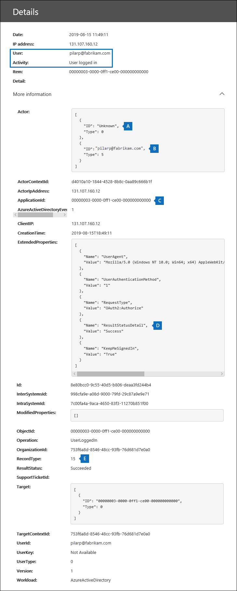

# <a name="search-the-audit-log-to-investigate-common-support-issues"></a>搜尋審計記錄檔，以調查常見的支援問題

本文說明如何使用「審核記錄搜尋」工具，協助您調查常見的支援問題。 這包括使用審核記錄來：

- 尋找用來存取已遭破壞之帳戶之電腦的 IP 位址
- 決定信箱的電子郵件轉發設定
- 決定使用者是否刪除其信箱中的電子郵件專案
- 決定使用者是否建立收件匣規則
- 調查組織外部使用者成功登入的原因

## <a name="using-the-audit-log-search-tool"></a>使用審核記錄搜尋工具

本文中所述的每一個疑難排解案例都是以安全性 & 規範中心內的「審核記錄搜尋」工具為基礎。 本節列出搜尋審核記錄所需的許可權，並說明存取及執行審核記錄搜尋的步驟。 每個案例區段都會說明如何設定審核記錄搜尋查詢，以及在符合搜尋準則之審核記錄的詳細資訊中要尋找的專案。

### <a name="permissions-required-to-use-the-audit-log-search-tool"></a>使用審核記錄搜尋工具所需的許可權

您必須獲指派「View-Only 審核記錄」或「審核記錄」角色在 Exchange Online 中，才可搜尋審核記錄。 根據預設，這些角色會在 Exchange 系統管理員中心的 [權限]**** 頁面上，指派給 [法務遵循管理] 和 [組織管理] 角色群組。 Office 365 和 Microsoft 365 中的全域系統管理員會自動新增為 Exchange Online 中「組織管理」角色群組的成員。 如需詳細資訊，請參閱[管理 Exchange Online 中的角色群組](https://go.microsoft.com/fwlink/p/?LinkID=730688)。

### <a name="running-audit-log-searches"></a>執行審核記錄搜尋

本節說明建立及執行審核記錄搜尋的基本概念。 請使用這些指示做為本文中每個疑難排解案例的開始點。 如需詳細的逐步指示，請參閱[搜尋審核記錄](search-the-audit-log-in-security-and-compliance.md#step-1-run-an-audit-log-search)檔。

1. 移至[https://protection.office.com/unifiedauditlog](https://protection.office.com/unifiedauditlog)並使用您的公司或學校帳戶登入。
    
    [稽核記錄搜尋]**** 頁面隨即顯示。 
    
    ![設定準則，然後選取 [搜尋] 以執行搜尋](../media/8639d09c-2843-44e4-8b4b-9f45974ff7f1.png)
  
4. 您可以設定下列搜尋準則。 本文中的每個疑難排解案例都建議您設定這些欄位的特定指導方針。
    
    a. **活動：** 選取下拉式清單，以顯示您可以搜尋的活動。 執行搜尋後，只會顯示所選活動的審計記錄。 選取 [**顯示所有活動的結果**]，會顯示符合其他搜尋準則之所有活動的結果。 在某些疑難排解案例中，您也必須將此欄位保留空白。
    
    b. **開始日期**和**結束日期：** 選取日期和時間範圍可顯示在該期間內發生的事件。 預設會選取最後七天。 日期和時間以國際標準時間 (UTC) 格式表示。 您可以指定的最大日期範圍為 90 天。

    c. **使用者：** 在此方塊中按一下，然後選取一或多個使用者，以顯示的搜尋結果。 您在此方塊中選取之使用者所執行之選取活動的審計記錄會顯示在結果清單中。 若要傳回貴組織中所有使用者 (及服務帳戶) 的項目，請將此方塊保留空白。
    
    d. **檔、資料夾或網站：** 輸入部分或所有檔案或資料夾名稱，以搜尋與包含指定關鍵字之資料夾檔案相關的活動。 您也可以指定檔案或資料夾的 URL。 如果您使用 URL，請確定輸入完整 URL 路徑，或者，如果您只輸入 URL 的一部分，請勿包含任何特殊字元或空格。 若要傳回貴組織中所有檔案和資料夾的項目，請將此方塊保留空白。 在本文的所有疑難排解案例中，此欄位會保留空白。
    
5. 選取 [**搜尋**]，使用您的搜尋準則執行搜尋。 
    
    搜尋結果會經過載入，然後在 [**審計記錄檔搜尋**] 頁面的 [**結果**] 底下出現片刻之後。 本文中的每一節都提供在特定疑難排解案例內容中所要尋找之專案的指引。

    如需查看、篩選或匯出審計記錄搜尋結果的詳細資訊，請參閱：

    - [查看搜尋結果](search-the-audit-log-in-security-and-compliance.md#step-2-view-the-search-results)
    - [篩選搜尋結果](search-the-audit-log-in-security-and-compliance.md#step-3-filter-the-search-results)
    - [匯出搜尋結果](search-the-audit-log-in-security-and-compliance.md#step-4-export-the-search-results-to-a-file)

## <a name="find-the-ip-address-of-the-computer-used-to-access-a-compromised-account"></a>尋找用來存取已遭破壞之帳戶之電腦的 IP 位址

與任何使用者執行的活動相對應的 IP 位址會包含在大部分的審計記錄中。 有關所使用之用戶端的資訊也會包含在審計記錄中。

以下說明如何為此案例設定審核記錄搜尋查詢：

**活動：** 如果與您的案例相關，請選取要搜尋的特定活動。 若要疑難排解已遭破壞的帳戶，請考慮選取 [ **Exchange 信箱活動**] 底下的 [**使用者已登入信箱**活動]。 這會傳回審計記錄，顯示登入信箱時所使用的 IP 位址。 否則，請將此欄位保留空白，以傳回所有活動的審計記錄。 

> [!TIP]
> 將此欄位保留空白將會傳回**UserLoggedIn**活動，也就是 Azure Active Directory 活動，表示某人已登入使用者帳戶。 在搜尋結果中使用篩選來顯示**UserLoggedIn**的審計記錄。

**開始日期**和**結束日期：** 選取適用于調查的日期範圍。

**使用者：** 如果您正在調查已遭破壞的帳戶，請選取其帳戶已遭破壞的使用者。 這會傳回由該使用者帳戶執行之活動的審計記錄。

**檔、資料夾或網站：** 請將此欄位保留空白。

執行搜尋後，每個活動的 IP 位址會顯示在搜尋結果的 [ **ip 位址**] 欄中。 選取搜尋結果中的記錄，以查看彈出頁面上的詳細資訊。

## <a name="determine-who-set-up-email-forwarding-for-a-mailbox"></a>決定信箱的電子郵件轉發設定

為信箱設定電子郵件轉寄時，傳送至信箱的電子郵件會轉送到另一個信箱。 郵件可以轉寄給組織內部或外部的使用者。 在信箱上設定電子郵件轉寄時，所使用的基礎 Exchange Online Cmdlet 會**Set-Mailbox**。

以下說明如何為此案例設定審核記錄搜尋查詢：

**活動：** 將此欄位保留空白，讓搜尋傳回所有活動的審計記錄。 若要傳回與**Set-Mailbox** Cmdlet 相關的任何審計記錄，必須這麼做。

**開始日期**和**結束日期：** 選取適用于調查的日期範圍。

**使用者：** 除非您要調查特定使用者的電子郵件轉接問題，否則請將此欄位保留空白。 這可協助您識別是否為任何使用者設定電子郵件轉寄功能。

**檔、資料夾或網站：** 請將此欄位保留空白。

執行搜尋之後，請選取搜尋結果頁面上的 [**篩選結果**]。 在 [**活動**] 欄標頭下方的方塊中，輸入**Set-Mailbox** ，只顯示與**Set-Mailbox** Cmdlet 相關的審計記錄。


此時，您必須查看每個審計記錄的詳細資料，以判斷該活動是否與電子郵件轉寄有關。 選取 [審計記錄] 以顯示 [**詳細資料**] 飛出頁面，然後選取 [**詳細資訊**]。 下列螢幕擷取畫面和描述會反白顯示指出信箱上已設定電子郵件轉寄的資訊。


a. 在 [ **ObjectId** ] 欄位中，會顯示已設定電子郵件轉寄功能之信箱的別名。 此信箱也會顯示在搜尋結果頁面的 [**專案**] 欄中。

b. 在 [**參數**] 欄位中，值*ForwardingSmtpAddress*指出信箱上已設定電子郵件轉寄功能。 在此範例中，郵件會轉寄至電子郵件地址 mike@contoso.com，該位址位於 alpinehouse.onmicrosoft.com 組織外。

c. *DeliverToMailboxAndForward*參數的*True*值表示郵件副本會傳遞至 sarad@alpinehouse.onmicrosoft.com *，並*轉送到*ForwardingSmtpAddress*參數所指定的電子郵件地址，在此範例中是 mike@contoso.com。 如果*DeliverToMailboxAndForward*參數的值設為*False*，則電子郵件只會轉寄給*ForwardingSmtpAddress*參數所指定的位址。 它不會傳送至 [ **ObjectId** ] 欄位中指定的信箱。

d. [ **UserId** ] 欄位會指出在**ObjectId** ] 欄位中指定的信箱上設定電子郵件轉寄的使用者。 此使用者也會顯示在搜尋結果頁面上的 [**使用者**] 欄中。 在此情況下，似乎是信箱的擁有者在信箱上設定電子郵件轉寄。

如果您決定不應該在信箱上設定電子郵件轉寄功能，您可以在 Exchange Online 中執行下列命令，以移除電子郵件轉接 PowerShell:

```powershell
Set-Mailbox <mailbox alias> -ForwardingSmtpAddress $null 
```

如需與電子郵件轉寄相關之參數的詳細資訊，請參閱[Set-Mailbox](https://docs.microsoft.com/powershell/module/exchange/mailboxes/set-mailbox)文章。

## <a name="determine-if-a-user-deleted-email-items"></a>決定使用者是否刪除電子郵件專案

從2019年1月開始，Microsoft 預設會針對所有 Office 365 和 Microsoft 組織開啟信箱審核記錄。 這表示會自動記錄信箱擁有者執行的某些動作，當您在信箱審核記錄檔中搜尋時，會提供對應的信箱審計記錄。 在信箱審核預設為開啟狀態之前，您必須針對組織中的每個使用者信箱手動啟用它。 

預設會記錄的信箱動作包括信箱擁有者執行的 SoftDelete 和 HardDelete 信箱動作。 這表示您可以使用下列步驟，在審計記錄檔中搜尋與已刪除之電子郵件專案相關的事件。 如需預設信箱審核的詳細資訊，請參閱[管理信箱審核](enable-mailbox-auditing.md)。

以下說明如何為此案例設定審核記錄搜尋查詢：

**活動：** 在 [ **Exchange 信箱活動**] 底下，選取下列其中一個或兩個活動：

- **從 [刪除的郵件] 資料夾刪除郵件：** 此活動對應于「 **SoftDelete**信箱審核」動作。 當使用者依序選取專案並按**Shift+Delete**，也會記錄此活動。 永久刪除專案之後，使用者可以復原它，直到刪除的專案保留期間到期為止。

- 已**清除信箱中的郵件：** 此活動對應于「 **HardDelete**信箱審核」動作。 當使用者從 [可復原的專案] 資料夾中清除專案時，就會記錄這種情況。 系統管理員可以使用「安全性與合規性中心」中的內容搜尋工具來搜尋及復原清除的專案，直到已刪除的專案保留期間到期或超過使用者的信箱處於保留狀態為止。

**開始日期**和**結束日期：** 選取適用于調查的日期範圍。

**使用者：**[！注意] 如果您在此欄位中選取使用者，則 [審核記錄] 搜尋工具會傳回您指定之使用者所刪除之電子郵件專案（SoftDeleted 或 HardDeleted）的審計記錄。 有時候刪除電子郵件的使用者可能不是信箱擁有者。

**檔、資料夾或網站：** 請將此欄位保留空白。

執行搜尋之後，您可以篩選搜尋結果，以顯示虛刪除專案或實刪除專案的審計記錄。 選取 [審計記錄] 以顯示 [**詳細資料**] 飛出頁面，然後選取 [**詳細資訊**]。 在 [ **AffectedItems** ] 欄位中會顯示刪除專案的其他資訊，例如專案的主旨行和位置。 下列螢幕擷取畫面顯示虛刪除專案和實刪除專案**AffectedItems**欄位的範例。

**虛刪除專案之 AffectedItems 欄位的範例**


**實刪除專案之 AffectedItems 欄位的範例**


### <a name="recover-deleted-email-items"></a>復原已刪除的電子郵件專案

如果刪除的郵件保留期間尚未到期，使用者可以復原虛刪除的專案。 在 Exchange Online 中，預設已刪除郵件的保留期間為14天，但是系統管理員可將此設定增加為最長30天。 請使用者在[Outlook 網頁版中的 [復原刪除的郵件] 或 [電子郵件](https://support.office.com/article/Recover-deleted-items-or-email-in-Outlook-Web-App-C3D8FC15-EEEF-4F1C-81DF-E27964B7EDD4)]，以取得復原已刪除專案的指示。

如先前所述，當已刪除專案的保留期間尚未到期或信箱處於保留狀態時，系統管理員可能能夠復原已刪除的專案，在此情況下，會保留專案，直到保留期間到期為止。 當您執行內容搜尋時，[可復原的專案] 資料夾中的虛刪除和實刪除專案會在搜尋結果中傳回，如果符合搜尋查詢。 如需有關執行內容搜尋的詳細資訊，請參閱[內容搜尋 In Office 365](content-search.md)。

> [!TIP]
> 若要搜尋刪除的電子郵件專案，請搜尋在審計記錄的 [ **AffectedItems** ] 欄位中顯示的全部或部分主旨行。

## <a name="determine-if-a-user-created-an-inbox-rule"></a>決定使用者是否建立收件匣規則

當使用者建立其 Exchange Online 信箱的收件匣規則時，對應的審計記錄會儲存至審計記錄檔。 如需收件匣規則的相關資訊，請參閱：

- [在 web 上的 Outlook 中使用收件匣規則](https://support.office.com/article/use-inbox-rules-in-outlook-on-the-web-8400435c-f14e-4272-9004-1548bb1848f2)
- [使用規則管理 Outlook 中的電子郵件](https://support.office.com/article/Manage-email-messages-by-using-rules-C24F5DEA-9465-4DF4-AD17-A50704D66C59)

以下說明如何為此案例設定審核記錄搜尋查詢：

**活動：** 在 [ **Exchange 信箱活動**] 底下，選取 [ **New-InboxRule 建立/修改/啟用/停用收件匣規則**]。

**開始日期**和**結束日期：** 選取適用于調查的日期範圍。

**使用者：** 除非您要調查特定的使用者，否則請將此欄位保留空白。 這可協助您識別任何使用者設定的新收件匣規則。

**檔、資料夾或網站：** 請將此欄位保留空白。

執行搜尋後，此活動的任何審計記錄會顯示在搜尋結果中。 選取要顯示 [**詳細資料**] 飛出頁面的審計記錄，然後選取 [**詳細資訊**]。 [**參數**] 欄位中會顯示 [收件匣規則] 設定的相關資訊。 下列螢幕擷取畫面和描述會反白顯示收件匣規則的相關資訊。


a. 在 [ **ObjectId** ] 欄位中，會顯示 [收件匣規則] 的完整名稱。 此名稱包含使用者信箱的別名（例如，SaraD）和收件匣規則的名稱（例如，「從系統管理員移動郵件」）。

b. 在 [**參數**] 欄位中，會顯示 [收件匣規則] 的條件。 在此範例中，條件是由*From*參數指定。 為*From*參數定義的值表示收件匣規則會作用於 admin@alpinehouse.onmicrosoft.com 所傳送的電子郵件。 如需可用於定義收件匣規則條件的完整參數清單，請參閱[New-InboxRule](https://docs.microsoft.com/powershell/module/exchange/mailboxes/new-inboxrule)文章。

c. *MoveToFolder*參數會指定收件匣規則的動作。 在此範例中，從 admin@alpinehouse.onmicrosoft.com 收到的郵件會移至名為*AdminSearch*的資料夾。 另請參閱[New-InboxRule](https://docs.microsoft.com/powershell/module/exchange/mailboxes/new-inboxrule)文章，以取得可用於定義收件匣規則動作的完整參數清單。

d. [ **UserId** ] 欄位會指出建立 [ **ObjectId** ] 欄位中指定的收件匣規則的使用者。 此使用者也會顯示在搜尋結果頁面上的 [**使用者**] 欄中。

## <a name="investigate-why-there-was-a-successful-login-by-a-user-outside-your-organization"></a>調查組織外部使用者成功登入的原因

在審核記錄中檢查審計記錄時，您可能會看到指出外部使用者已透過 Azure Active Directory 驗證，且已成功登入組織的記錄。 例如，contoso.onmicrosoft.com 中的系統管理員可能會看到一個審計記錄，顯示不同組織中的使用者（例如，fabrikam.onmicrosoft.com）已成功登入 contoso.onmicrosoft.com。 同樣地，您可能會看到審計記錄指出使用 Microsoft 帳戶（MSA）的使用者（如 Outlook.com 或 Live.com）已成功登入您的組織。 在這些情況下，已審核的活動為**使用者登入**。 

這是設計方式。 當外部使用者嘗試存取 SharePoint 網站或組織中的 OneDrive 位置時，azure Active Directory （Azure AD）和目錄服務可讓稱為*傳遞驗證*的內容。 當外部使用者嘗試這麼做時，系統會提示他們輸入認證。 Azure AD 使用認證來驗證使用者，這表示只有 Azure AD 驗證使用者是其所聲稱的使用者。 在審計記錄中成功登入的指示是 Azure AD 驗證使用者的結果。 成功的登入並不表示使用者能夠存取任何資源或在您的組織中執行其他任何動作。 它只會指出使用者已由 Azure AD 進行驗證。 為了讓透過使用者能夠存取 SharePoint 或 OneDrive 資源，貴組織中的使用者必須透過傳送共用邀請或匿名共用連結，明確地與外部使用者共用資源。 

> [!NOTE]
> Azure AD 只允許*第一方應用程式*的傳遞驗證，例如 SharePoint 線上和商務 OneDrive。 不允許其他協力廠商應用程式。

以下是已**登入**事件（即傳遞驗證的結果）之審核記錄中相關屬性的範例及描述。 選取 [審計記錄] 以顯示 [**詳細資料**] 飛出頁面，然後選取 [**詳細資訊**]。



   a. 此欄位指出在組織的 Azure AD 中找不到嘗試存取您組織中之資源的使用者。

   b. 此欄位會顯示嘗試存取組織中資源的外部使用者的 UPN。 此使用者識別碼也會在**使用者**中識別，並**UserId**審計記錄中的屬性。

   c. **ApplicationId**屬性可識別觸發登入要求的應用程式。 此審計記錄中 ApplicationId 屬性所顯示的00000003-0000-0ff1-ce00-000000000000 值會指出 SharePoint 線上。 OneDrive 商務用 ApplicationId 也相同。

   d. 這表示透過驗證成功。 換句話說，使用者已透過 Azure AD 成功驗證。 

   e. **RecordType**值為**15**表示已審核的活動（USERLOGGEDIN）是 Azure AD 中的安全權杖服務（STS）登入事件。

如需 UserLoggedIn 審計記錄中所顯示之其他屬性的詳細資訊，請參閱[Office 365 管理活動 API 架構](https://docs.microsoft.com/office/office-365-management-api/office-365-management-activity-api-schema#azure-active-directory-base-schema)中的 Azure AD 相關架構資訊。

以下兩個範例案例會導致成功的使用者因透過驗證而**登入**審核活動： 

  - 使用 Microsoft 帳戶（例如，SaraD@outlook.com）的使用者已嘗試在 fourthcoffee.onmicrosoft.com 中存取商務用 OneDrive for Business 帳戶中的檔，但沒有 fourthcoffee.onmicrosoft.com 中 SaraD@outlook.com 的對應來賓使用者帳戶。

  - 組織中有工作或學校帳戶的使用者（例如 pilarp@fabrikam.onmicrosoft.com）已嘗試存取 contoso.onmicrosoft.com 中的 SharePoint 網站，但沒有 contoso.onmicrosoft.com 中 pilarp@fabrikam.com 的對應來賓使用者帳戶。


### <a name="tips-for-investigating-successful-logins-resulting-from-pass-through-authentication"></a>透過透過驗證來調查成功登入的秘訣

- 搜尋審計記錄檔，以瞭解在**使用者登入**的審計記錄中所識別的外部使用者所執行的活動。 在 [**使用者**] 方塊中輸入外部使用者的 UPN，並使用與您的案例相關的日期範圍。 例如，您可以使用下列搜尋準則來建立搜尋：

   

    除了**使用者登入**的活動之外，還可以傳回其他的審計記錄，例如，用來指出組織中的使用者與外部使用者共用資源，以及外部使用者是否存取、修改或下載已與其共用的檔。

- 搜尋 SharePoint 的共用活動，該活動會指出與**已登入**審計記錄之使用者所識別的外部使用者共用檔案。 如需詳細資訊，請參閱[在審核記錄中使用共用審核](use-sharing-auditing.md)。

- 匯出包含調查相關記錄的審計記錄搜尋結果，以便您可以使用 Excel 來搜尋與外部使用者相關的其他活動。 如需詳細資訊，請參閱[Export、configure 及 view audit log 記錄](export-view-audit-log-records.md)。
