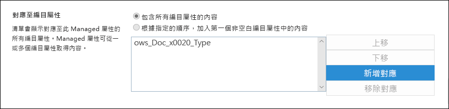
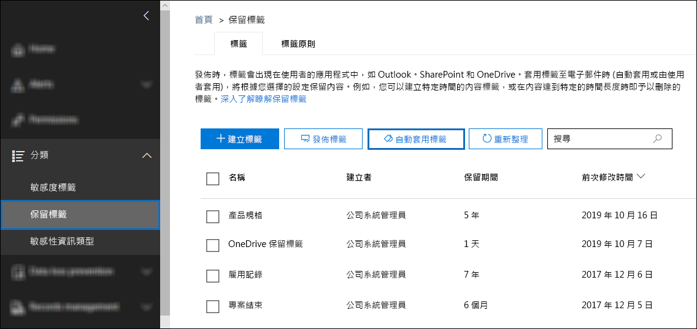
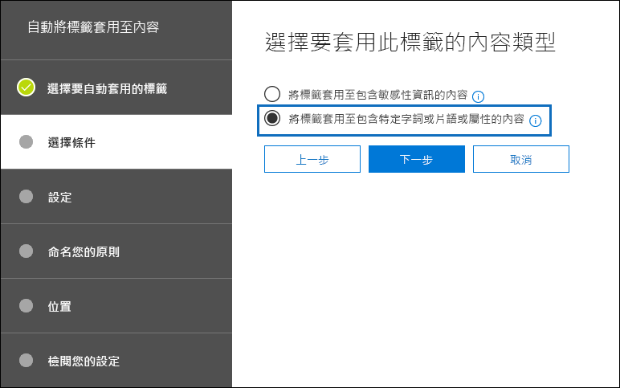
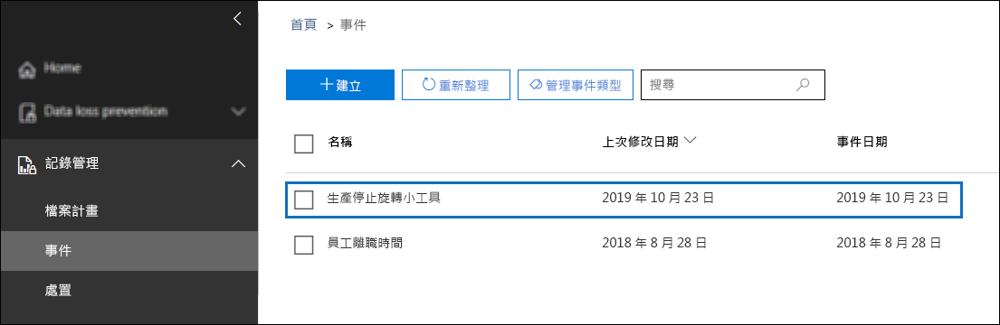

# <a name="use-retention-labels-to-manage-the-lifecycle-of-documents-stored-in-sharepoint"></a><span data-ttu-id="5af59-103">使用保留標籤來管理儲存在 SharePoint 中的文件生命週期</span><span class="sxs-lookup"><span data-stu-id="5af59-103">Use retention labels to manage the lifecycle of documents stored in SharePoint</span></span>

><span data-ttu-id="5af59-104">*[Microsoft 365 安全性與合規性的授權指引](/office365/servicedescriptions/microsoft-365-service-descriptions/microsoft-365-tenantlevel-services-licensing-guidance/microsoft-365-security-compliance-licensing-guidance)。*</span><span class="sxs-lookup"><span data-stu-id="5af59-104">*[Microsoft 365 licensing guidance for security & compliance](/office365/servicedescriptions/microsoft-365-service-descriptions/microsoft-365-tenantlevel-services-licensing-guidance/microsoft-365-security-compliance-licensing-guidance).*</span></span>

<span data-ttu-id="5af59-105">本文描述如何使用自動套用的保留標籤和事件型保留來管理儲存在 SharePoint 中的文件生命週期。</span><span class="sxs-lookup"><span data-stu-id="5af59-105">This article describes how you can manage the lifecycle of documents that are stored in SharePoint by using automatically applied retention labels and event-based retention.</span></span>

<span data-ttu-id="5af59-106">自動套用功能會使用 SharePoint 中繼資料來進行文件分類。</span><span class="sxs-lookup"><span data-stu-id="5af59-106">The auto-apply functionality uses SharePoint metadata for document classification.</span></span> <span data-ttu-id="5af59-107">本文中的範例用於與產品相關的文件，但是相同的概念也可用於其他案例。</span><span class="sxs-lookup"><span data-stu-id="5af59-107">The example in this article is for product-related documents, but the same concepts can be used for other scenarios.</span></span> <span data-ttu-id="5af59-108">例如，在石油與天然氣產業，您可以將其用於管理與石油平台、鑽井記錄或生產授權等實體資產相關文件的生命週期。</span><span class="sxs-lookup"><span data-stu-id="5af59-108">For example, in the oil and gas industry, you could use it to manage the lifecycle of documents about physical assets such as oil platforms, well logs, or production licenses.</span></span> <span data-ttu-id="5af59-109">在金融服務產業，您可以管理銀行帳戶、貸款或保險合約文件。</span><span class="sxs-lookup"><span data-stu-id="5af59-109">In the financial services industry, you could manage bank account, mortgage, or insurance contract documents.</span></span> <span data-ttu-id="5af59-110">在公共部門，您可以管理施工許可證或稅務表單。</span><span class="sxs-lookup"><span data-stu-id="5af59-110">In the public sector, you could manage construction permits or tax forms.</span></span>

<span data-ttu-id="5af59-111">在本文中，我們將探討資訊架構和保留標籤的定義。</span><span class="sxs-lookup"><span data-stu-id="5af59-111">In this article, we'll look at the information architecture and definition of the retention labels.</span></span> <span data-ttu-id="5af59-112">接著，我們將自動套用標籤，為文件分類。</span><span class="sxs-lookup"><span data-stu-id="5af59-112">Then we'll classify documents by auto-applying the labels.</span></span> <span data-ttu-id="5af59-113">最後，我們將產生起始保留期間的事件。</span><span class="sxs-lookup"><span data-stu-id="5af59-113">And finally we'll generate the events that initiate the retention period.</span></span>

## <a name="information-architecture"></a><span data-ttu-id="5af59-114">資訊架構</span><span class="sxs-lookup"><span data-stu-id="5af59-114">Information architecture</span></span>

<span data-ttu-id="5af59-115">我們的案例是一家製造公司，該公司使用 SharePoint 儲存所有與公司所開發產品相關的文件。</span><span class="sxs-lookup"><span data-stu-id="5af59-115">Our scenario is a manufacturing company that uses SharePoint to store all the documents about the products that the company develops.</span></span> <span data-ttu-id="5af59-116">這些文件包括產品規格、與供應商簽訂的協議和使用者手冊。</span><span class="sxs-lookup"><span data-stu-id="5af59-116">These documents include product specifications, agreements with suppliers, and user manuals.</span></span> <span data-ttu-id="5af59-117">在 SharePoint 中透過企業內容管理原則儲存這些文件時，便會定義將其用於分類的文件中繼資料。</span><span class="sxs-lookup"><span data-stu-id="5af59-117">When these documents are stored in SharePoint through Enterprise Content Management policies, document metadata is defined, which is used to classify them.</span></span> <span data-ttu-id="5af59-118">每份文件皆有下列中繼資料屬性：</span><span class="sxs-lookup"><span data-stu-id="5af59-118">Each document has the following metadata properties:</span></span>

- <span data-ttu-id="5af59-119">**文件類型** (例如產品規格、協議或使用者手冊)</span><span class="sxs-lookup"><span data-stu-id="5af59-119">**Doc Type** (such as product specification, agreement, or user manual)</span></span>

- <span data-ttu-id="5af59-120">**產品名稱**</span><span class="sxs-lookup"><span data-stu-id="5af59-120">**Product Name**</span></span>

- <span data-ttu-id="5af59-121">**狀態** (草稿或完稿)</span><span class="sxs-lookup"><span data-stu-id="5af59-121">**Status** (draft or final)</span></span>

<span data-ttu-id="5af59-122">此中繼資料會為所有文件形成名為 *Production Document* 的基本內容類型。</span><span class="sxs-lookup"><span data-stu-id="5af59-122">This metadata forms a base content type called *Production Document* for all the documents.</span></span>


> [!NOTE]
> <span data-ttu-id="5af59-124">在本案例稍後，保留原則會使用 **[文件類型]** 和 **[狀態]** 屬性進行分類，並自動套用保留標籤。</span><span class="sxs-lookup"><span data-stu-id="5af59-124">The **Doc Type** and **Status** properties are used by retention policies later in this scenario to classify and auto-apply retention labels.</span></span>

<span data-ttu-id="5af59-125">我們可能有數種表示不同文件類型的內容類型，但我們將焦點放在產品文件上。</span><span class="sxs-lookup"><span data-stu-id="5af59-125">We might have several content types that represent different types of documents, but let's focus on the product documentation.</span></span>

<span data-ttu-id="5af59-126">在此案例中，我們使用受管理的中繼資料服務和字詞庫，為 *文件類型* 建立一個字詞組，並為 *產品名稱* 建立另一個字詞組。</span><span class="sxs-lookup"><span data-stu-id="5af59-126">In this scenario, we use the Managed Metadata service and the Term Store to create a term set for *Doc Type* and another one for *Product Name*.</span></span> <span data-ttu-id="5af59-127">我們會針對每個字詞組，為每個值建立一個字詞。</span><span class="sxs-lookup"><span data-stu-id="5af59-127">For each term set, we create a term for each value.</span></span> <span data-ttu-id="5af59-128">在 SharePoint 組織的字詞庫中，看起來類似以下範例：</span><span class="sxs-lookup"><span data-stu-id="5af59-128">It would look like something like this in Term Store for your SharePoint organization:</span></span>


<span data-ttu-id="5af59-130">您可以使用 [內容類型中樞](https://support.office.com/article/manage-content-type-publishing-06f39ac0-5576-4b68-abbc-82b68334889b)建立及發佈 *內容類型*。</span><span class="sxs-lookup"><span data-stu-id="5af59-130">*Content Type* can be created and published by using the [Content Type Hub](https://support.office.com/article/manage-content-type-publishing-06f39ac0-5576-4b68-abbc-82b68334889b).</span></span> <span data-ttu-id="5af59-131">您也可以使用網站佈建工具 (例如 [PnP 佈建架構](/sharepoint/dev/solution-guidance/pnp-provisioning-framework)或[網站設計 JSON 架構](/sharepoint/dev/declarative-customization/site-design-json-schema#define-a-new-content-type)) 建立及發佈內容類型。</span><span class="sxs-lookup"><span data-stu-id="5af59-131">You can also create and publish a content type by using site provisioning tools, such as the [PnP provisioning framework](/sharepoint/dev/solution-guidance/pnp-provisioning-framework) or [site design JSON schema](/sharepoint/dev/declarative-customization/site-design-json-schema#define-a-new-content-type).</span></span>

<span data-ttu-id="5af59-p106">每個產品皆有一個專用的 SharePoint 網站，其中包含一個已啟用正確內容類型的文件庫。所有文件皆儲存在此文件庫中。</span><span class="sxs-lookup"><span data-stu-id="5af59-p106">Each product has a dedicated SharePoint site that contains one document library that has the right content types enabled. All documents are stored in this document library.</span></span>

<span data-ttu-id="5af59-134">[](../media/SPRetention3.png#lightbox)</span><span class="sxs-lookup"><span data-stu-id="5af59-134">[  ](../media/SPRetention3.png#lightbox)</span></span>

> [!NOTE]
> <span data-ttu-id="5af59-135">在此案例中，製造公司不會對每個產品皆使用一個 SharePoint 網站，而是對每個產品使用一個 Microsoft Team 來支援與小組成員共同作業 (例如，透過常設聊天室)，並使用 Teams 中的 **[檔案]** 索引標籤進行文件管理。</span><span class="sxs-lookup"><span data-stu-id="5af59-135">Instead of having a SharePoint site per product, the manufacturing company in this scenario could use a Microsoft Team per product to support collaboration among members of the team, such as through persistent chat, and use the **Files** tab in Teams for document management.</span></span> <span data-ttu-id="5af59-136">本文只著重於文件，因此我們只會使用網站。</span><span class="sxs-lookup"><span data-stu-id="5af59-136">In this article we only focus on documents, so, we'll only use a site.</span></span>

<span data-ttu-id="5af59-137">以下是「指尖陀螺」產品文件庫的檢視：</span><span class="sxs-lookup"><span data-stu-id="5af59-137">Here's a view of the document library for the Spinning Widget product:</span></span>

<span data-ttu-id="5af59-138">[](../media/SPRetention4.png#lightbox)</span><span class="sxs-lookup"><span data-stu-id="5af59-138">[  ](../media/SPRetention4.png#lightbox)</span></span>

<span data-ttu-id="5af59-139">既然我們擁有用於文件管理的基本資訊架構，讓我們來看看對於使用中繼資料之文件的保留和處置策略，以及如何為這些文件分類。</span><span class="sxs-lookup"><span data-stu-id="5af59-139">Now that we have the basic information architecture in place for document management, let's look at the retention and disposal strategy for the documents that use the metadata and how we classify those documents.</span></span>

## <a name="retention-and-disposition"></a><span data-ttu-id="5af59-140">保留和處置</span><span class="sxs-lookup"><span data-stu-id="5af59-140">Retention and disposition</span></span>

<span data-ttu-id="5af59-141">製造公司的合規性和資料控管原則會規定資料保留和處置的方式。</span><span class="sxs-lookup"><span data-stu-id="5af59-141">The manufacturing company's compliance and data governance policies dictate how data is preserved and disposed of.</span></span> <span data-ttu-id="5af59-142">產品相關文件必須在產品製造期間保留，並額外保留一段特定時間。</span><span class="sxs-lookup"><span data-stu-id="5af59-142">Product-related documents must be kept for as long as the product is manufactured and for a certain additional period.</span></span> <span data-ttu-id="5af59-143">這段額外的時間會因為產品規格、協議和使用者手冊而有所不同。</span><span class="sxs-lookup"><span data-stu-id="5af59-143">The additional period differs for product specifications, agreements, and user manuals.</span></span> <span data-ttu-id="5af59-144">下表指示保留和處置需求：</span><span class="sxs-lookup"><span data-stu-id="5af59-144">The following table indicates the retention and disposition requirements:</span></span>

|   <span data-ttu-id="5af59-145">文件類型</span><span class="sxs-lookup"><span data-stu-id="5af59-145">Document type</span></span>            |   <span data-ttu-id="5af59-146">保留</span><span class="sxs-lookup"><span data-stu-id="5af59-146">Retention</span></span>                            |   <span data-ttu-id="5af59-147">處置</span><span class="sxs-lookup"><span data-stu-id="5af59-147">Disposition</span></span>                                |
| -------------------------- | -------------------------------------- | -------------------------------------------- |
| <span data-ttu-id="5af59-148">產品規格</span><span class="sxs-lookup"><span data-stu-id="5af59-148">Product specifications</span></span>      | <span data-ttu-id="5af59-149">停產後 5 年</span><span class="sxs-lookup"><span data-stu-id="5af59-149">5 years after production stops</span></span>  | <span data-ttu-id="5af59-150">刪除</span><span class="sxs-lookup"><span data-stu-id="5af59-150">Delete</span></span>                                       |
| <span data-ttu-id="5af59-151">產品協議</span><span class="sxs-lookup"><span data-stu-id="5af59-151">Product agreements</span></span>          | <span data-ttu-id="5af59-152">停產後 10 年</span><span class="sxs-lookup"><span data-stu-id="5af59-152">10 years after production stops</span></span> | <span data-ttu-id="5af59-153">檢閱</span><span class="sxs-lookup"><span data-stu-id="5af59-153">Review</span></span>                                       |
| <span data-ttu-id="5af59-154">使用者手冊</span><span class="sxs-lookup"><span data-stu-id="5af59-154">User manuals</span></span>                | <span data-ttu-id="5af59-155">停產後 5 年</span><span class="sxs-lookup"><span data-stu-id="5af59-155">5 years after production stops</span></span>  | <span data-ttu-id="5af59-156">刪除</span><span class="sxs-lookup"><span data-stu-id="5af59-156">Delete</span></span>                                       |
| <span data-ttu-id="5af59-157">其他所有類型的文件</span><span class="sxs-lookup"><span data-stu-id="5af59-157">All other types of documents</span></span> | <span data-ttu-id="5af59-158">不主動保留</span><span class="sxs-lookup"><span data-stu-id="5af59-158">Don't actively retain</span></span>  | <span data-ttu-id="5af59-159">在文件超過 3 年後刪除</span><span class="sxs-lookup"><span data-stu-id="5af59-159">Delete when document is older than 3 years</span></span> <br /><br /> <span data-ttu-id="5af59-160">如果文件在過去 3 年內未曾修改，便會視為超過 3 年。</span><span class="sxs-lookup"><span data-stu-id="5af59-160">A document is considered older than 3 years if it hasn't been modified within the last 3 years.</span></span> |
|||

<span data-ttu-id="5af59-161">我們會使用 Microsoft 365 合規性中心建立下列[保留標籤](retention.md#retention-labels)：</span><span class="sxs-lookup"><span data-stu-id="5af59-161">We use the Microsoft 365 compliance center to create the following [retention labels](retention.md#retention-labels):</span></span>

  - <span data-ttu-id="5af59-162">產品規格</span><span class="sxs-lookup"><span data-stu-id="5af59-162">Product Specification</span></span>

  - <span data-ttu-id="5af59-163">產品協議</span><span class="sxs-lookup"><span data-stu-id="5af59-163">Product Agreement</span></span>

  - <span data-ttu-id="5af59-164">使用者手冊</span><span class="sxs-lookup"><span data-stu-id="5af59-164">User Manual</span></span>

<span data-ttu-id="5af59-165">在本文中，我們僅示範如何建立及自動套用產品規格保留標籤。</span><span class="sxs-lookup"><span data-stu-id="5af59-165">In this article, we only show how to create and auto-apply the Product Specification retention label.</span></span> <span data-ttu-id="5af59-166">若要實作完整案例，您也要為其他兩種文件類型建立及自動套用保留標籤。</span><span class="sxs-lookup"><span data-stu-id="5af59-166">To implement the complete scenario, you would also create and auto-apply retention labels for the other two document types.</span></span>

### <a name="settings-for-the-product-specification-retention-label"></a><span data-ttu-id="5af59-167">產品規格保留標籤的設定</span><span class="sxs-lookup"><span data-stu-id="5af59-167">Settings for the Product Specification retention label</span></span>

<span data-ttu-id="5af59-168">以下是產品規格保留標籤的[檔案計畫](file-plan-manager.md)：</span><span class="sxs-lookup"><span data-stu-id="5af59-168">Here's the [file plan](file-plan-manager.md) for the Product Specification retention label:</span></span>

- <span data-ttu-id="5af59-169">**名稱：** 產品規格</span><span class="sxs-lookup"><span data-stu-id="5af59-169">**Name:** Product Specification</span></span>

- <span data-ttu-id="5af59-170">**使用者描述：** 停產後保留 5 年。</span><span class="sxs-lookup"><span data-stu-id="5af59-170">**Description for users:** Retain for 5 years after production stops.</span></span>

- <span data-ttu-id="5af59-171">**系統管理員描述：** 停產後保留 5 年、自動刪除、事件型保留、事件類型為 *產品停產*。</span><span class="sxs-lookup"><span data-stu-id="5af59-171">**Description for admins:** Retain for 5 years after production stops, auto delete, event-based retention, event type is *Product Cessation*.</span></span>

- <span data-ttu-id="5af59-172">**保留動作：** 保留及刪除。</span><span class="sxs-lookup"><span data-stu-id="5af59-172">**Retention action:** Retain and delete.</span></span>

- <span data-ttu-id="5af59-173">**保留期間：** 5 年 (1,825 天)。</span><span class="sxs-lookup"><span data-stu-id="5af59-173">**Retention duration:** 5 years (1,825 days).</span></span>

- <span data-ttu-id="5af59-174">**記錄標籤**：設定保留標籤以將項目標記為 [記錄](records-management.md#records)，這意味著使用者無法修改或删除已標記的檔案。</span><span class="sxs-lookup"><span data-stu-id="5af59-174">**Record label**: Configure the retention label to mark items as a [record](records-management.md#records), which means the labeled documents can't then be modified or deleted by users.</span></span>

- <span data-ttu-id="5af59-175">**檔案計畫描述元**：(用於簡化案例，不會提供選用檔案描述元)。</span><span class="sxs-lookup"><span data-stu-id="5af59-175">**File plan descriptors:** For simplifying the scenario, no optional file descriptors are provided.</span></span>

<span data-ttu-id="5af59-176">下列螢幕擷取畫面顯示在 Microsoft 365 合規性中心建立產品規格保留標籤時的設定。</span><span class="sxs-lookup"><span data-stu-id="5af59-176">The following screenshot shows the settings when you create the Product Specification retention label in the Microsoft 365 compliance center.</span></span> <span data-ttu-id="5af59-177">您可以在建立保留標籤時，建立 *產品停產* 事件類型。</span><span class="sxs-lookup"><span data-stu-id="5af59-177">You can create the *Product Cessation* event type when you create the retention label.</span></span> <span data-ttu-id="5af59-178">請參閱下一節中的程序。</span><span class="sxs-lookup"><span data-stu-id="5af59-178">See the procedure in the following section.</span></span>


> [!NOTE]
> <span data-ttu-id="5af59-180">為避免 5 年的文件刪除等待時間，如果您要在測試環境中重新建立此案例，請將保留期間設定為 ***[1 天]***。</span><span class="sxs-lookup"><span data-stu-id="5af59-180">To avoid a 5-year wait for document deletion, set the retention duration to ***1 day*** if you're recreating this scenario in a test environment.</span></span>

### <a name="create-an-event-type-when-you-create-a-retention-label"></a><span data-ttu-id="5af59-181">建立保留標籤時建立事件類型</span><span class="sxs-lookup"><span data-stu-id="5af59-181">Create an event type when you create a retention label</span></span>

1. <span data-ttu-id="5af59-182">在 **[建立保留標籤]** 的 [ 定義保留 設定] 頁面上，在 **[開始保留期依據]** 後，選擇 **[建立新事件類型]**：</span><span class="sxs-lookup"><span data-stu-id="5af59-182">On the **Define retention settings** page of the Create retention label wizard, after **Start the retention period based on**, select **Create new event type**:</span></span>

    

3. <span data-ttu-id="5af59-184">在 **[命名您的事件類型]** 頁面，輸入 **[產品停產]** 和選用描述。</span><span class="sxs-lookup"><span data-stu-id="5af59-184">On the **Name your event type** page, enter **Product Cessation** and an optional description.</span></span> <span data-ttu-id="5af59-185">然後選取 **[下一個]**、 **[提交]** 和 **[完成]**。</span><span class="sxs-lookup"><span data-stu-id="5af59-185">Then select **Next**, **Submit**, and **Done**.</span></span>

4. <span data-ttu-id="5af59-186">回到 **[定義保留設定]** 頁面，使用下拉式方塊選取您建立的 **[產品停產]** 事件類型作為 **[開始保留期依據]**。</span><span class="sxs-lookup"><span data-stu-id="5af59-186">Back on the **Define retention settings** page, for **Start the retention period based on**, use the dropdown box to select the **Product Cessation** event type that you created.</span></span>

    <span data-ttu-id="5af59-187">產品規格保留標籤的設定看起來會像這樣：</span><span class="sxs-lookup"><span data-stu-id="5af59-187">Here's what the settings look like for the Product Specification retention label:</span></span>

   

6. <span data-ttu-id="5af59-189">選取 **[建立標籤]** 並在下一頁看到發佈標籤、自動套用標籤或僅保存標籤的選項：選擇 **[立即儲存標籤]**，然後選擇 **[完成]**。</span><span class="sxs-lookup"><span data-stu-id="5af59-189">Select **Create label**, and on the next page when you see the options to publish the label, auto-apply the label, or just save the label: Select **Just save the label for now**, and then select **Done**.</span></span>

    > [!TIP]
    > <span data-ttu-id="5af59-190">如需更多詳細步驟，請參閱[建立其保留期間是根據事件的標籤](event-driven-retention.md#step-1-create-a-label-whose-retention-period-is-based-on-an-event)。</span><span class="sxs-lookup"><span data-stu-id="5af59-190">For more detailed steps, see [Create a label whose retention period is based on an event](event-driven-retention.md#step-1-create-a-label-whose-retention-period-is-based-on-an-event).</span></span>

<span data-ttu-id="5af59-191">現在來看看我們如何將保留標籤自動套用至產品規格內容。</span><span class="sxs-lookup"><span data-stu-id="5af59-191">Now let's look at how we'll auto-apply the retention label to product-specification content.</span></span>

## <a name="auto-apply-retention-labels-to-documents"></a><span data-ttu-id="5af59-192">自動套用保留標籤至文件</span><span class="sxs-lookup"><span data-stu-id="5af59-192">Auto-apply retention labels to documents</span></span>

<span data-ttu-id="5af59-193">我們將使用關鍵字查詢語言 (KQL) [自動套用](apply-retention-labels-automatically.md)我們所建立的保留標籤。</span><span class="sxs-lookup"><span data-stu-id="5af59-193">We're going to use Keyword Query Language (KQL) to [auto-apply](apply-retention-labels-automatically.md) the retention labels that we created.</span></span> <span data-ttu-id="5af59-194">KQL 是用於建立搜尋查詢的語言。</span><span class="sxs-lookup"><span data-stu-id="5af59-194">KQL is the language that's used to build search queries.</span></span> <span data-ttu-id="5af59-195">您可以在 KQL 中使用關鍵字或 Managed 屬性進行搜尋。</span><span class="sxs-lookup"><span data-stu-id="5af59-195">In KQL, you can search by using keywords or managed properties.</span></span> <span data-ttu-id="5af59-196">如需詳細資訊，請參閱[關鍵字查詢語言 (KQL) 語法參考](/sharepoint/dev/general-development/keyword-query-language-kql-syntax-reference)。</span><span class="sxs-lookup"><span data-stu-id="5af59-196">For more information, see [Keyword Query Language (KQL) syntax reference](/sharepoint/dev/general-development/keyword-query-language-kql-syntax-reference).</span></span>

<span data-ttu-id="5af59-197">基本上，我們想要讓 Microsoft 365「將 **產品規格** 保留標籤套用至所有 **狀態** 為 **完稿**，且 **文件類型** 為 **產品規格** 的文件」。</span><span class="sxs-lookup"><span data-stu-id="5af59-197">Basically, we want to tell Microsoft 365 to "apply the **Product Specification** retention label to all documents that have a **Status** of **Final** and a **Doc Type** of **Product Specification**."</span></span> <span data-ttu-id="5af59-198">請記住，**[狀態]** 和 **[文件類型]** 是在 [資訊架構](#information-architecture)一節中為產品文件內容類型定義的網站欄。</span><span class="sxs-lookup"><span data-stu-id="5af59-198">Recall that **Status** and **Doc Type** are the site columns that we defined for the Product Documentation content type in the [Information architecture](#information-architecture) section.</span></span> <span data-ttu-id="5af59-199">為了完成此操作，我們需要設定搜尋結構描述。</span><span class="sxs-lookup"><span data-stu-id="5af59-199">To do this, we need to configure the search schema.</span></span>

<span data-ttu-id="5af59-200">當 SharePoint 為內容編制索引時，便會自動為每個網站欄產生編目屬性。</span><span class="sxs-lookup"><span data-stu-id="5af59-200">When SharePoint indexes content, it automatically generates crawled properties for each site column.</span></span> <span data-ttu-id="5af59-201">在此案例中，我們想要了解 **文件類型** 和 **狀態** 屬性。</span><span class="sxs-lookup"><span data-stu-id="5af59-201">For this scenario, we're interested in the **Doc Type** and **Status** properties.</span></span> <span data-ttu-id="5af59-202">我們需要使用正確內容類型的文件庫中的文件，並填入要搜尋的網站欄，以建立編目屬性。</span><span class="sxs-lookup"><span data-stu-id="5af59-202">We need documents in the library that are the right content type and have the site columns filled in for search to create the crawled properties.</span></span>

<span data-ttu-id="5af59-203">在 SharePoint 系統管理中心，開啟 [搜尋] 設定，然後選取 **[管理搜尋結構描述]** 以檢視及設定編目屬性。</span><span class="sxs-lookup"><span data-stu-id="5af59-203">In the SharePoint admin center, open the Search configuration, and select **Manage Search Schema** to view and configure the crawled properties.</span></span>


<span data-ttu-id="5af59-205">如果我們在_ *編目屬性\*\*方塊中輸入\*\*\*狀態*\* _，然後選取綠色箭號，則會看到如下結果：</span><span class="sxs-lookup"><span data-stu-id="5af59-205">If we type ***status** _ in the _ *Crawled properties** box and select the green arrow, we should see a result like this:</span></span>


<span data-ttu-id="5af59-207">**ows\_\_Status** 屬性 (請注意雙底線) 是我們想了解的屬性。</span><span class="sxs-lookup"><span data-stu-id="5af59-207">The **ows\_\_Status** property (notice the double underscore) is the one that interests us.</span></span> <span data-ttu-id="5af59-208">這會對應到生產文件內容類型的 **[狀態]** 屬性。</span><span class="sxs-lookup"><span data-stu-id="5af59-208">It maps to the **Status** property of the Production Document content type.</span></span>

<span data-ttu-id="5af59-209">現在，如果輸入 ***ows\_doc***，然後選取綠色箭號，應該會看到如下所示的內容：</span><span class="sxs-lookup"><span data-stu-id="5af59-209">Now, if we type ***ows\_doc*** and select the green arrow, we should see something like this:</span></span>


<span data-ttu-id="5af59-211">**ows\_Doc\_x0020\_Type** 屬性是我們想了解的第二個屬性。</span><span class="sxs-lookup"><span data-stu-id="5af59-211">The **ows\_Doc\_x0020\_Type** property is the second property that interests us.</span></span> <span data-ttu-id="5af59-212">這會對應到生產文件內容類型的 **[文件類型]** 屬性。</span><span class="sxs-lookup"><span data-stu-id="5af59-212">It maps to the **Doc Type** property of the Production Document content type.</span></span>

> [!TIP]
> <span data-ttu-id="5af59-213">若要識別此案例的編目屬性名稱，請移至包含生產文件的文件庫。</span><span class="sxs-lookup"><span data-stu-id="5af59-213">To identify the name of a crawled property for this scenario, go to the document library that contains the production documents.</span></span> <span data-ttu-id="5af59-214">接著，移至文件庫設定。</span><span class="sxs-lookup"><span data-stu-id="5af59-214">Then go to the library settings.</span></span> <span data-ttu-id="5af59-215">在 **[欄]** 中，選取欄的名稱 (例如 **Status** 或 **Doc Type**) 以開啟網站欄頁面。</span><span class="sxs-lookup"><span data-stu-id="5af59-215">For **Columns**, select the name of the column (for example, **Status** or **Doc Type**) to open the site column page.</span></span> <span data-ttu-id="5af59-216">該網頁 URL 中的 *Field* 參數包含欄位的名稱。</span><span class="sxs-lookup"><span data-stu-id="5af59-216">The *Field* parameter in the URL for that page contains the name of the field.</span></span> <span data-ttu-id="5af59-217">此欄位名稱 (以「ows_」開頭) 是編目屬性的名稱。</span><span class="sxs-lookup"><span data-stu-id="5af59-217">This field name, prefixed with "ows_", is the name of the crawled property.</span></span> <span data-ttu-id="5af59-218">例如，URL `https://tenantname.sharepoint.com/sites/SpinningWidget/_layouts/15/FldEdit.aspx?List=%7BC38C2F45-3BD6-4C3B-AA3B-EF5DF6B3D172%7D&Field=_Status` 對應至 *ows\_\_Status* 編目屬性。</span><span class="sxs-lookup"><span data-stu-id="5af59-218">For example, the URL `https://tenantname.sharepoint.com/sites/SpinningWidget/_layouts/15/FldEdit.aspx?List=%7BC38C2F45-3BD6-4C3B-AA3B-EF5DF6B3D172%7D&Field=_Status` corresponds to the *ows\_\_Status* crawled property.</span></span>

<span data-ttu-id="5af59-219">如果您要尋找的編目屬性並未出現在 SharePoint 系統管理中心的 [管理搜尋結構描述] 區段中：</span><span class="sxs-lookup"><span data-stu-id="5af59-219">If the crawled properties you're looking for don't appear in the Manage Search Schema section in SharePoint admin center:</span></span>

- <span data-ttu-id="5af59-220">可能是文件未編制索引。</span><span class="sxs-lookup"><span data-stu-id="5af59-220">Maybe the documents haven't been indexed.</span></span> <span data-ttu-id="5af59-221">您可以移至 **[文件庫設定]** > **[進階設定]** 以強制重新編制文件庫的索引。</span><span class="sxs-lookup"><span data-stu-id="5af59-221">You can force a reindex of the library by going to **Document library settings** > **Advanced Settings**.</span></span>

- <span data-ttu-id="5af59-222">如果文件庫位於新式網站，請確認 SharePoint 系統管理員也是網站集合系統管理員。</span><span class="sxs-lookup"><span data-stu-id="5af59-222">If the document library is in a modern site, make sure that the SharePoint admin is also a site collection admin.</span></span>

<span data-ttu-id="5af59-223">如需編目屬性和 Managed 屬性的詳細資訊，請參閱＜[在 SharePoint Server 中自動建立 Managed 屬性](/sharepoint/technical-reference/automatically-created-managed-properties-in-sharepoint)＞。</span><span class="sxs-lookup"><span data-stu-id="5af59-223">For more information about crawled and managed properties, see [Automatically created managed properties in SharePoint Server](/sharepoint/technical-reference/automatically-created-managed-properties-in-sharepoint).</span></span>

### <a name="map-crawled-properties-to-pre-defined-managed-properties"></a><span data-ttu-id="5af59-224">將編目屬性對應到預先定義的 Managed 屬性</span><span class="sxs-lookup"><span data-stu-id="5af59-224">Map crawled properties to pre-defined managed properties</span></span>

<span data-ttu-id="5af59-225">KQL 無法在搜尋查詢中使用編目屬性。</span><span class="sxs-lookup"><span data-stu-id="5af59-225">KQL can't use crawled properties in search queries.</span></span> <span data-ttu-id="5af59-226">而必須使用受管理的屬性。</span><span class="sxs-lookup"><span data-stu-id="5af59-226">It has to use a managed property.</span></span> <span data-ttu-id="5af59-227">在一般搜尋案例中，我們建立 Managed 屬性，並將其對應到所需的編目屬性。</span><span class="sxs-lookup"><span data-stu-id="5af59-227">In a typical search scenario, we create a managed property and map it to the crawled property that we need.</span></span> <span data-ttu-id="5af59-228">不過，若要針對自動套用保留標籤，您只能在 KQL 中指定預先定義的 Managed 屬性，而不能指定自訂的 Managed 屬性。</span><span class="sxs-lookup"><span data-stu-id="5af59-228">However, for auto-applying retention labels, you can only specify pre-defined managed properties in KQL, not custom managed properties.</span></span> <span data-ttu-id="5af59-229">在系統中，針對您可以使用的字串 *RefinableString00* 到 *RefinableString199*，已經有一組預先定義的 Managed 屬性。</span><span class="sxs-lookup"><span data-stu-id="5af59-229">There's a set of predefined managed properties in the system for string *RefinableString00* to *RefinableString199* that you can use.</span></span> <span data-ttu-id="5af59-230">如需完整清單，請參閱[預設未使用的 Managed 屬性](/sharepoint/manage-search-schema#default-unused-managed-properties)。</span><span class="sxs-lookup"><span data-stu-id="5af59-230">For a complete list, see [Default unused managed properties](/sharepoint/manage-search-schema#default-unused-managed-properties).</span></span> <span data-ttu-id="5af59-231">這些預設的 Managed 屬性通常是用於定義搜尋精簡器。</span><span class="sxs-lookup"><span data-stu-id="5af59-231">These default managed properties are typically used for defining search refiners.</span></span>

<span data-ttu-id="5af59-232">若要讓 KQL 查詢將正確的保留標籤自動套用至產品文件內容，我們將編目屬性 **ows\_Doc\_x0020\_Type* 和 *ows\_\_Status** 對應至兩個可精簡搜尋的 Managed 屬性。</span><span class="sxs-lookup"><span data-stu-id="5af59-232">For the KQL query to automatically apply the correct retention label to product document content, we map the crawled properties **ows\_Doc\_x0020\_Type* and *ows\_\_Status** to two refinable managed properties.</span></span> <span data-ttu-id="5af59-233">此案例的測試環境中並未使用 **RefinableString00** 和 **RefinableString01**。</span><span class="sxs-lookup"><span data-stu-id="5af59-233">In our test environment for this scenario, **RefinableString00** and **RefinableString01** aren't being used.</span></span> <span data-ttu-id="5af59-234">我們會透過在 SharePont 系統管理中心的 **[管理搜尋結構描述]** 中查看 **[Managed 屬性]** 來判斷。</span><span class="sxs-lookup"><span data-stu-id="5af59-234">We determined this by looking at **Managed Properties** in **Manage Search Schema** in the SharePoint admin center.</span></span>

<span data-ttu-id="5af59-235">[](../media/SPRetention12.png#lightbox)</span><span class="sxs-lookup"><span data-stu-id="5af59-235">[  ](../media/SPRetention12.png#lightbox)</span></span>

<span data-ttu-id="5af59-236">請注意，前面螢幕擷取畫面中 [對應的編目屬性] 欄為空白。</span><span class="sxs-lookup"><span data-stu-id="5af59-236">Notice that the **Mapped Crawled Properties** column in the previous screenshot is empty.</span></span>

<span data-ttu-id="5af59-237">若要對應 **ows\_Doc\_x0020\_Type** 編目屬性，請依照下列步驟進行：</span><span class="sxs-lookup"><span data-stu-id="5af59-237">To map the **ows\_Doc\_x0020\_Type** crawled property, follow these steps:</span></span>

1. <span data-ttu-id="5af59-238">在 [Managed 屬性 **]** 篩選方塊中，輸入 **_RefinableString00_**，然後選取綠色箭號。</span><span class="sxs-lookup"><span data-stu-id="5af59-238">In the **Managed property** filter box, type **_RefinableString00_** and select the green arrow.</span></span>

2. <span data-ttu-id="5af59-239">在結果清單中，選取 **RefinableString00** 連結，然後向下捲動至 [對應至編目屬性 **]** 區段。</span><span class="sxs-lookup"><span data-stu-id="5af59-239">In the results list, select the **RefinableString00** link, and then scroll down to the **Mappings to crawled properties** section.</span></span>

3. <span data-ttu-id="5af59-240">選取 [新增對應 **]**，然後輸入 **_ows\_Doc\_x0020\_Type_*_ (在 [編目屬性選項 **]** 視窗的_\* 搜尋編目屬性名稱*\* 方塊中)。</span><span class="sxs-lookup"><span data-stu-id="5af59-240">Select **Add a Mapping**, and then type **_ows\_Doc\_x0020\_Type_*_ in the _\* Search for a crawled property name*\* box in the **Crawled property selection** window.</span></span> <span data-ttu-id="5af59-241">選取 [尋找]。</span><span class="sxs-lookup"><span data-stu-id="5af59-241">Select **Find**.</span></span>

4. <span data-ttu-id="5af59-242">在結果清單中，選取 **ows\_Doc\_x0020\_Type**，然後選取 [確定]。</span><span class="sxs-lookup"><span data-stu-id="5af59-242">In the results list, select **ows\_Doc\_x0020\_Type** and then select **OK**.</span></span>

   <span data-ttu-id="5af59-243">在 [對應的編目屬性] 區段中，您應該會看到類似以下螢幕擷取畫面的內容：</span><span class="sxs-lookup"><span data-stu-id="5af59-243">In the **Mapped Crawled Properties** section, you should see something similar to this screenshot:</span></span>

   <span data-ttu-id="5af59-244">[![在 [對應的編目屬性] 區段中選取 [新增對應]](../media/SPRetention13.png)](../media/SPRetention13.png#lightbox)</span><span class="sxs-lookup"><span data-stu-id="5af59-244">[  ](../media/SPRetention13.png#lightbox)</span></span>


5. <span data-ttu-id="5af59-245">捲動到頁面底部，然後選取 **[確定]** 以儲存對應。</span><span class="sxs-lookup"><span data-stu-id="5af59-245">Scroll to the bottom of the page and select **OK** to save the mapping.</span></span>

<span data-ttu-id="5af59-246">重複這些步驟，以對應 **RefinableString01** 和 **ows\_\_Status**。</span><span class="sxs-lookup"><span data-stu-id="5af59-246">Repeat these steps to map **RefinableString01** and **ows\_\_Status**.</span></span>

<span data-ttu-id="5af59-247">現在，您應該有兩個 Managed 屬性對應到兩個編目屬性：</span><span class="sxs-lookup"><span data-stu-id="5af59-247">Now you should have two managed properties mapped to the two crawled properties:</span></span>

<span data-ttu-id="5af59-248">[](../media/SPRetention14.png#lightbox)</span><span class="sxs-lookup"><span data-stu-id="5af59-248">[  ](../media/SPRetention14.png#lightbox)</span></span>

<span data-ttu-id="5af59-249">讓我們執行企業搜尋來驗證設定是否正確。</span><span class="sxs-lookup"><span data-stu-id="5af59-249">Let's verify that our setup is correct by running an enterprise search.</span></span> <span data-ttu-id="5af59-250">在瀏覽器中，移至 *https://\<your_tenant>.sharepoint.com/search*。</span><span class="sxs-lookup"><span data-stu-id="5af59-250">In a browser, go to *https://\<your_tenant>.sharepoint.com/search*.</span></span> <span data-ttu-id="5af59-251">在搜尋方塊中，輸入 \***RefinableString00:"產品規格"** _，然後按 Enter。</span><span class="sxs-lookup"><span data-stu-id="5af59-251">In the search box, type \***RefinableString00:"Product Specification"** _ and press enter.</span></span> <span data-ttu-id="5af59-252">此搜尋應該會傳回_ \*產品規格\*\*為 **_文件類型_** 的所有文件。</span><span class="sxs-lookup"><span data-stu-id="5af59-252">This search should return all documents that have a _ *Product Specification*\* of **_Doc Type_**.</span></span>

<span data-ttu-id="5af59-253">現在，在搜尋方塊中，輸入 **RefinableString00:"產品規格" AND RefinableString01:最終**，然後按 Enter。</span><span class="sxs-lookup"><span data-stu-id="5af59-253">Now in the search box, type **RefinableString00:"Product Specification" AND RefinableString01:Final** and press enter.</span></span> <span data-ttu-id="5af59-254">這應該會傳回 **產品規格** 為 **_文件類型_*_且_\* 狀態*\* 為 **_最終_** 的所有文件。</span><span class="sxs-lookup"><span data-stu-id="5af59-254">This should return all documents that have **Product Specification** of **_Doc Type_*_ and a _\* Status*\* of **_Final_**.</span></span>

### <a name="create-auto-apply-label-policies"></a><span data-ttu-id="5af59-255">建立自動套用標籤原則</span><span class="sxs-lookup"><span data-stu-id="5af59-255">Create auto-apply label policies</span></span>

<span data-ttu-id="5af59-256">既然我們已經驗證 KQL 查詢正常運作，讓我們來建立使用 KQL 查詢的自動套用標籤原則，以便將產品規格保留標籤自動套用到適當的文件。</span><span class="sxs-lookup"><span data-stu-id="5af59-256">Now that we've verified that the KQL query is working, let's create an auto-apply label policy that uses a KQL query to automatically apply the Product Specification retention label to the appropriate documents.</span></span>

1. <span data-ttu-id="5af59-257">在 [合規性中心](https://compliance.microsoft.com/homepage)，移至 **[記錄管理]** > **[標籤原則]** > **[自動套用標籤]**。</span><span class="sxs-lookup"><span data-stu-id="5af59-257">In the [compliance center](https://compliance.microsoft.com/homepage), go to **Records management** > **Label policies** > **Auto-apply a label**.</span></span>

   <span data-ttu-id="5af59-258">[![在 [標籤] 頁面上選取 [自動套用標籤]](../media/SPRetention16.png)](../media/SPRetention16.png#lightbox)</span><span class="sxs-lookup"><span data-stu-id="5af59-258">[  ](../media/SPRetention16.png#lightbox)</span></span>

2. <span data-ttu-id="5af59-259">在 [建立自動標籤原則] 精靈中，請在 **[命名您的自動標籤原則]** 頁面輸入如 **[自動套用產品規格] 標籤** 等名稱以及選用描述。</span><span class="sxs-lookup"><span data-stu-id="5af59-259">In the Create auto-labeling policy wizard, on the **Name your auto-labeling policy** page, enter a name such as **Auto-apply Product Specification label**, and an optional description.</span></span> <span data-ttu-id="5af59-260">然後選取 **[下一步]**。</span><span class="sxs-lookup"><span data-stu-id="5af59-260">Then select **Next**.</span></span>

3. <span data-ttu-id="5af59-261">在 **[ 選擇您要套用此標籤的內容類型]** 頁，選取 **[將標籤套用至包含特定字詞或屬性的內容]**，然後選取 **[下一步]**。</span><span class="sxs-lookup"><span data-stu-id="5af59-261">On the **Choose the type of content you want to apply this label to** page, select **Apply label to content that contains specific words or phrases, or properties**, and then select **Next**.</span></span>

   <span data-ttu-id="5af59-262">[![選取 [將標籤套用到包含特定字詞、片語或屬性的內容]](../media/SPRetention17.png)](../media/SPRetention17.png#lightbox)</span><span class="sxs-lookup"><span data-stu-id="5af59-262">[  ](../media/SPRetention17.png#lightbox)</span></span>

   <span data-ttu-id="5af59-263">此選項讓我們提供上一節中測試的相同 KQL 搜尋查詢。</span><span class="sxs-lookup"><span data-stu-id="5af59-263">This option lets us provide the same KQL search query that we tested in the previous section.</span></span> <span data-ttu-id="5af59-264">這些查詢會傳回狀態為 *[完稿]* 的所有產品規格文件。</span><span class="sxs-lookup"><span data-stu-id="5af59-264">The query returns all Product Specification documents that have a status of *Final*.</span></span> <span data-ttu-id="5af59-265">在自動套用標籤原則中使用這個相同的查詢時，產品規格保留標籤將會自動套用至符合的所有文件。</span><span class="sxs-lookup"><span data-stu-id="5af59-265">When we use this same query in the auto-apply label policy, the Product Specification retention label will be automatically applied to all documents that match it.</span></span>

4. <span data-ttu-id="5af59-266">在 **[套用此標籤至符合此查詢的內容]** 頁面，輸入 **RefinableString00:"Product Specification" AND RefinableString01:Final**，然後選取 **[下一步]**。</span><span class="sxs-lookup"><span data-stu-id="5af59-266">On the **Apply label to content matching this query** page, type **RefinableString00:"Product Specification" AND RefinableString01:Final**, and then select **Next**.</span></span>

   ![在 [關鍵字查詢編輯器] 方塊中指定查詢](../media/SPRetention19.png)

5. <span data-ttu-id="5af59-268">在 **[選擇套用此原則的位置]** 精靈頁面上，選取您要套用原則的內容位置。</span><span class="sxs-lookup"><span data-stu-id="5af59-268">On the **Choose locations to apply the policy** page, you select the content locations that you want to apply the policy to.</span></span> <span data-ttu-id="5af59-269">針對此案例，我們僅將原則套用至 SharePoint 位置，因為所有生產文件都儲存在 SharePoint 文件庫中。</span><span class="sxs-lookup"><span data-stu-id="5af59-269">For this scenario, we apply the policy only to SharePoint locations, because all the production documents are stored in SharePoint document libraries.</span></span> <span data-ttu-id="5af59-270">將 [Exchange 電子郵件 **]**、[OneDrive 帳戶 **]** 以及 [Microsoft 365 群組 **]** 的狀態切換至 [關閉 **]**。</span><span class="sxs-lookup"><span data-stu-id="5af59-270">Toggle the status for **Exchange email**, **OneDrive accounts**, and **Microsoft 365 Groups** to **Off**.</span></span> <span data-ttu-id="5af59-271">在選取 **[下一步]** 之前，請確認 SharePoint 網站的狀態已切換為 **[開啟]**：</span><span class="sxs-lookup"><span data-stu-id="5af59-271">Make sure that the status for SharePoint sites is set to **On** before you select **Next**:</span></span>

    

   > [!TIP]
   > <span data-ttu-id="5af59-273">您可以選取 **[選擇網站]** 並新增特定 SharePoint 網站的 URL，而不是將原則套用到所有 SharePoint 網站。</span><span class="sxs-lookup"><span data-stu-id="5af59-273">Instead of applying the policy to all SharePoint sites, you can select **Choose site** and add the URLs for specific SharePoint sites.</span></span>

6. <span data-ttu-id="5af59-274">在 **[選取標籤以自動套用]** 頁面，選取 **[新增標籤]**。</span><span class="sxs-lookup"><span data-stu-id="5af59-274">On the **Choose a label to auto-apply** page, select **Add label**.</span></span>

7. <span data-ttu-id="5af59-275">從保留標籤清單中，選取 **[產品規格]**。</span><span class="sxs-lookup"><span data-stu-id="5af59-275">From the list of retention labels, select **Product Specification**.</span></span> <span data-ttu-id="5af59-276">然後，依序選取 **[新增]** 和 **[下一步]**。</span><span class="sxs-lookup"><span data-stu-id="5af59-276">Then select **Add** and **Next**.</span></span>

8. <span data-ttu-id="5af59-277">檢閱您的設定：</span><span class="sxs-lookup"><span data-stu-id="5af59-277">Review your settings:</span></span>

    

9. <span data-ttu-id="5af59-279">選取 **[提交]** 以建立自動套用標籤原則。</span><span class="sxs-lookup"><span data-stu-id="5af59-279">Select **Submit** to create the auto-apply label policy.</span></span>

   > [!NOTE]
   > <span data-ttu-id="5af59-280">系統會花費最多 7 天，自動將產品規格標籤套用至符合 KQL 搜尋查詢的所有文件。</span><span class="sxs-lookup"><span data-stu-id="5af59-280">It takes up to 7 days to automatically apply the Product Specification label to all documents that match the KQL search query.</span></span>

### <a name="verify-that-the-retention-label-was-automatically-applied"></a><span data-ttu-id="5af59-281">驗證已自動套用保留標籤</span><span class="sxs-lookup"><span data-stu-id="5af59-281">Verify that the retention label was automatically applied</span></span>

<span data-ttu-id="5af59-282">7 天後，請使用合規性中心的[活動總管](data-classification-activity-explorer.md)，確認我們建立的自動套用標籤原則是否已自動將保留標籤套用至產品文件。</span><span class="sxs-lookup"><span data-stu-id="5af59-282">After 7 days, use [activity explorer](data-classification-activity-explorer.md) in the compliance center to verify that the auto-apply label policy that we created did automatically apply the retention labels to the product documents.</span></span>

<span data-ttu-id="5af59-283">此外，查看文件庫中文件的屬性。</span><span class="sxs-lookup"><span data-stu-id="5af59-283">Also look at the properties of the documents in the Document Library.</span></span> <span data-ttu-id="5af59-284">在資訊面板中，您可以看到保留標籤已套用至所選的文件。</span><span class="sxs-lookup"><span data-stu-id="5af59-284">In the information panel, you can see that the retention label is applied to a selected document.</span></span>

<span data-ttu-id="5af59-285">[](../media/SPRetention21.png#lightbox)</span><span class="sxs-lookup"><span data-stu-id="5af59-285">[  ](../media/SPRetention21.png#lightbox)</span></span>

<span data-ttu-id="5af59-286">由於保留標籤已自動套用至文件，因此可以保護文件免遭刪除，因為保留標籤已設定為將文件宣告為 *記錄*。</span><span class="sxs-lookup"><span data-stu-id="5af59-286">Because the retention labels were auto-applied to documents, those documents are protected from deletion because the retention label was configured to declare the documents as *records*.</span></span> <span data-ttu-id="5af59-287">舉例來說，當我們嘗試刪除其中一個文件時，會收到下列錯誤訊息：</span><span class="sxs-lookup"><span data-stu-id="5af59-287">As an example of this protection, we get the following error message when we try to delete one of these documents:</span></span>

<span data-ttu-id="5af59-288">[](../media/SPRetention22.png#lightbox)</span><span class="sxs-lookup"><span data-stu-id="5af59-288">[  ](../media/SPRetention22.png#lightbox)</span></span>

## <a name="generate-the-event-that-triggers-the-retention-period"></a><span data-ttu-id="5af59-289">產生觸發保留期間的事件</span><span class="sxs-lookup"><span data-stu-id="5af59-289">Generate the event that triggers the retention period</span></span>

<span data-ttu-id="5af59-290">既然已經套用保留標籤，讓我們將焦點放在介紹用於指示特定產品停產的事件。</span><span class="sxs-lookup"><span data-stu-id="5af59-290">Now that the retention labels are applied, let's focus on the event that will indicate the end of production for a particular product.</span></span> <span data-ttu-id="5af59-291">此事件會觸發在保留標籤中定義的保留期間開始。</span><span class="sxs-lookup"><span data-stu-id="5af59-291">This event triggers the beginning of the retention period that's defined in the retention labels.</span></span> <span data-ttu-id="5af59-292">例如，針對產品規格文件，在觸發「停產」事件時，便會開始 5 年的保留期。</span><span class="sxs-lookup"><span data-stu-id="5af59-292">For example, for product specification documents, the 5-year retention period begins when the "end of production" event is triggered.</span></span>

<span data-ttu-id="5af59-293">您可以在 Microsoft 365 合規性中心，移至 **[記錄管理]** > **[事件]**，以手動建立事件。</span><span class="sxs-lookup"><span data-stu-id="5af59-293">You can manually create the event in the Microsoft 365 compliance center by going to **Records Managements** > **Events**.</span></span> <span data-ttu-id="5af59-294">您可以選擇事件類型、設定正確的資產識別碼，並輸入事件的日期。</span><span class="sxs-lookup"><span data-stu-id="5af59-294">You would choose the event type, set the correct asset IDs, and enter a date for the event.</span></span> <span data-ttu-id="5af59-295">如需詳細資訊，請參閱[事件發生時，開始保留](event-driven-retention.md)。</span><span class="sxs-lookup"><span data-stu-id="5af59-295">For more information, see [Start retention when an event occurs](event-driven-retention.md).</span></span>

<span data-ttu-id="5af59-296">但是在此案例中，我們將從外部生產系統自動產生事件。</span><span class="sxs-lookup"><span data-stu-id="5af59-296">But for this scenario, we'll automatically generate the event from an external production system.</span></span> <span data-ttu-id="5af59-297">此系統是一份簡單的 SharePoint 清單，可指出產品是否已投入生產。</span><span class="sxs-lookup"><span data-stu-id="5af59-297">The system is a simple SharePoint list that indicates whether a product is in production.</span></span> <span data-ttu-id="5af59-298">與清單相關聯的 [Power Automate](/flow/getting-started) 流程將會觸發事件。</span><span class="sxs-lookup"><span data-stu-id="5af59-298">A [Power Automate](/flow/getting-started) flow that's associated with the list will trigger the event.</span></span> <span data-ttu-id="5af59-299">在現實案例中，您可以使用多種系統產生事件，例如 HR 或 CRM 系統。</span><span class="sxs-lookup"><span data-stu-id="5af59-299">In a real-world scenario, you could use various systems to generate the event, such as an HR or CRM system.</span></span> <span data-ttu-id="5af59-300">Power Automate 包含許多可供 Microsoft 365 工作負載使用的現成互動和建置區塊，例如 Microsoft Exchange、SharePoint、Teams 和 Dynamics 365，以及協力廠商應用程式，例如 Twitter、Box、Salesforce 和 Workdays。</span><span class="sxs-lookup"><span data-stu-id="5af59-300">Power Automate contains many ready-to-use interactions and building block for Microsoft 365 workloads, such as Microsoft Exchange, SharePoint, Teams, and Dynamics 365, plus third-party apps such as Twitter, Box, Salesforce, and Workdays.</span></span> <span data-ttu-id="5af59-301">此功能可讓您輕鬆地將 Power Automate 與多種系統整合在一起。</span><span class="sxs-lookup"><span data-stu-id="5af59-301">This feature makes it easy to integrate Power Automate with various systems.</span></span> <span data-ttu-id="5af59-302">如需詳細資訊，請參閱[自動化事件導向保留](./event-driven-retention.md#automate-events-by-using-a-rest-api)。</span><span class="sxs-lookup"><span data-stu-id="5af59-302">For more information, see [Automate event-driven retention](./event-driven-retention.md#automate-events-by-using-a-rest-api).</span></span>

<span data-ttu-id="5af59-303">下列螢幕擷取畫面顯示將用於觸發事件的 SharePoint 清單：</span><span class="sxs-lookup"><span data-stu-id="5af59-303">The following screenshot shows the SharePoint list that will be used the trigger the event:</span></span>

<span data-ttu-id="5af59-304">[](../media/SPRetention23.png#lightbox)</span><span class="sxs-lookup"><span data-stu-id="5af59-304">[  ](../media/SPRetention23.png#lightbox)</span></span>

<span data-ttu-id="5af59-305">目前有兩種產品投入生產，如_ *生產中\*\*欄的\*\*\*是*\* _所示。</span><span class="sxs-lookup"><span data-stu-id="5af59-305">There are two products currently in production, as indicated by the ***Yes** _ in the _ *In Production** column.</span></span> <span data-ttu-id="5af59-306">當某產品此欄的值設為 **_否_** 時，與清單相關聯的流程會自動產生事件。</span><span class="sxs-lookup"><span data-stu-id="5af59-306">When the value in this column is set to **_No_** for a product, the flow associated with the list will automatically generate the event.</span></span> <span data-ttu-id="5af59-307">此事件會觸發開始自動套用到對應產品文件的保留標籤保留期間。</span><span class="sxs-lookup"><span data-stu-id="5af59-307">The event triggers the start of the retention period for the retention label that was auto-applied to the corresponding product documents.</span></span>

<span data-ttu-id="5af59-308">在此案例中，我們使用下列流程來觸發事件：</span><span class="sxs-lookup"><span data-stu-id="5af59-308">For this scenario, we use the following flow to trigger the event:</span></span>

<span data-ttu-id="5af59-309">[](../media/SPRetention24.png#lightbox)</span><span class="sxs-lookup"><span data-stu-id="5af59-309">[  ](../media/SPRetention24.png#lightbox)</span></span>

<span data-ttu-id="5af59-310">若要建立此流程，請從 SharePoint 連接器開始，並選取 [建立或修改項目時] 觸發程序。</span><span class="sxs-lookup"><span data-stu-id="5af59-310">To create this flow, start from a SharePoint connector and select the **When an item is created or modified** trigger.</span></span> <span data-ttu-id="5af59-311">指定網站位址和清單名稱。</span><span class="sxs-lookup"><span data-stu-id="5af59-311">Specify the site address and list name.</span></span> <span data-ttu-id="5af59-312">然後，根據 **生產中** 清單欄值是否設定為**_否_* _ (或在條件卡片中等於 _false*) 來新增條件。</span><span class="sxs-lookup"><span data-stu-id="5af59-312">Then add a condition based on when the **In Production** list column value is set to **_No_* _ (or equal to _false* on the condition card).</span></span> <span data-ttu-id="5af59-313">然後根據內建的 HTTP 範本新增動作。</span><span class="sxs-lookup"><span data-stu-id="5af59-313">Then add an action based on the built-in HTTP template.</span></span> <span data-ttu-id="5af59-314">使用下一節中的值來設定 HTTP 動作。</span><span class="sxs-lookup"><span data-stu-id="5af59-314">Use the values in the following section to configure the HTTP action.</span></span> <span data-ttu-id="5af59-315">您可以從下一節複製 **URI** 和 **Body** 屬性的值，然後將其貼到範本中。</span><span class="sxs-lookup"><span data-stu-id="5af59-315">You can copy the values for the **URI** and **Body** properties from the following section and paste them into the template.</span></span>

- <span data-ttu-id="5af59-316">**方法**：POST</span><span class="sxs-lookup"><span data-stu-id="5af59-316">**Method**: POST</span></span>
- <span data-ttu-id="5af59-317">**URI**：`https://ps.compliance.protection.outlook.com/psws/service.svc/ComplianceRetentionEvent`</span><span class="sxs-lookup"><span data-stu-id="5af59-317">**URI**: `https://ps.compliance.protection.outlook.com/psws/service.svc/ComplianceRetentionEvent`</span></span>
- <span data-ttu-id="5af59-318">**標頭**：Key = Content-Type, Value = application/atom+xml</span><span class="sxs-lookup"><span data-stu-id="5af59-318">**Headers**: Key = Content-Type, Value = application/atom+xml</span></span>
- <span data-ttu-id="5af59-319">**本文**：</span><span class="sxs-lookup"><span data-stu-id="5af59-319">**Body**:</span></span>

    ```xml
    <?xml version='1.0' encoding='utf-8' standalone='yes'>
    <entry xmlns:d='http://schemas.microsoft.com/ado/2007/08/dataservices' xmlns:m='http://schemas.microsoft.com/ado/2007/08/dataservices/metadata' xmlns='https://www.w3.org/2005/Atom'>
    <category scheme='http://schemas.microsoft.com/ado/2007/08/dataservices/scheme' term='Exchange.ComplianceRetentionEvent'>
    <updated>9/9/2017 10:50:00 PM</updated>
    <content type='application/xml'>
    <m:properties>
    <d:Name>Cessation Production @{triggerBody()?['Product_x0020_Name']?['Value']}</d:Name>
    <d:EventType>Product Cessation&lt;</d:EventType>
    <d:SharePointAssetIdQuery>ProductName:&quot;@{triggerBody()?['Product_x0020_Name']?['Value']}<d:SharePointAssetIdQuery>
    <d:EventDateTime>@{formatDateTime(utcNow(),'yyyy-MM-dd')}</d:EventDateTime>
    </m:properties>
    </content&gt>
    </entry>
    ```

<span data-ttu-id="5af59-320">此清單描述必須針對此案例加以設定的動作 **Body** 屬性內的參數：</span><span class="sxs-lookup"><span data-stu-id="5af59-320">This list describes the parameters in the **Body** property of the action that must be configured for this scenario:</span></span>

- <span data-ttu-id="5af59-321">**Name**：此參數指定將在 Microsoft 365 合規性中心建立之事件的名稱。</span><span class="sxs-lookup"><span data-stu-id="5af59-321">**Name**: This parameter specifies the name of the event that will be created in the Microsoft 365 compliance center.</span></span> <span data-ttu-id="5af59-322">在此案例中，名稱是「停產 *xxx*」，其中 *xxx* 是稍早建立的 **ProductName** Managed 屬性的值。</span><span class="sxs-lookup"><span data-stu-id="5af59-322">For this scenario, the name is "Cessation Production *xxx*", where *xxx* is the value of the **ProductName** managed property that we created earlier.</span></span>
- <span data-ttu-id="5af59-323">**EventType**：此參數值與建立的事件將套用的事件類型相對應。</span><span class="sxs-lookup"><span data-stu-id="5af59-323">**EventType**: The value for this parameter corresponds to the event type that the created event will apply to.</span></span> <span data-ttu-id="5af59-324">建立保留標籤時，便會定義此事件類型。</span><span class="sxs-lookup"><span data-stu-id="5af59-324">This event type was defined when you created the retention label.</span></span> <span data-ttu-id="5af59-325">在此案例中，事件類型為「停產」。</span><span class="sxs-lookup"><span data-stu-id="5af59-325">For this scenario, the event type is "Product Cessation."</span></span>
- <span data-ttu-id="5af59-326">**SharePointAssetIdQuery**：此參數定義事件的資產識別碼。</span><span class="sxs-lookup"><span data-stu-id="5af59-326">**SharePointAssetIdQuery**: This parameter defines the asset ID for the event.</span></span> <span data-ttu-id="5af59-327">事件型保留需要文件的唯一識別碼。</span><span class="sxs-lookup"><span data-stu-id="5af59-327">Event-based retention needs a unique identifier for the document.</span></span> <span data-ttu-id="5af59-328">我們可以使用資產識別碼來識別特定事件適用的文件，或者如同此案例，使用 **[產品名稱]** 中繼資料欄來識別。</span><span class="sxs-lookup"><span data-stu-id="5af59-328">We can use asset IDs to identify the documents that a particular event applies to or, as in this scenario, the metadata column **Product Name**.</span></span> <span data-ttu-id="5af59-329">若要這麼做，我們需要建立可在 KQL 查詢中使用的新 **ProductName** Managed 屬性 </span><span class="sxs-lookup"><span data-stu-id="5af59-329">To do  this, we need to create a new **ProductName** managed property that can be used in the KQL query.</span></span> <span data-ttu-id="5af59-330">(或者，我們可以使用 **RefinableString00**，而不是建立新的 Managed 屬性)。</span><span class="sxs-lookup"><span data-stu-id="5af59-330">(Alternatively, we could use **RefinableString00** instead of creating a new managed property).</span></span> <span data-ttu-id="5af59-331">我們也需要將這個新的 Managed 屬性對應至 **ows_Product_x0020_Name** 編目屬性。</span><span class="sxs-lookup"><span data-stu-id="5af59-331">We also need to map this new managed property to the **ows_Product_x0020_Name** crawled property.</span></span> <span data-ttu-id="5af59-332">以下是此 Managed 屬性的螢幕擷取畫面。</span><span class="sxs-lookup"><span data-stu-id="5af59-332">Here's a screenshot of this managed property.</span></span>

    <span data-ttu-id="5af59-333">[](../media/SPRetention25.png#lightbox)</span><span class="sxs-lookup"><span data-stu-id="5af59-333">[  ](../media/SPRetention25.png#lightbox)</span></span>

- <span data-ttu-id="5af59-334">**EventDateTime**：此參數定義事件發生的日期。</span><span class="sxs-lookup"><span data-stu-id="5af59-334">**EventDateTime**: This parameter defines the date that the event occurs.</span></span> <span data-ttu-id="5af59-335">使用目前的日期格式：</span><span class="sxs-lookup"><span data-stu-id="5af59-335">Use the current date format:</span></span><br/><br/><span data-ttu-id="5af59-336">*formatDateTime(utcNow(),'yyyy-MM-dd'*)</span><span class="sxs-lookup"><span data-stu-id="5af59-336">*formatDateTime(utcNow(),'yyyy-MM-dd'*)</span></span>

### <a name="putting-it-all-together"></a><span data-ttu-id="5af59-337">總整理</span><span class="sxs-lookup"><span data-stu-id="5af59-337">Putting it all together</span></span>

<span data-ttu-id="5af59-338">現在已經建立並自動套用保留標籤，並設定及建立流程。</span><span class="sxs-lookup"><span data-stu-id="5af59-338">Now the retention label is created and auto-applied, and the flow is configured and created.</span></span> <span data-ttu-id="5af59-339">當 [產品] 清單中「指尖陀螺」產品的 [生產中 **]** 欄中的值從 **_是_*_變更為_*_否_*_時，會觸發流程來建立事件。若要在合規性中心查看此事件，請移至_\* 記錄管理*\* > **事件**。</span><span class="sxs-lookup"><span data-stu-id="5af59-339">When the value in the **In Production** column for the Spinning Widget product in the Products list is changed from **_Yes_*_ to _*_No_*_, the flow is triggered to create the event. To see this event in the compliance center, go to _\* Records management*\* > **Events**.</span></span>

<span data-ttu-id="5af59-340">[![流程所觸發的事件會顯示在合規性中心的 [事件] 頁面上。](../media/SPRetention28.png)](../media/SPRetention28.png#lightbox)</span><span class="sxs-lookup"><span data-stu-id="5af59-340">[  ](../media/SPRetention28.png#lightbox)</span></span>

<span data-ttu-id="5af59-341">選取事件以便在飛出頁面上檢視詳細資料。</span><span class="sxs-lookup"><span data-stu-id="5af59-341">Select the event to view the details on the flyout page.</span></span> <span data-ttu-id="5af59-342">請注意，即使已建立事件，事件狀態仍會顯示未處理任何 SharePoint 網站或文件。</span><span class="sxs-lookup"><span data-stu-id="5af59-342">Notice that even though the event is created, the event status shows that no SharePoint sites or documents have been processed.</span></span>


<span data-ttu-id="5af59-344">但在一段延遲後，事件狀態會顯示已處理 SharePoint 網站和 SharePoint 文件。</span><span class="sxs-lookup"><span data-stu-id="5af59-344">But after a delay, the event status shows that a SharePoint site and a SharePoint document have been processed.</span></span>


<span data-ttu-id="5af59-346">這表示套用到「旋轉小工具」產品文件的標籤的保留期間已根據 *旋轉小工具產品停產* 事件的日期起始。</span><span class="sxs-lookup"><span data-stu-id="5af59-346">This shows that the retention period for the label applied to the Spinning Widget product document has been initiated, based on the event date of the *Cessation Production Spinning Widget* event.</span></span> <span data-ttu-id="5af59-347">假設您透過設定一天保留期間在測試環境中實作此案例，則可以在建立事件後的幾天內移至產品文件的文件庫，並確認該文件是否已遭到刪除 (在執行 SharePoint 中的刪除工作後)。</span><span class="sxs-lookup"><span data-stu-id="5af59-347">Assuming that you implemented the scenario in your test environment by configuring a one-day retention period, you can go to the document library for your product documents a few days after the event was created and verify that the document was deleted (after the deletion job in SharePoint has run).</span></span>

### <a name="more-about-asset-ids"></a><span data-ttu-id="5af59-348">有關資產識別碼的詳細資訊</span><span class="sxs-lookup"><span data-stu-id="5af59-348">More about asset IDs</span></span>

<span data-ttu-id="5af59-349">如[事件發生時，開始保留](event-driven-retention.md)一文中所述，了解事件類型、保留標籤、事件和資產識別碼之間的關聯非常重要。</span><span class="sxs-lookup"><span data-stu-id="5af59-349">As the [Start retention when an event occurs](event-driven-retention.md) article explains, it's important to understand the relationship between event types, retention labels, events, and asset IDs.</span></span> <span data-ttu-id="5af59-350">資產識別碼只是 SharePoint 和 OneDrive 中的一個文件屬性。</span><span class="sxs-lookup"><span data-stu-id="5af59-350">The asset ID is simply a document property in SharePoint and OneDrive.</span></span> <span data-ttu-id="5af59-351">這可協助您識別將由事件觸發其保留期間的文件。</span><span class="sxs-lookup"><span data-stu-id="5af59-351">It helps you identify the documents whose retention period will be triggered by the event.</span></span> <span data-ttu-id="5af59-352">根據預設，SharePoint 具有 **[資產識別碼]** 屬性，可用於事件導向保留：</span><span class="sxs-lookup"><span data-stu-id="5af59-352">By default, SharePoint has an **Asset Id** property that you can use for event-driven retention:</span></span>

![[資產識別碼] 屬性會顯示在文件屬性詳細資料頁面中。](../media/SPRetention26.png)

<span data-ttu-id="5af59-354">如以下螢幕擷取畫面所示，資產識別碼 Managed 屬性稱為 **ComplianceAssetId**。</span><span class="sxs-lookup"><span data-stu-id="5af59-354">As the following screenshot shows, the asset ID managed property is called **ComplianceAssetId**.</span></span>

<span data-ttu-id="5af59-355">[](../media/SPRetention27.png#lightbox)</span><span class="sxs-lookup"><span data-stu-id="5af59-355">[  ](../media/SPRetention27.png#lightbox)</span></span>

<span data-ttu-id="5af59-356">您可以使用其他任何屬性，而不是使用預設的 **[資產識別碼]** 屬性，如同此案例的做法。</span><span class="sxs-lookup"><span data-stu-id="5af59-356">Instead of using the default **Asset Id** property as we do in this scenario, you can use any other property.</span></span> <span data-ttu-id="5af59-357">但請務必了解，如果您沒有為事件指定資產識別碼或關鍵字，具有該事件類型標籤的所有內容都將由該事件觸發其保留期間。</span><span class="sxs-lookup"><span data-stu-id="5af59-357">But it's important to understand that if you don't specify an asset ID or keywords for an event, all the content that has a label of that event type will get its retention period triggered by the event.</span></span>

### <a name="using-advanced-search-in-sharepoint"></a><span data-ttu-id="5af59-358">在 SharePoint 中使用進階搜尋</span><span class="sxs-lookup"><span data-stu-id="5af59-358">Using advanced search in SharePoint</span></span>

<span data-ttu-id="5af59-359">在前面的螢幕擷取畫面中，您可以看到有另一個與保留標籤相關的 Managed 屬性，稱為 **ComplianceTag**，並對應到編目屬性。</span><span class="sxs-lookup"><span data-stu-id="5af59-359">In the previous screenshot, you can see that there's another managed property related to retention labels called **ComplianceTag** that's mapped to a crawled property.</span></span> <span data-ttu-id="5af59-360">**ComplianceAssetId** Managed 屬性也會對應到編目屬性。</span><span class="sxs-lookup"><span data-stu-id="5af59-360">The **ComplianceAssetId** managed property is also mapped to a crawled property.</span></span> <span data-ttu-id="5af59-361">這表示您可以在進階搜尋中使用這些 Managed 屬性來擷取所有已使用保留標籤標記的文件。</span><span class="sxs-lookup"><span data-stu-id="5af59-361">This means that you can use these managed properties in advanced search to retrieve all documents that have been tagged with a retention label.</span></span>