# <a name="use-retention-labels-to-manage-the-lifecycle-of-documents-stored-in-sharepoint"></a>使用保留標籤來管理儲存在 SharePoint 中的文件生命週期

>*[Microsoft 365 安全性與合規性的授權指引](/office365/servicedescriptions/microsoft-365-service-descriptions/microsoft-365-tenantlevel-services-licensing-guidance/microsoft-365-security-compliance-licensing-guidance)。*

本文描述如何使用自動套用的保留標籤和事件型保留來管理儲存在 SharePoint 中的文件生命週期。

自動套用功能會使用 SharePoint 中繼資料來進行文件分類。 本文中的範例用於與產品相關的文件，但是相同的概念也可用於其他案例。 例如，在石油與天然氣產業，您可以將其用於管理與石油平台、鑽井記錄或生產授權等實體資產相關文件的生命週期。 在金融服務產業，您可以管理銀行帳戶、貸款或保險合約文件。 在公共部門，您可以管理施工許可證或稅務表單。

在本文中，我們將探討資訊架構和保留標籤的定義。 接著，我們將自動套用標籤，為文件分類。 最後，我們將產生起始保留期間的事件。

## <a name="information-architecture"></a>資訊架構

我們的案例是一家製造公司，該公司使用 SharePoint 儲存所有與公司所開發產品相關的文件。 這些文件包括產品規格、與供應商簽訂的協議和使用者手冊。 在 SharePoint 中透過企業內容管理原則儲存這些文件時，便會定義將其用於分類的文件中繼資料。 每份文件皆有下列中繼資料屬性：

- **文件類型** (例如產品規格、協議或使用者手冊)

- **產品名稱**

- **狀態** (草稿或完稿)

此中繼資料會為所有文件形成名為 *Production Document* 的基本內容類型。

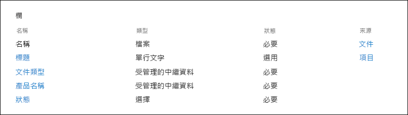

> [!NOTE]
> 在本案例稍後，保留原則會使用 **[文件類型]** 和 **[狀態]** 屬性進行分類，並自動套用保留標籤。

我們可能有數種表示不同文件類型的內容類型，但我們將焦點放在產品文件上。

在此案例中，我們使用受管理的中繼資料服務和字詞庫，為 *文件類型* 建立一個字詞組，並為 *產品名稱* 建立另一個字詞組。 我們會針對每個字詞組，為每個值建立一個字詞。 在 SharePoint 組織的字詞庫中，看起來類似以下範例：

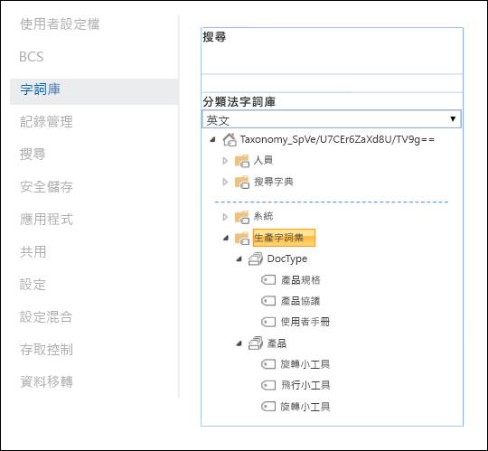

您可以使用 [內容類型中樞](https://support.office.com/article/manage-content-type-publishing-06f39ac0-5576-4b68-abbc-82b68334889b)建立及發佈 *內容類型*。 您也可以使用網站佈建工具 (例如 [PnP 佈建架構](/sharepoint/dev/solution-guidance/pnp-provisioning-framework)或[網站設計 JSON 架構](/sharepoint/dev/declarative-customization/site-design-json-schema#define-a-new-content-type)) 建立及發佈內容類型。

每個產品皆有一個專用的 SharePoint 網站，其中包含一個已啟用正確內容類型的文件庫。所有文件皆儲存在此文件庫中。

[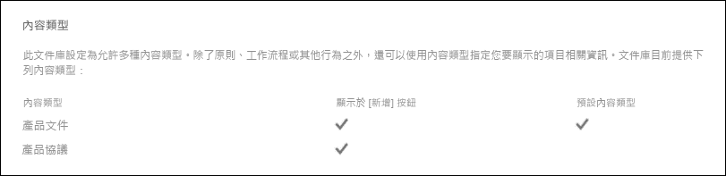](../media/SPRetention3.png#lightbox)

> [!NOTE]
> 在此案例中，製造公司不會對每個產品皆使用一個 SharePoint 網站，而是對每個產品使用一個 Microsoft Team 來支援與小組成員共同作業 (例如，透過常設聊天室)，並使用 Teams 中的 **[檔案]** 索引標籤進行文件管理。 本文只著重於文件，因此我們只會使用網站。

以下是「指尖陀螺」產品文件庫的檢視：

[](../media/SPRetention4.png#lightbox)

既然我們擁有用於文件管理的基本資訊架構，讓我們來看看對於使用中繼資料之文件的保留和處置策略，以及如何為這些文件分類。

## <a name="retention-and-disposition"></a>保留和處置

製造公司的合規性和資料控管原則會規定資料保留和處置的方式。 產品相關文件必須在產品製造期間保留，並額外保留一段特定時間。 這段額外的時間會因為產品規格、協議和使用者手冊而有所不同。 下表指示保留和處置需求：

|   文件類型            |   保留                            |   處置                                |
| -------------------------- | -------------------------------------- | -------------------------------------------- |
| 產品規格      | 停產後 5 年  | 刪除                                       |
| 產品協議          | 停產後 10 年 | 檢閱                                       |
| 使用者手冊                | 停產後 5 年  | 刪除                                       |
| 其他所有類型的文件 | 不主動保留  | 在文件超過 3 年後刪除 <br /><br /> 如果文件在過去 3 年內未曾修改，便會視為超過 3 年。 |
|||

我們會使用 Microsoft 365 合規性中心建立下列[保留標籤](retention.md#retention-labels)：

  - 產品規格

  - 產品協議

  - 使用者手冊

在本文中，我們僅示範如何建立及自動套用產品規格保留標籤。 若要實作完整案例，您也要為其他兩種文件類型建立及自動套用保留標籤。

### <a name="settings-for-the-product-specification-retention-label"></a>產品規格保留標籤的設定

以下是產品規格保留標籤的[檔案計畫](file-plan-manager.md)：

- **名稱：** 產品規格

- **使用者描述：** 停產後保留 5 年。

- **系統管理員描述：** 停產後保留 5 年、自動刪除、事件型保留、事件類型為 *產品停產*。

- **保留動作：** 保留及刪除。

- **保留期間：** 5 年 (1,825 天)。

- **記錄標籤**：設定保留標籤以將項目標記為 [記錄](records-management.md#records)，這意味著使用者無法修改或删除已標記的檔案。

- **檔案計畫描述元**：(用於簡化案例，不會提供選用檔案描述元)。

下列螢幕擷取畫面顯示在 Microsoft 365 合規性中心建立產品規格保留標籤時的設定。 您可以在建立保留標籤時，建立 *產品停產* 事件類型。 請參閱下一節中的程序。

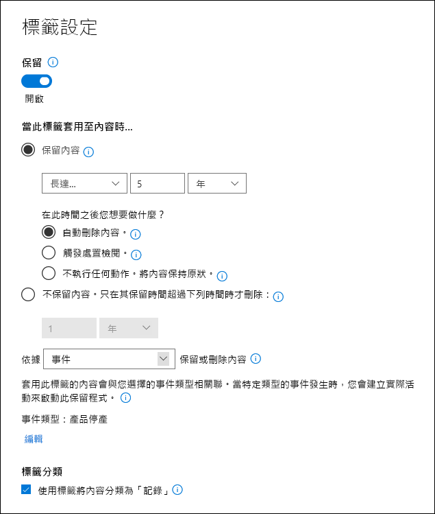

> [!NOTE]
> 為避免 5 年的文件刪除等待時間，如果您要在測試環境中重新建立此案例，請將保留期間設定為 ***[1 天]***。

### <a name="create-an-event-type-when-you-create-a-retention-label"></a>建立保留標籤時建立事件類型

1. 在 **[建立保留標籤]** 的 [ 定義保留 設定] 頁面上，在 **[開始保留期依據]** 後，選擇 **[建立新事件類型]**：

    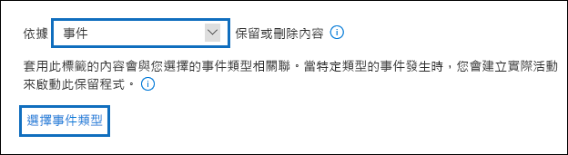

3. 在 **[命名您的事件類型]** 頁面，輸入 **[產品停產]** 和選用描述。 然後選取 **[下一個]**、 **[提交]** 和 **[完成]**。

4. 回到 **[定義保留設定]** 頁面，使用下拉式方塊選取您建立的 **[產品停產]** 事件類型作為 **[開始保留期依據]**。

    產品規格保留標籤的設定看起來會像這樣：

   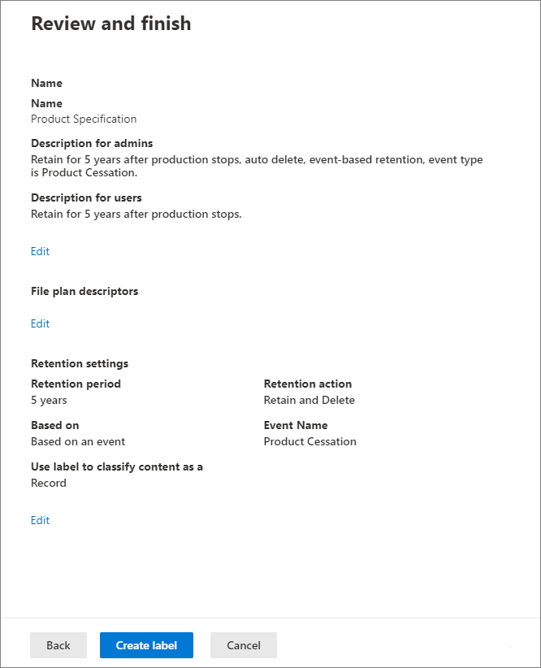

6. 選取 **[建立標籤]** 並在下一頁看到發佈標籤、自動套用標籤或僅保存標籤的選項：選擇 **[立即儲存標籤]**，然後選擇 **[完成]**。

    > [!TIP]
    > 如需更多詳細步驟，請參閱[建立其保留期間是根據事件的標籤](event-driven-retention.md#step-1-create-a-label-whose-retention-period-is-based-on-an-event)。

現在來看看我們如何將保留標籤自動套用至產品規格內容。

## <a name="auto-apply-retention-labels-to-documents"></a>自動套用保留標籤至文件

我們將使用關鍵字查詢語言 (KQL) [自動套用](apply-retention-labels-automatically.md)我們所建立的保留標籤。 KQL 是用於建立搜尋查詢的語言。 您可以在 KQL 中使用關鍵字或 Managed 屬性進行搜尋。 如需詳細資訊，請參閱[關鍵字查詢語言 (KQL) 語法參考](/sharepoint/dev/general-development/keyword-query-language-kql-syntax-reference)。

基本上，我們想要讓 Microsoft 365「將 **產品規格** 保留標籤套用至所有 **狀態** 為 **完稿**，且 **文件類型** 為 **產品規格** 的文件」。 請記住，**[狀態]** 和 **[文件類型]** 是在 [資訊架構](#information-architecture)一節中為產品文件內容類型定義的網站欄。 為了完成此操作，我們需要設定搜尋結構描述。

當 SharePoint 為內容編制索引時，便會自動為每個網站欄產生編目屬性。 在此案例中，我們想要了解 **文件類型** 和 **狀態** 屬性。 我們需要使用正確內容類型的文件庫中的文件，並填入要搜尋的網站欄，以建立編目屬性。

在 SharePoint 系統管理中心，開啟 [搜尋] 設定，然後選取 **[管理搜尋結構描述]** 以檢視及設定編目屬性。

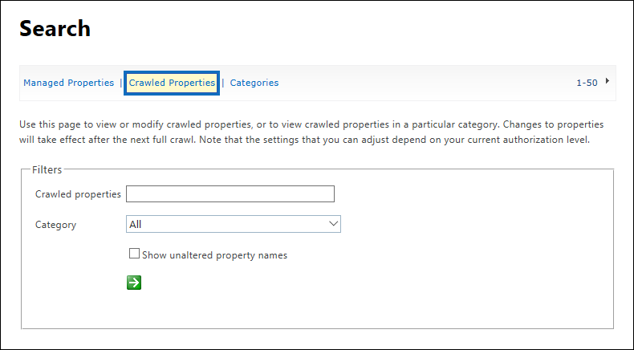

如果我們在_ *編目屬性**方塊中輸入***狀態** _，然後選取綠色箭號，則會看到如下結果：


**ows\_\_Status** 屬性 (請注意雙底線) 是我們想了解的屬性。 這會對應到生產文件內容類型的 **[狀態]** 屬性。

現在，如果輸入 ***ows\_doc***，然後選取綠色箭號，應該會看到如下所示的內容：

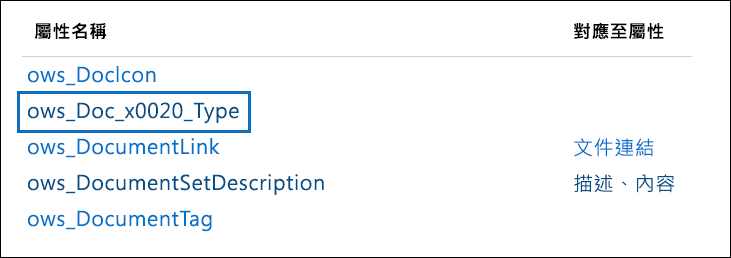

**ows\_Doc\_x0020\_Type** 屬性是我們想了解的第二個屬性。 這會對應到生產文件內容類型的 **[文件類型]** 屬性。

> [!TIP]
> 若要識別此案例的編目屬性名稱，請移至包含生產文件的文件庫。 接著，移至文件庫設定。 在 **[欄]** 中，選取欄的名稱 (例如 **Status** 或 **Doc Type**) 以開啟網站欄頁面。 該網頁 URL 中的 *Field* 參數包含欄位的名稱。 此欄位名稱 (以「ows_」開頭) 是編目屬性的名稱。 例如，URL `https://tenantname.sharepoint.com/sites/SpinningWidget/_layouts/15/FldEdit.aspx?List=%7BC38C2F45-3BD6-4C3B-AA3B-EF5DF6B3D172%7D&Field=_Status` 對應至 *ows\_\_Status* 編目屬性。

如果您要尋找的編目屬性並未出現在 SharePoint 系統管理中心的 [管理搜尋結構描述] 區段中：

- 可能是文件未編制索引。 您可以移至 **[文件庫設定]** > **[進階設定]** 以強制重新編制文件庫的索引。

- 如果文件庫位於新式網站，請確認 SharePoint 系統管理員也是網站集合系統管理員。

如需編目屬性和 Managed 屬性的詳細資訊，請參閱＜[在 SharePoint Server 中自動建立 Managed 屬性](/sharepoint/technical-reference/automatically-created-managed-properties-in-sharepoint)＞。

### <a name="map-crawled-properties-to-pre-defined-managed-properties"></a>將編目屬性對應到預先定義的 Managed 屬性

KQL 無法在搜尋查詢中使用編目屬性。 而必須使用受管理的屬性。 在一般搜尋案例中，我們建立 Managed 屬性，並將其對應到所需的編目屬性。 不過，若要針對自動套用保留標籤，您只能在 KQL 中指定預先定義的 Managed 屬性，而不能指定自訂的 Managed 屬性。 在系統中，針對您可以使用的字串 *RefinableString00* 到 *RefinableString199*，已經有一組預先定義的 Managed 屬性。 如需完整清單，請參閱[預設未使用的 Managed 屬性](/sharepoint/manage-search-schema#default-unused-managed-properties)。 這些預設的 Managed 屬性通常是用於定義搜尋精簡器。

若要讓 KQL 查詢將正確的保留標籤自動套用至產品文件內容，我們將編目屬性 **ows\_Doc\_x0020\_Type* 和 *ows\_\_Status** 對應至兩個可精簡搜尋的 Managed 屬性。 此案例的測試環境中並未使用 **RefinableString00** 和 **RefinableString01**。 我們會透過在 SharePont 系統管理中心的 **[管理搜尋結構描述]** 中查看 **[Managed 屬性]** 來判斷。

[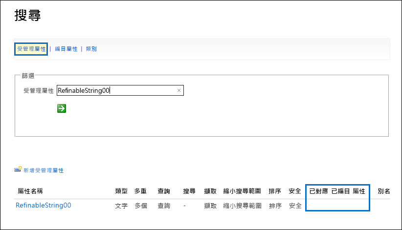](../media/SPRetention12.png#lightbox)

請注意，前面螢幕擷取畫面中 [對應的編目屬性] 欄為空白。

若要對應 **ows\_Doc\_x0020\_Type** 編目屬性，請依照下列步驟進行：

1. 在 [Managed 屬性 **]** 篩選方塊中，輸入 **_RefinableString00_**，然後選取綠色箭號。

2. 在結果清單中，選取 **RefinableString00** 連結，然後向下捲動至 [對應至編目屬性 **]** 區段。

3. 選取 [新增對應 **]**，然後輸入 **_ows\_Doc\_x0020\_Type_*_ (在 [編目屬性選項 **]** 視窗的_* 搜尋編目屬性名稱** 方塊中)。 選取 [尋找]。

4. 在結果清單中，選取 **ows\_Doc\_x0020\_Type**，然後選取 [確定]。

   在 [對應的編目屬性] 區段中，您應該會看到類似以下螢幕擷取畫面的內容：

   [![在 [對應的編目屬性] 區段中選取 [新增對應]](../media/SPRetention13.png)](../media/SPRetention13.png#lightbox)


5. 捲動到頁面底部，然後選取 **[確定]** 以儲存對應。

重複這些步驟，以對應 **RefinableString01** 和 **ows\_\_Status**。

現在，您應該有兩個 Managed 屬性對應到兩個編目屬性：

[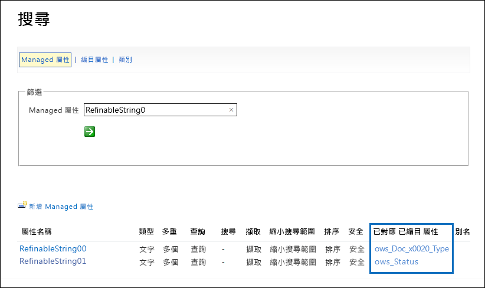](../media/SPRetention14.png#lightbox)

讓我們執行企業搜尋來驗證設定是否正確。 在瀏覽器中，移至 *https://\<your_tenant>.sharepoint.com/search*。 在搜尋方塊中，輸入 ***RefinableString00:"產品規格"** _，然後按 Enter。 此搜尋應該會傳回_ *產品規格**為 **_文件類型_** 的所有文件。

現在，在搜尋方塊中，輸入 **RefinableString00:"產品規格" AND RefinableString01:最終**，然後按 Enter。 這應該會傳回 **產品規格** 為 **_文件類型_*_且_* 狀態** 為 **_最終_** 的所有文件。

### <a name="create-auto-apply-label-policies"></a>建立自動套用標籤原則

既然我們已經驗證 KQL 查詢正常運作，讓我們來建立使用 KQL 查詢的自動套用標籤原則，以便將產品規格保留標籤自動套用到適當的文件。

1. 在 [合規性中心](https://compliance.microsoft.com/homepage)，移至 **[記錄管理]** > **[標籤原則]** > **[自動套用標籤]**。

   [![在 [標籤] 頁面上選取 [自動套用標籤]](../media/SPRetention16.png)](../media/SPRetention16.png#lightbox)

2. 在 [建立自動標籤原則] 精靈中，請在 **[命名您的自動標籤原則]** 頁面輸入如 **[自動套用產品規格] 標籤** 等名稱以及選用描述。 然後選取 **[下一步]**。

3. 在 **[ 選擇您要套用此標籤的內容類型]** 頁，選取 **[將標籤套用至包含特定字詞或屬性的內容]**，然後選取 **[下一步]**。

   [![選取 [將標籤套用到包含特定字詞、片語或屬性的內容]](../media/SPRetention17.png)](../media/SPRetention17.png#lightbox)

   此選項讓我們提供上一節中測試的相同 KQL 搜尋查詢。 這些查詢會傳回狀態為 *[完稿]* 的所有產品規格文件。 在自動套用標籤原則中使用這個相同的查詢時，產品規格保留標籤將會自動套用至符合的所有文件。

4. 在 **[套用此標籤至符合此查詢的內容]** 頁面，輸入 **RefinableString00:"Product Specification" AND RefinableString01:Final**，然後選取 **[下一步]**。

   ![在 [關鍵字查詢編輯器] 方塊中指定查詢](../media/SPRetention19.png)

5. 在 **[選擇套用此原則的位置]** 精靈頁面上，選取您要套用原則的內容位置。 針對此案例，我們僅將原則套用至 SharePoint 位置，因為所有生產文件都儲存在 SharePoint 文件庫中。 將 [Exchange 電子郵件 **]**、[OneDrive 帳戶 **]** 以及 [Microsoft 365 群組 **]** 的狀態切換至 [關閉 **]**。 在選取 **[下一步]** 之前，請確認 SharePoint 網站的狀態已切換為 **[開啟]**：

    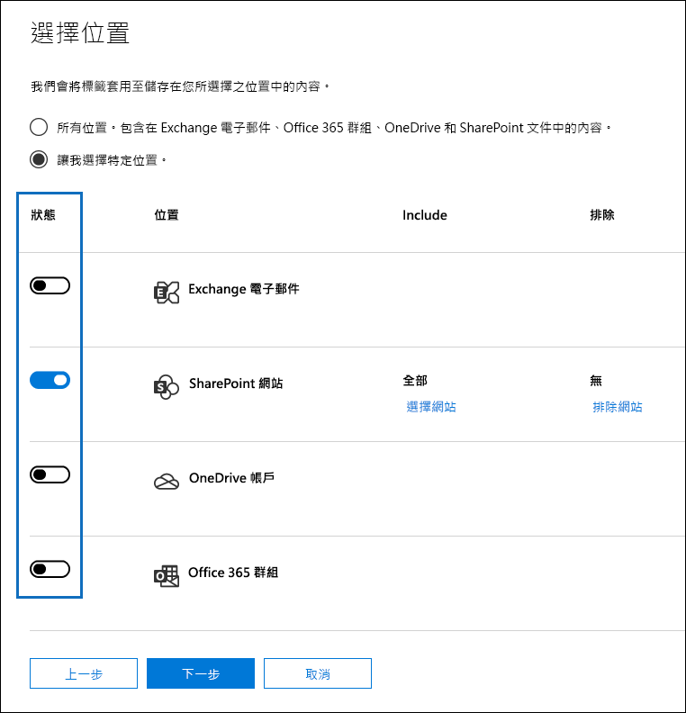

   > [!TIP]
   > 您可以選取 **[選擇網站]** 並新增特定 SharePoint 網站的 URL，而不是將原則套用到所有 SharePoint 網站。

6. 在 **[選取標籤以自動套用]** 頁面，選取 **[新增標籤]**。

7. 從保留標籤清單中，選取 **[產品規格]**。 然後，依序選取 **[新增]** 和 **[下一步]**。

8. 檢閱您的設定：

    

9. 選取 **[提交]** 以建立自動套用標籤原則。

   > [!NOTE]
   > 系統會花費最多 7 天，自動將產品規格標籤套用至符合 KQL 搜尋查詢的所有文件。

### <a name="verify-that-the-retention-label-was-automatically-applied"></a>驗證已自動套用保留標籤

7 天後，請使用合規性中心的[活動總管](data-classification-activity-explorer.md)，確認我們建立的自動套用標籤原則是否已自動將保留標籤套用至產品文件。

此外，查看文件庫中文件的屬性。 在資訊面板中，您可以看到保留標籤已套用至所選的文件。

[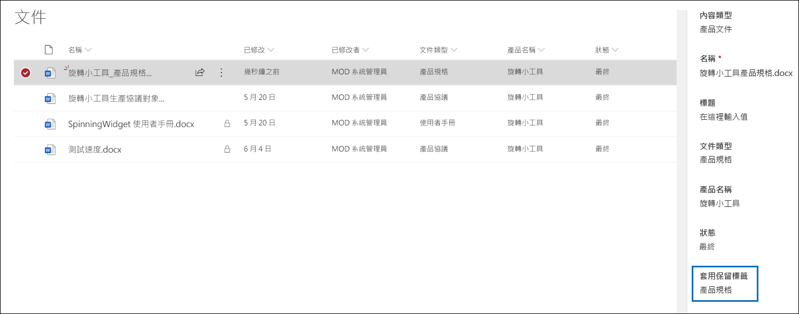](../media/SPRetention21.png#lightbox)

由於保留標籤已自動套用至文件，因此可以保護文件免遭刪除，因為保留標籤已設定為將文件宣告為 *記錄*。 舉例來說，當我們嘗試刪除其中一個文件時，會收到下列錯誤訊息：

[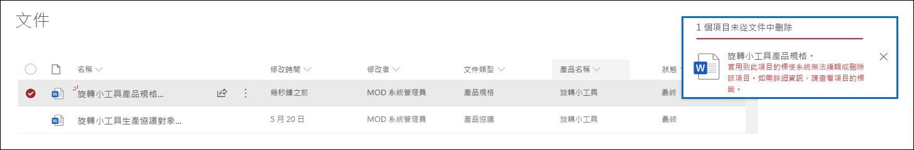](../media/SPRetention22.png#lightbox)

## <a name="generate-the-event-that-triggers-the-retention-period"></a>產生觸發保留期間的事件

既然已經套用保留標籤，讓我們將焦點放在介紹用於指示特定產品停產的事件。 此事件會觸發在保留標籤中定義的保留期間開始。 例如，針對產品規格文件，在觸發「停產」事件時，便會開始 5 年的保留期。

您可以在 Microsoft 365 合規性中心，移至 **[記錄管理]** > **[事件]**，以手動建立事件。 您可以選擇事件類型、設定正確的資產識別碼，並輸入事件的日期。 如需詳細資訊，請參閱[事件發生時，開始保留](event-driven-retention.md)。

但是在此案例中，我們將從外部生產系統自動產生事件。 此系統是一份簡單的 SharePoint 清單，可指出產品是否已投入生產。 與清單相關聯的 [Power Automate](/flow/getting-started) 流程將會觸發事件。 在現實案例中，您可以使用多種系統產生事件，例如 HR 或 CRM 系統。 Power Automate 包含許多可供 Microsoft 365 工作負載使用的現成互動和建置區塊，例如 Microsoft Exchange、SharePoint、Teams 和 Dynamics 365，以及協力廠商應用程式，例如 Twitter、Box、Salesforce 和 Workdays。 此功能可讓您輕鬆地將 Power Automate 與多種系統整合在一起。 如需詳細資訊，請參閱[自動化事件導向保留](./event-driven-retention.md#automate-events-by-using-a-rest-api)。

下列螢幕擷取畫面顯示將用於觸發事件的 SharePoint 清單：

[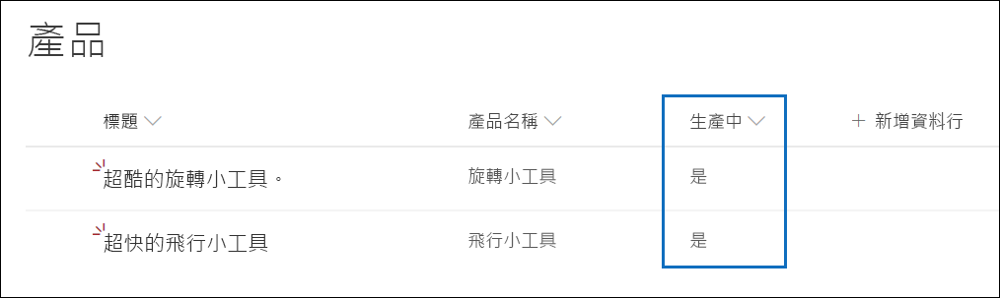](../media/SPRetention23.png#lightbox)

目前有兩種產品投入生產，如_ *生產中**欄的***是** _所示。 當某產品此欄的值設為 **_否_** 時，與清單相關聯的流程會自動產生事件。 此事件會觸發開始自動套用到對應產品文件的保留標籤保留期間。

在此案例中，我們使用下列流程來觸發事件：

[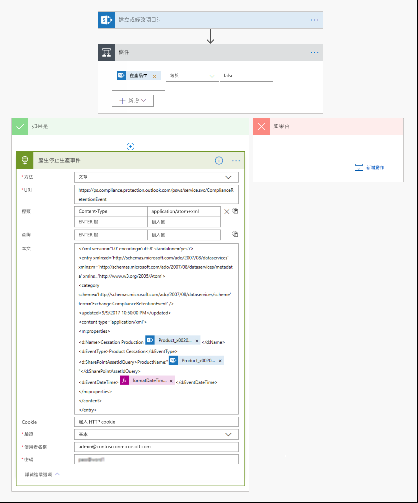](../media/SPRetention24.png#lightbox)

若要建立此流程，請從 SharePoint 連接器開始，並選取 [建立或修改項目時] 觸發程序。 指定網站位址和清單名稱。 然後，根據 **生產中** 清單欄值是否設定為**_否_* _ (或在條件卡片中等於 _false*) 來新增條件。 然後根據內建的 HTTP 範本新增動作。 使用下一節中的值來設定 HTTP 動作。 您可以從下一節複製 **URI** 和 **Body** 屬性的值，然後將其貼到範本中。

- **方法**：POST
- **URI**：`https://ps.compliance.protection.outlook.com/psws/service.svc/ComplianceRetentionEvent`
- **標頭**：Key = Content-Type, Value = application/atom+xml
- **本文**：

    ```xml
    <?xml version='1.0' encoding='utf-8' standalone='yes'>
    <entry xmlns:d='http://schemas.microsoft.com/ado/2007/08/dataservices' xmlns:m='http://schemas.microsoft.com/ado/2007/08/dataservices/metadata' xmlns='https://www.w3.org/2005/Atom'>
    <category scheme='http://schemas.microsoft.com/ado/2007/08/dataservices/scheme' term='Exchange.ComplianceRetentionEvent'>
    <updated>9/9/2017 10:50:00 PM</updated>
    <content type='application/xml'>
    <m:properties>
    <d:Name>Cessation Production @{triggerBody()?['Product_x0020_Name']?['Value']}</d:Name>
    <d:EventType>Product Cessation&lt;</d:EventType>
    <d:SharePointAssetIdQuery>ProductName:&quot;@{triggerBody()?['Product_x0020_Name']?['Value']}<d:SharePointAssetIdQuery>
    <d:EventDateTime>@{formatDateTime(utcNow(),'yyyy-MM-dd')}</d:EventDateTime>
    </m:properties>
    </content&gt>
    </entry>
    ```

此清單描述必須針對此案例加以設定的動作 **Body** 屬性內的參數：

- **Name**：此參數指定將在 Microsoft 365 合規性中心建立之事件的名稱。 在此案例中，名稱是「停產 *xxx*」，其中 *xxx* 是稍早建立的 **ProductName** Managed 屬性的值。
- **EventType**：此參數值與建立的事件將套用的事件類型相對應。 建立保留標籤時，便會定義此事件類型。 在此案例中，事件類型為「停產」。
- **SharePointAssetIdQuery**：此參數定義事件的資產識別碼。 事件型保留需要文件的唯一識別碼。 我們可以使用資產識別碼來識別特定事件適用的文件，或者如同此案例，使用 **[產品名稱]** 中繼資料欄來識別。 若要這麼做，我們需要建立可在 KQL 查詢中使用的新 **ProductName** Managed 屬性  (或者，我們可以使用 **RefinableString00**，而不是建立新的 Managed 屬性)。 我們也需要將這個新的 Managed 屬性對應至 **ows_Product_x0020_Name** 編目屬性。 以下是此 Managed 屬性的螢幕擷取畫面。

    [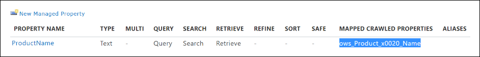](../media/SPRetention25.png#lightbox)

- **EventDateTime**：此參數定義事件發生的日期。 使用目前的日期格式：<br/><br/>*formatDateTime(utcNow(),'yyyy-MM-dd'*)

### <a name="putting-it-all-together"></a>總整理

現在已經建立並自動套用保留標籤，並設定及建立流程。 當 [產品] 清單中「指尖陀螺」產品的 [生產中 **]** 欄中的值從 **_是_*_變更為_*_否_*_時，會觸發流程來建立事件。若要在合規性中心查看此事件，請移至_* 記錄管理** > **事件**。

[![流程所觸發的事件會顯示在合規性中心的 [事件] 頁面上。](../media/SPRetention28.png)](../media/SPRetention28.png#lightbox)

選取事件以便在飛出頁面上檢視詳細資料。 請注意，即使已建立事件，事件狀態仍會顯示未處理任何 SharePoint 網站或文件。

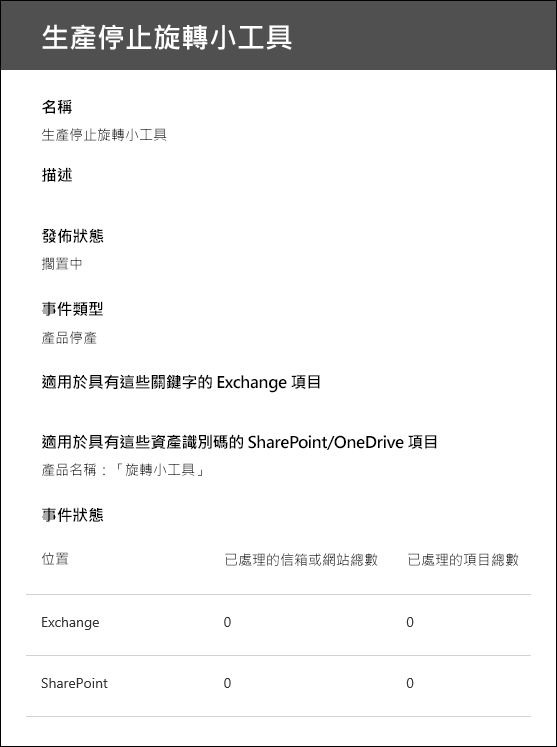

但在一段延遲後，事件狀態會顯示已處理 SharePoint 網站和 SharePoint 文件。

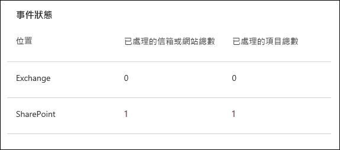

這表示套用到「旋轉小工具」產品文件的標籤的保留期間已根據 *旋轉小工具產品停產* 事件的日期起始。 假設您透過設定一天保留期間在測試環境中實作此案例，則可以在建立事件後的幾天內移至產品文件的文件庫，並確認該文件是否已遭到刪除 (在執行 SharePoint 中的刪除工作後)。

### <a name="more-about-asset-ids"></a>有關資產識別碼的詳細資訊

如[事件發生時，開始保留](event-driven-retention.md)一文中所述，了解事件類型、保留標籤、事件和資產識別碼之間的關聯非常重要。 資產識別碼只是 SharePoint 和 OneDrive 中的一個文件屬性。 這可協助您識別將由事件觸發其保留期間的文件。 根據預設，SharePoint 具有 **[資產識別碼]** 屬性，可用於事件導向保留：

![[資產識別碼] 屬性會顯示在文件屬性詳細資料頁面中。](../media/SPRetention26.png)

如以下螢幕擷取畫面所示，資產識別碼 Managed 屬性稱為 **ComplianceAssetId**。

[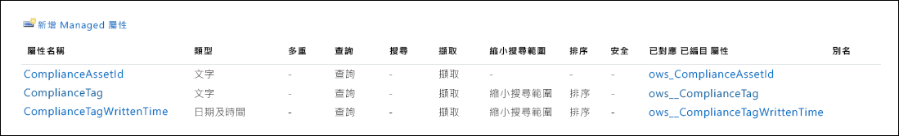](../media/SPRetention27.png#lightbox)

您可以使用其他任何屬性，而不是使用預設的 **[資產識別碼]** 屬性，如同此案例的做法。 但請務必了解，如果您沒有為事件指定資產識別碼或關鍵字，具有該事件類型標籤的所有內容都將由該事件觸發其保留期間。

### <a name="using-advanced-search-in-sharepoint"></a>在 SharePoint 中使用進階搜尋

在前面的螢幕擷取畫面中，您可以看到有另一個與保留標籤相關的 Managed 屬性，稱為 **ComplianceTag**，並對應到編目屬性。 **ComplianceAssetId** Managed 屬性也會對應到編目屬性。 這表示您可以在進階搜尋中使用這些 Managed 屬性來擷取所有已使用保留標籤標記的文件。