# <a name="manage-the-lifecycle-of-sharepoint-documents-with-retention-labels"></a>使用保留標籤管理 SharePoint 文件的生命週期

本文將說明如何使用 Office 365 保留標籤來管理儲存在 SharePoint Online 的產品相關文件的生命週期，具體做法是自動套用標籤及設定以事件為基礎的保留。 自動套用功能會透過使用 SharePoint 中繼資料來運用文件分類。 本文中的案例是以與產品相關的文件為基礎，但是相同的概念也可用於其他案例。 例如，在石油與天然氣產業，您可以管理與石油平台、鑽井記錄或生產授權等實體資產相關的文件生命週期。 在金融服務產業，您可以管理與銀行帳戶、貸款或保險合約相關的文件。 在公共部門，您可以管理與施工許可證或稅務表單相關的文件。

讓我們來看看這篇文章的案例。 我們將探討資訊架構和保留標籤的定義。 然後，我們將透過自動套用標籤來分類文件，最後產生啟動保留期間的事件。

## <a name="information-architecture"></a>資訊架構

本文的案例是根據一家製造公司，該公司使用 Office 365 SharePoint Online 來儲存所有與公司所開發的產品相關的文件。 這些文件包括產品規格、與供應商簽訂的協議和使用者手冊。 在 SharePoint 中將隨著企業內容管理原則的一部分儲存這些文件時，便會定義文件中繼資料，並將其用於分類。 每份文件皆有下列中繼資料屬性：

- **文件類型** (例如產品規格、協議和使用者手冊)

- **產品名稱**

- **狀態** (草稿或完稿)

這類中繼資料會為所有文件形成名為 **Production Document** 的基本內容類型。

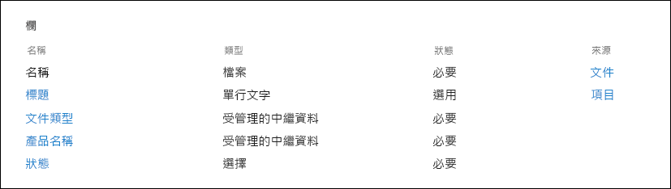

> [!NOTE]
> 在稍後的案例中，保留原則會使用 **Doc Type** 和 **Status** 屬性進行分類，並自動套用保留標籤。

我們可以有數種表示不同文件類型的內容類型，但我們將焦點放在產品文件上。

在此案例中，我們使用受管理的中繼資料服務和字詞庫來為**文件類型**建立字詞組，並為**產品名稱**建立另一個字詞組。 我們會針對每個字詞組，為每個值建立一個字詞。 在 SharePoint 組織的字詞庫中，看起來類似以下範例：

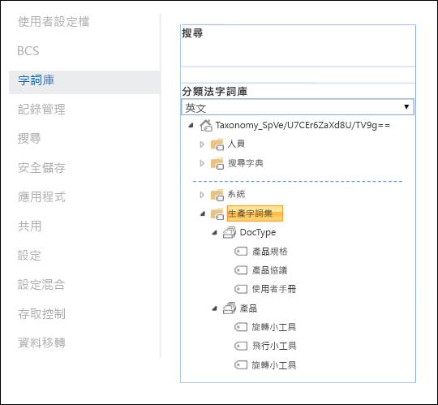

您可以使用[內容類型中樞](https://support.office.com/article/manage-content-type-publishing-06f39ac0-5576-4b68-abbc-82b68334889b)建立及發佈內容類型。 您也可以使用網站提供的工具 (例如 [PnP 佈建架構](https://docs.microsoft.com/sharepoint/dev/solution-guidance/pnp-provisioning-framework)或[網站設計 JSON 架構](https://docs.microsoft.com/sharepoint/dev/declarative-customization/site-design-json-schema#define-a-new-content-type)) 建立及發佈內容類型。

每個產品皆有一個專用的 SharePoint Online 網站，其中包含一個文件庫，且已啟用正確的內容類型。 所有文件皆儲存在此文件庫中。


> [!NOTE]
> 在此案例中，製造公司不會對每個產品皆使用一個 SharePoint Online 網站，而是對每個產品使用一個 Microsoft Team 來支援與小組成員共同作業，例如常設聊天室，並使用小組中的 [檔案]**** 索引標籤來進行文件管理。 本文只著重於文件，因此我們只會使用網站。

以下是「指尖陀螺」產品文件庫的檢視：

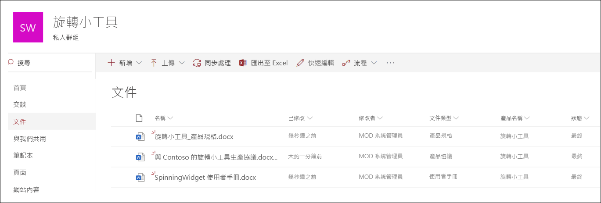

現在，我們擁有用於文件管理的基本資訊架構，讓我們來看看使用中繼資料和文件分類的文件保留和處置策略。

## <a name="retention-and-disposition"></a>保留和處置

製造公司的合規性和資料控管原則規定資料保留和處置的方式。 產品相關文件必須在產品製造期間保留，並在製造完後保留一段特定時間。 此期間與產品規格、協議和使用者手冊不同。 下表指示保留和處置需求：

| **文件類型**          | **保留**                          | **處置**                              |
| -------------------------- | -------------------------------------- | -------------------------------------------- |
| 產品規格      | 生產停止後 5 年  | 刪除                                       |
| 產品協議          | 生產停止後 10 年 | 檢閱                                       |
| 使用者手冊                | 生產停止後 5 年  | 刪除                                       |
| 其他所有類型的文件 | 不要積極保留其他文件  | 在文件超過 3 年後刪除<sup>\*</sup>  |
|||

> [!NOTE]
> <sup>\*</sup>如果文件在過去 3 年內未曾修改，便會視為超過 3 年。

我們會使用安全性與合規性中心建立下列保留標籤：

  - 產品規格

  - 產品協議

  - 使用者手冊

在本文中，我們僅示範如何建立及自動套用產品規格保留標籤。 若要實作完整案例，您必須為其他兩種文件類型建立及自動套用保留標籤。

### <a name="settings-for-the-product-specification-retention-label"></a>產品規格保留標籤的設定

以下是產品規格保留標籤的[檔案計畫](file-plan-manager.md)： 

- **名稱：** 產品規格

- **系統管理員描述：** 產品規格標籤、生產停止後保留五年、自動刪除、以事件為基礎的保留、事件類型為「產品停產」。

- **使用者描述：** 生產停止後保留五年。

- **保留動作：** 保留及刪除

- **保留期間：** 五年 (1825 天)

- **記錄標籤**：設定保留標籤，以將內容分類成[記錄](labels.md#using-retention-labels-for-records-management) (分類為記錄的文件不能由使用者修改或刪除)

- **檔案計畫描述元：**(用於簡化案例，不會提供檔案描述元)

下列螢幕擷取畫面顯示在安全性與合規合規性中心建立產品規格[保留標籤](labels.md)時的設定。 您可以在建立保留標籤時，建立**產品停產**事件類型。 請參閱下列步驟。

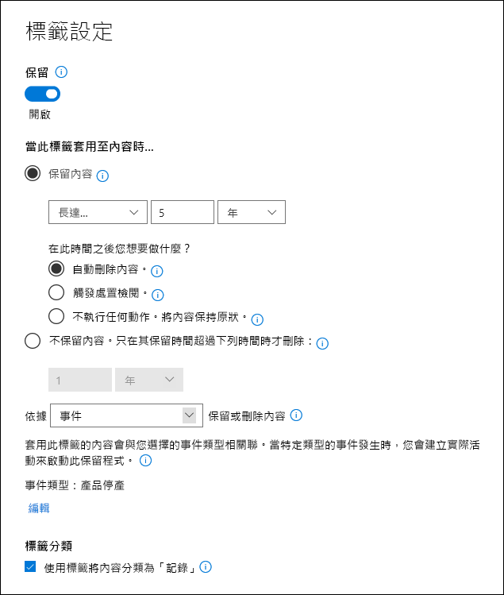

> [!NOTE]
> 出於實際目的，以及為了避免需要等待 5 年才能查看自動刪除的文件，如果您在測試環境中重新建立此案例，請將保留期間設定為 1 天。

### <a name="create-an-event-type-when-creating-a-retention-label"></a>在建立保留標籤時建立事件類型

1. 在 [以下列條件保留或刪除內容]**** 下拉式清單中，選取 [事件]****。

2. 選取 [選擇事件類型]****。

   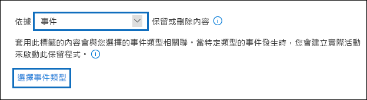

3. 在 [選擇事件類型]**** 頁面中，選取 [您可以在這裡建立新的事件類型]****。

4. 建立名為**產品停產**的事件類型，並提供描述，然後選取 [完成]**** 來建立。 

5. 回到 [選擇事件類型]**** 頁面，選取您所建立的 [產品停產]**** 事件類型，然後選取 [新增]****。

產品規格保留標籤的設定看起來會像這樣。 選取 [建立此標籤]**** 來建立。

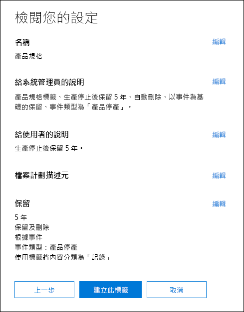

> [!TIP]
> 如需更多詳細步驟，請參閱[建立其保留期間是根據事件的標籤](event-driven-retention.md#step-1-create-a-label-whose-retention-period-is-based-on-an-event)。

現在已建立保留標籤，讓我們來看看如何將保留標籤自動套用至產品規格內容。

## <a name="classifying-content-by-auto-applying-retention-labels"></a>使用自動套用保留標籤來分類內容

我們將[自動套用](labels.md#applying-a-retention-label-automatically-based-on-conditions)使用關鍵字查詢語言 (KQL) 為此案例所建立的保留標籤。 KQL 是用於建立搜尋查詢的語言。 您可以在 KQL 中使用關鍵字或 Managed 屬性進行搜尋。 如需關於 KQL 的詳細資訊，請參閱<https://docs.microsoft.com/sharepoint/dev/general-development/keyword-query-language-kql-syntax-reference>

我們想要讓 Office 365「將**產品規格**保留標籤套用至所有**狀態**為**完稿**，且**文件類型**為**產品規格**的文件。 請記住，**狀態**和**文件類型**是先前在[資訊架構](#information-architecture)一節中為產品文件內容類型定義的網站欄。 為了完成此操作，我們需要設定搜尋結構描述。

當 SharePoint 為內容編制索引時，便會自動為每個網站欄產生編目屬性。 在此案例中，我們想要了解**文件類型**和**狀態**屬性。 我們需要使用正確內容類型的文件庫中的文件，並填入網站欄，以便在搜尋中建立編目屬性。

在 SharePoint 系統管理中心，我們可以開啟搜尋設定，然後選取 [管理搜尋結構描述]**** 以檢視及設定編目屬性。

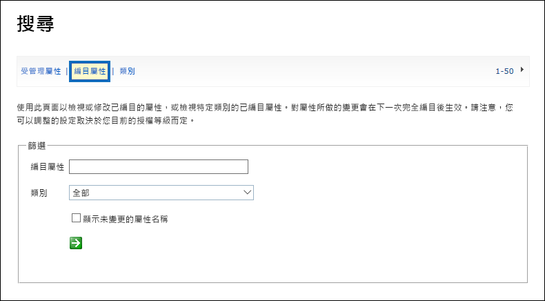

如果我們在 [編目屬性]**** 方塊中輸入 **status**，然後選取綠色箭號，則會看到如下結果：

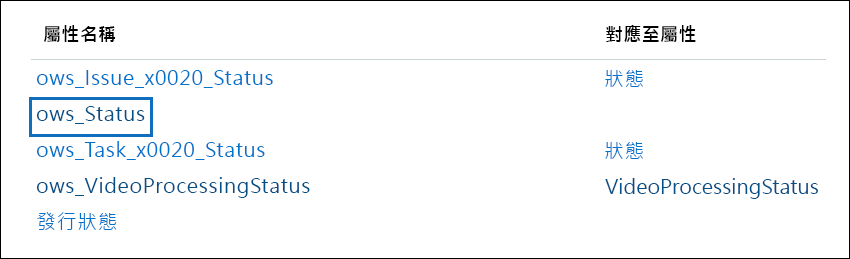

屬性 **ows\_\_Status** (請注意雙底線) 是我們想了解的屬性。 這會對應到 Production Document 內容類型的 **Status** 屬性。

現在，如果輸入 **ows\_doc**，然後選取綠色箭號，則會看到如下所示的內容：


屬性 **ows\_Doc\_x0020\_Type** 是我們想了解的第二個屬性。 這會對應到生產文件內容類型的**文件類型**屬性。

> [!TIP]
> 若要識別此案例的編目屬性名稱，請移至包含生產文件的文件庫，然後移至文件庫設定。 在 [欄]**** 中，選取欄的名稱 (例如 **Status** 或 **Doc Type**) 以開啟網站欄頁面。 該網頁 URL 中的 **Field** 參數包含欄位的名稱。 此欄位名稱 (以「ows_」開頭) 是編目屬性的名稱。 例如，URL `https://tenantname.sharepoint.com/sites/SpinningWidget/_layouts/15/FldEdit.aspx?List=%7BC38C2F45-3BD6-4C3B-AA3B-EF5DF6B3D172%7D&Field=_Status` 對應至 **ows\_\_Status** 編目屬性。

如果您要尋找的編目屬性並未出現在 SharePoint 系統管理中心的 [管理搜尋結構描述] 區段中，可能是下列其中一個原因：

- 文件未編制索引。 您可以移至 [文件庫設定] > [進階設定] 以強制重新編制文件庫的索引。

- 如果文件庫位於新式網站，請確認 SharePoint 系統管理員也是網站集合系統管理員。

如需編目屬性和 Managed 屬性的詳細資訊，請參閱＜[在 SharePoint Server 中自動建立 Managed 屬性](https://docs.microsoft.com/sharepoint/technical-reference/automatically-created-managed-properties-in-sharepoint)＞。

### <a name="mapping-crawled-properties-to-pre-defined-managed-properties"></a>將編目屬性對應到預先定義的 Managed 屬性

KQL 無法在搜尋查詢中使用編目屬性。 而必須使用受管理的屬性。 在標準搜尋案例中，我們建立受管理的屬性，並將其對應到所需的編目屬性。 不過，針對自動套用保留標籤，您只能在 KQL 預先定義的 Managed 屬性中指定，而不能在自訂 Managed 屬性中指定。 系統中已建立一組預先定義的 Managed 屬性，可使用字串 RefinableString00 到 RefinableString199。 如需完整清單，請參閱[預設未使用的 Managed 屬性](https://docs.microsoft.com/sharepoint/manage-search-schema#default-unused-managed-properties)。 這些預設的 Managed 屬性通常是用於定義搜尋精簡器。

為了讓 KQL 查詢能夠正常運作，並將正確的保留標籤自動套用至產品文件內容，我們將編目屬性 **ows\_Doc\_x0020\_Type** 和 **ows\_\_Status** 對應至兩個可精簡搜尋的 Managed 屬性。 此案例的測試環境中並未使用 **RefinableString00** 和 **RefinableString01**。 我們會透過在 SharePont 系統管理中心的**管理搜尋結構描述**中查看 **Managed 屬性**來判斷。

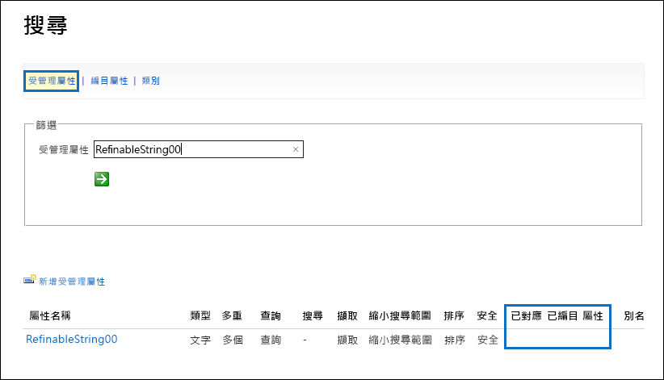

請注意，前面螢幕擷取畫面中 [對應的編目屬性]**** 欄為空白。

若要對應 **ows\_Doc\_x0020\_Type** 編目屬性，請執行下列動作：

1. 在 [Managed 屬性]**** 篩選方塊中，輸入 **RefinableString00**，然後選取綠色箭號。

2. 在結果清單中，選取 **RefinableString00** 連結，然後向下捲動至 [對應至編目屬性]**** 區段。  

3. 按一下 [新增對應]****，然後在 [編目屬性選項]**** 視窗中的 [搜尋編目屬性名稱]**** 方塊中，輸入 **ows\_Doc\_x0020\_Type**。 選取 [尋找]****。  

4. 在結果清單中，選取 **ows\_Doc\_x0020\_Type**，然後選取 [確定]****。

   在 [對應的編目屬性]**** 區段中，您應該會看到類似以下螢幕擷取畫面的內容：

   ![在 [對應的編目] 屬性區段中選取 [新增對應]](media/SPRetention13.png)

5. 捲動到頁面底部，然後選取 [確定]**** 以儲存對應。

重複此程序，以對應 RefinableString01 和 ows\_\_Status。

現在，您應有兩個 Managed 屬性對應到兩個編目屬性：

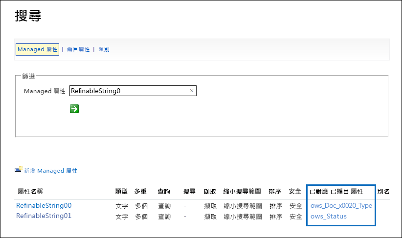

讓我們執行企業搜尋來驗證是否已正確設定。 在瀏覽器中，移至 https://yourtenant.sharepoint.com/search。 在搜尋方塊中，輸入 **RefinableString00:"Product Specification"**，然後按 Enter。 此動作會返回產品**文件類型**為產品規格的所有文件。

現在，在搜尋方塊中，輸入 **RefinableString00:"Product Specification" AND RefinableString01:Final**，然後按 Enter。 此動作會返回產品**文件類型**為產品規格且狀態為**完稿**的所有文件。

### <a name="creating-the-auto-apply-label-policies"></a>建立自動套用標籤原則

現在我們已驗證 KQL 查詢正常運作，讓我們來建立使用 KQL 查詢的標籤原則，以將產品規格保留標籤自動套用到適當的文件。

1. 在[安全性與合規性中心](https://protection.office.com)中，移至 [分類]****  >  [保留標籤]****，然後選取 [自動套用標籤]****。 

   ![在 [標籤] 頁面上選取 [自動套用標籤]](media/SPRetention16.png)

2. 在 [選擇要自動套用的標籤]**** 精靈頁面上，選取 [選擇要自動套用的標籤]****。

3. 在標籤清單中，選取 [產品規格]****，選取 [新增]****，然後選取 [下一步]****。

4. 選取 [將標籤套用到包含特定文字或字詞的內容]****，然後選取 [下一步]****。

   ![選取 [將標籤套用到包含特定字詞、片語或屬性的內容]](media/SPRetention17.png)

   在下一個步驟中，您將提供上一節中測試的相同 KQL 搜尋查詢。 當您回收時，此查詢會傳回狀態為「完稿」的所有產品規格文件。 在標籤原則中使用此相同查詢的結果表示，產品規格保留標籤將會自動套用至符合此搜尋查詢的所有文件。

5. 在 [關鍵字查詢編輯器]**** 方塊中，輸入 **RefinableString00:"Product Specification" AND RefinableString01:Final**，然後選取 [下一步]****。

   ![在 [關鍵字查詢編輯器] 方塊中指定查詢](media/SPRetention19.png)

6. 輸入名稱 (例如，[自動套用產品規格標籤]****) 和標籤原則的選擇性描述，然後選取 [下一步]****。 

7. 在 [選擇位置]**** 精靈頁面上，選取您要套用原則的內容位置。 針對此案例，我們僅將原則套用至 SharePoint 位置，因為所有生產文件僅儲存在 SharePoint 文件庫中。 選取 [讓我選擇一個特定位置]****，將 Exchange 電子郵件、OneDrive 帳戶和 Office 365 群組的狀態切換為關閉，並確認 SharePoint 網站的狀態已切換為開啟。 

    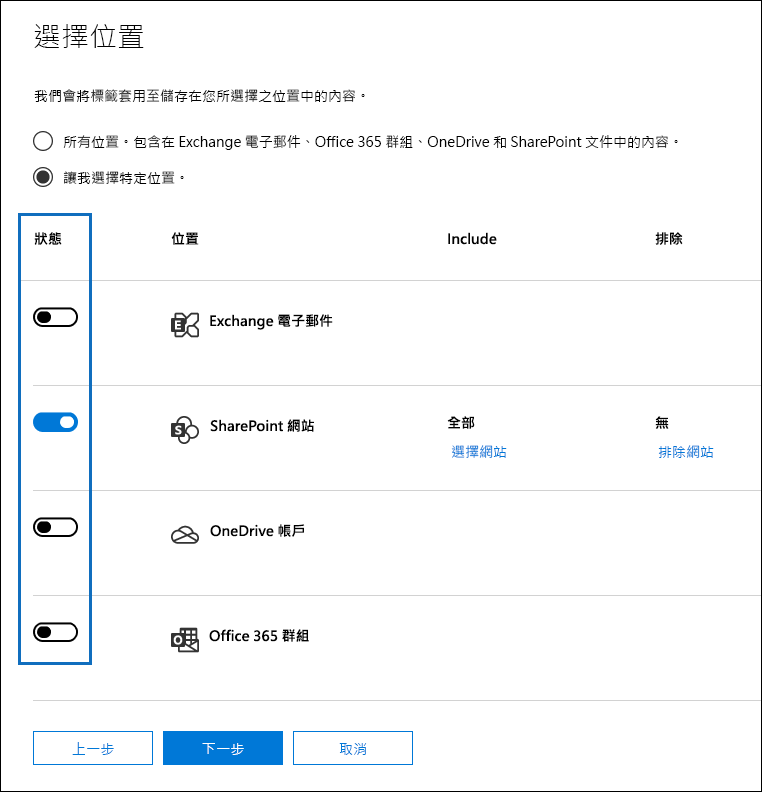

   > [!TIP]
   > 您可以選取 [選擇網站]**** 並新增特定 SharePoint 網站的 URL，而不是將原則套用到所有 SharePoint 網站。

8. 選取 [下一步]**** 以顯示 [檢閱您的設定]**** 頁面。 

    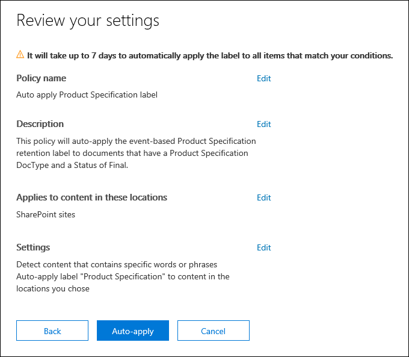

9. 選取 [自動套用]**** 以建立標籤原則。 最多需要七天的時間，才能自動將產品規格標籤套用至符合您所提供之 KQL 搜尋查詢的所有文件。

### <a name="verifying-the-retention-label-was-automatically-applied"></a>驗證已自動套用保留標籤

七天後，請使用安全性與合規性中心的[標籤活動總管](view-label-activity-for-documents.md)，查看我們建立的標籤原則是否已自動將此案例中的保留標籤套用至產品文件。 在以下螢幕擷取畫面中，保留標籤也已套用至產品協議和使用者手冊，不過，我們並未在本文中介紹如何建立這些保留標籤和標籤原則。

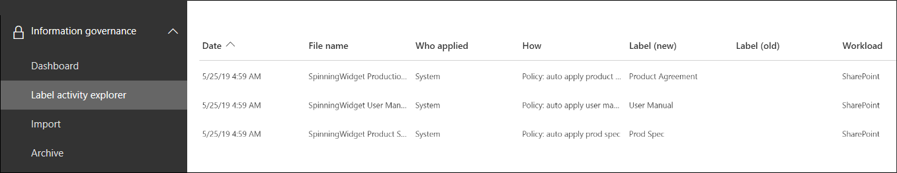

另一個驗證步驟是查看文件庫中的文件屬性。 在資訊面板中，您可以看到保留標籤已套用至所選的文件。

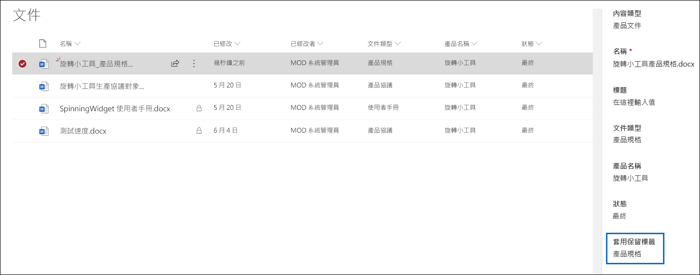

由於保留標籤已自動套用至文件，因此可以保護文件免遭刪除，因為保留標籤已設定為將文件宣告為記錄。 舉例來說，當我們嘗試刪除其中一個文件時，會收到下列螢幕擷取畫面所示的錯誤訊息。

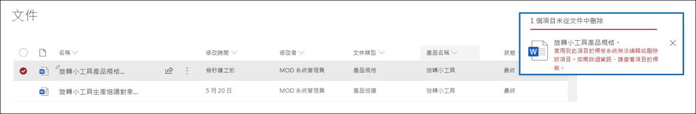

## <a name="generating-the-events-that-trigger-the-start-of-the-retention-period"></a>產生用於觸發保留期間開始的事件

由於已成功自動套用保留標籤，因此我們將焦點放在介紹用於指示特定產品停產的事件。 當此事件發生時，便會觸發自動套用至文件的保留標籤中定義的保留期間。 例如，針對產品規格文件，在觸發「停產」事件時，便會開始五年的保留期。

您可以在安全性與合規性中心手動建立事件，方法是移至 [記錄管理]****  >  [事件]****，並選擇事件類型、設定正確的資產識別碼，並輸入事件日期。 如需詳細資訊，請參閱[事件導向保留的概觀](event-driven-retention.md)。

在此案例中，我們會透過從外部生產系統產生事件來自動建立事件。 在此案例中，產生事件的系統是一個簡單的 SharePoint 清單，該清單指出產品是否生產中，以及與該清單相關聯並會觸發事件的 [Microsoft Flow](https://docs.microsoft.com/flow/getting-started)。 在現實案例中，可以是產生事件的任何系統，例如 HR 或 CRM 系統。 Flow 包含許多可供 Office 365 工作負載使用的現成互動和建置組塊，例如 Exchange、SharePoint、Teams 和 Dynamics 365，以及協力廠商應用程式，例如 Twitter、Box、Salesforce 和 Workdays。 這可讓您輕鬆地將 Flow 與這些系統整合。 如需詳細資訊，請參閱[自動化事件導向保留](automate-event-driven-retention.md)。

下列螢幕擷取畫面顯示將用於觸發事件的 SharePoint 清單： 

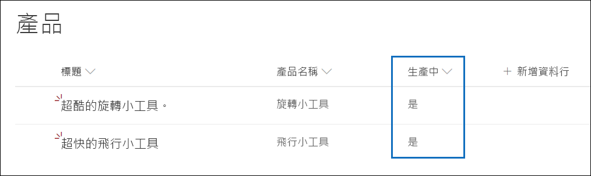

目前有兩種產品生產中，可從 [生產中]**** 欄的 [是]**** 值得知。 當某產品此欄的值設為 **[否]** 時，與清單相關聯的流程會自動產生事件。 這會觸發自動套用到對應產品文件的保留標籤保留期間。

在此案例中，我們使用下列流程來觸發事件：

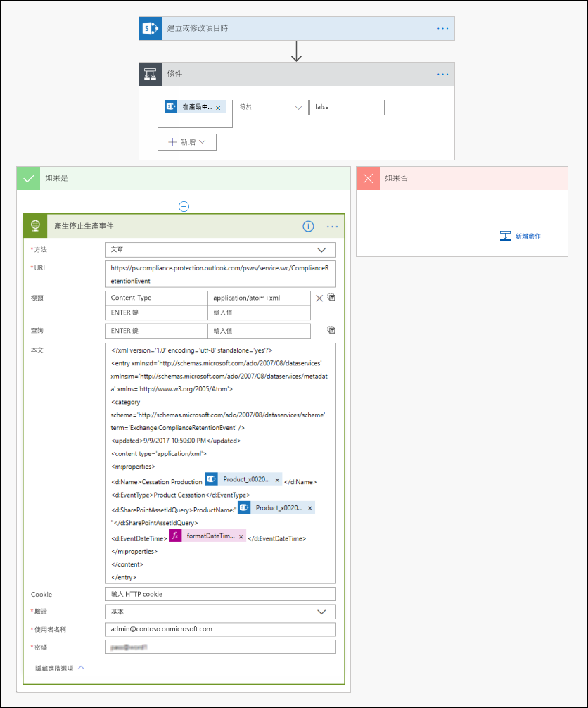

若要建立此流程，請從 SharePoint 連接器開始，並選取 [建立或修改項目時]**** 觸發程序。 指定網站位址和清單名稱，然後根據 **[生產中]** 清單欄值是否設定為 **[否]** (或在條件卡片中等於 false) 來新增條件。 然後根據內建的 HTTP 範本新增動作。 使用下一節中的值來設定 HTTP 動作。 您可以從下一節複製 URI 和 Body 屬性的值，然後將值貼到範本中。

- **方法**：POST
- **URI**：https://ps.compliance.protection.outlook.com/psws/service.svc/ComplianceRetentionEvent
- **標頭**：Key = Content-Type, Value = application/atom+xml
- **本文**：

```HTML
<?xml version='1.0' encoding='utf-8' standalone='yes'>
<entry xmlns:d='https://schemas.microsoft.com/ado/2007/08/dataservices' xmlns:m='https://schemas.microsoft.com/ado/2007/08/dataservices/metadata' xmlns='https://www.w3.org/2005/Atom'>
<category scheme='https://schemas.microsoft.com/ado/2007/08/dataservices/scheme' term='Exchange.ComplianceRetentionEvent'>
<updated>9/9/2017 10:50:00 PM</updated>
<content type='application/xml'>
<m:properties>
<d:Name>Cessation Production @{triggerBody()?['Product_x0020_Name']?['Value']}</d:Name>
<d:EventType>Product Cessation&lt;</d:EventType>
<d:SharePointAssetIdQuery>ProductName:&quot;@{triggerBody()?['Product_x0020_Name']?['Value']}<d:SharePointAssetIdQuery>
<d:EventDateTime>@{formatDateTime(utcNow(),'yyyy-MM-dd')}</d:EventDateTime>
</m:properties>
</content&gt>
</entry>
```

下一節說明必須針對此案例在動作的 *Body* 屬性內加以設定的參數。

- **Name**：此參數指定將在安全性與合規性中心建立的事件名稱。 在此案例中，名稱是「停產 xxx」，其中 xxx 是先前建立的 ProductName Managed 屬性的值。
- **EventType**：此參數值與建立的事件將套用的事件類型相對應。 建立保留標籤時，便會定義此事件類型。 在此案例中，事件類型為「停產」。
- **SharePointAssetIdQuery**：此參數定義事件的資產識別碼。 以事件為基礎的保留需要文件的唯一識別碼。 我們可以使用資產識別碼來識別特定事件適用的文件，或者如同此案例，使用中繼資料欄 (我們的產品名稱) 來識別。 為此，我們必須建立名為 ProductName 的 Managed 屬性，可在 KQL 查詢中使用該屬性 (或使用 RefinableString00，而不是建立新的 Managed 屬性)。 我們也需要將這個新的 Managed 屬性對應至 ows_Product_x0020_Name 編目屬性。 以下是此 Managed 屬性的螢幕擷取畫面。

    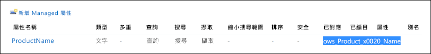

- **EventDateTime**：此參數定義事件發生的日期。 使用目前的日期格式：*formatDateTime(utcNow(),'yyyy-MM-dd'*)

### <a name="putting-it-all-together"></a>總整理

現在已建立並自動套用保留標籤，並已設定及建立流程，以下是當產品清單中「指尖陀螺」產品的 [生產中]**** 欄中的值從 [是]**** 改為 [否]**** 時所發生的情況。 隨即觸發流程並建立事件。 若要在安全性與合規性中心查看此事件，請移至 [記錄管理]****  >  [事件]****。

![在安全性與合規性中心的 [事件] 頁面上顯示由流程所觸發的事件](media/SPRetention28.png)

選取事件以在飛出頁面中檢視詳細資料。 請注意，即使已建立事件，事件狀態中的詳細資料仍會顯示未處理任何 SharePoint 網站或文件。

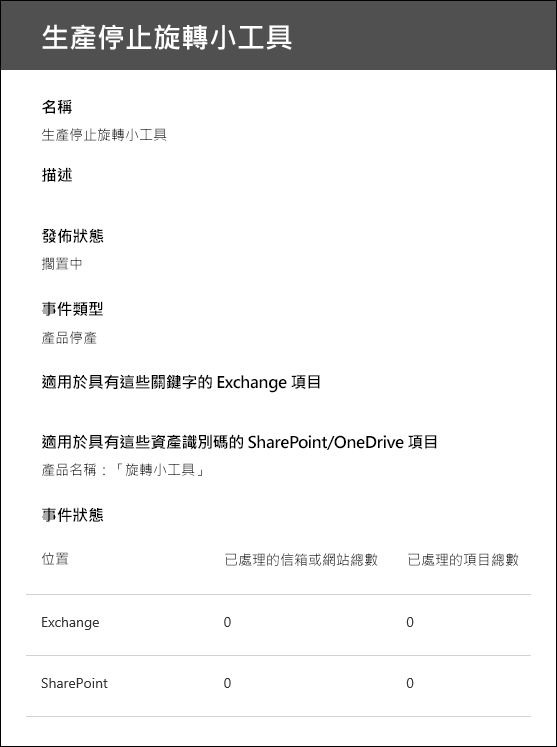

但在一段時間後，事件狀態區段會顯示已處理 SharePoint 網站和 SharePoint 文件。  

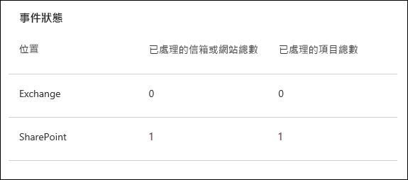
 
這表示套用到「指尖陀螺」產品文件的標籤的保留期間已根據「指尖陀螺」產品停產事件的日期起始。 假設您透過設定一天保留期間在測試環境中實作此案例，則可以在建立事件後的幾天內移至產品文件的文件庫，並驗證該文件是否已刪除 (在執行 SharePoint 中的刪除工作後)。

### <a name="more-about-asset-ids"></a>有關資產識別碼的詳細資訊

如[事件導向保留的概觀](event-driven-retention.md)中所述，了解事件類型、標籤、事件和資產識別碼之間的關聯非常重要。 資產識別碼只是 SharePoint 和 OneDrive 中的另一個文件屬性。 這可協助您進一步識別將由事件觸發保留期間的文件。 根據預設，SharePoint 具有資產識別碼屬性，可用於事件導向保留：

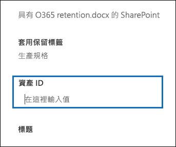

如以下螢幕擷取畫面所示，資產識別碼 Managed 屬性稱為 **ComplianceAssetId**。

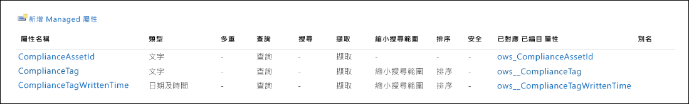

您也可以使用任何其他屬性，而不是使用預設資產識別碼屬性，如同此案例的做法。 但請務必了解，如果您沒有為事件指定資產識別碼或關鍵字，具有該事件類型之標籤的所有內容都將有由該事件觸發的保留期間。

### <a name="using-advanced-search-in-sharepoint"></a>在 SharePoint 中使用進階搜尋

在前面的螢幕擷取畫面中，我們也可以看到另一個與保留標籤相關的 Managed 屬性，稱為 **ComplianceTag**，並對應到編目屬性。 **ComplianceAssetId** Managed 屬性也會對應到編目屬性。 這表示您可以在進階搜尋中使用這些 Managed 屬性來搜尋所有已使用保留標籤標記的文件。

## <a name="summary"></a>摘要

本文說明根據 SharePoint 網站欄自動套用保留標籤的文件管理案例。 然後，我們使用以事件為基礎的保留和 Microsoft Flow，以根據外部事件自動觸發保留期間。

## <a name="credits"></a>製作群

此案例的作者： 

Frederic Lapierre<br/>Microsoft 服務首席顧問
