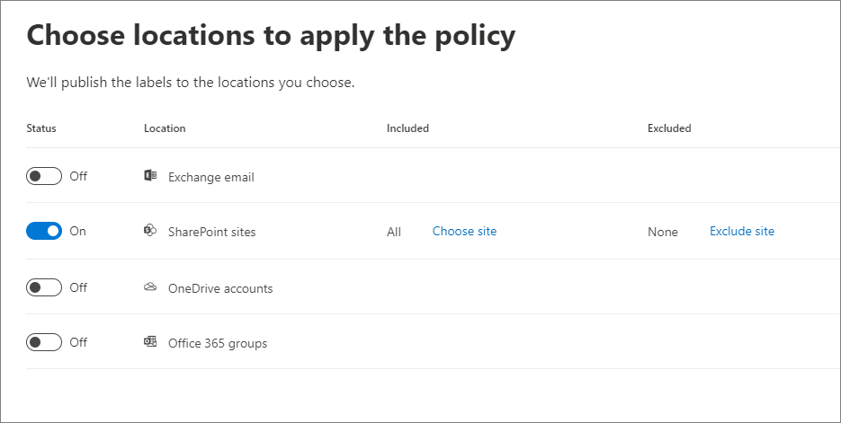
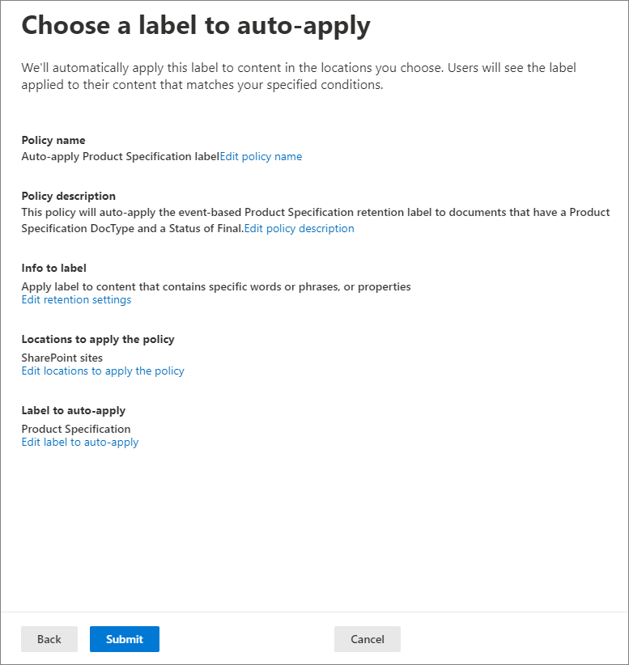

# <a name="manage-the-lifecycle-of-sharepoint-documents-with-retention-labels"></a><span data-ttu-id="8b62c-104">使用保留標籤管理 SharePoint 文件的生命週期</span><span class="sxs-lookup"><span data-stu-id="8b62c-104">Manage the lifecycle of SharePoint documents with retention labels</span></span>

><span data-ttu-id="8b62c-105">*[Microsoft 365 安全性與合規性的授權指引](https://aka.ms/ComplianceSD)。*</span><span class="sxs-lookup"><span data-stu-id="8b62c-105">*[Microsoft 365 licensing guidance for security & compliance](https://aka.ms/ComplianceSD).*</span></span>

<span data-ttu-id="8b62c-106">本文將說明如何使用保留標籤來管理儲存在 SharePoint Online 的產品相關文件的生命週期，具體做法是自動套用標籤及設定以事件為基礎的保留。</span><span class="sxs-lookup"><span data-stu-id="8b62c-106">This article describes how you can manage the lifecycle of product-related documents stored in SharePoint Online by using retention labels, and specifically by auto-applying labels and configuring event-based retention.</span></span> <span data-ttu-id="8b62c-107">自動套用功能會透過使用 SharePoint 中繼資料來運用文件分類。</span><span class="sxs-lookup"><span data-stu-id="8b62c-107">The auto-apply functionality leverages document classification by the use of SharePoint metadata.</span></span> <span data-ttu-id="8b62c-108">本文中的案例是以與產品相關的文件為基礎，但是相同的概念也可用於其他案例。</span><span class="sxs-lookup"><span data-stu-id="8b62c-108">The scenario in this article is based on product-related documents, but the same concepts can be used for other scenarios.</span></span> <span data-ttu-id="8b62c-109">例如，在石油與天然氣產業，您可以管理與石油平台、鑽井記錄或生產授權等實體資產相關的文件生命週期。</span><span class="sxs-lookup"><span data-stu-id="8b62c-109">For example, in the oil and gas industry, you could manage the lifecycle of documents related to physical assets such as oil platforms, well logs, or production licenses.</span></span> <span data-ttu-id="8b62c-110">在金融服務產業，您可以管理與銀行帳戶、貸款或保險合約相關的文件。</span><span class="sxs-lookup"><span data-stu-id="8b62c-110">In the financial services industry, you can manage documents related to bank accounts, mortgages, or insurance contracts.</span></span> <span data-ttu-id="8b62c-111">在公共部門，您可以管理與施工許可證或稅務表單相關的文件。</span><span class="sxs-lookup"><span data-stu-id="8b62c-111">In the public sector, you can manage documents related to construction permits or tax forms.</span></span>

<span data-ttu-id="8b62c-112">讓我們來看看這篇文章的案例。</span><span class="sxs-lookup"><span data-stu-id="8b62c-112">Let's look at the scenario for this article.</span></span> <span data-ttu-id="8b62c-113">我們將探討資訊架構和保留標籤的定義。</span><span class="sxs-lookup"><span data-stu-id="8b62c-113">We'll look at the information architecture and the definition of the retention labels.</span></span> <span data-ttu-id="8b62c-114">然後，我們將透過自動套用標籤來分類文件，最後產生啟動保留期間的事件。</span><span class="sxs-lookup"><span data-stu-id="8b62c-114">Then we'll look at classifying documents by auto-applying the labels, and finally generating the events that initiate the start of the retention period.</span></span>

## <a name="information-architecture"></a><span data-ttu-id="8b62c-115">資訊架構</span><span class="sxs-lookup"><span data-stu-id="8b62c-115">Information architecture</span></span>

<span data-ttu-id="8b62c-116">本文的案例是根據一家製造公司，該公司使用 SharePoint Online 來儲存所有與公司所開發的產品相關的文件。</span><span class="sxs-lookup"><span data-stu-id="8b62c-116">The scenario for this article is based on a manufacturing company that uses SharePoint Online to store all the documents related to the products the company develops.</span></span> <span data-ttu-id="8b62c-117">這些文件包括產品規格、與供應商簽訂的協議和使用者手冊。</span><span class="sxs-lookup"><span data-stu-id="8b62c-117">These documents include product specifications, agreements with suppliers, and user manuals.</span></span> <span data-ttu-id="8b62c-118">在 SharePoint 中將隨著企業內容管理原則的一部分儲存這些文件時，便會定義文件中繼資料，並將其用於分類。</span><span class="sxs-lookup"><span data-stu-id="8b62c-118">When these documents are stored in SharePoint as part of the Enterprise Content Management policies, document metadata is defined and used to classify them.</span></span> <span data-ttu-id="8b62c-119">每份文件皆有下列中繼資料屬性：</span><span class="sxs-lookup"><span data-stu-id="8b62c-119">Each document has the following metadata properties:</span></span>

- <span data-ttu-id="8b62c-120">**文件類型** (例如產品規格、協議和使用者手冊)</span><span class="sxs-lookup"><span data-stu-id="8b62c-120">**Doc Type** (such as product specification, agreement, and user manual)</span></span>

- <span data-ttu-id="8b62c-121">**產品名稱**</span><span class="sxs-lookup"><span data-stu-id="8b62c-121">**Product Name**</span></span>

- <span data-ttu-id="8b62c-122">**狀態** (草稿或完稿)</span><span class="sxs-lookup"><span data-stu-id="8b62c-122">**Status** (draft or final)</span></span>

<span data-ttu-id="8b62c-123">這類中繼資料會為所有文件形成名為 **Production Document** 的基本內容類型。</span><span class="sxs-lookup"><span data-stu-id="8b62c-123">This metadata forms the base content type called **Production Document** for all documents.</span></span>


> [!NOTE]
> <span data-ttu-id="8b62c-125">在稍後的案例中，保留原則會使用 **Doc Type** 和 **Status** 屬性進行分類，並自動套用保留標籤。</span><span class="sxs-lookup"><span data-stu-id="8b62c-125">The **Doc Type** and **Status** properties are used by retention policies later in the scenario to classify and auto-apply retention labels.</span></span>

<span data-ttu-id="8b62c-126">我們可以有數種表示不同文件類型的內容類型，但我們將焦點放在產品文件上。</span><span class="sxs-lookup"><span data-stu-id="8b62c-126">We can have several content types that represent different types of documents, but let's focus on the Product Documentation.</span></span>

<span data-ttu-id="8b62c-127">在此案例中，我們使用受管理的中繼資料服務和字詞庫來為**文件類型**建立字詞組，並為**產品名稱**建立另一個字詞組。</span><span class="sxs-lookup"><span data-stu-id="8b62c-127">In this scenario, we use the Managed Metadata service and the Term store to create a term set for **Doc Type** and another one for **Product Name**.</span></span> <span data-ttu-id="8b62c-128">我們會針對每個字詞組，為每個值建立一個字詞。</span><span class="sxs-lookup"><span data-stu-id="8b62c-128">For each term set, we create a term for each value.</span></span> <span data-ttu-id="8b62c-129">在 SharePoint 組織的字詞庫中，看起來類似以下範例：</span><span class="sxs-lookup"><span data-stu-id="8b62c-129">It would look like something like this in Term store for your SharePoint organization:</span></span>


<span data-ttu-id="8b62c-131">您可以使用[內容類型中樞](https://support.office.com/article/manage-content-type-publishing-06f39ac0-5576-4b68-abbc-82b68334889b)建立及發佈內容類型。</span><span class="sxs-lookup"><span data-stu-id="8b62c-131">Content Type can be created and published using the [Content Type Hub](https://support.office.com/article/manage-content-type-publishing-06f39ac0-5576-4b68-abbc-82b68334889b).</span></span> <span data-ttu-id="8b62c-132">您也可以使用網站提供的工具 (例如 [PnP 佈建架構](https://docs.microsoft.com/sharepoint/dev/solution-guidance/pnp-provisioning-framework)或[網站設計 JSON 架構](https://docs.microsoft.com/sharepoint/dev/declarative-customization/site-design-json-schema#define-a-new-content-type)) 建立及發佈內容類型。</span><span class="sxs-lookup"><span data-stu-id="8b62c-132">A content type can also be created and published using site provisioning tools such as the [PnP provisioning framework](https://docs.microsoft.com/sharepoint/dev/solution-guidance/pnp-provisioning-framework) or the [site design JSON schema](https://docs.microsoft.com/sharepoint/dev/declarative-customization/site-design-json-schema#define-a-new-content-type).</span></span>

<span data-ttu-id="8b62c-133">每個產品皆有一個專用的 SharePoint Online 網站，其中包含一個文件庫，且已啟用正確的內容類型。</span><span class="sxs-lookup"><span data-stu-id="8b62c-133">Each product has a dedicated SharePoint Online site that contains one document library, with the right content types enabled.</span></span> <span data-ttu-id="8b62c-134">所有文件皆儲存在此文件庫中。</span><span class="sxs-lookup"><span data-stu-id="8b62c-134">All documents are stored in this document library.</span></span>


> [!NOTE]
> <span data-ttu-id="8b62c-136">在此案例中，製造公司不會對每個產品皆使用一個 SharePoint Online 網站，而是對每個產品使用一個 Microsoft Team 來支援與小組成員共同作業，例如常設聊天室，並使用小組中的 [檔案]\*\*\*\* 索引標籤來進行文件管理。</span><span class="sxs-lookup"><span data-stu-id="8b62c-136">Instead of having a SharePoint Online site per product, the manufacturing company in this scenario could use a Microsoft Team per product that would support collaboration with members of the team, such as persistent chat and use the **Files** tab in the team for document management.</span></span> <span data-ttu-id="8b62c-137">本文只著重於文件，因此我們只會使用網站。</span><span class="sxs-lookup"><span data-stu-id="8b62c-137">In this article we only focus on documents, therefore we will only use a site.</span></span>

<span data-ttu-id="8b62c-138">以下是「指尖陀螺」產品文件庫的檢視：</span><span class="sxs-lookup"><span data-stu-id="8b62c-138">Here's a view of the document library for the Spinning Widget product:</span></span>


<span data-ttu-id="8b62c-140">現在，我們擁有用於文件管理的基本資訊架構，讓我們來看看使用中繼資料和文件分類的文件保留和處置策略。</span><span class="sxs-lookup"><span data-stu-id="8b62c-140">Now that we have the basic information architecture in place for document management, let's look at the retention and disposal strategy of the documents that use the metadata and classification of documents.</span></span>

## <a name="retention-and-disposition"></a><span data-ttu-id="8b62c-141">保留和處置</span><span class="sxs-lookup"><span data-stu-id="8b62c-141">Retention and disposition</span></span>

<span data-ttu-id="8b62c-142">製造公司的合規性和資料控管原則規定資料保留和處置的方式。</span><span class="sxs-lookup"><span data-stu-id="8b62c-142">The manufacturing company's compliance and data governance policies dictate the way data is preserved and disposed of.</span></span> <span data-ttu-id="8b62c-143">產品相關文件必須在產品製造期間保留，並在製造完後保留一段特定時間。</span><span class="sxs-lookup"><span data-stu-id="8b62c-143">Product-related documents must be kept for as long as the product is manufactured, and for a certain period after that.</span></span> <span data-ttu-id="8b62c-144">此期間與產品規格、協議和使用者手冊不同。</span><span class="sxs-lookup"><span data-stu-id="8b62c-144">This period is different for product specifications, agreements, and user manuals.</span></span> <span data-ttu-id="8b62c-145">下表指示保留和處置需求：</span><span class="sxs-lookup"><span data-stu-id="8b62c-145">The following table indicates the retention and disposition requirements:</span></span>

| <span data-ttu-id="8b62c-146">**文件類型**</span><span class="sxs-lookup"><span data-stu-id="8b62c-146">**Document type**</span></span>          | <span data-ttu-id="8b62c-147">**保留**</span><span class="sxs-lookup"><span data-stu-id="8b62c-147">**Retention**</span></span>                          | <span data-ttu-id="8b62c-148">**處置**</span><span class="sxs-lookup"><span data-stu-id="8b62c-148">**Disposition**</span></span>                              |
| -------------------------- | -------------------------------------- | -------------------------------------------- |
| <span data-ttu-id="8b62c-149">產品規格</span><span class="sxs-lookup"><span data-stu-id="8b62c-149">Product specification</span></span>      | <span data-ttu-id="8b62c-150">生產停止後 5 年</span><span class="sxs-lookup"><span data-stu-id="8b62c-150">5 years after cessation of production</span></span>  | <span data-ttu-id="8b62c-151">刪除</span><span class="sxs-lookup"><span data-stu-id="8b62c-151">Delete</span></span>                                       |
| <span data-ttu-id="8b62c-152">產品協議</span><span class="sxs-lookup"><span data-stu-id="8b62c-152">Product agreement</span></span>          | <span data-ttu-id="8b62c-153">生產停止後 10 年</span><span class="sxs-lookup"><span data-stu-id="8b62c-153">10 years after cessation of production</span></span> | <span data-ttu-id="8b62c-154">檢閱</span><span class="sxs-lookup"><span data-stu-id="8b62c-154">Review</span></span>                                       |
| <span data-ttu-id="8b62c-155">使用者手冊</span><span class="sxs-lookup"><span data-stu-id="8b62c-155">User manual</span></span>                | <span data-ttu-id="8b62c-156">生產停止後 5 年</span><span class="sxs-lookup"><span data-stu-id="8b62c-156">5 years after cessation of production</span></span>  | <span data-ttu-id="8b62c-157">刪除</span><span class="sxs-lookup"><span data-stu-id="8b62c-157">Delete</span></span>                                       |
| <span data-ttu-id="8b62c-158">其他所有類型的文件</span><span class="sxs-lookup"><span data-stu-id="8b62c-158">All other types of documents</span></span> | <span data-ttu-id="8b62c-159">不要積極保留其他文件</span><span class="sxs-lookup"><span data-stu-id="8b62c-159">Don't actively retain other documents</span></span>  | <span data-ttu-id="8b62c-160">在文件超過 3 年後刪除<sup>\*</sup></span><span class="sxs-lookup"><span data-stu-id="8b62c-160">Delete when document is older than 3 years<sup>\*</sup></span></span>  |
|||

> [!NOTE]
> <span data-ttu-id="8b62c-161"><sup>\*</sup>如果文件在過去 3 年內未曾修改，便會視為超過 3 年。</span><span class="sxs-lookup"><span data-stu-id="8b62c-161"><sup>\*</sup> A document is considered older than 3 years if it hasn't been modified within the last 3 years.</span></span>

<span data-ttu-id="8b62c-162">我們會使用安全性與合規性中心建立下列保留標籤：</span><span class="sxs-lookup"><span data-stu-id="8b62c-162">Using the security and compliance center, we create the following retention labels:</span></span>

  - <span data-ttu-id="8b62c-163">產品規格</span><span class="sxs-lookup"><span data-stu-id="8b62c-163">Product Specification</span></span>

  - <span data-ttu-id="8b62c-164">產品協議</span><span class="sxs-lookup"><span data-stu-id="8b62c-164">Product Agreement</span></span>

  - <span data-ttu-id="8b62c-165">使用者手冊</span><span class="sxs-lookup"><span data-stu-id="8b62c-165">User Manual</span></span>

<span data-ttu-id="8b62c-166">在本文中，我們僅示範如何建立及自動套用產品規格保留標籤。</span><span class="sxs-lookup"><span data-stu-id="8b62c-166">In this article, we only show how to create and auto-apply the Product Specification retention label.</span></span> <span data-ttu-id="8b62c-167">若要實作完整案例，您必須為其他兩種文件類型建立及自動套用保留標籤。</span><span class="sxs-lookup"><span data-stu-id="8b62c-167">To implement the complete scenario, you would create and auto-apply retention labels for the other two document types.</span></span>

### <a name="settings-for-the-product-specification-retention-label"></a><span data-ttu-id="8b62c-168">產品規格保留標籤的設定</span><span class="sxs-lookup"><span data-stu-id="8b62c-168">Settings for the Product Specification retention label</span></span>

<span data-ttu-id="8b62c-169">以下是產品規格保留標籤的[檔案計畫](file-plan-manager.md)：</span><span class="sxs-lookup"><span data-stu-id="8b62c-169">Here's the [file plan](file-plan-manager.md) for the Product Specification retention label:</span></span> 

- <span data-ttu-id="8b62c-170">**名稱：** 產品規格</span><span class="sxs-lookup"><span data-stu-id="8b62c-170">**Name:** Product Specification</span></span>

- <span data-ttu-id="8b62c-171">**系統管理員描述：** 產品規格標籤、生產停止後保留五年、自動刪除、以事件為基礎的保留、事件類型為「產品停產」。</span><span class="sxs-lookup"><span data-stu-id="8b62c-171">**Description for admins:** Product Specification Label, retain for five years after cessation of production, auto delete, event-based retention, event type is Product Cessation.</span></span>

- <span data-ttu-id="8b62c-172">**使用者描述：** 生產停止後保留五年。</span><span class="sxs-lookup"><span data-stu-id="8b62c-172">**Description for users:** Retain for five years after cessation of production.</span></span>

- <span data-ttu-id="8b62c-173">**保留動作：** 保留及刪除</span><span class="sxs-lookup"><span data-stu-id="8b62c-173">**Retention action:** Keep and delete</span></span>

- <span data-ttu-id="8b62c-174">**保留期間：** 五年 (1825 天)</span><span class="sxs-lookup"><span data-stu-id="8b62c-174">**Retention duration:** Five years (1825 days)</span></span>

- <span data-ttu-id="8b62c-175">**記錄標籤**：設定保留標籤，以將內容分類成[記錄](records.md) (分類為記錄的文件不能由使用者修改或刪除)</span><span class="sxs-lookup"><span data-stu-id="8b62c-175">**Record label**: Configure the retention label to classify content as a [record](records.md) (documents that are classified as a record can't be modified or deleted by users)</span></span>

- <span data-ttu-id="8b62c-176">**檔案計畫描述元：**(用於簡化案例，不會提供檔案描述元)</span><span class="sxs-lookup"><span data-stu-id="8b62c-176">**File plan descriptors:** (for simplifying the scenario, no file descriptors are provided)</span></span>

<span data-ttu-id="8b62c-177">下列螢幕擷取畫面顯示在安全性與合規合規性中心建立產品規格[保留標籤](retention.md#retention-labels)時的設定。</span><span class="sxs-lookup"><span data-stu-id="8b62c-177">The following screenshot shows the settings when you create the Product Specification [retention label](retention.md#retention-labels) in the security and compliance center.</span></span> <span data-ttu-id="8b62c-178">您可以在建立保留標籤時，建立**產品停產**事件類型。</span><span class="sxs-lookup"><span data-stu-id="8b62c-178">You can create the **Product Cessation** event type when you create the retention label.</span></span> <span data-ttu-id="8b62c-179">請參閱下列步驟。</span><span class="sxs-lookup"><span data-stu-id="8b62c-179">See the steps below.</span></span>


> [!NOTE]
> <span data-ttu-id="8b62c-181">出於實際目的，以及為了避免需要等待 5 年才能查看自動刪除的文件，如果您在測試環境中重新建立此案例，請將保留期間設定為 1 天。</span><span class="sxs-lookup"><span data-stu-id="8b62c-181">For the practical purposes and to avoid having to wait 5 years to see a document automatically deleted, set the retention duration to 1 day if you're recreating this scenario in your test environment.</span></span>

### <a name="create-an-event-type-when-creating-a-retention-label"></a><span data-ttu-id="8b62c-182">在建立保留標籤時建立事件類型</span><span class="sxs-lookup"><span data-stu-id="8b62c-182">Create an event type when creating a retention label</span></span>

1. <span data-ttu-id="8b62c-183">在 [以下列條件保留或刪除內容]\*\*\*\* 下拉式清單中，選取 [事件]\*\*\*\*。</span><span class="sxs-lookup"><span data-stu-id="8b62c-183">In the **Retain or delete content based** on dropdown list, select **an event**.</span></span>

2. <span data-ttu-id="8b62c-184">選取 [選擇事件類型]\*\*\*\*。</span><span class="sxs-lookup"><span data-stu-id="8b62c-184">Select **Choose an event type**.</span></span>

   

3. <span data-ttu-id="8b62c-186">在 [選擇事件類型]\*\*\*\* 頁面中，選取 [您可以在這裡建立新的事件類型]\*\*\*\*。</span><span class="sxs-lookup"><span data-stu-id="8b62c-186">On the **Choose an event type** page, select **You can create new event types here**.</span></span>

4. <span data-ttu-id="8b62c-187">建立名為**產品停產**的事件類型，並提供描述，然後選取 [完成]\*\*\*\* 來建立。</span><span class="sxs-lookup"><span data-stu-id="8b62c-187">Create an event type named **Product Cessation**, give a description, and select **Finish** to create it.</span></span> 

5. <span data-ttu-id="8b62c-188">回到 [選擇事件類型]\*\*\*\* 頁面，選取您所建立的 [產品停產]\*\*\*\* 事件類型，然後選取 [新增]\*\*\*\*。</span><span class="sxs-lookup"><span data-stu-id="8b62c-188">Back on the **Choose an event type** page, select the **Product Cessation** event type that you created, and then select **Add**.</span></span>

<span data-ttu-id="8b62c-189">產品規格保留標籤的設定看起來會像這樣。</span><span class="sxs-lookup"><span data-stu-id="8b62c-189">Here's what the settings look like for the Product Specification retention label.</span></span> <span data-ttu-id="8b62c-190">選取 [建立此標籤]\*\*\*\* 來建立。</span><span class="sxs-lookup"><span data-stu-id="8b62c-190">Select **Create this label** to create it.</span></span>


> [!TIP]
> <span data-ttu-id="8b62c-192">如需更多詳細步驟，請參閱[建立其保留期間是根據事件的標籤](event-driven-retention.md#step-1-create-a-label-whose-retention-period-is-based-on-an-event)。</span><span class="sxs-lookup"><span data-stu-id="8b62c-192">For more detailed steps, see [Create a label whose retention period is based on an event](event-driven-retention.md#step-1-create-a-label-whose-retention-period-is-based-on-an-event).</span></span>

<span data-ttu-id="8b62c-193">現在已建立保留標籤，讓我們來看看如何將保留標籤自動套用至產品規格內容。</span><span class="sxs-lookup"><span data-stu-id="8b62c-193">Now that the retention label is created, let's look at auto-applying the retention label to product specification content.</span></span>

## <a name="classifying-content-by-auto-applying-retention-labels"></a><span data-ttu-id="8b62c-194">使用自動套用保留標籤來分類內容</span><span class="sxs-lookup"><span data-stu-id="8b62c-194">Classifying content by auto-applying retention labels</span></span>

<span data-ttu-id="8b62c-195">我們將[自動套用](apply-retention-labels-automatically.md)使用關鍵字查詢語言 (KQL) 為此案例所建立的保留標籤。</span><span class="sxs-lookup"><span data-stu-id="8b62c-195">We're going to [auto-apply](apply-retention-labels-automatically.md) the retention labels that we've created for this scenario by using Keyword Query Language (KQL).</span></span> <span data-ttu-id="8b62c-196">KQL 是用於建立搜尋查詢的語言。</span><span class="sxs-lookup"><span data-stu-id="8b62c-196">KQL is the language used to build search queries.</span></span> <span data-ttu-id="8b62c-197">您可以在 KQL 中使用關鍵字或 Managed 屬性進行搜尋。</span><span class="sxs-lookup"><span data-stu-id="8b62c-197">In KQL, you can search by using keywords or managed properties.</span></span> <span data-ttu-id="8b62c-198">如需關於 KQL 的詳細資訊，請參閱<https://docs.microsoft.com/sharepoint/dev/general-development/keyword-query-language-kql-syntax-reference></span><span class="sxs-lookup"><span data-stu-id="8b62c-198">For more information about KQL, see <https://docs.microsoft.com/sharepoint/dev/general-development/keyword-query-language-kql-syntax-reference></span></span>

<span data-ttu-id="8b62c-199">我們想要讓 Microsoft 365 將**產品規格**保留標籤套用至所有**狀態**為**完稿**，且**文件類型**為**產品規格**的文件。</span><span class="sxs-lookup"><span data-stu-id="8b62c-199">At a high level, we want to tell Microsoft 365 to "apply the **Product Specification** retention label to all documents that have a **Status** of **Final** and a **Doc Type** of **Product Specification**.</span></span> <span data-ttu-id="8b62c-200">請記住，**狀態**和**文件類型**是先前在[資訊架構](#information-architecture)一節中為產品文件內容類型定義的網站欄。</span><span class="sxs-lookup"><span data-stu-id="8b62c-200">Recall that **Status** and **Doc Type** are the site columns we previously defined for Product Documentation content type in the [Information architecture](#information-architecture) section.</span></span> <span data-ttu-id="8b62c-201">為了完成此操作，我們需要設定搜尋結構描述。</span><span class="sxs-lookup"><span data-stu-id="8b62c-201">To achieve this, we need to configure the search schema.</span></span>

<span data-ttu-id="8b62c-202">當 SharePoint 為內容編制索引時，便會自動為每個網站欄產生編目屬性。</span><span class="sxs-lookup"><span data-stu-id="8b62c-202">When SharePoint indexes content, it automatically generates crawled properties for each site column.</span></span> <span data-ttu-id="8b62c-203">在此案例中，我們想要了解**文件類型**和**狀態**屬性。</span><span class="sxs-lookup"><span data-stu-id="8b62c-203">For this scenario, we're interested in the **Doc Type** and **Status** properties.</span></span> <span data-ttu-id="8b62c-204">我們需要使用正確內容類型的文件庫中的文件，並填入網站欄，以便在搜尋中建立編目屬性。</span><span class="sxs-lookup"><span data-stu-id="8b62c-204">We need documents in the library using the right content type and have the site columns filled in, in order for search to create the crawled properties.</span></span>

<span data-ttu-id="8b62c-205">在 SharePoint 系統管理中心，我們可以開啟搜尋設定，然後選取 [管理搜尋結構描述]\*\*\*\* 以檢視及設定編目屬性。</span><span class="sxs-lookup"><span data-stu-id="8b62c-205">In the SharePoint admin center, we can open the Search configuration, and select **Manage Search Schema** to view and configure the crawled properties.</span></span>


<span data-ttu-id="8b62c-207">如果我們在 [編目屬性]\*\*\*\* 方塊中輸入 **status**，然後選取綠色箭號，則會看到如下結果：</span><span class="sxs-lookup"><span data-stu-id="8b62c-207">If we type **status** in the **Crawled properties** box, and select the green arrow, we should see a result like this:</span></span>


<span data-ttu-id="8b62c-209">屬性 **ows\_\_Status** (請注意雙底線) 是我們想了解的屬性。</span><span class="sxs-lookup"><span data-stu-id="8b62c-209">The property **ows\_\_Status** (notice the double underscore) is the one that interests us.</span></span> <span data-ttu-id="8b62c-210">這會對應到 Production Document 內容類型的 **Status** 屬性。</span><span class="sxs-lookup"><span data-stu-id="8b62c-210">This maps to the **Status** property of the Production Document content type.</span></span>

<span data-ttu-id="8b62c-211">現在，如果輸入 **ows\_doc**，然後選取綠色箭號，則會看到如下所示的內容：</span><span class="sxs-lookup"><span data-stu-id="8b62c-211">Now if we type **ows\_doc** and select the green arrow we should see something like this:</span></span>


<span data-ttu-id="8b62c-213">屬性 **ows\_Doc\_x0020\_Type** 是我們想了解的第二個屬性。</span><span class="sxs-lookup"><span data-stu-id="8b62c-213">The property **ows\_Doc\_x0020\_Type** is the second property that interests us.</span></span> <span data-ttu-id="8b62c-214">這會對應到生產文件內容類型的**文件類型**屬性。</span><span class="sxs-lookup"><span data-stu-id="8b62c-214">This maps to the **Doc Type** property of the Production Document content type.</span></span>

> [!TIP]
> <span data-ttu-id="8b62c-215">若要識別此案例的編目屬性名稱，請移至包含生產文件的文件庫，然後移至文件庫設定。</span><span class="sxs-lookup"><span data-stu-id="8b62c-215">To identify the name of a crawled property for this scenario, go the document library that contains the production documents and then go to the library settings.</span></span> <span data-ttu-id="8b62c-216">在 [欄]\*\*\*\* 中，選取欄的名稱 (例如 **Status** 或 **Doc Type**) 以開啟網站欄頁面。</span><span class="sxs-lookup"><span data-stu-id="8b62c-216">In the **Columns**, select the name of the column (for example, **Status** or **Doc Type**) to open the site column page.</span></span> <span data-ttu-id="8b62c-217">該網頁 URL 中的 **Field** 參數包含欄位的名稱。</span><span class="sxs-lookup"><span data-stu-id="8b62c-217">The **Field** parameter in the URL for that page contains the name of the field.</span></span> <span data-ttu-id="8b62c-218">此欄位名稱 (以「ows_」開頭) 是編目屬性的名稱。</span><span class="sxs-lookup"><span data-stu-id="8b62c-218">This field name, prefixed with "ows_", is the name of the crawled property.</span></span> <span data-ttu-id="8b62c-219">例如，URL `https://tenantname.sharepoint.com/sites/SpinningWidget/_layouts/15/FldEdit.aspx?List=%7BC38C2F45-3BD6-4C3B-AA3B-EF5DF6B3D172%7D&Field=_Status` 對應至 **ows\_\_Status** 編目屬性。</span><span class="sxs-lookup"><span data-stu-id="8b62c-219">For example, the URL `https://tenantname.sharepoint.com/sites/SpinningWidget/_layouts/15/FldEdit.aspx?List=%7BC38C2F45-3BD6-4C3B-AA3B-EF5DF6B3D172%7D&Field=_Status` corresponds to the **ows\_\_Status** crawled property.</span></span>

<span data-ttu-id="8b62c-220">如果您要尋找的編目屬性並未出現在 SharePoint 系統管理中心的 [管理搜尋結構描述] 區段中，可能是下列其中一個原因：</span><span class="sxs-lookup"><span data-stu-id="8b62c-220">If the crawled properties you're looking for don't appear in the Manage Search Schema section in the SharePoint admin center, it could be for one of the following reasons:</span></span>

- <span data-ttu-id="8b62c-221">文件未編制索引。</span><span class="sxs-lookup"><span data-stu-id="8b62c-221">The documents haven't been indexed.</span></span> <span data-ttu-id="8b62c-222">您可以移至 [文件庫設定] > [進階設定] 以強制重新編制文件庫的索引。</span><span class="sxs-lookup"><span data-stu-id="8b62c-222">You can force a re-index of the library by going to Document library settings > Advanced Settings.</span></span>

- <span data-ttu-id="8b62c-223">如果文件庫位於新式網站，請確認 SharePoint 系統管理員也是網站集合系統管理員。</span><span class="sxs-lookup"><span data-stu-id="8b62c-223">If the document library is in a modern site, make sure that the SharePoint admin is also a site collection admin.</span></span>

<span data-ttu-id="8b62c-224">如需編目屬性和 Managed 屬性的詳細資訊，請參閱＜[在 SharePoint Server 中自動建立 Managed 屬性](https://docs.microsoft.com/sharepoint/technical-reference/automatically-created-managed-properties-in-sharepoint)＞。</span><span class="sxs-lookup"><span data-stu-id="8b62c-224">For more information about crawled and managed properties, see [Automatically created managed properties in SharePoint Server](https://docs.microsoft.com/sharepoint/technical-reference/automatically-created-managed-properties-in-sharepoint).</span></span>

### <a name="mapping-crawled-properties-to-pre-defined-managed-properties"></a><span data-ttu-id="8b62c-225">將編目屬性對應到預先定義的 Managed 屬性</span><span class="sxs-lookup"><span data-stu-id="8b62c-225">Mapping crawled properties to pre-defined managed properties</span></span>

<span data-ttu-id="8b62c-226">KQL 無法在搜尋查詢中使用編目屬性。</span><span class="sxs-lookup"><span data-stu-id="8b62c-226">KQL can't use crawled properties in search queries.</span></span> <span data-ttu-id="8b62c-227">而必須使用受管理的屬性。</span><span class="sxs-lookup"><span data-stu-id="8b62c-227">It has to use a managed property.</span></span> <span data-ttu-id="8b62c-228">在標準搜尋案例中，我們建立受管理的屬性，並將其對應到所需的編目屬性。</span><span class="sxs-lookup"><span data-stu-id="8b62c-228">In a normal search scenario, we create a managed property and map it to the crawled property that we need.</span></span> <span data-ttu-id="8b62c-229">不過，針對自動套用保留標籤，您只能在 KQL 預先定義的 Managed 屬性中指定，而不能在自訂 Managed 屬性中指定。</span><span class="sxs-lookup"><span data-stu-id="8b62c-229">However, for auto-applying retention labels, you can only specify in KQL pre-defined managed properties and not custom managed properties.</span></span> <span data-ttu-id="8b62c-230">系統中已建立一組預先定義的 Managed 屬性，可使用字串 RefinableString00 到 RefinableString199。</span><span class="sxs-lookup"><span data-stu-id="8b62c-230">There's a set of predefined managed properties already created in the system for string RefinableString00 to RefinableString199 that can be used.</span></span> <span data-ttu-id="8b62c-231">如需完整清單，請參閱[預設未使用的 Managed 屬性](https://docs.microsoft.com/sharepoint/manage-search-schema#default-unused-managed-properties)。</span><span class="sxs-lookup"><span data-stu-id="8b62c-231">For a complete list, see [Default unused managed properties](https://docs.microsoft.com/sharepoint/manage-search-schema#default-unused-managed-properties).</span></span> <span data-ttu-id="8b62c-232">這些預設的 Managed 屬性通常是用於定義搜尋精簡器。</span><span class="sxs-lookup"><span data-stu-id="8b62c-232">These default managed properties are typically used for defining search refiners.</span></span>

<span data-ttu-id="8b62c-233">為了讓 KQL 查詢能夠正常運作，並將正確的保留標籤自動套用至產品文件內容，我們將編目屬性 **ows\_Doc\_x0020\_Type** 和 **ows\_\_Status** 對應至兩個可精簡搜尋的 Managed 屬性。</span><span class="sxs-lookup"><span data-stu-id="8b62c-233">For the KQL query to work and automatically apply the correct retention label to product document content, we map the crawled properties **ows\_Doc\_x0020\_Type** and **ows\_\_Status** to two refinable managed properties.</span></span> <span data-ttu-id="8b62c-234">此案例的測試環境中並未使用 **RefinableString00** 和 **RefinableString01**。</span><span class="sxs-lookup"><span data-stu-id="8b62c-234">In our test environment for this scenario, **RefinableString00** and **RefinableString01** aren't being used.</span></span> <span data-ttu-id="8b62c-235">我們會透過在 SharePont 系統管理中心的**管理搜尋結構描述**中查看 **Managed 屬性**來判斷。</span><span class="sxs-lookup"><span data-stu-id="8b62c-235">We determined this by looking at **Managed Properties** in the **Manage Search Schema** in the SharePont admin center.</span></span>


<span data-ttu-id="8b62c-237">請注意，前面螢幕擷取畫面中 [對應的編目屬性]\*\*\*\* 欄為空白。</span><span class="sxs-lookup"><span data-stu-id="8b62c-237">Notice that the **Mapped Crawled Properties** column in the previous screenshot is empty.</span></span>

<span data-ttu-id="8b62c-238">若要對應 **ows\_Doc\_x0020\_Type** 編目屬性，請執行下列動作：</span><span class="sxs-lookup"><span data-stu-id="8b62c-238">To map the **ows\_Doc\_x0020\_Type** crawled property, do the following:</span></span>

1. <span data-ttu-id="8b62c-239">在 [Managed 屬性]\*\*\*\* 篩選方塊中，輸入 **RefinableString00**，然後選取綠色箭號。</span><span class="sxs-lookup"><span data-stu-id="8b62c-239">In the **Managed property** filter box, type **RefinableString00** and select the green arrow.</span></span>

2. <span data-ttu-id="8b62c-240">在結果清單中，選取 **RefinableString00** 連結，然後向下捲動至 [對應至編目屬性]\*\*\*\* 區段。</span><span class="sxs-lookup"><span data-stu-id="8b62c-240">In the results list, select the **RefinableString00** link, and then scroll down to the **Mappings to crawled properties** section.</span></span>  

3. <span data-ttu-id="8b62c-241">按一下 [新增對應]\*\*\*\*，然後在 [編目屬性選項]\*\*\*\* 視窗中的 [搜尋編目屬性名稱]\*\*\*\* 方塊中，輸入 **ows\_Doc\_x0020\_Type**。</span><span class="sxs-lookup"><span data-stu-id="8b62c-241">Select **Add a Mapping**, and then type **ows\_Doc\_x0020\_Type** in the **Search for a crawled property name** box in the **Crawled property selection** window.</span></span> <span data-ttu-id="8b62c-242">選取 [尋找]\*\*\*\*。</span><span class="sxs-lookup"><span data-stu-id="8b62c-242">Select **Find**.</span></span>  

4. <span data-ttu-id="8b62c-243">在結果清單中，選取 **ows\_Doc\_x0020\_Type**，然後選取 [確定]\*\*\*\*。</span><span class="sxs-lookup"><span data-stu-id="8b62c-243">In the results list, select **ows\_Doc\_x0020\_Type** and then select **OK**.</span></span>

   <span data-ttu-id="8b62c-244">在 [對應的編目屬性]\*\*\*\* 區段中，您應該會看到類似以下螢幕擷取畫面的內容：</span><span class="sxs-lookup"><span data-stu-id="8b62c-244">In the **Mapped Crawled Properties** section, you should see something similar to this screenshot:</span></span>

   ![在 [對應的編目] 屬性區段中選取 [新增對應]](../media/SPRetention13.png)

5. <span data-ttu-id="8b62c-246">捲動到頁面底部，然後選取 [確定]\*\*\*\* 以儲存對應。</span><span class="sxs-lookup"><span data-stu-id="8b62c-246">Scroll to the bottom of the page and select **OK** to save the mapping.</span></span>

<span data-ttu-id="8b62c-247">重複此程序，以對應 RefinableString01 和 ows\_\_Status。</span><span class="sxs-lookup"><span data-stu-id="8b62c-247">Repeat this same procedure to map RefinableString01 and ows\_\_Status.</span></span>

<span data-ttu-id="8b62c-248">現在，您應有兩個 Managed 屬性對應到兩個編目屬性：</span><span class="sxs-lookup"><span data-stu-id="8b62c-248">Now you should have two managed properties mapped to the two crawled properties:</span></span>


<span data-ttu-id="8b62c-250">讓我們執行企業搜尋來驗證是否已正確設定。</span><span class="sxs-lookup"><span data-stu-id="8b62c-250">Let's verify that all this is set up correctly by running an enterprise search.</span></span> <span data-ttu-id="8b62c-251">在瀏覽器中，移至 https://yourtenant.sharepoint.com/search。</span><span class="sxs-lookup"><span data-stu-id="8b62c-251">In a browser, go to https://yourtenant.sharepoint.com/search.</span></span> <span data-ttu-id="8b62c-252">在搜尋方塊中，輸入 **RefinableString00:"Product Specification"**，然後按 Enter。</span><span class="sxs-lookup"><span data-stu-id="8b62c-252">In the search box, type **RefinableString00:"Product Specification"** and press enter.</span></span> <span data-ttu-id="8b62c-253">此動作會返回產品**文件類型**為產品規格的所有文件。</span><span class="sxs-lookup"><span data-stu-id="8b62c-253">This should return all documents that have Product Specification as **Doc Type**.</span></span>

<span data-ttu-id="8b62c-254">現在，在搜尋方塊中，輸入 **RefinableString00:"Product Specification" AND RefinableString01:Final**，然後按 Enter。</span><span class="sxs-lookup"><span data-stu-id="8b62c-254">Now in the search box, type **RefinableString00:"Product Specification" AND RefinableString01:Final** and press enter.</span></span> <span data-ttu-id="8b62c-255">此動作會返回產品**文件類型**為產品規格且狀態為**完稿**的所有文件。</span><span class="sxs-lookup"><span data-stu-id="8b62c-255">This should return all documents that have Product Specification as **Doc Type** and a Status of **Final**.</span></span>

### <a name="creating-the-auto-apply-label-policies"></a><span data-ttu-id="8b62c-256">建立自動套用標籤原則</span><span class="sxs-lookup"><span data-stu-id="8b62c-256">Creating the auto-apply label policies</span></span>

<span data-ttu-id="8b62c-257">現在我們已驗證 KQL 查詢正常運作，讓我們來建立使用 KQL 查詢的標籤原則，以將產品規格保留標籤自動套用到適當的文件。</span><span class="sxs-lookup"><span data-stu-id="8b62c-257">Now that we verified that the KQL query is working correctly, let's create the label policy that uses a KQL query to auto-apply the Product Specification retention label to the appropriate documents.</span></span>

1. <span data-ttu-id="8b62c-258">在[安全性與合規性中心](https://protection.office.com)中，移至 [分類]\*\*\*\*  >  [保留標籤]\*\*\*\*，然後選取 [自動套用標籤]\*\*\*\*。</span><span class="sxs-lookup"><span data-stu-id="8b62c-258">In the [security and compliance center](https://protection.office.com), go to **Classification** > **Retention labels**, and then select **Auto-apply a label**.</span></span> 

   ![在 [標籤] 頁面上選取 [自動套用標籤]](../media/SPRetention16.png)

2. <span data-ttu-id="8b62c-260">在 [選擇要自動套用的標籤]\*\*\*\* 精靈頁面上，選取 [選擇要自動套用的標籤]\*\*\*\*。</span><span class="sxs-lookup"><span data-stu-id="8b62c-260">On the **Choose a label to auto-apply** wizard page, select **Choose a label to auto-apply**.</span></span>

3. <span data-ttu-id="8b62c-261">在標籤清單中，選取 [產品規格]\*\*\*\*，選取 [新增]\*\*\*\*，然後選取 [下一步]\*\*\*\*。</span><span class="sxs-lookup"><span data-stu-id="8b62c-261">In the list of labels, select **Product Specification**, select **Add**, and then select **Next**.</span></span>

4. <span data-ttu-id="8b62c-262">選取 [將標籤套用到包含特定文字或字詞的內容]\*\*\*\*，然後選取 [下一步]\*\*\*\*。</span><span class="sxs-lookup"><span data-stu-id="8b62c-262">Select **Apply label to content that contains specific words or phrases, or properties**, and then select **Next**.</span></span>

   ![選取 [將標籤套用到包含特定字詞、片語或屬性的內容]](../media/SPRetention17.png)

   <span data-ttu-id="8b62c-264">在下一個步驟中，您將提供上一節中測試的相同 KQL 搜尋查詢。</span><span class="sxs-lookup"><span data-stu-id="8b62c-264">In the next step, you will provide the same KQL search query that we tested in the previous section.</span></span> <span data-ttu-id="8b62c-265">當您回收時，此查詢會傳回狀態為「完稿」的所有產品規格文件。</span><span class="sxs-lookup"><span data-stu-id="8b62c-265">As you recall, this query returned all Product Specification documents that have a status of Final.</span></span> <span data-ttu-id="8b62c-266">在標籤原則中使用此相同查詢的結果表示，產品規格保留標籤將會自動套用至符合此搜尋查詢的所有文件。</span><span class="sxs-lookup"><span data-stu-id="8b62c-266">The result of using this same query in the label policy means that the Product Specification retention label will be automatically applied to all documents that match this search query.</span></span>

5. <span data-ttu-id="8b62c-267">在 [關鍵字查詢編輯器]\*\*\*\* 方塊中，輸入 **RefinableString00:"Product Specification" AND RefinableString01:Final**，然後選取 [下一步]\*\*\*\*。</span><span class="sxs-lookup"><span data-stu-id="8b62c-267">In the **Keyword query editor** box, type **RefinableString00:"Product Specification" AND RefinableString01:Final**, and then select **Next**.</span></span>

   ![在 [關鍵字查詢編輯器] 方塊中指定查詢](../media/SPRetention19.png)

6. <span data-ttu-id="8b62c-269">輸入名稱 (例如，[自動套用產品規格標籤]\*\*\*\*) 和標籤原則的選擇性描述，然後選取 [下一步]\*\*\*\*。</span><span class="sxs-lookup"><span data-stu-id="8b62c-269">Type a name (for example, **Auto apply Product Specification label**) and an optional description for the label policy, and then select **Next**.</span></span> 

7. <span data-ttu-id="8b62c-270">在 [選擇位置]\*\*\*\* 精靈頁面上，選取您要套用原則的內容位置。</span><span class="sxs-lookup"><span data-stu-id="8b62c-270">On the **Choose locations** wizard page, you select the content locations that you want to apply the policy to.</span></span> <span data-ttu-id="8b62c-271">針對此案例，我們僅將原則套用至 SharePoint 位置，因為所有生產文件僅儲存在 SharePoint 文件庫中。</span><span class="sxs-lookup"><span data-stu-id="8b62c-271">For this scenario, we apply the policy only to SharePoint locations because all production documents are stored only in SharePoint document libraries.</span></span> <span data-ttu-id="8b62c-272">選取 [讓我選擇一個特定位置]\*\*\*\*，將 Exchange 電子郵件、OneDrive 帳戶和 Microsoft 365 群組的狀態切換為關閉，並確認 SharePoint 網站的狀態已切換為開啟。</span><span class="sxs-lookup"><span data-stu-id="8b62c-272">Select **Let me choose specific locations**, toggle the status for Exchange email, OneDrive accounts, and Microsoft 365 Groups to off and make sure the status for SharePoint sites is toggled on.</span></span> 

    

   > [!TIP]
   > <span data-ttu-id="8b62c-274">您可以選取 [選擇網站]\*\*\*\* 並新增特定 SharePoint 網站的 URL，而不是將原則套用到所有 SharePoint 網站。</span><span class="sxs-lookup"><span data-stu-id="8b62c-274">Instead of applying the policy to all SharePoint sites, you can select **Choose sites** and add the URLs for specific SharePoint sites.</span></span>

8. <span data-ttu-id="8b62c-275">選取 [下一步]\*\*\*\* 以顯示 [檢閱您的設定]\*\*\*\* 頁面。</span><span class="sxs-lookup"><span data-stu-id="8b62c-275">Select **Next** to display the **Review your settings** page.</span></span> 

    

9. <span data-ttu-id="8b62c-277">選取 [自動套用]\*\*\*\* 以建立標籤原則。</span><span class="sxs-lookup"><span data-stu-id="8b62c-277">Select **Auto-apply** to create the label policy.</span></span> <span data-ttu-id="8b62c-278">最多需要七天的時間，才能自動將產品規格標籤套用至符合您所提供之 KQL 搜尋查詢的所有文件。</span><span class="sxs-lookup"><span data-stu-id="8b62c-278">It takes up to seven days to automatically apply the Product Specification label to all documents that match the KQL search query that you provided.</span></span>

### <a name="verifying-the-retention-label-was-automatically-applied"></a><span data-ttu-id="8b62c-279">驗證已自動套用保留標籤</span><span class="sxs-lookup"><span data-stu-id="8b62c-279">Verifying the retention label was automatically applied</span></span>

<span data-ttu-id="8b62c-280">七天後，請使用安全性與合規性中心的[標籤活動總管](view-label-activity-for-documents.md)，查看我們建立的標籤原則是否已自動將此案例中的保留標籤套用至產品文件。</span><span class="sxs-lookup"><span data-stu-id="8b62c-280">After seven days, use the [Label activity explorer](view-label-activity-for-documents.md) in the security and compliance center to see that the label policy that we created has automatically applied the retention labels in this scenario to the product documents.</span></span> <span data-ttu-id="8b62c-281">在以下螢幕擷取畫面中，保留標籤也已套用至產品協議和使用者手冊，不過，我們並未在本文中介紹如何建立這些保留標籤和標籤原則。</span><span class="sxs-lookup"><span data-stu-id="8b62c-281">In the following screenshot, retention labels have also been applied to product agreements and user manuals, even though we didn't cover creating those retention labels and label policies in this article.</span></span>


<span data-ttu-id="8b62c-283">另一個驗證步驟是查看文件庫中的文件屬性。</span><span class="sxs-lookup"><span data-stu-id="8b62c-283">Another verification step is to look at the properties of the document in the Document Library.</span></span> <span data-ttu-id="8b62c-284">在資訊面板中，您可以看到保留標籤已套用至所選的文件。</span><span class="sxs-lookup"><span data-stu-id="8b62c-284">In the information panel, you can see that the retention label is applied to a selected document.</span></span>


<span data-ttu-id="8b62c-286">由於保留標籤已自動套用至文件，因此可以保護文件免遭刪除，因為保留標籤已設定為將文件宣告為記錄。</span><span class="sxs-lookup"><span data-stu-id="8b62c-286">Because the retention labels have been auto-applied to documents, the documents are protected from being deleted because the retention label was configured to declare the documents as records.</span></span> <span data-ttu-id="8b62c-287">舉例來說，當我們嘗試刪除其中一個文件時，會收到下列螢幕擷取畫面所示的錯誤訊息。</span><span class="sxs-lookup"><span data-stu-id="8b62c-287">As an example of this protection, we receive an error message shown in the following screenshot when we try to delete one of these documents.</span></span>


## <a name="generating-the-events-that-trigger-the-start-of-the-retention-period"></a><span data-ttu-id="8b62c-289">產生用於觸發保留期間開始的事件</span><span class="sxs-lookup"><span data-stu-id="8b62c-289">Generating the events that trigger the start of the retention period</span></span>

<span data-ttu-id="8b62c-290">由於已成功自動套用保留標籤，因此我們將焦點放在介紹用於指示特定產品停產的事件。</span><span class="sxs-lookup"><span data-stu-id="8b62c-290">Now that the retention labels were successfully automatically applied, let's focus on the event that will indicate the end of production for a particular product.</span></span> <span data-ttu-id="8b62c-291">當此事件發生時，便會觸發自動套用至文件的保留標籤中定義的保留期間。</span><span class="sxs-lookup"><span data-stu-id="8b62c-291">When this event occurs, it triggers the beginning of the retention period defined in retention labels auto-applied to documents.</span></span> <span data-ttu-id="8b62c-292">例如，針對產品規格文件，在觸發「停產」事件時，便會開始五年的保留期。</span><span class="sxs-lookup"><span data-stu-id="8b62c-292">For example, for product specification documents, the five-year retention period begins when the "end of production" event is triggered.</span></span>

<span data-ttu-id="8b62c-293">您可以在安全性與合規性中心手動建立事件，方法是移至 [記錄管理]\*\*\*\*  >  [事件]\*\*\*\*，並選擇事件類型、設定正確的資產識別碼，並輸入事件日期。</span><span class="sxs-lookup"><span data-stu-id="8b62c-293">You can manually create the event in the security and compliance center by going to **Records Managements** > **Events** and choosing the event type, setting the correct Asset Ids, and entering a date for the event.</span></span> <span data-ttu-id="8b62c-294">如需更多資訊，請參閱[事件驅動保留概觀](event-driven-retention.md)。</span><span class="sxs-lookup"><span data-stu-id="8b62c-294">For more information, see [Start retention when an event occurs](event-driven-retention.md).</span></span>

<span data-ttu-id="8b62c-295">在此案例中，我們會透過從外部生產系統產生事件來自動建立事件。</span><span class="sxs-lookup"><span data-stu-id="8b62c-295">For this scenario, we'll automatically create the event by generating it from an external production system.</span></span> <span data-ttu-id="8b62c-296">在此案例中，產生事件的系統是一個簡單的 SharePoint 清單，該清單指出產品是否生產中，以及與該清單相關聯並會觸發事件的 [Microsoft Flow](https://docs.microsoft.com/flow/getting-started)。</span><span class="sxs-lookup"><span data-stu-id="8b62c-296">In this case, the system that generates the event is a simple SharePoint list that indicates whether a product is in production and a [Microsoft Flow](https://docs.microsoft.com/flow/getting-started) that's associated with the list and will trigger the event.</span></span> <span data-ttu-id="8b62c-297">在現實案例中，可以是產生事件的任何系統，例如 HR 或 CRM 系統。</span><span class="sxs-lookup"><span data-stu-id="8b62c-297">In a real-world scenario, it could be any system that generates the event, such as an HR or CRM system.</span></span> <span data-ttu-id="8b62c-298">Flow 包含許多可供 Microsoft 365 工作負載使用的現成互動和建置區塊，例如 Exchange、SharePoint、Teams 和 Dynamics 365，以及協力廠商應用程式，例如 Twitter、Box、Salesforce 和 Workdays。</span><span class="sxs-lookup"><span data-stu-id="8b62c-298">Flow contains many ready-to-use interactions and building block for Microsoft 365 workloads such as Exchange, SharePoint, Teams, and Dynamics 365, and third-party apps such as Twitter, Box, Salesforce, and Workdays.</span></span> <span data-ttu-id="8b62c-299">這可讓您輕鬆地將 Flow 與這些系統整合。</span><span class="sxs-lookup"><span data-stu-id="8b62c-299">This makes it easy to integrate Flow with these systems.</span></span> <span data-ttu-id="8b62c-300">如需詳細資訊，請參閱[自動化事件導向保留](automate-event-driven-retention.md)。</span><span class="sxs-lookup"><span data-stu-id="8b62c-300">For more information, see [Automate event-driven retention](automate-event-driven-retention.md).</span></span>

<span data-ttu-id="8b62c-301">下列螢幕擷取畫面顯示將用於觸發事件的 SharePoint 清單：</span><span class="sxs-lookup"><span data-stu-id="8b62c-301">The following screenshot shows the SharePoint list that will be used the trigger the event:</span></span> 


<span data-ttu-id="8b62c-303">目前有兩種產品生產中，可從 [生產中]\*\*\*\* 欄的 [是]\*\*\*\* 值得知。</span><span class="sxs-lookup"><span data-stu-id="8b62c-303">There are two products currently in production, which is indicated by the value of **Yes** in the **In Production** column.</span></span> <span data-ttu-id="8b62c-304">當某產品此欄的值設為 **[否]** 時，與清單相關聯的流程會自動產生事件。</span><span class="sxs-lookup"><span data-stu-id="8b62c-304">When the value in this column is set to **No** for a product, the flow associated with the list will automatically generate the event.</span></span> <span data-ttu-id="8b62c-305">這會觸發自動套用到對應產品文件的保留標籤保留期間。</span><span class="sxs-lookup"><span data-stu-id="8b62c-305">This in turn triggers the start of the retention period for the retention label that was auto-applied to the corresponding product documents.</span></span>

<span data-ttu-id="8b62c-306">在此案例中，我們使用下列流程來觸發事件：</span><span class="sxs-lookup"><span data-stu-id="8b62c-306">For this scenario, we use the following flow to trigger the event:</span></span>


<span data-ttu-id="8b62c-308">若要建立此流程，請從 SharePoint 連接器開始，並選取 [建立或修改項目時]\*\*\*\* 觸發程序。</span><span class="sxs-lookup"><span data-stu-id="8b62c-308">To create this flow, start from a SharePoint connector and select the **When an item is created or modified** trigger.</span></span> <span data-ttu-id="8b62c-309">指定網站位址和清單名稱，然後根據 **[生產中]** 清單欄值是否設定為 **[否]** (或在條件卡片中等於 false) 來新增條件。</span><span class="sxs-lookup"><span data-stu-id="8b62c-309">Specify the site address and list name, and then add a condition based on when the **In Production** list column value is set to **No** (or equal to false in the condition card).</span></span> <span data-ttu-id="8b62c-310">然後根據內建的 HTTP 範本新增動作。</span><span class="sxs-lookup"><span data-stu-id="8b62c-310">Then add an action based on the built-in HTTP template.</span></span> <span data-ttu-id="8b62c-311">使用下一節中的值來設定 HTTP 動作。</span><span class="sxs-lookup"><span data-stu-id="8b62c-311">Use the values in the following section to configure the HTTP action.</span></span> <span data-ttu-id="8b62c-312">您可以從下一節複製 URI 和 Body 屬性的值，然後將值貼到範本中。</span><span class="sxs-lookup"><span data-stu-id="8b62c-312">You can copy the values for the URI and Body properties from the section below and then paste them into the template.</span></span>

- <span data-ttu-id="8b62c-313">**方法**：POST</span><span class="sxs-lookup"><span data-stu-id="8b62c-313">**Method**: POST</span></span>
- <span data-ttu-id="8b62c-314">**URI**：`https://ps.compliance.protection.outlook.com/psws/service.svc/ComplianceRetentionEvent`</span><span class="sxs-lookup"><span data-stu-id="8b62c-314">**URI**: `https://ps.compliance.protection.outlook.com/psws/service.svc/ComplianceRetentionEvent`</span></span>
- <span data-ttu-id="8b62c-315">**標頭**：Key = Content-Type, Value = application/atom+xml</span><span class="sxs-lookup"><span data-stu-id="8b62c-315">**Headers**: Key = Content-Type, Value = application/atom+xml</span></span>
- <span data-ttu-id="8b62c-316">**本文**：</span><span class="sxs-lookup"><span data-stu-id="8b62c-316">**Body**:</span></span>
    
    ```HTML
    <?xml version='1.0' encoding='utf-8' standalone='yes'>
    <entry xmlns:d='http://schemas.microsoft.com/ado/2007/08/dataservices' xmlns:m='http://schemas.microsoft.com/ado/2007/08/dataservices/metadata' xmlns='https://www.w3.org/2005/Atom'>
    <category scheme='http://schemas.microsoft.com/ado/2007/08/dataservices/scheme' term='Exchange.ComplianceRetentionEvent'>
    <updated>9/9/2017 10:50:00 PM</updated>
    <content type='application/xml'>
    <m:properties>
    <d:Name>Cessation Production @{triggerBody()?['Product_x0020_Name']?['Value']}</d:Name>
    <d:EventType>Product Cessation&lt;</d:EventType>
    <d:SharePointAssetIdQuery>ProductName:&quot;@{triggerBody()?['Product_x0020_Name']?['Value']}<d:SharePointAssetIdQuery>
    <d:EventDateTime>@{formatDateTime(utcNow(),'yyyy-MM-dd')}</d:EventDateTime>
    </m:properties>
    </content&gt>
    </entry>
    ```

<span data-ttu-id="8b62c-317">下一節說明必須針對此案例在動作的 *Body* 屬性內加以設定的參數。</span><span class="sxs-lookup"><span data-stu-id="8b62c-317">The following section describes the parameters within the *Body* property of the action that must be configured specifically for this scenario.</span></span>

- <span data-ttu-id="8b62c-318">**Name**：此參數指定將在安全性與合規性中心建立的事件名稱。</span><span class="sxs-lookup"><span data-stu-id="8b62c-318">**Name**: This parameter specifies the name of the event that will be created in the security and compliance center.</span></span> <span data-ttu-id="8b62c-319">在此案例中，名稱是「停產 xxx」，其中 xxx 是先前建立的 ProductName Managed 屬性的值。</span><span class="sxs-lookup"><span data-stu-id="8b62c-319">For this scenario, the name is "Cessation Production xxx", where xxx is the value of the ProductName managed property that we created earlier.</span></span>
- <span data-ttu-id="8b62c-320">**EventType**：此參數值與建立的事件將套用的事件類型相對應。</span><span class="sxs-lookup"><span data-stu-id="8b62c-320">**EventType**: The value for this parameter corresponds to the event type that the created event will apply to.</span></span> <span data-ttu-id="8b62c-321">建立保留標籤時，便會定義此事件類型。</span><span class="sxs-lookup"><span data-stu-id="8b62c-321">This event type was defined when you created the retention label.</span></span> <span data-ttu-id="8b62c-322">在此案例中，事件類型為「停產」。</span><span class="sxs-lookup"><span data-stu-id="8b62c-322">For this scenario, the event type is "Product Cessation".</span></span>
- <span data-ttu-id="8b62c-323">**SharePointAssetIdQuery**：此參數定義事件的資產識別碼。</span><span class="sxs-lookup"><span data-stu-id="8b62c-323">**SharePointAssetIdQuery**:This parameter defines the Asset Id for the event.</span></span> <span data-ttu-id="8b62c-324">以事件為基礎的保留需要文件的唯一識別碼。</span><span class="sxs-lookup"><span data-stu-id="8b62c-324">Event-based retention needs a unique identifier for the document.</span></span> <span data-ttu-id="8b62c-325">我們可以使用資產識別碼來識別特定事件適用的文件，或者如同此案例，使用中繼資料欄 (我們的產品名稱) 來識別。</span><span class="sxs-lookup"><span data-stu-id="8b62c-325">We can use Asset Ids to identify the documents that a particular event applies to, or as we do for this scenario, a metadata column, our own Product Name.</span></span> <span data-ttu-id="8b62c-326">為此，我們必須建立名為 ProductName 的 Managed 屬性，可在 KQL 查詢中使用該屬性 (或使用 RefinableString00，而不是建立新的 Managed 屬性)。</span><span class="sxs-lookup"><span data-stu-id="8b62c-326">To do  this, we have to create a new managed property named ProductName that can be used in the KQL query (or we could have used RefinableString00 instead of creating a new managed property).</span></span> <span data-ttu-id="8b62c-327">我們也需要將這個新的 Managed 屬性對應至 ows_Product_x0020_Name 編目屬性。</span><span class="sxs-lookup"><span data-stu-id="8b62c-327">We also need to map this new managed property to the ows_Product_x0020_Name crawled property.</span></span> <span data-ttu-id="8b62c-328">以下是此 Managed 屬性的螢幕擷取畫面。</span><span class="sxs-lookup"><span data-stu-id="8b62c-328">Here's a screenshot of this managed property.</span></span>

    

- <span data-ttu-id="8b62c-330">**EventDateTime**：此參數定義事件發生的日期。</span><span class="sxs-lookup"><span data-stu-id="8b62c-330">**EventDateTime**: This parameter defines the date the event occurs.</span></span> <span data-ttu-id="8b62c-331">使用目前的日期格式：*formatDateTime(utcNow(),'yyyy-MM-dd'*)</span><span class="sxs-lookup"><span data-stu-id="8b62c-331">Use the current date format: *formatDateTime(utcNow(),'yyyy-MM-dd'*)</span></span>

### <a name="putting-it-all-together"></a><span data-ttu-id="8b62c-332">總整理</span><span class="sxs-lookup"><span data-stu-id="8b62c-332">Putting it all together</span></span>

<span data-ttu-id="8b62c-333">現在已建立並自動套用保留標籤，並已設定及建立流程，以下是當產品清單中「指尖陀螺」產品的 [生產中]\*\*\*\* 欄中的值從 [是]\*\*\*\* 改為 [否]\*\*\*\* 時所發生的情況。</span><span class="sxs-lookup"><span data-stu-id="8b62c-333">Now that the retention label is created and auto-applied and the flow is configured and created, here's what happens when the value in the **In Production** column for the Spinning Widget product in the Products list is changed from **Yes** to **No**.</span></span> <span data-ttu-id="8b62c-334">隨即觸發流程並建立事件。</span><span class="sxs-lookup"><span data-stu-id="8b62c-334">The flow is triggered and creates the event.</span></span> <span data-ttu-id="8b62c-335">若要在安全性與合規性中心查看此事件，請移至 [記錄管理]\*\*\*\*  >  [事件]\*\*\*\*。</span><span class="sxs-lookup"><span data-stu-id="8b62c-335">To see this event in the security and compliance center, go to **Records management** > **Events**.</span></span>

![在安全性與合規性中心的 [事件] 頁面上顯示由流程所觸發的事件](../media/SPRetention28.png)

<span data-ttu-id="8b62c-337">選取事件以在飛出頁面中檢視詳細資料。</span><span class="sxs-lookup"><span data-stu-id="8b62c-337">Select the event to view the details on the flyout page.</span></span> <span data-ttu-id="8b62c-338">請注意，即使已建立事件，事件狀態中的詳細資料仍會顯示未處理任何 SharePoint 網站或文件。</span><span class="sxs-lookup"><span data-stu-id="8b62c-338">Notice that even though the event is created, the details in the event status show that no SharePoint sites or documents have been processed.</span></span>


<span data-ttu-id="8b62c-340">但在一段時間後，事件狀態區段會顯示已處理 SharePoint 網站和 SharePoint 文件。</span><span class="sxs-lookup"><span data-stu-id="8b62c-340">But after some time, the event status section shows that for a SharePoint site and a SharePoint document have been processed.</span></span>  


 
<span data-ttu-id="8b62c-342">這表示套用到「指尖陀螺」產品文件的標籤的保留期間已根據「指尖陀螺」產品停產事件的日期起始。</span><span class="sxs-lookup"><span data-stu-id="8b62c-342">This means the retention period for the label applied to the Spinning Widget product document has been initiated, based on the event date of the Cessation Production Spinning Widget event.</span></span> <span data-ttu-id="8b62c-343">假設您透過設定一天保留期間在測試環境中實作此案例，則可以在建立事件後的幾天內移至產品文件的文件庫，並驗證該文件是否已刪除 (在執行 SharePoint 中的刪除工作後)。</span><span class="sxs-lookup"><span data-stu-id="8b62c-343">Assuming you implemented the scenario in your test environment by configuring a one-day retention period, you can go to the document library for your product documents a few days after the event was created and verify that the document is deleted (after the deletion job in SharePoint has run).</span></span>

### <a name="more-about-asset-ids"></a><span data-ttu-id="8b62c-344">有關資產識別碼的詳細資訊</span><span class="sxs-lookup"><span data-stu-id="8b62c-344">More about Asset Ids</span></span>

<span data-ttu-id="8b62c-345">如[事件導向保留的概觀](event-driven-retention.md)中所述，了解事件類型、標籤、事件和資產識別碼之間的關聯非常重要。</span><span class="sxs-lookup"><span data-stu-id="8b62c-345">As explained in the [Start retention when an event occurs](event-driven-retention.md) article, it's important to understand the relationship between event types, retention labels, events, and asset Ids.</span></span> <span data-ttu-id="8b62c-346">資產識別碼只是 SharePoint 和 OneDrive 中的另一個文件屬性。</span><span class="sxs-lookup"><span data-stu-id="8b62c-346">The Asset Id is simply another document property in SharePoint and OneDrive.</span></span> <span data-ttu-id="8b62c-347">這可協助您進一步識別將由事件觸發保留期間的文件。</span><span class="sxs-lookup"><span data-stu-id="8b62c-347">It helps you to further identify the documents whose retention period will be triggered by the event.</span></span> <span data-ttu-id="8b62c-348">根據預設，SharePoint 具有資產識別碼屬性，可用於事件導向保留：</span><span class="sxs-lookup"><span data-stu-id="8b62c-348">By default, SharePoint has an Asset Id property that you can use for event-driven retention:</span></span>


<span data-ttu-id="8b62c-350">如以下螢幕擷取畫面所示，資產識別碼 Managed 屬性稱為 **ComplianceAssetId**。</span><span class="sxs-lookup"><span data-stu-id="8b62c-350">As shown in the following screenshot, the Asset Id managed property is called **ComplianceAssetId**.</span></span>


<span data-ttu-id="8b62c-352">您也可以使用任何其他屬性，而不是使用預設資產識別碼屬性，如同此案例的做法。</span><span class="sxs-lookup"><span data-stu-id="8b62c-352">Instead of using the default Asset Id property, you can also use any other property, as we do in this scenario.</span></span> <span data-ttu-id="8b62c-353">但請務必了解，如果您沒有為事件指定資產識別碼或關鍵字，具有該事件類型之標籤的所有內容都將有由該事件觸發的保留期間。</span><span class="sxs-lookup"><span data-stu-id="8b62c-353">But it's important to understand that if you don't specify an asset ID or keywords for an event, all of the content with a label of that event type will have its retention period triggered by the event.</span></span>

### <a name="using-advanced-search-in-sharepoint"></a><span data-ttu-id="8b62c-354">在 SharePoint 中使用進階搜尋</span><span class="sxs-lookup"><span data-stu-id="8b62c-354">Using advanced search in SharePoint</span></span>

<span data-ttu-id="8b62c-355">在前面的螢幕擷取畫面中，我們也可以看到另一個與保留標籤相關的 Managed 屬性，稱為 **ComplianceTag**，並對應到編目屬性。</span><span class="sxs-lookup"><span data-stu-id="8b62c-355">In the previous screenshot, we can also see that there's another managed property related to retention labels called **ComplianceTag** and that it's mapped to a crawled property.</span></span> <span data-ttu-id="8b62c-356">**ComplianceAssetId** Managed 屬性也會對應到編目屬性。</span><span class="sxs-lookup"><span data-stu-id="8b62c-356">The **ComplianceAssetId** managed property is also mapped to a crawled property.</span></span> <span data-ttu-id="8b62c-357">這表示您可以在進階搜尋中使用這些 Managed 屬性來搜尋所有已使用保留標籤標記的文件。</span><span class="sxs-lookup"><span data-stu-id="8b62c-357">This means you can use these managed properties in advanced search to retrieve all documents that have been tagged with a retention label.</span></span>

## <a name="summary"></a><span data-ttu-id="8b62c-358">摘要</span><span class="sxs-lookup"><span data-stu-id="8b62c-358">Summary</span></span>

<span data-ttu-id="8b62c-359">本文說明根據 SharePoint 網站欄自動套用保留標籤的文件管理案例。</span><span class="sxs-lookup"><span data-stu-id="8b62c-359">This article illustrated a document management scenario where we automatically applied a retention label based on a site column in SharePoint.</span></span> <span data-ttu-id="8b62c-360">然後，我們使用以事件為基礎的保留和 Microsoft Flow，以根據外部事件自動觸發保留期間。</span><span class="sxs-lookup"><span data-stu-id="8b62c-360">Then we used event-based retention and Microsoft Flow to automatically trigger the start of the retention period based on an external event.</span></span>

## <a name="credits"></a><span data-ttu-id="8b62c-361">製作群</span><span class="sxs-lookup"><span data-stu-id="8b62c-361">Credits</span></span>

<span data-ttu-id="8b62c-362">此案例的作者：</span><span class="sxs-lookup"><span data-stu-id="8b62c-362">This scenario was authored by:</span></span> 

<span data-ttu-id="8b62c-363">Frederic Lapierre</span><span class="sxs-lookup"><span data-stu-id="8b62c-363">Frederic Lapierre</span></span><br/><span data-ttu-id="8b62c-364">Microsoft 服務首席顧問</span><span class="sxs-lookup"><span data-stu-id="8b62c-364">Principal Consultant, Microsoft Services</span></span>
