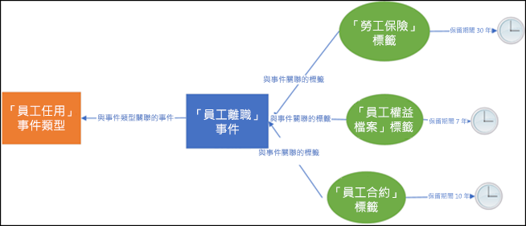
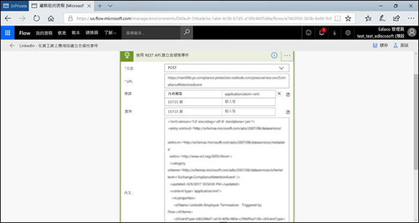

# <a name="automate-event-based-retention"></a><span data-ttu-id="a5963-103">自動化事件型保留</span><span class="sxs-lookup"><span data-stu-id="a5963-103">Automate event-based retention</span></span>

><span data-ttu-id="a5963-104">*[Microsoft 365 安全性與合規性的授權指引](https://aka.ms/ComplianceSD)。*</span><span class="sxs-lookup"><span data-stu-id="a5963-104">*[Microsoft 365 licensing guidance for security & compliance](https://aka.ms/ComplianceSD).*</span></span>

<span data-ttu-id="a5963-p101">組織中的內容量暴增，內容逐漸變得冗餘、過時且瑣碎，有關內容的各種問題已經變成一項嚴重的議題。為了持續迎接法律、商務和法規遵循方面的挑戰，組織必須具備保留和保護重要資訊、同時又能快速找出相關內容的能力。將資訊去蕪存菁，只保留重要且相關的資訊將成為組織致勝的關鍵。</span><span class="sxs-lookup"><span data-stu-id="a5963-p101">The explosion of content in organizations and how it can become ROT (redundant, obsolete, trivial) is serious business. To continue to meet legal, business, and regulatory compliance challenges, organizations must be able to keep and protect important information and quickly find what’s relevant. Retaining only important, pertinent information is key to an organization's success.</span></span>

<span data-ttu-id="a5963-p102">為此，組織可以利用 Office 365 安全性與合規性中心的保留解決方案。保留解決方案可以使用[保留標籤](retention.md#retention-labels)進行觸發。保留標籤可以[根據特定事件選擇保留期間](event-driven-retention.md)。一般而言，保留期間是依據已知的日期，例如內容的建立日期或上次修改日期。然而，組織也可以要求依據事件的發生進行內容處置，例如員工離開組織七年後。</span><span class="sxs-lookup"><span data-stu-id="a5963-p102">To help meet this need, organizations can take advantage of retention solutions in the Office 365 Security & Compliance Center. Retention can be triggered by using [retention labels](retention.md#retention-labels). A retention label has the option to [base the retention period on a specific event](event-driven-retention.md). Typically, the retention period is based on a known date, such as the creation date or last modified date for the content. However, organizations also have requirements to dispose of content based on the occurrence of an event, such as seven years after an employee leaves an organization.</span></span>

<span data-ttu-id="a5963-p103">為確保內容的處置符合規範，請務必了解事件發生的時間。隨著內容量的迅速暴增，以即時且符合規範的方法保留和處置內容已經演變成一項重大的挑戰。</span><span class="sxs-lookup"><span data-stu-id="a5963-p103">To ensure compliant disposal of content, it's imperative to know when an event takes place. With the volume of content increasing rapidly, it's becoming challenging to retain and dispose content in a timely and compliant manner.</span></span>

<span data-ttu-id="a5963-p104">事件型保留可以解決這個問題。本主題說明如何使用 Microsoft 365 REST API 透過事件進行自動化保留，設定您的商務程序流程。</span><span class="sxs-lookup"><span data-stu-id="a5963-p104">Event-based retention solves this problem. This article explains how to set up your business process flows to automate retention through events by using the Microsoft 365 REST API.</span></span>

## <a name="about-event-based-retention"></a><span data-ttu-id="a5963-117">關於事件型保留</span><span class="sxs-lookup"><span data-stu-id="a5963-117">About event-based retention</span></span>

<span data-ttu-id="a5963-p105">組織的規模可以是小型、中型或大型。每日建立和管理的商務文件、法律文件、員工檔案、合約和產品文件的數量卻是急遽增加。</span><span class="sxs-lookup"><span data-stu-id="a5963-p105">An organization can be small, medium, or large. The number of business documents, legal documents, employee files, contracts, and product documents that get created and managed on a day-to-day basis is increasing dramatically.</span></span>

<span data-ttu-id="a5963-p106">舉例來說，每天有數以百計的員工加入或離開組織，HR 部門依據企業要求不斷地建立、更新或刪除員工相關的文件。這個程序必須針對企業綱要遵循不同的保留原則：</span><span class="sxs-lookup"><span data-stu-id="a5963-p106">For example, each day, tens and hundreds of employees are joining and leaving organizations. The HR department continues to create, update, or delete employee-related documents as per business requirements. This process is subject to the different retention policies outlined for the business:</span></span>

- <span data-ttu-id="a5963-p107">**內容的保留期間可以是已知的日期**，例如內容的建立日期、上次修改日期或標籤日期。例如，您可以在文件建立後保留文件七年，然後再刪除文件。</span><span class="sxs-lookup"><span data-stu-id="a5963-p107">**The period of retention for content can be a known date** such as the date the content was created, last modified, or labeled. For example, you might retain documents for seven years after they're created and then delete them.</span></span>

- <span data-ttu-id="a5963-p108">**內容的保留期間也可以是未知的日期**。例如，您可以使用保留標籤，將保留期間設定成依據特定類型事件的發生時間，例如員工離開組織。</span><span class="sxs-lookup"><span data-stu-id="a5963-p108">**The period of retention of content can also be an unknown date**. For example, with retention labels, you can also base a retention period on when a specific type of event occurs, such as an employee leaving the organization.</span></span>

<span data-ttu-id="a5963-p109">事件會觸發保留期間開始進行，而在加上標籤的內容中，所有適用於該事件類型的內容都會強制執行標籤的保留動作。這項功能稱為事件型保留，若要深入了解，請參閱[事件導向保留概觀](event-driven-retention.md)。</span><span class="sxs-lookup"><span data-stu-id="a5963-p109">The event triggers the start of the retention period, and all content with a label applied for that type of event get the label's retention actions enforced on them. This is called event-based retention. To learn more, see [Start retention when an event occurs](event-driven-retention.md).</span></span>

## <a name="set-up-event-based-retention"></a><span data-ttu-id="a5963-130">設定事件型保留</span><span class="sxs-lookup"><span data-stu-id="a5963-130">Set up event-based retention</span></span>

<span data-ttu-id="a5963-131">本節描述保留內容前必須完成的工作。</span><span class="sxs-lookup"><span data-stu-id="a5963-131">This section describes what needs to be done before retaining content.</span></span>

### <a name="identify-roles"></a><span data-ttu-id="a5963-132">識別角色</span><span class="sxs-lookup"><span data-stu-id="a5963-132">Identify roles</span></span>

<span data-ttu-id="a5963-133">找出組織中執行記錄管理工作，並負責有效且有效率地保留商務文件的各種角色。</span><span class="sxs-lookup"><span data-stu-id="a5963-133">Identify the different roles in an organization that perform Record Management tasks and would be responsible for effective and efficient retention of business documents.</span></span>

  | <span data-ttu-id="a5963-134">角色</span><span class="sxs-lookup"><span data-stu-id="a5963-134">Persona</span></span> | <span data-ttu-id="a5963-135">角色</span><span class="sxs-lookup"><span data-stu-id="a5963-135">Role</span></span> |
  | - | - |
  | <span data-ttu-id="a5963-136">系統管理員</span><span class="sxs-lookup"><span data-stu-id="a5963-136">Admin</span></span> | <span data-ttu-id="a5963-137">在 SharePoint 中建立保留事件類型、保留標籤和記錄存放庫</span><span class="sxs-lookup"><span data-stu-id="a5963-137">Creates Retention Event types, Retention labels and Record repositories in SharePoint</span></span> |
  | <span data-ttu-id="a5963-138">記錄管理員</span><span class="sxs-lookup"><span data-stu-id="a5963-138">Records Manager</span></span>                                  | <span data-ttu-id="a5963-139">提供保留原則和保留排程的指引和規範詳細資料</span><span class="sxs-lookup"><span data-stu-id="a5963-139">Provides Retention Policies and Retention Schedules guidance and compliance details</span></span>   |
  | <span data-ttu-id="a5963-140">系統管理員 (企業)</span><span class="sxs-lookup"><span data-stu-id="a5963-140">System Admin (business)</span></span>                          | <span data-ttu-id="a5963-141">設定和管理外部系統以使用 Microsoft 365</span><span class="sxs-lookup"><span data-stu-id="a5963-141">Sets up and manages external systems to work with Microsoft 365</span></span>                       |
  | <span data-ttu-id="a5963-142">資訊工作者</span><span class="sxs-lookup"><span data-stu-id="a5963-142">Information Worker</span></span>                               | <span data-ttu-id="a5963-143">管理商務程序 (HR、財務、IT 等) 的生命週期</span><span class="sxs-lookup"><span data-stu-id="a5963-143">Manages the lifecycle of their business process (HR, Finance, IT, and so on)</span></span>                 |

### <a name="set-up-the-security--compliance-center"></a><span data-ttu-id="a5963-144">設定安全性與合規性中心</span><span class="sxs-lookup"><span data-stu-id="a5963-144">Set up the Security & Compliance Center</span></span>
  
1. <span data-ttu-id="a5963-145">合規性系統管理員建立事件類型&ndash;，例如，僱用終止或合約到期或產品製造結束。</span><span class="sxs-lookup"><span data-stu-id="a5963-145">Compliance admin creates an event type &ndash; for example, Employee Termination or Contract Expiration or End of Product Manufacturing.</span></span> <span data-ttu-id="a5963-146">(請參閱[事件導向保留](event-driven-retention.md)中的逐步程序。</span><span class="sxs-lookup"><span data-stu-id="a5963-146">(See the step-by-step process in [Event-driven retention](event-driven-retention.md).</span></span>
    
2. <span data-ttu-id="a5963-147">合規性系統管理員依據事件建立保留標籤，將標籤與事件類型建立相關聯。</span><span class="sxs-lookup"><span data-stu-id="a5963-147">Compliance admin creates a retention label based on an event and associates the label with an event type.</span></span>
    
    <span data-ttu-id="a5963-148">保留標籤有四種類型的觸發程序：</span><span class="sxs-lookup"><span data-stu-id="a5963-148">There are four types of triggers for retention labels:</span></span>
            
    1. <span data-ttu-id="a5963-149">建立日期</span><span class="sxs-lookup"><span data-stu-id="a5963-149">Create date</span></span>
                
    2. <span data-ttu-id="a5963-150">上次修改日期</span><span class="sxs-lookup"><span data-stu-id="a5963-150">Last modified</span></span>
                
    3. <span data-ttu-id="a5963-151">標籤日期 (內容加上標籤的日期)</span><span class="sxs-lookup"><span data-stu-id="a5963-151">Label date (when the content was labeled)</span></span>
                
    4. <span data-ttu-id="a5963-152">事件型</span><span class="sxs-lookup"><span data-stu-id="a5963-152">Event-based</span></span>
    
3. <span data-ttu-id="a5963-153">規範管理員發佈保留標籤。</span><span class="sxs-lookup"><span data-stu-id="a5963-153">Compliance admin publishes the retention label.</span></span>

### <a name="set-up-sharepoint"></a><span data-ttu-id="a5963-154">設定 SharePoint</span><span class="sxs-lookup"><span data-stu-id="a5963-154">Set up SharePoint</span></span>
   
<span data-ttu-id="a5963-155">若要建立記錄存放庫，規範系統管理員必須：</span><span class="sxs-lookup"><span data-stu-id="a5963-155">To create a records repository, the compliance admin:</span></span>

1. <span data-ttu-id="a5963-156">建立 SharePoint 網站。</span><span class="sxs-lookup"><span data-stu-id="a5963-156">Creates a SharePoint site.</span></span>

2. <span data-ttu-id="a5963-157">執行下列其中一項動作：</span><span class="sxs-lookup"><span data-stu-id="a5963-157">Does one of the following:</span></span>
        
    - <span data-ttu-id="a5963-p111">建立 SharePoint 文件庫。在文件庫層級設定事件型標籤。如需更多資訊，請參閱[將預設的保留標籤套用至 SharePoint 文件庫、資料夾或文件組的所有內容](create-apply-retention-labels.md#applying-a-default-retention-label-to-all-content-in-a-sharepoint-library-folder-or-document-set)。</span><span class="sxs-lookup"><span data-stu-id="a5963-p111">Creates a SharePoint library: Set event-based label at the library level. For more information, see [Applying a default retention label to all content in a SharePoint library, folder, or document set](create-apply-retention-labels.md#applying-a-default-retention-label-to-all-content-in-a-sharepoint-library-folder-or-document-set).</span></span>

   - <span data-ttu-id="a5963-160">在 SharePoint 中設定文件組。</span><span class="sxs-lookup"><span data-stu-id="a5963-160">Sets up a document set in SharePoint.</span></span> <span data-ttu-id="a5963-161">如需詳細資訊，請參閱[文件組簡介](https://support.microsoft.com/zh-TW/office/introduction-to-document-sets-3dbcd93e-0bed-46b7-b1ba-b31de2bcd234)。</span><span class="sxs-lookup"><span data-stu-id="a5963-161">For more information, see [Introduction to document sets](https://support.microsoft.com/zh-TW/office/introduction-to-document-sets-3dbcd93e-0bed-46b7-b1ba-b31de2bcd234).</span></span>
      
3. <span data-ttu-id="a5963-162">將資產識別碼指派給每個員工文件組。</span><span class="sxs-lookup"><span data-stu-id="a5963-162">Assigns an asset ID to each employee document set.</span></span> <span data-ttu-id="a5963-163">資產識別碼是組織使用的產品名稱或代碼，例如員工識別碼可以是資產識別碼。</span><span class="sxs-lookup"><span data-stu-id="a5963-163">An asset ID is a product name or code used by the organization, for example, Employee number can be an asset ID.</span></span> <span data-ttu-id="a5963-164">透過將資產識別碼指派給資料夾的方式，該資料夾內的每個項目都會自動繼承相同的資產識別碼。</span><span class="sxs-lookup"><span data-stu-id="a5963-164">By assigning the asset ID to the folder, every item in that folder automatically inherits the same asset ID.</span></span> <span data-ttu-id="a5963-165">這表示所有項目可以透過相同事件觸發保留期間。</span><span class="sxs-lookup"><span data-stu-id="a5963-165">This means all the items can have their retention period triggered by the same event.</span></span>

## <a name="ways-to-trigger-event-based-retention"></a><span data-ttu-id="a5963-166">觸發事件型保留的方法</span><span class="sxs-lookup"><span data-stu-id="a5963-166">Ways to trigger event-based retention</span></span>

<span data-ttu-id="a5963-167">有兩種方法可以觸發事件型保留：</span><span class="sxs-lookup"><span data-stu-id="a5963-167">There are two ways in which event-based retention can be triggered:</span></span>

- <span data-ttu-id="a5963-168">**使用系統管理中心 UI** 這個程序可以用於一次保留較少的內容，或是觸發頻率不高的保留，例如每月或每年的頻率。</span><span class="sxs-lookup"><span data-stu-id="a5963-168">**Using the admin center UI** This is a process that can be used to retain less content at a time or the frequency to trigger retention isn't often, such as monthly or yearly.</span></span> <span data-ttu-id="a5963-169">如需更多有關此方法資訊，請參閱[事件驅動保留概觀](event-driven-retention.md)。</span><span class="sxs-lookup"><span data-stu-id="a5963-169">For more information about this method, see [Start retention when an event occurs](event-driven-retention.md).</span></span> <span data-ttu-id="a5963-170">然而，這個觸發保留的方法可能非常耗時且容易發生錯誤，從而阻礙了保留的延展性。</span><span class="sxs-lookup"><span data-stu-id="a5963-170">However, this method of triggering retention can be time consuming and prone to error, thus stunting scalability.</span></span> <span data-ttu-id="a5963-171">因此，使用自動化流暢的解決方案進行觸發保留將可以增強資料的安全性與合規性。</span><span class="sxs-lookup"><span data-stu-id="a5963-171">Therefore, an automated, seamless solution to trigger retention can enhance data security and compliance.</span></span>

- <span data-ttu-id="a5963-p115">**使用 M365 REST API**這個程序可以用於一次保留大量內容的時候，和 (或) 觸發頻率高的保留，例如每日或每週的頻率。當偵測到您的商務線系統內發生事件時，流程會接著在安全規範中心內自動建立相關的事件。因此，每次發生事件時，您不需要在使用者介面手動建立事件。</span><span class="sxs-lookup"><span data-stu-id="a5963-p115">**Using a M365 REST API** This process can be used when large amounts of content are to be retained at a time and/or the frequency to trigger retention is often such as daily or weekly. The flow detects when an event occurs in your line-of-business system, and then automatically creates a related event in the Security & Compliance Center. You don't need to manually create an event in the UI each time one occurs.</span></span>

<span data-ttu-id="a5963-175">有兩個選項可以使用 REST API：</span><span class="sxs-lookup"><span data-stu-id="a5963-175">There are two options for using the REST API:</span></span>

- <span data-ttu-id="a5963-176">**Microsoft Flow 或類似的應用程式**可以用於自動觸發事件的發生。</span><span class="sxs-lookup"><span data-stu-id="a5963-176">**Microsoft Flow or a similar application** can be used to trigger the occurrence of an event automatically.</span></span> <span data-ttu-id="a5963-177">Microsoft Flow 是連線至其他系統的協調器。</span><span class="sxs-lookup"><span data-stu-id="a5963-177">Microsoft Flow is an orchestrator for connecting to other systems.</span></span> <span data-ttu-id="a5963-178">使用 Microsoft Flow 不需要自訂的解決方案。</span><span class="sxs-lookup"><span data-stu-id="a5963-178">Using Microsoft Flow doesn't require a custom solution.</span></span>

- <span data-ttu-id="a5963-179">**PowerShell 或 HTTP 用戶端呼叫 REST API**使用 PowerShell (6 或更新版本) 呼叫 Microsoft 365 REST API 建立事件。</span><span class="sxs-lookup"><span data-stu-id="a5963-179">**PowerShell or an HTTP client to call REST API** Using PowerShell (version 6 or higher) to call Microsoft 365 REST API to create events.</span></span> 

<span data-ttu-id="a5963-180">Rest API 是支援 HTTP 操作組 (方法) 的服務端點，提供服務資源的建立、擷取、更新、刪除等存取權。</span><span class="sxs-lookup"><span data-stu-id="a5963-180">A Rest API is a service endpoint that supports sets of HTTP operations (methods), which provide create/retrieve/update/delete access to the service's resources.</span></span> <span data-ttu-id="a5963-181">如需詳細資訊，請參閱 [REST API 要求/回應的元件](https://docs.microsoft.com/rest/api/gettingstarted/#components-of-a-rest-api-requestresponse)。</span><span class="sxs-lookup"><span data-stu-id="a5963-181">For more information, see [Components of a REST API request/response](https://docs.microsoft.com/rest/api/gettingstarted/#components-of-a-rest-api-requestresponse).</span></span> <span data-ttu-id="a5963-182">在這種情況下，透過使用 Microsoft 365 REST API，使用 POST 和 GET 操作 (方法) 可以建立和擷取事件。</span><span class="sxs-lookup"><span data-stu-id="a5963-182">In this case, by using the Microsoft 365 REST API, events can be created and retrieved using operations (methods) POST and GET.</span></span>

## <a name="example-scenarios"></a><span data-ttu-id="a5963-183">範例案例</span><span class="sxs-lookup"><span data-stu-id="a5963-183">Example scenarios</span></span>

<span data-ttu-id="a5963-184">讓我們來考慮以下案例。</span><span class="sxs-lookup"><span data-stu-id="a5963-184">Let’s consider the following scenarios.</span></span>

### <a name="scenario-1-employees-leaving-the-organization"></a><span data-ttu-id="a5963-185">案例 1：員工離開組織</span><span class="sxs-lookup"><span data-stu-id="a5963-185">Scenario 1: Employees leaving the organization</span></span> 

<span data-ttu-id="a5963-186">組織針對每位員工建立和儲存無數的員工相關文件。</span><span class="sxs-lookup"><span data-stu-id="a5963-186">An organization creates and stores numerous employee-related documents per employee.</span></span> <span data-ttu-id="a5963-187">這些文件會在每位員工的僱用期間內進行管理和保留。</span><span class="sxs-lookup"><span data-stu-id="a5963-187">These documents are managed and retained during the employment of each employee.</span></span> <span data-ttu-id="a5963-188">然而，當員工離開組織或僱用終止時，組織有義務根據法律和商務要求在約定時間內保留該位員工的文件。</span><span class="sxs-lookup"><span data-stu-id="a5963-188">However, when the employee leaves the organization or the employment is terminated, the organization is obligated by legal and business requirements to retain the documents of that employee for a stipulated period.</span></span>

<span data-ttu-id="a5963-189">現在，如果每天有多位員工離開組織，組織每天必須觸發數以千百份文件的保留計時器。</span><span class="sxs-lookup"><span data-stu-id="a5963-189">Now if multiple employees leave the organization every day, the organization must trigger the retention clock of hundreds if not thousands of documents each day.</span></span>

<span data-ttu-id="a5963-190">除此之外，還要根據員工記錄的類型計算每位離職員工的保留期間，即僱用終止日期加上天數、月數或年數。</span><span class="sxs-lookup"><span data-stu-id="a5963-190">In addition to this, the retention period needs to be calculated for each of these employees as Employee termination date + number of days, months, or years based on the type of the employee record.</span></span> <span data-ttu-id="a5963-191">例如，同一位員工的薪資補償和福利申報可能需要不同的保留期間。</span><span class="sxs-lookup"><span data-stu-id="a5963-191">For example, worker’s compensation of the employee vs. benefits filings of the same employee may need different retention.</span></span>

<span data-ttu-id="a5963-192">下圖顯示多個標籤與單一事件相關聯的情況。</span><span class="sxs-lookup"><span data-stu-id="a5963-192">The diagram below shows how there can be multiple labels that are associated with a single event.</span></span> <span data-ttu-id="a5963-193">在圖中，員工薪資補償標籤下的所有檔案與員工福利標籤下的所有檔案同時與單一事件相關聯，這個單一事件是員工離開組織。</span><span class="sxs-lookup"><span data-stu-id="a5963-193">Here all the files under Worker’s compensation label and all the files under Employee benefits label are both associated with a single event, which is the employee leaving the organization.</span></span> <span data-ttu-id="a5963-194">這些檔案各自有不同的保留計時器。</span><span class="sxs-lookup"><span data-stu-id="a5963-194">Each of these different files has different retention clocks.</span></span> <span data-ttu-id="a5963-195">因此，當員工離開組織時，在每一個標籤內的檔案會開始經歷不同的保留期間。</span><span class="sxs-lookup"><span data-stu-id="a5963-195">So, when an employee leaves the organization, these files within each label experience a different retention period.</span></span> <span data-ttu-id="a5963-196">若要針對每一位員工的每一種檔案類型或標籤觸發所有不同的保留計時器，這是一項非常具有挑戰性的任務。</span><span class="sxs-lookup"><span data-stu-id="a5963-196">Triggering all these different retention clocks for each file type or label for each employee is a very challenging task.</span></span> <span data-ttu-id="a5963-197">請想像一下為多位員工執行這項任務的情形。</span><span class="sxs-lookup"><span data-stu-id="a5963-197">Imagine doing this for multiple employees.</span></span>



<span data-ttu-id="a5963-199">因此，以自動化程序針對多位員工觸發不同的保留計時器不僅節省時間、減少錯誤，而且非常有效率。</span><span class="sxs-lookup"><span data-stu-id="a5963-199">Hence an automated process to trigger these different retention clocks for multiple employees will be time-saving, error-free, and extremely efficient.</span></span>

<span data-ttu-id="a5963-200">**針對這個案例設定自動化事件型保留：**</span><span class="sxs-lookup"><span data-stu-id="a5963-200">**Configuring Automated Event Based Retention for this scenario:**</span></span>


  - <span data-ttu-id="a5963-202">系統管理員在文件組建立員工資料夾，例如李莉華、王立民。</span><span class="sxs-lookup"><span data-stu-id="a5963-202">Admin creates employee folders to the Document set such as Jane Doe, John Smith.</span></span>

  - <span data-ttu-id="a5963-203">系統管理員將員工檔案新增至每一位員工的員工資料夾，例如福利、薪水、員工的薪資補償。</span><span class="sxs-lookup"><span data-stu-id="a5963-203">Admin adds employee files such as Benefits, Payroll, Worker’s Compensation to each employee folder.</span></span>

  - <span data-ttu-id="a5963-204">系統管理員指派資產識別碼至每一個員工資料夾。</span><span class="sxs-lookup"><span data-stu-id="a5963-204">Admin assigns Asset ID to each employee folder.</span></span> 

  - <span data-ttu-id="a5963-205">SCC 系統管理員登入安全性與合規性中心。</span><span class="sxs-lookup"><span data-stu-id="a5963-205">SCC Admin logs into the Security & Compliance Center.</span></span>

  - <span data-ttu-id="a5963-206">SCC 系統管理員會建立員工相關的事件類型，例如「僱用終止」、「僱用員工」事件。</span><span class="sxs-lookup"><span data-stu-id="a5963-206">SCC Admin creates employee-related events types such as “Employee Termination”, “Employee Hire” events.</span></span>

  - <span data-ttu-id="a5963-207">SCC 系統管理員會建立「員工保留」標籤。</span><span class="sxs-lookup"><span data-stu-id="a5963-207">SCC Admin creates “Employee Retention” label.</span></span>

  - <span data-ttu-id="a5963-208">這個「員工保留」標籤可以手動或自動發佈並套用至 SharePoint 中的員工檔案。</span><span class="sxs-lookup"><span data-stu-id="a5963-208">This “Employee Retention” label is published and applied manually or automatically to the employee files in SharePoint.</span></span>

  - <span data-ttu-id="a5963-209">HR 管理系統 (例如 Workday) 可以使用 Microsoft Flow 定期執行管理員工檔案。</span><span class="sxs-lookup"><span data-stu-id="a5963-209">HR Management System like Workday can work with Microsoft Flow to run periodically to manage employee files.</span></span>

  - <span data-ttu-id="a5963-210">如果員工離開組織，M365 事件型保留 REST API 將會開始特定員工檔案的保留計時器。</span><span class="sxs-lookup"><span data-stu-id="a5963-210">If an employee has left the organization, the Flow will trigger the M365 Event Based Retention REST API that will begin the retention clock on the specific employee’s files.</span></span>

#### <a name="using-microsoft-flow"></a><span data-ttu-id="a5963-211">使用 Microsoft Flow</span><span class="sxs-lookup"><span data-stu-id="a5963-211">Using Microsoft Flow</span></span>

<span data-ttu-id="a5963-212">步驟 1- 建立流程以使用 Microsoft 365 REST API 建立事件</span><span class="sxs-lookup"><span data-stu-id="a5963-212">Step 1- Create a flow to create an event using the Microsoft 365 REST API</span></span>




##### <a name="create-an-event"></a><span data-ttu-id="a5963-215">建立事件</span><span class="sxs-lookup"><span data-stu-id="a5963-215">Create an event</span></span>

<span data-ttu-id="a5963-216">呼叫 REST API 的範例程式碼：</span><span class="sxs-lookup"><span data-stu-id="a5963-216">Sample code to call the REST API:</span></span>

- <span data-ttu-id="a5963-217">**方法**：POST</span><span class="sxs-lookup"><span data-stu-id="a5963-217">**Method**: POST</span></span>
- <span data-ttu-id="a5963-218">**URL**：`https://ps.compliance.protection.outlook.com/psws/service.svc/ComplianceRetentionEvent`</span><span class="sxs-lookup"><span data-stu-id="a5963-218">**URL**: `https://ps.compliance.protection.outlook.com/psws/service.svc/ComplianceRetentionEvent`</span></span>
- <span data-ttu-id="a5963-219">**標頭**：Key = Content-Type, Value = application/atom+xml</span><span class="sxs-lookup"><span data-stu-id="a5963-219">**Headers**: Key = Content-Type, Value = application/atom+xml</span></span>
- <span data-ttu-id="a5963-220">**本文**：</span><span class="sxs-lookup"><span data-stu-id="a5963-220">**Body**:</span></span>
    
    ```xml
    <?xml version='1.0' encoding='utf-8' standalone='yes'?>
    
    <entry xmlns:d='http://schemas.microsoft.com/ado/2007/08/dataservices'
    
    xmlns:m='http://schemas.microsoft.com/ado/2007/08/dataservices/metadata'
    
    xmlns='http://www.w3.org/2005/Atom'>
    
    <category scheme='http://schemas.microsoft.com/ado/2007/08/dataservices/scheme' term='Exchange.ComplianceRetentionEvent' />
    
    <updated>9/9/2017 10:50:00 PM</updated>
    
    <content type='application/xml'>
    
    <m:properties>
    
    <d:Name>Employee Termination </d:Name>
    
    <d:EventType>99e0ae64-a4b8-40bb-82ed-645895610f56</d:EventType>
    
    <d:SharePointAssetIdQuery>1234</d:SharePointAssetIdQuery>
    
    <d:EventDateTime>2018-12-01T00:00:00Z </d:EventDateTime>
    
    </m:properties>
    
    </content>
    
    </entry>
    ```
- <span data-ttu-id="a5963-221">**驗證**：基本</span><span class="sxs-lookup"><span data-stu-id="a5963-221">**Authentication**: Basic</span></span>
- <span data-ttu-id="a5963-222">**使用者名稱**："Complianceuser"</span><span class="sxs-lookup"><span data-stu-id="a5963-222">**Username**: "Complianceuser"</span></span>
- <span data-ttu-id="a5963-223">**密碼**："Compliancepassword"</span><span class="sxs-lookup"><span data-stu-id="a5963-223">**Password**: "Compliancepassword"</span></span>


##### <a name="available-parameters"></a><span data-ttu-id="a5963-224">可用的參數</span><span class="sxs-lookup"><span data-stu-id="a5963-224">Available parameters</span></span>


|<span data-ttu-id="a5963-225">參數</span><span class="sxs-lookup"><span data-stu-id="a5963-225">Parameters</span></span>|<span data-ttu-id="a5963-226">描述</span><span class="sxs-lookup"><span data-stu-id="a5963-226">Description</span></span>|<span data-ttu-id="a5963-227">附註</span><span class="sxs-lookup"><span data-stu-id="a5963-227">Notes</span></span>|
|--- |--- |--- |
|<span data-ttu-id="a5963-228"><d:Name></d:Name></span><span class="sxs-lookup"><span data-stu-id="a5963-228"><d:Name></d:Name></span></span>|<span data-ttu-id="a5963-229">提供事件的唯一名稱，</span><span class="sxs-lookup"><span data-stu-id="a5963-229">Provide a unique name for the event,</span></span>|<span data-ttu-id="a5963-230">結尾不可有空格以及下列字元：% \* \ & < \> \| # ?</span><span class="sxs-lookup"><span data-stu-id="a5963-230">Cannot contain trailing spaces, and the following characters: % \* \ & < \> \| # ?</span></span> <span data-ttu-id="a5963-231">, : ;</span><span class="sxs-lookup"><span data-stu-id="a5963-231">, : ;</span></span>|
|<span data-ttu-id="a5963-232"><d:EventType></d:EventType></span><span class="sxs-lookup"><span data-stu-id="a5963-232"><d:EventType></d:EventType></span></span>|<span data-ttu-id="a5963-233">輸入事件類型名稱 (或 Guid)</span><span class="sxs-lookup"><span data-stu-id="a5963-233">Enter event type name (or Guid),</span></span>|<span data-ttu-id="a5963-p122">例如：「僱用終止」。事件類型必須與保留標籤相關聯。</span><span class="sxs-lookup"><span data-stu-id="a5963-p122">Example: “Employee termination”. Event type has to be associated with a retention label.</span></span>|
|<span data-ttu-id="a5963-236"><d:SharePointAssetIdQuery></d:SharePointAssetIdQuery></span><span class="sxs-lookup"><span data-stu-id="a5963-236"><d:SharePointAssetIdQuery></d:SharePointAssetIdQuery></span></span>|<span data-ttu-id="a5963-237">輸入 ComplianceAssetId: + 員工 ID</span><span class="sxs-lookup"><span data-stu-id="a5963-237">Enter “ComplianceAssetId:” + employee Id</span></span>|<span data-ttu-id="a5963-238">範例："ComplianceAssetId:12345"</span><span class="sxs-lookup"><span data-stu-id="a5963-238">Example: "ComplianceAssetId:12345"</span></span>|
|<span data-ttu-id="a5963-239"><d:EventDateTime></d:EventDateTime></span><span class="sxs-lookup"><span data-stu-id="a5963-239"><d:EventDateTime></d:EventDateTime></span></span>|<span data-ttu-id="a5963-240">事件的日期和時間</span><span class="sxs-lookup"><span data-stu-id="a5963-240">Event Date and Time</span></span>|<span data-ttu-id="a5963-241">格式：yyyy-MM-ddTHH:mm:ssZ，例如：2018-12-01T00:00:00Z</span><span class="sxs-lookup"><span data-stu-id="a5963-241">Format: yyyy-MM-ddTHH:mm:ssZ, Example: 2018-12-01T00:00:00Z</span></span>
|

##### <a name="response-codes"></a><span data-ttu-id="a5963-242">回應碼</span><span class="sxs-lookup"><span data-stu-id="a5963-242">Response codes</span></span>

| <span data-ttu-id="a5963-243">回應碼</span><span class="sxs-lookup"><span data-stu-id="a5963-243">Response Code</span></span> | <span data-ttu-id="a5963-244">描述</span><span class="sxs-lookup"><span data-stu-id="a5963-244">Description</span></span>       |
| ----------------- | --------------------- |
| <span data-ttu-id="a5963-245">302</span><span class="sxs-lookup"><span data-stu-id="a5963-245">302</span></span>               | <span data-ttu-id="a5963-246">重新導向</span><span class="sxs-lookup"><span data-stu-id="a5963-246">Redirect</span></span>              |
| <span data-ttu-id="a5963-247">201</span><span class="sxs-lookup"><span data-stu-id="a5963-247">201</span></span>               | <span data-ttu-id="a5963-248">建立時間</span><span class="sxs-lookup"><span data-stu-id="a5963-248">Created</span></span>               |
| <span data-ttu-id="a5963-249">403</span><span class="sxs-lookup"><span data-stu-id="a5963-249">403</span></span>               | <span data-ttu-id="a5963-250">授權失敗</span><span class="sxs-lookup"><span data-stu-id="a5963-250">Authorization Failed</span></span>  |
| <span data-ttu-id="a5963-251">401</span><span class="sxs-lookup"><span data-stu-id="a5963-251">401</span></span>               | <span data-ttu-id="a5963-252">驗證失敗</span><span class="sxs-lookup"><span data-stu-id="a5963-252">Authentication Failed</span></span> |

##### <a name="get-events-based-on-time-range"></a><span data-ttu-id="a5963-253">依據時間範圍取得事件</span><span class="sxs-lookup"><span data-stu-id="a5963-253">Get Events based on time range</span></span>

- <span data-ttu-id="a5963-254">**方法**：GET</span><span class="sxs-lookup"><span data-stu-id="a5963-254">**Method**: GET</span></span>

- <span data-ttu-id="a5963-255">**URL**：`https://ps.compliance.protection.outlook.com/psws/service.svc/ComplianceRetentionEvent?BeginDateTime=2019-01-11&EndDateTime=2019-01-16`</span><span class="sxs-lookup"><span data-stu-id="a5963-255">**URL**: `https://ps.compliance.protection.outlook.com/psws/service.svc/ComplianceRetentionEvent?BeginDateTime=2019-01-11&EndDateTime=2019-01-16`</span></span>

- <span data-ttu-id="a5963-256">**標頭**：Key = Content-Type, Value = application/atom+xml</span><span class="sxs-lookup"><span data-stu-id="a5963-256">**Headers**: Key = Content-Type, Value = application/atom+xml</span></span>

- <span data-ttu-id="a5963-257">**驗證**：基本</span><span class="sxs-lookup"><span data-stu-id="a5963-257">**Authentication**: Basic</span></span>

- <span data-ttu-id="a5963-258">**使用者名稱**："Complianceuser"</span><span class="sxs-lookup"><span data-stu-id="a5963-258">**Username**: "Complianceuser"</span></span>

- <span data-ttu-id="a5963-259">**密碼**："Compliancepassword"</span><span class="sxs-lookup"><span data-stu-id="a5963-259">**Password**: "Compliancepassword"</span></span>


##### <a name="response-codes"></a><span data-ttu-id="a5963-260">回應碼</span><span class="sxs-lookup"><span data-stu-id="a5963-260">Response codes</span></span>

| <span data-ttu-id="a5963-261">回應碼</span><span class="sxs-lookup"><span data-stu-id="a5963-261">Response Code</span></span> | <span data-ttu-id="a5963-262">描述</span><span class="sxs-lookup"><span data-stu-id="a5963-262">Description</span></span>                   |
| ----------------- | --------------------------------- |
| <span data-ttu-id="a5963-263">200</span><span class="sxs-lookup"><span data-stu-id="a5963-263">200</span></span>               | <span data-ttu-id="a5963-264">好的，以 atom+ xml 格式列出事件清單</span><span class="sxs-lookup"><span data-stu-id="a5963-264">OK, A list of events in atom+ xml</span></span> |
| <span data-ttu-id="a5963-265">404</span><span class="sxs-lookup"><span data-stu-id="a5963-265">404</span></span>               | <span data-ttu-id="a5963-266">找不到</span><span class="sxs-lookup"><span data-stu-id="a5963-266">Not found</span></span>                         |
| <span data-ttu-id="a5963-267">302</span><span class="sxs-lookup"><span data-stu-id="a5963-267">302</span></span>               | <span data-ttu-id="a5963-268">重新導向</span><span class="sxs-lookup"><span data-stu-id="a5963-268">Redirect</span></span>                          |
| <span data-ttu-id="a5963-269">401</span><span class="sxs-lookup"><span data-stu-id="a5963-269">401</span></span>               | <span data-ttu-id="a5963-270">授權失敗</span><span class="sxs-lookup"><span data-stu-id="a5963-270">Authorization Failed</span></span>              |
| <span data-ttu-id="a5963-271">403</span><span class="sxs-lookup"><span data-stu-id="a5963-271">403</span></span>               | <span data-ttu-id="a5963-272">驗證失敗</span><span class="sxs-lookup"><span data-stu-id="a5963-272">Authentication Failed</span></span>             |

##### <a name="get-an-event-by-id"></a><span data-ttu-id="a5963-273">依 ID 取得事件</span><span class="sxs-lookup"><span data-stu-id="a5963-273">Get an event by ID</span></span>

- <span data-ttu-id="a5963-274">**方法**：GET</span><span class="sxs-lookup"><span data-stu-id="a5963-274">**Method**: GET</span></span>

- <span data-ttu-id="a5963-275">**URL**：`https://ps.compliance.protection.outlook.com/psws/service.svc/ComplianceRetentionEvent('174e9a86-74ff-4450-8666-7c11f7730f66')`</span><span class="sxs-lookup"><span data-stu-id="a5963-275">**URL**: `https://ps.compliance.protection.outlook.com/psws/service.svc/ComplianceRetentionEvent('174e9a86-74ff-4450-8666-7c11f7730f66')`</span></span>

- <span data-ttu-id="a5963-276">**標頭**：Key = Content-Type, Value = application/atom+xml</span><span class="sxs-lookup"><span data-stu-id="a5963-276">**Headers**: Key = Content-Type, Value = application/atom+xml</span></span>

- <span data-ttu-id="a5963-277">**驗證**：基本</span><span class="sxs-lookup"><span data-stu-id="a5963-277">**Authentication**: Basic</span></span>

- <span data-ttu-id="a5963-278">**使用者名稱**："Complianceuser"</span><span class="sxs-lookup"><span data-stu-id="a5963-278">**Username**: "Complianceuser"</span></span>

- <span data-ttu-id="a5963-279">**密碼**："Compliancepassword"</span><span class="sxs-lookup"><span data-stu-id="a5963-279">**Password**: "Compliancepassword"</span></span>


##### <a name="response-codes"></a><span data-ttu-id="a5963-280">回應碼</span><span class="sxs-lookup"><span data-stu-id="a5963-280">Response codes</span></span>

| <span data-ttu-id="a5963-281">回應碼</span><span class="sxs-lookup"><span data-stu-id="a5963-281">Response Code</span></span> | <span data-ttu-id="a5963-282">描述</span><span class="sxs-lookup"><span data-stu-id="a5963-282">Description</span></span>                                      |
| ----------------- | ---------------------------------------------------- |
| <span data-ttu-id="a5963-283">200</span><span class="sxs-lookup"><span data-stu-id="a5963-283">200</span></span>               | <span data-ttu-id="a5963-284">好的，回應本文包含有 atom+xml 格式的事件</span><span class="sxs-lookup"><span data-stu-id="a5963-284">OK, The response body contains the event in atom+xml</span></span> |
| <span data-ttu-id="a5963-285">404</span><span class="sxs-lookup"><span data-stu-id="a5963-285">404</span></span>               | <span data-ttu-id="a5963-286">找不到</span><span class="sxs-lookup"><span data-stu-id="a5963-286">Not found</span></span>                                            |
| <span data-ttu-id="a5963-287">302</span><span class="sxs-lookup"><span data-stu-id="a5963-287">302</span></span>               | <span data-ttu-id="a5963-288">重新導向</span><span class="sxs-lookup"><span data-stu-id="a5963-288">Redirect</span></span>                                             |
| <span data-ttu-id="a5963-289">401</span><span class="sxs-lookup"><span data-stu-id="a5963-289">401</span></span>               | <span data-ttu-id="a5963-290">授權失敗</span><span class="sxs-lookup"><span data-stu-id="a5963-290">Authorization Failed</span></span>                                 |
| <span data-ttu-id="a5963-291">403</span><span class="sxs-lookup"><span data-stu-id="a5963-291">403</span></span>               | <span data-ttu-id="a5963-292">驗證失敗</span><span class="sxs-lookup"><span data-stu-id="a5963-292">Authentication Failed</span></span>                                |

##### <a name="get-an-event-by-name"></a><span data-ttu-id="a5963-293">依名稱取得事件</span><span class="sxs-lookup"><span data-stu-id="a5963-293">Get an event by name</span></span>

- <span data-ttu-id="a5963-294">**方法**：GET</span><span class="sxs-lookup"><span data-stu-id="a5963-294">**Method**: GET</span></span>

- <span data-ttu-id="a5963-295">**URL**：`https://ps.compliance.protection.outlook.com/psws/service.svc/ComplianceRetentionEvent`</span><span class="sxs-lookup"><span data-stu-id="a5963-295">**URL**: `https://ps.compliance.protection.outlook.com/psws/service.svc/ComplianceRetentionEvent`</span></span>

- <span data-ttu-id="a5963-296">**標頭**：Key = Content-Type, Value = application/atom+xml</span><span class="sxs-lookup"><span data-stu-id="a5963-296">**Headers**: Key = Content-Type, Value = application/atom+xml</span></span>

- <span data-ttu-id="a5963-297">**驗證**：基本</span><span class="sxs-lookup"><span data-stu-id="a5963-297">**Authentication**: Basic</span></span>

- <span data-ttu-id="a5963-298">**使用者名稱**："Complianceuser"</span><span class="sxs-lookup"><span data-stu-id="a5963-298">**Username**: "Complianceuser"</span></span>

- <span data-ttu-id="a5963-299">**密碼**："Compliancepassword"</span><span class="sxs-lookup"><span data-stu-id="a5963-299">**Password**: "Compliancepassword"</span></span>


##### <a name="response-codes"></a><span data-ttu-id="a5963-300">回應碼</span><span class="sxs-lookup"><span data-stu-id="a5963-300">Response codes</span></span>

| <span data-ttu-id="a5963-301">回應碼</span><span class="sxs-lookup"><span data-stu-id="a5963-301">Response Code</span></span> | <span data-ttu-id="a5963-302">描述</span><span class="sxs-lookup"><span data-stu-id="a5963-302">Description</span></span>                                      |
| ----------------- | ---------------------------------------------------- |
| <span data-ttu-id="a5963-303">200</span><span class="sxs-lookup"><span data-stu-id="a5963-303">200</span></span>               | <span data-ttu-id="a5963-304">好的，回應本文包含有 atom+xml 格式的事件</span><span class="sxs-lookup"><span data-stu-id="a5963-304">OK, The response body contains the event in atom+xml</span></span> |
| <span data-ttu-id="a5963-305">404</span><span class="sxs-lookup"><span data-stu-id="a5963-305">404</span></span>               | <span data-ttu-id="a5963-306">找不到</span><span class="sxs-lookup"><span data-stu-id="a5963-306">Not found</span></span>                                            |
| <span data-ttu-id="a5963-307">302</span><span class="sxs-lookup"><span data-stu-id="a5963-307">302</span></span>               | <span data-ttu-id="a5963-308">重新導向</span><span class="sxs-lookup"><span data-stu-id="a5963-308">Redirect</span></span>                                             |
| <span data-ttu-id="a5963-309">401</span><span class="sxs-lookup"><span data-stu-id="a5963-309">401</span></span>               | <span data-ttu-id="a5963-310">授權失敗</span><span class="sxs-lookup"><span data-stu-id="a5963-310">Authorization Failed</span></span>                                 |
| <span data-ttu-id="a5963-311">403</span><span class="sxs-lookup"><span data-stu-id="a5963-311">403</span></span>               | <span data-ttu-id="a5963-312">驗證失敗</span><span class="sxs-lookup"><span data-stu-id="a5963-312">Authentication Failed</span></span>                                |

#### <a name="using-powershell-version-6-or-later-or-any-http-client"></a><span data-ttu-id="a5963-313">使用 PowerShell (版本 6 或更新版本) 或任何 HTTP 用戶端</span><span class="sxs-lookup"><span data-stu-id="a5963-313">Using PowerShell (version 6 or later) or any HTTP client</span></span>

<span data-ttu-id="a5963-314">步驟 1：連線至 PowerShell。</span><span class="sxs-lookup"><span data-stu-id="a5963-314">Step 1: Connect to PowerShell.</span></span>

<span data-ttu-id="a5963-315">步驟 2：執行下列指令碼。</span><span class="sxs-lookup"><span data-stu-id="a5963-315">Step 2: Run the following script.</span></span>

```powershell
param([string]$baseUri)

$userName = "UserName"

$password = "Password"

$securePassword = ConvertTo-SecureString $password -AsPlainText -Force

$credentials = New-Object System.Management.Automation.PSCredential($userName, $securePassword)

$EventName="EventByRESTPost-$(([Guid]::NewGuid()).ToString('N'))"

Write-Host "Start to create an event with name: $EventName"

$body = "<?xml version='1.0' encoding='utf-8' standalone='yes'?>

<entry xmlns:d='http://schemas.microsoft.com/ado/2007/08/dataservices'

xmlns:m='http://schemas.microsoft.com/ado/2007/08/dataservices/metadata'

xmlns='http://www.w3.org/2005/Atom'>

<category scheme='http://schemas.microsoft.com/ado/2007/08/dataservices/scheme' term='Exchange.ComplianceRetentionEvent' />

<updated>7/14/2017 2:03:36 PM</updated>

<content type='application/xml'>

<m:properties>

<d:Name>$EventName</d:Name>

<d:EventType>e823b782-9a07-4e30-8091-034fc01f9347</d:EventType>

<d:SharePointAssetIdQuery>'ComplianceAssetId:123'</d:SharePointAssetIdQuery>

</m:properties>

</content>

</entry>"

$event = $null

try

{

$event = Invoke-RestMethod -Body $body -Method 'POST' -Uri "$baseUri/ComplianceRetentionEvent" -ContentType "application/atom+xml" -Authentication Basic -Credential $credentials -MaximumRedirection 0

}

catch

{

$response = $_.Exception.Response

if($response.StatusCode -eq "Redirect")

{

$url = $response.Headers.Location

Write-Host "redirected to $url"

$event = Invoke-RestMethod -Body $body -Method 'POST' -Uri $url -ContentType "application/atom+xml" -Authentication Basic -Credential $credentials -MaximumRedirection 0

}

}

$event | fl *

```


#### <a name="verify-the-outcome-in-both-options"></a><span data-ttu-id="a5963-316">確認兩個選項的結果</span><span class="sxs-lookup"><span data-stu-id="a5963-316">Verify the outcome in both options</span></span>

<span data-ttu-id="a5963-317">步驟 1：移至安全性與合規性中心。</span><span class="sxs-lookup"><span data-stu-id="a5963-317">Step 1: Go to the Security & Compliance Center.</span></span>

<span data-ttu-id="a5963-318">步驟 2：選取 **[資料控管]** 下的 **[事件]**。</span><span class="sxs-lookup"><span data-stu-id="a5963-318">Step 2: Select **Events** under **Information governance**.</span></span>

<span data-ttu-id="a5963-319">步驟 3：驗證 [事件] 已建立。</span><span class="sxs-lookup"><span data-stu-id="a5963-319">Step 3: Verify Event has been created.</span></span>

<span data-ttu-id="a5963-320">同樣地，上述自動化事件型保留的選項也可以用於下列案例。</span><span class="sxs-lookup"><span data-stu-id="a5963-320">Similarly, the above options to automate event-based retention can be used for the following scenarios as well.</span></span>

### <a name="scenario-2-contracts-expiring"></a><span data-ttu-id="a5963-321">案例 2：合約到期</span><span class="sxs-lookup"><span data-stu-id="a5963-321">Scenario 2: Contracts Expiring</span></span>

<span data-ttu-id="a5963-322">針對客戶、廠商和合作夥伴的單一合約，組織可以擁有多個記錄。</span><span class="sxs-lookup"><span data-stu-id="a5963-322">An organization can have multiple records for a single contract with customers, vendors, and partners.</span></span> <span data-ttu-id="a5963-323">這些文件可以存放在 SharePoint 等文件庫中。</span><span class="sxs-lookup"><span data-stu-id="a5963-323">These documents can reside in a document library like SharePoint.</span></span> <span data-ttu-id="a5963-324">合約結束表示合約相關文件的保留期間開始。</span><span class="sxs-lookup"><span data-stu-id="a5963-324">The end of a contract determines the start of the retention period of the documents associated with the contract.</span></span> <span data-ttu-id="a5963-325">例如，與合約相關的所有記錄必須從合約到期時間起保留五年。</span><span class="sxs-lookup"><span data-stu-id="a5963-325">For example, all records related to contracts need to be retained for five years from the time the contract expires.</span></span> <span data-ttu-id="a5963-326">觸發五年保留期間的事件是合約到期日。</span><span class="sxs-lookup"><span data-stu-id="a5963-326">The event that triggers the five-year retention period is the expiration of the contract.</span></span>

<span data-ttu-id="a5963-327">客戶關係管理 (CRM) 系統可以使用 Microsoft 365 並觸發合約文件的保留。</span><span class="sxs-lookup"><span data-stu-id="a5963-327">A Customer Relationship Management (CRM) system can work with Microsoft 365 and trigger retention of Contract documents.</span></span>

<span data-ttu-id="a5963-328">**針對這個案例設定自動化事件型保留：**</span><span class="sxs-lookup"><span data-stu-id="a5963-328">**Configuring Automated Event Based Retention for this scenario:**</span></span>


  - <span data-ttu-id="a5963-330">管理員針對每一種合約類型使用各種資料夾建立 SharePoint 文件庫。</span><span class="sxs-lookup"><span data-stu-id="a5963-330">Admin creates a SharePoint library with various folders for each contract type.</span></span>

  - <span data-ttu-id="a5963-331">系統管理員會將合約檔案 (例如授權合約、開發合約) 新增至每一個合約資料夾。</span><span class="sxs-lookup"><span data-stu-id="a5963-331">Admin adds contract files such as License Contracts, Development Contracts to each contract folder.</span></span>

  - <span data-ttu-id="a5963-332">系統管理員會指派資產識別碼至每一個合約資料夾。</span><span class="sxs-lookup"><span data-stu-id="a5963-332">Admin assigns Asset ID to each contract folder.</span></span>

  - <span data-ttu-id="a5963-333">SCC 系統管理員登入安全性與合規性中心。</span><span class="sxs-lookup"><span data-stu-id="a5963-333">SCC Admin logs into the Security & Compliance Center.</span></span>

  - <span data-ttu-id="a5963-334">SCC 系統管理員會建立合約相關的事件類型，例如「合約建立日」、「合約到期日」事件。</span><span class="sxs-lookup"><span data-stu-id="a5963-334">SCC Admin creates contract-related events types such as “Contract Creation”, “Contract Expiration” events.</span></span>

  - <span data-ttu-id="a5963-335">SCC 系統管理員會建立「合約到期日」標籤。</span><span class="sxs-lookup"><span data-stu-id="a5963-335">SCC Admin creates “Contract Expiration” label.</span></span>

  - <span data-ttu-id="a5963-336">這個「合約到期」標籤可以手動或自動發佈並套用至 SharePoint 中的合約檔案。</span><span class="sxs-lookup"><span data-stu-id="a5963-336">This “ Contract Expiration” label is published and applied manually or automatically to the contract files in SharePoint.</span></span>

  - <span data-ttu-id="a5963-337">合約管理系統可以搭配 Microsoft Flow 或類似的應用程式使用，進行定期執行管理合約檔案。</span><span class="sxs-lookup"><span data-stu-id="a5963-337">Contract Management System can work with Microsoft Flow or a similar application to run periodically to manage contract files.</span></span>

  - <span data-ttu-id="a5963-338">如果合約到期，Microsoft Flow 將會觸發 M365 事件型保留 REST API，開始特定合約檔案的保留計時器。</span><span class="sxs-lookup"><span data-stu-id="a5963-338">If a contract expires, Microsoft Flow will trigger the M365 Event Based Retention REST API that will begin the retention clock on the specific contract’s files.</span></span>

### <a name="scenario-3-end-of-product-manufacturing"></a><span data-ttu-id="a5963-339">案例 3：產品製造結束</span><span class="sxs-lookup"><span data-stu-id="a5963-339">Scenario 3: End of Product Manufacturing</span></span>

<span data-ttu-id="a5963-p124">生產各種產品線的製造公司建立許多製造規格和價格文件。當產品不再製造時，所有連結至這個產品的規格和文件都必須在產品存留期結束後保留一段特定的時間。</span><span class="sxs-lookup"><span data-stu-id="a5963-p124">A manufacturing company that produces different lines of products creates many manufacturing specifications and pricing documents. When the product is no longer manufactured, all specifications and documents linked to this product need to be retained for a specific period after the end of the lifetime of the product.</span></span>

<span data-ttu-id="a5963-342">企業資源規劃 (ERP) 系統可以使用 Microsoft 365 和 Microsoft Flow 觸發保留。</span><span class="sxs-lookup"><span data-stu-id="a5963-342">An Enterprise Resource Planning (ERP) system can work with Microsoft 365 and Microsoft Flow to trigger retention.</span></span>

<span data-ttu-id="a5963-343">**針對這個案例設定自動化事件型保留：**</span><span class="sxs-lookup"><span data-stu-id="a5963-343">**Configuring Automated Event Based Retention for this scenario:**</span></span>


  - <span data-ttu-id="a5963-345">管理員在文件組建立產品資料夾，例如產品 1、產品 2 等。</span><span class="sxs-lookup"><span data-stu-id="a5963-345">Admin creates product folders in the Document set such as Product 1, Product 2, and so on.</span></span>

  - <span data-ttu-id="a5963-346">管理員將產品檔案新增至每一個產品資料夾，例如製造規格、產品價格、產品授權。</span><span class="sxs-lookup"><span data-stu-id="a5963-346">Admin adds product files such as Manufacturing Specifications, Product Pricing, Product licensing to each product folder.</span></span>

  - <span data-ttu-id="a5963-347">管理員指派資產識別碼至每一個產品資料夾。</span><span class="sxs-lookup"><span data-stu-id="a5963-347">Admin assigns Asset ID to each product folder.</span></span>

  - <span data-ttu-id="a5963-348">SCC 系統管理員登入安全性與合規性中心。</span><span class="sxs-lookup"><span data-stu-id="a5963-348">SCC Admin logs into the Security & Compliance Center.</span></span>

  - <span data-ttu-id="a5963-349">SCC 系統管理員會建立員工相關的事件類型，例如「產品製造開始」、「產品製造結束」事件。</span><span class="sxs-lookup"><span data-stu-id="a5963-349">SCC Admin creates employee-related events types such as “Start of Product Manufacturing”, “End of Product Manufacturing” events.</span></span>

  - <span data-ttu-id="a5963-350">SCC 系統管理員會建立「產品製造結束」標籤。</span><span class="sxs-lookup"><span data-stu-id="a5963-350">SCC Admin creates “End of Product Manufacturing” label.</span></span>

  - <span data-ttu-id="a5963-351">這個「產品製造結束」標籤可以手動或自動發佈並套用至 SharePoint 中的產品檔案。</span><span class="sxs-lookup"><span data-stu-id="a5963-351">This “ End of Product Manufacturing” label is published and applied manually or automatically to the product files in SharePoint.</span></span>

  - <span data-ttu-id="a5963-352">ERP 系統可以搭配 Microsoft Flow 或類似的應用程式使用，進行定期執行管理產品檔案。</span><span class="sxs-lookup"><span data-stu-id="a5963-352">ERP Systems can work with Microsoft Flow or similar applications to run periodically to manage product files.</span></span>

  - <span data-ttu-id="a5963-353">如果產品的製造結束，Microsoft Flow 將會觸發 M365 事件型保留 REST API，開始特定產品檔案的保留計時器。</span><span class="sxs-lookup"><span data-stu-id="a5963-353">If the manufacturing of a product ends, Microsoft Flow will trigger the M365 Event Based Retention REST API that will begin the retention clock on the specific product’s files.</span></span>

## <a name="appendix"></a><span data-ttu-id="a5963-354">附錄</span><span class="sxs-lookup"><span data-stu-id="a5963-354">Appendix</span></span>

### <a name="using-redirect-302-response-results-to-call-the-rest-api"></a><span data-ttu-id="a5963-355">使用重新導向 302 回應結果呼叫 REST API</span><span class="sxs-lookup"><span data-stu-id="a5963-355">Using Redirect 302 response results to call the REST API</span></span>

1. <span data-ttu-id="a5963-356">使用 REST API URL 叫用 POST 保留事件呼叫：`https://ps.compliance.protection.outlook.com/psws/service.svc/ComplianceRetentionEvent`</span><span class="sxs-lookup"><span data-stu-id="a5963-356">Invoke a POST retention event call by using the REST API URL: `https://ps.compliance.protection.outlook.com/psws/service.svc/ComplianceRetentionEvent`</span></span>
    
    <span data-ttu-id="a5963-357">需要全域系統管理員權限。</span><span class="sxs-lookup"><span data-stu-id="a5963-357">Global administrator permissions are required.</span></span>

2. <span data-ttu-id="a5963-358">檢查回應碼。</span><span class="sxs-lookup"><span data-stu-id="a5963-358">Check the response code.</span></span> <span data-ttu-id="a5963-359">如果是 302，則從回應標頭的 Location 屬性取得重新導向的 URL。</span><span class="sxs-lookup"><span data-stu-id="a5963-359">If it's 302, then get the redirected URL from Location property of the response header.</span></span>

3. <span data-ttu-id="a5963-360">使用重新導向的 URL 再次叫用 POST 保留事件呼叫。</span><span class="sxs-lookup"><span data-stu-id="a5963-360">Invoke the POST retention event call again using the redirected URL.</span></span>

## <a name="credits"></a><span data-ttu-id="a5963-361">參與名單</span><span class="sxs-lookup"><span data-stu-id="a5963-361">Credits</span></span>

<span data-ttu-id="a5963-362">本主題的檢閱者：</span><span class="sxs-lookup"><span data-stu-id="a5963-362">This topic was reviewed by:</span></span>

<span data-ttu-id="a5963-363">Antonio Maio</span><span class="sxs-lookup"><span data-stu-id="a5963-363">Antonio Maio</span></span><br/><span data-ttu-id="a5963-364">Microsoft Office Apps and Services MVP</span><span class="sxs-lookup"><span data-stu-id="a5963-364">Microsoft Office Apps and Services MVP</span></span><br/> <span data-ttu-id="a5963-365">Antonio.Maio@Protiviti.com</span><span class="sxs-lookup"><span data-stu-id="a5963-365">Antonio.Maio@Protiviti.com</span></span>
