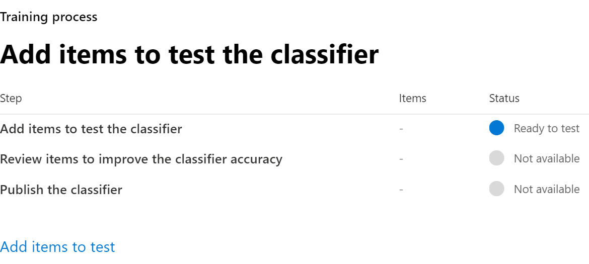
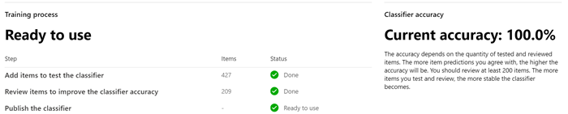

# 建立 trainable 的分類器（預覽）Creating a trainable classifier (preview)

當其中一個現成的分類器無法滿足您的需求時，請使用 trainable 的分類程式。Use trainable classifiers when one of the out of the box classifiers won't meet your needs. Microsoft 365 分類器是一種工具，可讓您訓練以辨識各種類型的內容，其範例可供您查看。A Microsoft 365 classifier is a tool you can train to recognize various types of content by giving it samples to look at. 訓練分類器首先會將人工挑選和正確符合類別的範例提供給它。Training the classifier involves first giving it samples that are human picked and positively match the category. 然後，在處理完後，您可以透過提供正負樣本的混合來測試預測。Then, after it has processed those, you test the predictions by giving it a mix of positive and negative samples.

若要深入瞭解不同類型的分類器，請參閱[trainable 分類器的快速入門（預覽）](classifier-getting-started-with.md)To learn more about the different types of classifiers, see [Getting started with trainable classifiers (preview)](classifier-getting-started-with.md)

此時程表會反映部署範例。This timeline reflects a sample deployment.

> [!TIP]
> Trainable 分類器第一次需要自願加入。Opt-in is required the first time for trainable classifiers. Microsoft 365 需要12天的時間來完成組織內容的基準評估。It takes twelve days for Microsoft 365 to complete a baseline evaluation of your organizations content. 請與您的全域系統管理員聯繫，以啟動自願加入處理常式。Contact your global administrator to kick off the opt-in process.

## Seed 內容Seed content

當您想要 trainable 的分類器獨立且準確地將專案識別為屬於特定類別的內容時，您必須先呈現該類別中內容類型的許多範例。When you want a trainable classifier to independently and accurately identify an item as being in particular category of content, you first have to present it with many samples of the type of content that are in the category. Trainable 分類器的此樣本饋送稱為「*植*入」。This feeding of samples to the trainable classifier is known as *seeding*. Seed content 是由人類選取，並會判斷代表內容的類別。Seed content is selected by a human and is judged to represent the category of content.

> [!TIP]
> 您必須具有至少50的肯定範例，以及多達500。You need to have at least 50 positive samples and as many as 500. Trainable 分類程式會處理最多500個最近建立的範例（透過檔案建立的日期/時間戳記）。The trainable classifier will process up to the 500 most recent created samples (by file created date/time stamp). 您提供的範例越多，分類器所做的預測就越精確。The more samples you provide, the more accurate the predictions the classifier will make.

## 測試內容Testing content

Trainable 分類器處理足夠的肯定樣本來建立預測模型之後，您必須測試所做的預測，以查看分類器是否可以正確辨別與類別及專案不符的專案。Once the trainable classifier has processed enough positive samples to build a prediction model, you need to test the predictions it makes to see if the classifier can correctly distinguish between items that match the category and items that don't. 若要這麼做，您可以將它放在另一個中，但願其包含的範例應屬於類別，而不是使用的範例。You do this by feeding it another, hopefully larger, set of human picked content that consists of samples that should fall into the category and samples that won't. 一旦處理好，您就可以手動流覽結果，並確認每個預測是否正確、不正確或不確定。Once it processes those, you manually go through the results and verify whether each prediction is correct, incorrect, or you aren't sure. Trainable 分類器使用這種意見反應來改善其預測模型。The trainable classifier uses this feedback to improve its prediction model.

> [!TIP]
> 為了獲得最佳結果，您的測試範例集合中有10000個專案，且具有正值和負值的均勻分佈。For best results, have 10,000 items in your test sample set with an even distribution of positive and negative matches.

## 如何建立 trainable 的分類器How to create a trainable classifier

1. 在 50-500 seed content 專案之間收集。Collect between 50-500 seed content items. 這兩個範例都必須是強烈代表您想要讓 trainable 分類器正確識別為分類類別中的內容類型的範例。These must be only samples that strongly represent the type of content you want the trainable classifier to positively identify as being in the classification category. 如需支援的檔案類型，請參閱[SharePoint Server 中的預設編目副檔名和分析檔案類型](https://docs.microsoft.com/sharepoint/technical-reference/default-crawled-file-name-extensions-and-parsed-file-types)。See, [Default crawled file name extensions and parsed file types in SharePoint Server](https://docs.microsoft.com/sharepoint/technical-reference/default-crawled-file-name-extensions-and-parsed-file-types) for the supported file types.

> [!IMPORTANT]
> Seed 及 test 範例專案不能加密，必須是英文。The seed and test sample items must not be encrypted and they must be in English.

> [!IMPORTANT]
> 請確定 seed 集合中的專案是類別的**強**範例。Make sure the items in your seed set are **strong** examples of the category. Trainable 分類器最初會根據您植入的模型來建立模型。The trainable classifier initially builds its model based on what you seed it with. 分類器假設所有種子範例都是強陽性的，而且沒有任何方式知道樣本是否與類別弱或消極。The classifier assumes all seed samples are strong positives and has no way of knowing if a sample is a weak or negative match to the category.

2. 將 seed 內容放在專為*只保留 seed 內容*的 SharePoint Online 資料夾中。Place the seed content in a SharePoint Online folder that is dedicated to holding *the seed content only*. 請記下網站、文件庫和資料夾 URL。Make note of the site, library, and folder URL.

> [!TIP]
> 如果您為種子資料建立新的網站和資料夾，至少要有一個小時的時間進行索引，才可建立會使用該植入資料的 trainable 分類器。If you create a new site and folder for your seed data, allow at least an hour for that location to be indexed before creating the trainable classifier that will use that seed data.

3. 使用合規性管理員或安全性管理員角色存取及開啟**microsoft 365 規範中心**或**microsoft 365 安全中心** > **資料分類**，登入 Microsoft 365 合規性中心Sign in to Microsoft 365 compliance center with compliance admin or security admin role access and open **Microsoft 365 compliance center** or **Microsoft 365 security center** > **Data classification**

4. 選擇 [ **Trainable 類元**] 索引標籤。Choose the **Trainable classifiers** tab.

5. 選擇 [**建立 trainable 的分類器**]。Choose **Create trainable classifier**.

6. 填寫適當的值`Name`，以及`Description`您想要此 trainable 分類器識別之專案類別的欄位。Fill in appropriate values for the `Name`, and `Description` fields of the category of items you want this trainable classifier to identify.

7. 輸入從步驟2開始，實際的 SharePoint 線上網站、程式庫和資料夾 URL 的 seed 內容網站。Enter the exact SharePoint Online site, library, and folder URL for the seed content site from step 2. 選擇`Add`。Choose `Add`.

8. 複查設定並選擇`Create trainable classifier`。Review the settings and choose `Create trainable classifier`.

9. 在24小時內，trainable 分類程式會處理 seed 資料，並建立預測模型。Within 24 hours the trainable classifier will process the seed data and build a prediction model. 分類器狀態是`In progress`在處理 seed 資料時。The classifier status is `In progress` while it processes the seed data. 當分類器完成處理 seed 資料時，狀態變更為`Need test items`。When the classifier is finished processing the seed data, the status changes to `Need test items`.

10. 您現在可以選擇分類器來查看 [詳細資料] 頁面。You can now view the details page by choosing the classifier.

11. 至少收集200測試內容專案。Collect at least 200 test content items. Microsoft 建議10000以取得最佳結果。Microsoft recommends 10,000 for best results. 這些專案應該混合使用強陽性、強負片和有些專案，但其性質卻不明顯。These should be a mix of items that are strong positives, strong negatives and some that are a little less obvious in their nature. 如需支援的檔案類型，請參閱[SharePoint Server 中的預設編目副檔名和分析檔案類型](https://docs.microsoft.com/sharepoint/technical-reference/default-crawled-file-name-extensions-and-parsed-file-types)。See, [Default crawled file name extensions and parsed file types in SharePoint Server](https://docs.microsoft.com/sharepoint/technical-reference/default-crawled-file-name-extensions-and-parsed-file-types) for the supported file types.

> [!IMPORTANT]
> 範例專案不能加密，必須是英文。The sample items must not be encrypted and they must be in English.

12. 將測試內容放入專用於*只保留測試內容*的 SharePoint Online 資料夾中。Place the test content in a SharePoint Online folder that is dedicated to holding *the test content only*. 請記下 SharePoint 線上網站、文件庫和資料夾 URL。Make note of the SharePoint Online site, library, and folder URL.

> [!TIP]
> 如果您為測試資料建立新的網站和資料夾，至少要有一個小時的時間，才能建立會使用該植入資料的 trainable 分類程式。If you create a new site and folder for your test data, allow at least an hour for that location to be indexed before creating the trainable classifier that will use that seed data.

13. 選擇`Add items to test`。Choose `Add items to test`.

14. 輸入實際的 SharePoint 線上網站、程式庫，以及步驟12之測試內容網站的資料夾 URL。Enter the exact SharePoint Online site, library, and folder URL for the test content site from step 12. 選擇`Add`。Choose `Add`.

15. 選擇`Done`[完成]。Finish the wizard by choosing `Done`. 您的 trainable 分類程式會需要長達一小時才能處理測試檔案。Your trainable classifier will take up to an hour to process the test files.

16. 當 trainable 分類器完成處理測試檔案時，[詳細資料] 頁面上的狀態會變更`Ready to review`為。When the trainable classifier is done processing your test files, the status on the details page will change to `Ready to review`. 如果您需要增加測試樣本大小，請選擇`Add items to test`並允許 trainable 的分類器處理其他專案。If you need to increase the test sample size, choose `Add items to test` and allow the trainable classifier to process the additional items.

17. 選擇`Tested items to review` [索引標籤] 以查看專案。Choose `Tested items to review` tab to review items.

18. Microsoft 365 一次會出現30個專案。Microsoft 365 will present 30 items at a time. 請加以檢查，然後`We predict this item is "Relevant". Do you agree?`在方塊中`Yes`選擇`No` [ `Not sure, skip to next item`或] 或]。Review them and in the `We predict this item is "Relevant". Do you agree?` box choose either `Yes` or `No` or `Not sure, skip to next item`. 模型準確性會在每30個專案之後自動更新。Model accuracy is automatically updated after every 30 items.

![[複查專案] 對話方塊](../media/classifier-trainable-review-detail.png)

19. 回顧*至少*200 個專案。Review *at least* 200 items.

<!-- insert Analyze steps here-->

20. 繼續進行檢查，直到精確度達到至少70%，且`Publish the classifier`狀態為。 `Ready to use`Continue to review until the accuracy reaches at least 70% and the `Publish the classifier` status is `Ready to use`.

21. 發佈分類器。Publish the classifier.

22. 一旦發佈您的分類器，就會在[使用敏感度標籤的 Office autolabeling](apply-sensitivity-label-automatically.md)中提供條件，根據狀況和[通訊規範](communication-compliance.md)[自動套用保留標籤原則](labels.md#applying-a-retention-label-automatically-based-on-conditions)。Once published your classifier will be available as a condition in [Office autolabeling with sensitivity labels](apply-sensitivity-label-automatically.md), [auto-apply retention label policy based on a condition](labels.md#applying-a-retention-label-automatically-based-on-conditions) and in [Communication compliance](communication-compliance.md).

> [!CAUTION]
> 在發佈分類器之後，它不能進行任何其他訓練，因此請務必確定您已測試並檢查盡可能多的專案，以確保精確度盡可能高。Once a classifier is published, it can't go through any additional training, so be very sure that you have tested and reviewed as many items as possible to ensure that the accuracy is as high as possible.

## 另請參閱See also

- [開始使用可訓練的分類器 (預覽)Getting started with trainable classifiers (preview)](classifier-getting-started-with.md)
- [SharePoint Server 中預設編目的檔案副檔名及剖析的檔案類型Default crawled file name extensions and parsed file types in SharePoint Server](https://docs.microsoft.com/sharepoint/technical-reference/default-crawled-file-name-extensions-and-parsed-file-types)
