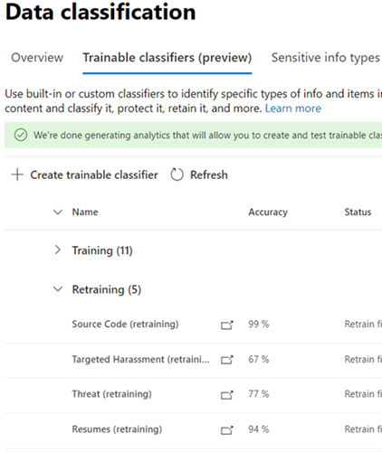

# 如何重新培訓內容瀏覽器中的分類器How to retrain a classifier in content explorer

Microsoft 365 trainable 分類器是一種工具，可讓您訓練以辨識各種類型的內容，其範例可供您查看。A Microsoft 365 trainable classifier is a tool you can train to recognize various types of content by giving it samples to look at. 經過訓練之後，您可以使用它來識別應用 Office 敏感度標籤、通訊合規性原則及保留標籤原則的專案。Once trained, you can use it to identify item for application of Office sensitivity labels, communications compliance policies, and retention label policies.

本文說明如何透過提供額外的意見反應，以改善自訂 trainable 分類器和部分預先訓練的分類器的效能。This article shows you how to improve the performance of custom trainable classifiers and some pre-trained classifiers by providing them additional feedback.

若要深入瞭解不同類型的分類器，請參閱 [瞭解如何 trainable 的分類](classifier-learn-about.md)器。To learn more about the different types of classifiers, see [Learn about trainable classifiers](classifier-learn-about.md).

## 權限Permissions

若要在 Microsoft 365 規範中心存取分類器：To access classifiers in the Microsoft 365 Compliance center:

- 合規性管理員角色或符合性資料管理員是訓練分類器所需的the Compliance admin role or Compliance Data Administrator is required to train a classifier

在下列情況下，您將需要具有這些許可權的帳戶才能使用分類器：You'll need accounts with these permissions to use classifiers in these scenarios:

- 保留標籤原則案例：記錄管理和保留管理角色Retention label policy scenario: Record Management and Retention Management roles 

## 整體工作流程Overall workflow

> [!IMPORTANT]
> 您可以在內容瀏覽器中為自動套用保留標籤原則提供反應，以進行 Exchange 專案，並使用分類器做為條件。You provide feedback in content explorer for auto-apply retention label policies to Exchange items and uses the classifier as a condition. **如果您沒有保留原則可將保留標籤自動套用至 Exchange 專案，並使用分類器做為條件，請停止這裡。****If you don't have a retention policy that auto-applies a retention label to Exchange items and      uses a classifier as a condition, stop here.**

當您使用分類器時，您可能會想要增加所進行之分類的精確度。As you use your classifiers, you may want to increase the precision of the classifications that they're making. 為此，您需要評估其所識別為符合或不符合專案之專案的分類品質。You do this by evaluating the quality of the classifications made  for items it has identified as being a match or not a match. 在您對分類器進行30個評估之後，就會使用該意見反應，並自動 retrains 自身。After you make 30 evaluations for a classifier it takes that feedback and automatically retrains itself.

若要深入瞭解重新培訓分類器的整體工作流程，請參閱 [用於重新培訓分類器的處理](classifier-learn-about.md#retraining-classifiers)流程。To understand more about the overall workflow of retraining a classifier, see [Process flow for retraining a classifier](classifier-learn-about.md#retraining-classifiers).

> [!NOTE]
> 分類器必須已發佈且在使用之前才能 retrained。A classifier must already be published and in use before it can be retrained.

## 如何重新培訓內容瀏覽器中的分類器How to retrain a classifier in content explorer

1. 使用合規性管理員或安全性系統管理員角色存取權登入 microsoft 365 合規性中心，並開啟 **microsoft 365 規範中心**  >  **資料分類**  >  **內容瀏覽器**。Sign in to Microsoft 365 compliance center with compliance admin or security admin role access and open **Microsoft 365 compliance center** > **Data classification** > **Content explorer**. 
2. 在 [ **標籤、資訊類型] 或 [類別** ] 清單中的 [篩選] 底下，展開 [ **Trainable** 類別]。Under the **Filter on labels, info types, or categories** list, expand **Trainable classifiers**.

> [!IMPORTANT]
> 匯總專案最多可以花八天，顯示在 trainable 的分類器標題下。It can take up to eight days for aggregated items to appear under the trainable classifiers heading.

3. 選擇您在自動套用保留標籤原則中使用的 trainable 分類器。Choose the trainable classifier you used in you auto-apply retention label policy. 這是您將提供意見反應的 trainable 分類器。This is the trainable classifier you will give feedback on.

> [!NOTE]
> 如果專案的 [ **保留標籤** ] 欄中有專案，則表示專案已分類為 `match` 。If an item has an entry in the **Retention label** column, it means that the item was classified as a `match`.  如果專案沒有 [ **保留標籤** ] 欄中的專案，表示它是分類為 `close match` 。If an item doesn't have an entry in the **Retention label** column, it means it was classified as a `close match`. 您可以提供專案的意見反應，以提升最大分類器的精確度 `close match` 。You can improve the classifier precision the most by providing feedback on `close match` items. 

4. 選擇一個專案，然後開啟它。Choose an item and open it.
 
 > [!TIP]
> 您可以同時提供多個專案的意見反應，方法是全部選擇，然後選擇 [改進命令列中的 **分類** ]。You can provide feedback on multiple items simultaneously by choosing them all and then choosing **Improve classification** in the command bar.

5. 選擇 [ **提供意見** 反應]。Choose **Provide feedback**.
6. 在 [ **詳細意見** 反應] 窗格中，如果專案為 true，請選擇 [ **符合**]。In the **Detailed feedback** pane, if the item is a true positive, choose, **Match**.  如果專案是誤報，表示它不正確地包含在類別中，請選擇 [ **不相符**]。If the item is a false positive, that is it was incorrectly included in the category, choose **Not a match**.
7. 如果有其他的分類器更適合該專案，您可以從 [ **建議其他 trainable** 系系] 清單中加以選擇。If there is another classifier that would be more appropriate for the item, you can choose it from the **Suggest other trainable classifiers** list. 這會觸發其他分類器來評估專案。This will trigger the other classifier to evaluate the item.
8. 選擇 [ **傳送意見** 反應] 以傳送您的評價 `match` 、 `not a match` 分類及建議其他 trainable 的分類程式。Choose **Send feedback** to send your evaluation of the `match`, `not a match` classifications and suggest other trainable classifiers. 當您向分類器提供30個反應實例時，它會自動重新導流。When you've provided 30 instances of feedback to a classifier, it will automatically  retrain. 重新培訓可能需要一到四個小時的時間。Retraining can take from one to four hours. 分類器每日只能有兩次 retrained。Classifiers can only be retrained twice per day.

> [!IMPORTANT]
> 此資訊會前往您租使用者中的分類器， **不會傳回 Microsoft**。This information goes to the classifier in your tenant, **it does not go back to Microsoft**.

9. 開啟 **Trainable 的分類** 器。Open **Trainable classifiers**.
10. 通訊合規性原則中使用的分類程式會出現在 [ **重新訓練** ] 標題下。The classifier that was used in your Communications compliance policy will appear under the **Re-training** heading.

11. 重新培訓完成後，請選擇分類器以開啟 [重新培訓一覽表]。Once retraining completes, choose the classifier to open the retraining overview.

12. 查看建議的動作，以及 retrained 及目前發佈之版本的分類器的預測比較。Review the recommended action, and the prediction comparisons of the retrained and currently published versions of the classifier.
13. 如果您已滿意重新培訓的結果，請選擇 [ **重新發佈**]。If you satisfied with the results of the retraining, choose **Re-publish**.
14. 如果您不滿意重新培訓的結果，您可以選擇在通訊規範介面中為分類器提供額外的意見反應，並開始另一種重新培訓週期; 或者，在這種情況下，將繼續使用分類器目前發行的版本。If you are not satisfied with the results of the retraining, you can choose to provide additional feedback to the classifier in the Communications compliance interface and start another retraining cycle or do nothing in which case the currently published version of the classifier will continue to be used. 

## 重新發佈建議的詳細資料Details on republishing recommendations

以下是關於如何提出建議以重新發佈 retrained 分類器或建議進一步重新培訓的詳細資訊。Here is a little information on how we formulate the recommendation to re-publish a retrained classifier or suggest further retraining. 這需要稍微深入瞭解 trainable 的分類器的運作方式。This requires a little deeper understanding of how trainable classifiers work.

在重新導流之後，我們會使用意見反應，以及原來用於訓練分類器的任何專案，來評估分類程式的效能。After a retrain, we evaluate the classifier's performance on both the items with feedback as well as any items originally used to train the classifier. 

- 針對內建模型，用來訓練分類器的專案是 Microsoft 用來建立模型的專案。For built-in models, items used to train the classifier are the items used by Microsoft to build the model.
- 針對自訂模型，在原始訓練中使用的專案分類器來自您已新增以進行測試及檢查的網站。For custom models, items used in the original training the classifier are from the sites you had added for test and review.

我們比較 retrained 和發行的分類器之兩組專案的效能值，以提供是否有改進重新發佈的建議。We compare the performance numbers on both sets of items for the retrained and published classifier to provide a recommendation on whether there was improvement to republish. 

## 另請參閱See also

- [深入瞭解 trainable 的分類器Learn about trainable classifiers](classifier-learn-about.md)
- [SharePoint Server 中預設編目的檔案副檔名及剖析的檔案類型Default crawled file name extensions and parsed file types in SharePoint Server](https://docs.microsoft.com/sharepoint/technical-reference/default-crawled-file-name-extensions-and-parsed-file-types)
