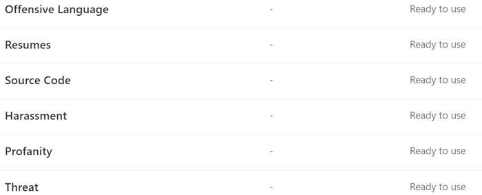

# 深入了解可訓練分類器Learn about trainable classifiers

分類及標示內容，使其能受到保護和正確處理，是資訊保護訓練科目的開始位置。Classifying and labeling content so it can be protected and handled properly is the starting place for the information protection discipline. Microsoft 365 有三種方式可對內容進行分類。Microsoft 365 has three ways to classify content.

## 手動Manually

此方法需要人工判斷和動作。This method requires human judgment and action. 系統管理員可以使用預先存在的標籤和敏感資訊類型，或自行建立，然後加以發佈。An admin may either use the pre-existing labels and sensitive information types or create their own and then publish them. 使用者和系統管理員會在遇到時，將其套用至內容。Users and admins apply them to content as they encounter it. 然後您就可以保護內容並管理其部署。You can then protect the content and manage its disposition.

## 自動模式對應Automated pattern matching

這種分類機制類別包括尋找內容的方式如下：This category of classification mechanisms include finding content by:

- 關鍵字或中繼資料值 (關鍵字查詢語言) 。Keywords or metadata values (keyword query language).
- 使用先前識別的敏感資訊模式，例如社會保險、信用卡或銀行帳戶號碼 [ (敏感資訊類型實體定義) ](sensitive-information-type-entity-definitions.md)。Using previously identified patterns of sensitive information like social security, credit card or bank account numbers [(Sensitive information type entity definitions)](sensitive-information-type-entity-definitions.md).
- 識別專案，因為它是範本的變化 (的 [ 檔指紋列印) ](document-fingerprinting.md)。Recognizing an item because it's a variation on a template [(document finger printing)](document-fingerprinting.md).
- 使用完全字串的目前狀態 [ (完全相符的資料) ](create-custom-sensitive-information-types-with-exact-data-match-based-classification.md)。Using the presence of exact strings [(exact data match)](create-custom-sensitive-information-types-with-exact-data-match-based-classification.md).

您可以使用敏感度和保留標籤，讓內容可供使用，以 [瞭解資料遺失防護](dlp-learn-about-dlp.md)) 和 [自動套用保留標籤的](apply-retention-labels-automatically.md)原則。Sensitivity and retention labels can then be automatically applied to make the content available for use in [Learn about data loss prevention](dlp-learn-about-dlp.md)) and [auto-apply polices for retention labels](apply-retention-labels-automatically.md).

## 分類Classifiers

這種分類方法特別適合無法透過手動或自動模式相符方法輕易識別的內容。This classification method is particularly well suited to content that isn't easily identified by either the manual or automated pattern matching methods. 此分類方法更貼近訓練分類器，以根據項目為何，而非依據項目中的元素 (模式比對) 來找到項目。This method of classification is more about training a classifier to identify an item based on what the item is, not by elements that are in the item (pattern matching). 分類器透過查看您要分類之內容的數百個範例，瞭解如何識別內容類型。A classifier learns how to identify a type of content by looking at hundreds of examples of the content you're interested in classifying. 您可以在類別中進一步送入明確的範例。You start by feeding it examples that are definitely in the category. 一旦處理這些程式，您可以讓它混合使用比對和不相符的範例。Once it processes those, you test it by giving it a mix of both matching and non-matching examples. 分類器接著會作出預測，以判斷是否有任何指定的專案屬於您所建立的類別。The classifier then makes predictions as to whether any given item falls into the category you're building. 然後，您可以確認其結果、將 true 正值、true 負片、誤報和漏報排序，以提升其預測的準確性。You then confirm its results, sorting out the true positives, true negatives, false positives, and false negatives to help increase the accuracy of its predictions. 

當您發佈分類器時，會依 SharePoint 線上、Exchange 及 OneDrive 等位置來排序專案，並將內容分類。When you publish the classifier, it sorts through items in locations like SharePoint Online, Exchange, and OneDrive, and classifies the content. 在您發佈分類器之後，您可以繼續使用類似于初始訓練程式的意見反應進行訓練。After you publish the classifier, you can continue to train it using a feedback process that is similar to the initial training process.

### 您可以使用 trainable 的分類器Where you can use trainable classifiers
在[使用靈敏度標籤](apply-sensitivity-label-automatically.md)的情況下，內建的分類器和 trainable 分類器皆為 Office autolabeling 的條件，根據狀況和[通訊合規性](communication-compliance.md)，[自動套用保留標籤原則](apply-retention-labels-automatically.md#configuring-conditions-for-auto-apply-retention-labels)。Both built-in classifiers and trainable classifiers are available as a condition for [Office autolabeling with sensitivity labels](apply-sensitivity-label-automatically.md), [auto-apply retention label policy based on a condition](apply-retention-labels-automatically.md#configuring-conditions-for-auto-apply-retention-labels) and in [communication compliance](communication-compliance.md). 

敏感度標籤可以使用分類器做為條件，請參閱 [自動套用敏感度標籤至內容](apply-sensitivity-label-automatically.md)。Sensitivity labels can use classifiers as conditions, see [Apply a sensitivity label to content automatically](apply-sensitivity-label-automatically.md).

> [!IMPORTANT]
> 分類器只會使用未加密及英文的專案。Classifiers only work with items that are not encrypted and are in English.

## 分類器類型Types of classifiers

- **預先訓練的分類** 器-Microsoft 已建立並預先訓練許多的分類器，您可以開始使用而不訓練它們。**pre-trained classifiers** - Microsoft has created and pre-trained a number of classifiers that you can start using without training them. 這些分類器的狀態會顯示為 `Ready to use` 。These classifiers will appear with the status of `Ready to use`.
- **自訂分類** 器-如果您需要擴充預先訓練的分類器所涵蓋專案以外的分類需求，您可以建立及訓練您自己的分類器。**custom classifiers** - If you have classification needs that extend beyond what the pre-trained classifiers cover, you can create and train your own classifiers.

### 預先訓練的分類器Pre-trained classifiers

Microsoft 365 附帶五個預先訓練的分類器：Microsoft 365 comes with five pre-trained classifiers:

> [!CAUTION]
> 我們正在取代 **冒犯性語言** 的預先訓練分類符，因為它已經產生大量的誤報。We are deprecating the **Offensive Language** pre-trained classifier because it has been producing a high number of false positives. 請勿使用它，如果您目前使用它，您應該將商務程式移出它。Don't use it and if you are currently using it, you should move your business processes off of it. 建議您改為使用 **威脅**、 **猥褻** 和 **騷擾** 預先訓練的分類器。We recommend using the **Threat**, **Profanity**, and **Harassment** pre-trained classifiers instead.

- **簡歷**：偵測屬於申請人個人、教育、專業資格、工作經驗及其他個人識別資訊的文字帳戶的專案**Resumes**: detects items that are textual accounts of an applicant's personal, educational, professional qualifications, work experience, and other personally identifying information
- **原始程式碼**：偵測包含一組指令和語句的專案，這些專案是以前25種使用的電腦程式設計語言所撰寫的 GitHub**Source Code**: detects items that contain a set of instructions and statements written in the top 25 used computer programming languages on GitHub
    - ActionScriptActionScript
    - CC
    - C#C#
    - C++C++
    - ClojureClojure
    - CoffeeScriptCoffeeScript
    - 移至Go
    - HaskellHaskell
    - JAVAJava
    - JavaScriptJavaScript
    - LuaLua
    - MatlabMATLAB
    - 目標-CObjective-C
    - PerlPerl
    - PhpPHP
    - PythonPython
    - RR
    - 紅寶石Ruby
    - ScalaScala
    - 命令介面Shell
    - 迅速Swift
    - TexTex
    - Vim 腳本Vim Script

> [!NOTE]
> 原始程式碼經過訓練，可在大量文字是原始程式碼時進行偵測。Source Code is trained to detect when the bulk of the text is source code. 它不會偵測到以純文字交錯的原始程式碼文字。It does not detect source code text that is interspersed with plain text.

- **騷擾**：偵測特定類別的冒犯性語言的文字專案，這些專案會根據下列特性，針對一或多個個人設定相關的冒犯性語言：種族、ethnicity、宗教、本國原產地、性別、性方向、年齡、傷殘**Harassment**: detects a specific category of offensive language text items related to offensive conduct targeting one or multiple individuals based on the following traits: race, ethnicity, religion, national origin, gender, sexual orientation, age, disability
- **猥褻** 語言：偵測特定類別的冒犯性語言的文字專案，包含 embarrass 大部分人員的運算式**Profanity**: detects a specific category of offensive language text items that contain expressions that embarrass most people
- **威脅**：偵測特定類別的冒犯性語言的文字專案與威脅以認可暴力或對人員或財產造成實體損毀或損毀的威脅**Threat**: detects a specific category of offensive language text items related to threats to commit violence or do physical harm or damage to a person or property

這些會出現在狀態為的 **Microsoft 365 規範中心**  >  **資料分類**  >  **Trainable 分類** 器] 視圖中 `Ready to use` 。These appear in the **Microsoft 365 compliance center** > **Data classification** > **Trainable classifiers** view with the status of `Ready to use`.

> [!IMPORTANT]
> 請注意，冒犯性語言、騷擾、猥褻和威脅分類器只會使用可搜尋文字，並非完整或完整。Please note that the offensive language, harassment, profanity, and threat classifiers only work with searchable text are not exhaustive or complete.  此外，語言和文化標準也會不斷變更，但在這些現實中，Microsoft 保留以其判斷來更新這些分類器的權利。Further, language and cultural standards continually change, and in light of these realities, Microsoft reserves the right to update these classifiers in its discretion. 雖然分類程式可協助您的組織監控冒犯性和其他語言，但分類程式不會解決這類語言的影響，而且不是為了提供組織的唯一監視或回應這類語言的使用方式。While the classifiers may assist your organization in monitoring offensive and other language used, the classifiers do not address consequences of such language and are not intended to provide your organization's sole means of monitoring or responding to the use of such language. 您的組織，而不是 Microsoft 或其子公司，仍然負責所有與監控、強制執行、封鎖、移除及保留預先訓練的分類器所識別的內容相關的決策。Your organization, and not Microsoft or its subsidiaries, remains responsible for all decisions related to monitoring, enforcement, blocking, removal and retention of any content identified by a pre-trained classifier.

### 自訂分類器Custom classifiers

當預先訓練的分類器不符合您的需求時，您可以建立及訓練您自己的分類器。When the pre-trained classifiers don't meet your needs, you can create and train your own classifiers. 建立您自己的工作會相當多，但他們會更適合組織的需求。There's significantly more work involved with creating your own, but they'll be much better tailored to your organizations needs. 

例如，您可以為下列專案建立 trainable 的分類器：For example you could create trainable classifiers for:
 
- 法律檔，例如律師用戶端許可權、結束集、工作帳單Legal documents - such as attorney client privilege, closing sets, statement of work
- 戰略性商務檔-類似電子報、合併與收購、交易、商務或行銷計畫、智慧財產權、專利權、設計檔Strategic business documents - like press releases, merger and acquisition, deals, business or marketing plans, intellectual property, patents, design docs
- 定價資訊-類似發票、價格報價單、工作訂單、投標檔Pricing information - like invoices, price quotes, work orders, bidding documents 
- 財務資訊，例如組織投資、季度或年度結果Financial information - such as organizational investments, quarterly or annual results    

#### 建立自訂分類程式的程式流程Process flow for creating custom classifiers

在此流程中，建立及發行用於規範解決方案（例如保留原則及通訊監督）的分類程式。Creating and publishing a classifier for use in compliance solutions, such as retention policies and communication supervision, follows this flow. 如需建立自訂 trainable 分類器的詳細資訊，請參閱 [建立自訂分類器](classifier-get-started-with.md)。For more detail on creating a custom trainable classifier see, [Creating a custom classifier](classifier-get-started-with.md).

### 重新培訓分類器Retraining classifiers

您可以透過提供其所執行分類的意見反應，協助改善所有自訂分類器和某些預先訓練的分類器的準確性。You can help improve the accuracy of all custom classifiers and some pre-trained classifiers by providing them with feedback on the accuracy of the classification that they perform. 這稱為重新培訓，遵循此工作流程。This is called retraining and follow this workflow.

## 另請參閱See also

- [保留標籤Retention labels](retention.md)
- [深入了解資料外洩防護Learn about data loss prevention](dlp-learn-about-dlp.md)
- [敏感度標籤Sensitivity labels](sensitivity-labels.md)
- [敏感資訊類型實體定義Sensitive information type entity definitions](sensitive-information-type-entity-definitions.md)
- [檔指紋列印Document finger printing](document-fingerprinting.md)
- [完全相符的資料Exact data match](create-custom-sensitive-information-types-with-exact-data-match-based-classification.md)
