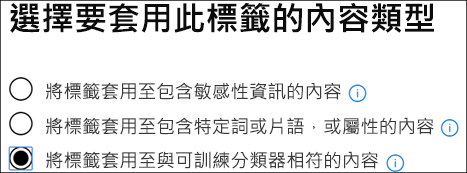

# 使用保留標籤測試內建的分類器（預覽）Testing built-in classifiers using retention labels (preview)

Microsoft 已訓練及測試五個分類器，可協助識別特定的內容類別別。Microsoft has trained and tested five classifiers which can help to identify certain categories of content. 這些分類器預設會顯示在 `Ready to use` 群組中，並使用大量的範例資料集進行訓練。These classifiers show up in the `Ready to use` group by default and were trained using very large sample data sets.

> [!IMPORTANT]
> 在您的分類和標籤工作流程中使用內建的分類器之前，您應該針對組織內容的範例進行測試，以確認類別的分類預測符合您的預期。Before using built-in classifiers in your classification and labeling workflow, you should test it against a sample of your organization's content that you feel fits the category to verify that its classification predictions meet your expectations.

如需 trainable 的分類器的詳細資訊，請參閱[trainable 分類器（預覽）快速](classifier-getting-started-with.md)入門。For more information on trainable classifiers, see [Getting started with trainable classifiers (preview)](classifier-getting-started-with.md).

Microsoft 365 隨附了五個建議的內建分類器：Microsoft 365 comes with five recommended built-in classifiers:

> [!CAUTION]
> 我們正在淘汰 [粗穢言語]\*\*\*\* 內建分類器，因為這個分類器產生了大量的誤報。We are deprecating the **Offensive Language** built-in classifier because it has been producing a high number of false positives. 請勿使用它，如果您目前使用它，您應該將商務程式移出它。Don't use it and if you are currently using it, you should move your business processes off of it. 建議您改為使用**威脅**、**猥褻**和**騷擾**內建的分類符。We recommend using the **Threat**, **Profanity**, and **Harassment** built-in classifiers instead.

- **簡歷**：偵測屬於申請人個人、教育、專業資格、工作經驗及其他個人識別資訊的文字帳戶的專案**Resumes**: detects items that are textual accounts of an applicant's personal, educational, professional qualifications, work experience, and other personally identifying information
- **原始程式碼**：偵測包含一組指令和語句的專案，這些專案是以前25種使用的電腦程式設計語言所撰寫的 GitHub**Source Code**: detects items that contain a set of instructions and statements written in the top 25 used computer programming languages on GitHub

  |**語言名稱****Language Name**|||||
  |---------|---------|---------|---------|---------|
  |ActionScriptActionScript|CC        |C#C#       |C++C++     |ClojureClojure  |
  |CoffeeScriptCoffeeScript|CssCSS     |移至Go       |HaskellHaskell |HTMLHTML     |
  |JAVAJava     |JavaScriptJavaScript|LuaLua      |MatlabMATLAB   |目標-CObjective-C|
  |PerlPerl     |PhpPHP      |PythonPython   |RR        |紅寶石Ruby     |
  |ScalaScala    |命令介面Shell    |迅速Swift    |TexTex      |Vim 腳本Vim Script|

> [!NOTE]
> 原始程式碼經過訓練，可在大量文字是原始程式碼時進行偵測。Source Code is trained to detect when the bulk of the text is source code. 它不會偵測到以純文字交錯的原始程式碼文字。It does not detect source code text that is interspersed with plain text.

- **騷擾**：偵測特定類別的冒犯性語言的文字專案，這些專案會根據下列特性，針對一或多個個人設定相關的冒犯性語言：種族、ethnicity、宗教、本國原產地、性別、性方向、年齡、傷殘**Harassment**: detects a specific category of offensive language text items related to offensive conduct targeting one or multiple individuals based on the following traits: race, ethnicity, religion, national origin, gender, sexual orientation, age, disability
- **猥褻**語言：偵測特定類別的冒犯性語言的文字專案，包含 embarrass 大部分人員的運算式**Profanity**: detects a specific category of offensive language text items that contain expressions that embarrass most people
- **威脅**：偵測特定類別的冒犯性語言的文字專案與威脅以認可暴力或對人員或財產造成實體損毀或損毀的威脅**Threat**: detects a specific category of offensive language text items related to threats to commit violence or do physical harm or damage to a person or property

> [!IMPORTANT]
> 請注意，冒犯性語言、騷擾、猥褻和威脅分類器只會使用可搜尋文字，並非完整或完整。Please note that the offensive language, harassment, profanity, and threat classifiers only work with searchable text are not exhaustive or complete. 此外，語言和文化標準也會不斷變更，但在這些現實中，Microsoft 保留以其判斷來更新這些分類器的權利。Further, language and cultural standards continually change, and in light of these realities, Microsoft reserves the right to update these classifiers in its discretion. 雖然分類程式可協助您的組織監控冒犯性和其他語言，但分類程式不會解決這類語言的影響，而且不是為了提供組織的唯一監視或回應這類語言的使用方式。While the classifiers may assist your organization in monitoring offensive and other language used, the classifiers do not address consequences of such language and are not intended to provide your organization's sole means of monitoring or responding to the use of such language. 您的組織，而不是 Microsoft 或其子公司，仍然負責所有與監控、強制執行、封鎖、移除及保留預先訓練的分類器所識別的內容相關的決策。Your organization, and not Microsoft or its subsidiaries, remains responsible for all decisions related to monitoring, enforcement, blocking, removal and retention of any content identified by a pre-trained classifier.

## 如何確認內建的分類器符合您的需求How to verify that a built-in classifier will meet your needs

1. 收集您認為屬於內建分類器（肯定比對）類別的可處置內容專案，以及您要測試之類別中不應該包含的專案（負數相符）。Collect disposable test content items that you feel belong in the category of the built-in classifier (positive matches) and ones that shouldn't be included (negative matches) in the category you're testing.

   > [!IMPORTANT]
   > 範例專案不能加密，必須是英文。The sample items must not be encrypted and they must be in English.

2. 建立專用的 SharePoint 線上資料夾;至少等候一個小時的資料夾新增至搜尋索引。Create a dedicated SharePoint Online folder; wait at least an hour for the folder to be added to the search index. 請記下資料夾 URL。Make note of the folder URL.

3. 使用合規性管理員或安全性系統管理員角色存取，登入 microsoft 365 合規性中心，並開啟**microsoft 365 規範中心**  >  **記錄管理（預覽）**  >  **標籤原則] 索引標籤**。Sign in to Microsoft 365 compliance center with compliance admin or security admin role access and open **Microsoft 365 compliance center** > **Records management (preview)** > **Label policies** tab.

4. 選擇 `Auto-apply a label` 。Choose `Auto-apply a label`.

5. 選擇 `Choose a label to auto-apply` 。Choose `Choose a label to auto-apply`.

6. 選擇 `Create new labels` 並建立標籤，以用於此測試。Choose `Create new labels` and create a label for use just with this test. 當您執行此動作時，請 `Retention` 將設定為 `off` 。When you do this, leave `Retention` set to `off`. 您不想開啟任何保留或其他動作。You don't want to turn on any retention or other actions. 在此情況下，您只會使用保留標籤做為文字標籤，而不會強制執行任何動作。In this case, you'll be using the retention label simply as a text label, without enforcing any actions. 例如，您可以建立一個名為 "SourceCode 分類程式 test" 的保留標籤，但不會執行任何動作，然後將該保留標籤自動套用至來原始程式碼分類器為條件的內容。For example, you can create a retention label named "SourceCode classifier test" with no actions, and then auto-apply that retention label to content that has Source code classifier as a condition. 若要深入瞭解保留標籤，請參閱[瞭解保留原則和保留標籤](retention.md)。To learn more about retention labels, see [Learn about retention policies and retention labels](retention.md).
  
7. 選擇 [ `Auto-apply a label` 和] `Choose a label to auto-apply` 。Choose `Auto-apply a label` and then `Choose a label to auto-apply`. 若要深入瞭解使用條件自動套用標籤的詳細資訊，請參閱，設定[自動套用保留標籤的條件](apply-retention-labels-automatically.md#configuring-conditions-for-auto-apply-retention-labels)。To learn more about using condition based auto-apply a label see, [Configuring conditions for auto-apply retention labels](apply-retention-labels-automatically.md#configuring-conditions-for-auto-apply-retention-labels).

8. 從清單中選擇您的測試卷標，然後選擇 [ `Next` 。Choose your test label from the list and choose `Next`.

9. 選擇 `Apply label to content that matches a trainable classifier` 。Choose `Apply label to content that matches a trainable classifier`.

   

10. 在此情況下，從清單中選擇您的分類器`Source Code`Choose your classifier from the list, in this case `Source Code`

11. 命名原則，例如「原始程式碼內建的分類程式測試」。Name the policy, for example "Source code built-in classifier test".

12. 選擇 `Let me choose specific locations` 。Choose `Let me choose specific locations`.

13. 關閉除 `SharePoint sites` 及選擇以外的所有位置 `Choose sites` 。Turn off all locations except `SharePoint sites` and choose `Choose sites`.

14. 輸入步驟2中之網站的 URL。Enter the URL for the site from step 2.

15. 完成該嚮導並選擇`Auto-apply`Finish the wizard and choose `Auto-apply`

16. 將測試專案放入專用的 SharePoint 線上資料夾中。Place the test items into the dedicated SharePoint Online folder.

17. 允許套用標籤的小時數。Allow an hour for the label to be applied.

18. 檢查標籤的檔內容，查看是否有分類程式包含與您預期的測試內容。Check the properties of the documents for the label to see if the classifier included and excluded the test content as you expected.

19. 查看已標示的專案。Review the items that were labeled.

20. 如果您已經完成測試，請刪除內容和標籤原則。Delete the content and the label policy if you're done with your testing.

另請參閱：See also:

- [開始使用可訓練的分類器 (預覽)Getting started with trainable classifiers (preview)](classifier-getting-started-with.md)
- [瞭解保留原則和保留標籤Learn about retention policies and retention labels](retention.md)
- [自動將保留標籤套用保留或刪除內容Automatically apply a retention label to retain or delete content](apply-retention-labels-automatically.md)
