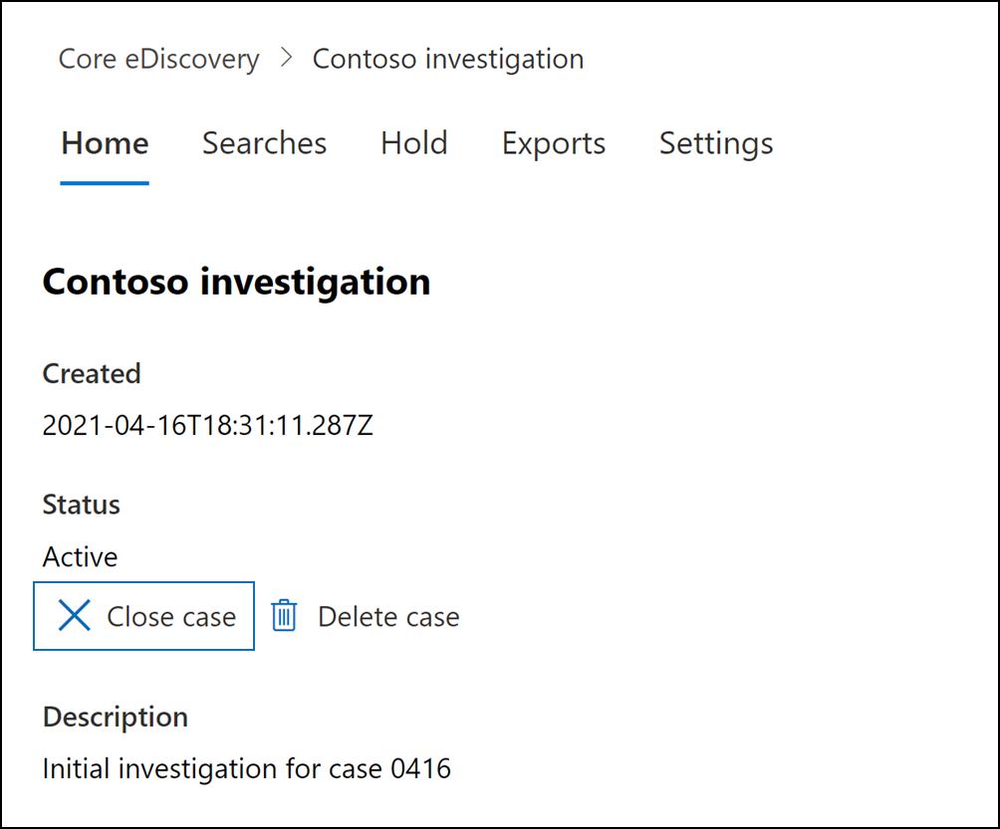

# 關閉、重新開啟和刪除核心 eDiscovery 案例

本文說明如何在 Microsoft 365 中關閉、重新開啟和刪除核心 eDiscovery 案例。

## 關閉案例

當核心 eDiscovery 案例支援的法律案例或調查完成後，您就可以關閉案例。 以下是關閉案例時會發生的情況：
  
- 若案例中包含任何 eDiscovery 保留，將會關閉這些功能。 關閉關閉後，30天的寬限期 (稱為 *延遲保留*) 會套用到保留的內容位置。 這有助於防止內容立即刪除，並可讓系統管理員在延遲保留期間到期後，永久刪除內容之前，先進行搜尋並還原內容的機會。 如需詳細資訊，請參閱 [移除 eDiscovery 保留中的內容位置](create-ediscovery-holds.md#removing-content-locations-from-an-ediscovery-hold)。

- 關閉案例只會關閉與該案例相關聯的保留。 若其他保留放在內容位置 (例如訴訟暫止、保留原則或其他核心 eDiscovery 案例的保留) 仍會保留這些保留。

- 此案例仍列在 Microsoft 365 規範中心的核心 eDiscovery 頁面上。 已關閉案例的詳細資料、保留、搜尋和成員都會保留。

- 您可以在關閉案例後進行編輯。 例如，您可以新增或移除成員、建立搜尋並匯出搜尋結果。 主動和封閉式案例之間的主要差異是關閉案例時，會關閉 eDiscovery 保留。

若要關閉案例：
  
1. 在 [Microsoft 365 規範中心] 中，按一下 [ **eDiscovery**  >  **Core** ] 以顯示組織中核心 eDiscovery 案例的清單。

2. 按一下您要關閉之案例的名稱。

   

3. 在首頁上的 [ **狀態**] 下，按一下 [ **關閉案例**]。

    會顯示警告，指出與案例相關聯的保留會關閉。

4. 按一下 **[是]** 以關閉案例。

    案例首頁上的狀態會從 [ **可用** ] 變更為 [ **關閉**]。

5. 在 [ **核心 eDiscovery** ] 頁面上 **，按一下 [** 重新整理] 以更新封閉式案例的狀態。 關閉程序最多可能需要 60 分鐘才會完成。

    當程式完成時，**核心 eDiscovery** 頁面上的案例狀態會變更為 [**已關閉**]。

## 重新開啟已關閉的案例

當您重新開啟案例時，關閉案例時所使用的任何 eDiscovery 保留都不會自動復原。 在重新開啟案例之後，您必須移至 [ **保留** ] 頁面並開啟先前保留。 若要開啟保留，請加以選取以顯示飛出視窗頁面，然後將 [狀態]**** 切換開關設定為 ****[開啟]。
  
1. 在 [Microsoft 365 規範中心] 中，按一下 [ **eDiscovery**  >  **Core** ] 以顯示組織中核心 eDiscovery 案例的清單。

2. 按一下您要重新開啟之案例的名稱。

   

3. 在首頁上的 [ **狀態**] 下，按一下 [ **重新開啟案例**]。

    會顯示警告，指出在關閉此案例時，其所關聯的保留不會自動開啟。

4. 按一下 **[是]** 重新開啟案例。

    [案例首頁飛出] 頁面上的狀態會從 [ **已關閉** **] 改為**[使用中]。

5. 在 **核心 eDiscovery** 頁面上 **，按一下 [** 重新整理] 以更新重新開啟之案例的狀態。 最多可能需要60分鐘的時間，重新開啟程式才會完成。 

    當程式完成時，**核心 eDiscovery** 頁面上的案例狀態會變更為 [**作用中]** 。

6.  (選用) 若要開啟與重新開啟之案例關聯的任何保留，請移至 [ **保留** ] 索引標籤，選取 [保留]，然後選取 [保留快顯視窗] 頁面上 [ **狀態** ] 底下的核取方塊。
  
## 刪除案例

您也可以刪除主動及封閉式核心 eDiscovery 案例。 當您刪除案例時，系統會刪除案例中的所有搜尋和匯出，然後會從 Microsoft 365 規範中心的 **核心 eDiscovery** 頁面上的案例清單中移除此案例。 您無法重新開啟已刪除的案例。

您必須先刪除 *所有* 與案例相關聯的 eDiscovery 保留，才可刪除案例 () 使用中或已關閉。 這包括刪除狀態為 **Off** 的保留。 

若要刪除 eDiscovery 保留：

1. 移至 [ **保留** ] 索引標籤中您要刪除的情況。

2. 選取您要刪除的保留。

3. 在飛入頁面上，按一下 [ **刪除**]。

      

若要刪除案例：

1. 在 [Microsoft 365 規範中心] 中，按一下 [ **eDiscovery**  >  **Core** ] 以顯示組織中核心 eDiscovery 案例的清單。

2. 按一下您要刪除之案例的名稱。

3. 在 [案例] 首頁的 [ **狀態**] 下，按一下 [ **刪除案例**]。

      

如果您嘗試刪除的案例仍包含 eDiscovery 保留，您會收到錯誤訊息。 您必須刪除所有與案例相關聯的保留，然後再試一次，以刪除案例。
