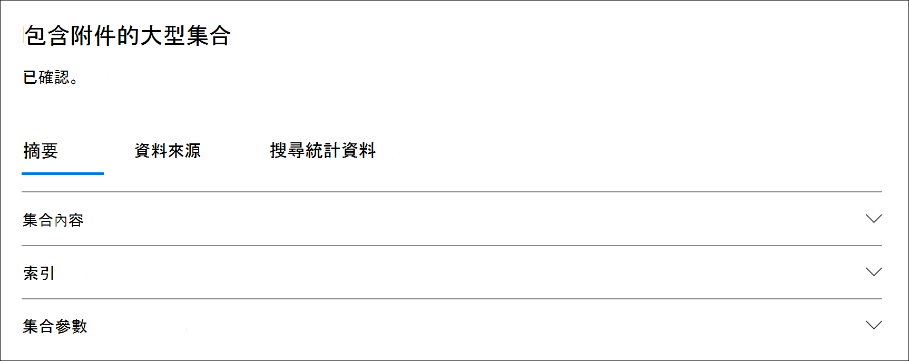

# Advanced eDiscovery 的集合統計資料和報告

建立草稿收集後，您可以在檢索的專案上查看統計資料，例如包含符合搜尋準則之專案數目上限的內容位置，以及搜尋查詢傳回的專案數目。 您也可以預覽結果的子集。

當您識別想要進一步檢查的檔集合時，您可以將搜尋結果新增至審閱集，以進行收集和處理。

## 草稿集合的統計資料和報告

本節說明草案集合可使用的統計資料。 您可以在草稿集合的飛入頁面上的 [ **搜尋統計** 資料] 索引標籤中取得這些統計資料。

### 集合預估

這個區段會顯示集合所傳回之估計專案的圖形摘要。 這會指出符合集合之搜尋準則的專案數。 此資訊可讓您瞭解集合所傳回之專案的預估數目。

- **依位置預估專案** 數目：集合所傳回的預估專案總數。 也會顯示位於 [信箱] 和 [網站] 中的特定專案數目。

- **具有點擊的預估位置**：包含集合所傳回之專案的內容位置總數。 也會顯示特定數目的信箱和網站位置。

- **依位置 (的資料量（以 MB 為單位）)**：集合傳回之所有預估專案的總大小。 也會顯示信箱專案和網站專案的特定大小。

### 條件報告

本節顯示集合搜尋查詢的統計資料，以及符合搜尋查詢不同部分之估計專案數目的統計資料。 您可以使用這些統計資料來分析符合每個搜尋查詢元件的專案數。 這可協助您調整集合的搜尋準則，並視需要縮小集合的範圍。

- **位置類型**：查詢統計資料適用的內容位置類型。 **Exchange** 的值會指出信箱位置;值 **SharePoint** 表示網站位置。

- **部分**：搜尋查詢的部分適用的統計資料。 **主要** 表示整個搜尋查詢。 **關鍵字** 表示列中的統計資料是針對特定的關鍵字。 如果您針對集合中的搜尋查詢使用關鍵字清單，則會在此表格中包含每個查詢元件的統計資料。

- **條件**：執行搜尋查詢的實際元件 (關鍵字或條件) ，該繪製集合會傳回對應列中所顯示之統計資料的草稿集合。

- **具有點擊的位置**： [ **位置類型** ] 欄) 所指定的內容位置數目 (，包含符合 [ **條件** ] 欄中所列之 primary 或關鍵字查詢的專案。

- **專案**：從指定的內容位置 (的專案數，) 符合 [ **條件** ] 欄中所列的查詢。 如先前所述，如果專案包含要搜尋之關鍵字的多個實例，它只會在此欄位中計算一次。

- **Size (MB)**：在指定的內容位置中 (的所有專案總大小，) 符合 [ **條件** ] 欄中的搜尋查詢。

### 主要位置

本節顯示集合所傳回專案中的特定內容位置的統計資料。

- 位置名稱 (信箱的電子郵件地址，以及網站) 的 URL。

-  (信箱或網站) 的位置類型。

- 集合所傳回的內容位置中的專案數預估。

- 每個內容位置預估專案的總大小。

## 認可集合的統計資料和報告

本節說明將集合認可至審閱集之後可用的統計資料，包括新增至審閱集的實際專案數目。 除了載入設定資訊之外，這些統計資料 () 提供新增至案例的內容相關歷史資訊。

在您認可集合的審閱集合之後，下列索引標籤會顯示在已認可之連線的飛出頁面上。 每個索引標籤都包含有關集合的不同類型的資訊。

### 集合內容

在 [ **摘要** ] 索引標籤的此區段中，包含從集合的資料來源收集並新增至審閱集之專案的統計資料和其他資訊。

- **解壓縮的專案總數**。 新增至審閱集的專案總數。 這個數目會指出新增至審閱集之父項和子項的總和。

  > [!TIP]
  > 將游標懸停在父項或子項列的上方，以顯示父專案或子項的總數。

- **上層專案**。 集合所傳回的專案數，用來收集已新增至審閱集的專案。 此編號會對應至 (，並且等於) **集合 parameters** 區段中所顯示的估計專案數。 父專案的數目，其收集的資訊是用來收集已新增至審閱集的專案。
 
   父專案可能包含多個子專案。 例如，電子郵件是指其包含附加檔案或具有雲端附件的上層專案。 在此情況下，會將雲端附件的附加檔案或目標視為子專案。 當您認可集合時，上層專案和任何對應的子項會以個別專案或檔案的形式新增至審閱集。

- **子專案**。 新增至審閱集的子專案數目。 子項是父專案的附件或其他部分。 子專案包括附加的檔案、雲端附件、影像和電子郵件簽章。 當您認可集合的審閱集時，子專案會解壓縮、編制索引，並新增至審閱集做為個別的檔案。

- **唯一專案**。 新增至審閱集的唯一專案數目。 唯一的專案對考核集是唯一的。 當第一個集合新增至新的審閱集時，所有專案都是唯一的，因為複查集中沒有前面的專案。

- **識別重複的專案**。 集合中未新增至審閱集的專案數，因為審閱集中已存在相同的專案。 重複專案的統計資料可協助說明從草稿集合估計的專案數與新增至審閱集之專案的實際數目之間的差異。

### 索引

在認可的複查集的 [**摘要**] 索引標籤上，「**索引**」區段包含有關新增至審閱集之專案的索引資訊。

**新的索引項目目**。 在新增至審閱集之前，新編制索引的專案數。 新編制索引的專案範例是在將其新增至審閱集之前，先從上層專案提取子專案，然後編制索引。 此外，在案例中的 [ **資料來源** ] 索引標籤上，未列出位於 custodial 資料來源和非 custodial 內容位置的專案，會先進行索引，然後再將其新增至審閱。 例如，新編制索引的專案會包含從其他位置收集的專案。

**已更新索引的專案**。 已成功編制索引並新增至審閱集之已編制索引的部分專案數目。 這會在將集合認可至審閱集時，已成功編制索引的 custodial 和非 custodial 內容位置 **資料來源** ] 索引標籤中部分編制索引的專案。

**索引錯誤**。 在新增至審閱集之前，無法編制索引的部分索引項目目數目。 這些專案可能需要錯誤修正。

### 集合參數

此區段會顯示用來收集新增至審閱集之專案所用的集合資訊。 此索引標籤會顯示與 [ **搜尋統計資料] 索引** 標籤上之資訊類似的資訊。本節提供集合所使用之搜尋查詢的快捷快取快照，搜尋的內容位置和預估的集合結果。 如先前所述，此區段中預估專案的數目會等於 [ **集合內容** ] 區段中顯示的父專案數目。

### 搜尋統計資料] 索引標籤

[ **搜尋統計資料] 索引** 標籤上顯示的統計資料，與上一個草稿收集的執行時間相同。 這包括集合預估、條件報表及主要位置。 此資訊會從草稿集合保留以供歷史參考，而且可以與提交至審閱集的實際集合相比較。

## 草稿集合預估和實際認可的集合之間的差異

當您執行草稿收集時，會在 [**摘要**] 索引標籤和 [**搜尋統計資料] 索引** 標籤的 [**集合估計**] 區段中，顯示 (的專案數和其總大小) （符合集合準則）的預估。在您將草擬集合認可至審閱集合之後，新增審閱集的實際專案數目 (和其總大小) 通常與估計值不同。 在大多數情況下，會將多個專案加入至 [草稿] 集合所估計的審閱集。 下列清單說明這些差異最常見的原因，以及識別它們的秘訣：

- **子專案**。 從其上層專案解壓縮並新增為個別檔案的子項專案。 子專案數目會大幅增加實際新增至審閱集的專案數。 一般來說，已認可集合的 [**摘要**] 索引標籤上的 [**集合內容**] 區段中所識別的父專案數目，應等於從草稿集合中預估專案的數目。

- **重複的專案**。 將不會新增已新增至先前集合中之審閱集之草稿集合中的專案。 如先前所述，集合中重複專案的數目會顯示在 [**摘要**] 索引標籤上的 [**集合內容**] 區段中。

- **集合設定選項**。 當您將草稿集合認可至審閱集時，您必須選擇包含交談執行緒、雲端附件及檔版本。 任何新增至審閱集的專案都不會包含在草稿集合的估計中。 只有當您認可集合時，才會加以識別及收集。 選取這些選項會極有可能增加新增至審閱集的專案數。 

    例如，多個版本的 SharePoint 檔不會包含在草稿集合的估計中。 不過，如果您在匯出搜尋結果時選取 [包含所有檔版本] 選項，則會增加實際數目 (及新增至審閱集之專案的總大小) 。 

    如需這些選項的詳細資訊，請參閱將 [草稿集合認可至審閱集](commit-draft-collection.md#commit-a-draft-collection-to-a-review-set-in-advanced-ediscovery)。 

以下是從草稿集合估計結果可能與實際認可結果不同的原因。

- **繪製集合的結果預估方式**。 草稿集合所傳回的搜尋結果的預估，就是估計 (，而不是符合集合查詢準則之專案的實際計數) 。 若要編譯電子郵件專案的預估，請從 Exchange 資料庫要求符合搜尋準則的郵件 IDs 清單。 不過，當您將集合提交至審閱集時，會重新執行該集合，並從 Exchange 資料庫中檢索實際郵件。 因為專案的預估數目及實際專案數目的決定，所以可能會產生差異。

- 在 **估計及認可草稿收藏時所發生的變更**。 當您將草稿集合認可至審閱集時，會重新執行搜尋，以收集符合搜尋準則之搜尋索引中的最近專案。 您可能會建立、傳送或刪除符合搜尋準則的其他專案，只要在草稿收集的最後一次執行時，以及將草稿收集提交至審閱集。 您也可以將搜尋索引中的專案，當已評估的草稿收集結果已經從資料來源中清除後，才會再提交集合。 緩解此問題的一種方法是指定集合的日期範圍。 另一種方式是保留內容位置，讓專案得以保留且無法清除。

- 未 **編制索引的專案**。 如果草稿集合包含搜尋所有 Exchange 信箱或所有 SharePoint 網站，則只有包含符合集合準則之專案的內容位置中未編制索引的專案，才會新增至審閱集。 換句話說，如果在信箱或網站中找不到任何結果，則該信箱或網站中的任何未編制索引的專案都不會新增至審閱集。 不過，所有內容位置的未編制索引項目目 (甚至不含符合集合查詢) 專案的專案，將會包含在預估的集合結果中。

    或者，如果草稿集合包含特定的內容位置 (這表示在 [草稿收集嚮導] 中的 [ **其他位置**) ] 頁面上所指定的特定信箱或網站，則會匯出未編制索引的專案 (未從搜尋中指定的內容位置) 。 在此情況下，會估計未編制索引的專案數，以及新增至審閱集的未編制索引項目目數目應該相同。
