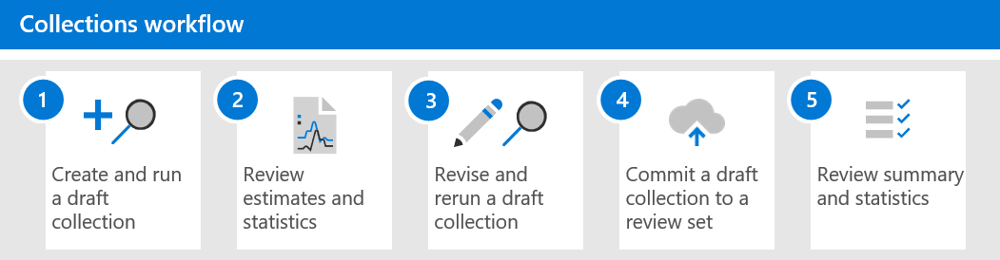

# 深入瞭解 Advanced eDiscovery 的集合

> [!NOTE]
> 在 [Advanced eDiscovery] 中，我們正在推出新的集合體驗，這會在本文所述。 這項推廣會花幾周的時間，才能讓所有的組織使用。 如果您的組織無法使用新的集合體驗，您仍然可以使用 [高級 eDiscovery 搜尋工具](create-search-to-collect-data.md)收集案例內容。

當組織面臨收集可能與調查或潛在訴訟相關的通訊和內容時，在最佳情況下，他們會面臨重大挑戰。 在當今的現代工作場所，內容數量、種類繁多，以及內容速度都是啟用創新和遠端工作，同時還擴充了管理 eDiscovery 調查集合的需求和處理常式。

集合工作流程在從原生位置和來源解壓縮內容時，提出了重大的技術挑戰。 這也是一般訴訟或調查案例的評估與策略中的重要一點。 當組織開始評估調查時，可能會問的第一個問題是誰會參與？ 在識別參與的人員之後，可以快速保留這些保管人以保留相關的內容。 下一個問題是發生什麼事？ 若要回答任何調查的第二個基本問題，管理員必須開啟資料。 若要快速評估最相關的內容，以快速評估問題的地點，管理員必須先簡化問題的目標，以確保集合結果很廣，但不會太大。

「高級 eDiscovery 協助 eDiscovery 管理員」中的集合，可讓搜尋跨電子郵件、檔及其他 Microsoft 365 內容中的內容。 集合提供經理與案例相關的估計內容。 這可讓管理員對與案例相關之內容的大小和範圍進行快速、有判斷的決策。 eDiscovery 管理員可以建立集合以搜尋 custodial 資料來源 (例如信箱和 SharePoint 網站) 和使用特定搜尋準則 (例如關鍵字和日期範圍) ，以快速定義其集合的範圍。

定義集合之後，eDiscovery 管理員可以將集合儲存為草稿並取得估計值，包括評估資料量、包含結果的內容位置，以及搜尋查詢準則的點擊次數。 這些洞察力可協助告知集合是否應該修正，以縮小或擴大集合的範圍，然後再移至 eDiscovery 工作流程中的複查和分析階段。

當管理員符合集合的範圍，且估計的內容數量可能會有所回應時，管理員就可以新增或 *認可* 內容至審閱集。 當您將集合提交至審閱集時，該管理員也會有包括聊天交談、雲端附件及檔版本的選項。 集合中的內容也會透過在內建至審閱集期間經歷另一個處理層級。 而且會使用最後的集合摘要更新集合。 將內容新增至審閱集合之後，eDiscovery 管理員可以繼續查詢、群組和精煉內容，以協助進行最小化及審閱。 此外，會更新該集合，以瞭解提交至審閱集之內容的資訊和統計資料。 這會提供有關集合中內容的歷史參考。

在使用高級 eDiscovery 的集合發行中，[ **搜尋** ] 索引標籤已在 Microsoft 365 規範中心的高級 eDiscovery 案例中重新命名為 **集合** 。 定義集合範圍和大小的步驟，遵循與搜尋相同的處理常式來定義位置和條件。 [另存新檔草稿] 和 [取得預覽估計值] 可在提交完整搜尋及集合至審閱集之前，快速驗證集合的目標範圍。 這可改進工作管理，以及在搜尋與收集程式期間開始將內容降至最低的目標反覆運算。

## 收款工作流程

若要開始使用「高級 eDiscovery」中的集合，這裡是基本的工作流程，以及程式中每個步驟的描述。

1. **建立並執行草稿集合**。 第一步是建立草稿集合，並定義 custodial 和非 custodial 的資料來源進行搜尋。 您也可以搜尋尚未新增到案例中的其他資料來源。 在您新增資料來源之後，您可以設定搜尋查詢，在資料來源中搜尋與案例相關的內容。 您可以依據關鍵字、屬性和條件來建立搜尋查詢，以傳回可能與案例最相關的內容。 如需詳細資訊，請參閱 [建立草稿收集](create-draft-collection.md)。

2. **複查預估和統計資料**。 在您建立草稿收集並執行它之後，下一步是查看集合統計資料，以協助您驗證是否找到相關的內容，以及最有點擊的內容位置。 您也可以預覽搜尋結果的範例，以進一步協助您判斷內容是否在調查範圍內。 如需詳細資訊，請參閱「 [草稿集合的統計資料與報告](collection-statistics-reports.md#statistics-and-reports-for-draft-collections)」。

3. **修訂並重新執行草稿集合**。 根據集合所傳回的預估和統計資料，您可以變更搜尋的資料來源和搜尋查詢展開或縮小集合，以編輯草稿集合。 您可以更新及重新執行草稿集合，直到確信該集合包含與您案例最相關的內容為止。

4. **將草稿集合認可為審閱集**。 當您認為集合會傳回與案例相關的類型內容時，您可以將此集合認可為審閱集。 當您認可集合時，您可以選擇將交談執行緒、雲端附件及檔版本新增至審閱集，這可能會與案例相關。 當您認可集合時，會發生下列情況：

   - 子項專案 (例如電子郵件附件、電子郵件簽章及影像) 會從父 (專案（例如，電子郵件訊息、聊天訊息或檔) ）析取（稱為「 *深度索引* (」）中，並新增至審閱集做為個別的檔案。

   - 深入編制索引是針對從其他資料來源收集的專案執行。 這些類型的資料來源是以前新增至案例的 custodial 和非 custodial 資料來源以外的內容位置。

   如需詳細資訊，請參閱將 [草稿集合認可至審閱集](commit-draft-collection.md)。

5. **審閱集合摘要和統計資料**。 在您認可集合的審閱集合之後，就會保留集合的相關資訊，例如有關解壓縮專案的統計資料、深入索引、集合使用的搜尋查詢，以及收集項目的內容位置。 而且，認可的集合無法編輯或重新執行。 您只能複製或刪除它們。 保留集合提供已新增至審閱集之收集項目的歷史記錄。 如需詳細資訊，請參閱 [統計及報告的認可的集合](collection-statistics-reports.md#statistics-and-reports-for-committed-collections)。
