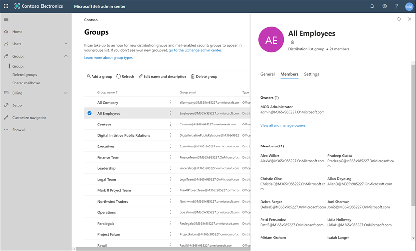
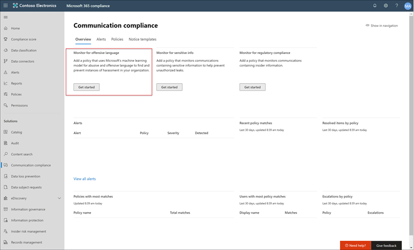
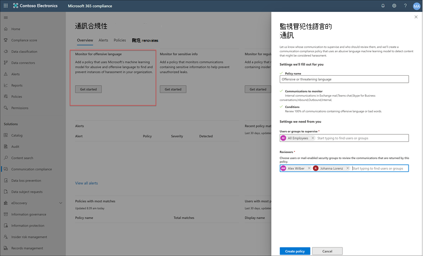

# 案例研究-Contoso 會快速設定冒犯性語言原則，以進行 Microsoft Teams、Exchange 和 Yammer 通訊Case study - Contoso quickly configures an offensive language policy for Microsoft Teams, Exchange, and Yammer communications

Microsoft 365 中的通訊法規遵從性，可協助您在組織中偵測、捕獲和處理不適當的郵件，以將通訊風險降至最低。Communication compliance in Microsoft 365 helps minimize communication risks by helping you detect, capture, and act on inappropriate messages in your organization. 預先定義和自訂原則可讓您針對原則相符項目掃描內部和外部通訊，以便由指定的檢閱者加以檢查。Pre-defined and custom policies allow you to scan internal and external communications for policy matches so they can be examined by designated reviewers. 檢閱者可以調查組織中已掃描的電子郵件、Microsoft Teams、Yammer 或協力廠商通訊，並採取適當的修正動作，以確保它們符合您組織的郵件標準。Reviewers can investigate scanned email, Microsoft Teams, Yammer, or third-party communications in your organization and take appropriate remediation actions to make sure they're compliant with your organization's message standards.

Contoso Corporation 是虛構組織，需要快速設定可監視攻擊性語言的原則。The Contoso Corporation is a fictional organization that needs to quickly configure a policy to monitor for offensive language. 他們已使用 Microsoft 365 主要是針對其使用者提供電子郵件、Microsoft Teams 和 Yammer 支援，但有新的需求可強制實施公司原則，避免工作場所騷擾。They have been using Microsoft 365 primarily for email, Microsoft Teams, and Yammer support for their users but have new requirements to enforce company policy around workplace harassment. Contoso IT 系統管理員和合規性專家對使用 Microsoft 365 的基礎有基本瞭解，而且正在尋找如何快速開始使用通訊合規性的端對端指導方針。Contoso IT administrators and compliance specialists have a basic understanding of the fundamentals of working with Microsoft 365 and are looking for end-to-end guidance for how to quickly get started with communication compliance.

此案例研究將提供相關基本概念，說明如何快速設定通訊合規性原則，以監視通訊中是否有攻擊性語言。This case study will cover the basics for quickly configuring a communication compliance policy to monitor communications for offensive language. 此指引包括：This guidance includes:

- 步驟 1 - 規劃通訊合規性Step 1 - Planning for communication compliance
- 步驟 2 - 存取 Microsoft 365 中的通訊合規性Step 2 - Accessing communication compliance in Microsoft 365
- 步驟 3 - 設定必要條件並建立通訊合規性原則Step 3 - Configuring prerequisites and creating a communication compliance policy
- 步驟 4 - 警示的調查和補救Step 4 - Investigation and remediation of alerts

## 步驟1：規劃通訊規範Step 1: Planning for communication compliance

Contoso IT 系統管理員和合規性專家會參加線上網路研討會，以瞭解 Microsoft 365 中的合規性解決方案，決定通訊法規遵從性原則可協助他們符合減少工作地點騷擾的更新公司原則需求。Contoso IT administrators and compliance specialists attended online webinars about compliance solutions in Microsoft 365 and decided that communication compliance policies will help them meet the updated corporate policy requirements for reducing workplace harassment. 共同運作，他們已開發出一個計畫，用以建立及啟用通訊相容性原則，以監視 Microsoft Teams 中傳送的攻擊性語言、Yammer 中的私人郵件和社區交談，以及 Exchange Online 中傳送的電子郵件。Working together, they've developed a plan to create and enable a communication compliance policy that will monitor for offensive language for chats sent in Microsoft Teams, private messages and community conversations in Yammer, and in email messages sent in Exchange Online. 他們的計畫包括識別：Their plan includes identifying:

- 需要存取通訊規範功能的 IT 管理員。The IT administrators that need access to communication compliance features.
- 需要建立及管理通訊原則的規範專家。The compliance specialists that need to create and manage communication policies.
- 其他部門的合規性專家和其他同事 (人力資源、法律等 ) ，需要調查和修正通訊相容性警示。The compliance specialists and other colleague in other departments (Human Resources, Legal, etc.) that need to investigate and remediate communication compliance alerts.
- 將會在通訊相容性冒犯性語言原則範圍內的使用者。The users that will be in-scope for the communication compliance offensive language policy.

### 授權Licensing

第一步是確認 Contoso 的 Microsoft 365 授權包含對通訊規範解決方案的支援。The first step is to confirm that Contoso's Microsoft 365 licensing includes support for the communication compliance solution. 若要存取和使用通訊法規遵從性，Contoso IT 管理員必須確認 Contoso 是否具備下列其中一項：To access and use communication compliance, Contoso IT administrators need to verify that Contoso has one of the following:

- Microsoft 365 E5 訂閱 (付費或試用版) Microsoft 365 E5 subscription (paid or trial version)
- Microsoft 365 E3 訂閱 + Microsoft 365 E5 合規性附加元件Microsoft 365 E3 subscription + the Microsoft 365 E5 Compliance add-on
- Microsoft 365 E3 訂閱 + Microsoft 365 E5 「內幕人員風險管理附加元件」Microsoft 365 E3 subscription + the Microsoft 365 E5 Insider Risk Management add-on
- Microsoft 365 A5 訂閱 (付費或試用版) Microsoft 365 A5 subscription (paid or trial version)
- Microsoft 365 A3 訂閱 + Microsoft 365 A5 規範附加元件Microsoft 365 A3 subscription + the Microsoft 365 A5 Compliance add-on
- Microsoft 365 A3 訂閱 + Microsoft 365 A5 「內幕人員風險管理附加元件」Microsoft 365 A3 subscription + the Microsoft 365 A5 Insider Risk Management add-on
- Microsoft 365G5 訂閱 (付費或試用版) Microsoft 365 G5 subscription (paid or trial version)
- Microsoft 365G5 訂閱 + Microsoft 365 G5 合規性附加元件Microsoft 365 G5 subscription + the Microsoft 365 G5 Compliance add-on
- Microsoft 365G5 訂閱 + Microsoft 365 G5 有問必答風險管理附加元件Microsoft 365 G5 subscription + the Microsoft 365 G5 Insider Risk Management add-on
- Office 365 企業版E5 訂閱 (付費或試用版本) Office 365 Enterprise E5 subscription (paid or trial version)
- Office 365 企業版E3 訂閱 + Office 365 進階合規性附加元件 (無法再供新訂閱使用，請參閱記事) Office 365 Enterprise E3 subscription + the Office 365 Advanced Compliance add-on (no longer available for new subscriptions, see note)

他們也必須確認已包含在通訊合規性原則中的使用者，必須已獲指派上述其中一個授權。They must also confirm that users included in communication compliance policies must be assigned one of the licenses above.

> [!IMPORTANT]
> Office 365 進階合規性不再以獨立訂閱銷售。Office 365 Advanced Compliance is no longer sold as a standalone subscription. 當目前的訂閱到期時，客戶應轉換至上述其中一個訂閱，其中包含相同或其他的符合性功能。When current subscriptions expire, customers should transition to one of the subscriptions above, which contain the same or additional compliance features.

Contoso IT 管理員請採取下列步驟，確認 Contoso 的授權支援：Contoso IT administrators take the following steps to verify the licensing support for Contoso:

1. IT 管理員登入 **Microsoft 365 系統管理中心** <https://admin.microsoft.com> ，並流覽至 **Microsoft 365 系統管理中心**  >  **計費**  >  **授權**。IT administrators sign in to the **Microsoft 365 admin center** <https://admin.microsoft.com> and navigate to **Microsoft 365 admin center** > **Billing** > **Licenses**.

2. 在這裡，他們會確認他們有其中一個 [授權選項](communication-compliance-configure.md#subscriptions-and-licensing) ，其中包含對通訊相容性的支援。Here they confirm that they have one of the [license options](communication-compliance-configure.md#subscriptions-and-licensing) that includes support for communication compliance.

### 通訊相容性的許可權Permissions for communication compliance

有五個角色群組可用來設定管理通訊符合性功能的許可權。There are five role groups used to configure permissions to manage communication compliance features. 若要在 Microsoft 365 合規性中心中以功能表選項來進行 **通訊相容性**，並繼續進行這些設定步驟，Contoso 系統管理員會被指派 *通訊合規性* 系統管理員角色。To make **Communication compliance** available as a menu option in Microsoft 365 compliance center and to continue with these configuration steps, Contoso administrators are assigned the *Communication Compliance Admin* role.

Contoso 決定使用 *通訊合規性* 角色群組將所有通訊合規性管理員、分析員、調查人員和檢視器指派給群組。Contoso decides to use the *Communication Compliance* role group assign all the communication compliance administrators, analysts, investigators, and viewers  to the group. 這可讓 Contoso 快速快速開始，並最適合其相容性管理需求。This makes it easier for Contoso to get started quickly and best fits their compliance management requirements.

|**角色****Role**|**角色權限****Role permissions**|
|:-----|:-----|
| **通訊相容性****Communication Compliance** | 使用此角色群組來管理單一群組中組織的通訊相容性。Use this role group to manage communication compliance for your organization in a single group. 新增指派管理員、分析員、調查人員和檢視器的所有使用者帳戶，您可以在單一群組中設定通訊合規性許可權。By adding all user accounts for designated administrators, analysts, investigators, and viewers, you can configure communication compliance permissions in a single group. 此角色群組包含所有通訊符合性許可權角色。This role group contains all the communication compliance permission roles. 這項設定是快速開始使用通訊相容性的最簡單方法，而且很適合不需要個別使用者群組定義個別許可權的組織。This configuration is the easiest way to quickly get started with communication compliance and is a good fit for organizations that do not need separate permissions defined for separate groups of users. |
| **通訊合規性系統管理員****Communication Compliance Admin** | 使用此角色群組開始設定通訊相容性和更新後，以將通訊合規性管理員隔離成定義的群組。Use this role group to initially configure communication compliance and later to segregate communication compliance administrators into a defined group. 指派給此角色群組的使用者，可以建立、讀取、更新和刪除通訊符合性原則、全域設定和角色群組指派。Users assigned to this role group can create, read, update, and delete communication compliance policies, global settings, and role group assignments. 指派給此角色群組的使用者無法查看郵件警示。Users assigned to this role group cannot view message alerts. |
| **通訊法規遵從性分析師****Communication Compliance Analyst** | 使用此群組可將許可權指派給將充當通訊相容性分析員的使用者。Use this group to assign permissions to users that will act as communication compliance analysts. 指派給此角色群組的使用者可以查看其被指派為檢閱者的原則、查看郵件中繼資料 (非郵件內容) 、升級至其他檢閱者，或傳送通知給使用者。Users assigned to this role group can view policies where they are assigned as Reviewers, view message metadata (not message content), escalate to additional reviewers, or send notifications to users. 分析員無法解析待處理的警示。Analysts cannot resolve pending alerts. |
| **通訊合規性調查員****Communication Compliance Investigator** | 使用此群組可將許可權指派給將充當通訊合規性調查人員的使用者。Use this group to assign permissions to users that will act as communication compliance investigators. 指派給此角色群組的使用者可以查看郵件中繼資料和內容、升級至其他檢閱者、升級至 Advanced eDiscovery 案例、將通知傳送給使用者，以及解決警示。Users assigned to this role group can view message metadata and content, escalate to additional reviewers, escalate to an Advanced eDiscovery case, send notifications to users, and resolve the alert. |
| **通訊合規性檢視者****Communication Compliance Viewer** | 使用此群組可將管理通訊報告的許可權指派給使用者。Use this group to assign permissions to users that will manage communication reports. 指派給此角色群組的使用者，可以存取通訊合規性首頁上的所有報告元件，並可以查看所有的通訊符合性報告。Users assigned to this role group can access all reporting widgets on the communication compliance home page and can view all communication compliance reports. |

1. Contoso IT 系統管理員可以使用全域管理員帳戶的認證來登入 **Office 365 安全性 & 規範中心** 許可權] [ (https://protection.office.com/permissions)](https://protection.office.com/permissions)頁面，並選取在 Microsoft 365 中查看及管理角色的連結。Contoso IT administrators sign into the **Office 365 Security & Compliance center** permissions page [(https://protection.office.com/permissions)](https://protection.office.com/permissions) using credentials for a global administrator account and select the link to view and manage roles in Microsoft 365.
2. 在 **安全性 & 規範中心** 內，他們會移至 [**許可權**]，然後選取在 Office 365 中查看及管理角色的連結。In the **Security & Compliance Center**, they go to **Permissions** and select the link to view and manage roles in Office 365.
3. 管理員選取 *通訊合規性* 角色群組，然後選取 [ **編輯角色群組**]。The administrators select the *Communication Compliance* role group, then select **Edit role group**.
4. 管理員從左功能窗格中，選取 **[選擇成員** ]，然後選取 [ **編輯**]。The administrators select **Choose members** from the left navigation pane, then select **Edit**.
5. 他們會選取 [ **新增** ]，然後選取所有將會管理通訊相容性、調查和審閱警示的 Contoso 使用者核取方塊。They select **Add** and then select the checkbox for all Contoso users that will manage communication compliance, investigate, and review alerts.
6. 管理員選取 [ **新增**]，然後選取 [ **完成**]。The administrators select **Add**, then select **Done**.
7. 他們會選取 [ **儲存** ]，將 Contoso 使用者新增至角色群組。They select **Save** to add Contoso users to the role group. 請選取 [ **關閉** ] 以完成步驟。They select **Close** to complete the steps.

## 步驟2：存取 Microsoft 365 中的通訊符合性Step 2: Accessing communication compliance in Microsoft 365

設定通訊相容性的許可權之後，指派給通訊合規性角色群組的 Contoso IT 系統管理員和合規性專家便可在 Microsoft 365 中存取通訊規範解決方案。After configuring the permissions for communication compliance, Contoso IT administrators and compliance specialists assigned to the Communication Compliance role group can access the communication compliance solution in Microsoft 365. Contoso IT 系統管理員和合規性專家有數種方式可以存取通訊相容性，並開始建立新的原則：Contoso IT administrators and compliance specialists have several ways to access communication compliance and get started creating a new policy:

- 直接從通訊相容性解決方案開始Starting directly from the communication compliance solution
- 從 Microsoft 365 合規性中心開始Starting from the Microsoft 365 compliance center
- 從 Microsoft 365 方案目錄開始Starting from the Microsoft 365 solution catalog
- 從 Microsoft 365 系統管理中心開始Starting from the Microsoft 365 admin center

### 直接從通訊相容性解決方案開始Starting directly from the communication compliance solution

存取方案最快的方式，就是直接登入 **通訊合規性** (<https://compliance.microsoft.com/supervisoryreview>) 解決方案。The quickest way to access the solution is to sign in directly to the **Communication compliance** (<https://compliance.microsoft.com/supervisoryreview>) solution. 使用此連結，Contoso IT 管理員和合規性專家將會被導向至通訊相容性一覽表儀表板，您可以在其中快速查看警示的狀態，並從預先定義的範本中建立新的原則。Using this link, Contoso IT administrators and compliance specialists will be directed to the communication compliance Overview dashboard where you can quickly review the status of alerts and create new policies from the pre-defined templates.

### 從 Microsoft 365 合規性中心開始Starting from the Microsoft 365 compliance center

Contoso IT 系統管理員和合規性專家存取通訊合規性解決方案的另一種簡單方法，就是直接登入 **Microsoft 365 合規性中心** [ (https://compliance.microsoft.com)](https://compliance.microsoft.com)。Another easy way for Contoso IT administrators and compliance specialists to access the communication compliance solution is to sign in directly to the **Microsoft 365 compliance center** [(https://compliance.microsoft.com)](https://compliance.microsoft.com). 在登入之後，使用者只需要選取 \*\*\*\*[全部顯示] 控制項以顯示所有合規性解決方案，再選取 [通訊合規性]\*\*\*\* 解決方案，即可開始使用。After signing in, users simply need to select the **Show all** control to display all the compliance solutions and then select the **Communication compliance** solution to get started.

### 從 Microsoft 365 方案目錄開始Starting from the Microsoft 365 solution catalog

Contoso IT 系統管理員和合規性專家也可以選擇 Microsoft 365 方案目錄，以存取通訊相容性解決方案。Contoso IT administrators and compliance specialists could also choose to access the communication compliance solution by selecting the Microsoft 365 solution catalog. 在 **Microsoft 365 合規性中心** 的左側導覽中，選取 [**方案**] 區段中的 [**目錄**]，即可開啟列出所有 Microsoft 365 規範解決方案的方案目錄。By selecting **Catalog** in **Solutions** section of the left navigation while in the **Microsoft 365 compliance center**, they can open the solution catalog listing all Microsoft 365 compliance solutions. 向下滾動至「 **內幕人員風險管理** 」區段，Contoso IT 系統管理員可以選取要開始的通訊相容性。Scrolling down to the **Insider risk management** section, Contoso IT administrators can select Communication compliance to get started. Contoso IT 管理員也會決定使用「顯示在導覽」控制項中，將通訊相容性解決方案固定至左功能窗格，以在使用者登入時更快速地進行存取。Contoso IT administrators also decide to use the Show in navigation control to pin the communication compliance solution to the left-navigation pane for quicker access when they sign in going forward.

### 從 Microsoft 365 系統管理中心開始Starting from the Microsoft 365 admin center

若要在從 Microsoft 365 系統管理中心開始時存取通訊相容性，Contoso IT 系統管理員和合規性專家會登入 Microsoft 365 系統管理中心 [ (https://admin.microsoft.com)](https://admin.microsoft.com)並流覽 **Microsoft 365 系統管理中心**  >  **規範**。To access communication compliance when starting from the Microsoft 365 admin center, Contoso IT administrators and compliance specialists sign in to the Microsoft 365 admin center [(https://admin.microsoft.com)](https://admin.microsoft.com) and navigate to **Microsoft 365 admin center** > **Compliance**.

此巨集指令會開啟 **Office 365 安全性與合規性中心**，而且必須選取頁面上方橫幅中所提供之 **Microsoft 365 合規性中心** 的連結。This action opens the **Office 365 Security and Compliance center**, and they must select the link to the **Microsoft 365 compliance center** provided in the banner at the top of the page.

在 **Microsoft 365 合規性中心** 中，Contoso IT 系統管理員會選取 [**全部顯示**]，以顯示完整的規範方案清單。Once in the **Microsoft 365 compliance center**, Contoso IT administrators select **Show all** to display the full list of compliance solutions.

選取 [ **全部顯示**] 之後，Contoso IT 管理員可以存取通訊規範解決方案。After selecting **Show all**, the Contoso IT administrators can access the communication compliance solution.

## 步驟3：設定必要條件及建立通訊相容性原則Step 3: Configuring prerequisites and creating a communication compliance policy

若要開始使用通訊合規性原則，Contoso IT 系統管理員在設定新原則以監視攻擊性語言之前，必須先設定幾個必要條件。To get started with a communication compliance policy, there are several prerequisites that Contoso IT administrators need to configure before setting up the new policy to monitor for offensive language. 完成這些必要條件之後，Contoso IT 系統管理員和合規性專家可以設定新的原則，而合規性專家可以開始調查並補救任何產生的警示。After these prerequisites have been completed, Contoso IT administrators and compliance specialists can configure the new policy and compliance specialists can start investigation and remediating any generated alerts.

### 啟用 Microsoft 365 中的審計Enabling auditing in Microsoft 365

通訊合規性需要稽核記錄，以顯示警示並追蹤檢閱者所採取的補救動作。Communication compliance requires audit logs to show alerts and track remediation actions taken by reviewers. 稽核記錄會摘錄與已定義的組織原則相關聯的所有活動，或通訊合規性原則有所變更的相關活動。The audit logs are a summary of all activities associated with a defined organizational policy or anytime there is a change to a communication compliance policy.

Contoso IT 系統管理員會檢閱並完成開啟稽核的[逐步指示](turn-audit-log-search-on-or-off.md)。Contoso IT administrators review and complete the [step-by-step instructions](turn-audit-log-search-on-or-off.md) to turn on auditing. 開啟稽核後，就會顯示一則訊息，表示正在準備稽核記錄，而他們可以在準備完成 (約幾小時) 後執行搜尋。After they turn on auditing, a message is displayed that says the audit log is being prepared and that they can run a search in a couple of hours after the preparation is complete. Contoso IT 系統管理員只需執行此動作一次。The Contoso IT administrators only have to do this action once.

### 設定原生模式 Yammer 租使用者Configuring Yammer tenant for Native Mode

通訊合規性要求組織的 Yammer 租使用者處於純模式，以監視私人郵件和公用社區交談中的冒犯性語言。Communication compliance requires that the Yammer tenant for an organization is in Native Mode to monitor for offensive language in private messages and public community conversations.

Contoso IT 系統管理員請確定他們已在[Microsoft 365 文章中查看 Yammer 原生模式的概覽](/yammer/configure-your-yammer-network/overview-native-mode)資訊，並遵循執行遷移工具的步驟，在 [[設定您的 Yammer 網路以進行 Microsoft 365 文章的原生模式]](/yammer/configure-your-yammer-network/native-mode)中執行遷移工具。Contoso IT administrators make sure they review the information in the [Overview of Yammer Native Mode in Microsoft 365 article](/yammer/configure-your-yammer-network/overview-native-mode) and follow the steps for running the migration tool in the [Configure your Yammer network for Native Mode for Microsoft 365](/yammer/configure-your-yammer-network/native-mode) article.

### 設定範圍內使用者的群組Setting up a group for in-scope users

Contoso 合規性專家想要將所有使用者新增至會監控冒犯性語言的通訊原則。Contoso compliance specialists want to add all users to the communication policy that will monitor for offensive language. 他們可以決定個別將每個使用者帳戶新增至原則，但他們決定使用此原則使用者的 **所有使用者** 通訊群組，都能輕鬆且節省時間。They could decide to add each user account to the policy separately, but they've decided it is much easier and saves time to use an **All Users** distribution group for the users for this policy.

他們必須建立新的群組，以包含所有 Contoso 使用者，讓他們採取下列步驟：They need to create a new group to include all Contoso users, so they take the following steps:

1. Contoso it 管理員會登入 **Microsoft 365 系統管理中心** [ https://admin.microsoft.com) (](https://admin.microsoft.com)並流覽至 **Microsoft 365 系統管理中心**  >  **群組**  >  **群組**。Contoso IT administrators IT sign in to the **Microsoft 365 admin center** [(https://admin.microsoft.com)](https://admin.microsoft.com) and navigate to **Microsoft 365 admin center** > **Groups** > **Groups**.
2. 他們會選取 [**新增群組**]，並完成嚮導，以建立新的 *Microsoft 365 群組* 或 *通訊群組*。They select **Add a group** and complete the wizard to create a new *Microsoft 365 group* or *Distribution group*.

    

3. 建立新群組後，他們必須將所有 Contoso 使用者新增至新群組。After the new group is created, they need to add all Contoso users to the new group. 他們會開啟 **Exchange 系統管理中心** [ (https://outlook.office365.com/ecp)](https://outlook.office365.com/ecp)並流覽至 **Exchange 系統管理中心** 收件者  >    >  **群組**。They open the **Exchange admin center** [(https://outlook.office365.com/ecp)](https://outlook.office365.com/ecp) and navigate to **Exchange admin center** > **recipients** > **groups**. Contoso IT 管理員會選取 [成員資格] 區域以及他們建立的新 [ *所有員工* ] 群組，然後選取 [ **編輯** ] 控制項，將所有 Contoso 使用者新增至嚮導中的新群組。The Contoso IT administrators select the Membership area and the new *All Employees* group they created and select the **Edit** control to add all Contoso users to the new group in the wizard.

    

### 建立要監視攻擊性語言的原則Creating the policy to monitor for offensive language

完成所有必要條件後，Contoso 的 IT 系統管理員和合規性專家即可設定通訊合規性原則以監視攻擊性語言。With all the prerequisites completed, the IT administrators and the compliance specialists for Contoso are ready to configure the communication compliance policy to monitor for offensive language. 使用新的攻擊性語言原則範本，可簡單快速地設定此原則。Using the new offensive language policy template, configuring this policy is simple and quick.

1. Contoso IT 系統管理員和合規性專家登入 **Microsoft 365 合規性中心**，然後從左側導覽窗格中選取 [通訊合規性]\*\*\*\* 選項。The Contoso IT administrators and compliance specialists sign into the **Microsoft 365 compliance center** and select **Communication compliance** from the left navigation pane. 此動作會開啟 [概觀]\*\*\*\* 儀表板，該儀表板具有通訊合規性原則範本的快速連結。This action opens the **Overview** dashboard that has quick links for communication compliance policy templates. 他們選取範本 [開始使用]\*\*\*\* 範本，以選擇 \*\*\*\*[監視攻擊性語言]。They choose the **Monitor for offensive language** template by selecting **Get started** for the template.

    

2. 在原則範本精靈上，Contoso IT 系統管理員和合規性專家共同完成三個必要欄位：**原則名稱**、**要監督的使用者或群組**，以及 **檢閱者**。On the policy template wizard, the Contoso IT administrators and compliance specialists work together to complete the three required fields: **Policy name**, **Users or groups to supervise**, and **Reviewers**.
3. 由於此原則精靈已建議該原則的名稱，因此 IT 系統管理員和合規性專家決定保留建議的名稱，並專心處理其餘欄位。Since the policy wizard has already suggested a name for the policy, the IT administrators and compliance specialists decide to keep the suggested name and focus on the remaining fields. 他們會選取 [ *所有使用者* ] 群組中的 [ **要監督的使用者或群組** ] 欄位，並選取應調查和修正「 **檢閱者** 」欄位之原則警示的規範專家。They select the *All users* group for the **Users or groups to supervise** field and select the compliance specialists that should investigate and remediate policy alerts for the **Reviewers** field. 設定原則及開始收集警示資訊的最後一個步驟，是選取 [ **建立原則**]。The last step to configure the policy and start gathering alert information is to select **Create policy**.

    

## 步驟4：調查和修正警示Step 4: Investigate and remediate alerts

現在，監視攻擊性語言的通訊合規性原則已設定完成，Contoso 合規性專家的下一個步驟將是調查並補救該原則所產生的任何警示。Now that the communication compliance policy to monitor for offensive language is configured, the next step for the Contoso compliance specialists will be to investigate and remediate any alerts generated by the policy. 最多需要 24 小時，原則才能完整處理所有通訊來源通道中的通訊，並且在 **警示儀表板** 中顯示警示。It will take up to 24 hours for the policy to fully process communications in all the communication source channels and for alerts to show up in the **Alert dashboard**.

提醒產生之後，Contoso 合規性專家將遵循 [工作流程指示](communication-compliance-investigate-remediate.md) ，調查並修正冒犯性語言的問題。After alerts are generated, Contoso compliance specialists will follow the [workflow instructions](communication-compliance-investigate-remediate.md) to investigate and remediate offensive language issues.