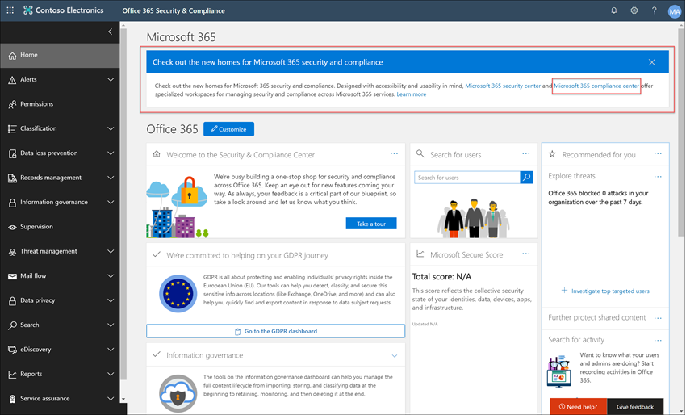

# 案例研究-Contoso 會快速設定適用于 Microsoft 小組、Exchange 及 Yammer 通訊的冒犯性語言原則

Microsoft 365 中的通訊法規遵從性，可協助您在組織中偵測、捕獲和處理不適當的郵件，以將通訊風險降至最低。 預先定義和自訂原則可讓您掃描內部及外部通訊的原則符合，以供指定的檢閱者檢查。 檢閱者可以調查組織中已掃描的電子郵件、Microsoft 團隊、Yammer 或協力廠商通訊，並採取適當的修正動作，以確保它們符合您組織的郵件標準。

Contoso Corporation 是一種虛構的組織，需要快速設定用來監視冒犯性語言的原則。 他們一直使用 Microsoft 365，主要是針對使用者的使用者提供電子郵件、Microsoft 小組和 Yammer 支援，但有新的需求可強制實施公司原則，避免工作場所騷擾。 Contoso IT 系統管理員和合規性專家對使用 Microsoft 365 的基本概念有基本的瞭解，而且正在尋找如何快速開始使用通訊相容性的端對端指導方針。

此案例研究將涵蓋快速設定通訊相容性原則，以監視冒犯性語言的通訊的基本概念。 本指南包含下列專案：

- 步驟 1-規劃通訊合規性
- 步驟 2-存取 Microsoft 365 中的通訊法規遵從性
- 步驟 3-設定必要條件及建立通訊合規性原則
- 步驟 4-調查和修正警示

## 步驟1：規劃通訊規範

Contoso IT 系統管理員和合規性專家會參加線上網路研討會365中有關法規遵從性解決方案的相關資訊，決定通訊法規遵從性原則可協助他們符合減少工作地點騷擾的更新公司原則需求。 共同運作，他們已開發出一種可建立及啟用通訊相容性原則的計畫，它會針對 Microsoft 小組、Yammer 中的私人郵件和社區交談，以及在 Exchange Online 中傳送的電子郵件訊息，監控冒犯性語言。 其計畫包含識別：

- 需要存取通訊規範功能的 IT 管理員。
- 需要建立及管理通訊原則的規範專家。
- 其他部門的合規性專家和其他同事 (人力資源、法律等 ) ，需要調查和修正通訊相容性警示。
- 將會在通訊相容性冒犯性語言原則範圍內的使用者。

### 授權

第一步是確認 Contoso 的 Microsoft 365 授權包含對通訊規範解決方案的支援。 若要存取和使用通訊法規遵從性，Contoso IT 管理員必須確認 Contoso 是否具備下列其中一項：

- Microsoft 365 E5 訂閱 (付費或試用版本) 
- Microsoft 365 E3 訂閱 + Microsoft 365 E5 合規性附加元件
- Microsoft 365 E3 訂閱 + Microsoft 365 E5 「內幕人員風險管理附加元件」
- Microsoft 365 A5 訂閱 (付費或試用版本) 
- Microsoft 365 A3 訂閱 + Microsoft 365 A5 合規性附加元件
- Microsoft 365 A3 訂閱 + Microsoft 365 A5 內幕人士風險管理附加元件
- Microsoft 365 G5 訂閱 (付費或試用版本) 
- Microsoft 365 G5 訂閱 + Microsoft 365 G5 合規性附加元件
- Microsoft 365 G5 訂閱 + Microsoft 365 G5 有問必答風險管理附加元件
- Office 365 企業版 E5 訂閱 (付費或試用版本) 
- Office 365 企業版 E3 訂閱 + Office 365 Advanced 合規性附加元件 (已無法再供新訂閱使用，請參閱記事) 

他們也必須確認已包含在通訊合規性原則中的使用者，必須已獲指派上述其中一個授權。

>[!IMPORTANT]
>Office 365 Advanced 合規性不再銷售為獨立訂閱。 當目前的訂閱到期時，客戶應轉換至上述其中一個訂閱，其中包含相同或其他的符合性功能。

Contoso IT 管理員請採取下列步驟，確認 Contoso 的授權支援：

1. IT 管理員登入 **microsoft 365 系統管理中心** [ (https://admin.microsoft.com)](https://admin.microsoft.com)並流覽至 **microsoft 365 系統管理中心**  >  **計費**  >  **授權**。

2. 在這裡，他們會確認他們有其中一個 [授權選項](communication-compliance-configure.md#subscriptions-and-licensing) ，其中包含對通訊相容性的支援。

### 通訊相容性的許可權

有五個角色群組可用來設定管理通訊符合性功能的許可權。 若要在 Microsoft 365 規範中心中以功能表選項的方式提供 **通訊相容性** ，並繼續進行這些設定步驟，Contoso 系統管理員會被指派 *通訊合規性* 系統管理員角色。

Contoso 決定使用 *通訊合規性* 角色群組將所有通訊合規性管理員、分析員、調查人員和檢視器指派給群組。 這可讓 Contoso 快速快速開始，並最適合其相容性管理需求。

|**角色**|**角色權限**|
|:-----|:-----|
| **通訊相容性** | 使用此角色群組來管理單一群組中組織的通訊相容性。 新增指派管理員、分析員、調查人員和檢視器的所有使用者帳戶，您可以在單一群組中設定通訊合規性許可權。 此角色群組包含所有通訊符合性許可權角色。 這項設定是快速開始使用通訊相容性的最簡單方法，而且很適合不需要個別使用者群組定義個別許可權的組織。 |
| **通訊合規性管理** | 使用此角色群組開始設定通訊相容性和更新後，以將通訊合規性管理員隔離成定義的群組。 指派給此角色群組的使用者，可以建立、讀取、更新和刪除通訊符合性原則、全域設定和角色群組指派。 指派給此角色群組的使用者無法查看郵件警示。 |
| **通訊法規遵從性分析師** | 使用此群組可將許可權指派給將充當通訊相容性分析員的使用者。 指派給此角色群組的使用者可以查看其被指派為檢閱者的原則、查看郵件中繼資料 (非郵件內容) 、升級至其他檢閱者，或傳送通知給使用者。 分析員無法解析待處理的警示。 |
| **通訊合規性調查員** | 使用此群組可將許可權指派給將充當通訊合規性調查人員的使用者。 指派給此角色群組的使用者可以查看郵件中繼資料和內容、升級至其他檢閱者、升級至高級 eDiscovery 案例、將通知傳送給使用者，以及解決警示。 |
| **通訊規範檢視器** | 使用此群組可將管理通訊報告的許可權指派給使用者。 指派給此角色群組的使用者，可以存取通訊合規性首頁上的所有報告元件，並可以查看所有的通訊符合性報告。 |

1. Contoso IT 系統管理員可以使用全域管理員帳戶的認證來登入 **Office 365 Security & 合規性中心** 許可權] [ (https://protection.office.com/permissions)](https://protection.office.com/permissions)頁面，並選取在 Microsoft 365 中查看及管理角色的連結。
2. 在 **安全性 & 規範中心** 內，他們會移至 **許可權** ，並選取在 Office 365 中查看及管理角色的連結。
3. 管理員選取 *通訊合規性* 角色群組，然後選取 [ **編輯角色群組**]。
4. 管理員從左功能窗格中，選取 **[選擇成員** ]，然後選取 [ **編輯**]。
5. 他們會選取 [ **新增** ]，然後選取所有將會管理通訊相容性、調查和審閱警示的 Contoso 使用者核取方塊。
6. 管理員選取 [ **新增**]，然後選取 [ **完成**]。
7. 他們會選取 [ **儲存** ]，將 Contoso 使用者新增至角色群組。 請選取 [ **關閉** ] 以完成步驟。

## 步驟2：存取 Microsoft 365 中的通訊法規遵從性

設定通訊相容性的許可權之後，指派給通訊合規性角色群組的 Contoso IT 系統管理員和合規性專家便可以存取 Microsoft 365 中的通訊相容性解決方案。 Contoso IT 系統管理員和合規性專家有數種方式可以存取通訊相容性，並開始建立新的原則：

- 直接從通訊相容性解決方案開始
- 從 Microsoft 365 規範中心開始
- 從 Microsoft 365 方案目錄開始
- 從 Microsoft 365 系統管理中心開始

### 直接從通訊相容性解決方案開始

存取方案最快的方式，就是直接登入 **通訊合規性** (<https://compliance.microsoft.com/supervisoryreview>) 解決方案。 使用此連結，Contoso IT 管理員和合規性專家將會被導向至通訊相容性一覽表儀表板，您可以在其中快速查看警示的狀態，並從預先定義的範本中建立新的原則。

### 從 Microsoft 365 規範中心開始

Contoso IT 系統管理員和合規性專家存取通訊合規性解決方案的另一種簡單方法，就是直接登入 **Microsoft 365 規範中心** [ (https://compliance.microsoft.com)](https://compliance.microsoft.com)。 登入之後，使用者只需選取 [ **顯示所有** 的控制項] 即可顯示所有的相容性解決方案，然後選取要開始的 **通訊相容性** 解決方案。

### 從 Microsoft 365 方案目錄開始

Contoso IT 系統管理員和合規性專家也可以選擇 Microsoft 365 方案目錄，以存取通訊相容性解決方案。 在 **Microsoft 365 規範中心** 的左側導覽中，選取 [**方案**] 區段中的 [**目錄**] 區段，即可開啟列出所有 Microsoft 365 相容性解決方案的方案目錄。 向下滾動至「 **內幕人員風險管理** 」區段，Contoso IT 系統管理員可以選取要開始的通訊相容性。 Contoso IT 管理員也會決定使用「顯示在導覽」控制項中，將通訊相容性解決方案固定至左功能窗格，以在使用者登入時更快速地進行存取。

### 從 Microsoft 365 系統管理中心開始

若要在從 microsoft 365 系統管理中心開始時存取通訊相容性，Contoso IT 系統管理員和合規性專家會登入 microsoft 365 admin center [ https://admin.microsoft.com) (](https://admin.microsoft.com)並流覽至 **microsoft 365 系統管理中心**  >  **規範**。

此巨集指令會開啟 **Office 365 安全性與合規性中心**，而且必須選取頁面頂端的橫幅中所提供的 **Microsoft 365 規範中心** 連結。

在 **Microsoft 365 規範中心** 內，Contoso IT 系統管理員會選取 [ **全部顯示** ]，以顯示完整的規範解決方案清單。

選取 [ **全部顯示**] 之後，Contoso IT 管理員可以存取通訊規範解決方案。

## 步驟3：設定必要條件及建立通訊相容性原則

若要開始使用通訊相容性原則，Contoso IT 管理員必須先設定許多必要條件，再設定用來監視冒犯性語言的新原則。 完成這些必要條件之後，Contoso IT 管理員和合規性專業人員可以設定新的原則和合規性專業人員，以開始調查並修正任何產生的警示。

### 啟用 Microsoft 365 中的審計

通訊合規性需要「審核記錄檔」顯示提醒，並追蹤檢閱者採取的修復動作。 「審核記錄檔」是與定義之組織原則相關聯的所有活動摘要，或任何一種通訊合規性原則的變更。

Contoso IT 系統管理員會檢查並完成 [逐步指示](turn-audit-log-search-on-or-off.md) 來開啟審計。 在開啟審核後，會顯示一則訊息，指出已準備好審核記錄，而且在準備完成後，可以在數小時內執行搜尋。 Contoso IT 管理員只需執行這項動作一次。

### 設定原生模式的 Yammer 租使用者

通訊法規遵從性要求組織的 Yammer 租使用者處於原生模式，以監視私人郵件和公用社區交談中的冒犯性語言。

Contoso IT 系統管理員請確定他們查看 [microsoft 365 文章中 Yammer 原生模式概述](/yammer/configure-your-yammer-network/overview-native-mode) 中的資訊，並遵循執行遷移工具的步驟，在 [ [設定您的 Yammer 網路為 Microsoft 365 文章的原生模式]](/yammer/configure-your-yammer-network/native-mode) 中執行遷移工具。

### 為範圍內使用者設定群組

Contoso 合規性專家想要將所有使用者新增至會監控冒犯性語言的通訊原則。 他們可以決定個別將每個使用者帳戶新增至原則，但他們決定使用此原則使用者的 **所有使用者** 通訊群組，都能輕鬆且節省時間。

他們必須建立新的群組，以包含所有 Contoso 使用者，讓他們採取下列步驟：

1. Contoso it 系統管理員會登入 **microsoft 365 系統管理中心** [ https://admin.microsoft.com) (](https://admin.microsoft.com)並流覽至 **microsoft 365 admin center**  >  **群組**  >  **群組**。
2. 他們會選取 [ **新增群組** ]，並完成嚮導，以建立新的 *Microsoft 365 群組* 或 *通訊群組*。

    

3. 在建立新群組之後，必須將所有 Contoso 使用者新增至新群組。 他們會開啟 **exchange 系統管理中心** [ (https://outlook.office365.com/ecp)](https://outlook.office365.com/ecp) ，並流覽至 **Exchange 系統管理中心**[收件者]  >    >  **群組**。 Contoso IT 管理員會選取 [成員資格] 區域以及他們建立的新 [ *所有員工* ] 群組，然後選取 [ **編輯** ] 控制項，將所有 Contoso 使用者新增至嚮導中的新群組。

    

### 建立用來監視冒犯性語言的原則

在完成所有必要條件之後，Contoso 的 IT 管理員和規範專家便可設定通訊相容性原則，以監視冒犯性語言。 設定此原則是使用新的冒犯性語言原則範本，這是一種簡單且快速的功能。

1. Contoso IT 管理員和合規性專家登入 **Microsoft 365 規範中心** ，然後從左功能窗格中選取 [ **通訊規範** ]。 此巨集指令會開啟包含通訊相容性原則範本之快速連結的 **概述** 儀表板。 他們選擇範本的 [**開始** 使用]，**以選擇用於冒犯性語言** 範本的監視器。

    

2. 在 [原則範本] 嚮導上，Contoso IT 管理員和合規性專家可共同完成三個必要的欄位： **原則名稱**、 **要監督的使用者或群組**，以及 **檢閱者**。
3. 因為原則嚮導已建議原則的名稱，IT 系統管理員和合規性專家決定保留建議的名稱，並將重點放在其餘的欄位上。 他們會選取 [ *所有使用者* ] 群組中的 [ **要監督的使用者或群組** ] 欄位，並選取應調查和修正「 **檢閱者** 」欄位之原則警示的規範專家。 設定原則及開始收集警示資訊的最後一個步驟，是選取 [ **建立原則**]。

    

## 步驟4：調查和修正警示

現在，您已設定用於為冒犯性語言監控的通訊相容性原則，因此 Contoso 合規性專家的下一步是調查並修正原則所產生的任何警示。 原則需要24小時的時間，才能完全處理所有通訊來源通道中的通訊，以及 **警示儀表板** 中顯示的警示。

提醒產生之後，Contoso 合規性專家將遵循 [工作流程指示](communication-compliance-investigate-remediate.md) ，調查並修正冒犯性語言的問題。