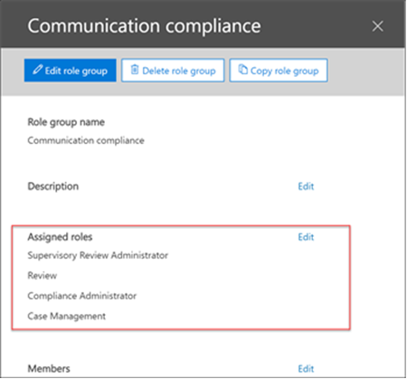

# 設定 Microsoft 365 中的通訊合規性

>[!IMPORTANT]
>本主題適用于設定 Microsoft 365 訂閱中的通訊相容性。 如果您想要為 Office 365 訂閱設定監察原則，請參閱[設定 office 365 的監管](supervision-policies.md)。

使用通訊相容性原則來捕獲員工透過內部或外部檢閱者進行檢查的通訊。 如需通訊相容性原則如何協助您監視組織中的通訊的詳細資訊，請參閱[Microsoft 365 中的通訊相容性原則](communication-compliance.md)。 如果您想要查看 Contoso 如何快速設定通訊相容性原則，以監視 Microsoft 小組和 Exchange Online 通訊中的冒犯性語言，請參閱此[案例研究](communication-compliance-case-study.md)。

## 開始之前

在您開始進行通訊相容性之前，您應該先確認您的 Microsoft 365 訂閱。 通訊相容性原則中所含的使用者必須具備 Microsoft 365 E5 相容性授權、具有高級合規性附加元件的 Office 365 企業版 E3 授權，或是包含在 Office 365 企業版 E5 訂閱中，或包含在 Microsoft365 E5 訂閱。

如果您沒有 Microsoft 365 企業版 E5 方案，且想要試用測試人員風險管理，您可以[將 Microsoft 365 新增](https://docs.microsoft.com/office365/admin/try-or-buy-microsoft-365)至現有的 Office 365 訂閱，或[註冊 Microsoft 365 企業版 E5 的試用版](https://www.microsoft.com/microsoft-365/enterprise)。
  
完成下列步驟，以在您的 Microsoft 365 組織中設定與使用通訊合規性：

## 步驟1（必要）：啟用通訊相容性的許可權

>[!Important]
>根據預設，全域管理員無法存取通訊規範功能。 在此步驟中所指派的角色是必要的通訊相容性功能才能存取。

若要在 Microsoft 365 規範中心中以功能表選項的方式使用**通訊相容性**，您必須獲指派**主管審查系統管理員**角色。 您必須建立新的角色群組供**主管審查系統管理員**、**案例管理**、**合規性管理員**，以及**審查**角色，以透過原則相符的方式調查和修正郵件。

### 建立新的角色群組

1. 使用 Microsoft 365 組織中的系統管理員帳戶認證登入[https://protection.office.com/permissions](https://protection.office.com/permissions)。

2. 在 Microsoft Office 365 安全性與合規合規性中心，移至 **[權限]**。 選取連結，以在 Office 365 中檢視及管理角色。

3. 選取 **[建立]**。

4. 在 **[名稱]** 欄位中，為新的角色群組取個好記的名稱。 選取 [下一步]****。

5. 選取 **[選擇角色]**，然後選取 **[新增]**。 選取「**主管審查管理員**」、「**案例管理**」、「**合規性管理員**」及「**複查**」的核取方塊，然後選取 [**新增**並**完成**]。 選取 [下一步]****。

    

6. 選取 **[選擇成員]**，然後選取 **[新增]**。 針對要建立原則的所有使用者和群組勾選核取方塊，並使用原則符合項目管理訊息，然後選取 **[新增]** 和 **[完成]**。 選取 **[下一步]**。

7. 選取 **[建立角色群組]** 來完成。

如需角色群組和權限的詳細資訊，請參閱[規範中心的權限](../security/office-365-security/protect-against-threats.md)。

## 步驟2（必要）：啟用 Office 365 審核記錄

通訊合規性需要「審核記錄檔」顯示提醒，並追蹤檢閱者採取的修復動作。 「審核記錄檔」會摘要所有與已定義的組織原則相關聯的活動，或在任何時刻的通訊合規性原則變更時。

如需開啟審核的逐步指示，請參閱[開啟或關閉 Office 365 審核記錄搜尋](turn-audit-log-search-on-or-off.md)。 在您開啟審核後，會顯示一則訊息，指出已準備好審核記錄，而且您可以在準備完成後數小時執行搜尋。 您只需執行這項動作一次。 如需使用審核記錄的詳細資訊，請參閱[搜尋審核記錄](search-the-audit-log-in-security-and-compliance.md)檔。

## 步驟3（選用）：設定通訊相容性群組

 當您建立通訊相容性原則時，您會定義誰會檢查其通訊，以及誰會執行評論。 在原則中，您將使用電子郵件地址來識別個人或人員群組。 若要簡化您的設定，您可以為進行通訊檢查的使用者建立群組，並為審查這些通訊的使用者群組建立群組。 如果您正在使用群組，可能需要數個。 例如，如果您想要監視兩個不同的使用者群組之間的通訊，或是想要指定不會受到監督的群組。

使用下列圖表可協助您設定組織中的通訊遵循原則的群組：

| **原則成員** | **支援的群組** | **不支援的群組** |
|:-----|:-----|:-----|
|監督的使用者   非監督的使用者 | 通訊群組   Office 365 群組 | 動態通訊群組 |
| 檢閱者 | 無 | 通訊群組   動態通訊群組   擁有郵件功能的安全性群組 |
  
當您為監督的使用者選取 Office 365 群組時，該原則會監控共用 Office 365 信箱的內容，以及與群組相關聯的 Microsoft 小組頻道。 當您選取通訊群組清單時，該原則會監控個別的使用者信箱。

如需設定群組的詳細資訊，請參閱：

- [建立並管理通訊群組](https://docs.microsoft.com/Exchange/recipients-in-exchange-online/manage-distribution-groups/manage-distribution-groups)
- [管理啟用郵件功能的安全性群組](https://docs.microsoft.com/Exchange/recipients-in-exchange-online/manage-mail-enabled-security-groups)
- [Office 365 群組的概述](https://docs.microsoft.com/office365/admin/create-groups/office-365-groups?view=o365-worldwide)

## 步驟4（必要）：建立通訊相容性原則
  
1. 使用 Microsoft 365 組織中的系統管理員帳戶認證登入[https://compliance.microsoft.com](https://compliance.microsoft.com)。

2. 在 [Microsoft 365 規範中心] 中，選取 [**通訊符合性**]。
  
3. 選取 [原則] 索引標籤。

4. 選取 [**建立原則**]，以從範本建立及設定新原則，或建立及設定自訂原則。

    如果您選擇原則範本以建立原則，您可以：

    - 確認或更新原則名稱。 建立原則之後，便無法變更原則名稱。
    - 選擇要監督的使用者或群組，包括選擇您想要排除的使用者或群組。
    - 選擇原則的檢閱者。 檢閱者可以是個別的使用者或擁有[郵件功能的安全性群組](https://docs.microsoft.com/Exchange/recipients-in-exchange-online/manage-mail-enabled-security-groups#create-a-mail-enabled-security-group)。 所有檢閱者都必須在 Exchange Online 上主控信箱。 在此新增的檢閱者是在調查和修正工作流程中升級提醒時，可選擇的檢閱者。
    - 選擇 [有限條件] 欄位，通常是要套用至原則的敏感資訊類型或關鍵字字典。

    如果您選擇使用原則嚮導建立自訂原則，您可以：

    - 將原則命名為 [名稱] 和 [描述]。 建立原則之後，便無法變更原則名稱。
    - 選擇要監督的使用者或群組，包括您組織中的所有使用者、特定使用者和群組，或是您想要排除的其他使用者和群組。
    - 選擇原則的檢閱者。 檢閱者可以是個別的使用者或擁有[郵件功能的安全性群組](https://docs.microsoft.com/Exchange/recipients-in-exchange-online/manage-mail-enabled-security-groups#create-a-mail-enabled-security-group)。 所有檢閱者都必須在 Exchange Online 上主控信箱。
    - 選擇要掃描的通訊通道，包括 Exchange、Microsoft 團隊或商務用 Skype。 如果您已在 Microsoft 365 中設定連接器，您也會選擇掃描協力廠商來源。
    - 選擇要監視的通訊方向，包括輸入、輸出或內部通訊。
    - 定義通訊相容性原則[條件](communication-compliance-feature-reference.md#ConditionalSettings)。 您可以選擇 [郵寄地址]、[關鍵字]、[檔案類型] 和 [大小相符] 條件。
    - 選擇是否要包含機密資訊類型。 在這個步驟中，您可以選取預設和自訂的機密資訊類型。 在 [通訊合規性原則] 中，從現有的自訂敏感資訊類型或自訂關鍵字字典中挑選。 如有需要，您可以在執行該嚮導之前建立這些專案。 您也可以從通訊合規性原則嚮導中建立新的敏感資訊類型。
    - 選擇是否要啟用冒犯性語言分類器。 此分類器會偵測到電子郵件內送出或接收到不適當的語言。
    - 定義要複查的通訊百分比。
    - 檢查您的原則選擇並建立原則。

5. 使用 [自訂原則] 嚮導時，選取 [使用範本或**提交**時**建立原則**]。

6. **已建立您**的原則頁面會隨著原則的啟動時間及將捕獲哪些通訊的指導方針來顯示。

## 步驟5（選用）：建立員工通知範本

如果您想要選擇以傳送提醒通知給關聯的員工來回應原則警示，您必須在組織中至少建立一個公告範本。 [！注意事項] [通知範本] 欄位是可編輯的，在傳送為警示修復程式的一部分之前，建議您為每個通訊相容性原則建立自訂的通知範本。

1. 使用 Microsoft 365 組織中的系統管理員帳戶認證登入[https://compliance.microsoft.com](https://compliance.microsoft.com)。

2. 在 Microsoft 365 規範中心內，移至 [**通訊符合性**]。

3. 選取 [**公告範本**] 索引標籤，然後選取 [**建立公告範本**]。

4. 在 [**修改公告範本**] 頁面上，完成下欄欄位：

    - 通知範本名稱（必要）
    - 寄件者（必要）
    - Cc 和 Bcc （選用）
    - Subject （必要）
    - 郵件主體（必要）

5. 選取 [**儲存**] 以建立及儲存 [公告] 範本。

## 步驟6（選用）：測試通訊合規性原則

在您建立通訊相容性原則之後，建議您加以測試，以確定原則已正確地強制執行您所定義的條件。 您也可能想要[測試您的資料遺失防護（DLP）原則（](create-test-tune-dlp-policy.md)如果通訊相容性原則包括敏感資訊類型）。 請務必提供您的原則啟動時間，以便您想要測試的通訊得以捕獲。

請遵循下列步驟來測試您的通訊合規性原則：

1. 在您要測試之原則中所定義的監督使用者登入時，開啟電子郵件客戶程式或 Microsoft 團隊。
2. 傳送電子郵件或 Microsoft 小組聊天，其符合您在通訊合規性原則中所定義的準則。 此測試可以是關鍵字、附件大小、網域等等。確定您判斷原則中設定的設定條件設定過於嚴格或太 lenient。

    > [!NOTE]
    > 在原則中，所有來源通道中的通訊最多可能需要24小時才能完整處理。

3. 以通訊合規性原則中指定的檢閱者身分登入 Microsoft 365。 流覽至 [**通訊相容性** > **警示**]，以查看原則的警示。

4. 使用修正控制措施修正警示，並確認已正確解決警示。
