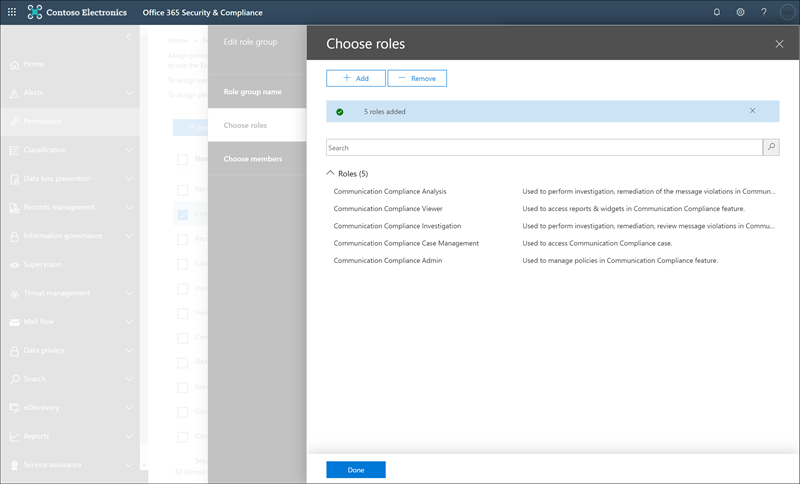

# 開始使用通訊合規性Get started with communication compliance

使用通訊相容性原則，識別內部或外部檢閱者進行檢查的使用者通訊。Use communication compliance policies to identify user communications for examination by internal or external reviewers. 如需通訊相容性原則如何協助您監視組織中的通訊的詳細資訊，請參閱[Microsoft 365 中的通訊相容性原則](communication-compliance.md)。For more information about how communication compliance policies can help you monitor communications in your organization, see [communication compliance policies in Microsoft 365](communication-compliance.md). 如果您想要查看 Contoso 如何快速設定通訊相容性原則，以監視 Microsoft 小組、Exchange Online 和 Yammer 通訊中的冒犯性語言，請參閱此[案例研究](communication-compliance-case-study.md)。If you'd like to review how Contoso quickly configured a communication compliance policy to monitor for offensive language in Microsoft Teams, Exchange Online, and Yammer communications, check out this [case study](communication-compliance-case-study.md).

## 開始之前Before you begin

在您開始進行通訊相容性之前，您應該先確認您的[Microsoft 365 訂閱](https://www.microsoft.com/microsoft-365/compare-all-microsoft-365-plans)和任何附加元件。Before you get started with communication compliance, you should confirm your [Microsoft 365 subscription](https://www.microsoft.com/microsoft-365/compare-all-microsoft-365-plans) and any add-ons. 若要存取及使用通訊相容性，您的組織必須具備下列其中一項訂閱或附加元件：To access and use communication compliance, your organization must have one of the following subscriptions or add-ons:

- Microsoft 365 E5 訂閱 (付費或試用版本) Microsoft 365 E5 subscription (paid or trial version)
- Microsoft 365 E3 訂閱 + Microsoft 365 E5 合規性附加元件Microsoft 365 E3 subscription + the Microsoft 365 E5 Compliance add-on
- Microsoft 365 E3 訂閱 + Microsoft 365 E5 「內幕人員風險管理附加元件」Microsoft 365 E3 subscription + the Microsoft 365 E5 Insider Risk Management add-on
- Microsoft 365 A5 訂閱 (付費或試用版本) Microsoft 365 A5 subscription (paid or trial version)
- Microsoft 365 A3 訂閱 + Microsoft 365 A5 合規性附加元件Microsoft 365 A3 subscription + the Microsoft 365 A5 Compliance add-on
- Microsoft 365 A3 訂閱 + Microsoft 365 A5 內幕人士風險管理附加元件Microsoft 365 A3 subscription + the Microsoft 365 A5 Insider Risk Management add-on
- Microsoft 365 G5 訂閱 (付費或試用版本) Microsoft 365 G5 subscription (paid or trial version)
- Microsoft 365 G5 訂閱 + Microsoft 365 G5 合規性附加元件Microsoft 365 G5 subscription + the Microsoft 365 G5 Compliance add-on
- Microsoft 365 G5 訂閱 + Microsoft 365 G5 有問必答風險管理附加元件Microsoft 365 G5 subscription + the Microsoft 365 G5 Insider Risk Management add-on
- Office 365 企業版 E5 訂閱 (付費或試用版本) Office 365 Enterprise E5 subscription (paid or trial version)
- Office 365 企業版 E3 訂閱 + Office 365 Advanced 合規性附加元件 (已無法再供新訂閱使用，請參閱記事) Office 365 Enterprise E3 subscription + the Office 365 Advanced Compliance add-on (no longer available for new subscriptions, see note)

必須將上述其中一個授權指派給通訊符合性原則中所含的使用者。Users included in communication compliance policies must be assigned one of the licenses above.

>[!IMPORTANT]
>Office 365 Advanced 合規性不再銷售為獨立訂閱。Office 365 Advanced Compliance is no longer sold as a standalone subscription. 當目前的訂閱到期時，客戶應轉換至上述其中一個訂閱，其中包含相同或其他的符合性功能。When current subscriptions expire, customers should transition to one of the subscriptions above, which contain the same or additional compliance features.

如果您沒有現有的 Office 365 企業版 E5 計畫，而且想要嘗試擁有者風險管理，您可以[將 Microsoft 365 新增](https://docs.microsoft.com/office365/admin/try-or-buy-microsoft-365)至現有的訂閱，或註冊 Office 365 Enterprise E5 的[試用版](https://www.microsoft.com/microsoft-365/enterprise)。If you don't have an existing Office 365 Enterprise E5 plan and want to try insider risk management, you can [add Microsoft 365](https://docs.microsoft.com/office365/admin/try-or-buy-microsoft-365) to your existing subscription or [sign up for a trial](https://www.microsoft.com/microsoft-365/enterprise) of Office 365 Enterprise E5.

## 步驟 1 (必要) ：啟用通訊相容性的許可權Step 1 (required): Enable permissions for communication compliance

>[!Important]
>根據預設，全域管理員無法存取通訊規範功能。By default, Global Administrators do not have access to communication compliance features. 在此步驟中所指派的角色是必要的通訊相容性功能才能存取。The roles assigned in this step are required before any communication compliance features will be accessible.

有五個角色可用於設定管理通訊符合性功能的許可權。There are five roles used to configure permissions to manage communication compliance features. 若要在 Microsoft 365 規範中心中以功能表選項的方式提供**通訊相容性**，並繼續進行這些設定步驟，您必須獲指派*通訊合規性系統管理員*角色。To make **Communication compliance** available as a menu option in Microsoft 365 compliance center and to continue with these configuration steps, you must be assigned the *Communication Compliance Admin* role.

視您想要管理通訊原則及警示的方式而定，您將需要為系統管理員、檢閱者和調查人員建立一個或多個新的角色群組。Depending on how you wish to manage communication policies and alerts, you'll need to create one or more new role groups for administrators, reviewers, and investigators. 您可以選擇將使用者指派給特定角色群組，以管理不同通訊規範功能的範圍。You have the option to assign users to specific role groups to manage different areas of communication compliance features. 或者，您也可以決定建立一個角色群組，並將所有通訊規範角色指派給群組。Or you may decide to create one role group and assign all the communication compliance roles to the group. 建立單一角色群組或多個角色群組，以最大程度符合您的規範管理需求。Create a single role group or multiple role groups to best fit your compliance management requirements.

設定通訊合規性角色群組時，請從下列角色選項中選擇：Choose from these role options when configuring your communication compliance role groups:

|**角色****Role**|**角色權限****Role permissions**|
|:-----|:-----|
| **通訊合規性管理****Communication Compliance Admin** | 指派此角色的使用者可以建立、讀取、更新和刪除通訊符合性原則、全域設定和角色群組指派。Users assigned this role can create, read, update, and delete communication compliance policies, global settings, and role group assignments. 指派此角色的使用者無法查看郵件警示。Users assigned this role cannot view message alerts. |
| **通訊相容性分析****Communication Compliance Analysis** | 指派此角色的使用者可以查看指派為檢閱者的原則、查看郵件中繼資料 (非郵件內容) 、升級至其他檢閱者，或傳送通知給使用者。Users assigned this role can view policies where they are assigned as Reviewers, view message metadata (not message content), escalate to additional reviewers, or send notifications to users. 分析員無法解析待處理的警示。Analysts cannot resolve pending alerts. |
| **通訊相容性調查****Communication Compliance Investigation** | 指派此角色的使用者可以查看郵件中繼資料和內容、升級至其他檢閱者、升級至高級 eDiscovery 案例、將通知傳送給使用者，以及解決警示。Users assigned this role can view message metadata and content, escalate to additional reviewers, escalate to an Advanced eDiscovery case, send notifications to users, and resolve the alert. |
| **通訊規範檢視器****Communication Compliance Viewer** | 指派此角色的使用者可以存取通訊合規性首頁上的所有報告元件，並可以查看所有的通訊符合性報告。Users assigned this role can access all reporting widgets on the communication compliance home page and can view all communication compliance reports. |
| **通訊規範案例管理****Communication Compliance Case Management** | 指派此角色的使用者可以管理案例並對提醒採取行動。Users assigned this role can manage cases and act on alerts. 為管理員、分析員和調查人員建立自訂角色群組時，需要此角色。This role is required for when creating custom role groups for administrators, analysts, and investigators. 自訂群組的檢視器不需要指派此角色。Custom groups for viewers do not need this role assigned. |

### 選項1：建立具有所有通訊相容性角色的新角色群組Option 1: Create a new role group with all communication compliance roles

1. 使用 Microsoft 365 組織中的系統管理員帳戶認證登入[https://protection.office.com/permissions](https://protection.office.com/permissions)。Sign into [https://protection.office.com/permissions](https://protection.office.com/permissions) using credentials for an admin account in your Microsoft 365 organization.

2. 在安全性與 &amp; 合規性中心，移至 [**許可權**]。In the Security &amp; Compliance Center, go to **Permissions**. 選取連結，以在 Office 365 中檢視及管理角色。Select the link to view and manage roles in Office 365.

3. 選取 **[建立]**。Select **Create**.

4. 在 **[名稱]** 欄位中，為新的角色群組取個好記的名稱。In the **Name** field, give the new role group a friendly name. 選取 **[下一步]**。Select **Next**.

5. 選取 **[選擇角色]**，然後選取 **[新增]**。Select **Choose roles** and then select **Add**. 選取下列角色的核取方塊：Select the checkboxes for the following roles:

    - 通訊合規性管理Communication Compliance Admin
    - 通訊相容性分析Communication Compliance Analysis
    - 通訊相容性調查Communication Compliance Investigation
    - 通訊規範檢視器Communication Compliance Viewer
    - 通訊規範案例管理Communication Compliance Case Management

    

6. 選取 [**新增**並**完成**]，然後選取 **[下一步]** 繼續。select **Add** and **Done**, then select **Next** to continue.

7. 選取 **[選擇成員]**，然後選取 **[新增]**。Select **Choose members** and then select **Add**. 針對要建立原則的所有使用者和群組勾選核取方塊，並使用原則符合項目管理訊息，然後選取 **[新增]** 和 **[完成]**。Select the checkbox for all the users and groups you want create policies and manage messages with policy matches, then select **Add** and **Done**. 選取 **[下一步]**。Select **Next**.

8. 選取 **[建立角色群組]** 來完成。Select **Create role group** to finish.

### 選項2：使用不同的通訊相容性角色建立新的角色群組Option 2: Create new role groups with different communication compliance roles

建立多個角色群組，以分割組織中不同使用者之間的通訊一致性存取和責任。Create multiple role groups to segment communication compliance access and responsibilities among different users in your organization. 針對每個新的角色群組，您會指派不同的通訊相容性角色。For each new role group, you'll assign different communication compliance roles.

1. 使用 Microsoft 365 組織中的系統管理員帳戶認證登入[https://protection.office.com/permissions](https://protection.office.com/permissions)。Sign into [https://protection.office.com/permissions](https://protection.office.com/permissions) using credentials for an admin account in your Microsoft 365 organization.

2. 在安全性與 &amp; 合規性中心，移至 [**許可權**]。In the Security &amp; Compliance Center, go to **Permissions**. 選取連結，以在 Office 365 中檢視及管理角色。Select the link to view and manage roles in Office 365.

3. 選取 **[建立]**。Select **Create**.

4. 在 **[名稱]** 欄位中，為新的角色群組取個好記的名稱。In the **Name** field, give the new role group a friendly name. 選取 **[下一步]**。Select **Next**.

5. 選取 **[選擇角色]**，然後選取 **[新增]**。Select **Choose roles** and then select **Add**. 選取您要指派給此群組之通訊相容性角色的核取方塊。Select the checkbox for the communication compliance roles you want to assign to this group. 例如，如果此角色群組是針對您組織中的規範分析師，您可以選取*通訊符合性分析*和*通訊符合性案例管理*角色。For example, if this role group is for compliance analysts in your organization, you would select the *Communication Compliance Analysis* and *Communication Compliance Case Management* roles. 如果此角色群組是針對法規遵從性調查人員，您可以選取*通訊符合性調查*和*通訊相容性案例管理*角色。If this role group is for compliance investigators, you would select the *Communication Compliance Investigation* and *Communication Compliance Case Management* roles.

    

6. 選取 [**新增**並**完成**]，然後選取 **[下一步]** 繼續。Select **Add** and **Done**, then select **Next** to continue.

7. 選取 **[選擇成員]**，然後選取 **[新增]**。Select **Choose members** and then select **Add**. 針對要建立原則的所有使用者和群組勾選核取方塊，並使用原則符合項目管理訊息，然後選取 **[新增]** 和 **[完成]**。Select the checkbox for all the users and groups you want create policies and manage messages with policy matches, then select **Add** and **Done**. 選取 **[下一步]**。Select **Next**.

8. 選取 **[建立角色群組]** 來完成。Select **Create role group** to finish.

9. 視需要建立其他通訊符合性角色群組。Create additional communication compliance role groups as needed.

如需角色群組和權限的詳細資訊，請參閱[規範中心的權限](../security/office-365-security/protect-against-threats.md)。For more information about role groups and permissions, see [Permissions in the Compliance Center](../security/office-365-security/protect-against-threats.md).

## 步驟 2 (必要) ：啟用審核記錄檔Step 2 (required): Enable the audit log

通訊合規性需要「審核記錄檔」顯示提醒，並追蹤檢閱者採取的修復動作。Communication compliance requires audit logs to show alerts and track remediation actions taken by reviewers. 「審核記錄檔」會摘要所有與已定義的組織原則相關聯的活動，或在任何時刻的通訊合規性原則變更時。The audit logs are a summary of all activities associated with a defined organizational policy or anytime a communication compliance policy changes.

如需開啟審計的逐步指示，請參閱[開啟或關閉審計記錄搜尋](turn-audit-log-search-on-or-off.md)。For step-by-step instructions to turn on auditing, see [Turn audit log search on or off](turn-audit-log-search-on-or-off.md). 在您開啟審核後，會顯示一則訊息，指出已準備好審核記錄，而且您可以在準備完成後數小時執行搜尋。After you turn on auditing, a message is displayed that says the audit log is being prepared and that you can run a search in a couple of hours after the preparation is complete. 您只需執行這項動作一次。You only have to do this action once. 如需使用審核記錄的詳細資訊，請參閱[搜尋審核記錄](search-the-audit-log-in-security-and-compliance.md)檔。For more information about the using the audit log, see [Search the audit log](search-the-audit-log-in-security-and-compliance.md).

## 步驟 3 (選用) ：設定通訊相容性群組Step 3 (optional): Set up groups for communication compliance

 當您建立通訊相容性原則時，您會定義誰會檢查其通訊，以及誰會執行評論。When you create a communication compliance policy, you define who has their communications reviewed and who performs reviews. 在原則中，您將使用電子郵件地址來識別個人或人員群組。In the policy, you'll use email addresses to identify individuals or groups of people. 若要簡化您的設定，您可以為進行通訊檢查的使用者建立群組，並為審查這些通訊的使用者群組建立群組。To simplify your setup, you can create groups for people who have their communication reviewed and groups for people who review those communications. 如果您正在使用群組，可能需要數個。If you're using groups, you may need several. 例如，如果您想要監視兩個不同的使用者群組之間的通訊，或是想要指定不會受到監督的群組。For example, if you want to monitor communications between two distinct groups of people or if you want to specify a group that isn't going to be supervised.

使用下列圖表可協助您設定組織中的通訊遵循原則的群組：Use the following chart to help you configure groups in your organization for communication compliance policies:

| **原則成員****Policy Member** | **支援的群組****Supported Groups** | **不支援的群組****Unsupported Groups** |
|:-----|:-----|:-----|
|監督的使用者Supervised users   非監督的使用者Non-supervised users | 通訊群組Distribution groups   Microsoft 365 群組Microsoft 365 Groups | 動態通訊群組Dynamic distribution groups |
| 檢閱者Reviewers | 無None | 通訊群組Distribution groups   動態通訊群組Dynamic distribution groups   擁有郵件功能的安全性群組Mail-enabled security groups |
  
當您指派原則中的通訊群組時，該原則會監控通訊群組中每個使用者的所有電子郵件。When you assign a distribution group in the policy, the policy monitors all emails from each user in distribution group. 當您在原則中指派 Microsoft 365 群組時，該原則會監控傳送給該群組的所有電子郵件，而不是每個群組成員所收到的個別電子郵件。When you assign a Microsoft 365 group in the policy, the policy monitors all emails sent to that group, not the individual emails received by each group member.

如果您是具有 Exchange 內部部署或外部電子郵件提供者的組織，且您想要為使用者監視 Microsoft 團隊聊天，您必須為使用內部部署或外部信箱進行監視的使用者建立通訊群組。If you're an organization with an Exchange on-premises deployment or an external email provider and you want to monitor Microsoft Teams chats for your users, you must create a distribution group for the users with on-premises or external mailboxes to monitor. 在上述步驟中，您會將此通訊群組指派為 [原則嚮導] 中的 [授與**群組**] 選擇。Later in these steps, you'll assign this distribution group as the **Supervised users and groups** selection in the policy wizard.

>[!IMPORTANT]
>您必須將 Microsoft 支援檔的要求記錄為可讓您的組織在安全性 & 合規性中心使用圖形使用者介面，針對內部部署使用者搜尋小組聊天資料。You must file a request with Microsoft Support to enable your organization to use the graphical user interface in the Security & Compliance Center to search for Teams chat data for on-premises users. 如需詳細資訊，請參閱針對[內部部署使用者搜尋雲端架構信箱](search-cloud-based-mailboxes-for-on-premises-users.md)。For more information, see [Searching cloud-based mailboxes for on-premises users](search-cloud-based-mailboxes-for-on-premises-users.md).

如需設定群組的詳細資訊，請參閱：For more information about setting up groups, see:

- [建立並管理通訊群組Create and manage distribution groups](https://docs.microsoft.com/Exchange/recipients-in-exchange-online/manage-distribution-groups/manage-distribution-groups)
- [Microsoft 365 群組的概述Overview of Microsoft 365 Groups](https://docs.microsoft.com/office365/admin/create-groups/office-365-groups?view=o365-worldwide)

## 步驟 4 (選用) ：確認 Yammer 租使用者處於原生模式Step 4 (optional): Verify your Yammer tenant is in Native Mode

在原生模式中，所有的 Yammer 使用者都在 Azure Active Directory (AAD) 中，所有群組都是 Office 365 群組，而且所有檔案都儲存在 SharePoint 線上中。In Native Mode, all Yammer users are in Azure Active Directory (AAD), all groups are Office 365 Groups, and all files are stored in SharePoint Online. 您的 Yammer 租使用者必須採用原生模式，以進行通訊相容性原則，以掃描及識別 Yammer 中的私人郵件和社區交談中有風險的交談。Your Yammer tenant must be in Native Mode for communication compliance policies to scan and identify risky conversations in private messages and community conversations in Yammer.

如需在原生模式中設定 Yammer 的詳細資訊，請參閱：For more information about configuring Yammer in Native Mode, see:

- [Microsoft 365 中的 Yammer 原生模式概述Overview of Yammer Native Mode in Microsoft 365](https://docs.microsoft.com/yammer/configure-your-yammer-network/overview-native-mode)
- [針對 Microsoft 365 設定您的 Yammer 網路使用原生模式Configure your Yammer network for Native Mode for Microsoft 365](https://docs.microsoft.com/yammer/configure-your-yammer-network/native-mode)

## 步驟 5 (必要) ：建立通訊相容性原則Step 5 (required): Create a communication compliance policy
  
>[!Important]
>不支援使用 PowerShell 建立及管理通訊相容性原則。Using PowerShell to create and manage communication compliance policies is not supported. 若要建立及管理這些原則，您必須使用[Microsoft 365 通訊規範解決方案](https://compliance.microsoft.com/supervisoryreview)中的原則管理控制項。To create and manage these policies, you must use the policy management controls in the [Microsoft 365 communication compliance solution](https://compliance.microsoft.com/supervisoryreview).

1. 使用 Microsoft 365 組織中的系統管理員帳戶認證登入[https://compliance.microsoft.com](https://compliance.microsoft.com)。Sign into [https://compliance.microsoft.com](https://compliance.microsoft.com) using credentials for an admin account in your Microsoft 365 organization.

2. 在 [Microsoft 365 規範中心] 中，選取 [**通訊符合性**]。In the Microsoft 365 compliance center, select **Communication compliance**.
  
3. 選取 [原則] 索引標籤。Select the **Policies** tab.

4. 選取 [**建立原則**]，以從範本建立及設定新原則，或建立及設定自訂原則。Select **Create policy** to create and configure a new policy from a template or to create and configure a custom policy.

    如果您選擇原則範本以建立原則，您可以：If you choose a policy template to create a policy, you will:

    - 確認或更新原則名稱。Confirm or update the policy name. 建立原則之後，便無法變更原則名稱。Policy names cannot be changed once the policy is created.
    - 選擇要監督的使用者或群組，包括選擇您想要排除的使用者或群組。Choose the users or groups to supervise, including choosing users or groups you'd like to exclude.
    - 選擇原則的檢閱者。Choose the reviewers for the policy. 「檢閱者」是個別的使用者，而且所有檢閱者都必須在 Exchange Online 上主控信箱。Reviewers are individual users and all reviewers must have mailboxes hosted on Exchange Online. 在此新增的檢閱者是在調查和修正工作流程中升級提醒時，可選擇的檢閱者。Reviewers added here are the reviewers that you can choose from when escalating an alert in the investigation and remediation workflow. 當檢閱者新增至原則時，會自動收到一封電子郵件，通知他們對原則的指派，並提供審閱程式相關資訊的連結。When reviewers are added to a policy, they automatically receive an email message that notifies them of the assignment to the policy and provides links to information about the review process.
    - 選擇 [有限條件] 欄位，通常是要套用至原則的敏感資訊類型或關鍵字字典。Choose a limited condition field, usually a sensitive info type or keyword dictionary to apply to the policy.

    如果您選擇使用原則嚮導建立自訂原則，您可以：If you choose to use the policy wizard to create a custom policy, you will:

    - 將原則命名為 [名稱] 和 [描述]。Give the policy a name and description. 建立原則之後，便無法變更原則名稱。Policy names can't be changed once the policy is created.
    - 選擇要監督的使用者或群組，包括您組織中的所有使用者、特定使用者和群組，或是您想要排除的其他使用者和群組。Choose the users or groups to supervise, including all users in your organization, specific users and groups, or other users and groups you'd like to exclude.
    - 選擇原則的檢閱者。Choose the reviewers for the policy. 「檢閱者」是個別的使用者，而且所有檢閱者都必須在 Exchange Online 上主控信箱。Reviewers are individual users and all reviewers must have mailboxes hosted on Exchange Online. 在此新增的檢閱者是在調查和修正工作流程中升級提醒時，可選擇的檢閱者。Reviewers added here are the reviewers that you can choose from when escalating an alert in the investigation and remediation workflow. 當檢閱者新增至原則時，會自動收到一封電子郵件，通知他們對原則的指派，並提供審閱程式相關資訊的連結。When reviewers are added to a policy, they automatically receive an email message that notifies them of the assignment to the policy and provides links to information about the review process.
    - 選擇要掃描的通訊通道，包括 Exchange、Microsoft 團隊、Yammer 或商務用 Skype。Choose the communication channels to scan, including Exchange, Microsoft Teams, Yammer, or Skype for Business. 如果您已在 Microsoft 365 中設定連接器，您也會選擇掃描協力廠商來源。You'll also choose to scan third-party sources if you've configured a connector in Microsoft 365.
    - 選擇要監視的通訊方向，包括輸入、輸出或內部通訊。Choose the communication direction to monitor, including inbound, outbound, or internal communications.
    - 定義通訊相容性原則[條件](communication-compliance-feature-reference.md#ConditionalSettings)。Define the communication compliance policy [conditions](communication-compliance-feature-reference.md#ConditionalSettings). 您可以選擇 [郵寄地址]、[關鍵字]、[檔案類型] 和 [大小相符] 條件。You can choose from message address, keyword, file types, and size match conditions.
    - 選擇是否要包含機密資訊類型。Choose if you'd like to include sensitive information types. 在這個步驟中，您可以選取預設和自訂的機密資訊類型。This step is where you can select default and custom sensitive info types. 在 [通訊合規性原則] 中，從現有的自訂敏感資訊類型或自訂關鍵字字典中挑選。Pick from existing custom sensitive information types or custom keyword dictionaries in the communication compliance policy wizard. 如有需要，您可以在執行該嚮導之前建立這些專案。You can create these items before running the wizard if needed. 您也可以從通訊合規性原則嚮導中建立新的敏感資訊類型。You can also create new sensitive information types from within the communication compliance policy wizard.
    - 選擇是否要啟用分類器。Choose if you'd like to enable classifiers. 分類器可以偵測電子郵件訊息或其他類型的文字內傳送或接收的不適當語言和圖像。Classifiers can detect inappropriate language and images sent or received in the body of email messages or other types of text. 您可以選擇下列內建的分類符：*威脅*、*猥褻*、*目標騷擾*、*成人影像*、 *Racy 影像*和*Gory 影像*。You can choose the following built-in classifiers: *Threat*, *Profanity*, *Targeted harassment*, *Adult images*, *Racy images*, and *Gory images*.

    >[!CAUTION]
    >我們正在淘汰 [粗穢言語]\*\*\*\* 內建分類器，因為這個分類器產生了大量的誤報。We are deprecating the **Offensive Language** built-in classifier because it has been producing a high number of false positives. 請勿使用它，如果您目前使用它，您應該將商務程式移出它。Don't use it and if you are currently using it, you should move your business processes off of it. 我們建議您改用**威脅**、**猥褻**和**目標騷擾**內建的分類符。We recommend using the **Threat**, **Profanity**, and **Targeted harassment** built-in classifiers instead.

    - 定義要複查的通訊百分比。Define the percentage of communications to review.
    - 檢查您的原則選擇並建立原則。Review your policy selections and create the policy.

5. 使用 [自訂原則] 嚮導時，選取 [使用範本或**提交**時**建立原則**]。Select **Create policy** when using the templates or **Submit** when using the custom policy wizard.

6. **已建立您**的原則頁面會隨著原則的啟動時間及將捕獲哪些通訊的指導方針來顯示。The **Your policy was created** page is displayed with guidelines on when policy will be activated and which communications will be captured.

## 步驟 6 (選用) ：建立公告範本及設定使用者匿名Step 6 (optional): Create notice templates and configure user anonymization

如果您想要選擇以傳送提醒通知給關聯的使用者來回應原則警示，您必須在組織中至少建立一個公告範本。If you want to have the option of responding to a policy alert by sending a reminder notice to the associated user, you'll need to create at least one notice template in your organization. [！注意事項] [通知範本] 欄位是可編輯的，在傳送為警示修復程式的一部分之前，建議您為每個通訊相容性原則建立自訂的通知範本。The notice template fields are editable before they're sent as part of the alert remediation process, and creating a customized notice template for each communication compliance policy is recommended.

您也可以選擇在調查原則符合和對郵件採取動作時，啟用顯示之使用者的匿名。You can also choose to enable anonymization for displayed usernames when investigating policy matches and taking action on messages.

1. 使用 Microsoft 365 組織中的系統管理員帳戶認證登入[https://compliance.microsoft.com](https://compliance.microsoft.com)。Sign into [https://compliance.microsoft.com](https://compliance.microsoft.com) using credentials for an admin account in your Microsoft 365 organization.

2. 在 Microsoft 365 規範中心內，移至 [**通訊符合性**]。In the Microsoft 365 compliance center, go to **Communication compliance**.

3. 若要設定匿名的使用者名，請選取 [**隱私權**] 索引標籤。To configure anonymization for usernames, select the **Privacy** tab.

4. 若要啟用匿名，請選取 [**顯示匿名版本的使用者名**]。To enable anonymization, select **Show anonymized versions of usernames**.

5. 選取 **[儲存]**。Select **Save**.

6. 流覽至 [**公告範本**] 索引標籤，然後選取 [**建立公告範本**]。Navigate to the **Notice templates** tab and then select **Create notice template**.

7. 在 [**修改公告範本**] 頁面上，完成下欄欄位：On the **Modify a notice template** page, complete the following fields:

    - 範本名稱 (必要) Template name (required)
    -  (必要的傳送) Send from (required)
    - 抄送和 Bcc (選用) Cc and Bcc (optional)
    - 主體 (必要) Subject (required)
    - 需要郵件內文 () Message body (required)

8. 選取 [**儲存**] 以建立及儲存 [公告] 範本。Select **Save** to create and save the notice template.

## 步驟 7 (選用) ：測試通訊合規性原則Step 7 (optional): Test your communication compliance policy

在您建立通訊相容性原則之後，建議您加以測試，以確定原則已正確地強制執行您所定義的條件。After you create a communication compliance policy, it's a good idea to test it to make sure that the conditions you defined are being properly enforced by the policy. 您也可以在通訊相容性原則包括敏感資訊類型時，[測試您的資料遺失防護 (DLP) 原則](create-test-tune-dlp-policy.md)。You may also want to [test your data loss prevention (DLP) policies](create-test-tune-dlp-policy.md) if your communication compliance policies include sensitive information types. 請務必提供您的原則啟動時間，以便您想要測試的通訊得以捕獲。Make sure you give your policies time to activate so that the communications you want to test are captured.

請遵循下列步驟來測試您的通訊合規性原則：Follow these steps to test your communication compliance policy:

1. 在您要測試之原則中所定義的監督使用者登入時，開啟電子郵件客戶程式、Microsoft 小組或 Yammer。Open an email client, Microsoft Teams, or Yammer while signed in as a supervised user defined in the policy you want to test.
2. 傳送電子郵件、Microsoft 小組聊天或 Yammer 訊息，其符合您在通訊相容性原則中所定義的準則。Send an email, Microsoft Teams chat, or Yammer message that meets the criteria you've defined in the communication compliance policy. 此測試可以是關鍵字、附件大小、網域等等。確定您判斷原則中設定的設定條件設定過於嚴格或太 lenient。This test can be a keyword, attachment size, domain, etc. Make sure you determine if your configured conditional settings in the policy are too restrictive or too lenient.

    > [!NOTE]
    > 在原則中，所有來源通道中的通訊最多可能需要24小時才能完整處理。Communications in all source channels can take up to 24 hours to fully process in a policy.

3. 以通訊合規性原則中指定的檢閱者身分登入 Microsoft 365。Sign in to Microsoft 365 as a reviewer designated in the communication compliance policy. 流覽至 [**通訊相容性**  >  **警示**]，以查看原則的警示。Navigate to **Communication compliance** > **Alerts** to view the alerts for your policies.

4. 使用修正控制措施修正警示，並確認已正確解決警示。Remediate the alert using the remediation controls and verify that the alert is properly resolved.

## 後續步驟Next steps

當您完成這些步驟來建立您的第一個通訊符合性原則之後，您將會在大約24小時後開始從活動指示器接收提醒。After you've completed these steps to create your first communication compliance policy, you'll start to receive alerts from activity indicators after about 24 hours. 根據需要使用本文步驟5的指導方針設定其他原則。Configure additional policies as needed using the guidance in Step 5 of this article.

若要深入瞭解如何調查通訊相容性警示，請參閱[調查和修正通訊相容性警示](communication-compliance-investigate-remediate.md)。To learn more about investigating communication compliance alerts, see [Investigate and remediate communication compliance alerts](communication-compliance-investigate-remediate.md).
