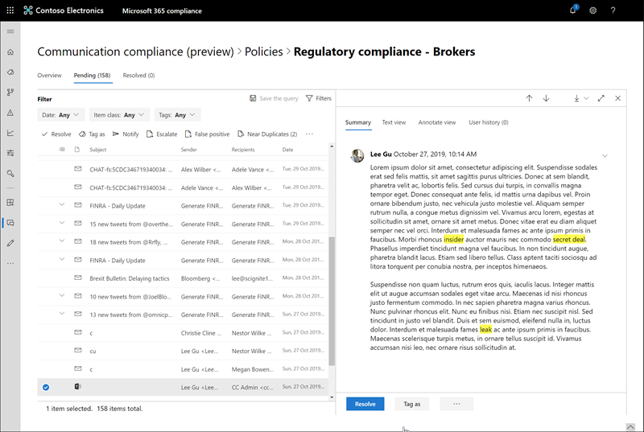

# 調查和修復通訊合規性警示 (預覽)

您已將您的通訊規範原則之後，您將從開始到符合原則條件的郵件問題的 Microsoft 365 合規性中心中接收提醒。 調查並修正警示問題，請遵循此處工作流程的指示。

## 調查提醒

調查原則所偵測到的問題的第一個步驟是檢閱在 Microsoft 365 合規性中心中的產生的警示。 在 [合規性中心，以協助您快速調查提醒，根據您想要檢視警示分組的方式有幾個方面：

- **通訊規範首頁**： 當您登入[https://compliance.microsoft.com](https://compliance.microsoft.com)使用 Microsoft 365 組織中系統管理員帳戶的認證，請選取 [**通訊相符性** > 以顯示通訊規範首頁] 頁面的**概觀**。 在這裡您將會看到：
    - 需要檢閱列出從高至低嚴重性的提醒。 選取要啟動 [警示詳細資料] 頁面上，並啟動修復動作的警示。
    - 最近原則相符項目列出的原則名稱。
    - 解析原則名稱所列出的項目。
    - 原則名稱所列出的擴大。
    - 具有最多原則相符項目，從列出最多至最少的使用者數目相符項目。
- **通知] 索引標籤**： 瀏覽至**通訊規範** > **提醒**，以顯示提醒依據符合通訊合規性原則。 此檢視可讓您快速查看哪些通訊規範原則會產生依嚴重性排序的大部分警示。  若要補救動作，請展開 [原則] 以選取特定的提醒，並啟動 [警示詳細資料] 頁面。
- **原則] 索引標籤**： 瀏覽至**通訊規範** > **原則**，以顯示通訊設定 Microsoft 365 組織的符合性原則。 列出每個原則包含需要檢閱的提醒數目。 選取原則會顯示所有擱置中的警示原則相符項目中，選取特定警示啟動原則的詳細資訊] 頁面上，並啟動修復動作。

### 使用篩選器

下一步是排序，使其更輕易地調查提醒的郵件。 通訊規範支援多層級篩選的幾個郵件欄位可協助您快速調查並檢閱郵件使用原則相符項目。 篩選適用於暫止的且每個已解析項目設定原則。 您可以設定原則的篩選器查詢或設定並儲存自訂和預設篩選器查詢使用中的每個特定原則。 設定後的篩選器的欄位，您會看到您可以設定特定篩選值的提醒訊息佇列編排所顯示的篩選欄位。

篩選與欄位的詳細資訊的完整清單，請參閱功能參考主題中的[篩選器](communication-compliance-feature-reference.md#filters)。

#### 若要設定篩選

1. 登入[https://compliance.microsoft.com](https://compliance.microsoft.com)使用 Microsoft 365 組織中系統管理員帳戶認證。

2. 在 Microsoft 365 合規性中心，移至**通訊合規性**。

3. 選取 [**原則**] 索引標籤，然後選取 [調查的原則，連按兩下以開啟 [**原則**] 頁面。

4. 在 [**原則**] 頁面上選取 [**擱置**] 或 [**已解決**] 索引標籤以顯示篩選的項目。

5. 選取要開啟 [**篩選器**的詳細資訊] 頁面上的**篩選器**控制項。

6. 選取一或多個核取方塊以啟用這些警示的篩選器。 您可以選擇從眾多的篩選，包括*日期*、*寄件者*、*主旨/標題*、*相關性*，等等。

7. 如果您想要儲存為預設篩選選取的篩選條件，請選取 [**儲存為預設值**]。 如果您想要使用此篩選器為已儲存的篩選，請選取 [**完成**]。

8. 如果您想要將所選取的篩選器儲存為篩選器查詢中，選取**儲存查詢**的控制項之後您已至少一個篩選值。 輸入篩選器查詢的名稱，然後選取 [**儲存**]。 此篩選器可供您使用僅限此原則，且會列在 [**已儲存的篩選器查詢**] 區段中的 [**篩選器**的詳細資訊] 頁面。

    

### 使用 near 和完全重複的分析

通訊合規性原則自動掃描和附近預先群組和確切郵件重複項目沒有任何其他設定步驟。 這可讓您快速修復一個接著一個或以群組方式，減少郵件調查負擔檢閱者的類似的訊息。 偵測出重複的項目時，**接近重複項目**及/或**完全重複**控制項中顯示 [修復動作] 工具列。

#### 若要補救重複項目

1. 登入[https://compliance.microsoft.com](https://compliance.microsoft.com)使用 Microsoft 365 組織中系統管理員帳戶認證。

2. 在 Microsoft 365 合規性中心，移至**通訊合規性**。

3. 選取 [**原則**] 索引標籤，然後選取 [調查的原則，連按兩下以開啟 [**原則**] 頁面。

4. 在 [**原則**] 頁面上選取 [**擱置**] 或 [**已解決**] 索引標籤以顯示重複的郵件。

5. 選取 [**接近重複項目**或**完全重複**的控制項，以開啟 [重複項目詳細資料] 頁面。

6. 選取一個或多封郵件，這些郵件的補救動作控制項。

7. 選取 [**解析**、**通知**、**提報**，或**下載**若要將動作套用至選取的重複 messages.elected 作為預設篩選器。

8. 完成的郵件的補救動作之後，選取 [**關閉**]。

    

## 修復提醒

無論其中您開始檢閱提醒或篩選您設定下, 一步是採取動作來修復警示。 啟動 [**原則**或**提醒**] 頁面上使用下列工作流程您警示修復：

1. **檢查郵件基本概念**： 有時很明顯地從 [來源] 或 [可以立即修復郵件的主旨。 可能的訊息是假性或不正確相符的原則，而且應該是解析為誤判。 選取要立即解決警示並從暫止警示佇列中移除的**誤判**控制項。 從來源] 或 [寄件者的資訊，您可能已經知道應該如何路由傳送或在這些情況下處理郵件。 請考慮使用**標籤做為**或**提報**控制項，將標籤指派給適用郵件或將訊息傳送給指定檢閱者。

    

2. **檢查訊息詳細資料**： 檢閱郵件基本知識之後，該是時候來開啟郵件若要檢查的詳細資料，並判斷進一步修復動作。 選取要檢視完整的郵件標頭和內文資訊的訊息。 有數個不同的檢視可用來協助您決定適當採取的動作：

    - **來源檢視**： 此為檢視標準郵件通常出現在大部分的 web 型郵件平台。 在 [一般] 樣式格式化的標頭資訊和郵件內文支援內嵌圖形的檔案和 word 進行三重包裝的文字。
    - **文字檢視**： 文字] 檢視會顯示行編號純文字的檢視郵件，並包含關鍵字醒目提示的相關聯的通訊合規性原則中符合的字詞。 關鍵字醒目提示可以協助您快速掃描長訊息感興趣的區域。 不會顯示內嵌的檔案和行號此檢視是很有用的參考之間多位檢閱者的相關詳細資訊。
    - **附註檢視**： 此檢視可讓儲存到的郵件] 檢視的檢閱者直接在郵件上新增註解。
    - **使用者歷程記錄**： 使用者歷程記錄] 檢視會顯示所有由使用者傳送郵件的任何通訊合規性政策產生其他提醒。

    

3. **修復動作的決定**： 現在，您已檢閱警示訊息的詳細資料，您可以選擇數個修復動作：

    - **解決**：**解決**控制項選取立即訊息移除**暫止提醒**佇列，並可以對郵件採取任何進一步的動作。 藉由選取**解決**，您已基本上關閉沒有進一步分類警示，而且無法進一步動作重新開啟。 已解析的所有郵件會都顯示在 [**已解決**] 索引標籤。
    - **誤判**： 就永遠可以解決為誤判的任何一點一則訊息，訊息檢閱 」 工作流程期間。 郵件無法重新開啟後，所有誤判郵件會顯示在 [**已解決**] 索引標籤。
    - **標記為**： 標記為*相容*，郵件*不相容*，或為*有疑問*時與關聯的原則與貴組織的標準。 新增標記及標記的註解可以協助您微型篩選器原則會發出警示呈報或其他內部檢閱程序的一部分。 標記為完成之後，您也可以選擇解決，將它移出擱置檢閱佇列的訊息。
    - **通知**： 您可以使用**通知**控制，以將自訂的通知範本指派給警示並警告通知傳送給使用者。 選擇適當的通知範本，然後選取 [**傳送**來傳送郵件的員工的電子郵件提醒，以及解決問題。
    - **提報**： 使用**提報**控制項，您可以選擇其他組織中誰應該檢閱此郵件。 選擇 [從清單中的設定檢閱傳送要求其他檢閱的郵件提醒的電子郵件通知。 選取檢閱者可以使用電子郵件通知中的連結，直接前往項目給他們擴大供檢閱。

4. **Determine 如果訊息詳細資料應封存外部通訊規範**： 郵件的詳細資訊可以匯出，或者如果您要封存的個別儲存解決方案中的郵件一起下載。 自動選取**下載**控制項新增至選取的郵件。可以儲存至 Microsoft 365 以外的存放區的 ZIP 檔案。
