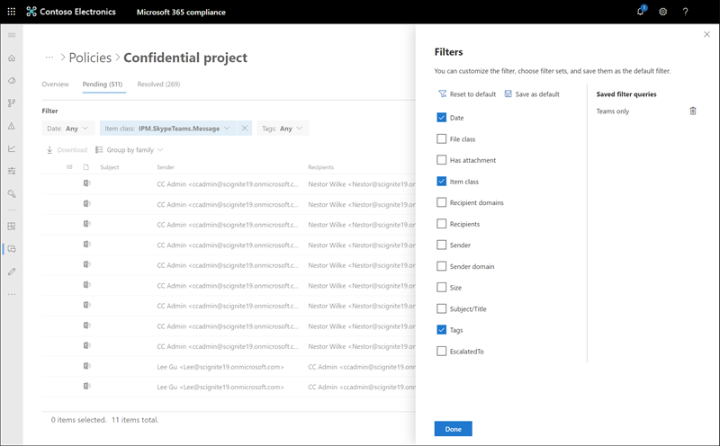

# 調查和修復通訊合規性警示Investigate and remediate communication compliance alerts

在您設定通訊相容性原則之後，您將開始在 Microsoft 365 合規性中心收到警示，以取得符合原則條件的郵件問題。After you've configured your communication compliance policies, you'll start to receive alerts in the Microsoft 365 compliance center for message issues that match your policy conditions. 遵循這裡的工作流程指示，以調查和修正警示問題。Follow the workflow instructions here to investigate and remediate alert issues.

## 調查提醒Investigate alerts

調查您的原則所偵測到的問題，第一步是在 Microsoft 365 規範中心檢查產生的警示。The first step to investigate issues detected by your policies is to review generated alerts in the Microsoft 365 compliance center. 「規範中心」中有許多區域，可協助您快速調查提醒，具體取決於您傾向于如何查看警示群組：There are several areas in the compliance center to help you to quickly investigate alerts, depending on how you prefer to view alert grouping:

- **通訊相容性首頁**：當您登入 [https://compliance.microsoft.com](https://compliance.microsoft.com) 使用 Microsoft 365 組織中的系統管理員帳號憑證時，請選取 [**通訊相容性**  >  **一覽表**]，以顯示通訊合規性首頁。**Communication compliance home page**: When you sign in to [https://compliance.microsoft.com](https://compliance.microsoft.com) using credentials for an admin account in your Microsoft 365 organization, select **Communication compliance** > **Overview** to display the communication compliance home page. 您會看到下列專案：Here you'll see:
    - 從高到低嚴重性列出需要檢查的警示。Alerts needing review listed from high to low severity. 選取警示以啟動警示詳細資料頁面，並啟動修復動作。Select an alert to launch the alert details page and to start remediation actions.
    - 依原則名稱列出的最近原則符合。Recent policy matches listed by policy name.
    - 依原則名稱列出的已解析專案。Resolved items listed by policy name.
    - 依原則名稱列出的上報。Escalations listed by policy name.
    - 符合最高原則的使用者，列于比對最少數目的專案。Users with the most policy matches, listed from the most to the least number of matches.
- [**警示]** 索引標籤：流覽至 [**通訊相容性**  >  **警示**]，以顯示最近30天的警示依原則相符分組。**Alerts tab**: Navigate to **Communication compliance** > **Alerts** to display the last 30 days of alerts grouped by policy matches. 此視圖可讓您快速查看哪些通訊法規遵從性原則產生了按嚴重性排序的最大警示。This view allows you to quickly see which communication compliance policies are generating the most alerts ordered by severity.  若要啟動修正動作，請展開原則，以選取特定警示及啟動警示詳細資料頁面。To start remediation actions, expand a policy to select a specific alert and to launch the alert details page.
- [**原則]** 索引標籤：流覽至**通訊相容性**  >  **原則**，以顯示針對您的 Microsoft 365 組織設定的通訊相容性原則。**Policies tab**: Navigate to **Communication compliance** > **Policies** to display communication compliance policies configured for your Microsoft 365 organization. 列出的每個原則都包含需要複查的警示計數。Each policy listed includes the count of alerts that need review. 選取原則會顯示符合原則的所有擱置中警示，選取啟動 [原則詳細資料] 頁面的特定警示，然後啟動修正動作。Selecting a policy displays all the pending alerts for matches to the policy, select a specific alert to launch the policy details page and to start remediation actions.

### 使用篩選Using filters

下一步是排序郵件，讓您更容易調查提醒。The next step is to sort the messages so that it's easier for you to investigate alerts. 通訊相容性支援多層級的郵件欄位篩選，可協助您快速調查和審閱具有原則相符的郵件。Communication compliance supports multi-level filtering for several message fields to help you quickly investigate and review messages with policy matches. 篩選可用於每個設定之原則的擱置及已解析的專案。Filtering is available for pending and resolved items for each configured policy. 您可以設定原則的篩選查詢，或設定及儲存自訂和預設篩選器查詢，以供每個特定原則使用。You can configure filter queries for a policy or configure and save custom and default filter queries for use in each specific policy. 設定篩選的欄位後，您會看到顯示在提醒訊息佇列頂端的篩選欄位，您可以針對特定篩選值進行設定。After configuring fields for a filter, you'll see the filter fields displayed on the top of the alert message queue that you can configure for specific filter values.

如需篩選器和欄位詳細資料的完整清單，請參閱 feature reference 主題中的[篩選器](communication-compliance-feature-reference.md#filters)。For a complete list of filters and field details, see [Filters](communication-compliance-feature-reference.md#filters) in the feature reference topic.

#### 設定篩選To configure a filter

1. 使用 Microsoft 365 組織中的系統管理員帳戶認證登入[https://compliance.microsoft.com](https://compliance.microsoft.com)。Sign into [https://compliance.microsoft.com](https://compliance.microsoft.com) using credentials for an admin account in your Microsoft 365 organization.

2. 在 Microsoft 365 規範中心內，移至 [**通訊符合性**]。In the Microsoft 365 compliance center, go to **Communication compliance**.

3. 選取 [**原則**] 索引標籤，然後選取要調查的原則，按兩下以開啟 [**原則**] 頁面。Select the **Policies** tab and then select a policy for investigation, double-click to open the **Policy** page.

4. 在 [**原則**] 頁面上，選取 [**擱置**中] 或 [**已解析**] 索引標籤，以顯示篩選的專案。On the **Policy** page, select either the **Pending** or **Resolved** tab to display the items for filtering.

5. 選取 [**篩選**] 控制項以開啟 [**篩選器**詳細資料] 頁面。Select the **Filters** control to open the **Filters** details page.

6. 選取一個或多個核取方塊，以啟用這些警示的篩選器。Select one or more checkboxes to enable filters for these alerts. 您可以選擇許多篩選，包括*日期*、*寄件者*、*主體/標題*、*分類*程式等等。You can choose from numerous filters, including *Date*, *Sender*, *Subject/Title*, *Classifiers*, and more.

7. 如果您想要將選取的篩選儲存為預設篩選器，請選取 [**另存為預設值**]。If you'd like to save the filter selected as the default filter, select **Save as default**. 如果您想要使用此篩選器做為已儲存的篩選器，請選取 [**完成**]。If you want to use this filter as a saved filter, select **Done**.

8. 如果您想要將選取的篩選儲存為篩選器查詢，請選取 [在至少設定一個篩選值後**儲存查詢**控制項]。If you'd like to save the selected filters as a filter query, select **Save the query** control after you've configured at least one filter value. 輸入篩選器查詢的名稱，然後選取 [**儲存**]。Enter a name for the filter query and select **Save**. 這個篩選只適用于這個原則，並列于 [**篩選**詳細資料] 頁面的 [**已儲存的篩選查詢**] 區段中。This filter is available to use for only this policy and is listed in the **Saved filter queries** section of the **Filters** details page.

    

### 使用接近和完全重複的重複分析Using near and exact duplicate analysis

通訊相容性原則會自動掃描和預先組旁和確切的郵件副本，而不需要任何其他設定步驟。Communication compliance policies automatically scan and pre-group near and exact message duplicates without any additional configuration steps. 此視圖可讓您快速地逐個修復類似的郵件或群組，以減少檢閱者的郵件調查負擔。This view allows you to quickly remediate similar messages one-by-one or as a group, reducing the message investigation burden for reviewers. 當偵測到重複專案時，**鄰近的重複**和/或**完全重複**的控制項會顯示在 [修正動作] 工具列中。As duplicates are detected, the **Near Duplicates** and/or the **Exact Duplicates** controls are displayed in the remediation action toolbar.

#### 修正重複專案To remediate duplicates

1. 使用 Microsoft 365 組織中的系統管理員帳戶認證登入[https://compliance.microsoft.com](https://compliance.microsoft.com)。Sign into [https://compliance.microsoft.com](https://compliance.microsoft.com) using credentials for an admin account in your Microsoft 365 organization.

2. 在 Microsoft 365 規範中心內，移至 [**通訊符合性**]。In the Microsoft 365 compliance center, go to **Communication compliance**.

3. 選取 [**原則**] 索引標籤，然後選取要調查的原則，按兩下以開啟 [**原則**] 頁面。Select the **Policies** tab and then select a policy for investigation, double-click to open the **Policy** page.

4. 在 [**原則**] 頁面上，選取 [**擱置**中] 或 [**已解析**] 索引標籤以顯示重複的郵件。On the **Policy** page, select either the **Pending** or **Resolved** tab to display duplicate messages.

5. 選取 [**臨近重複**專案] 或 [**完全重複的專案**] 頁面，開啟 [複製詳細資料] 頁面。Select the **Near Duplicates** or **Exact Duplicates** controls to open the duplicates details page.

6. 選取一或多封郵件以修正這些郵件的動作控制項。Select one or more messages to remediation action controls for these messages.

7. 選取 [**解析**]、[**通知**]、[**呈報**] 或 [**下載**]，將動作套用至選取的重複郵件。選擇為預設篩選器。Select **Resolve**, **Notify**, **Escalate**, or **Download** to apply the action to the selected duplicate messages.elected as the default filter.

8. 在郵件上完成修正動作後，請選取 [**關閉**]。Select **Close** after completing the remediation actions on the messages.

    

## 修正警示Remediate alerts

不論您在何處開始檢查警示或您設定的篩選，下一步是採取動作來修復警示。No matter where you start to review alerts or the filtering you configure, the next step is to take action to remediate the alert. 在 [**原則**] 或 [**提醒**] 頁面上，使用下列工作流程啟動警示修正：Start your alert remediation using the following workflow on the **Policy** or **Alerts** pages:

1. **檢查郵件基礎**：有時候可以立即修正郵件的來源或主旨。**Examine the message basics**: Sometimes it's obvious from the source or subject that a message can be immediately remediated. 可能是郵件是虛假的，或不正確地符合原則，且應該以誤報的方式解決。It may be that the message is spurious or incorrectly matched to a policy and it should be resolved as a false positive. 選取 [ **False 正值**] 控制項立即解決警示，並從擱置的警示佇列中移除。Select the **False Positive** control to immediately resolve the alert and remove from the pending alert queue. 從來源或寄件者資訊，您可能已經知道在這些情況下，應如何路由傳送或處理郵件。From the source or sender information, you may already know how the message should be routed or handled in these circumstances. 請考慮使用**標記做為**或**呈報**控制項，將標記指派給適用的郵件，或將郵件傳送給指定的檢閱者。Consider using the **Tag as** or **Escalate** controls to assign a tag to applicable messages or to send messages to a designated reviewer.

    

2. **檢查郵件詳細資料**：查看郵件基礎之後，就可以開啟訊息以檢查詳細資料，並決定進一步的修正動作。**Examine the message details**: After reviewing the message basics, it's time to open a message to examine the details and to determine further remediation actions. 選取郵件，以查看完整的郵件頭和正文資訊。Select a message to view the complete message header and body information. 有幾種不同的觀點可協助您決定正確的動作：Several different views are available to help you decide the proper course of action:

    - **來源視圖**：此視圖是大多數網頁型郵件平臺中通常會出現的標準郵件視圖。**Source view**: This view is the standard message view commonly seen in most web-based messaging platforms. 標頭資訊的格式為 normal 樣式，郵件內文支援嵌入的圖形檔案及換行的文字。The header information is formatted in the normal style and the message body supports imbedded graphic files and word-wrapped text.
    - **文字**模式：文字視圖會顯示郵件的單行型純文字視圖，並包含相關聯的通訊合規性原則中符合字詞的關鍵字醒目提示。**Text view**: Text view displays a line-numbered text-only view of the message and includes keyword highlighting for terms matched in the associated communication compliance policy. 關鍵字醒目提示可協助您快速掃描長訊息，找出感興趣的地方。Keyword highlighting can help you quickly scan long messages for the area of interest. 內嵌的檔案不會顯示，而且此視圖的行號可用於參考多個檢閱者之間的相關詳細資料。Embedded files aren't displayed and the line numbering this view is helpful for referencing pertinent details among multiple reviewers.
    - **批註視圖**：此視圖可讓檢閱者直接在儲存為郵件視圖的郵件上新增批註。**Annotate view**: This view allows reviewers to add annotations directly on the message that are saved to the view of the message.
    - **使用者歷程記錄**：使用者史 view 顯示傳送郵件之使用者的所有通訊合規性原則所產生的所有其他警示。**User history**: User history view displays all other alerts generated by any communication compliance policy for the user sending the message.

    

3. **決定修正動作**：現在，您已針對警示查看郵件的詳細資料，您可以選擇數項修復動作：**Decide on a remediation action**: Now that you've reviewed the details of the message for the alert, you can choose several remediation actions:

    - **解決**：選取 [**解析**] 控制項會立即從 [擱置的**警示**] 佇列中移除郵件，而且不能對郵件採取進一步的動作。**Resolve**: Selecting the **Resolve** control immediately removes the message from the **Pending alerts** queue and no further action can be taken on the message. 透過選擇 [**解決**方式，您基本上關閉了未進一步分類的警示]，而且無法重新開啟，以進行進一步的動作。By selecting **Resolve**, you've essentially closed the alert without further classification and it can't be reopened for further actions. 所有已解析的郵件會顯示在 [**已解析**] 索引標籤中。All resolved messages are displayed in the **Resolved** tab.
    - **誤報**：在郵件評審工作流程中，您可以隨時將郵件解析為 False 陽性。**False Positive**: You can always resolve a message as a false positive at any point during the message review workflow. 無法重新開啟郵件，而且所有誤報郵件都會顯示在 [**已解析**] 索引標籤中。The message cannot be reopened and all false positive messages are displayed in the **Resolved** tab.
    - **標記為**：將郵件標記為*相容性*、*不相容*或因其與組織的原則及標準相關的*可疑*專案。**Tag as**: Tag the message as *compliant*, *non-compliant*, or as *questionable* as it relates to the policies and standards for your organization. 新增標記及標記批註可協助您微篩選原則警示，以進行升級或其他內部審閱程式的一部分。Adding tags and tagging comments can help you micro-filter policy alerts for escalations or as part of other internal review processes. 完成標記之後，您也可以選擇解決郵件，將其移出擱置中的審閱佇列。After tagging is complete, you can also choose to resolve the message to move it out of the pending review queue.
    - **Notify**：您可以使用 [**通知**] 控制項，將自訂的通知範本指派給提醒並傳送警告通知給使用者。**Notify**: You can use the **Notify** control to assign a custom notice template to the alert and to send a warning notice to the user. 選擇適當的公告範本，然後選取 [**傳送**給電子郵件傳送電子郵件提醒給傳送郵件的員工並解決問題]。Choose the appropriate notice template, and select **Send** to email a reminder to the employee that sent the message and to resolve the issue.
    - **提升**：使用**提升**控制，您可以選擇組織中的其他人員應該檢查郵件。**Escalate**: Using the **Escalate** control, you can choose who else in your organization should review the message. 從通訊相容性原則中設定的檢閱者清單中選擇，傳送電子郵件通知，要求進一步複查郵件警示。Choose from a list of reviewers configured in the communication compliance policy to send an email notification requesting additional review of the message alert. 選取的檢閱者可以在電子郵件通知中使用連結，以直接移至已呈報至其進行審閱的專案。The selected reviewer can use a link in the email notification to go directly to items escalated to them for review.
    - **建立案例**：使用 [**建立案例**] 控制項，您可以為一或多個郵件建立新的[高級 eDiscovery 案例](overview-ediscovery-20.md)。**Create a case**: Using the **Create a case** control, you can create a new [Advanced eDiscovery case](overview-ediscovery-20.md) for single or multiple messages. 您會提供新案例的名稱和附注，而且傳送符合原則的郵件的使用者會自動指派為案例管理員。You'll provide a name and notes for the new case, and user who sent the message matching the policy is automatically assigned as the case custodian. 您不需要任何其他許可權來管理案例。You don't need any additional permissions to manage the case. 建立案例不會解析或為郵件建立新的標記。Creating a case does not resolve or create a new tag for the message.

4. **判斷是否應該在通訊相容性以外封存郵件詳細資料**：如果您需要在個別的儲存方案中封存郵件，可以匯出或下載郵件詳細資料。**Determine if message details should be archived outside of communication compliance**: Message details can be exported or downloaded if you need to archive the messages in a separate storage solution. 選取 [**下載**] 控制項會自動將選取的郵件新增至。可儲存至 Microsoft 365 以外儲存體的 ZIP 檔案。Selecting the **Download** control automatically adds selected messages to a .ZIP file that can be saved to storage outside of Microsoft 365.
