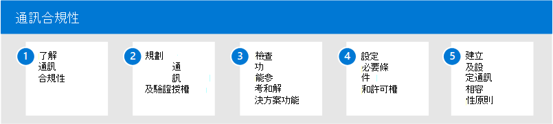

# Microsoft 365 中的通訊合規性

保護機密資訊和偵測和作用於工作場所騷擾的事件，是遵守內部原則和標準的重要部分。 Microsoft 365 中的通訊相容性協助您快速偵測、捕獲和採取電子郵件和 Microsoft Teams 通訊的修正動作，協助將這些風險降至最低。 這包括不適當的通訊，包含與您組織內部和外部的敏感資訊共用的猥褻、威脅及騷擾和通訊。

## 設定 Microsoft 365 的通訊相容性

請使用下列步驟設定組織的通訊相容性：

1. 深入瞭解 Microsoft 365 中的[通訊符合性](communication-compliance.md)
2. 規劃 [通訊合規性](communication-compliance-plan.md) 及 [驗證授權](communication-compliance-configure.md#subscriptions-and-licensing)
3. 檢查 [功能參考和解決方案功能](communication-compliance-feature-reference.md)
4. 設定 [必要條件](communication-compliance-configure.md#step-2-required-enable-the-audit-log) 和 [許可權](communication-compliance-configure.md#step-1-required-enable-permissions-for-communication-compliance)
5. 建立及設定 [通訊相容性原則](communication-compliance-configure.md#step-5-required-create-a-communication-compliance-policy)

## 有關通訊規範的詳細資訊

- [調查和修正警示](communication-compliance-investigate-remediate.md)
- [案例研究-Contoso 會快速設定冒犯性語言原則，以進行 Microsoft Teams、Exchange 和 Yammer 通訊](communication-compliance-case-study.md)