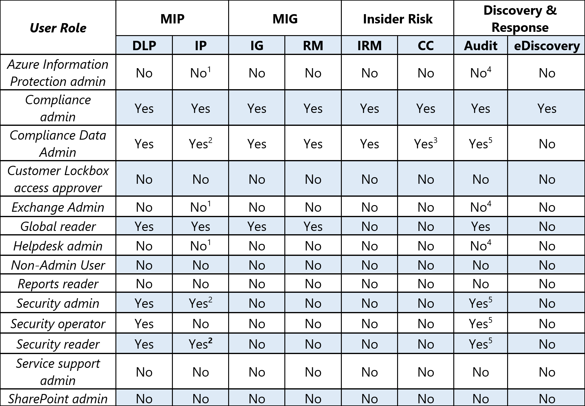

# <a name="microsoft-compliance-configuration-analyzer-for-compliance-manager-preview"></a><span data-ttu-id="1c222-103">合規性管理員的 Microsoft 規範設定分析器 (預覽) </span><span class="sxs-lookup"><span data-stu-id="1c222-103">Microsoft Compliance Configuration Analyzer for Compliance Manager (preview)</span></span>

<span data-ttu-id="1c222-104">**本文內容：** 瞭解如何安裝和執行 Microsoft 規範設定 Analyzer 工具，快速開始使用 Microsoft 合規性管理員。</span><span class="sxs-lookup"><span data-stu-id="1c222-104">**In this article:** Learn how to install and run the Microsoft Compliance Configure Analyzer tool to get quickly started with Microsoft Compliance Manger.</span></span>

## <a name="microsoft-compliance-configuration-analyzer-mcca-preview-overview"></a><span data-ttu-id="1c222-105">Microsoft 規範設定分析器 (MCCA)  (預覽) 概述</span><span class="sxs-lookup"><span data-stu-id="1c222-105">Microsoft Compliance Configuration Analyzer (MCCA) (preview) overview</span></span>

<span data-ttu-id="1c222-106">Microsoft 規範設定分析器 (MCCA) 是一種預覽工具，可協助您開始使用 [Microsoft 合規性管理員](compliance-manager.md)。</span><span class="sxs-lookup"><span data-stu-id="1c222-106">The Microsoft Compliance Configuration Analyzer (MCCA) is a preview tool that can help you get started with [Microsoft Compliance Manager](compliance-manager.md).</span></span> <span data-ttu-id="1c222-107">MCCA 是一種以 PowerShell 為基礎的公用程式，會取得組織目前的設定，並依據 Microsoft 365 建議的最佳作法來驗證這些設定。</span><span class="sxs-lookup"><span data-stu-id="1c222-107">MCCA is a PowerShell-based utility that will fetch your organization’s current configurations and validate them against Microsoft 365 recommended best practices.</span></span> <span data-ttu-id="1c222-108">這些最佳作法是以一組控制項為基礎，其中包含資料保護和資料控管的主要法規和標準。</span><span class="sxs-lookup"><span data-stu-id="1c222-108">These best practices are based on a set of controls that include key regulations and standards for data protection and data governance.</span></span>

<span data-ttu-id="1c222-109">MCCA 可協助您快速查看合規性管理員中的哪些改進動作適用于您目前的 Microsoft 365 環境。</span><span class="sxs-lookup"><span data-stu-id="1c222-109">MCCA can help you quickly see which improvement actions in Compliance Manager apply to your current Microsoft 365 environment.</span></span> <span data-ttu-id="1c222-110">MCCA 識別的每個動作都會提供您的實施建議，其中包含符合性管理員的直接連結，以及開始採取糾正動作的適當解決方案。</span><span class="sxs-lookup"><span data-stu-id="1c222-110">Each action identified by MCCA will give you recommendations for implementation, with direct links to Compliance Manager and the applicable solution to start taking corrective action.</span></span>

<span data-ttu-id="1c222-111">若要瞭解 MCCA 的其他資源，請造訪[GitHub 上的讀我檔案指示](https://github.com/OfficeDev/MCCA#overview)。</span><span class="sxs-lookup"><span data-stu-id="1c222-111">An additional resource for understanding MCCA is by visiting the [README instructions on GitHub](https://github.com/OfficeDev/MCCA#overview).</span></span> <span data-ttu-id="1c222-112">此頁面提供有關必要條件的詳細資訊，並提供完整的安裝指示。</span><span class="sxs-lookup"><span data-stu-id="1c222-112">This page provides detailed information about prerequisites and gives full installation instructions.</span></span> <span data-ttu-id="1c222-113">您不需要 GitHub 帳戶即可存取此頁面。</span><span class="sxs-lookup"><span data-stu-id="1c222-113">You don’t need a GitHub account to access this page.</span></span>

<span data-ttu-id="1c222-114">**可用性**： MCCA 可供所有組織使用 Office 365 和 Microsoft 365 授權和美國政府 Community (GCC) 適度、GCC 高及國防部門 (DoD) 客戶。</span><span class="sxs-lookup"><span data-stu-id="1c222-114">**Availability**: MCCA is available to all organizations with Office 365 and Microsoft 365 licenses and US Government Community (GCC) Moderate, GCC High, and Department of Defense (DoD) customers.</span></span>

## <a name="install-mcca-and-run-a-report"></a><span data-ttu-id="1c222-115">安裝 MCCA 並執行報告</span><span class="sxs-lookup"><span data-stu-id="1c222-115">Install MCCA and run a report</span></span>

<span data-ttu-id="1c222-116">您可以使用 Windows PowerShell 來安裝 MCCA 工具。</span><span class="sxs-lookup"><span data-stu-id="1c222-116">You can install the MCCA tool using Windows PowerShell.</span></span> <span data-ttu-id="1c222-117">下載及安裝工具後，您不需要重複這些步驟，即可執行報告。</span><span class="sxs-lookup"><span data-stu-id="1c222-117">Once you download and install the tool, you don’t need to repeat those steps in order to run reports.</span></span> <span data-ttu-id="1c222-118">每次開啟 MCCA 時，它會詢問您登入認證，並且會產生新的更新報告。</span><span class="sxs-lookup"><span data-stu-id="1c222-118">Each time you open MCCA, it will ask you for your login credentials, and it will generate a new, updated report.</span></span>

#### <a name="step-1-install-windows-powershell"></a><span data-ttu-id="1c222-119">步驟1：安裝 Windows PowerShell</span><span class="sxs-lookup"><span data-stu-id="1c222-119">Step 1: Install Windows PowerShell</span></span>
<span data-ttu-id="1c222-120">若要開始，您需要 Exchange Online PowerShell 模組 (v 2.0.3 或以上) ，可在 PowerShell 圖庫中使用。</span><span class="sxs-lookup"><span data-stu-id="1c222-120">To begin, you'll need the Exchange Online PowerShell module (v2.0.3 or higher) that's available in the PowerShell gallery.</span></span> <span data-ttu-id="1c222-121">[取得安裝指示](https://www.powershellgallery.com/packages/ExchangeOnlineManagement/2.0.3)。</span><span class="sxs-lookup"><span data-stu-id="1c222-121">[Get installation instructions](https://www.powershellgallery.com/packages/ExchangeOnlineManagement/2.0.3).</span></span>

#### <a name="step-2-install-mcca"></a><span data-ttu-id="1c222-122">步驟2：安裝 MCCA</span><span class="sxs-lookup"><span data-stu-id="1c222-122">Step 2: Install MCCA</span></span>

<span data-ttu-id="1c222-123">若要安裝 MCCA，請在系統管理員模式中使用 PowerShell 開始。</span><span class="sxs-lookup"><span data-stu-id="1c222-123">To install MCCA, start by using PowerShell in administrator mode.</span></span> <span data-ttu-id="1c222-124">請遵循下列步驟：</span><span class="sxs-lookup"><span data-stu-id="1c222-124">Follow the steps below:</span></span>

1. <span data-ttu-id="1c222-125">選取 [Windows **開始**] 按鈕。</span><span class="sxs-lookup"><span data-stu-id="1c222-125">Select the Windows **Start** button.</span></span>
2. <span data-ttu-id="1c222-126">輸入 **PowerShell**，在 **Windows PowerShell** 上按一下滑鼠右鍵，然後選取 [**以系統管理員身分執行**]。</span><span class="sxs-lookup"><span data-stu-id="1c222-126">Type **PowerShell**, right-click on **Windows PowerShell**, then select **Run as administrator**.</span></span>
1. <span data-ttu-id="1c222-127">請在命令提示字元處，輸入：</span><span class="sxs-lookup"><span data-stu-id="1c222-127">At the command prompt, type:</span></span>

    ```powershell
    Install-Module -Name MCCAPreview
    ```

#### <a name="step-3-run-a-report"></a><span data-ttu-id="1c222-128">步驟3：執行報告</span><span class="sxs-lookup"><span data-stu-id="1c222-128">Step 3: Run a report</span></span>

<span data-ttu-id="1c222-129">安裝 MCCA 後，您可以執行 MCCA 並產生報告。</span><span class="sxs-lookup"><span data-stu-id="1c222-129">After you install MCCA, you can run MCCA and generate a report.</span></span> <span data-ttu-id="1c222-130">若要執行報告：</span><span class="sxs-lookup"><span data-stu-id="1c222-130">To run a report:</span></span>

1. <span data-ttu-id="1c222-131">開啟 PowerShell</span><span class="sxs-lookup"><span data-stu-id="1c222-131">Open PowerShell</span></span>
2. <span data-ttu-id="1c222-132">執行下列 Cmdlet：</span><span class="sxs-lookup"><span data-stu-id="1c222-132">Run the cmdlet:</span></span>

    ```powershell
    Get-MCCAReport
    ```

   <span data-ttu-id="1c222-133">如果您是 GCC 高客戶，您必須提供額外的輸入參數來執行報告：</span><span class="sxs-lookup"><span data-stu-id="1c222-133">If you're a GCC High customer, you'll need to provide an additional input parameter to run the report:</span></span>

    ```powershell
    Get-MCCAReport -ExchangeEnvironmentName O365USGovGCCHigh
    ```

3. <span data-ttu-id="1c222-134">MCCA 執行後，它會進行初始版本檢查，並要求認證。</span><span class="sxs-lookup"><span data-stu-id="1c222-134">Once MCCA runs, it does an initial version check and ask for credentials.</span></span> <span data-ttu-id="1c222-135">在輸入的使用者名稱提示字元下，使用 Microsoft 365 帳戶的電子郵件地址登入 ([查看可建立報表的角色](#role-based-reporting)) 。</span><span class="sxs-lookup"><span data-stu-id="1c222-135">At the Input the user name prompt, sign in with your Microsoft 365 account email address ([view the roles eligible to create reports](#role-based-reporting)).</span></span> <span data-ttu-id="1c222-136">然後在密碼提示字元處輸入您的密碼。</span><span class="sxs-lookup"><span data-stu-id="1c222-136">Then enter your password at the password prompt.</span></span>

<span data-ttu-id="1c222-137">您的報告將會花大約2-5 分鐘的時間來產生。</span><span class="sxs-lookup"><span data-stu-id="1c222-137">Your report will then take approximately 2-5 minutes to generate.</span></span> <span data-ttu-id="1c222-138">完成後，瀏覽器視窗隨即開啟，並顯示您的 HTML 報告。</span><span class="sxs-lookup"><span data-stu-id="1c222-138">When it’s done, a browser window opens and displays your HTML report.</span></span> <span data-ttu-id="1c222-139">每次執行工具時，它會要求您的認證，並產生新的報告。</span><span class="sxs-lookup"><span data-stu-id="1c222-139">Every time you run the tool, it will ask for your credentials and generate a new report.</span></span> <span data-ttu-id="1c222-140">此報告儲存在本機的下列目錄中：</span><span class="sxs-lookup"><span data-stu-id="1c222-140">This report is stored locally in the following directory:</span></span>

<span data-ttu-id="1c222-141">C:\Users \<username> \AppData\Local\Microsoft\MCCA。</span><span class="sxs-lookup"><span data-stu-id="1c222-141">C:\Users\<username>\AppData\Local\Microsoft\MCCA.</span></span> 

<span data-ttu-id="1c222-142">您可以從這個目錄存取先前產生的報告。</span><span class="sxs-lookup"><span data-stu-id="1c222-142">You can access previously generated reports from this directory.</span></span>

## <a name="understanding-your-report"></a><span data-ttu-id="1c222-143">瞭解您的報表</span><span class="sxs-lookup"><span data-stu-id="1c222-143">Understanding your report</span></span>

<span data-ttu-id="1c222-144">您的報表會根據資料的產生日期和時間來反映資料。</span><span class="sxs-lookup"><span data-stu-id="1c222-144">Your report reflects data based on the date and time at which it was generated.</span></span> <span data-ttu-id="1c222-145">上一節提供有關何時產生、您的組織名稱和租使用者識別碼的詳細資料。</span><span class="sxs-lookup"><span data-stu-id="1c222-145">The top section provides details on when it was generated, your organization name, and tenant ID.</span></span>

#### <a name="geolocation-based-reporting"></a><span data-ttu-id="1c222-146">以地理位置為基礎的報表</span><span class="sxs-lookup"><span data-stu-id="1c222-146">Geolocation-based reporting</span></span>

<span data-ttu-id="1c222-147">[ **附注** ] 區段會顯示您的報表是根據租使用者的地理位置自訂。</span><span class="sxs-lookup"><span data-stu-id="1c222-147">The **Note** section shows that your report is customized based on the geographic location of your tenant.</span></span> <span data-ttu-id="1c222-148">工具中所列的建議會特定于您的國家或地區。</span><span class="sxs-lookup"><span data-stu-id="1c222-148">Recommendations listed in the tool will be specific to your country or region.</span></span>

<span data-ttu-id="1c222-149">您的地理位置選擇是用來評估敏感資訊類型 (其與該地理位置相關的) ，並產生與您的國家或地區相關的報表。</span><span class="sxs-lookup"><span data-stu-id="1c222-149">Your geolocation selection is used to assess sensitive information types (SITs) which are relevant to that geolocation and generate a report that aligns to your country or region.</span></span> <span data-ttu-id="1c222-150">根據您租使用者中的資料，選擇 [geolocations]。</span><span class="sxs-lookup"><span data-stu-id="1c222-150">Choose geolocations based on data you have in your tenant.</span></span>

<span data-ttu-id="1c222-151">若要變更您的報表位置資訊，您必須提供地理位置 ( 地理) 輸入參數。</span><span class="sxs-lookup"><span data-stu-id="1c222-151">To change your report's location information, you need provide a geolocation (-Geo) input parameter.</span></span> <span data-ttu-id="1c222-152">您可以選擇一個或多個適用于您租使用者的 geolocations。</span><span class="sxs-lookup"><span data-stu-id="1c222-152">You can choose either one or multiple geolocations applicable for your tenant.</span></span>

<span data-ttu-id="1c222-153">遵循下列指示，根據特定位置執行報告：</span><span class="sxs-lookup"><span data-stu-id="1c222-153">Follow these instructions to run a report based on a specific location:</span></span>

1. <span data-ttu-id="1c222-154">開啟 PowerShell</span><span class="sxs-lookup"><span data-stu-id="1c222-154">Open PowerShell</span></span>
2. <span data-ttu-id="1c222-155">若要指定特定區域，您可以使用下表中與國家或地區相對應的編號來執行 Cmdlet。</span><span class="sxs-lookup"><span data-stu-id="1c222-155">To specify a certain region, you’ll run a cmdlet using the numbers from the table below that correspond to the country or region.</span></span> <span data-ttu-id="1c222-156">以逗號隔開，以輸入多個數位。</span><span class="sxs-lookup"><span data-stu-id="1c222-156">Enter multiple numbers by separating them with a comma.</span></span> <span data-ttu-id="1c222-157">例如，下列 Cmdlet 會執行 Asia-Pacific 和日本的自訂報告：</span><span class="sxs-lookup"><span data-stu-id="1c222-157">For example, the cmdlet below will run a customized report for Asia-Pacific and Japan:</span></span>

    ```powershell
    Get-MCCAReport -Geo @(1,7)
    ```
  | <span data-ttu-id="1c222-158">Input</span><span class="sxs-lookup"><span data-stu-id="1c222-158">Input</span></span> |  <span data-ttu-id="1c222-159">國家/地區</span><span class="sxs-lookup"><span data-stu-id="1c222-159">Country or Region</span></span> | 
  | :------------- | :------------: |
  | <span data-ttu-id="1c222-160">1 </span><span class="sxs-lookup"><span data-stu-id="1c222-160">1</span></span> | <span data-ttu-id="1c222-161">亞太地區</span><span class="sxs-lookup"><span data-stu-id="1c222-161">Asia-Pacific</span></span> |
  | <span data-ttu-id="1c222-162">2 </span><span class="sxs-lookup"><span data-stu-id="1c222-162">2</span></span> | <span data-ttu-id="1c222-163">澳洲</span><span class="sxs-lookup"><span data-stu-id="1c222-163">Australia</span></span> |
  | <span data-ttu-id="1c222-164">3 </span><span class="sxs-lookup"><span data-stu-id="1c222-164">3</span></span> | <span data-ttu-id="1c222-165">加拿大</span><span class="sxs-lookup"><span data-stu-id="1c222-165">Canada</span></span> |
  | <span data-ttu-id="1c222-166">4 </span><span class="sxs-lookup"><span data-stu-id="1c222-166">4</span></span> | <span data-ttu-id="1c222-167">歐洲 (除外法國) /中東/非洲</span><span class="sxs-lookup"><span data-stu-id="1c222-167">Europe (excluding France) / Middle East / Africa</span></span> |
  | <span data-ttu-id="1c222-168">5 </span><span class="sxs-lookup"><span data-stu-id="1c222-168">5</span></span> | <span data-ttu-id="1c222-169">法國</span><span class="sxs-lookup"><span data-stu-id="1c222-169">France</span></span> |
  | <span data-ttu-id="1c222-170">6 </span><span class="sxs-lookup"><span data-stu-id="1c222-170">6</span></span> | <span data-ttu-id="1c222-171">印度</span><span class="sxs-lookup"><span data-stu-id="1c222-171">India</span></span> |
  | <span data-ttu-id="1c222-172">7 </span><span class="sxs-lookup"><span data-stu-id="1c222-172">7</span></span> | <span data-ttu-id="1c222-173">日本</span><span class="sxs-lookup"><span data-stu-id="1c222-173">Japan</span></span> |
  | <span data-ttu-id="1c222-174">8 </span><span class="sxs-lookup"><span data-stu-id="1c222-174">8</span></span> | <span data-ttu-id="1c222-175">韓國</span><span class="sxs-lookup"><span data-stu-id="1c222-175">Korea</span></span> |
  | <span data-ttu-id="1c222-176">9 </span><span class="sxs-lookup"><span data-stu-id="1c222-176">9</span></span> | <span data-ttu-id="1c222-177">北美 (（加拿大除外）) </span><span class="sxs-lookup"><span data-stu-id="1c222-177">North America (excluding Canada)</span></span> |
  | <span data-ttu-id="1c222-178">10 </span><span class="sxs-lookup"><span data-stu-id="1c222-178">10</span></span> | <span data-ttu-id="1c222-179">南美洲</span><span class="sxs-lookup"><span data-stu-id="1c222-179">South America</span></span> |
  | <span data-ttu-id="1c222-180">11 </span><span class="sxs-lookup"><span data-stu-id="1c222-180">11</span></span> | <span data-ttu-id="1c222-181">南非</span><span class="sxs-lookup"><span data-stu-id="1c222-181">South Africa</span></span> |
  | <span data-ttu-id="1c222-182">12 </span><span class="sxs-lookup"><span data-stu-id="1c222-182">12</span></span> | <span data-ttu-id="1c222-183">瑞士</span><span class="sxs-lookup"><span data-stu-id="1c222-183">Switzerland</span></span> |
  | <span data-ttu-id="1c222-184">13 </span><span class="sxs-lookup"><span data-stu-id="1c222-184">13</span></span> | <span data-ttu-id="1c222-185">阿拉伯聯合大公國</span><span class="sxs-lookup"><span data-stu-id="1c222-185">United Arab Emirates</span></span> |
  | <span data-ttu-id="1c222-186">14 </span><span class="sxs-lookup"><span data-stu-id="1c222-186">14</span></span> | <span data-ttu-id="1c222-187">英國</span><span class="sxs-lookup"><span data-stu-id="1c222-187">United Kingdom</span></span> |


 > [!NOTE]
> <span data-ttu-id="1c222-188">報告一定會包括 MCCA 支援的國際機密資訊類型，例如 SWIFT 程式碼、信用卡號碼等等。</span><span class="sxs-lookup"><span data-stu-id="1c222-188">The report will always include MCCA supported international sensitive information types such as SWIFT code, credit card number, etc.</span></span>

#### <a name="role-based-reporting"></a><span data-ttu-id="1c222-189">以角色為基礎的報表</span><span class="sxs-lookup"><span data-stu-id="1c222-189">Role-based reporting</span></span>

<span data-ttu-id="1c222-190">您的報表也會根據您的角色進行自訂。</span><span class="sxs-lookup"><span data-stu-id="1c222-190">Your report will also be customized based on your role.</span></span>

<span data-ttu-id="1c222-191">下表顯示哪些角色可以存取報表的哪些區段。</span><span class="sxs-lookup"><span data-stu-id="1c222-191">The table below shows which roles have access to which sections of the report.</span></span> <span data-ttu-id="1c222-192">組織內的其他角色 (未列在下表中) 可能無法執行該工具，也可能會執行該工具，並對最終報告中的資訊存取有限。</span><span class="sxs-lookup"><span data-stu-id="1c222-192">Other roles within your organization (not listed in the table below) may not be able to run the tool, or they may run the tool and have limited access to information in the final report.</span></span>

<span data-ttu-id="1c222-193"></span><span class="sxs-lookup"><span data-stu-id="1c222-193"></span></span>

<span data-ttu-id="1c222-194">例外狀況：</span><span class="sxs-lookup"><span data-stu-id="1c222-194">Exceptions:</span></span>
1. <span data-ttu-id="1c222-195">使用者無法產生「為 Exchange Online 使用 IRM」一節中的 IP 報告。</span><span class="sxs-lookup"><span data-stu-id="1c222-195">Users won't be able to generate report for IP apart from “Use IRM for Exchange Online” section.</span></span>
2. <span data-ttu-id="1c222-196">使用者將能夠產生「使用 Exchange Online 的 IRM」一節中的 IP 報告。</span><span class="sxs-lookup"><span data-stu-id="1c222-196">Users will be able to generate report for IP apart from “Use IRM for Exchange Online” section.</span></span>
3. <span data-ttu-id="1c222-197">使用者將能夠對「在 O365 啟用通訊法規遵從性」一節中，產生 IP 的報告。</span><span class="sxs-lookup"><span data-stu-id="1c222-197">Users will be able to generate report for IP apart from “Enable Communication Compliance in O365” section.</span></span>
4. <span data-ttu-id="1c222-198">使用者無法產生「在 Office 365 中啟用審核」一節中的 IP 報告。</span><span class="sxs-lookup"><span data-stu-id="1c222-198">Users won't be able to generate report for IP apart from “Enable Auditing in Office 365” section.</span></span>
5. <span data-ttu-id="1c222-199">使用者將會產生「在 Office 365 中啟用審核」一節中的 IP 報告。</span><span class="sxs-lookup"><span data-stu-id="1c222-199">Users will be able generate report for IP apart from “Enable Auditing in Office 365” section.</span></span>

#### <a name="solutions-summary-section"></a><span data-ttu-id="1c222-200">解決方案摘要區段</span><span class="sxs-lookup"><span data-stu-id="1c222-200">Solutions Summary section</span></span>

<span data-ttu-id="1c222-201">報告的 [ **解決方案摘要** ] 區段提供您的組織可在合規性管理員中採取的改進動作，以協助改善您的相容性狀況。</span><span class="sxs-lookup"><span data-stu-id="1c222-201">The **Solutions Summary** section of the report gives an overview of improvement actions that your organization can take in Compliance Manager to help improve your compliance posture.</span></span>

<span data-ttu-id="1c222-202"></span><span class="sxs-lookup"><span data-stu-id="1c222-202"></span></span>

<span data-ttu-id="1c222-203">MCCA 會根據合規性管理員中建議的改進動作評估您目前的設定。</span><span class="sxs-lookup"><span data-stu-id="1c222-203">MCCA evaluates your current configurations against the recommended improvement actions in Compliance Manager.</span></span> <span data-ttu-id="1c222-204">本節會列出 MCCA 工具所識別的任何改進動作（如有需要注意）。</span><span class="sxs-lookup"><span data-stu-id="1c222-204">Any improvement action identified by the MCCA tool as needing attention will be listed in this section.</span></span>

<span data-ttu-id="1c222-205">每個 Microsoft 解決方案旁邊都有色彩編碼方塊，指出與合規性管理員中的改進動作相對應的專案數。</span><span class="sxs-lookup"><span data-stu-id="1c222-205">Next to each Microsoft solution are color-coded boxes indicating the number of items that correspond to improvement actions in Compliance Manager.</span></span> <span data-ttu-id="1c222-206">動作會分解成三個狀態狀態：</span><span class="sxs-lookup"><span data-stu-id="1c222-206">The actions are broken down into three status states:</span></span>

- <span data-ttu-id="1c222-207">**確定**：符合建議條件的動作，在此時間不需要注意</span><span class="sxs-lookup"><span data-stu-id="1c222-207">**OK**: the actions that meet recommended conditions and need no attention at this time</span></span>
- <span data-ttu-id="1c222-208">**改進**：需要注意的動作</span><span class="sxs-lookup"><span data-stu-id="1c222-208">**Improvement**: actions that need attention</span></span>
- <span data-ttu-id="1c222-209">**建議**：不需要注意，但我們建議最佳作法的動作</span><span class="sxs-lookup"><span data-stu-id="1c222-209">**Recommendation**: actions that don’t need attention, but for which we recommend best practices</span></span>
 
<span data-ttu-id="1c222-210">選取方塊以查看改進和建議。</span><span class="sxs-lookup"><span data-stu-id="1c222-210">Select a box to view improvements and recommendations.</span></span>

<span data-ttu-id="1c222-211">**具有改進狀態的專案**</span><span class="sxs-lookup"><span data-stu-id="1c222-211">**Items with the Improvement status**</span></span>

<span data-ttu-id="1c222-212">選取 [改進動作] 右邊的 [ **改善** ] 標籤旁的下拉式清單。</span><span class="sxs-lookup"><span data-stu-id="1c222-212">Select the dropdown next to the **Improvement** label to the right of the improvement action.</span></span> <span data-ttu-id="1c222-213">您將會看到有關您目前設定的快速摘要和詳細資料，以及建議的改進動作。</span><span class="sxs-lookup"><span data-stu-id="1c222-213">You’ll see a quick summary and details about your current settings and the recommended improvement actions.</span></span> <span data-ttu-id="1c222-214">摘要包括合規性管理員中的直接連結、Microsoft 365 合規性中心中適用的解決方案，以及相關的檔。</span><span class="sxs-lookup"><span data-stu-id="1c222-214">The summary includes direct links into Compliance Manager, the applicable solution in the Microsoft 365 compliance center, and relevant documentation.</span></span>

<span data-ttu-id="1c222-215">按一下 [合規性管理員] 連結，可將您帶到尚未執行之解決方案內所有改進動作的篩選視圖。</span><span class="sxs-lookup"><span data-stu-id="1c222-215">Clicking on the Compliance Manager link takes you to a filtered view of all the improvement actions within that solution that you have not yet implemented.</span></span> <span data-ttu-id="1c222-216">您可以從這裡看到您可以達到的點數，以提升您的 [合規性分數](compliance-score-calculation.md)和其適用的評估，以及適用的規章和認證。</span><span class="sxs-lookup"><span data-stu-id="1c222-216">From there, you can see the number of points you can achieve to increase your [compliance score](compliance-score-calculation.md), and the assessments they apply to, and the applicable regulations and certifications.</span></span>

<span data-ttu-id="1c222-217">針對 DLP，有一個 **修正腳本** 按鈕，可根據建議的建議，提供預先產生的 PowerShell 腳本。</span><span class="sxs-lookup"><span data-stu-id="1c222-217">For DLP, there’s a **Remediation Script** button that gives you a pre-generated PowerShell script based on what’s recommended.</span></span> <span data-ttu-id="1c222-218">您可以將它直接複製並貼到您的 PowerShell 主控台。</span><span class="sxs-lookup"><span data-stu-id="1c222-218">You can copy and paste it directly in your PowerShell console.</span></span> <span data-ttu-id="1c222-219">它會在測試模式中建立 DLP 原則</span><span class="sxs-lookup"><span data-stu-id="1c222-219">It will create a DLP policy in test mode</span></span>

<span data-ttu-id="1c222-220">**具有建議狀態的專案**</span><span class="sxs-lookup"><span data-stu-id="1c222-220">**Items with Recommendation status**</span></span>

<span data-ttu-id="1c222-221">選取 [改進動作] 右邊的 **建議** 標籤旁的下拉式清單。</span><span class="sxs-lookup"><span data-stu-id="1c222-221">Select the dropdown next to the **Recommendation** label to the right of the improvement action.</span></span> <span data-ttu-id="1c222-222">您將會看到組織目前與「改進」動作相關的 Microsoft 365 環境摘要，以及建議的最佳作法。</span><span class="sxs-lookup"><span data-stu-id="1c222-222">You’ll see a summary of your organization’s current Microsoft 365 environment related to the improvement action, along with recommended best practices.</span></span>

## <a name="resources"></a><span data-ttu-id="1c222-223">資源</span><span class="sxs-lookup"><span data-stu-id="1c222-223">Resources</span></span>

<span data-ttu-id="1c222-224">如需有關安裝、設定和使用 MCCA 的詳細資訊，請參閱[GitHub (上的讀我檔案指示](https://github.com/OfficeDev/MCCA#overview)) 沒有 GitHub 帳戶。</span><span class="sxs-lookup"><span data-stu-id="1c222-224">For more detailed information on installing, setting up, and using MCCA, see the [README instructions on GitHub](https://github.com/OfficeDev/MCCA#overview) (no GitHub account required).</span></span>

<span data-ttu-id="1c222-225">如需 Windows PowerShell 的詳細資訊，請從[使用 PowerShell 檔](/powershell/scripting/how-to-use-docs)開始。</span><span class="sxs-lookup"><span data-stu-id="1c222-225">For more information on Windows PowerShell, start at [How to use the PowerShell documentation](/powershell/scripting/how-to-use-docs).</span></span> <span data-ttu-id="1c222-226">另請參閱[開始 Windows PowerShell](/powershell/scripting/windows-powershell/starting-windows-powershell)。</span><span class="sxs-lookup"><span data-stu-id="1c222-226">See also [Starting Windows PowerShell](/powershell/scripting/windows-powershell/starting-windows-powershell).</span></span>
