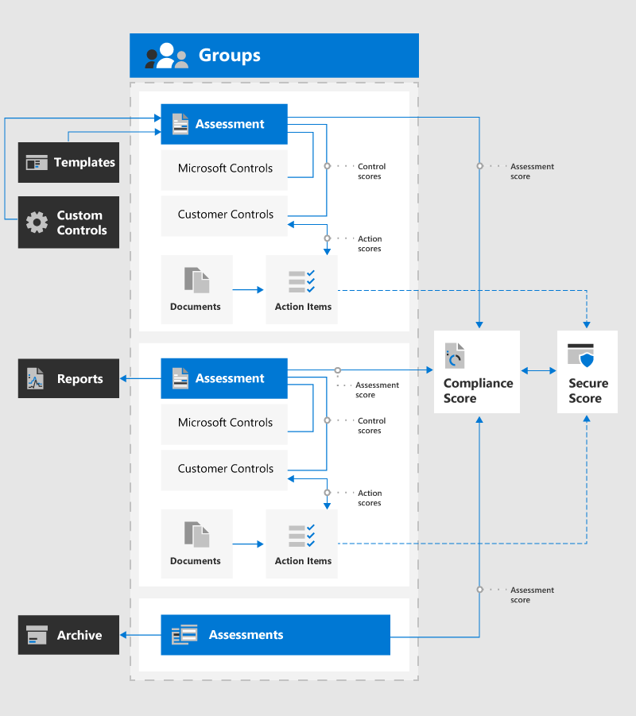

# Microsoft 合規性管理員（預覽）Microsoft Compliance Manager (Preview)

> [!IMPORTANT]
> 合規性管理員無法使用 21Vianet 運作的 Office 365、Office 365 德國、Office 365 U.S. Government Community High (GCC High)，或 Office 365 美國國防部。Compliance Manager isn't available in Office 365 operated by 21Vianet, Office 365 Germany, Office 365 U.S. Government Community High (GCC High), or Office 365 Department of Defense.

[Microsoft 合規性管理員（預覽）](https://servicetrust.microsoft.com/ComplianceManager)是免費的工作流程型風險評估工具，可讓您追蹤、指派及驗證 Microsoft cloud services 相關的規章遵循活動。[Microsoft Compliance Manager (Preview)](https://servicetrust.microsoft.com/ComplianceManager) is a free workflow-based risk assessment tool that lets you track, assign, and verify regulatory compliance activities related to Microsoft cloud services. 在 365 365 Microsoft 雲端服務的共用責任模式內，合規性管理員會協助您管理法規遵從性，以協助您在 microsoft 雲端服務的共用責任模式內管理法規遵從性。Part of your Microsoft 365, Office 365, or Azure Active Directory subscription, Compliance Manager helps you manage regulatory compliance within the shared responsibility model for Microsoft cloud services. 合規性管理員提供集中式儀表板，以查看 Microsoft service 評估的標準、法規及控制執行詳細資料和測試結果。Compliance Manager offers a centralized dashboard for viewing standards, regulations, and control implementation details and test results for Microsoft service assessments. 此外，它也包含一些工具，可讓您管理組織特有的自訂控制項實施和合規性追蹤。It also includes tools allowing you to manage custom control implementations and compliance tracking specific to your organization.

您的組織可以使用合規性管理員：With Compliance Manager, your organization can:
  
- 將針對您的組織適用之標準及規章的相容性自我評估，結合 Microsoft 提供給審計員和監管者的詳細規範資訊。Combine detailed compliance information Microsoft provided to auditors and regulators about its cloud services with your compliance self-assessment for standards and regulations applicable for your organization. 這包括國際標準組織（ISO）的標準和規章，全國標準和技術研究院（NIST），「健康保險流通與責任法案（HIPAA）」（一般資料）保護規定（GDPR）及許多其他。These include standards and regulations outlined by the International Organization for Standardization (ISO), the National Institute of Standards and Technology (NIST), the Health Insurance Portability and Accountability Act (HIPAA), the General Data Protection Regulation (GDPR), and many others.
- 可讓您指派、追蹤及記錄合規性與評估相關的活動，從而協助貴組織跨小組障礙，達成您的合規性目標。Enable you to assign, track, and record compliance and assessment-related activities, which can help your organization cross team barriers to achieve your compliance goals.
- 提供符合性分數，以協助您追蹤進度，並設定審核控制的優先順序，以協助降低組織面臨風險的風險。Provide a Compliance Score to help you track your progress and prioritize auditing controls that help reduce your organization's exposure to risk.
- 為您提供安全的存放庫，以上傳和管理與您的合規性活動相關的證據及其他專案。Provide a secure repository for you to upload and manage evidence and other artifacts related to your compliance activities.
- 產生詳盡的 Microsoft Excel 報告，記錄由 Microsoft 和您組織的審計員、管制及其他法規遵從性審查程式所執行的相容性活動。Produce richly detailed Microsoft Excel reports that document compliance activities performed by Microsoft and your organization for auditors, regulators, and other compliance reviewers.

> [!NOTE]
> 合規性管理員中提供的客戶動作為建議。在實施之前，您的組織可以評估這些建議在其各項法規環境中的效能。The customer actions provided in Compliance Manager are recommendations; it is up to your organization to evaluate the effectiveness of these recommendations in their respective regulatory environment prior to implementation. 在合規性管理員中找到的建議不得加以轉譯以保證法規遵從性。Recommendations found in Compliance Manager should not be interpreted as a guarantee of compliance.

## 合規性管理員關係Compliance Manager relationships

合規性管理員會使用多個元件，協助您進行相容性管理活動。Compliance Manager uses several components to help you with your compliance management activities. 這些元件可共同運作，為審計員提供完整的管理工作流程和無障礙的符合性報告。These components work together to provide a complete management work flow and hassle-free compliance reports for auditors.

此圖表顯示合規性管理員主要元件之間的關係：The diagram shows the relationships between the primary components of Compliance Manager:

## 群組Groups

[群組](working-with-compliance-manager.md#groups)是容器，可讓您組織評估，並在具有相同或相關客戶管理控制措施的評估之間共用一般資訊和工作流程工作。[Groups](working-with-compliance-manager.md#groups) are containers that allow you to organize Assessments and share common information and workflow tasks between Assessments that have the same or related customer-managed controls. 當同一個群組中的兩個不同評估共用客戶管理控制項時，控制項的執行詳細資料、測試及狀態會自動同步處理至群組中任何其他評估中的相同控制項。When two different Assessments in the same group share customer-managed control, the completion of implementation details, testing, and status for the control automatically synchronize to the same control in any other Assessment in the Group. 這會為群組中的每個控制項統一所指派的動作專案，並減少重複的工作。This unifies the assigned Action Items for each control across the group and reduces duplicating work. 您也可以選擇使用群組進行組織。You can also choose to use groups to organize. 依年、區域、規範標準或其他群組進行評估，以協助組織符合性工作。Assessments by year, area, compliance standard, or other groupings to help organize your compliance work.

## 評估Assessments

[評估](working-with-compliance-manager.md#assessments)是容器，可讓您根據 Microsoft 和您的組織在評估雲端服務安全性和合規性風險的組織之間的責任來組織控制。[Assessments](working-with-compliance-manager.md#assessments) are containers that allow you to organize controls based on responsibilities shared between Microsoft and your organization for assessing cloud service security and compliance risks. 評估可協助您執行符合標準及適用的資料保護標準、法規或法律所指定的資料保護保護措施。Assessments help you implement data protection safeguards specified by a compliance standard and applicable data protection standards, regulations, or laws. 其可協助您針對選取的 Microsoft 雲端服務，針對所選的工業標準來辨別您的資料保護和合規性狀況。They help you discern your data protection and compliance posture against the selected industry standard for the selected Microsoft cloud service. 評估是透過對應至憑證標準的評估中所包含的控制項實施來完成。Assessments are completed by the implementation of controls included in the Assessment that map to a certification standard.

根據預設，合規性管理員會為您的組織建立下列評估：By default, Compliance Manager creates the following Assessments for your organization:

- Office 365 ISO 27001Office 365 ISO 27001
- Office 365 NIST 800-53Office 365 NIST 800-53
- Office 365 GDPROffice 365 GDPR

評估包含數個元件：Assessments include several components:
  
- **範圍內的服務**：每個評估適用于一組特定的 Microsoft 服務。**In-Scope Services**: Each assessment applies to a specific set of Microsoft services.
- **Microsoft 受管理的控制項**：針對每個雲端服務，Microsoft 會針對適用的標準和法規，針對每個雲端服務實施和管理一組符合性控制。**Microsoft-managed controls**: For each cloud service, Microsoft implements and manages a set of compliance controls for applicable standards and regulations.
- **客戶管理的控制項**：這是當您為每個控制項採取動作時，您的組織所執行的控制項集合。**Customer-managed controls**: This is the collection of controls implemented by your organization when you take actions for each control.
- **評估分數**：評估中客戶管理控制項的總可能分數百分比。**Assessment Score**: The percentage of the total possible score for customer-managed controls in the Assessment. 這可協助您追蹤指派給每個控制項的動作的實施。This helps you track the implementation of the Actions assigned to each control.

## 控制項Controls

[控制項](working-with-compliance-manager.md#controls-and-actions)是合規性管理員中的合規性程式容器，可定義您管理符合性活動的方式。[Controls](working-with-compliance-manager.md#controls-and-actions) are compliance process containers in Compliance Manager that define how you manage compliance activities. 這些控制項會組織成與對應憑證或法規之評估架構相符的控制系列。These controls are organized into control families that align with the Assessment structure for corresponding certifications or regulations.

- **控制項識別碼**：從對應的認證或法規選取的控制項名稱。**Control ID**: The name of the selected control from the corresponding certification or regulation.
- **控制項標題**：對應之憑證或規定中的控制項識別碼的標題。**Control Title**: The title for the Control ID from the corresponding certification or regulation.
- **文章識別碼**：此欄位只適用于 GDPR 評估，並指定對應的 GDPR 文章編號。**Article ID**: This field is only for GDPR assessments and specifies the corresponding GDPR article number.
- **描述**：對應之憑證或規定中的控制項文字。**Description**: Text of control from the corresponding certification or regulation. 由於著作許可權制，ISO 標準會列出相關資訊的連結。Due to copyright restrictions, a link to relevant information is listed for ISO standards.

合規性管理員中有三種類型的控制項、 **Microsoft 管理的控制項**、**客戶管理的控制項**和**共用管理控制項**There are three types of controls in Compliance Manager, **Microsoft-managed controls**, **customer-managed controls**, and **Shared management controls**

### Microsoft 管理的控制項Microsoft-managed controls

針對每個雲端服務，Microsoft 會執行並管理一組控制項，成為 Microsoft 遵循各種標準和法規的一部分。For each cloud service, Microsoft implements and manages a set of controls as part of Microsoft's compliance with various standards and regulations. 每個控制項都提供 Microsoft 如何執行控制項的相關詳細資訊，以及該執行的方式和方式，以及由 Microsoft 和/或獨立協力廠商審計員進行測試及驗證的方式和方式。Each control provides details about how Microsoft implemented the control, and how and when that implementation was tested and validated by Microsoft and/or by an independent third-party auditor.

### 客戶管理的控制項Customer-managed controls

這是您的組織所管理的控制項集合。This is the collection of controls managed by your organization. 您的組織負責客戶管理的控制執行，做為指定標準或法規的規範程式的一部分。Your organization is responsible for customer-managed control implementation as part of your compliance process for a given standard or regulation. 客戶管理的控制項會組織成對應的認證或法規的控制系列。Customer-managed controls are organized into control families for the corresponding certification or regulation. 使用客戶管理的控制項，以執行 Microsoft 建議的建議動作做為您的合規性活動的一部分。Use the customer-managed controls to implement the recommended actions suggested by Microsoft as part of your compliance activities. 您的組織可以在每個客戶管理控制項中使用規範性指南和建議的客戶動作，以管理該控制項的實施和評估程式。Your organization can use the prescriptive guidance and recommended customer actions in each customer-managed control to manage the implementation and assessment process for that control.

評估中的客戶管理控制項也有內建工作流程管理功能，您可以用來管理和追蹤評估完成的進度。Customer-managed controls in Assessments also have built-in workflow management functionality that you can use to manage and track your progress towards Assessment completion. 使用此工作流程功能，您可以：With this workflow functionality, you can:

- 指派每個控制項的動作專案Assign Action Items for each control
- 追蹤指派的動作專案Track assigned Action Items
- 上傳控制項的實現證據Upload evidence of the implementation of the control
- 記錄控制項的測試及驗證Document the testing and validation of the control
- 將交辦事項標示為已執行和測試Mark the Action Items as implemented and tested

例如，您組織中的合規性監察官會為 IT 管理員指派交辦事項，具有執行建議動作的責任及必要許可權。For example, a Compliance Officer in your organization assigns an Action Item to an IT admin with the responsibility and necessary permissions to perform the recommended action. IT 系統管理員會上傳執行工作的證據（設定或原則設定的螢幕擷取畫面），並在完成時將交辦事項指派回合規性監察官。The IT admin uploads evidence of the implementation tasks (screenshots of configuration or policy settings) and assigns the Action Item back to the Compliance Officer when completed. 規範監察官會評估收集的證據、測試控制項的實施，並在合規性管理員中記錄執行日期和測試結果。The Compliance Officer evaluates the collected evidence, tests the implementation of the control, and records the implementation date and test results in Compliance Manager.

### 共用管理控制項Shared management controls

共用控制項是指任何 Microsoft 和客戶都共用執行責任的控制項。A shared control refers to any control where Microsoft and customers both share responsibilities for implementation. 例如，與個人篩選、帳戶和密碼管理及加密相關的控制項，都需要由 Microsoft 和客戶執行動作。For example, controls related to personnel screening, account and password management, and encryption require actions by both Microsoft and customers.

## 動作項目Action Items

[動作專案](working-with-compliance-manager.md#controls-and-actions)會包含在內建工作流程管理功能的一部分內，以供您用來管理和追蹤評估完成的進度。[Actions Items](working-with-compliance-manager.md#controls-and-actions) are included in customer-managed controls as part of the built-in workflow management functionality that you can use to manage and track your progress towards Assessment completion.

您組織中的人員可以使用合規性管理員來從其所指派的所有評估中查看客戶管理的控制項。People in your organization can use Compliance Manager to review the customer-managed controls from all Assessments for which they're assigned. 當使用者登入「合規性管理員」並開啟 [動作項目]\*\*\*\* 儀表板時，會顯示指派給他們的 [動作項目] 清單。When a user signs in to Compliance Manager and opens the **Action Items** dashboard, a list of Action Items assigned to them is displayed. 視使用者獲派的合規性管理員角色而定，他們可以提供實作或測試詳細資料、更新狀態，或是指派動作項目。Depending on the Compliance Manager role assigned to the user, they can provide implementation or test details, update the Status, or assign Action Items.

認證控制項通常是由一個人實施，並由另一個人測試。Certification controls are usually implemented by one person and tested by another. 例如，在最初指派給某一人員進行實施時，會將這些動作專案指派給下一個人員，以測試及上傳證據。For example, after Action Items initially assigned to one person for implementation are completed, those Action Items are assigned to the next person to test and upload evidence. 任何具有足夠許可權控制指派許可權的使用者都可以指派及重新指派動作專案。Any user with sufficient permissions for control assignments can assign and reassign Action Items. 這可讓您集中管理控制項指派，以及在 implementors 與測試人員之間分散的動作專案路由。This enables central management of control assignments and decentralized routing of Action Items between implementors and testers.

## 權限Permissions

合規性管理員使用以角色為基礎的存取控制權限模型。Compliance Manager uses a role-based access control permission model. 只有獲指派使用者角色的使用者才能存取合規性管理員，而每位使用者所允許的動作會受角色類型限制。Only users who are assigned a user role may access Compliance Manager, and the actions allowed by each user are restricted by role type. [查看](working-with-compliance-manager.md#permissions)顯示每個許可權的允許動作的表格。[View a table](working-with-compliance-manager.md#permissions) showing the actions allowed for each permission.

合規性管理員的入口網站管理員可以遵循下列步驟，在合規性管理員內設定其他使用者的許可權：The portal admin for Compliance Manager can set permissions for other users in within Compliance Manager by following these steps:

1. 從 **[最大**值] 下拉式功能表中，選取 [**管理員**]，然後選取 [**設定**]。From the top **More** drop-down menu, select **Admin**, then **Settings**.
2. 從這裡，選取您要指派的角色，然後新增您要指派給該角色的員工。From here, select the role you want to assign, and then add the employee you want to assign to that role. 然後，使用者將能夠執行某些動作。Users will then be able to perform certain actions.

此外，在[Azure Active Directory （AZURE AD）中被指派全域讀卡機角色](https://docs.microsoft.com/azure/active-directory/users-groups-roles/directory-assign-admin-roles#global-reader)的使用者，具有存取合規性管理員的唯讀許可權。In addition, users who are assigned the [Global Reader role in Azure Active Directory (Azure AD)](https://docs.microsoft.com/azure/active-directory/users-groups-roles/directory-assign-admin-roles#global-reader) have read-only permission to access Compliance Manager. 不過，他們無法在合規性管理員內編輯資料或執行任何動作。However, they cannot edit data or perform any actions within Compliance Manager.

不再有預設**來賓存取**角色。There is no longer a default **Guest access** role. 每個使用者都必須獲指派角色，才能在合規性管理員中存取及作業。Each user must be assigned a role in order to access and work within Compliance Manager.
  
## 管理證據Manage evidence

合規性管理員可以在測試及驗證客戶管理的控制項時，儲存您的執行工作證據。Compliance Manager can store evidence of your implementation tasks around testing and validation of customer-managed controls. 證據包括檔、試算表、螢幕擷取畫面、圖像、腳本、腳本輸出檔及其他檔案。Evidence includes documents, spreadsheets, screenshots, images, scripts, script output files, and other files. 合規性管理員也會自動接收遙測，並為與安全分數整合的動作專案建立證據記錄。Compliance Manager also automatically receives telemetry and creates an evidence record for Action Items that are integrated with Secure Score. 任何上傳到合規性管理員的資料，都是儲存在 Microsoft Cloud Storage sites 的美國地區。Any data uploaded as evidence into Compliance Manager is stored in the United States on Microsoft Cloud Storage sites. 此資料會複製到位於東南亞和西歐的 Azure 地區。This data is replicated across Azure regions located in Southeast Asia and Western Europe.

## 範本Templates

合規性管理員提供預先設定的[範本](working-with-compliance-manager.md#templates)進行評估，並可讓您針對符合性需求為客戶管理的控制項建立自訂的範本。Compliance Manager provides pre-configured [templates](working-with-compliance-manager.md#templates) for Assessments and allows you to create customized templates for customer-managed controls for your compliance needs. 新的範本是透過從 Excel 檔案中匯入控制項資訊來建立，或是您可以從現有範本的複本建立範本。New templates are created by importing controls information from an Excel file, or you can create a template from a copy of an existing template.

合規性管理員隨附的預先設定的範本包括：The pre-configured templates included with Compliance Manager are:

1. [ISO 27001:2013ISO 27001:2013](https://go.microsoft.com/fwlink/?linkid=2109073)
2. [ISO 27018:2014ISO 27018:2014](https://go.microsoft.com/fwlink/?linkid=2109074)
3. [ISO 27701:2019ISO 27701:2019](https://go.microsoft.com/fwlink/?linkid=2113025)
4. [NIST 800-53 Rev 4NIST 800-53 Rev. 4](https://go.microsoft.com/fwlink/?linkid=2109075)
5. [NIST 800-171NIST 800-171](https://go.microsoft.com/fwlink/?linkid=2108867)
6. [NIST Cybersecurity Framework （CSF）NIST Cybersecurity Framework (CSF)](https://go.microsoft.com/fwlink/?linkid=2108868)
7. [雲端安全性同盟（CSA） Cloud Controls 矩陣（CCM）3.0。1Cloud Security Alliance (CSA) Cloud Controls Matrix (CCM) 3.0.1](https://go.microsoft.com/fwlink/?linkid=2109076)
8. [聯邦金融機構檢查委員會（FFIEC）資訊安全性手冊Federal Financial Institutions Examination Council (FFIEC) Information Security Booklet](https://go.microsoft.com/fwlink/?linkid=2109077) 
9. [HIPAA](https://go.microsoft.com/fwlink/?linkid=2109078) / 高[科技](https://go.microsoft.com/fwlink/?linkid=2109079)[HIPAA](https://go.microsoft.com/fwlink/?linkid=2109078) / [HITECH](https://go.microsoft.com/fwlink/?linkid=2109079)
10. [FedRAMP 適中FedRAMP Moderate](https://go.microsoft.com/fwlink/?linkid=2108869)
11. [歐盟 GDPREuropean Union GDPR](https://go.microsoft.com/fwlink/?linkid=2108870)
12. [加州消費者隱私權法案（CCPA）](https://go.microsoft.com/fwlink/?linkid=2108871) （預覽）[California Consumer Privacy Act (CCPA)](https://go.microsoft.com/fwlink/?linkid=2108871) (Preview)
13. [IRAP](https://go.microsoft.com/fwlink/?linkid=2113709) / [澳大利亞政府版 ISM](https://go.microsoft.com/fwlink/?linkid=2113024) （預覽）[IRAP](https://go.microsoft.com/fwlink/?linkid=2113709) / [Australian Government ISM](https://go.microsoft.com/fwlink/?linkid=2113024) (Preview)
14. [Microsoft 365 資料保護基準Microsoft 365 Data Protection Baseline](compliance-score-methodology.md#initial-score-based-on-microsoft-365-data-protection-baseline)

## 合規性分數Compliance Score

[Microsoft 規範分數（預覽）](compliance-score.md)是 microsoft 365 規範中心中的一項功能，可協助您瞭解組織的合規性狀況。[Microsoft Compliance Score (Preview)](compliance-score.md) is a feature in the Microsoft 365 compliance center that helps you understand your organization’s compliance posture. 它會計算以風險為基礎的分數，用以衡量您在完成動作方面的進展，以協助降低資料保護和法規標準的風險。It calculates a risk-based score measuring your progress in completing actions that help reduce risks around data protection and regulatory standards. 知道您的整體合規性分數可協助您的組織瞭解和管理法規遵從性。Knowing your overall compliance score helps your organization understand and manage compliance. 瞭解[如何計算您的合規性分數](compliance-score-methodology.md)。Understand [how your compliance score is calculated](compliance-score-methodology.md).
  
> [!IMPORTANT]
> 合規性分數不會明確組織符合任何特定標準或法規的絕對度量。Compliance Score does not express an absolute measure of organizational compliance with any particular standard or regulation. 它表示您已採用控制的程度，可降低個人資料和個別隱私權的風險。It expresses the extent to which you have adopted controls which can reduce the risks to personal data and individual privacy. 沒有任何服務可以保證您符合標準或法規，而且合規性分數不應該以任何方式轉譯為保證。No service can guarantee that you are compliant with a standard or regulation, and the Compliance Score should not be interpreted as a guarantee in any way.

## 安全分數整合Secure Score integration

合規性管理員已與[Microsoft 安全評分](../security/mtp/microsoft-secure-score.md)整合，以自動將安全分數信用用於同步處理動作專案的合規性分數。Compliance Manager is integrated with [Microsoft Secure Score](../security/mtp/microsoft-secure-score.md) to automatically apply Secure Score credit to the Compliance Score for synced Action Items. 這可為個別動作專案或全域動作進行設定，並提供安全分數的更新。This is configurable for individual Action Items or all actions globally, and provides updates from Secure Score.

例如，您有在組織中啟用 Azure 版權管理的安全相關需求，也適用于與規範相關的動作專案。For example, you have a security-related requirement for activating Azure Rights Management in your organization that also applies to a compliance-related Action Item. 當 Azure Rights Management 以安全分數方式啟動並處理時，合規性管理員會收到更新通知，且措施專案的分數會自動更新為完成信用。When Azure Rights Management is activated and processed by Secure Score, Compliance Manager receives notification of the update, and the score for the Action Item automatically updates with completion credit.

## 準備好開始使用了嗎？Ready to get started?

開始[使用合規性管理員](working-with-compliance-manager.md)來管理組織的法規遵從性活動。Start [working with Compliance Manager](working-with-compliance-manager.md) to manage regulatory compliance activities for your organization.

## 資源Resources

- [互動式指南：使用合規性管理員評估及增強您的資料保護控制Interactive guide: Assess and enhance your data protection controls with Compliance Manager](https://content.cloudguides.com/guides/Compliance%20Manager)
- [Microsoft 安全性、隱私權和規範技術社區Microsoft Security, Privacy, and Compliance Tech Community](https://techcommunity.microsoft.com/t5/Security-Privacy-Compliance/ct-p/SecurityPrivacyCompliance)
