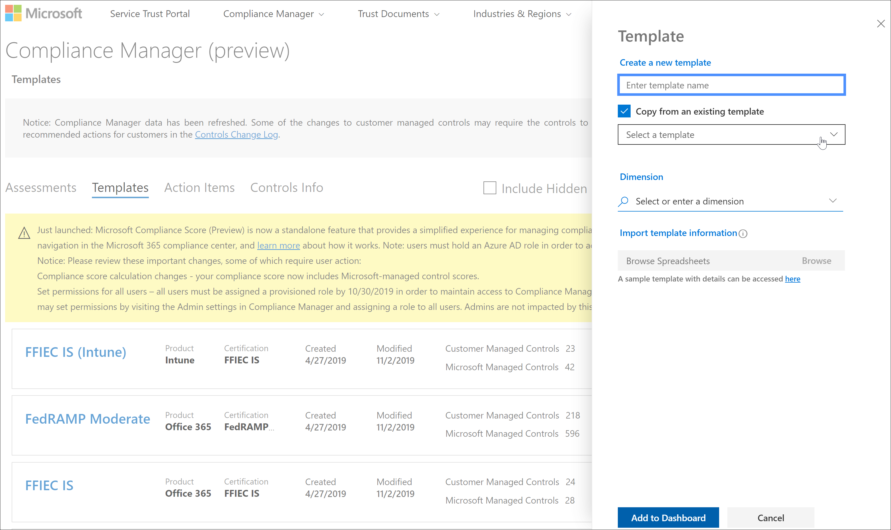

# Microsoft 合規性分數（預覽）更新

 本文提供對[Microsoft 合規性分數](compliance-score.md)和[Microsoft 合規性管理員](compliance-manager-overview.md)未來更新的詳細資訊。 深入瞭解其[關聯](compliance-score-release-notes.md#compliance-score-relationship-to-compliance-manager)性。

## 改進的範本建立和更新程式

我們正在簡化針對評估的匯入、匯出及修改範本的處理常式。 新的經驗可讓您更輕鬆地將您自己的評估帶入法規遵從性分數並保持更新。

### 目前的處理常式

在合規性管理員中建立範本的方式有兩種。 您可以複製現有的範本，也可以將範本資料從 Excel 試算表匯入新的範本。 在 [**範本**] 頁面上，選取 [**新增範本**]，以建立全新的範本，方法是輸入名稱、選取 [維度]，然後使用特定的格式和架構上傳 Excel 檔案。 或者，您可以選取 [**從現有範本複製**] 方塊，選取要複製的範本，然後驗證尺寸，如下圖所示。 若要自訂您的範本，必須先選取 [**新增自訂控制項**之後建立範本]，即可開始執行[多步驟](working-with-compliance-manager.md#templates)程式。

### 變更的功能

我們要讓您更輕鬆地建立新的範本。 在單一步驟**擴充**過程中，您可以將動作和控制項的試算表新增至現有的 Microsoft 範本，以製作您自己的自訂版本。 在 [**範本**] 飛入窗格上，選取 [**從通用範本建立副檔名**] 核取方塊，如下圖所示。 然後，您會使用新的 Excel 格式（而不是目前的複雜格式）來新增自訂。 這個新程式會取代**現有範本**的目前副本，並**新增自訂控制項**函數。

每次使用下列所述的版本設定程式更新原始評估時，您的自訂評估會繼承這些更新，並保留您的自訂控制項。

我們也讓您更容易修改現有的範本。 您可以匯出範本，在相同的活頁簿中進行變更，然後使用儲存的編輯匯入。

## 版本設定通知和控制

您的組織將會在下一個版本的合規性分數和合規性管理員中接收更新的評估，以協助您與認證和法規更新相符。

接下來，每當有可供評估的範本或改進動作使用更新時，提醒圖示會通知您已準備好更新。 當您按一下該圖示時，會快顯視窗來說明更新，並提示您接受。 以下是評估的版本設定警示範例：

選取警示圖示會顯示彈出窗格，說明更新並提示您接受：

## 一般動作會在群組間同步處理狀態

如果您的組織有多個評估群組，**技術**動作的行為（也就是影響整個組織的動作）將會變更。 群組間的任何重複動作都會合並成一個單一的動作。 該單一動作會包含重複的版本中所有上傳的記事及證據。 使用此變更，當技術動作屬於相同群組時，其行為會與目前相同。 在一個群組或評估中對動作所做的任何變更現在都會反映在所有的實例中。 「 **實施」狀態**、「**實施 Dat**」、「**測試狀態**」及「**測試日期** 」會反映最新的更新。

## 語言支援

由於英文：中文（簡體）、中文（繁體）、法文、德文、義大利文、日文、韓文、葡萄牙文（巴西）、俄語及西班牙文，下列語言仍提供合規性分數。
