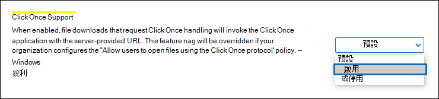

# 使用 Microsoft Edge 中的 eDiscovery 匯出工具Use the eDiscovery Export Tool in Microsoft Edge

由於最近的 Microsoft Edge 版本變更，因此預設不再啟用 ClickOnce 支援。As a result of recent changes to the newest version of Microsoft Edge, ClickOnce support is no longer enabled by default. 若要繼續使用 eDiscovery 匯出工具下載內容搜尋或 eDiscovery 搜尋結果，您需要使用[Microsoft Internet Explorer](https://support.microsoft.com/help/17621/internet-explorer-downloads) ，或在最新版的 microsoft Edge 中啟用 ClickOnce 支援。To continue using the eDiscovery Export Tool to download Content Search or eDiscovery search results, you either need to use [Microsoft Internet Explorer](https://support.microsoft.com/help/17621/internet-explorer-downloads) or enable ClickOnce support in the newest version of Microsoft Edge.

## 在 Microsoft Edge 中啟用 ClickOnce 支援Enable ClickOnce support in Microsoft Edge

1. 在 Microsoft Edge 中，移至**edge://flags/#edge-按一下一次**。In Microsoft Edge, go to **edge://flags/#edge-click-once**.

2. 在下拉式清單中，如果現有的值設為**Default**或**Disabled** ，請將其變更為**Enabled**。If the existing value is set to **Default** or **Disabled** in the dropdown list, change it to **Enabled**.

   

3. 向下滾動至瀏覽器視窗底部，然後按一下 [**重新開機**] 重新開機 Edge。Scroll down to the bottom of the browser window and click **Restart** to restart Edge.

   

**附注：** 組織可以使用「群組原則」來停用 ClickOnce 支援。**Note:** Organizations can use Group Policy to disable ClickOnce support. 若要檢查是否有 ClickOnce 支援的組織原則，請移至**edge://policy**。To check if there is an organizational policy for ClickOnce support, go to **edge://policy**. 下列螢幕擷取畫面顯示整個組織內啟用 ClickOnce。The following screenshot shows that ClickOnce is enabled across the entire organization. 如果此原則值設定為**false**，您將需要與組織中的系統管理員聯繫。If this policy value is set to **false**, you will need to contact an admin in your organization.

## 安裝並執行 eDiscovery 匯出工具Install and run the eDiscovery Export Tool

1. 在 [內容搜尋] 或 [eDiscovery 案例] 中，按一下 [匯出] 之飛入頁面上的 [**下載結果**]。Click **Download results** on the flyout page of an export in Content Search or an eDiscovery case.

   ![按一下彈出頁面上的 [下載結果] 以下載搜尋結果](../media/ClickOnceExport1.png)

2. 系統會提示您確認啟動工具，請按一下 [**開啟**]。You will be prompted with a confirmation to launch the tool, Click **Open**.

   ![按一下 [開啟] 以啟動 eDiscovery 匯出工具](../media/ClickOnceimage4.png)

   若尚未安裝 eDiscovery 匯出工具，系統會提示您顯示安全性警告。If the eDiscovery Export Tool isn't installed, you will be prompted with a Security Warning, 

   ![按一下 [安裝] 以安裝 eDiscovery 匯出工具](../media/ClickOnceimage5.png)

3. 按一下 [安裝]\*\*\*\*。Click **Install**. 安裝完畢後，會自動啟動 [匯出工具]。After it's installed, the export tool will launch automatically.

如需詳細資訊，請參閱下列主題：For more information, see the following topics:

- [匯出內容搜尋結果Export Content Search results](export-search-results.md)

- [如何在 Microsoft Edge 中啟用實驗旗標How to enable experiment flags in Microsoft Edge](https://microsoftedgesupport.microsoft.com/hc/articles/360034075294-How-to-enable-experiment-flags-in-Microsoft-Edge-Insider-channels)
