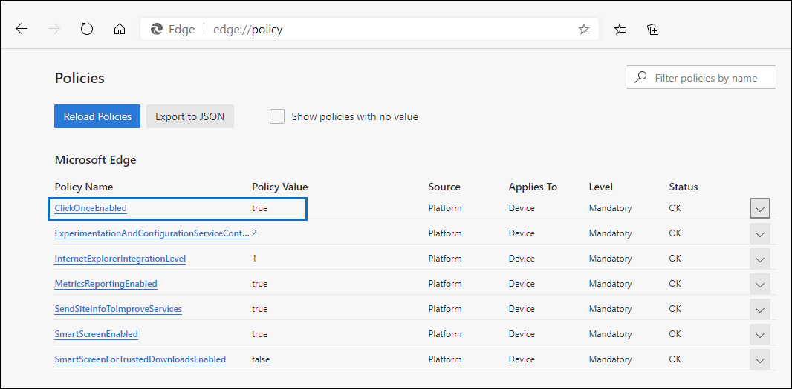

# 在 Microsoft Edge 中使用 Office 365 電子文件探索匯出工具Use the Office 365 eDiscovery Export Tool in Microsoft Edge

由於 Microsoft edge 的最新變更，依預設不會再啟用 ClickOnce 支援方法。As a result of recent changes to Microsoft Edge, ClickOnce support is no longer enabled by default. 若要繼續使用 Microsoft Office 365 電子文件探索匯出工具來下載內容搜尋] 或 [eDiscovery 搜尋結果，您需要使用[Microsoft Internet Explorer](https://support.microsoft.com/help/17621/internet-explorer-downloads)或啟用 ClickOnce 支援 Microsoft Edge 中。To continue using the Microsoft Office 365 eDiscovery Export Tool to download Content Search or eDiscovery search results, you either need to use [Microsoft Internet Explorer](https://support.microsoft.com/help/17621/internet-explorer-downloads) or enable ClickOnce support in Microsoft Edge.

## 如何啟用 ClickOnce 支援 Microsoft Edge 中How to enable ClickOnce support in Microsoft Edge

1. 在 Microsoft Edge、 瀏覽至**edge://flags/#edge-click-once**。In Microsoft Edge, navigate to **edge://flags/#edge-click-once**.

2. 如果現有的值設為**預設值**] 或 [**已停用**在下拉式清單中，則會變更為 [**已啟用**。If the existing value is set to **Default** or **Disabled** in the dropdown list, change it to **Enabled**.
    
   

3. 捲動至底部的瀏覽器視窗，然後按一下 [重新啟動 Edge 的 [**重新啟動**。Scroll down to the bottom of the browser window and click **Restart** to restart Edge.

   

**附註：** 組織可以使用群組原則停用 ClickOnce 支援。**Note:** Organizations can use Group Policy to disable ClickOnce support. 若要檢查是否有 ClickOnce 支援的組織原則，請瀏覽至 [ **edge://policy**。To check if there is an organizational policy for ClickOnce support, navigate to **edge://policy**. 下列螢幕擷取畫面顯示 ClickOnce 已啟用整個組織。The following screenshot shows that ClickOnce is enabled across the entire organization. 如果此原則值設為**false**，您必須連絡貴組織中的系統管理員。If this policy value is set to **false**, you will need to contact an admin in your organization.

## 安裝和執行 Office 365 電子文件探索匯出工具Install and run the Office 365 eDiscovery Export Tool

1. 在匯出內容搜尋] 或 [eDiscovery 案例中的彈出式頁面上，按一下 [**下載結果**。Click **Download results** on the flyout page of an export in Content Search or an eDiscovery case.

   ![按一下 [下載結果在彈出式視窗] 頁面上，若要下載搜尋結果](../media/ClickOnceExport1.png)

2. 您將會出現確認提示來啟動工具，請按一下 [**開啟**。You will be prompted with a confirmation to launch the tool, Click **Open**.

   ![按一下 [開啟] 以啟動 eDiscovery 匯出工具](../media/ClickOnceimage4.png)

   如果未安裝 Microsoft Office 365 電子文件探索匯出工具，將會提示您安全性警告，If the Microsoft Office 365 eDiscovery Export Tool isn't installed, you will be prompted with a Security Warning, 

   ![按一下 [安裝] 來安裝 eDiscovery 匯出工具](../media/ClickOnceimage5.png)

3. 按一下 [安裝]\*\*\*\*。Click **Install**. 安裝之後，匯出工具會自動啟動。After it's installed, the export tool will launch automatically.

如需詳細資訊，請參閱下列主題：For more information, see the following topics:

- [匯出內容搜尋結果Export Content Search results](export-search-results.md)

- [如何啟用 Microsoft Edge 中的實驗旗標How to enable experiment flags in Microsoft Edge](https://microsoftedgesupport.microsoft.com/hc/articles/360034075294-How-to-enable-experiment-flags-in-Microsoft-Edge-Insider-channels)
