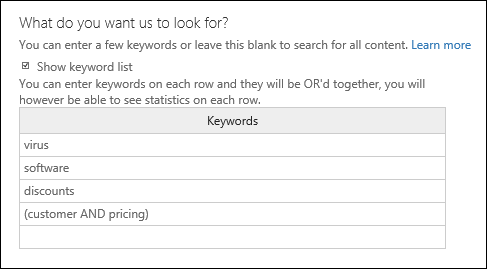

# <a name="feature-reference-for-content-search"></a>內容搜尋的功能參考

本文說明內容搜尋的功能。

## <a name="content-search-limits"></a>內容搜尋限制

- 如需 [內容搜尋] 適用限制的說明，請參閱[內容搜尋的限制](limits-for-content-search.md)。
  
- Microsoft 會收集服務中所有組織執行的內容搜尋的效能資訊。 雖然搜尋查詢的複雜性可能會影響搜尋時間，會影響搜尋所需時間的最大因素是搜尋的信箱數量。 雖然 Microsoft 不對搜尋時間提供服務等級協定，下表根據搜尋中包含的信箱數量列出內容搜尋的平均搜尋時間。
  
  |**信箱數目**|**平均搜尋時間**|
  |:-----|:-----|
  |100  <br/> |30 秒  <br/> |
  |1,000  <br/> |45 秒  <br/> |
  |10,000  <br/> |4 分鐘  <br/> |
  |25,000  <br/> |10 分鐘  <br/> |
  |50,000  <br/> |20 分鐘  <br/> |
  |100,000  <br/> |25 分鐘  <br/> |
  |||
  
## <a name="building-a-search-query"></a>建立搜尋查詢

如需建立搜尋查詢、使用布林搜尋運算子和搜尋條件，以及搜尋與組織外部使用者共用的機密資訊類型和內容的詳細資訊，請參閱[內容搜尋的關鍵字查詢和搜尋條件](keyword-queries-and-search-conditions.md)。
  
使用關鍵字清單建立搜尋查詢時，請記住下列事項。
  
- 您必須選取 **[顯示關鍵字清單]** 核取方塊，然後在不同的列輸入每個關鍵字來建立搜尋查詢，其中每個列的關鍵字 (或關鍵字字詞) 是用 **OR** 運算子連接。 如果您在輸入關鍵字之後，於關鍵字方塊中貼上關鍵字清單或按下 **Enter** 鍵，就不會使用 **OR** 運算子將其連接。 以下是如何新增關鍵字清單的不正確和正確範例。
    
    **不正確**
    
    
  
    **正確**
    
    
  
- 您也可以在 Excel 檔案或純文字檔案中準備關鍵字或關鍵字片語的清單，然後將您的清單複製並貼入關鍵字清單中。 若要這麼做，您必須選取 **[顯示關鍵字清單]** 核取方塊。 然後在關鍵字清單的第一列按一下，並貼上您的清單。 來自 Excel 或文字檔案的每一行都會貼到關鍵字清單中的不同列。 
    
- 使用關鍵字清單建立查詢之後，最好先驗證搜尋查詢語法，以讓該搜尋查詢成為您想要的查詢。 在詳細資料窗格的 **[查詢]** 下顯示的搜尋查詢中，關鍵字使用文字 **(c:s)** 分隔。 這表示關鍵字是使用與 **OR** 運算子類似功能的邏輯運算子連接。 同樣地，如果您的搜尋查詢中包含條件，關鍵字與條件以文字 **(c:c)** 分隔。 這表示關鍵字是使用與 **AND** 運算子類似功能的邏輯運算子與條件連接。 以下是使用關鍵字清單與條件時產生的搜尋查詢的範例 (顯示在 [詳細資料] 窗格中)。 
    
    
  
- 執行內容搜尋時，Microsoft 365 會自動檢查您的搜尋查詢中是否有不受支援的字元，以及可能未大寫的布林值運算子。 不支援的字元通常會隱藏起來，且通常會導致搜尋錯誤或傳回非預期的結果。 如需所檢查不受支援字元的詳細資訊，請參閱[檢查您的內容搜尋查詢是否有錯誤](check-your-content-search-query-for-errors.md)。
    
- 如果您有包含非英文字元 (例如中文字元) 關鍵字的搜尋查詢時，您可以按一下 **[查詢語言-國家/地區]**![內容搜尋中的 [查詢語言-國家/地區] 圖示](../media/8d4b60c8-e1f1-40f9-88ae-ee2a7eca0886.png)，然後選取搜尋的語言-國家/地區文化特性代碼值。 預設的語言-國家/地區為中性。 如何判斷您是否需要變更內容搜尋的語言設定？ 如果您確定您要搜尋的內容位置包含非英文字元，但搜尋卻未傳回任何結果，這可能是語言設定所造成。 
  
## <a name="partially-indexed-items"></a>部分編製索引的項目

- 估計的搜尋結果中會包含信箱中部分編製索引的項目。 估計的搜尋結果中不會包括來自 SharePoint 和 OneDrive 的部分編製索引項目。 如需詳細資訊，請參閱[電子文件探索中部分編製索引的項目](partially-indexed-items-in-content-search.md)。

## <a name="searching-onedrive-accounts"></a>搜尋 OneDrive 帳戶

- 若要收集組織中 OneDrive 網站的 URL 清單，請參閱[建立組織中所有 OneDrive 位置的清單](/onedrive/list-onedrive-urls)。 本文章中的這個指令碼會建立文字檔案，其中包含所有 OneDrive 網站的清單。 若要執行此指令碼，您必須安裝並使用 SharePoint Online 管理命令介面。 請務必將您組織 MySite 網域的 URL 附加至您要搜尋的每個 OneDrive 網站。 這是包含您所有 OneDrive 的網域；例如，`https://contoso-my.sharepoint.com`。 以下是使用者 OneDrive 網站的 URL 範例：`https://contoso-my.sharepoint.com/personal/sarad_contoso_onmicrosoft.com`。
    
    在人員的使用者主體名稱 (UPN) 變更的少數情況下，其 OneDrive 位置的 URL 將會變更以納入新的 UPN。 如果發生這種情況，您必須透過新增使用者的新 OneDrive URL 並移除舊 URL 來修改內容搜尋。 如需詳細資訊，請參閱 [UPN 變更將如何影響 OneDrive URL](/onedrive/upn-changes)。
  
## <a name="searching-microsoft-teams-and-microsoft-365-groups"></a>搜尋 Microsoft Teams 和 Microsoft 365 群組

您可以搜尋與 Microsoft Teams 或 Microsoft 365 相關聯的信箱。 因為 Microsoft Teams 建置於 Microsoft 365 群組上，搜尋它們的方式很類似。 在這兩個情況下，只會搜尋群組或團隊信箱。 不會搜尋群組或團隊成員的信箱。 若要進行搜尋，您必須特別將它們新增至搜尋。
  
搜尋 Microsoft Teams 和 Microsoft 365 群組中的內容時，請記住下列事項。
  
- 若要搜尋位於 Teams 和 Microsoft 365 群組中的內容，您必須指定與團隊或群組相關聯的信箱和 SharePoint 網站。

- 來自私人頻道的內容會儲存在每位使用者的信箱，而不會儲存在小組信箱。 若要搜尋私人頻道中的內容，請參閱[私人頻道進階電子文件探索](/microsoftteams/ediscovery-investigation#ediscovery-of-private-channels) (部分機器翻譯)。
    
- 在 Exchange Online 中執行 **Get-UnifiedGroup** Cmdlet，以檢視團隊或 Microsoft 365 群組的內容。 這是取得與團隊或群組相關聯的網站 URL 的絕佳方法。 例如，下列命令會顯示名為「資深領導團隊」的 Microsoft 365 群組的所選屬性： 
    
  ```text
  Get-UnifiedGroup "Senior Leadership Team" | FL DisplayName,Alias,PrimarySmtpAddress,SharePointSiteUrl
  DisplayName            : Senior Leadership Team
  Alias                  : seniorleadershipteam
  PrimarySmtpAddress     : seniorleadershipteam@contoso.onmicrosoft.com
  SharePointSiteUrl      : https://contoso.sharepoint.com/sites/seniorleadershipteam
  ```

    > [!NOTE]
    > 若要執行 **Get-UnifiedGroup** Cmdlet，您必須獲指派 Exchange Online 中的「僅檢視收件者」角色或者為獲指派「僅檢視收件者」角色之角色群組的成員。 
  
- 搜尋使用者的信箱時，不會搜尋使用者所隸屬的任何團隊或 Microsoft 365 群組。 同樣地，當您搜尋團隊或 Microsoft 365 群組時，只會搜尋您指定的群組信箱及群組網站。 不會搜尋群組成員的信箱和商務用 OneDrive 帳戶，除非您明確地將它們新增至搜尋。

- 若要取得團隊或 Microsoft 365 群組的成員清單，您可以在 Microsoft 365 系統管理中心的 **[常用] \> [群組]** 頁面上檢視內容。 或者，您可以在 Exchange Online PowerShell 中執行下列命令： 

  ```powershell
  Get-UnifiedGroupLinks <group or team name> -LinkType Members | FL DisplayName,PrimarySmtpAddress
  ```

    > [!NOTE]
    > 若要執行 **Get-UnifiedGroupLinks** Cmdlet，您必須獲指派 Exchange Online 中的「僅檢視收件者」角色或者為獲指派「僅檢視收件者」角色之角色群組的成員。 
  
- 屬於 Teams 頻道一部分的交談會儲存在與團隊相關聯的信箱中。 同樣地，團隊成員在頻道中共用的檔案會儲存在團隊的 SharePoint 網站上。 因此，您必須將團隊信箱和 SharePoint 網站新增為內容位置，才能搜尋頻道中的交談和檔案。
    
- 或者，屬於 Teams 中聊天清單的交談會儲存在參與聊天的使用者的 Exchange Online 信箱中。 而使用者在聊天交談中共用的檔案會儲存在共用檔案的使用者的商務用 OneDrive 帳戶中。 因此，您必須將個別使用者信箱和商務用 OneDrive 帳戶新增為內容位置，才能搜尋聊天清單中的交談和檔案。
    
    > [!NOTE]
    > 在 Exchange 混合式部署中，具有內部部署信箱的使用者可能會參與屬於 Teams 中聊天清單的交談。 在此情況下，來自這些交談的內容也可供搜尋，因為針對具有內部部署信箱的使用者，這些內容會儲存到雲端式存放區域 (稱為 *內部部署使用者的雲端式信箱*)。 如需詳細資訊，請參閱[搜尋內部部署使用者的 Teams 聊天資料](search-cloud-based-mailboxes-for-on-premises-users.md)。
  
- 每個團隊或團隊頻道包含一個 Wiki，用於記筆記和進行共同作業。 Wiki 的內容會自動儲存至 .mht 格式的檔案中。 此檔案會儲存在團隊 SharePoint 網站上的 Teams Wiki 資料文件庫中。 您可以使用「內容搜尋」工具來搜尋 Wiki，方法是將團隊的 SharePoint 網站指定為要搜尋的內容位置。

    > [!NOTE]
    > 搜尋團隊或頻道的 Wiki 功能 (搜尋團隊的 SharePoint 網站時) 是在 2017 年 6 月 22 日推出。 在該日期當日或之後儲存或更新的 Wiki 頁面可供搜尋。 在該日期之前儲存或更新的 Wiki 頁面無法供搜尋。

- Teams 頻道中的會議及電話的摘要資訊也會儲存在撥入會議或電話使用者的信箱中。 這表示您可以使用內容搜尋來搜尋這些摘要記錄。 摘要資訊包含：
  
  - 會議或通話的日期、開始時間、結束時間和持續期間

  - 每個參與者加入或離開會議或通話的日期及時間

  - 傳送到語音信箱的通話

  - 未接來電或無人接聽的來電

  - 來電轉接，以兩個不同通話的形式呈現

  可能需要最長達 8 小時的時間，會議和通話摘要記錄才可供搜尋。

  在搜尋結果中，會在 **[類型]** 欄位中將會議摘要識別為 **[會議]**，以及將通話摘要識別為 **[通話]**。 此外，屬於 Teams 頻道和 1xN 聊天的交談，會在 **[類型]** 欄位中識別為 **IM**。
  
  ![Teams 會議、通話和 1xN 聊天都可在 [類型] 欄位中識別](../media/O365-ContentSearch-Teams-MessageKind.png)

   如需詳細資訊，請參閱 [Microsoft Teams 啟動通話跟會議的電子文件探索](https://techcommunity.microsoft.com/t5/microsoft-teams-blog/microsoft-teams-launches-ediscovery-for-calling-and-meetings/ba-p/210947)。

- Teams 頻道、1:1 聊天和 1xN 聊天中的應用程式產生的卡片內容儲存在信箱中，可以進行搜尋。 *卡片* 是一個 UI 容器，用於儲存簡短的內容片段。 卡片可以有多個内容和附件，還可以包含可以觸發卡片動作的按鈕。 如需詳細資訊，請參閱 [卡片](/microsoftteams/platform/task-modules-and-cards/what-are-cards)。

  與其他 Teams 內容一樣，儲存卡片內容的位置取決於卡片的使用位置。 Teams 頻道中使用的卡片之內容儲存在 Teams 群組信箱中。 1:1 和 1xN 聊天的卡片內容儲存在聊天參與者的信箱中。

  要搜尋卡片內容，可以使用 `kind:microsoftteams` 或 `itemclass:IPM.SkypeTeams.Message` 搜尋條件。 檢閲搜尋結果時，Teams 頻道中機器人程式產生之卡片內容的 **寄件者/作者** 電子郵件屬性為 `<appname>@teams.microsoft.com` ，其中 `appname` 是產生卡片內容的應用程式之名稱。 如果卡片內容是由使用者生成的，則 **寄件者/作者** 的值識別使用者。

  在內容搜尋結果中檢視卡片內容時，內容顯示為訊息的附件。 附件名為 `appname.html`，其中 `appname` 是產生卡片內容之應用程式的名稱。 下方的螢幕擷取畫面顯示了卡片內容 (對於名為 Asana 的應用程式) 在Teams 和搜尋結果中的顯示方式。

  **Teams 中的卡片内容**

  

  **搜尋結果中的卡片内容**
  
  

  > [!NOTE]
  > 要在此時顯示搜尋結果中卡片內容中之影像 (如上一螢幕擷取畫面中的核取記號)，您必須登入 Teams (在用於檢視搜尋結果的同一瀏覽器工作階段中之不同索引標籤中的 https://teams.microsoft.com) 處)。 否則，將顯示影像預留位置。

- 您可以使用 **Kind** 電子郵件屬性或 **[郵件類型]** 搜尋條件來搜尋 Teams 中的專屬內容。
  
  - 若要在關鍵字搜尋查詢中使用 **Kind** 屬性，請在搜尋查詢的 **[關鍵字]** 方塊中輸入 `kind:microsoftteams`。

    
  
  - 若要使用搜尋條件，請新增 **[郵件類型]** 條件，然後使用 `microsoftteams` 值。

    

   條件會使用 **AND** 運算子以邏輯方式連接至關鍵字查詢。 這表示項目必須同時符合關鍵字查詢和搜尋條件，才能在搜尋結果中傳回。 如需詳細資訊，請參閱[內容搜尋的關鍵字查詢和搜尋條件](keyword-queries-and-search-conditions.md#guidelines-for-using-conditions)中的「使用條件的指導方針」小節。
  
## <a name="searching-yammer-groups"></a>搜尋 Yammer 群組

您可以使用 **ItemClass** 電子郵件屬性或 **類型** 搜尋條件來搜尋 Yammer 群組中的特定交談項目。

  - 若要使用 **ItemClass** 屬性做為關鍵字搜尋查詢的一部分，請在搜尋查詢的 **[關鍵字]** 方塊中，輸入下列其中一種 (或所有)「屬性：值組」：

     - ItemClass:IPM.Yammer.message
     - ItemClass:IPM.Yammer.poll
     - ItemClass:IPM.Yammer.praise
     - ItemClass:IPM.Yammer.question
  
    例如，您可以使用下列搜尋查詢來傳回 Yammer 訊息和 Yammer 稱讚項目：

    
  
  - 您也可以使用 **類型** 電子郵件條件，然後選取 **[Yammer 訊息]** 以傳回 Yammer 項目。 例如，下列搜尋查詢會傳回所有包含關鍵字「保密」的 Yammer 交談項目。 

    

## <a name="searching-inactive-mailboxes"></a>搜尋非作用中信箱

您可以在內容搜尋中搜尋非作用中信箱。 若要取得組織中非作用中信箱的清單，請在 Exchange Online PowerShell 中執行命令 `Get-Mailbox -InactiveMailboxOnly`。 或者，您可以移至安全性與合規性中心中的 **[資訊控管]** \> **[保留]**，然後按一下 **[更多]** ![[瀏覽列省略符號]](../media/9723029d-e5cd-4740-b5b1-2806e4f28208.gif) \> **[非作用中信箱]**。
  
搜尋非作用中信箱時，請注意以下幾點。

- 如果現有內容搜尋包含使用者信箱，且該信箱設定為非作用中，在信箱成為非作用中之後，當您重新執行搜尋時，內容搜尋會繼續搜尋非作用中信箱。

- 有時候，使用者的作用中信箱及非作用中信箱可能擁有相同的 SMTP 地址。 在此情況下，僅會搜尋您選取做為內容搜尋位置的特定信箱。 換句話說，如果您將使用者的信箱新增至搜尋，您無法假設會同時搜尋其作用中和非作用中信箱。 只會搜尋您明確地新增至搜尋的信箱。

- 您可以使用安全性與合規性中心 PowerShell 來建立內容搜尋，以搜尋非作用中信箱。 若要這麼做，您必須將一個句點 (. ) 附加至非作用中信箱的電子郵件地址前端。 例如，下列命令會建立內容搜尋，搜尋電子郵件地址為 pavelb@contoso.onmicrosoft.com 的非作用中信箱：

   ```powershell
   New-ComplianceSearch -Name InactiveMailboxSearch -ExchangeLocation .pavelb@contoso.onmicrosoft.com -AllowNotFoundExchangeLocationsEnabled $true
   ```

- 我們強烈建議您避免使用具有相同 SMTP 地址的作用中信箱及非作用中信箱。 如果您需要重複使用已指派給非作用中信箱的 SMTP 地址，建議您復原非作用中信箱，或將非作用中信箱的內容還原為作用中信箱 (或者作用中信箱的封存)，然後刪除非作用中信箱。 如需詳細資訊，請參閱下列其中一個主題：

  - [在 Office 365 中復原非作用中的信箱](recover-an-inactive-mailbox.md)

  - [在 Office 365 中還原非作用中的信箱](restore-an-inactive-mailbox.md)

  - [在 Office 365 中刪除非作用中的信箱](delete-an-inactive-mailbox.md)

## <a name="searching-disconnected-or-de-licensed-mailboxes"></a>搜尋連線中斷或取消授權的信箱

如果您從使用者帳戶或 Azure Active Directory 中移除 Exchange Online 授權 (或整個 Microsoft 365 授權)，該使用者的信箱就會變成「連線中斷」的信箱。 這表示信箱已不再與使用者帳戶相關聯。 搜尋中斷連線的信箱時，會發生以下狀況：

- 如果從信箱移除授權，信箱即不再可供搜尋。 

- 如果現有的內容搜尋包含已移除授權的信箱，如果您重新執行內容搜尋，則不會從已中斷連線的信箱傳回任何搜尋結果。

- 如果您使用 **New-ComplianceSearch** Cmdlet 來建立內容搜尋，並將中斷連線的信箱指定為要搜尋的 Exchange 內容位置，內容搜尋將不會從已中斷連線的信箱傳回任何搜尋結果。

如果您要保留已中斷連線信箱中的資料，使其可供搜尋，您必須在移除授權之前，先在信箱上放置保留。 這麼做會保留資料，並在移除保留之前讓中斷連線的信箱可供搜尋。 如需保留的詳細資訊，請參閱[如何找出位於 Exchange Online 信箱的保留類型](identify-a-hold-on-an-exchange-online-mailbox.md)。

## <a name="searching-for-content-in-a-sharepoint-multi-geo-environment"></a>在 SharePoint 多地理位置環境中搜尋內容

如果電子文件探索管理員需要在 [SharePoint 多地理位置環境](../enterprise/multi-geo-capabilities-in-onedrive-and-sharepoint-online-in-microsoft-365.md)中的不同區域中搜尋 SharePoint 和 OneDrive 中的內容，則需要執行以下操作才能進行：

1. 為電子文件探索管理員需要搜尋的每個衛星地理位置建立個別的使用者帳戶。 若要在該地理位置中的網站搜尋內容，電子文件探索管理員必須登入您為該位置建立的帳戶，然後再執行內容搜尋。

2. 為電子文件探索管理員需要搜尋的每個衛星地理位置 (以及相應的使用者帳戶) 建立搜尋權限篩選條件。 當電子文件探索管理員登入與該位置關聯的使用者帳戶時，每一個搜尋權限篩選條件都會將內容搜尋的範圍限制為特定的地理位置。

> [!TIP]
> 在 [[進階電子文件探索]](overview-ediscovery-20.md) 中使用搜尋工具時，您不必使用此策略。 這是因為在進階電子文件探索中搜尋 SharePoint 網站和OneDrive 帳戶時，會搜尋所有資料中心。 只有在使用內容搜尋工具並執行與[電子文件探索案例](./get-started-core-ediscovery.md)相關聯的搜尋時，才必須使用這個特定區域使用者帳戶和搜尋權限篩選器的策略。

例如，假設電子文件探索管理員需要在北美、歐洲和亞太地區的衛星位置搜尋 SharePoint 和 OneDrive 內容。 第一個步驟是建立三個使用者帳戶，每個位置一個。 下一步是建立三個搜尋權限篩選條件，每個位置及相應的使用者帳戶一個。 以下是此案例的三個搜尋權限篩選條件的範例。 在每個範例中，**[區域]** 指定該地理位置的 SharePoint 資料中心位置，**[使用者]** 參數指定相應的使用者帳戶。

**北美**

```powershell
New-ComplianceSecurityFilter -FilterName "SPMultiGeo-NAM" -Users ediscovery-nam@contoso.com -Region NAM -Action ALL
```

**歐洲**

```powershell
New-ComplianceSecurityFilter -FilterName "SPMultiGeo-EUR" -Users ediscovery-eur@contoso.com -Region EUR -Action ALL
```

**亞太地區**

```powershell
New-ComplianceSecurityFilter -FilterName "SPMultiGeo-APC" -Users ediscovery-apc@contoso.com -Region APC -Action ALL
```

使用搜尋權限篩選條件在多地理位置環境中搜尋內容時，請記住以下事項：

- **[地區]** 參數會指示搜尋特定的衛星位置。 如果電子文件探索管理員只搜尋搜尋權限篩選器指定之區域以外的 SharePoint 和 OneDrive 網站，則不會傳回搜尋結果。 

- **[地區]** 參數不會控制 Exchange 信箱的搜尋。 搜尋信箱時，也會搜尋所有資料中心。

如需在多地理位置環境中使用搜尋權限篩選條件的詳細資訊，請參閱[設定電子文件探索調查的合規性界限](set-up-compliance-boundaries.md#searching-and-exporting-content-in-multi-geo-environments)中的「搜尋和匯出在多地理位置環境中的內容」這一節。
