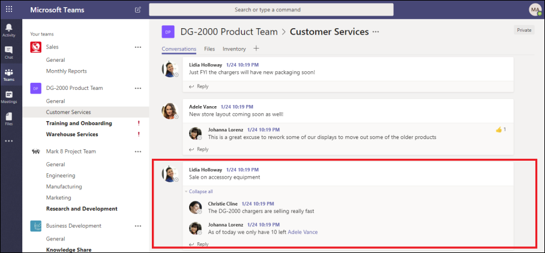
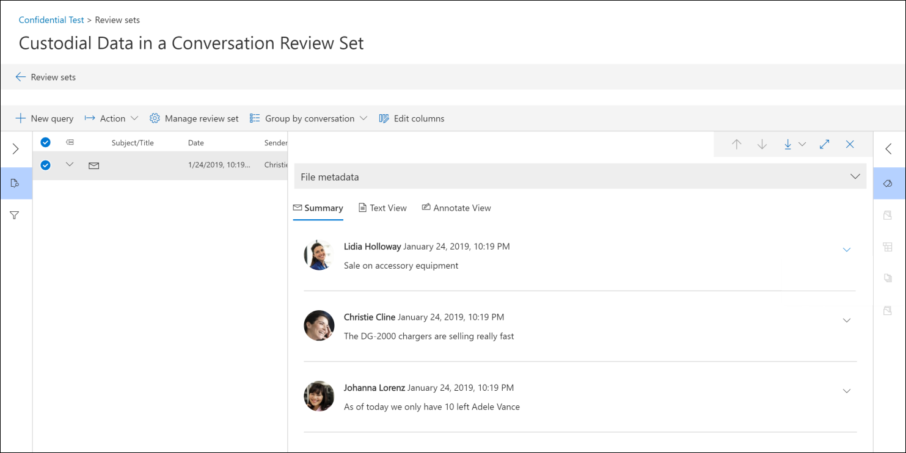

# 在高級電子檔探索中查看交談 

立即訊息是一種簡單的方法，可讓您在大型物件中提問、分享想法或快速交流。 當立即訊息平臺（如 Microsoft 小組）成為企業共同作業的核心時，組織必須評估其 eDiscovery 工作流程如何處理這些新的通訊和共同作業形式。 

「高級 eDiscovery」中的交談重建功能是專門設計來協助您識別內容內容，並產生獨特的交談視圖。 這項功能可讓您有效且快速地查看完整的立即訊息交談 (也稱為「) 組織」等平臺中所產生的「 *執行緒交談* 」。

透過交談重建，您可以使用內建的功能來重新建立、審閱及匯出執行緒交談。 使用高級 eDiscovery 交談重構來：

- 在交談內保留所有郵件的唯一郵件層級中繼資料。

- 收集搜尋結果周圍的上下文相關訊息。

- 審閱、批註和密文討論執行緒的交談。

- 匯出個別的郵件或串接的交談

## 術語

以下是很少的定義，可協助您開始使用交談重建。

- **訊息：** 代表交談的最小單位。 郵件大小、結構及中繼資料可能會有所不同。 

- **交談：** 代表一或多個郵件的群組。 在不同的應用程式中，交談可能以不同的方式呈現。 在某些應用程式中，會有明確的動作，可回復現有的郵件。 交談是以此使用者動作的結果來明確地組成。 例如，以下是 Microsoft 小組中的頻道交談的螢幕擷取畫面。

   

   在其他應用程式中 (例如，小組中的1xN 聊天室訊息) ，沒有正式的回復鏈，而且郵件會顯示為單一線程中的「平面河郵件」。 在這些類型的應用程式中，對話會從一段時間內發生的一組訊息中推斷出。 「軟群組」郵件的 (相對於回復鏈) 代表相關主題的「前後」交談。 

## 步驟1：執行搜尋

在您識別相關的保管人和內容位置之後，您可以建立搜尋來尋找潛在的相關內容。 在 [高級 eDiscovery] 案例的 [ **搜尋** ] 索引標籤上，您可以按一下 [ **新增搜尋** ] 並依照嚮導來建立搜尋。 如需如何建立搜尋、建立搜尋查詢及查看搜尋結果的詳細資訊，請參閱 [收集案例的資料](create-search-to-collect-data.md)。

## 步驟2：建立交談複查集

在審閱集中，您可以搜尋、標記、批註和密文檔、電子郵件訊息和聊天交談。 在 [Advanced eDiscovery] 中，您可以根據個別郵件或串接交談，自訂您的交談評論。 這取決於您將在步驟1中建立之搜尋結果的結果新增至中的審查集類型。 有兩種不同的審閱集類型： 
  
  - **標準檢查集合：** 交談中的郵件會經過處理並顯示為個別的專案。 
  
  -  **交談複查集：** 交談中的郵件會個別處理，但會顯示在交談視圖中。 在交談複查集中，您可以線上程交談模式中批註、標記和密文顯示郵件。 

如需如何查看及管理審閱集中內容的詳細資訊，請參閱 [管理審閱集](managing-review-sets.md)。 

## 步驟3：啟用交談檢索選項

在您檢查並完成搜尋查詢之後，您可以將搜尋結果新增至審閱集。 當您將搜尋結果新增至審閱集時，原始資料會複製到 Azure 儲存體區域，以協助檢查和分析程式。 如需將搜尋結果新增至審閱集合的詳細資訊，請參閱 [將搜尋結果新增至審閱集](add-data-to-review-set.md)。 

當您將資料從交談新增至審閱集時，您可以使用交談檢索選項來展開搜尋並包含內容相關訊息。 在您設定交談檢索選項後，可能會發生下列情況：

  
  
1. 搜尋會使用關鍵字和日期範圍查詢，傳回 *郵件 3*上的命中。 此郵件屬於較大的交談，如 *CRC1*所示。 
  
2. 當您將資料新增至複查集並啟用交談檢索選項時，高級 eDiscovery 會傳回並收集 *CRC1*中的其他專案。 
  
3. 將專案新增至審閱集合之後，您可以從 *CRC1*審閱所有的個別郵件。 

啟用交談檢索：
  
1. 在 [高級 eDiscovery] 案例中的 [ **搜尋** ] 索引標籤上，選取搜尋，然後按一下彈出頁面上的 [ **新增至審閱集** ]。
  
2. 選取現有的複查集或建立一個複查集。 將搜尋結果新增至標準或交談複查集時，您可以設定檢索選項。
  
3. 在 [ **集合選項**] 底下，針對您想要展開的搜尋內容來源，設定其交談檢索選項，然後按一下 [ **新增** ] 以啟動程式。  
  
4. 在 [**工作**] 索引標籤上的 [**新增至審閱集**] 工作完成之後，您就可以開始查看交談。

## 步驟4：在審閱集中複查及匯出對話

在處理內容並將其新增至審閱集合之後，您可以開始查看審閱集中的資料。 檢查功能會因內容是否已新增至標準審閱集或交談複查集而有所不同。 

### 在標準複查集中檢查交談

在標準的審閱集中，郵件會以個別專案的方式處理及顯示，類似于如何儲存在信箱資料夾中。 在此工作流程中，會以個別的專案處理每封郵件。 因此，標準的審閱集中無法使用「串接摘要」和「匯出」選項。 

  

### 在交談評審集中檢查交談

在交談複查集中，個別郵件會串接在一起，並以交談方式呈現。 這可讓您複查及匯出內容交談。 

  

下列各節說明如何在交談複查集中複查和匯出對話。

#### 審閱交談

在交談複查集中，您可以使用下列選項來協助審閱程式。

- **依交談群組：** 將相同交談中的郵件分組，以協助使用者簡化及加速其審閱程式。 

- **摘要視圖：** 顯示「執行緒交談」。 在此視圖中，您可以看見整個交談，也可以存取每個個別郵件的中繼資料。  
  
   - 查看個別郵件的中繼資料
   
   - 下載個別郵件

- **文字視圖：** 會提供整個交談的解壓縮文字。 

- **批註視圖：** 可讓您標記交談的執行緒化視圖。 交談中的所有郵件都會共用相同的註釋檔。

- **標記：** 在審閱集中查看交談時，您可以按一下 [編碼] 面板中的 [ **標記] 面板** ，以查看及套用標記。

- **重新執行交談轉換：** 當郵件新增至交談複查集時，會自動執行轉換工作以建立執行緒摘要及批註視圖。 如果交談重建工作失敗，您可以按一下 [動作] 以執行 [複查] 集中的 [ **動作] > 建立交談 pdf** ，以重新執行此工作。

#### 匯出對話

在交談複查集中，您可以設定下列選項來匯出對話：

a. 中繼資料選項

   - **載入檔案：** 每個個別的郵件、電子郵件及檔都包含中繼資料。 交談中的每一封郵件都有一個資料列。 

   - **標記：** 您的審閱程式中的標記會包含在中繼資料檔案中。 交談中的郵件共用相同的標記。 

b. 交談選項
  
   - **交談檔案：** 當您匯出對話檔時，批註的視圖會轉換為 PDF 檔案，並下載至匯出資料夾。 一個交談檔案中的郵件指向相同交談檔案的 PDF 版本。  
  
   - **個別聊天訊息：** 當您匯出個別郵件時，交談中的每個唯一郵件都會匯出為獨立的專案。 檔會以儲存為信箱的相同格式匯出。 針對特定交談，您會收到多個 .msg 檔案。 

     >[!NOTE]
     > 如果您已將批註套用至交談檔案，這些批註將不會轉移到個別的郵件。 

c. 其他選項

   - **為所有匯出的內容產生文字檔：** 為從審閱集匯出的每個交談產生一個文字檔。 

   - **以 Redacted Pdf 取代匯出的內容：** 如果在複查程式期間產生 redacted 交談檔案，則匯出期間可使用這些檔案。 您可以決定是否只匯出原生檔案 (但不要選取此選項) 或是使用原生檔案的 redacted 版本取代原生檔案 (方法是選取此選項) （匯出為 PDF 檔案）。

## 其他相關資訊

若要深入瞭解如何在高級 eDiscovery 中查看案例資料，請參閱下列文章：

- [查看案例資料](view-documents-in-review-set.md)

- [分析案例資料](analyzing-data-in-review-set.md)

- [匯出案例資料](exporting-data-ediscover20.md)
