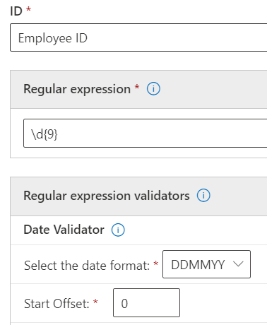

# <a name="get-started-with-custom-sensitive-information-types"></a>自訂敏感性資訊類型入門

如果預先設定的敏感性資訊類型不滿足您的需要，可以建立自己的自訂敏感性資訊類型，您可以完全定義這些類型，也可以複製其中一個預先設定的類型並進行修改。

使用此方法建立的自訂敏感性資訊類型將新增到名為 `Microsoft.SCCManaged.CustomRulePack` 的規則套件中。

有兩種方法可以建立新的敏感性資訊類型：

- [從頭開始完全定義所有元素](#create-a-custom-sensitive-information-type)
- [複製和修改現有的敏感性資訊類型](#copy-and-modify-a-sensitive-information-type)


## <a name="before-you-begin"></a>事前準備

- 應該熟悉敏感性資訊類型及其組成。 請參閱，[瞭解敏感性資訊類型](sensitive-information-type-learn-about.md)。 瞭解以下角色至關重要：
    - [規則運算式](https://www.boost.org/doc/libs/1_68_0/libs/regex/doc/html/) - Microsoft 365 敏感性資訊類型使用 Boost.RegEx 5.1.3 引擎
    - 關鍵字清單 - 可以在定義您的敏感性資訊類型或從現有關鍵字清單中選擇時建立自己的關鍵字清單
    - [關鍵字字典](create-a-keyword-dictionary.md)
    - [函數](what-the-dlp-functions-look-for.md)
    - [信賴等級](sensitive-information-type-learn-about.md#more-on-confidence-levels)
 
- 您必須具備全域管理員或合規性系統管理員的權限，才能透過 UI 建立、測試及部署自訂的敏感性資訊類型。 請參閱 Office 365 中的[關於系統管理員角色](/office365/admin/add-users/about-admin-roles)。

- 您的組織必須擁有包括資料外洩防護 (DLP) 的訂用帳戶，例如 Office 365 企業版。 請參閱[郵件原則及符合性](/office365/servicedescriptions/exchange-online-protection-service-description/messaging-policy-and-compliance-servicedesc)。 


> [!IMPORTANT]
> Microsoft 客戶服務及支援無法協助您建立自訂分類或規則運算式模式。 支援工程師可以提供有限的功能支援，例如，基於測試目的提供範例規則運算式模式，或協助對未如預期般觸發的現有規則運算式模式進行疑難排解，但無法保證任何自訂內容比對開發作業將符合您的需求或義務。

## <a name="create-a-custom-sensitive-information-type"></a>建立自訂敏感性資訊類型

使用以下步驟可以建立完全定義的新敏感性資訊類型。 

1. 在 [合規性中心] 中，前往 **[資料分類]** \>**[敏感性資訊類型]**，然後選擇 **[建立資訊類型]**。
2. 填寫 **[名稱]** 和 **[描述]** 的值，然後選擇 **[下一步]**。
3. 選擇 **[建立模式]**。 在定義新的敏感性資訊類型時，可以建立多個模式，每個模式具有不同的元素和信賴等級。
4. 選擇模式的預設信賴等級。 這些值是 **[低信賴等級]**、**[中信賴等級]** 和 **[高信賴等級]**。
5. 選擇並定義 **主要元素**。 主要元素可以是帶有選用驗證程式的 **規則運算式**、**關鍵字清單**、**關鍵字字典** 或預先設定的 **函數** 之一。 有關 DLP 功能的詳細資訊，請參閱 [DLP 功能尋找的項目](what-the-dlp-functions-look-for.md)。 如需日期及校驗和驗證程式的詳細資訊，請參閱 [正則運算式驗證程式的詳細資訊](#more-information-on-regular-expression-validators)。
6. 填寫 **鄰近的字元** 的值。
7. (選用) 新增支援元素 (如有)。 支援元素可以是帶有選用驗證程式的規則運算式、關鍵字清單、關鍵字字典或預定義的函數之一。 支援元素可以有自己的 **字元臨近** 設定。 
8. (選用) 從可用檢查清單中新增 [**其他檢查**](#more-information-on-additional-checks)。
9. 選擇 **[建立]**。
10. 選擇 **[下一步]**。
11. 為此敏感性資訊類型選擇 **[建議的信賴等級]**。
12. 檢查您的設定並選擇 **[提交]**。

> [!IMPORTANT]
> Microsoft 365 會使用搜尋檢索器識別及分類 SharePoint Online 和商務用 OneDrive 中網站中的敏感性資訊。 若要在所有現有內容中識別您的新自訂敏感性資訊類型，必須將內容重新編目。 內容會根據排程進行編目，但您可以手動重新編目網站集合、清單或文件庫的內容。 如需詳細資訊，請參閱[手動要求網站、文件庫或清單進行編目和重新建立索引](/sharepoint/crawl-site-content)。

13. 在 **[資料分類]** 頁面上，將看到列出的所有敏感性資訊類型。 選擇 **[重新整理]**，然後瀏覽或使用搜尋工具尋找剛剛建立的敏感性資訊類型。

## <a name="test-a-sensitive-information-type"></a>測試敏感資性訊類型

可以測試清單中的任何敏感性資訊類型。 我們建議在原則中使用之前，測試建立的每種敏感性資訊類型。

1. 準備兩個檔案，比如 Word 文件。 一個包含與敏感性資訊類型中指定的元素相符的內容，另一個不相符。
2. 在 [合規性中心] 中，前往 **[資料分類]** \> **[敏感性資訊類型]**，然後從清單中選擇敏感性資訊類型，以開啟 [詳細資訊] 窗格並選擇 **[測試]**。
3. 上傳檔案並選擇 **[測試]**。
4. 在 **[符合結果]** 頁面上，檢閱結果並選擇 **[完成]**。

## <a name="modify-custom-sensitive-information-types-in-the-compliance-center"></a>在合規性中心內修改自訂敏感性資訊類型

1. 在 [合規性中心] 中，前往 **[資料分類]** \> **[敏感性資訊類型]**，然後從要修改的清單中選擇敏感性資訊類型，然後選擇 **[編輯]**。
2. 您可以新增其他模式，其中包括唯一的主要元素和支援元素、信賴等級、鄰近的字元和 [**其他檢查**](#more-information-on-additional-checks)，或者編輯/移除現有的模式。

## <a name="remove-custom-sensitive-information-types-in-the-compliance-center"></a>移除合規性中心中的自訂敏感性資訊類型 

> [!NOTE]
> 您只能移除自訂機密資訊類型，不能移除內建的機密資訊類型。

> [!IMPORTANT]
> 在您移除自訂機密資訊類型之前，請確認沒有 DLP 原則或 Exchange 郵件流程規則 (也稱為傳輸規則) 仍參照機密資訊類型。

1. 在 [合規性中心] 中，前往 **[資料分類]** \> **[敏感性資訊類型]**，然後從清單中選擇要移除的敏感性資訊類型。
2. 在開啟的飛出視窗中，選擇 **[刪除]**。

## <a name="copy-and-modify-a-sensitive-information-type"></a>複製和修改敏感性資訊類型

使用以下步驟可以建立以現有敏感性資訊類型爲依據的新敏感性資訊類型。 

1. 在 [合規行中心] 中，前往 **[資料分類]** \> **[敏感性資訊類型]**，然後選擇要複製的敏感性資訊類型。
2. 在飛出視窗中，選擇 **[複製]**。
3. 在敏感性資訊類型清單中選擇 **[重新整理]**，然後瀏覽或搜尋剛剛建立的副本。 部分字串搜尋有用，所以可以只搜尋 `copy`，搜尋將退回名稱中包含 `copy` 文字的所有敏感性資訊類型。 
4. 填寫 **[名稱]** 和 **[描述]** 的值，然後選擇 **[下一步]**。
5. 選擇敏感性資訊類型副本，然後選擇 **[編輯]**。 
6. 為新敏感性資訊類型提供新 **[名稱]** 和 **[描述]**。
7. 您可以選擇編輯或移除現有模式，以及新增新模式。 選擇新模式的預設信賴等級。 這些值是 **[低信賴等級]**、**[中信賴等級]** 和 **[高信賴等級]**。
8. 選擇並定義 **主要元素**。 主要元素可以是 **規則運算式**、**關鍵字列表**、**關鍵字字典** 或預先配置的 **函數** 之一。 請參閱，[DLP 功能搜尋的項目](what-the-dlp-functions-look-for.md)。
9. 填寫 **鄰近的字元** 的值。
10. (選用) 如果有 **支援元素** 或任何 [**其他檢查**](#more-information-on-additional-checks)，請新增它們。 如果需要，可以將您的 **支援元素** 分組。
11. 選擇 **[建立]**。
12. 選擇 **[下一步]**。
13. 為此敏感性資訊類型選擇 **[建議的信賴等級]**。
14. 檢查您的設定並選擇 **[提交]**。

您也可以使用 PowerShell 和 Exact Data Match 功能建立自訂敏感性資訊類型。 若要深入了解這些方法，請參閱：
- [在安全性與合規性中心 PowerShell 中建立自訂敏感性資訊類型](create-a-custom-sensitive-information-type-in-scc-powershell.md)
- [使用 Exact Data Match (EDM) 建立自訂敏感性資訊類型](create-custom-sensitive-information-types-with-exact-data-match-based-classification.md)

## <a name="more-information-on-regular-expression-validators"></a>正則運算式驗證程式的詳細資訊

### <a name="checksum-validator"></a>Checksum 驗證程式

如果您需要在正則運算式中的數位上執行校驗和，您可以使用 *checksum 驗證* 程式。 例如，假設您需要為八位數授權號碼建立 SIT，其中最後一個數位是使用 mod 9 計算驗證的校驗和數位。 您已設定校驗和演算法，如下所示：

Sum = 數位 1 * 加權 1 + number 2 * 加權 2 + 數位 3 * 加權 3 + 數位 4 * 重量 4 + 數位 5 * 加權 5 + 數位 6 * 加權 6 + 3 * 加權 7 + 數位 8 * 加權 8 Mod 值 = Sum %9 If Mod value = = 2-1 = 1，

1. 使用此正則運算式定義主要元素：

   ```console
   \d{8}
   ```

2. 然後新增校驗和驗證程式。
3. 新增以逗號分隔的權重值，檢查碼的位置和 Mod 值的位置。 如需模運算的詳細資訊，請參閱 [模數](https://en.wikipedia.org/wiki/Modulo_operation)作業。

> [!NOTE]
> 如果檢查碼不是校驗和計算的一部分，請使用0做為檢查碼的權重。 例如，在上述的情況下，如果檢查碼不是用來計算檢查碼碼，就會等於0。  Modulo_operation) 。


### <a name="date-validator"></a>日期驗證程式

如果內嵌在正則運算式中的日期值為您建立的新模式的一部分，您可以使用 *日期驗證* 程式來測試它是否符合您的準則。 例如，假設您想要為九位數的雇員識別碼建立 SIT。 前六位數位是以 DDMMYY 格式雇用的日期，最後三個是隨機產生的數位。 驗證前六位數是否為正確的格式。

1. 使用此正則運算式定義主要元素：

   ```console
   \d{9}
   ```

2. 然後新增日期驗證程式。
3. 選取日期格式及起始位移。 因為日期字串是前六位數，所以位移是 `0` 。



### <a name="functional-processors-as-validators"></a>功能處理器為驗證程式

您可以使用函數處理器，作為一些最常用的驗證程式。 這可讓您定義您自己的正則運算式，同時確保它們會透過 SIT 所需的其他檢查。 例如，Func_India_Aadhar 會確定您所定義的自訂正則運算式已傳遞印度 Aadhar 卡片所需的驗證邏輯。 如需可用作驗證程式之 DLP 功能的詳細資訊，請參閱 [dlp 功能的尋找目標](what-the-dlp-functions-look-for.md#what-the-dlp-functions-look-for)。 

### <a name="luhn-check-validator"></a>Luhn 檢查驗證程式

如果您有自訂的機密資訊類型，且包含應傳遞 [Luhn 演算法](https://en.wikipedia.org/wiki/Luhn_algorithm)的正則運算式，您可以使用 Luhn 檢查驗證程式。

## <a name="more-information-on-additional-checks"></a>其他檢查的其他資訊

以下是可用其他檢查的定義和一些範例。

**排除特定相符項目**：這項檢查可讓您定義在偵測所編輯模式的相符項目時要排除的關鍵字。 例如，您可以排除測試信用卡號碼 (例如 '4111111111111111')，讓這些號碼無法相符為有效的號碼。

**以字元開頭或不以字元開頭**：這項檢查可讓您定義相符項目必須或不能以哪些字元開頭。 例如，如果您希望模式只偵測開頭為 41、42 或 43 的信用卡號碼，請選取 **[開頭為]**，然後新增 41、42 和 43 到清單中，以逗號分隔。 

**以字元結束或不以字元結束**：這項檢查可讓您定義相符項目必須或不能以哪些字元結束。 例如，如果您的員工識別碼的結尾不能是 0 或 1，請選取 **[結尾不是]**，然後新增 0 和 1 到清單中，以逗號分隔。

**排除重複字元**：此檢查可讓您忽略所有數字都相同的相符項目。 例如，如果六位數的員工識別碼不能使用所有數字都相同的識別碼，您可以選取 **[排除重複字元]**，從員工識別碼的有效相符項目清單中排除 111111、222222、333333、444444、555555、666666、777777、888888、999999 和 000000。

**包含或排除首碼**：此檢查可讓您定義在相符實體之前必須立即找到或不能立即找到的關鍵字。 根據您的選項，如果實體前面有您在這裡指定的首碼，則實體會相符或不相符。 例如，如果您 **排除** 首碼 **GUID:**，則 **GUID:** 前的任何實體不會被視為相符項目。

**包含或排除尾碼**：此檢查可讓您定義在相符實體之後必須立即找到或不能立即找到的關鍵字。 根據您的選項，如果實體後面接著您在這裡指定的尾碼，則實體會相符或不相符。 例如，如果您 **排除** 尾碼 **GUID:**，則 **GUID:** 後面接著的文字不會被視為相符項目。


> [!NOTE]
> Microsoft 365 資訊保護支援下列雙位元組字元集語言：
> - 中文 (簡體)
> - 中文 (繁體)
> - 韓文
> - 日文
>
>這項支援適用於敏感性資訊類型。 如需詳細資訊，請參閱[資訊保護支援雙位元組字元集的版本資訊 (預覽版)](mip-dbcs-relnotes.md)。

> [!TIP]
> 若要偵測包含中文/日文字元和單一位元組字元的模式，或偵測包含中文/日文和英文的模式，請定義關鍵字或 RegEx 的兩個變體。 
>
> 例如，若要偵測關鍵字 ，例如「机密的document」，請使用關鍵字的兩個變體；一個在日文和英文文字之間具有空格，另一個在日文和英文文字之間沒有空格。 因此，要新增到 SIT 中的關鍵字應該是「机密的 document」和「机密的document」。 同樣地，若要偵測片語「東京オリンピック2020」，應該使用兩個變體；「東京オリンピック 2020」和「東京オリンピック2020」。
>
> 使用雙位元組連字號或雙位元組字元來建立 RegEx 時，請務必逸出這兩個字元，就像一個字元會逸出 RegEx 中的連字號或空格一樣。 以下是範例 RegEx 供參考：
>
>    - (?<!\d)([４][０-９]{3}[\-?\－\t]*[０-９]{4}
>
> 我們建議您在關鍵字清單中使用字串比對，而不是文字比對。
