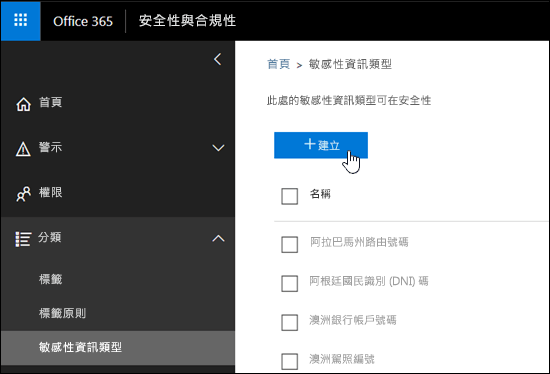
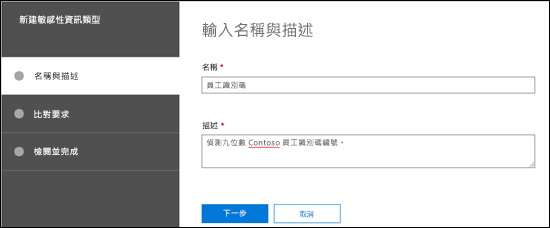
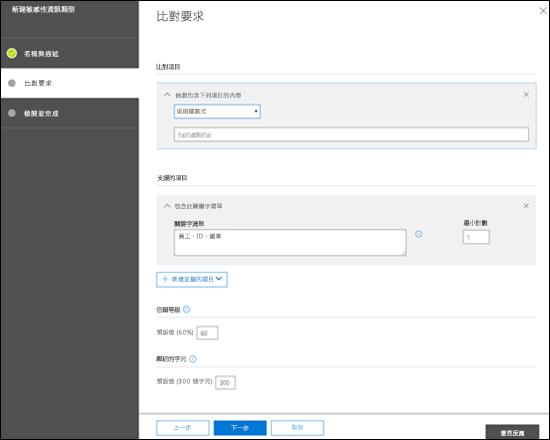
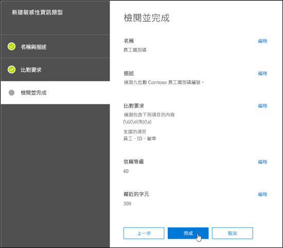
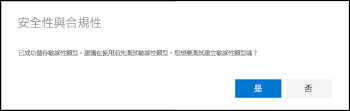
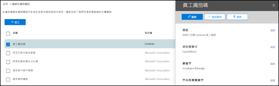
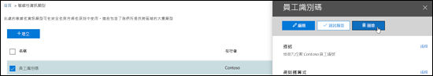
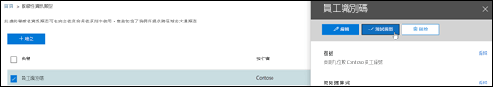
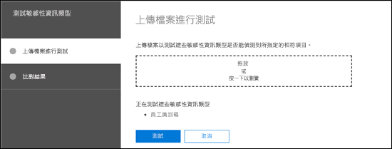
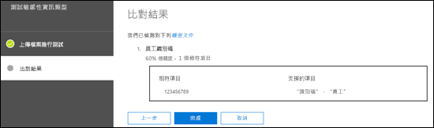

<!-- rename md file to match the display name -->
# 在安全性與合規性中心建立自訂敏感性資訊類型Create a custom sensitive information type in the Security & Compliance Center

閱讀本文，在安全性與合規性中心建立[自訂敏感性資訊類型](custom-sensitive-info-types.md) ([https://protection.office.com](https://protection.office.com))。Read this article to create a [custom sensitive information type](custom-sensitive-info-types.md) in the Security & Compliance Center ([https://protection.office.com](https://protection.office.com)). 透過使用此方法，您建立的自訂敏感性資訊類型會新增到名為 `Microsoft.SCCManaged.CustomRulePack` 的規則套件。The custom sensitive information types that you create by using this method are added to the rule package named `Microsoft.SCCManaged.CustomRulePack`.

您也可以使用 PowerShell 和 Exact Data Match 功能建立自訂敏感性資訊類型。You can also create custom sensitive information types by using PowerShell and Exact Data Match capabilities. 若要深入了解這些方法，請參閱：To learn more about those methods, see:
- [在安全性與合規性中心 PowerShell 中建立自訂敏感性資訊類型Create a custom sensitive information type in Security & Compliance Center PowerShell](create-a-custom-sensitive-information-type-in-scc-powershell.md)
- [使用 Exact Data Match (EDM) 建立自訂敏感性資訊類型Create a custom sensitive information type for DLP with Exact Data Match (EDM)](create-custom-sensitive-information-types-with-exact-data-match-based-classification.md)

## 開始之前Before you begin

> [!NOTE]
> 您必須具備全域管理員或合規性系統管理員的權限，才能透過 UI 建立、測試及部署自訂的敏感性資訊類型。You should have Global admin or Compliance admin permissions to create, test, and deploy a custom sensitive information type through the UI. 請參閱 Office 365 中的[關於系統管理員角色](https://docs.microsoft.com/office365/admin/add-users/about-admin-roles?view=o365-worldwide)。See [About admin roles](https://docs.microsoft.com/office365/admin/add-users/about-admin-roles?view=o365-worldwide) in Office 365.

- 您的組織必須擁有包括資料外洩防護 (DLP) 的訂用帳戶，例如 Office 365 企業版。Your organization must have a subscription, such as Office 365 Enterprise, that includes Data Loss Prevention (DLP). 請參閱[郵件原則及符合性](https://docs.microsoft.com/office365/servicedescriptions/exchange-online-protection-service-description/messaging-policy-and-compliance-servicedesc)。See [Messaging Policy and Compliance ServiceDescription](https://docs.microsoft.com/office365/servicedescriptions/exchange-online-protection-service-description/messaging-policy-and-compliance-servicedesc). 

- Custom sensitive information types require familiarity with regular expressions (RegEx).Custom sensitive information types require familiarity with regular expressions (RegEx). For more information about the Boost.RegEx (formerly known as RegEx++) engine that's used for processing the text, see [Boost.Regex 5.1.3](https://www.boost.org/doc/libs/1_68_0/libs/regex/doc/html/).For more information about the Boost.RegEx (formerly known as RegEx++) engine that's used for processing the text, see [Boost.Regex 5.1.3](https://www.boost.org/doc/libs/1_68_0/libs/regex/doc/html/).

  Microsoft 客戶服務及支援無法協助您建立自訂分類或規則運算式模式。Microsoft Customer Service & Support can't assist with creating custom classifications or regular expression patterns. 支援工程師可以提供有限的功能支援，例如，基於測試目的提供範例規則運算式模式，或協助對未如預期般觸發的現有規則運算式模式進行疑難排解，但無法保證任何自訂內容比對開發作業將符合您的需求或義務。Support engineers can provide limited support for the feature, such as, providing sample regular expression patterns for testing purposes, or assisting with troubleshooting an existing regular expression pattern that's not triggering as expected, but can't provide assurances that any custom content-matching development will fulfill your requirements or obligations.

- DLP 會使用搜尋檢索器識別及分類 SharePoint Online 和商務用 OneDrive 中網站中的敏感性資訊。DLP uses the search crawler to identify and classify sensitive information in SharePoint Online and OneDrive for Business sites. 若要在所有現有內容中識別您的新自訂敏感性資訊類型，必須將內容重新編目。To identify your new custom sensitive information type in existing content, the content must be re-crawled. 內容會根據排程進行編目，但您可以手動重新編目網站集合、清單或文件庫的內容。Content is crawled based on a schedule, but you can manually re-crawl content for a site collection, list, or library. 如需詳細資訊，請參閱[手動要求網站、文件庫或清單進行編目和重新建立索引](https://docs.microsoft.com/sharepoint/crawl-site-content)。For more information, see [Manually request crawling and re-indexing of a site, a library or a list](https://docs.microsoft.com/sharepoint/crawl-site-content).

## 在安全性與合規性中心建立自訂機密資訊類型Create custom sensitive information types in the Security & Compliance Center

在安全性與合規性中心，移至 [**分類**] \> [**機密資訊類型**]，然後按一下 [**建立**]。In the Security & Compliance Center, go to **Classifications** \> **Sensitive info types** and click **Create**.

這些設定不言而喻，並會在精靈的關聯頁面上加以說明：The settings are fairly self-evident, and are explained on the associate page of the wizard:

- **名稱****Name**

- **描述****Description**

- **近似值****Proximity**

- **信賴等級****Confidence level**

- **主要模式元素** (關鍵字、規則運算式或字典)**Primary pattern element** (keywords, regular expression, or dictionary)

- 選用的**支援模式元素** (關鍵字、規則運算式或字典) 及其對應**最低成本**值。Optional **Supporting pattern elements** (keywords, regular expression, or dictionary) and a corresponding **Minimum cost** value.

Here's a scenario: You want a custom sensitive information type that detects 9-digit employee numbers in content, along with the keywords "employee" "ID" and "badge".Here's a scenario: You want a custom sensitive information type that detects 9-digit employee numbers in content, along with the keywords "employee" "ID" and "badge". To create this custom sensitive information type, do the following steps:To create this custom sensitive information type, do the following steps:

1. 在安全性與合規性中心，移至 [**分類**] \> [**機密資訊類型**]，然後按一下 [**建立**]。In the Security & Compliance Center, go to **Classifications** \> **Sensitive info types** and click **Create**.

    

2. 在開啟的 [選擇名稱和描述]\*\*\*\* 頁面中，輸入下列值：In the **Choose a name and description** page that opens, enter the following values:

  - **名稱**：員工識別碼。**Name**: Employee ID.

  - **描述**：偵測九位數 Contoso 員工編號。**Description**: Detect nine-digit Contoso employee ID numbers.

    

    完成後，按 [下一步]\*\*\*\*。When you're finished, click **Next**.

3. 在 [比對需求]\*\*\*\* 頁面中，按一下 [新增元素]\*\*\*\* 來設定下列設定：In the **Requirements for matching** page that opens, click **Add an element** configure the following settings:

    - **偵測包含下列項目的內容**：**Detect content containing**:
 
      a.a. Click **Any of these** and select **Regular expression**.Click **Any of these** and select **Regular expression**.

      b.b. In the regular expression box, enter `(\s)(\d{9})(\s)` (nine-digit numbers surrounded by white space).In the regular expression box, enter `(\s)(\d{9})(\s)` (nine-digit numbers surrounded by white space).
  
    - **支援項目**：按一下 [新增支援項目]\*\*\*\*，然後選取 [包含此關鍵字清單]\*\*\*\*。**Supporting elements**: Click **Add supporting elements** and select **Contains this keyword list**.

    - 在出現的 [包含此關鍵字清單]\*\*\*\* 區域中，設定下列設定：In the **Contains this keyword list** area that appears, configure the following settings:

      - **關鍵字清單**：輸入下列值：員工、識別碼、徽章。**Keyword list**: Enter the following value: employee,ID,badge.

      - **最小計數**：保留預設值 1。**Minimum count**: Leave the default value 1.

    - 保留預設**信賴等級**值 60。Leave the default **Confidence level** value 60. 

    - 保留預設**字元近似值** 300。Leave the default **Character proximity** value 300.

    

    完成後，按 [下一步]\*\*\*\*。When you're finished, click **Next**.

4. 在開啟的 [檢閱並完成]\*\*\*\* 頁面上，檢閱設定並按一下 [完成]\*\*\*\*。On the **Review and finalize** page that opens, review the settings and click **Finish**.

    

5. The next page encourages you to test the new custom sensitive information type by clicking **Yes**.The next page encourages you to test the new custom sensitive information type by clicking **Yes**. For more information, see [Test custom sensitive information types in the Security & Compliance Center](#test-custom-sensitive-information-types-in-the-security--compliance-center).For more information, see [Test custom sensitive information types in the Security & Compliance Center](#test-custom-sensitive-information-types-in-the-security--compliance-center). To test the rule later, click **No**.To test the rule later, click **No**.

    

### 如何知道這是否正常運作？How do you know this worked?

若要確認您已成功建立新的機密資訊類型，請執行下列任一步驟：To verify that you've successfully created a new sensitive information type, do any of the following steps:

  - 移至 [分類]\*\*\*\* \> [機密資訊類型]\*\*\*\*，並確認已列出新的自訂機密資訊類型。Go to **Classifications** \> **Sensitive info types** and verify the new custom sensitive information type is listed.

  - Test the new custom sensitive information type.Test the new custom sensitive information type. For more information, see [Test custom sensitive information types in the Security & Compliance Center](#test-custom-sensitive-information-types-in-the-security--compliance-center).For more information, see [Test custom sensitive information types in the Security & Compliance Center](#test-custom-sensitive-information-types-in-the-security--compliance-center).

## 在安全性與合規性中心修改自訂機密資訊類型Modify custom sensitive information types in the Security & Compliance Center

**附註**：**Notes**:
<!-- check to see if this note contradicts the guidance in "customize a built in sensitive information type customize-a-built-in-sensitive-information-type it sure seems like it does-->
- You can only modify custom sensitive information types; you can't modify built-in sensitive information types.You can only modify custom sensitive information types; you can't modify built-in sensitive information types. But you can use PowerShell to export built-in custom sensitive information types, customize them, and import them as custom sensitive information types.But you can use PowerShell to export built-in custom sensitive information types, customize them, and import them as custom sensitive information types. For more information, see [Customize a built-in sensitive information type](customize-a-built-in-sensitive-information-type.md).For more information, see [Customize a built-in sensitive information type](customize-a-built-in-sensitive-information-type.md).

- You can only modify custom sensitive information types that you created in the UI.You can only modify custom sensitive information types that you created in the UI. If you used the [PowerShell procedure](create-a-custom-sensitive-information-type-in-scc-powershell.md) to import a custom sensitive information type rule package, you'll get an error.If you used the [PowerShell procedure](create-a-custom-sensitive-information-type-in-scc-powershell.md) to import a custom sensitive information type rule package, you'll get an error.

在安全性與合規性中心，移至 [分類]\*\*\*\* \> [機密資訊類型]\*\*\*\*，選取您想要修改的自訂機密資訊類型，然後按一下 [編輯]\*\*\*\*。In the Security & Compliance Center, go to **Classifications** \> **Sensitive info types**, select the custom sensitive information type that you want to modify, and then click **Edit**.

  

The same options are available here as when you created the custom sensitive information type in the Security & Compliance Center.The same options are available here as when you created the custom sensitive information type in the Security & Compliance Center. For more information, see [Create custom sensitive information types in the Security & Compliance Center](#create-custom-sensitive-information-types-in-the-security--compliance-center).For more information, see [Create custom sensitive information types in the Security & Compliance Center](#create-custom-sensitive-information-types-in-the-security--compliance-center).

### 如何知道這是否正常運作？How do you know this worked?

若要確認您已成功修改機密資訊類型，請執行下列任一步驟：To verify that you've successfully modified a sensitive information type, do any of the following steps:

  - 移至 [分類]\*\*\*\* \> [機密資訊類型]\*\*\*\*，以驗證已修改之自訂機密資訊類型的內容。Go to **Classifications** \> **Sensitive info types** to verify the properties of the modified custom sensitive information type. 

  - Test the modified custom sensitive information type.Test the modified custom sensitive information type. For more information, see [Test custom sensitive information types in the Security & Compliance Center](#test-custom-sensitive-information-types-in-the-security--compliance-center).For more information, see [Test custom sensitive information types in the Security & Compliance Center](#test-custom-sensitive-information-types-in-the-security--compliance-center).

## 移除安全性與合規性中心的自訂機密資訊類型Remove custom sensitive information types in the Security & Compliance Center 

**附註**：**Notes**:

- 您只能移除自訂機密資訊類型，不能移除內建的機密資訊類型。You can only remove custom sensitive information types; you can't remove built-in sensitive information types.

- 在您移除自訂機密資訊類型之前，請確認沒有 DLP 原則或 Exchange 郵件流程規則 (也稱為傳輸規則) 仍參照機密資訊類型。Before your remove a custom sensitive information type, verify that no DLP policies or Exchange mail flow rules (also known as transport rules) still reference the sensitive information type.

1. 在安全性與合規性中心，移至 [分類]\*\*\*\* \> [機密資訊類型]\*\*\*\*，然後選取一或多個您想要移除的自訂機密資訊類型。In the Security & Compliance Center, go to **Classifications** \> **Sensitive info types** and select one or more custom sensitive information types that you want to remove.

2. 在開啟的飛出視窗中，按一下 [刪除]\*\*\*\* (或 [刪除機密資訊類型]\*\*\*\*，如果您已選取多個的話)。In the fly-out that opens, click **Delete** (or **Delete sensitive info types** if you selected more than one).

    

3. 在出現的警告訊息中，按一下 [是]\*\*\*\*。In the warning message that appears, click **Yes**.

### 如何知道這是否正常運作？How do you know this worked?

若要確認您已成功移除自訂機密資訊類型，請移至 [分類]\*\*\*\* \> [機密資訊類型]\*\*\*\*，以確認不再列出自訂機密資訊類型。To verify that you've successfully removed a custom sensitive information type, go to **Classifications** \> **Sensitive info types** to verify the custom sensitive information type is no longer listed.

## 在安全性與合規性中心測試自訂機密資訊類型Test custom sensitive information types in the Security & Compliance Center

1. 在安全性與合規性中心，移至 [分類]\*\*\*\* \> [機密資訊類型]\*\*\*\*。In the Security & Compliance Center, go to **Classifications** \> **Sensitive info types**.

2. Select one or more custom sensitive information types to test.Select one or more custom sensitive information types to test. In the fly-out that opens, click **Test type** (or **Test sensitive info types** if you selected more than one).In the fly-out that opens, click **Test type** (or **Test sensitive info types** if you selected more than one).

    

3. 在開啟的 [上傳檔案進行測試]\*\*\*\* 頁面上，拖放檔案或按一下 [瀏覽]\*\*\*\* 並選取檔案，來上傳要測試的文件。On the **Upload file to test** page that opens, upload a document to test by dragging and dropping a file or by clicking **Browse** and selecting a file.

    

4. 按一下 [測試]\*\*\*\* 按鈕，來測試文件以在檔案中進行模式比對。Click the **Test** button to test the document for pattern matches in the file.

5. 在 [比對結果]\*\*\*\* 頁面上，按一下 [完成]\*\*\*\*。On the **Match results** page, click **Finish**.

    
