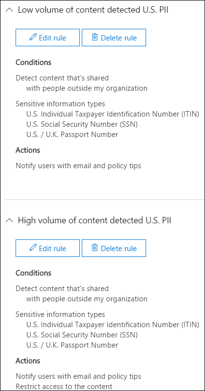
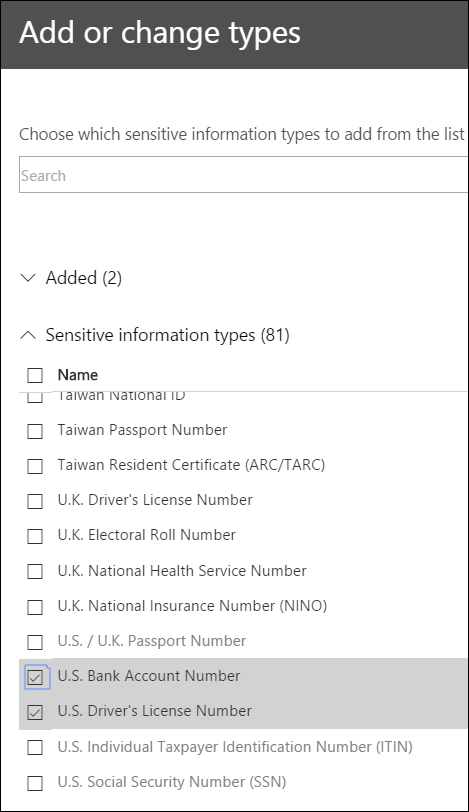
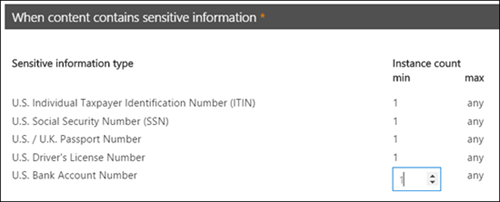

# 從範本建立 DLP 原則Create a DLP policy from a template

要開始使用 DLP 原則，最簡單且最常見方式是使用 Office 365 所包含的其中一個範本。The easiest, most common way to get started with DLP policies is to use one of the templates included in Office 365. 您可以使用其中一種範本，也可以自訂規則，以符合組織的特定合規性需求。You can use one of these templates as is, or customize the rules to meet your organization's specific compliance requirements.
  
Microsoft 365 包括40個現成的範本，可協助您符合廣泛的常見法規和商務原則需求。Microsoft 365 includes over 40 ready-to-use templates that can help you meet a wide range of common regulatory and business policy needs. 例如，下列項目就有 DLP 原則範本：For example, there are DLP policy templates for:
  
- Gramm-Leach-Bliley Act (GLBA)Gramm-Leach-Bliley Act (GLBA)
    
- 支付卡行業資料安全標準 (PCI DSS)Payment Card Industry Data Security Standard (PCI-DSS)
    
- 美國個人識別資訊 (美國 PII)United States Personally Identifiable Information (U.S. PII)
    
- 美國健康保險法案 (HIPAA)United States Health Insurance Act (HIPAA)
    
您可以修改任何現有的規則或新增規則，以微調範本。例如，您可以將新的敏感資訊類型新增至規則、修改規則中的計數使其更難以或容易觸發、允許人員藉由提供正當業務理由來覆寫規則中的動作，或變更通知和事件報告的傳送對象。DLP 原則範本可做為許多常見規範案例的彈性起始點。You can fine tune a template by modifying any of the existing rules or adding new ones. For example, you can add new types of sensitive information to a rule, modify the counts in a rule to make it harder or easier to trigger, allow people to override the actions in a rule by providing a business justification, or change who notifications and incident reports are sent to. A DLP policy template is a flexible starting point for many common compliance scenarios.
  
您也可以選擇自訂範本 (沒有任何預設規則)，然後從頭設定 DLP 原則，以符合組織的特定規範需求。You can also choose the Custom template, which has no default rules, and configure your DLP policy from scratch, to meet the specific compliance requirements for your organization.
  
## 範例：識別所有商務用 OneDrive 網站上的敏感資訊，並限制組織外部人員的存取權Example: Identify sensitive information across all OneDrive for Business sites and restrict access for people outside your organization

商務用 OneDrive 帳戶可讓組織內的人員輕鬆合作及共用檔。OneDrive for Business accounts make it easy for people across your organization to collaborate and share documents. 但「合規性監察官」的常見問題是儲存在商務用 OneDrive 帳戶中的機密資訊，可能不會與組織外部的人員共用。But a common concern for compliance officers is that sensitive information stored in OneDrive for Business accounts may be inadvertently shared with people outside your organization. DLP 原則有助於降低此風險。A DLP policy can help mitigate this risk.
  
在此範例中，您將建立一個識別美國 PII 資料的 DLP 原則，其中包含個別的納稅人識別碼 (ITIN) 、社會保險號碼和美國護照號碼。In this example, you'll create a DLP policy that identifies U.S. PII data, which includes Individual Taxpayer Identification Numbers (ITIN), Social Security Numbers, and U.S. passport numbers. 您將會開始使用範本，然後您將修改範本，以符合組織的合規性需求（特別是，您可以：You'll get started by using a template, and then you'll modify the template to meet your organization's compliance requirements—specifically, you'll:
  
- 新增一些類型的敏感資訊-U.S。銀行帳戶號碼和美國駕駛執照號碼，這樣 DLP 原則可以保護更多機密資料。Add a couple of types of sensitive information—U.S. bank account numbers and U.S. driver's license numbers—so that the DLP policy protects even more of your sensitive data.
    
- 使原則更具敏感性，使單一的機密資訊出現足以限制外部使用者的存取。Make the policy more sensitive, so that a single occurrence of sensitive information is enough to restrict access for external users.
    
- 讓使用者藉由提供正當業務理由或回報誤判來覆寫動作。Allow users to override the actions by providing a business justification or reporting a false positive. 如此一來，您的 DLP 原則不會防止組織中的人員完成工作，只要他們有有效的業務理由共用敏感資訊。This way, your DLP policy won't prevent people in your organization from getting their work done, provided they have a valid business reason for sharing the sensitive information.
    
### 從範本建立 DLP 原則Create a DLP policy from a template

1. 請移至 [https://protection.office.com](https://protection.office.com)。Go to [https://protection.office.com](https://protection.office.com).
    
2. 使用您的公司或學校帳戶登入。Sign in using your work or school account. 現在您已在安全性與 &amp; 合規性中心。You're now in the Security &amp; Compliance Center.
    
3. 在 [安全性與 &amp; 合規性中心] \> 左側導覽 \> **資料遺失防護** \> **原則** 中， \> **建立原則**。In the Security &amp; Compliance Center \> left navigation \> **Data loss prevention** \> **Policy** \> **+ Create a policy**.
    
    
  
4. 選擇 DLP 原則範本，以保護您 \> **下一步** 所需的敏感資訊類型。Choose the DLP policy template that protects the types of sensitive information that you need \> **Next**.
    
    在此範例中，您將會選取 **隱私權** \> 為 **個人身分識別資訊 (PII) 資料** ，因為它已經包含您要保護的機密資訊類型，但您會在稍後新增一些類型。In this example, you'll select **Privacy** \> **U.S. Personally Identifiable Information ‎(PII)‎ Data** because it already includes most of the types of sensitive information that you want to protect—you'll add a couple later. 
    
    當您選取範本時，您可以閱讀右邊的描述，以瞭解範本所保護的敏感資訊類型。When you select a template, you can read the description on the right to learn what types of sensitive information the template protects.
    
    
  
5. 將原則命名為 \> **[下一步]**。Name the policy \> **Next**.
    
6. 若要選擇您想要 DLP 原則保護的位置，請執行下列其中一項操作：To choose the locations that you want the DLP policy to protect, do one of the following:
    
  - **在 Office 365** \> **下一步** 選擇所有位置。Choose **All locations in Office 365** \> **Next**.
    
  - 選擇 [ **讓我選擇特定位置** \> **] [下一步]**。Choose **Let me choose specific locations** \> **Next**. 在此範例中，請選擇此。For this example, choose this.
    
    若要包含或排除整個位置（例如所有 Exchange 電子郵件或所有 OneDrive 帳戶），請將該位置的 **狀態** 切換為 [開啟] 或 [關閉]。To include or exclude an entire location such as all Exchange email or all OneDrive accounts, switch the **Status** of that location on or off. 
    
    若只要包含特定的 SharePoint 網站或商務用 OneDrive 帳戶，請將 **狀態** 切換為 [開啟]，然後按一下 [**包含**] 底下的連結，選擇特定的網站或帳戶。To include only specific SharePoint sites or OneDrive for Business accounts, switch the **Status** to on, and then click the links under **Include** to choose specific sites or accounts. 當您將原則套用至網站時，該原則中設定的規則會自動套用至該網站的所有子網站。When you apply a policy to a site, the rules configured in that policy are automatically applied to all subsites of that site. 
    
    
  
    在此範例中，若要保護儲存在所有商務用 OneDrive 帳戶中的機密資訊，請關閉 **Exchange 電子郵件** 和 **SharePoint 網站** 的 **狀態**，並保留 **OneDrive 帳戶** 的 **狀態**。In this example, to protect sensitive information stored in all OneDrive for Business accounts, turn off the **Status** for both **Exchange email** and **SharePoint sites**, and leave the **Status** on for **OneDrive accounts**.
    
7. 選擇 [ **使用高級設定** \> **] [下一步]**。Choose **Use advanced settings** \> **Next**.
    
8. DLP 原則範本包含預先定義的規則，且附有條件和動作，分別會偵測特定類型的敏感資訊和採取因應措施。A DLP policy template contains predefined rules with conditions and actions that detect and act upon specific types of sensitive information. 您可以編輯、刪除或關閉任何現有的規則，也可以新增新的規則。You can edit, delete, or turn off any of the existing rules, or add new ones. 完成時，按 **[下一步]**。When done, click **Next**.
    
    
  
    在此範例中，美國 PII 資料範本包含兩個預先定義的規則：In this example, the U.S. PII Data template includes two predefined rules:
    
  - 偵測 **到的內容量下限（美國 PII** ）此規則會尋找包含三種類型的敏感資訊 (ITIN、SSN 和美國護照號碼) （其中的檔案與組織外部的人員共用）之間的檔案。**Low volume of content detected U.S. PII** This rule looks for files containing between 1 and 10 occurrences of each of three types of sensitive information (ITIN, SSN, and U.S. passport numbers), where the files are shared with people outside the organization. 如果找到，該規則會傳送電子郵件通知給主要網站集合管理員、檔擁有者，以及上次修改檔的人員。If found, the rule sends an email notification to the primary site collection administrator, document owner, and person who last modified the document. 
    
  - 偵測 **到的高容量內容（美國 PII** ）此規則會尋找包含10個以上相同三個機密資訊類型的檔案，其中檔案與組織外部人員共用的檔案。**High volume of content detected U.S. PII** This rule looks for files containing 10 or more occurrences of each of the same three sensitive information types, where the files are shared with people outside the organization. 如果找到，此動作也會傳送電子郵件通知，此外也會限制對該檔案的存取。If found, this action also sends an email notification, plus it restricts access to the file. 若為商務用 OneDrive 帳戶中的內容，這表示對檔的許可權是針對所有人員所限制，除了主要網站集合管理員、檔擁有者，以及上次修改檔的人員之外。For content in a OneDrive for Business account, this means that permissions for the document are restricted for everyone except the primary site collection administrator, document owner, and person who last modified the document. 
    
    為了符合您組織的特定需求，您可能想要讓規則更容易觸發，所以機密資訊的單一出現足以封鎖外部使用者的存取。To meet your organization's specific requirements, you may want to make the rules easier to trigger, so that a single occurrence of sensitive information is enough to block access for external users. 在查看這些規則之後，您知道您不需要低和高計數規則，但只要找到任何存在的敏感資訊，就只需要一個規則來封鎖存取。After looking at these rules, you understand that you don't need low and high count rules—you need only a single rule that blocks access if any occurrence of sensitive information is found.
    
    所以，您可以展開名為「 **容量下限」的規則（即偵測出的美國 PII** \> **刪除規則**）。So you expand the rule named **Low volume of content detected U.S. PII** \> **Delete rule**.
    
    
  
9. 現在，在此範例中，您需要將這兩種機密資訊類型新增 (美國銀行帳戶號碼和美國駕駛執照號碼) 、允許人員覆寫規則，以及變更計數為任何發生的專案。Now, in this example, you need to add two sensitive information types (U.S. bank account numbers and U.S. driver's license numbers), allow people to override a rule, and change the count to any occurrence. 您可以編輯一個規則來執行所有操作，如此一來，選取「偵測 **的內容數量上限」美國 PII** \> **Edit rule**。You can do all of this by editing one rule, so select **High volume of content detected U.S. PII** \> **Edit rule**.
    
    
  
10. 若要新增機密資訊類型，請在 [ **條件** ] 區段中 \> **新增或變更類型**。To add a sensitive information type, in the **Conditions** section \> **Add or change types**. 然後，在 [**新增或變更類型**] 底下， \> 選擇 [**新增** \> 選取 **美國銀行帳戶號碼** 和 **美國駕駛執照號碼**] [ \>  \> 新增]。Then, under **Add or change types** \> choose **Add** \> select **U.S. Bank Account Number** and **U.S. Driver's License Number** \> **Add** \> **Done**.
    
    
  
    
  
11. 若要變更計數 (觸發規則) 所需的機密資訊實例數目，請在 [ **範例計數**] 下， \> 選取每個類型的 **最小** 值 \> 輸入1。To change the count (the number of instances of sensitive information required to trigger the rule), under **Instance count** \> choose the **min** value for each type \> enter 1. 最小計數不能是空的。The minimum count cannot be empty. 最大計數可以是空的。空的 **max** 值會轉換成 **any**。The maximum count can be empty; an empty **max** value convert to **any**.
    
    完成後，所有敏感資訊類型的最小計數應為1，最大計數 **應為** **1** 。When finished, the min count for all of the sensitive information types should be **1** and the max count should be **any**. 換句話說，任何這類機密資訊的出現都會滿足此條件。In other words, any occurrence of this type of sensitive information will satisfy this condition.
    
    
  
12. 針對最後的自訂，您不希望 DLP 原則封鎖人員在具備有效的業務理由或遇到誤報時執行其工作，所以您想要讓使用者通知包含覆寫封鎖動作的選項。For the final customization, you don't want your DLP policies to block people from doing their work when they have a valid business justification or encounter a false positive, so you want the user notification to include options to override the blocking action.
    
    在 [ **使用者通知** ] 區段中，您可以看到範本中的此規則預設會開啟電子郵件通知和原則提示。In the **User notifications** section, you can see that email notifications and policy tips are turned on by default for this rule in the template. 
    
    在 [ **使用者覆寫** ] 區段中，您可以看到業務理由的覆寫已開啟，但不會覆寫報告誤報。In the **User overrides** section, you can see that overrides for a business justification are turned on, but overrides to report false positives are not. **若將規則報告為誤報，請選擇自動覆寫該規則**。Choose **Override the rule automatically if they report it as a false positive**.
    
    
  
13. 在規則編輯器的頂端，將此規則的名稱從偵測到的預設 **大量內容** 變更為 **使用美國 pii** 偵測到的任何內容，因為它現在是由任何出現的敏感資訊類型所觸發。At the top of the rule editor, change the name of this rule from the default **High volume of content detected U.S. PII** to **Any content detected with U.S. PII** because it's now triggered by any occurrence of its sensitive information types. 
    
14. 在規則編輯器的底部 \> **儲存**。At the bottom of the rule editor \> **Save**.
    
15. 請複查此規則的條件和動作（ \> **下一步**）。Review the conditions and actions for this rule \> **Next**.
    
    在右側，請注意規則的 **狀態** 參數。On the right, notice the **Status** switch for the rule. 如果您關閉整個原則，則所有包含在原則中的規則也會關閉。If you turn off an entire policy, all rules contained in the policy are also turned off. 不過，您可以在這裡關閉特定規則，而不會關閉整個原則。However, here you can turn off a specific rule without turning off the entire policy. 這在您需要調查會產生大量誤判的規則時會很有用。This can be useful when you need to investigate a rule that is generating a large number of false positives. 
    
16. 在下一個頁面上，閱讀並瞭解下列各項，然後選擇是否要先開啟規則或先將它測試到 \> **下一步**。On the next page, read and understand the following, and then choose whether to turn on the rule or test it out first \> **Next**.
    
     建立 DLP 原則之前，您應考慮逐漸推出這些原則，以便在完全強制執行之前評估其影響及測試其效果。Before you create your DLP policies, you should consider rolling them out gradually to assess their impact and test their effectiveness before you fully enforce them. 例如，您不想讓新的 DLP 原則無意間封鎖對數千份檔的存取權，讓使用者必須完成其工作。For example, you don't want a new DLP policy to unintentionally block access to thousands of documents that people require to get their work done. 
    
    如果您正在建立的 DLP 原則可能有重大影響，建議依照下列順序進行：If you're creating DLP policies with a large potential impact, we recommend following this sequence:
    
17. 以測試模式啟動但不顯示原則提示，然後使用 DLP 報告來評估影響。您可以使用 DLP 報告來檢視原則相符項目的號碼、位置、類型和嚴重性。根據結果，您可以視需要微調規則。在測試模式中，DLP 原則不會影響您的組織中工作人員的生產力。Start in test mode without Policy Tips and then use the DLP reports to assess the impact. You can use DLP reports to view the number, location, type, and severity of policy matches. Based on the results, you can fine tune the rules as needed. In test mode, DLP policies will not impact the productivity of people working in your organization. 
    
18. 移至測試模式並顯示通知和原則提示，以便您開始教導使用者相關規範原則及熟悉即將套用的規則。在這個階段，您也可以要求使用者回報誤判，以便您進一步調整規則。Move to Test mode with notifications and Policy Tips so that you can begin to teach users about your compliance policies and prepare them for the rules that are going to be applied. At this stage, you can also ask users to report false positives so that you can further refine the rules.
    
19. 開啟原則，以強制執行規則，並保護內容。Turn on the policies so that the rules are enforced and the content's protected. 繼續監視 DLP 報告以及任何事件報告或通知，確保得到您想要的結果。Continue to monitor the DLP reports and any incident reports or notifications to make sure that the results are what you intend. 
    
    
  
20. 查看您的設定您的此原則 \> 選擇 [ **建立**]。Review your settings for this policy \> choose **Create**.
    
在您建立及開啟 DLP 原則之後，它會部署至其所包含的任何內容來源（例如 SharePoint 線上網站或商務用 OneDrive 帳戶），其中原則會自動開始對該內容強制執行其規則。After you create and turn on a DLP policy, it's deployed to any content sources that it includes, such as SharePoint Online sites or OneDrive for Business accounts, where the policy begins automatically enforcing its rules on that content.
  
## 檢視 DLP 原則的狀態View the status of a DLP policy

您可以隨時在安全性與合規性中心的 [**資料遺失防護**] 區段中，于 [**原則**] 頁面上查看 DLP 原則的狀態 &amp; 。At any time, you can view the status of your DLP policies on the **Policy** page in the **Data loss prevention** section of the Security &amp; Compliance Center. 您可以在這裡找到重要資訊，例如是否已順利啟用或停用原則，或原則是否處於測試模式。Here you can find important information, such as whether a policy was successfully enabled or disabled, or whether the policy is in test mode. 
  
下列是不同狀態及其代表的意義。Here are the different statuses and what they mean.
  
|**狀態****Status**|**說明****Explanation**|
|:-----|:-----|
|**正在開啟…****Turning on…**   |正在將原則部署到其包含的內容來源。尚未在所有來源上強制執行此原則。The policy is being deployed to the content sources that it includes. The policy is not yet enforced on all sources.    |
|**測試，有通知****Testing, with notifications**   |原則處於測試模式。不會套用規則中的動作，但會收集原則相符項目，並且可使用 DLP 報告加以檢視。原則相符項目的相關通知會傳送給指定收件者。The policy is in test mode. The actions in a rule are not applied, but policy matches are collected and can be viewed by using the DLP reports. Notifications about policy matches are sent to the specified recipients.    |
|**測試，沒有通知****Testing, without notifications**   |原則處於測試模式。不會套用規則中的動作，但會收集原則相符項目，並且可使用 DLP 報告加以檢視。原則相符項目的相關通知不會傳送給指定收件者。The policy is in test mode. The actions in a rule are not applied, but policy matches are collected and can be viewed by using the DLP reports. Notifications about policy matches are not sent to the specified recipients.    |
|**On****On**   |原則在使用中且已強制執行。原則已成功部署到其所有內容來源。The policy is active and enforced. The policy was successfully deployed to all its content sources.    |
|**正在關閉…****Turning off…**   |正在將原則從其包含的內容來源移除。此原則在某些來源上仍然在作用中且已強制執行。關閉原則可能需要 45 分鐘。The policy is being removed from the content sources that it includes. The policy may still be active and enforced on some sources. Turning off a policy may take up to 45 minutes.    |
|**關閉****Off**   |原則不在作用中且並未強制執行。原則的設定 (來源、關鍵字、期限等) 已儲存。The policy is not active and not enforced. The settings for the policy (sources, keywords, duration, etc) are saved.    |
|**刪除。。。****Deleting…**   |正在刪除原則。The policy is in the process of being deleted. 原則不在作用中且並未強制執行。The policy is not active and not enforced. 原則 delet 時，通常需要一個小時It normally takes an hour for a policy to delet   |
   
## 關閉 DLP 原則Turn off a DLP policy

您可以隨時編輯或關閉 DLP 原則。You can edit or turn off a DLP policy at any time. 關閉原則會停用原則中的所有規則。Turning off a policy disables all of the rules in the policy.
  
若要編輯或關閉 DLP 原則，請在 [ **原則** ] 頁面上 \> 選取原則 \> **編輯原則**。To edit or turn off a DLP policy, on the **Policy** page \> select the policy \> **Edit policy**.
  

  
此外，您可以個別關閉每個規則，方法是編輯原則，然後關閉該規則的 **狀態** ，如上所述。In addition, you can turn off each rule individually by editing the policy and then toggling off the **Status** of that rule, as described above. 
  
## 詳細資訊More information

- [深入了解資料外洩防護Learn about data loss prevention](dlp-learn-about-dlp.md)
- [傳送通知並顯示 DLP 原則的原則秘訣Send notifications and show policy tips for DLP policies](use-notifications-and-policy-tips.md)
- [建立 DLP 原則來保護具有 FCI 或其他屬性的文件Create a DLP policy to protect documents with FCI or other properties](protect-documents-that-have-fci-or-other-properties.md)
- [DLP 原則範本包含哪些內容What the DLP policy templates include](what-the-dlp-policy-templates-include.md)
- [敏感性資訊類型實體定義Sensitive information type entity definitions](sensitive-information-type-entity-definitions.md)
