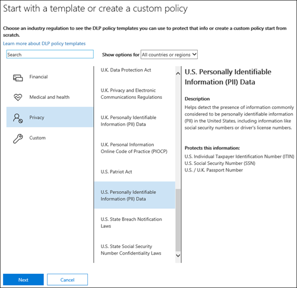
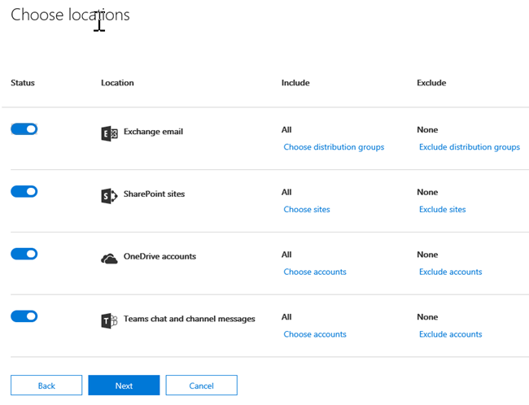

# 從範本建立 DLP 原則

要開始使用 DLP 原則，最簡單且最常見方式是使用 Office 365 所包含的其中一個範本。 您可以使用其中一種範本，也可以自訂規則，以符合組織的特定合規性需求。
  
Microsoft 365 包含超過40的可供使用的範本，可協助您符合廣泛的常見法規和商務原則需求。 例如，下列項目就有 DLP 原則範本：
  
- Gramm-Leach-Bliley Act (GLBA)
    
- 支付卡行業資料安全標準 (PCI DSS)
    
- 美國個人識別資訊 (美國 PII)
    
- 美國健康保險法案 (HIPAA)
    
您可以修改任何現有的規則或新增規則，以微調範本。例如，您可以將新的敏感資訊類型新增至規則、修改規則中的計數使其更難以或容易觸發、允許人員藉由提供正當業務理由來覆寫規則中的動作，或變更通知和事件報告的傳送對象。DLP 原則範本可做為許多常見規範案例的彈性起始點。
  
您也可以選擇自訂範本 (沒有任何預設規則)，然後從頭設定 DLP 原則，以符合組織的特定規範需求。
  
## 範例：在所有商務用 OneDrive 中識別敏感資訊，並限制組織外部人員的存取權

OneDrive 商務帳戶，讓組織內的人員可以輕鬆地共同作業和共用檔。 不過，法規遵從性監察官的常見問題是儲存在商務帳戶 OneDrive 中的機密資訊，可能不會與組織外部的人員共用。 DLP 原則有助於降低此風險。
  
在此範例中，您將建立一個識別美國 PII 資料的 DLP 原則，其中包括個別的納稅人識別碼（ITIN）、社會保險號碼和美國護照號碼。 您將會開始使用範本，然後您將修改範本，以符合組織的合規性需求（特別是，您可以：
  
- 新增一些類型的敏感資訊-U.S。銀行帳戶號碼和美國駕駛執照號碼，這樣 DLP 原則可以保護更多機密資料。
    
- 使原則更具敏感性，使單一的機密資訊出現足以限制外部使用者的存取。
    
- 讓使用者藉由提供正當業務理由或回報誤判來覆寫動作。 如此一來，您的 DLP 原則不會防止組織中的人員完成工作，只要他們有有效的業務理由共用敏感資訊。
    
### 從範本建立 DLP 原則

1. 請移至 [https://protection.office.com](https://protection.office.com)。
    
2. 使用您的公司或學校帳戶登入。 現在您已在安全性與 &amp; 合規性中心。
    
3. 在 [安全性與 &amp; 合規性中心] \> 左側導覽 \> **資料遺失防護** \> **原則**中， \> **建立原則**。
    
    
  
4. 選擇 DLP 原則範本，以保護您 \> **下一步**所需的敏感資訊類型。
    
    在此範例中，您會選取**隱私權** \> **美國個人身分識別資訊（PII）資料**，因為它已經包含您要保護的大部分敏感資訊類型，您將在稍後新增一些類型。 
    
    當您選取範本時，您可以閱讀右邊的描述，以瞭解範本所保護的敏感資訊類型。
    
    
  
5. 將原則命名為 \> **[下一步]**。
    
6. 若要選擇您想要 DLP 原則保護的位置，請執行下列其中一項操作：
    
  - **在** \> **[下一步]** 中選擇 Office 365 的所有位置。
    
  - 選擇 [**讓我選擇特定位置** \> **] [下一步]**。 在此範例中，請選擇此。
    
    若要包含或排除整個位置（例如所有 Exchange 電子郵件或所有 OneDrive 帳戶），請切換該位置的**狀態**。 
    
    若要只包含特定的 SharePoint 網站或 OneDrive 商務帳戶，請將**狀態**切換為 [開啟]，然後按一下 [**包含**] 底下的連結，選擇特定的網站或帳戶。 當您將原則套用至網站時，該原則中設定的規則會自動套用至該網站的所有子網站。 
    
    
  
    在此範例中，若要保護儲存在商務帳戶所有 OneDrive 中的機密資訊，請關閉**Exchange 電子郵件**和**SharePoint 網站**的**狀態**，並保留**OneDrive 帳戶**的**狀態**。
    
7. 選擇 [**使用高級設定** \> **] [下一步]**。
    
8. DLP 原則範本包含預先定義的規則，且附有條件和動作，分別會偵測特定類型的敏感資訊和採取因應措施。 您可以編輯、刪除或關閉任何現有的規則，也可以新增新的規則。 完成時，按 **[下一步]**。
    
    
  
    在此範例中，美國 PII 資料範本包含兩個預先定義的規則：
    
  - 偵測**到的內容量下限（美國 PII** ）此規則會尋找包含三種機密資訊類型（ITIN、SSN 和美國護照號碼）的兩種類型的檔，其中包含與組織外部人員共用檔案的位置。 如果找到，該規則會傳送電子郵件通知給主要網站集合管理員、檔擁有者，以及上次修改檔的人員。 
    
  - 偵測**到的高容量內容（美國 PII** ）此規則會尋找包含10個以上相同三個機密資訊類型的檔案，其中檔案與組織外部人員共用的檔案。 如果找到，此動作也會傳送電子郵件通知，此外也會限制對該檔案的存取。 若為商務用 OneDrive 的內容，這表示檔的許可權是針對所有人員所限制，除了主要網站集合管理員、檔擁有者，以及上次修改檔的人員之外。 
    
    為了符合您組織的特定需求，您可能想要讓規則更容易觸發，所以機密資訊的單一出現足以封鎖外部使用者的存取。 在查看這些規則之後，您知道您不需要低和高計數規則，但只要找到任何存在的敏感資訊，就只需要一個規則來封鎖存取。
    
    所以，您可以展開名為「**容量下限」的規則（即偵測出的美國 PII** \> **刪除規則**）。
    
    
  
9. 現在，在此範例中，您需要新增兩個機密資訊類型（美國銀行帳戶號碼和美國駕駛執照號碼）、允許人員覆寫規則，以及將計數變更為任何發生的專案。 您可以編輯一個規則來執行所有操作，如此一來，選取「偵測**的內容數量上限」美國 PII** \> **Edit rule**。
    
    
  
10. 若要新增機密資訊類型，請在 [**條件**] 區段中 \> **新增或變更類型**。 然後，在 [**新增或變更類型**] 底下， \> 選擇 [**新增** \> 選取**美國銀行帳戶號碼**和**美國駕駛執照號碼**] [ \> **Add** \> **Done**新增]。
    
    
  
    
  
11. 若要變更計數（觸發規則所需的機密資訊實例數），請在 [**實例計數**] 下， \> 選取每個類型為1的**最小**值 \> 。 最小計數不能是空的。 最大計數可以是空的。空的**max**值會轉換成**any**。
    
    完成後，所有敏感資訊類型的最小計數應為1，最大計數**應為** **1** 。 換句話說，任何這類機密資訊的出現都會滿足此條件。
    
    
  
12. 針對最後的自訂，您不希望 DLP 原則封鎖人員在具備有效的業務理由或遇到誤報時執行其工作，所以您想要讓使用者通知包含覆寫封鎖動作的選項。
    
    在 [**使用者通知**] 區段中，您可以看到範本中的此規則預設會開啟電子郵件通知和原則提示。 
    
    在 [**使用者覆寫**] 區段中，您可以看到業務理由的覆寫已開啟，但不會覆寫報告誤報。 **若將規則報告為誤報，請選擇自動覆寫該規則**。
    
    
  
13. 在規則編輯器的頂端，將此規則的名稱從偵測到的預設**大量內容**變更為**使用美國 pii**偵測到的任何內容，因為它現在是由任何出現的敏感資訊類型所觸發。 
    
14. 在規則編輯器的底部 \> **儲存**。
    
15. 請複查此規則的條件和動作（ \> **下一步**）。
    
    在右側，請注意規則的**狀態**參數。 如果您關閉整個原則，則所有包含在原則中的規則也會關閉。 不過，您可以在這裡關閉特定規則，而不會關閉整個原則。 這在您需要調查會產生大量誤判的規則時會很有用。 
    
16. 在下一個頁面上，閱讀並瞭解下列各項，然後選擇是否要先開啟規則或先將它測試到 \> **下一步**。
    
     建立 DLP 原則之前，您應考慮逐漸推出這些原則，以便在完全強制執行之前評估其影響及測試其效果。 例如，您不想讓新的 DLP 原則無意間封鎖對數千份檔的存取權，讓使用者必須完成其工作。 
    
    如果您正在建立的 DLP 原則可能有重大影響，建議依照下列順序進行：
    
17. 以測試模式啟動但不顯示原則提示，然後使用 DLP 報告來評估影響。您可以使用 DLP 報告來檢視原則相符項目的號碼、位置、類型和嚴重性。根據結果，您可以視需要微調規則。在測試模式中，DLP 原則不會影響您的組織中工作人員的生產力。 
    
18. 移至測試模式並顯示通知和原則提示，以便您開始教導使用者相關規範原則及熟悉即將套用的規則。在這個階段，您也可以要求使用者回報誤判，以便您進一步調整規則。
    
19. 開啟原則，以強制執行規則，並保護內容。 繼續監視 DLP 報告以及任何事件報告或通知，確保得到您想要的結果。 
    
    
  
20. 查看您的設定您的此原則 \> 選擇 [**建立**]。
    
在您建立及開啟 DLP 原則之後，它會部署至其所包含的任何內容來源，例如 SharePoint 線上網站或商務用 OneDrive，而原則會自動開始對該內容強制執行其規則。
  
## 檢視 DLP 原則的狀態

您可以隨時在安全性與合規性中心的 [**資料遺失防護**] 區段中，于 [**原則**] 頁面上查看 DLP 原則的狀態 &amp; 。 您可以在這裡找到重要資訊，例如是否已順利啟用或停用原則，或原則是否處於測試模式。 
  
下列是不同狀態及其代表的意義。
  
|**狀態**|**說明**|
|:-----|:-----|
|**正在開啟…**   |正在將原則部署到其包含的內容來源。尚未在所有來源上強制執行此原則。    |
|**測試，有通知**   |原則處於測試模式。不會套用規則中的動作，但會收集原則相符項目，並且可使用 DLP 報告加以檢視。原則相符項目的相關通知會傳送給指定收件者。    |
|**測試，沒有通知**   |原則處於測試模式。不會套用規則中的動作，但會收集原則相符項目，並且可使用 DLP 報告加以檢視。原則相符項目的相關通知不會傳送給指定收件者。    |
|**On**   |原則在使用中且已強制執行。原則已成功部署到其所有內容來源。    |
|**正在關閉…**   |正在將原則從其包含的內容來源移除。此原則在某些來源上仍然在作用中且已強制執行。關閉原則可能需要 45 分鐘。    |
|**關閉**   |原則不在作用中且並未強制執行。原則的設定 (來源、關鍵字、期限等) 已儲存。    |
|**刪除。。。**   |正在刪除原則。 原則不在作用中且並未強制執行。 原則 delet 時，通常需要一個小時   |
   
## 關閉 DLP 原則

您可以隨時編輯或關閉 DLP 原則。 關閉原則會停用原則中的所有規則。
  
若要編輯或關閉 DLP 原則，請在 [**原則**] 頁面上 \> 選取原則 \> **編輯原則**。
  

  
此外，您可以個別關閉每個規則，方法是編輯原則，然後關閉該規則的**狀態**，如上所述。 
  
## 詳細資訊

- [資料外洩防護原則概觀](data-loss-prevention-policies.md)
    
- [傳送通知並顯示 DLP 原則的原則秘訣](use-notifications-and-policy-tips.md)
    
- [建立 DLP 原則來保護具有 FCI 或其他屬性的文件](protect-documents-that-have-fci-or-other-properties.md)
    
- [DLP 原則範本包含哪些內容](what-the-dlp-policy-templates-include.md)
    
- [敏感資訊類型實體定義](sensitive-information-type-entity-definitions.md)
    

