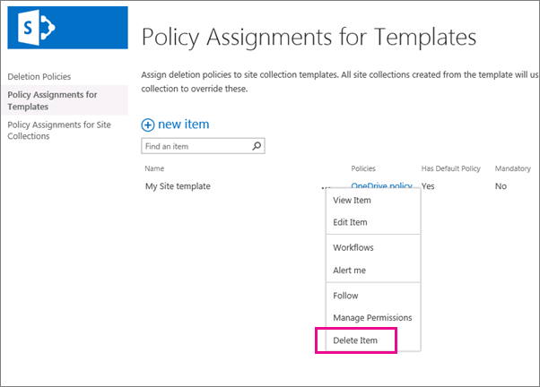

# 建立文件刪除原則

> [!IMPORTANT]
> 展望未来，我们建议您使用在 Microsoft 365 合规性中心、Microsoft 365 安全中心或 Office 365 安全&amp;合规性中心创建的保留策略或保留标签，而不是文档删除策略。 文档删除策略将继续与保留策略并行工作，但如果您需要在 Office 365 中的任意位置保留或删除内容，我们建议您使用保留策略。 有关详细信息，请参阅[使用保留策略而不是这些功能。](retention-policies.md#use-a-retention-policy-instead-of-these-features) 
  
基於規範、法律或其他規定，組織通常必須將文件保留一段時間。但是，將文件保留超過要求時間，可能會讓組織暴露在法律風險下。
  
使用文档删除策略，您可以通过在特定时间段后删除网站中的文档来主动降低风险，例如，您可以在创建文档五年后删除用户 OneDrive 业务网站中的文档。 
  
建立文件刪除原則後，您可以將其指派到網站集合範本，因此可將此原則套用到從那個範本中建立的所有網站集合。您也可以指派一個原則至特定網站集合，它會覆寫已經指派到此網站集合範本的任何原則。
  

  
## 原則範本

您可以從頭開始建立文件刪除原則，或是使用其中一個範例原則。規範原則中心含有可供您直接使用的範例原則，或者您可以將它們做為起點，然後加以重新命名或修改。
  

  
## 範例

一個網站集合或網站集合範本可擁有一或多個原則指派，每個原則可擁有一或多個規則。 但是，每个站点只能有一个活动策略，并且站点中的库有时只能有一个删除规则处于活动状态。
  

  
此外，您可以將原則選擇做為強制或預設原則，也可以將刪除規則選擇做為預設規則： 
  
- **强制性策略**当策略标记为必填项时，只能将一个策略分配给网站集或模板。 策略必须标记为默认值，并将应用于所有站点。 网站所有者不能选择退出该策略。
    
- **默认策略**当策略设置为默认值时，该策略将自动在分配给它的所有站点中处于活动状态，网站所有者无需执行任何操作。
    
- **默认规则**当删除规则设置为默认值时，它将自动应用于使用该策略的站点中的所有库。
    
下列範例將說明何時您可能需要使用一個強制原則或預設原則與規則。
  
### 範例 1：套用一個擁有單一規則的單一原則至網站集合範本。

您可能會想要在範圍廣泛的非結構化內容 (例如 OneDrive for Business 網站或所有小組網站) 上，強制執行文件刪除原則。如果要確定文件刪除原則已套用到網站集合範本裡的所有網站，您可以：
  
1. 建立包含單一預設刪除規則的單一原則。
    
2. 將原則設定為強制和預設原則。
    
3. 將此原則指派到網站集合範本。
    
在此範例中，預設的刪除原則將套用到範本下網站集合的所有文件庫，而且網站擁有者無法選擇退出此原則。這是最簡單的方法來廣泛且正確地強制執行文件刪除原則。
  

  
### 示例 2：将具有多个规则的单个策略应用于网站集模板

網站擁有者通常最清楚他們網站的內容類型，所以，您也可以讓網站擁有者選擇最適合套用到他們網站的刪除原則。您也可以允許網站擁有者完全選擇退出原則。
  
在此同時，您仍然可以集中建立與管理這些原則。您也可以選擇將一個原則與規則做為預設原則和規則，所以在網站擁有者選擇不同原則或選擇退出原則之前，該原則將永遠有效。如果您要為網站擁有者提供這樣的彈性，您可以：
  
1. 建立包含數個刪除規則之單一原則，並將一個規則設定為預設規則。
    
2. 將原則設定為預設原則。
    
3. 將此原則指派到網站集合範本。
    
網站擁有者可選擇其中一個替代刪除規則、選擇退出原則，或是不執行任何動作，然後遵循預設的原則和規則。
  

  
### 範例 3：將包含一或多個規則的數個原則套用至網站集合

此範例可為網站擁有者提供最大彈性，因為他們可以從多個原則中做選擇，而且選擇一個原則後，他們通常還可以從數個規則中做選擇。將一個原則和規則設定為預設原則和規則，所以在網站擁有者選擇不同原則或選擇退出原則之前，該原則將永遠有效。請注意，如果您並未將一個原則和規則設定為預設原則和規則，則在網站擁有者選取和套用這些原則和規則之前，所有原則和規則對網站的文件庫都將無效。
  
與前兩個範例不同之處在於，這些原則是指派到一個特定網站集合，而非網站集合範本。這代表可以針對特定網站集合中的內容，更具體地量身訂作原則。
  
原則與規則是繼承而來的。網站擁有者可以為他們的網站選擇一個原則與一個規則，而所有子網站將繼承其上層的原則。但是，子網站的擁有者可以藉由選擇不同的原則和規則來中斷繼承，而再次中斷繼承之後，這個原則與規則便會套用到所有子網站。
  
若要設定此狀況，您可以：
  
1. 建立數個原則，並且每個原則都包含一或多個規則。
    
2. 將一個原則和規則設定為預設原則和規則。
    
3. 將這些原則指派至特定網站集合。
    
此外，這些原則與規則專為特定網站集合量身訂作，其中網站擁有者藉由選擇最符合其網站需求的原則和規則來中斷繼承。
  

  
## 建立文件刪除原則

1. 在 Office 365&amp;安全合规性中心中，导航到**数据管理**\>**保留**。 **在"删除"** 下，**单击"管理共享点联机文档删除策略"和"企业一个驱动器"。** 「文件刪除原則中心」會在新瀏覽器索引標籤中開啟。
    
    首次从安全&amp;合规性中心导航到文档删除策略中心时，将自动为您创建策略中心。 或者，您可以通过**在"企业"** 选项卡上[创建网站集](http://go.microsoft.com/fwlink/p/?LinkID=404342)并选择**合规性策略中心**来手动创建策略中心。 
    
2. 选择**删除策略**。
    
    
  
3. 選擇 **[新增項目]**。
    
4. 輸入原則名稱與說明。網站擁有者可以根據這個名稱和說明為其網站選擇一個原則，因此請註明足夠資訊，以便網站擁有者能選擇正確的原則。
    
5. 若要建立一個規則，請選擇 **[新增]**。
    
6. 輸入一個名稱，然後選擇下列選項：
    
  - 選擇是否將規則永久刪除，或是丟到資源回收桶。 從網站永久刪除一個項目前，資源回收筒提供了一個第二階段的安全網。 有关回收站的详细信息，请参阅[清空回收站或还原文件。](http://go.microsoft.com/fwlink/p/?LinkID=404348)
    
  - 選擇刪除日期是以文件建立當天或最後一次更新的日期開始算起。
    
  - 輸入期限的天數、月數或年數，超過此期限後，文件將會遭到刪除。
    
  - 選擇此規則是否是預設的規則。您所建立的第一個規則會自動設定為預設的規則。預設規則會自動套用到使用此原則之網站上的所有文件庫。
    

  
7. 按一下 [儲存]****。
    
8. 您也可以建立其他的規則，讓網站擁有者可以選擇將不同規則套用到他們的網站。如果網站擁有者沒有執行任何動作，則會套用預設規則 (若有的話)。
    
9. 要从策略中删除规则，请选择该规则，单击"**删除"，** 然后单击"**确定"。**
    
    > [!NOTE]
    > 如果删除规则，并且策略不包含默认规则，则该策略没有任何规则生效，换言之，不会删除任何文档。 
  

  
## 將文件刪除原則指派至網站集合範本。

指派一個原則到網站集合範本後，這個原則即套用到此範本建立的所有網站集合，包含現有的與未來建立的網站集合。
  
请务必了解，为文档删除策略指定的时间段是指创建或修改文档以来的时间，而不是分配策略后的时间。 如果您是初次指派原則，網站上所有文件皆會列入評估，符合標準的文件就會遭到刪除。 此原則適用於所有現有文件，而不是只適用於指派原則後才建立的新文件。
  
1. 在安全&amp;合规性中心，导航到**数据管理**\>**保留**。 **在"删除"** 下，**单击"管理共享点联机文档删除策略"和"企业一个驱动器"。** 「文件刪除原則中心」會在新瀏覽器索引標籤中開啟。
    
2. 選擇 [範本的原則指派]****。
    
    
  
3. 選擇 **[新增項目]**。
    
4. 執行下列其中一項操作：
    
  - 若要指派原則至網站集合範本 (如「小組網站」範本)，請選取 [指派至網站集合範本]****，然後選取網站集合範本。
    
  - 要将策略分配给用户的"一个业务驱动器"，**请选择"为业务模板分配到 OneDrive"，** 如下所示。
    
    > [!NOTE]
    > 當您將原則指派至網站集合範本，此原則會套用到範本下現有的網站集合以及未來建立的網站集合。 
  

  
5. 按一下 [儲存]****。
    
    > [!NOTE]
    > 每個範本只能有一個指派給它的原則。 如果看到错误，指出此模板已为其分配了策略，请在左侧导航\>**中选择"取消**\>**分配给网站集"** 选择网站集以查看和管理已分配的策略集分配。 
  
6. 選取 **[管理指派的原則]**，選擇您要指派的原則，然後選擇是否設定為預設原則。 如果您設定一個預設原則，所有套用此原則的網站都會自動執行此原則，網站擁有者不需要進行任何動作。
    
    
  
7. 按一下 [儲存]****。
    
8. 如果您要在所有網站上強制執行該原則，且不允許網站擁有者選擇退出，請選擇 **[將原則設定為強制原則]**。當您將原則設定為強制原則時後，便只能將該單一原則指派至網站集合範本。該原則也會標示為預設原則。
    
    如果此選項變為灰色，請選擇 **[管理指派的原則]** 然後確定是否至少指派了一個原則並將之設定為預設原則。 
    
9. 按一下 [儲存]****。
    
## 將文件刪除原則指派至網站集合

將原則指派至特定網站集合，即表示此原則僅可供該特定網站集合使用。這表示您可以制定更符合網站集合內容的原則。同樣地，指派到特定網站集合的原則會覆寫已經指派到此網站集合範本的任何原則。舉例來說，指派到「業務部門」網站集合 (由小組網站建立) 的原則，將會覆寫指派到小組網站範本的任何原則。
  
请务必了解，为文档删除策略指定的时间段是指创建或修改文档以来的时间，而不是分配策略后的时间。 如果您是初次指派原則，網站上所有文件皆會列入評估，符合標準的文件就會遭到刪除。 此原則適用於所有現有文件，而不是只適用於指派原則後才建立的新文件。
  
1. 在安全&amp;合规性中心，导航到**数据管理**\>**保留**。 **在"删除"** 下，**选择"管理共享点联机文档删除策略"和"企业一个驱动器"。** 「文件刪除原則中心」會在新瀏覽器索引標籤中開啟。
    
2. 選擇 [網站集合的原則指派]****。
    
    
  
3. 選擇 **[新增項目]**。
    
4. 选择**网站集。** 按名称或 URL 搜索网站集，选择网站集并**单击"保存"。**
    
    > [!NOTE]
    > 每個網站集合只能有一個指派給它的原則。 如果看到错误，指出此网站集已为其分配策略，**请选择"取消**\>**分配给网站集"，** 然后选择网站集以查看和管理已分配的策略集。 
  

  
5. 選取 **[管理指派的原則]**，選擇您要指派的原則，然後選擇是否設定為預設原則。 如果您設定一個預設原則，所有套用此原則的網站都會自動執行此原則，網站擁有者不需要進行任何動作。
    
    
  
6. 按一下 [儲存]****。
    
7. 如果您要在所有網站上強制執行該原則，且不允許網站擁有者選擇退出，請選擇 **[將原則設定為強制原則]**。當您將原則設定為強制原則時後，便只能將該單一原則指派至網站集合。該原則也會標示為預設原則。
    
    如果此選項變為灰色，請選擇 **[管理指派的原則]** 然後確定是否至少指派了一個原則並將之設定為預設原則。 
    
8. 按一下 [儲存]****。
    
## 刪除原則指派

當您刪除指派，其指派的原則將不再套用到網站集合的任何網站或網站集合範本。
  
1. 在安全&amp;合规性中心，导航到**数据管理**\>**保留**。 **在"删除"** 下，**选择"管理共享点联机文档删除策略"和"企业一个驱动器"。** 「文件刪除原則中心」會在新瀏覽器索引標籤中開啟。
    
2. 選擇 [範本的原則指派]**** 或 [網站集合的原則指派]****。
    
3. 选择工作分配项，**然后单击"删除项目"。**
    
    
  
## 刪除原則

不能删除正在使用的策略。 在删除策略之前，首先需要删除包含该策略的网站集和网站集模板的所有分配，请参阅上一节。
  
1. 在&amp;安全\>合规性中心中，在"删除共享点联机"和 OneDrive 的"**删除**\>\>管理文档删除策略"下在左侧导航**中选择"数据管理**\>**保留"** **商务.** 「文件刪除原則中心」會在新瀏覽器索引標籤中開啟。
    
2. 选择 " 删除策略 *。
    
    
  
3. 選取原則。
    
4. 在"功能\>区**项目"** 选项卡\>上**删除策略**。
    
    
  
5. 如果策略正在使用中，系统将询问您是否要从正在使用该策略的所有网站集中删除该策略。 如果您确定，请选择"**确定"。**
    
    
  
## 請參閱

[文件刪除原則概觀](document-deletion-policies.md)

[应用或删除网站的文档删除策略](apply-or-remove-a-document-deletion-policy-for-a-site.md)
 

