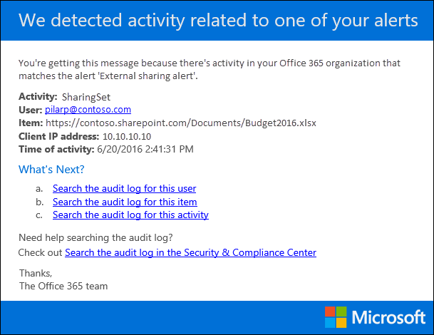

# 在 Office 365 中创建活动警报

您可以创建活动警报，当用户在 Office 365 中执行特定活动时，该警报将向您发送电子邮件通知。 活动警报类似于在 Office 365 审核日志中搜索事件，只不过，当您为已创建警报的活动发生的事件发生时，系统会向您发送一封电子邮件。 
  
 **为什么要使用活动警报而不是搜索审核日志？** 您可能确实想知道特定用户执行的特定类型的活动或活动。 您可以使用活动警报让 Office 365 在用户执行这些活动时向您发送电子邮件，而不必记住搜索这些活动的审核日志。 例如，您可以创建活动警报以在用户删除 SharePoint 中的文件时通知您，也可以创建警报以在用户从邮箱中永久删除邮件时通知您。 发送给您的电子邮件通知包括有关执行了哪些活动以及执行该活动的用户的信息。 

> [!NOTE]
> 我们建议您在安全和合规性中心开始使用警报策略，而不是创建新的活动警报。 警报策略提供附加功能，例如创建警报策略的能力，该策略在任何用户执行指定活动时触发警报，并在安全和合规性**中心的"查看警报"** 页上显示警报。 有关详细信息，请参阅[警报策略](alert-policies.md)。
  
## 開始之前

- 您必须在安全&合规性中心分配组织配置角色，以管理活动警报。 默认情况下，此角色分配给合规性管理员和组织管理角色组。 有关将成员添加到角色组的详细信息，请参阅[向用户授予对"安全&合规性中心"的访问权限。](../security/office-365-security/grant-access-to-the-security-and-compliance-center.md)
    
- 您（或其他管理员）必须先打开组织的审核日志记录，然后才能开始使用活动警报。 为此，只需单击"**开始记录用户和管理员活动"** 页上**的活动。** （如果您没有看到此链接，则您的组织已打开审核。您还可以在安全&合规中心**中的"审核日志搜索"** 页上打开审核（转到**搜索**\>**审核日志搜索）。** 您只需要为您的组织执行此操作一次。
  
- 您可以为可以在 Office 365 审核日志中搜索的相同活动创建警报。 有关可以为其创建警报的常见方案（以及要监视的特定活动）的列表，[请参阅"详细信息"](#more-information)部分。 
    
- 您可以使用"安全&合规性中心"**中的"活动警报"** 页，仅为组织通讯簿中列出的用户执行的活动创建警报。 不能使用此页面为未在通讯簿中列出的外部用户执行的活动创建警报。 
    
## 创建活动警报

1. 移至 [https://protection.office.com/managealerts](https://protection.office.com/managealerts)。
    
2. 使用公司或學校帳戶登入 Office 365。
    
3. 在"**活动警报"**图标**新建"。**

   将显示用于创建活动警报的弹出窗口页。

    
    
  
4. 完成以下字段以创建活动警报：
    
    a. **名称**- 键入警报的名称。 警报名称在组织内必须是唯一的。
    
    b. **描述**（可选） - 描述警报，例如要跟踪的活动和用户，以及发送电子邮件通知的用户。 描述提供了一种快速简便的方法，可以向其他管理员描述警报的用途。
    
    c. **警报类型**- 确保**选择了"自定义"** 选项。 

    d. **发送此警报时**-**单击"发送此警报时"，** 然后配置以下两个字段：
    
    - **活动**- 单击下拉列表以显示可以为其创建警报的活动。 这与搜索 Office 365 审核日志时显示的活动列表相同。 您可以选择一个或多个特定活动，也可以单击活动组名称以选择组中的所有活动。 有关这些活动的说明，请参阅[搜索审核日志](search-the-audit-log-in-security-and-compliance.md#audited-activities)中的"已审核活动"部分。 当用户执行您已添加到警报的任何活动时，将发送电子邮件通知。 
    
     - **用户**- 单击此框，然后选择一个或多个用户。 如果此框中的用户执行您添加到"**活动"** 框中的活动，将发送警报。 将"**用户"** 框留空以在组织中的任何用户执行警报指定的活动时发送警报。 

    e. **将此警报发送到**-**单击"发送此警报"，****然后单击"收件人"** 框并键入名称以添加当用户（**在"用户"** 框中指定）执行活动（在 中指定）时将收到电子邮件通知的用户。**活动**框）。 请注意，默认情况下，您将添加到收件人列表中。 可以从此列表中删除您的姓名。
    
5. **单击"保存"** 以创建警报。 
    
    新警报**将显示在"活动警报"** 页上的列表中。 
    
    
  
    警报的状态**设置为"打开"。** 请注意，在发送警报时将收到电子邮件通知的收件人也会列出。 
  
## 关闭活动警报

您可以关闭活动警报，以便不发送电子邮件通知。 关闭活动警报后，它仍显示在组织的活动警报列表中，并且您仍然可以查看其属性。
  
1. 转到[https://protection.office.com/managealerts](https://protection.office.com/managealerts)。
    
2. 使用公司或學校帳戶登入 Office 365。
    
3. 在组织的活动警报列表中，单击要关闭的警报。
    
4. 在"**编辑警报"** 页上，**单击"打开**切换开关"将状态**更改为"关闭"，** 然后单击"**保存"。**
    
    "**活动警报"** 页上的警报状态**设置为"关闭"。** 
    
要重新打开活动警报，只需重复这些步骤，然后单击**Off**切换开关将状态**更改为"打开"。**
  
## 詳細資訊

- 下面是发送给用户的电子邮件通知的示例，这些通知在"安全&合规性中心"中的"将此警报发送到"字段（并在**活动警报**页面上**的"收件人"** 下列出）中指定。 
    
    
  
- 下面是一些常见的文档和电子邮件活动，您可以为其创建活动警报。 这些表描述活动、要为其创建警报的活动的名称，以及活动在"**活动"** 下拉列表中列出的活动组的名称。 要查看可以为其创建活动警报的活动的完整列表，请参阅[搜索审核日志](search-the-audit-log-in-security-and-compliance.md#audited-activities)中的"已审核活动"部分。
    
    > [!TIP]
    > 您可能希望只为任何用户执行的一个活动创建活动警报。 或者，您可能希望创建一个活动警报，以跟踪由一个或多个用户执行的多个活动。 
  
    下表列出了 SharePoint 或 OneDrive 中的一些常见文档相关活动。
    
    |**当用户这样做时...**|**为此活动创建警报**|**活动组**|
    |:-----|:-----|:-----|
    |查看网站上的文档。    |访问的文件    |文件和文件夹活动    |
    |编辑或更改文档。    |修改后的文件    |文件和文件夹活动    |
    |与组织外部的用户共享文档。    |共享文件、文件夹或网站    And    已创建共享邀请    有关详细信息，请参阅在[Office 365 审核日志中使用共享审核](use-sharing-auditing.md)。    |共享和访问请求活动    |
    |上传或下载文档。    |上传的文件    和/或    下载的文件    |文件和文件夹活动    |
    |更改对网站的访问权限。    |修改的网站权限    |网站管理活动    |

    下表列出了 Exchange 在线中一些常见的电子邮件相关活动。

    |**当用户这样做时...**|**为此活动创建警报**|**活动组**|
    |:-----|:-----|:-----|
    |从邮箱中永久删除（清除）电子邮件。    |从邮箱清除邮件    | 交换邮箱活动    |
    |从共享邮箱发送电子邮件。    |使用"发送为"权限发送邮件    And    使用"代发送"权限发送消息    | 交换邮箱活动    |
   
- 您还可以使用"安全&合规性中心 PowerShell 中**的新活动警报**和**设置活动警报**cmdlet"来创建和编辑活动警报。 如果您使用这些 cmdlet 创建或编辑活动警报，请记住以下事项： 
    
  - 如果使用 cmdlet 将活动添加到未在"**活动"** 下拉列表中列出的警报，则属性页上将显示一条消息，指出"此警报具有选取器中未列出的自定义操作"。 
    
  - 使用 cmdlet 创建或编辑活动警报的一个良好原因是向组织外部的人员发送电子邮件通知。 此外部用户将列在警报的收件人列表中。 但是，如果从警报中删除此外部用户，则**无法使用"编辑"警报**页将该用户重新添加到警报中。 您必须使用**Set-ActivityAlert** cmdlet 重新添加外部用户，或使用**New-ActivityAlert** cmdlet 将相同（或不同的）外部用户添加到新警报。 
