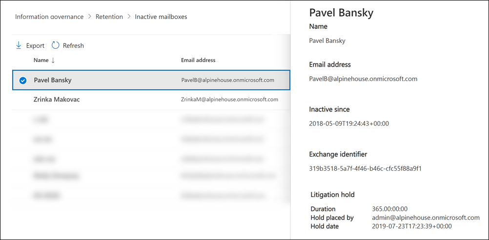

# <a name="create-and-manage-inactive-mailboxes"></a><span data-ttu-id="91cb3-103">建立和管理非使用中信箱</span><span class="sxs-lookup"><span data-stu-id="91cb3-103">Create and manage inactive mailboxes</span></span>

<span data-ttu-id="91cb3-104">Microsoft 365 使您可以保留已刪除信箱的內容。</span><span class="sxs-lookup"><span data-stu-id="91cb3-104">Microsoft 365 makes it possible for you to retain the contents of deleted mailboxes.</span></span> <span data-ttu-id="91cb3-105">這項功能稱為 [非](inactive-mailboxes-in-office-365.md)使用中信箱。</span><span class="sxs-lookup"><span data-stu-id="91cb3-105">This feature is called [inactive mailboxes](inactive-mailboxes-in-office-365.md).</span></span> <span data-ttu-id="91cb3-106">非使用中的信箱可讓您在離開組織之後，保留離職的員工電子郵件。</span><span class="sxs-lookup"><span data-stu-id="91cb3-106">Inactive mailboxes allow you to retain former employees' email after they leave your organization.</span></span> <span data-ttu-id="91cb3-107">在 Office 365 或 Microsoft 365) 中的 [安全性與合規性中心] 中 (建立訴訟保留原則或保留原則時，信箱會變成非使用中，以刪除對應的使用者帳戶之前的信箱。</span><span class="sxs-lookup"><span data-stu-id="91cb3-107">A mailbox becomes inactive when a Litigation Hold or a retention policy (created in the security and compliance center in Office 365 or Microsoft 365) is applied to the mailbox before the corresponding user account is deleted.</span></span> <span data-ttu-id="91cb3-108">非使用中信箱的內容會保留在信箱停用的保留期間內，直到未使用中的信箱為止。</span><span class="sxs-lookup"><span data-stu-id="91cb3-108">The contents of an inactive mailbox are retained for the duration of the hold that was placed on the mailbox before it was made inactive.</span></span> <span data-ttu-id="91cb3-109">這可讓系統管理員、合規性監察官和記錄管理員使用內容搜尋來搜尋和匯出非使用中信箱的內容。</span><span class="sxs-lookup"><span data-stu-id="91cb3-109">This allows administrators, compliance officers, and records managers to use Content Search to search and export the contents of an inactive mailbox.</span></span> <span data-ttu-id="91cb3-110">非作用中的信箱無法接收電子郵件，也不會顯示於貴組織的共用通訊錄或其他清單中。</span><span class="sxs-lookup"><span data-stu-id="91cb3-110">Inactive mailboxes can't receive email and aren't displayed in your organization's shared address book or other lists.</span></span>
  
> [!IMPORTANT]
> <span data-ttu-id="91cb3-111">當我們繼續以保留信箱內容的不同方式投資時，我們宣佈 Exchange 系統管理中心的退休 In-Place 封存。</span><span class="sxs-lookup"><span data-stu-id="91cb3-111">As we continue to invest in different ways to preserve mailbox content, we're announcing the retirement of In-Place Holds in the Exchange admin center.</span></span> <span data-ttu-id="91cb3-112">這表示您應該使用訴訟保留和保留原則來建立非使用中的信箱。</span><span class="sxs-lookup"><span data-stu-id="91cb3-112">That means you should use Litigation Holds and retention policies to create an inactive mailbox.</span></span> <span data-ttu-id="91cb3-113">從2020年7月1日起，您將無法在 Exchange Online 中建立新的 In-Place 保留。</span><span class="sxs-lookup"><span data-stu-id="91cb3-113">Starting July 1, 2020 you won't be able to create new In-Place Holds in Exchange Online.</span></span> <span data-ttu-id="91cb3-114">不過，您仍然可以變更置於非使用中信箱的 In-Place 保留期間。</span><span class="sxs-lookup"><span data-stu-id="91cb3-114">But you'll still be able to change the hold duration of an In-Place Hold placed on an inactive mailbox.</span></span> <span data-ttu-id="91cb3-115">不過，從2020年10月1日開始，您將無法變更保留期間。</span><span class="sxs-lookup"><span data-stu-id="91cb3-115">However, starting October 1, 2020, you won't be able to change the hold duration.</span></span> <span data-ttu-id="91cb3-116">您只能移除 In-Place 保留才能刪除非使用中的信箱。</span><span class="sxs-lookup"><span data-stu-id="91cb3-116">You'll only be able to delete an inactive mailbox by removing the In-Place Hold.</span></span> <span data-ttu-id="91cb3-117">在移除保留之前，仍會保留位於 In-Place 暫止的現有非作用中信箱。</span><span class="sxs-lookup"><span data-stu-id="91cb3-117">Existing inactive mailboxes that are on In-Place Hold will still be preserved until the hold is removed.</span></span> <span data-ttu-id="91cb3-118">如需停用 In-Place 保留的詳細資訊，請參閱 [舊版 eDiscovery tools 的退休](legacy-ediscovery-retirement.md)。</span><span class="sxs-lookup"><span data-stu-id="91cb3-118">For more information about the retirement of In-Place Holds, see [Retirement of legacy eDiscovery tools](legacy-ediscovery-retirement.md).</span></span>
  
## <a name="preparations-before-creating-an-inactive-mailbox"></a><span data-ttu-id="91cb3-119">在建立非使用中的信箱之前準備</span><span class="sxs-lookup"><span data-stu-id="91cb3-119">Preparations before creating an inactive mailbox</span></span>

- <span data-ttu-id="91cb3-120">若要讓信箱成為非使用中的信箱，必須將其指派給 Exchange Online Plan 2 授權，以便在信箱刪除之前，封存保留或保留原則可以套用至信箱。</span><span class="sxs-lookup"><span data-stu-id="91cb3-120">To make a mailbox inactive, it must be assigned an Exchange Online Plan 2 license so that a Litigation Hold or a retention policy can be applied to the mailbox before it's deleted.</span></span> <span data-ttu-id="91cb3-121">Exchange Online方案2授權屬於 Office 365 企業版 E3 和 E5 訂閱。</span><span class="sxs-lookup"><span data-stu-id="91cb3-121">Exchange Online Plan 2 licenses are part of an Office 365 Enterprise E3 and E5 subscription.</span></span> <span data-ttu-id="91cb3-122">如果信箱已被指派 Exchange Online 方案1或 Exchange Online Kiosk 授權 (（分別是 Office 365 E1 及 F1 訂閱的一部分）) ，您必須為其指派個別的 Exchange Online 封存授權，以便在信箱刪除之前，保留可以套用到該信箱。</span><span class="sxs-lookup"><span data-stu-id="91cb3-122">If a mailbox is assigned an Exchange Online Plan 1 or Exchange Online Kiosk license (which are part of an Office 365 E1 and F1 subscription respectively), you would have to assign it a separate Exchange Online Archiving license so that a hold can be applied to the mailbox before it's deleted.</span></span> <span data-ttu-id="91cb3-123">如需詳細資訊，請參閱[Exchange Online 封存](https://go.microsoft.com/fwlink/p/?LinkId=286153)。</span><span class="sxs-lookup"><span data-stu-id="91cb3-123">For more information, see [Exchange Online Archiving](https://go.microsoft.com/fwlink/p/?LinkId=286153).</span></span>

- <span data-ttu-id="91cb3-124">刪除對應的使用者帳戶之後，就可以使用與已刪除 Exchange Online 信箱相關聯的授權。</span><span class="sxs-lookup"><span data-stu-id="91cb3-124">The licenses associated with the deleted Exchange Online mailbox will be available after you delete the corresponding user account.</span></span> <span data-ttu-id="91cb3-125">然後，您可以 [將這些授權指派給其他使用者](../admin/manage/assign-licenses-to-users.md)。</span><span class="sxs-lookup"><span data-stu-id="91cb3-125">You can then [assign those licenses to another user](../admin/manage/assign-licenses-to-users.md).</span></span>

- <span data-ttu-id="91cb3-126">如果設定保留或保留的訴訟暫止或保留原則 (，但在刪除之前未套用內容) 則信箱的內容將不會遭到保留，也不會被發現。</span><span class="sxs-lookup"><span data-stu-id="91cb3-126">If a Litigation Hold or a retention policy (that's configured to retain or retain and then delete content) isn't applied to a mailbox before it's deleted, the contents of the mailbox won't be retained or discoverable.</span></span> <span data-ttu-id="91cb3-127">不過，刪除的信箱可以在刪除之後的30天內復原，但是在30天后會永久刪除信箱及其內容（如果未復原）。</span><span class="sxs-lookup"><span data-stu-id="91cb3-127">However, the deleted mailbox can be recovered within 30 days of deletion, but the mailbox and its contents will be permanently deleted after 30 days if it isn't recovered.</span></span>

- <span data-ttu-id="91cb3-128">如需訴訟暫止的詳細資訊，請參閱 [訴訟暫](/exchange/security-and-compliance/in-place-and-litigation-holds)止。</span><span class="sxs-lookup"><span data-stu-id="91cb3-128">For more information about Litigation Hold, see [Litigation Hold](/exchange/security-and-compliance/in-place-and-litigation-holds).</span></span> <span data-ttu-id="91cb3-129">如需保留原則的詳細資訊，請參閱 [瞭解保留原則和保留標籤](retention.md)。</span><span class="sxs-lookup"><span data-stu-id="91cb3-129">For more information about retention policies, see [Learn about retention policies and retention labels](retention.md).</span></span>
  
## <a name="create-an-inactive-mailbox"></a><span data-ttu-id="91cb3-130">建立非使用中的信箱</span><span class="sxs-lookup"><span data-stu-id="91cb3-130">Create an inactive mailbox</span></span>

<span data-ttu-id="91cb3-131">使信箱停用包括兩個步驟： 1) 將信箱設為訴訟暫止，或將保留原則套用至它，2) 刪除信箱或對應的使用者帳戶。</span><span class="sxs-lookup"><span data-stu-id="91cb3-131">Making a mailbox inactive involves two steps: 1) placing the mailbox on Litigation Hold or applying a  retention policy to it, and 2) deleting the mailbox or corresponding user account.</span></span> <span data-ttu-id="91cb3-132">信箱停用之後，會保留其內容，直到取消保留原則或保留原則為止。</span><span class="sxs-lookup"><span data-stu-id="91cb3-132">After the mailbox is inactive, its contents are retained until the hold or retention policy is removed.</span></span>
  
### <a name="step-1-place-a-mailbox-on-litigation-hold-or-apply-a-retention-policy"></a><span data-ttu-id="91cb3-133">步驟1：將信箱設為訴訟暫止或套用保留原則</span><span class="sxs-lookup"><span data-stu-id="91cb3-133">Step 1: Place a mailbox on Litigation Hold or apply a retention policy</span></span>

<span data-ttu-id="91cb3-134">讓信箱處於訴訟暫止狀態，或套用設定為保留或保留，然後刪除內容的保留原則 () 會在信箱刪除之前，先將內容保留下來。</span><span class="sxs-lookup"><span data-stu-id="91cb3-134">Placing a mailbox on Litigation Hold or applying a retention policy (that's configured to retain or retain and then delete content) retains the contents in the mailbox before it's deleted.</span></span> <span data-ttu-id="91cb3-135">這兩種類型的保留都會保留所有信箱內容，包括已刪除的專案和已修改專案的原始版本。</span><span class="sxs-lookup"><span data-stu-id="91cb3-135">Both types of holds will retain all mailbox content, including deleted items and original versions of modified items.</span></span> <span data-ttu-id="91cb3-136">已刪除及修改的專案會保留在指定期間內的非使用中信箱中，或是移除已套用至非使用中信箱的保留原則，以永久刪除非使用中的信箱。</span><span class="sxs-lookup"><span data-stu-id="91cb3-136">Deleted and modified items are retained in the inactive mailbox for a specified period, or until you permanently delete the inactive mailbox by removing the hold or retention policy that's applied to the inactive mailbox.</span></span>
  
<span data-ttu-id="91cb3-137">如果保留已放在信箱上，或已將保留原則套用至信箱，則您只需要刪除步驟2中所述的相對應使用者帳戶。</span><span class="sxs-lookup"><span data-stu-id="91cb3-137">If a hold is already placed on a mailbox, or if a retention policy is already applied to a mailbox, then all you have to do is delete the corresponding user account as explained in Step 2.</span></span>
  
<span data-ttu-id="91cb3-138">如需將信箱設為訴訟暫止或套用保留原則的逐步程式，請參閱：</span><span class="sxs-lookup"><span data-stu-id="91cb3-138">For step-by-step procedures for placing a mailbox on Litigation Hold or applying a retention policy, see:</span></span>
  
- [<span data-ttu-id="91cb3-139">將信箱設定為訴訟資料暫留狀態</span><span class="sxs-lookup"><span data-stu-id="91cb3-139">Place a mailbox on Litigation Hold</span></span>](create-a-litigation-hold.md)

- [<span data-ttu-id="91cb3-140">瞭解保留原則和保留標籤</span><span class="sxs-lookup"><span data-stu-id="91cb3-140">Learn about retention policies and retention labels</span></span>](retention.md)

> [!NOTE]
> <span data-ttu-id="91cb3-141">針對訴訟保留和保留原則，您可以建立無限期保留或以時間為基礎的保留。</span><span class="sxs-lookup"><span data-stu-id="91cb3-141">For Litigation Holds and retention policies, you can create an indefinite hold or on a time-based hold.</span></span> <span data-ttu-id="91cb3-142">在無限期保留中，非使用中信箱的內容會永遠保留，或直到取消保留或變更保留期間為止。</span><span class="sxs-lookup"><span data-stu-id="91cb3-142">In an indefinite hold, the contents of the inactive mailbox will be retained forever, or until the hold is removed or until the hold duration is changed.</span></span> <span data-ttu-id="91cb3-143">移除保留或保留原則之後 (假設信箱已在183天前刪除) ，則非作用中的信箱會標示為永久刪除，且信箱的內容將不再保留或可供調查。</span><span class="sxs-lookup"><span data-stu-id="91cb3-143">After the hold or retention policy is removed (assuming that the mailbox was deleted more than 183 days ago), the inactive mailbox will be marked for permanent deletion and the contents of the mailbox will no longer be retained or discoverable.</span></span> <span data-ttu-id="91cb3-144">在以時間為基礎的保留原則中，您可以指定保留的持續時間。</span><span class="sxs-lookup"><span data-stu-id="91cb3-144">In a time-based hold or retention policy, you specify the duration of the hold.</span></span> <span data-ttu-id="91cb3-145">此持續時間視個別項目而定，會從接收或建立信箱項目的日期開始計算。</span><span class="sxs-lookup"><span data-stu-id="91cb3-145">This duration is on a per-item basis and is calculated from the date a mailbox item was received or created.</span></span> <span data-ttu-id="91cb3-146">信箱專案的保留到期，且該專案移至或位於非使用中信箱的 [可復原的專案] 資料夾中之後，該專案就會永久刪除 (在已刪除專案的保留期間到期時從非使用中信箱) 清除。</span><span class="sxs-lookup"><span data-stu-id="91cb3-146">After the hold expires for a mailbox item, and that item moved to or is located in the Recoverable Items folder in the inactive mailbox, the item is permanently deleted (purged) from the inactive mailbox after the deleted item retention period expires.</span></span> 
  
### <a name="step-2-delete-the-mailbox"></a><span data-ttu-id="91cb3-147">步驟 2：刪除信箱</span><span class="sxs-lookup"><span data-stu-id="91cb3-147">Step 2: Delete the mailbox</span></span>

<span data-ttu-id="91cb3-148">在信箱保留或已套用保留原則之後，下一步是刪除信箱。</span><span class="sxs-lookup"><span data-stu-id="91cb3-148">After the mailbox is placed on hold or a retention policy is applied to it, the next step is to delete the mailbox.</span></span> <span data-ttu-id="91cb3-149">刪除信箱的最佳方式是在 Microsoft 365 系統管理中心刪除對應的使用者帳戶。</span><span class="sxs-lookup"><span data-stu-id="91cb3-149">The best way to delete a mailbox is to delete the corresponding user account in the Microsoft 365 admin center.</span></span> <span data-ttu-id="91cb3-150">如需刪除使用者帳戶的詳細資訊，請參閱 [刪除組織中的使用者](../admin/add-users/delete-a-user.md)。</span><span class="sxs-lookup"><span data-stu-id="91cb3-150">For information about deleting user accounts, see [Delete a user from your organization](../admin/add-users/delete-a-user.md).</span></span>
  
> [!NOTE]
> <span data-ttu-id="91cb3-151">您也可以在 Exchange Online PowerShell 中使用 **Remove-Mailbox** Cmdlet 刪除信箱。</span><span class="sxs-lookup"><span data-stu-id="91cb3-151">You can also delete the mailbox by using the **Remove-Mailbox** cmdlet in Exchange Online PowerShell.</span></span> <span data-ttu-id="91cb3-152">如需詳細資訊，請參閱[刪除或還原 Exchange Online 中的使用者信箱](/exchange/recipients-in-exchange-online/delete-or-restore-mailboxes)。</span><span class="sxs-lookup"><span data-stu-id="91cb3-152">For more information, see [Delete or restore user mailboxes in Exchange Online](/exchange/recipients-in-exchange-online/delete-or-restore-mailboxes).</span></span> 
  
## <a name="view-a-list-of-inactive-mailboxes"></a><span data-ttu-id="91cb3-153">查看非使用中信箱的清單</span><span class="sxs-lookup"><span data-stu-id="91cb3-153">View a list of inactive mailboxes</span></span>

<span data-ttu-id="91cb3-154">若要在您的組織中查看非使用中的信箱清單：</span><span class="sxs-lookup"><span data-stu-id="91cb3-154">To view a list of the inactive mailboxes in your organization:</span></span>

1. <span data-ttu-id="91cb3-155">移至 <https://compliance.microsoft.com>，然後使用您組織中的系統管理員帳戶認證來登入。</span><span class="sxs-lookup"><span data-stu-id="91cb3-155">Go to <https://compliance.microsoft.com> and sign in using the credentials for an administrator account in your organization.</span></span>

2. <span data-ttu-id="91cb3-156">在 Microsoft 365 規範中心的左功能窗格中，按一下 [**全部顯示**]，然後按一下 [**資訊管理] > 保留**]。</span><span class="sxs-lookup"><span data-stu-id="91cb3-156">In the left navigation pane of the Microsoft 365 compliance center, click **Show all**, and then click **Information governance > Retention**.</span></span>

   ![按一下 [保留] 頁面上的 [非使用中信箱] 按鈕。](../media/MCCInactiveMailboxes1.png)

3. <span data-ttu-id="91cb3-158">在 [ **保留** ] 頁面上，按一下 [非使用中 **信箱** ] 以顯示非使用中信箱的清單。</span><span class="sxs-lookup"><span data-stu-id="91cb3-158">On the **Retention** page, click **Inactive mailbox** to display a list of inactive mailboxes.</span></span>

4. <span data-ttu-id="91cb3-159">選取非使用中的信箱以顯示具有非使用中信箱相關資訊的飛出頁面。</span><span class="sxs-lookup"><span data-stu-id="91cb3-159">Select an inactive mailbox to display a flyout page with information about the inactive mailbox.</span></span>

     

<span data-ttu-id="91cb3-161">您可以按一下 [ ![ 匯出搜尋結果圖示] [ ](../media/47205c65-babd-4b3a-bd7b-98dfd92883ba.png) **匯出** ]，以查看或下載包含有關組織中非使用中信箱之其他資訊的 CSV 檔案。</span><span class="sxs-lookup"><span data-stu-id="91cb3-161">You can click  **Export** to view or download a CSV file that contains additional information about the inactive mailboxes in your organization.</span></span>

<span data-ttu-id="91cb3-162">或者，您也可以在 Exchange Online PowerShell 中執行下列命令，以顯示非使用中信箱的清單。</span><span class="sxs-lookup"><span data-stu-id="91cb3-162">Alternatively, you can run the following command in Exchange Online PowerShell to display the list of inactive mailboxes.</span></span>

```powershell
 Get-Mailbox -InactiveMailboxOnly | FT DisplayName,PrimarySMTPAddress,WhenSoftDeleted
```

<span data-ttu-id="91cb3-163">您也可以執行下列命令，將非使用中信箱和其他資訊的清單匯出至 CSV 檔案。</span><span class="sxs-lookup"><span data-stu-id="91cb3-163">You can also run the following command to export the list of inactive mailboxes and other information to a CSV file.</span></span> <span data-ttu-id="91cb3-164">在此範例中，會在目前目錄中建立 CSV 檔案。</span><span class="sxs-lookup"><span data-stu-id="91cb3-164">In this example, the CSV file is created in the current directory.</span></span>

```powershell
Get-Mailbox -InactiveMailboxOnly | Select Displayname,PrimarySMTPAddress,DistinguishedName,ExchangeGuid,WhenSoftDeleted | Export-Csv InactiveMailboxes.csv -NoType
```

> [!NOTE]
> <span data-ttu-id="91cb3-165">非使用中的信箱可能與使用中的使用者信箱具有相同的 SMTP 位址。</span><span class="sxs-lookup"><span data-stu-id="91cb3-165">It's possible that an inactive mailbox may have the same SMTP address as an active user mailbox.</span></span> <span data-ttu-id="91cb3-166">在此情況下， **DistinguishedName** 或 **ExchangeGuid** 屬性的值可以用來唯一識別非使用中的信箱。</span><span class="sxs-lookup"><span data-stu-id="91cb3-166">In this case, the value of the **DistinguishedName** or **ExchangeGuid** property can be used to uniquely identify an inactive mailbox.</span></span>
  
## <a name="search-and-export-the-contents-of-an-inactive-mailbox"></a><span data-ttu-id="91cb3-167">搜尋和匯出非使用中信箱的內容</span><span class="sxs-lookup"><span data-stu-id="91cb3-167">Search and export the contents of an inactive mailbox</span></span>

<span data-ttu-id="91cb3-168">您可以使用安全性 & 規範中心中的「內容搜尋」工具，存取非使用中信箱的內容。</span><span class="sxs-lookup"><span data-stu-id="91cb3-168">You can access the contents of the inactive mailbox by using the Content Search tool in the Security & Compliance Center.</span></span> <span data-ttu-id="91cb3-169">在搜尋非使用中的信箱時，您可以建立關鍵字搜尋查詢以搜尋特定項目，也可以傳回非使用中信箱的完整內容。</span><span class="sxs-lookup"><span data-stu-id="91cb3-169">When you search an inactive mailbox, you can create a keyword search query to search for specific items or you can return the entire contents of the inactive mailbox.</span></span> <span data-ttu-id="91cb3-170">您可以預覽搜尋結果，或是將搜尋結果匯出為 Outlook 資料 (PST) 檔或個別的電子郵件。</span><span class="sxs-lookup"><span data-stu-id="91cb3-170">You can preview the search results or export the search results to an Outlook Data (PST) file or as individual email messages.</span></span> <span data-ttu-id="91cb3-171">如需搜尋信箱及匯出搜尋結果的逐步程式，請參閱下列主題：</span><span class="sxs-lookup"><span data-stu-id="91cb3-171">For step-by-step procedures for searching mailboxes and exporting search results, see the following topics:</span></span>
  
- [<span data-ttu-id="91cb3-172">內容搜尋</span><span class="sxs-lookup"><span data-stu-id="91cb3-172">Content search</span></span>](content-search.md)

- [<span data-ttu-id="91cb3-173">匯出搜尋結果</span><span class="sxs-lookup"><span data-stu-id="91cb3-173">Export search results</span></span>](export-search-results.md)

<span data-ttu-id="91cb3-174">搜尋非作用中信箱時，請注意以下幾點。</span><span class="sxs-lookup"><span data-stu-id="91cb3-174">Here are a few things to keep in mind when searching inactive mailboxes.</span></span>
  
- <span data-ttu-id="91cb3-175">如果內容搜尋包含使用者信箱，且該信箱已變為非使用中，當您在未使用的情況下執行搜尋時，內容搜尋會繼續搜尋非使用中的信箱。</span><span class="sxs-lookup"><span data-stu-id="91cb3-175">If a content search includes a user mailbox and that mailbox is made inactive, the content search will continue to search the inactive mailbox when you rerun the search after it becomes inactive.</span></span>

- <span data-ttu-id="91cb3-176">在某些情況下，使用者可能會有一個使用中信箱和非使用中的信箱，且該信箱具有相同的 SMTP 位址。</span><span class="sxs-lookup"><span data-stu-id="91cb3-176">In some cases, a user may have an active mailbox and an inactive mailbox that have the same SMTP address.</span></span> <span data-ttu-id="91cb3-177">在此情況下，只會搜尋您所選做為內容搜尋位置的特定信箱。</span><span class="sxs-lookup"><span data-stu-id="91cb3-177">In this case, only the specific mailbox that you select as a location for a content search will be searched.</span></span> <span data-ttu-id="91cb3-178">換句話說，如果您將使用者的信箱新增至搜尋中，則不能假設會搜尋其作用中和非使用中的信箱;只會搜尋您明確新增到搜尋中的信箱。</span><span class="sxs-lookup"><span data-stu-id="91cb3-178">In other words, if you add a user's mailbox to a search, you can't assume that both their active and inactive mailboxes will be searched; only the mailbox that you explicitly add to the search will be searched.</span></span>

- <span data-ttu-id="91cb3-179">我們強烈建議您避免使用具有相同 SMTP 地址的作用中信箱及非作用中信箱。</span><span class="sxs-lookup"><span data-stu-id="91cb3-179">We strongly recommend that you avoid having an active mailbox and inactive mailbox with the same SMTP address.</span></span> <span data-ttu-id="91cb3-180">如果您需要重複使用目前指派給非使用中信箱的 SMTP 位址，建議您復原非使用中的信箱，或將非使用中信箱的內容還原至作用中的信箱 (或封存使用中信箱) ，然後刪除非使用中的信箱。</span><span class="sxs-lookup"><span data-stu-id="91cb3-180">If you need to reuse the SMTP address that is currently assigned to an inactive mailbox, we recommend that you recover the inactive mailbox or restore the contents of an inactive mailbox to an active mailbox (or the archive of an active mailbox), and then delete the inactive mailbox.</span></span>

## <a name="change-the-hold-duration-for-an-inactive-mailbox"></a><span data-ttu-id="91cb3-181">變更非作用中信箱的保留持續時間</span><span class="sxs-lookup"><span data-stu-id="91cb3-181">Change the hold duration for an inactive mailbox</span></span>

<span data-ttu-id="91cb3-182">將信箱設為非使用中之後，您可以變更保留期間或套用至非使用中信箱的保留原則。</span><span class="sxs-lookup"><span data-stu-id="91cb3-182">After a mailbox is made inactive, you can change the duration of the hold or the retention policy applied to the inactive mailbox.</span></span> <span data-ttu-id="91cb3-183">如需逐步程式，請參閱[變更 Office 365 中非使用中信箱的保留期間](change-the-hold-duration-for-an-inactive-mailbox.md)。</span><span class="sxs-lookup"><span data-stu-id="91cb3-183">For step-by-step procedures, see [Change the hold duration for an inactive mailbox in Office 365](change-the-hold-duration-for-an-inactive-mailbox.md).</span></span>
  
## <a name="recover-an-inactive-mailbox"></a><span data-ttu-id="91cb3-184">復原非作用中的信箱</span><span class="sxs-lookup"><span data-stu-id="91cb3-184">Recover an inactive mailbox</span></span>

<span data-ttu-id="91cb3-185">如果離職員工回到您的組織，或是聘用新的員工來承擔已離開員工的工作責任，您可以復原非使用中信箱的內容。</span><span class="sxs-lookup"><span data-stu-id="91cb3-185">If a former employee returns to your organization, or if a new employee is hired to take on the job responsibilities of the departed employee, you can recover the contents of the inactive mailbox.</span></span> <span data-ttu-id="91cb3-186">當您復原不在作用中的信箱時，信箱轉換成新的信箱、 保留的內容和非使用中的信箱資料夾結構，及信箱連結至新的使用者帳戶。</span><span class="sxs-lookup"><span data-stu-id="91cb3-186">When you recover an inactive mailbox, the mailbox is converted to a new mailbox, the contents and folder structure of the inactive mailbox are retained, and the mailbox is linked to a new user account.</span></span> <span data-ttu-id="91cb3-187">它會復原之後，非使用中的信箱不存在。</span><span class="sxs-lookup"><span data-stu-id="91cb3-187">After it's recovered, the inactive mailbox no longer exists.</span></span> <span data-ttu-id="91cb3-188">如需還原非使用中信箱時的逐步程式及詳細資訊，請參閱[復原 Office 365 中的非使用中信箱](recover-an-inactive-mailbox.md)。</span><span class="sxs-lookup"><span data-stu-id="91cb3-188">For step-by-step procedures and more information about happens when you recover an inactive mailbox, see [Recover an inactive mailbox in Office 365](recover-an-inactive-mailbox.md).</span></span>
  
## <a name="restore-the-contents-of-an-inactive-mailbox-to-another-mailbox"></a><span data-ttu-id="91cb3-189">將非使用中信箱的內容還原到另一個信箱</span><span class="sxs-lookup"><span data-stu-id="91cb3-189">Restore the contents of an inactive mailbox to another mailbox</span></span>

<span data-ttu-id="91cb3-190">如果另一位員工承擔的是離職員工的工作責任，或是其他人需要存取非使用中信箱的內容，您可以還原 (或合併) 非使用中信箱的內容到現有的信箱。</span><span class="sxs-lookup"><span data-stu-id="91cb3-190">If another employee takes on the job responsibilities of a former employee, or if another person needs access to the contents of the inactive mailbox, you can restore (or merge) the contents of the inactive mailbox to an existing mailbox.</span></span> <span data-ttu-id="91cb3-191">當您還原非使用中信箱內容複製到另一個信箱。</span><span class="sxs-lookup"><span data-stu-id="91cb3-191">When you restore an inactive mailbox, the contents are copied to another mailbox.</span></span> <span data-ttu-id="91cb3-192">非使用中的信箱，則會保留與會維持不在作用中的信箱。</span><span class="sxs-lookup"><span data-stu-id="91cb3-192">The inactive mailbox is retained and remains an inactive mailbox.</span></span> <span data-ttu-id="91cb3-193">使用 eDiscovery 仍可搜尋非使用中的信箱，其內容可以還原至另一個信箱，也可以在日後復原或刪除。</span><span class="sxs-lookup"><span data-stu-id="91cb3-193">The inactive mailbox can still be searched using eDiscovery, its contents can be restored to another mailbox, or it can be recovered or deleted at a later date.</span></span> <span data-ttu-id="91cb3-194">如需逐步程式，請參閱[還原 Office 365 中的非使用中信箱](restore-an-inactive-mailbox.md)。</span><span class="sxs-lookup"><span data-stu-id="91cb3-194">For step-by-step procedures, see [Restore an inactive mailbox in Office 365](restore-an-inactive-mailbox.md).</span></span>
  
## <a name="delete-an-inactive-mailbox"></a><span data-ttu-id="91cb3-195">刪除非作用中的信箱</span><span class="sxs-lookup"><span data-stu-id="91cb3-195">Delete an inactive mailbox</span></span>

<span data-ttu-id="91cb3-196">如果您不再需要保留非使用中信箱的內容，您可以移除停用信箱或移除非使用中信箱所套用的保留原則，以永久刪除非使用中的信箱。</span><span class="sxs-lookup"><span data-stu-id="91cb3-196">If you no longer need to retain the contents of an inactive mailbox, you can permanently delete the inactive mailbox by removing the hold or removing the retention policy applied to the inactive mailbox.</span></span> <span data-ttu-id="91cb3-197">信箱會在您移除保留或保留原則之後保留183天。</span><span class="sxs-lookup"><span data-stu-id="91cb3-197">The mailbox will be retained for 183 days after you remove the hold or retention policy.</span></span> <span data-ttu-id="91cb3-198">在183天后，信箱將會標示為永久刪除，且信箱會變成不可復原。</span><span class="sxs-lookup"><span data-stu-id="91cb3-198">After 183 days, the mailbox will be marked for permanent deletion, and the mailbox will become non-recoverable.</span></span> <span data-ttu-id="91cb3-199">如果停用的信箱在過去183天內已刪除，您仍然可以復原它。</span><span class="sxs-lookup"><span data-stu-id="91cb3-199">If the inactive mailbox was deleted within the last 183 days, you can still recover it.</span></span> <span data-ttu-id="91cb3-200">如需移除保留或保留原則以永久刪除非使用中信箱的逐步程式，請參閱 [刪除非使用中的信箱](delete-an-inactive-mailbox.md)。</span><span class="sxs-lookup"><span data-stu-id="91cb3-200">For step-by-step procedures for removing a hold or a retention policy to permanently delete an inactive mailbox, see [Delete an inactive mailbox](delete-an-inactive-mailbox.md).</span></span>
