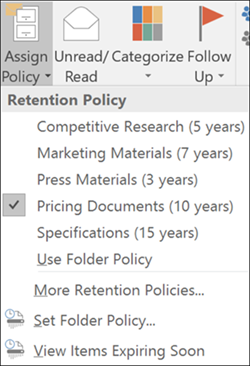
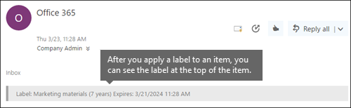

# <a name="create-retention-labels-and-apply-them-in-apps"></a>建立保留標籤，並在應用程式中套用

>*[Microsoft 365 安全性與合規性的授權指引](/office365/servicedescriptions/microsoft-365-service-descriptions/microsoft-365-tenantlevel-services-licensing-guidance/microsoft-365-security-compliance-licensing-guidance)。*

> [!NOTE]
> 所有保留標籤設定 (包括[法規記錄](records-management.md#records)) 都支援此案例。

使用下列資訊可協助您建立併發布[保留標籤](retention.md)，然後將它們套用在文件檔案和電子郵件中。

保留標籤可協助您保留所需的內容，並在項目層級（文件檔案或電子郵件）上刪除您不需要的內容。 它們也可用來將項目宣告為記錄，並視為您的 Microsoft 365 資料 [記錄管理](records-management.md)解決方案的一部分。

讓保留標籤可供您組織中的人員使用，使得他們能夠分類內容，需要完成兩個步驟的程序： 

1. 建立保留標籤。

2. 使用保留標籤原則來發佈保留標籤。
  


使用下列指示執行兩個系統管理員步驟。

## <a name="before-you-begin"></a>開始之前

您組織中的全域系統管理員擁有建立及管理保留標籤及其原則的完整權限。 如果您未以全域系統管理員身分登入，請參閱[建立和管理保留標籤所需權限](get-started-with-retention.md#permissions-required-to-create-and-manage-retention-policies-and-retention-labels)。

## <a name="how-to-create-and-publish-retention-labels"></a>建立及發佈保留標籤

首先，建立您自己的保留標籤。 然後建立標籤原則，使標籤可以在應用程式中使用。

您建立及設定保留標籤的位置，取決於您是否使用記錄管理。 以下提供這兩個案例的指示。

### <a name="step-1-create-retention-labels"></a>步驟1：建立保留標籤

1. 在 [Microsoft 365 合規性中心](https://compliance.microsoft.com/)，瀏覽至下列其中一個位置：
    
    - 如果您使用記錄管理：
        - [解決方案]  >  [記錄管理]  >  [檔案計劃] 索引標籤 > [+ 建立標籤]  >  [保留標籤]
        
    - 如果您未使用記錄管理：
       - [解決方案]  >  [資訊控管]  >  [標籤] 索引標籤 > [+ 建立標籤]
    
    沒有立即看到您的選項？ 先選取 [顯示全部]。 

2. 遵循精靈中的提示進行。 如果您使用記錄管理：
    
    - 如需檔案計畫描述元的詳細資訊，請參閱[使用檔案計畫管理保留標籤](file-plan-manager.md)。
    
    - 若要使用保留標籤來宣告記錄，請選取 **[將項目標記為記錄]**，或 **[將項目標記為法規記錄]**。 如需詳細資訊，請參閱[設定保留標籤以宣告記錄](declare-records.md#configuring-retention-labels-to-declare-records)。

3. 建立標籤並看到發佈標籤、自動套用標籤或僅保存標籤的選項：選擇 **[立即儲存標籤]**，然後選擇 **[完成]**。

4. 重複這些步驟以建立更多標籤。

若要編輯現有的標籤，請選取它，然後選取 **[編輯標籤]** 以啟動編輯保留精靈讓您變更標籤描述和步驟 2 的任何 [合格設定](#updating-retention-labels-and-their-policies)。

### <a name="step-2-publish-retention-labels"></a>步驟 2：發布保留標籤

發佈保留標籤，以便使用者可以在應用程式 (如 SharePoint 和 Outlook) 中套用保留標籤。

1. 在 [Microsoft 365 合規性中心](https://compliance.microsoft.com/)，瀏覽至下列其中一個位置：
    
    - 如果您使用記錄管理：
        - [解決方案]  >  [記錄管理] > [標籤原則] 索引標籤 > [發佈標籤]
    
    - 如果您未使用記錄管理：
        - [解決方案]  >  [資訊控管]  >  [標籤原則] 索引標籤 > [發佈標籤]
    
    沒有立即看到您的選項？ 先選取 [顯示全部]。 

2. 遵循精靈中的提示進行。
    
    如需保留標籤支援的位置詳細資訊，請參閱[保留標籤和位置](retention.md#retention-label-policies-and-locations)。 

要編輯現有的保留標籤原則 (原則類型為 **[發佈]**)，請將其選中，然後選取 **[編輯]** 選項以啟動編輯保留原則。 此精靈讓您從步驟 2 更改原則描述和任何[合格設定](#updating-retention-labels-and-their-policies)。


## <a name="when-retention-labels-become-available-to-apply"></a>當保留標籤可以使用時

如果您將保留標籤發佈至 SharePoint 或 OneDrive，這些標籤通常會在一天內出現，可讓終端使用者選取使用。 不過，最多允許七天的使用。 

如果您將保留標籤發佈到 Exchange，則終端使用者可能需要 7 天（最多）的時間才會看到這些保留標籤，而且電子郵件信箱必須包含至少 10 MB 的資料。

例如：
  

  

如果標籤在七天之後未顯示，請在合規性中心的 **[標籤原則]** 頁面中選取標籤原則，以檢查其 **[狀態]**。 如果您看到 **關閉 (錯誤)** 狀態，且在位置的詳細資料中，看到訊息說明部署原則 (針對 SharePoint) 或嘗試重新部署原則 (針對 OneDrive) 所耗費的時間超過預期，請嘗試執行 [Set-RetentionCompliancePolicy](/powershell/module/exchange/set-retentioncompliancepolicy) PowerShell 命令以重試原則發佈：

1. [連線到安全性與合規性中心 PowerShell](/powershell/exchange/connect-to-scc-powershell)

2. 執行下列命令：
    
    ``` PowerShell
    Set-RetentionCompliancePolicy -Identity <policy name> -RetryDistribution
   ```

### <a name="how-to-check-on-the-status-of-retention-labels-published-to-exchange"></a>如何檢查發佈至 Exchange 之保留標籤的狀態

在 Exchange Online 中，使用者可透過每 7 天執行一次的程序取得保留標籤。 您可以使用 PowerShell 查看這項程序上次執行的時間，藉此判斷下次的執行時間。
  
1. [連線至 Exchange Online PowerShell](/powershell/exchange/connect-to-exchange-online-powershell)。
    
2. 執行下列命令。
    
   ```powershell
   $logProps = Export-MailboxDiagnosticLogs <user> -ExtendedProperties
   ```

   ```powershell
   $xmlprops = [xml]($logProps.MailboxLog)
   ```

   ```powershell
   $xmlprops.Properties.MailboxTable.Property | ? {$_.Name -like "ELC*"}

In the results, the `ELCLastSuccessTimeStamp` (UTC) property shows when the system last processed your mailbox. If it has not happened since the time you created the policy, the labels are not going to appear. To force processing, run  `Start-ManagedFolderAssistant -Identity <user>`.
    
If labels aren't appearing in Outlook on the web and you think they should be, make sure to clear the cache in your browser (CTRL+F5).
    

## How to apply published retention labels

Use the following sections to learn how published retention labels can be applied in apps:

- [Manually apply retention labels](#manually-apply-retention-labels)

- [Applying a default retention label to all content in a SharePoint library, folder, or document set](#applying-a-default-retention-label-to-all-content-in-a-sharepoint-library-folder-or-document-set)

- [Automatically applying a retention label to email by using rules](#automatically-applying-a-retention-label-to-email-by-using-rules)

In addition, when you use [SharePoint Syntex](../contentunderstanding/index.md) and publish retention labels to SharePoint locations, you can [apply a retention label to a document understanding model](../contentunderstanding/apply-a-retention-label-to-a-model.md) so that identified documents are automatically labeled.

After content is labeled, see the following information to understand when the applied label can be removed or changed: [Only one retention label at a time](retention.md#only-one-retention-label-at-a-time).

### Manually apply retention labels 

End users, as well as administrators, can manually apply retention labels from the following locations:  

- Outlook and Outlook on the web
    
- OneDrive
    
- SharePoint
    
- Microsoft 365 groups (both the group site and group mailbox in Outlook on the web)
    
Use the following sections to understand how to apply retention labels. 

#### Applying retention labels in Outlook

To label an item in the Outlook desktop client, select the item. On the **Home** tab on the ribbon, click **Assign Policy**, and then choose the retention label. 
  

  
You can also right-click an item, click **Assign Policy** in the context menu, and then choose the retention label. 

After the retention label is applied, you can view that retention label and what action it takes at the top of the item. If an email has a retention label applied that has an associated retention period, you can see at a glance when the email expires.

##### Applying a default retention label to an Outlook folder

You can apply retention labels to Outlook folders as a default label that can be inherited by messages in that folder. Right-click the folder, select **Properties**, the **Policy** tab, and select the retention label you want to use as that folder's default retention label.

When you use a a standard retention label as your default label for an Outlook folder:
  
- All unlabeled items in the folder have this retention label applied.

- The inheritance flows to any child folders and items inherit the label from their nearest folder.

- Items that are already labeled retain their retention label, unless it was applied by a different default label.

- If you change or remove the default retention label for the folder: Existing retention labels applied to items in that folder are also changed or removed only if those labels were applied by a default label.

- If you move an item with a default retention label from one folder to another folder with a different default retention label: The item gets the new default retention label.

- If you move an item with a default retention label from one folder to another folder with no default retention label: The old default retention label is removed.

When labels are applied that aren't standard retention labels but mark items as [records (or regulatory records)](records-management.md#records), these labels can only be manually changed or removed.

#### Applying retention labels in Outlook on the web

To label an item in Outlook on the web, right-click the item \> **Assign policy** \> choose the retention label. 
  

  
After the retention label is applied, you can view that retention label and what action it takes at the top of the item. If an email is classified and has an associated retention period, you can know at a glance when the email will expire.
  

  
As with the desktop version of Outlook on the web, you can also apply retention labels to folders. Right-click the folder, select **Assign policy**, and change **Use parent folder policy** to the retention label you want to use as that folder's default retention label.

#### Applying retention labels in OneDrive and SharePoint

To label a document (including OneNote files) in OneDrive or SharePoint, select the item \> in the upper-right corner, choose **Open the details pane** \> **Apply retention label** \> choose the retention label. 
  
You can also apply a retention label to a folder or document set, and you can set a [default retention label for a document library](#applying-a-default-retention-label-to-all-content-in-a-sharepoint-library-folder-or-document-set).
  

  
After a retention label is applied to an item, you can view it in the details pane when that item's selected.
  


For SharePoint, but not OneDrive, you can create a view of the library that contains the **Labels** column or **Item is a Record** column. This view lets you see at a glance the retention labels assigned to all items and which items are records. Note, however, that you can't filter the view by the **Item is a Record** column. For instructions how to add columns, see [Show or hide columns in a list or library](https://support.microsoft.com/en-us/office/show-or-hide-columns-in-a-list-or-library-b820db0d-9e3e-4ff9-8b8b-0b2dbefa87e2).


#### Applying retention labels in Microsoft 365 groups

When you publish retention labels to Microsoft 365 groups ([formerly Office 365 groups](https://techcommunity.microsoft.com/t5/microsoft-365-blog/office-365-groups-will-become-microsoft-365-groups/ba-p/1303601)), the retention labels appear in both the group site and group mailbox in Outlook on the web. The experience of applying a retention label to content is identical to that for email and documents.

To retain content for a Microsoft 365 group, use the **Microsoft 365 Groups** location. Even though a Microsoft 365 group has an Exchange mailbox, a retention policy that includes the entire Exchange location won't include content in Microsoft 365 group mailboxes.

In addition, it's not possible to use the Exchange location to include or exclude a specific group mailbox. Although the Exchange location initially allows a group mailbox to be selected, when you try to save the retention policy, you receive an error that "RemoteGroupMailbox" is not a valid selection for the Exchange location.
  
First, create and configure the sensitivity labels that you want to make available for apps and other services. For example, the labels you want users to see and apply from Office apps. 

Then, create one or more label policies that contain the labels and policy settings that you configure. It's the label policy that publishes the labels and settings for your chosen users and locations.

### Applying a default retention label to all content in a SharePoint library, folder, or document set

This method requires retention labels to be published to a retention label policy.

In addition to letting people apply a retention label to individual documents, you can also apply a default retention label to a SharePoint library, folder, or document set. In this scenario, documents in that location can inherit your selected default retention label. Although the same label is applied, each document will be retained and deleted separately, according to the start of the retention period setting in the label. 
  
For a document library, the default label configuration is done on the **Library settings** page for a document library. When you choose the default retention label, you can also choose to apply it to existing items in the library.
  
For example, if you have a retention label for marketing materials, and you know a specific document library contains only that type of content, you can make the **Marketing Materials** retention label the default label for all documents in that library.
  


#### Label behavior when you use a default label for SharePoint

For standard retention labels that you apply as a default retention label to a library, folder, or document set:

- All new, unlabeled items in the container will have this retention label applied.

- For folders, the inheritance flows to any child folders and items inherit the label from their nearest folder.

- If you selected the option to apply the default label to existing items: Items that are already labeled retain their retention label, unless it was applied by a different default label.
    
- If you change the default retention label for the container: Existing retention labels applied to items in that container are changed only if you selected the option to apply the default label to existing items and those labels were applied by a default label.

- If you remove the default retention label for the container: Items retain their labels.
    
- If you move an item with a default retention label applied from one container to another container: The item keeps its existing default retention label, even if the new location has a different default retention label. Only if you then change the default label for this new location can the moved item inherit the default label from its current location.

When labels are applied that aren't standard retention labels but mark items as [records (or regulatory records)](records-management.md#records), these labels can only be manually changed or removed.

### Automatically applying a retention label to email by using rules

In Outlook, you can create rules to apply a retention label.
  
For example, you can create a rule that applies a specific retention label to all messages sent to or from a specific distribution group.
  
To create a rule, right-click an item \> **Rules** \> **Create Rule** \> **Advanced Options** \> **Rules Wizard** \> **apply retention policy**.
  


Although the UI refers to retention policies, it's your retention labels that display here and can be selected, not your retention policies.

## Updating retention labels and their policies

When you edit a retention label or retention label policy, and the retention label or policy is already applied to content, your updated settings will automatically be applied to this content in addition to content that's newly identified.

Some settings can't be changed after the label or policy is created and saved, which include:
- The retention label and policy name, and the retention settings except the retention period. However, you can't change the retention period when the retention period is based on when items were labeled.
- The option to mark items as a record.

### Deleting retention labels

You can delete retention labels that aren't currently included in any retention label policies, that aren't configured for event-based retention, or mark items as regulatory records. The ability to delete retention labels that mark items as records is currently rolling out in preview.

For retention labels that you can delete, if they have been applied to items, the deletion fails and you see a link to content explorer to identify the labeled items.

However, it can take up to two days for content explorer to show the items that are labeled. In this scenario, the retention label might be deleted without showing you the link to content explorer.

## Locking the policy to prevent changes

If you need to ensure that no one can turn off the policy, delete the policy, or make it less restrictive, see [Use Preservation Lock to restrict changes to retention policies and retention label policies](retention-preservation-lock.md).

## Next steps

Event-based retention is another supported scenario for retention labels. For more information, see the following articles:

- [Start retention when an event occurs](event-driven-retention.md)
- [Automate event-based retention](./event-driven-retention.md#automate-events-by-using-a-rest-api)
- [Use retention labels to manage the lifecycle of documents stored in SharePoint](auto-apply-retention-labels-scenario.md)