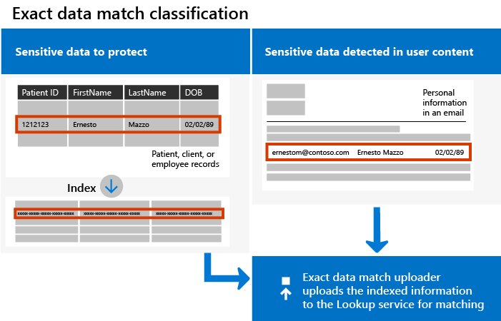

# <a name="create-custom-sensitive-information-types-with-exact-data-match-based-classification"></a>使用以精確資料比對為基礎的分類建立自訂敏感性資訊類型


[自訂敏感性資訊類型](sensitive-information-type-learn-about.md)用於協助識別敏感性項目，使得您可以防止不小心或不適當地將其與他人共用。 您可以根據下列項目來定義自訂機密資訊類型：

- 模式
- 關鍵字辨識項，例如 *員工*、*識別證* 或 *識別碼*
- 字元以特定模式接近證據
- 信賴等級

 這類自訂敏感性資訊類型符合許多組織的業務需求。

但是，如果您想要使用精確資料值的自訂敏感性資訊類型 (SIT)，而非根據泛型模式所找到的類型，該怎麼做？ 使用以精確資料比對 (EDM) 為基礎的分類，您可以建立其設計目的為以下的自訂敏感性資訊類型：

- 充滿活力並可以輕鬆刷新;
- 更可以調整的；
- 造成較少的誤判；
- 使用結構化的敏感性資料；
- 更安全地處理敏感性資訊；以及
- 能與數個 Microsoft 雲端服務搭配使用。



以 EDM 為基礎的分類可讓您建立自訂敏感性資訊類型，其參考敏感性資訊資料庫中的確切值。 資料庫可以每日重新整理，而且可以包含最多 1 億資料列。 因此，隨著員工、病患或客戶來來去去，以及記錄變更，您的自訂敏感性資訊類型會維持最新且適用。 同時，您可以對原則使用以 EDM 為基礎的分類，例如[資料外洩防護原則](data-loss-prevention-policies.md) (DLP) 或 [Microsoft Cloud App Security 檔案原則](/cloud-app-security/data-protection-policies)。

> [!NOTE]
> Microsoft 365 資訊保護在預覽版中支援下列雙位元組字元集語言：
> - 中文 (簡體)
> - 中文 (繁體)
> - 韓文
> - 日文
> 
> 這項支援適用於敏感性資訊類型。 如需詳細資訊，請參閱[資訊保護支援雙位元組字元集的版本資訊 (預覽版)](mip-dbcs-relnotes.md)。
 

## <a name="required-licenses-and-permissions"></a>必要的授權和權限

您必須是全域系統管理員、合規性系統管理員或 Exchange Online 系統管理員，才能執行本文所述的工作。 若要進一步了解 DLP 權限，請參閱[權限](data-loss-prevention-policies.md#permissions)。

這些訂閱中包含 EDM 型分類

- Office 365 E5
- Microsoft 365 E5
- Microsoft 365 E5 合規性
- Microsoft E5/A5 資訊保護和控管

## <a name="portal-links-for-your-subscription"></a>訂閱的入口網站連結


|入口網站  |全球/GCC  |GCC-High  |DOD  |
|---------|---------|---------|---------|
|Office SCC     |  protection.office.com       |scc.office365.us         |scc.protection.apps.mil |
|Microsoft 365 安全性中心     |security.microsoft.com         |security.microsoft.us         |security.apps.mil|
|Microsoft 365 合規性中心     |compliance.microsoft.com         |compliance.microsoft.us         |compliance.apps.mil|


## <a name="the-work-flow-at-a-glance"></a>工作流程概覽

|階段  |需要的項目  |
|---------|---------|
|[第 1 部分：設定以 EDM 為基礎的分類](#part-1-set-up-edm-based-classification)<br/><br/>(視需要)<br/>- [編輯資料庫結構描述](#editing-the-schema-for-edm-based-classification) <br/>- [移除結構描述](#removing-the-schema-for-edm-based-classification) |- 敏感性資料的讀取存取權<br/>- XML 格式的資料庫結構描述 (提供範例)<br/>- XML 格式的規則套件 (提供範例)<br/>- 安全性與合規性中心的系統管理員權限 (使用 PowerShell) |
|[第 2 部分：雜湊和上傳敏感性資料](#part-2-hash-and-upload-the-sensitive-data)<br/><br/>(視需要)<br/>[重新整理資料](#refreshing-your-sensitive-information-database) |- 自訂安全性群組和使用者帳戶<br/>- 具有 EDM 上傳代理程式電腦的本機系統管理員存取權<br/>- 敏感性資料的讀取存取權<br/>- 重新整理資料的程序和排程|
|[第 3 部分：使用以 EDM 為基礎的分類搭配 Microsoft 雲端服務](#part-3-use-edm-based-classification-with-your-microsoft-cloud-services) |- Microsoft 365 訂閱與 DLP<br/>- 已啟用以 EDM 為基礎的分類功能 |

### <a name="part-1-set-up-edm-based-classification"></a>第 1 部分：設定以 EDM 為基礎的分類

設定及安裝以 EDM 為基礎的分類會涉及：

1. [以 .csv 格式儲存機密資料](#save-sensitive-data-in-csv-format)
2. [定義您的機密資訊資料庫架構](#define-the-schema-for-your-database-of-sensitive-information)
3. [建立規則套件](#set-up-a-rule-package)


#### <a name="save-sensitive-data-in-csv-format"></a>以 .csv 格式儲存機密資料

1. 找出您要使用的敏感性資訊。 將資料匯出至應用程式，例如 Microsoft Excel，並將檔案以 .csv 格式儲存。 資料檔案可能包含：
      - 最多 1 億列敏感性資料
      - 每個資料來源最多 32 個資料行 (欄位)
      - 最多 5 個資料行 (欄位) 標示為可搜尋

2. 以 .csv 檔案格式將敏感性資料結構化，使得第一列包含用於以 EDM 為基礎的分類的欄位名稱。 在您的 .csv 檔案中，您可能會有欄位名稱，例如 "ssn"、"生日"、"名字"、"姓氏" 等等。 欄標題名稱不能包含空格或底線。 例如，在本文我們所使用的 .csv 檔案範例稱為 *PatientRecords.csv*，而其資料行包含 *PatientID*、*MRN*、*LastName*、*FirstName*、*SSN* 等等。

3. 請留意敏感性資料欄位的格式。 特別是，當 EDM 工具進行解析時，在内容中包含逗號的欄位 (例如：街道地址中包含 “Seattle,WA” 這個值) 將被解析為兩個單獨的欄位。 為避免此情形發生，您需要確保敏感性資料表格中這類欄位周圍有單引號或雙引號。 如果包含逗號的欄位可能還包含空格，您會需要建立一個自訂敏感性資訊類型，以符合相應的格式 (例如，包含逗號和空格的多字字串)，以確保在掃描文件時該字串能正確相符。

#### <a name="define-the-schema-for-your-database-of-sensitive-information"></a>定義用於敏感性資訊的資料庫結構描述

如果基於商務或技術因素，您不想使用 PowerShell 或命令列來建立結構描述和 EDM 敏感性資訊類型模式 (規則套件)，您可以使用 [完全符合結構描述和敏感性資訊類型的精靈](sit-edm-wizard.md) 來建立它們。 當您完成建立結構描述和 EDM 敏感性資訊類型模式後，請返回以完成所有必要的步驟，讓您 EDM 的敏感性資訊類型可供使用。

> [!NOTE]
> 「完全符合結構描述和敏感性資訊類型」精靈只適用于 World Wide 和 GCC 雲端。

1. 以 XML 格式定義用於敏感性資訊資料庫的結構描述 (類似以下的範例)。 將此結構描述檔案命名為 **edm.xml**，然後進行設定，讓資料庫中的每一個資料行都會有使用下列語法的行： 

      `\<Field name="" searchable=""/\>`.

      - 使用資料行名稱作為 *欄位名稱* 值。
      - 對您想讓它可供搜尋最多 5 個欄位的欄位，使用 *searchable="true"*。 至少必須有一個欄位可供搜尋。

      例如，下列 XML 檔會為病患記錄資料庫定義結構描述，並將五個欄位指定為可供搜尋：*PatientID*、*MRN*、*SSN*、*Phone* 和 *DOB*。

      (您可以複製、修改及使用我們的範例)。

      ```xml
      <EdmSchema xmlns="http://schemas.microsoft.com/office/2018/edm">
            <DataStore name="PatientRecords" description="Schema for patient records" version="1">
                  <Field name="PatientID" searchable="true" caseInsensitive="true" ignoredDelimiters="-,/,*,#,^" />
                  <Field name="MRN" searchable="true" />
                  <Field name="FirstName" />
                  <Field name="LastName" />
                  <Field name="SSN" searchable="true" />
                  <Field name="Phone" searchable="true" />
                  <Field name="DOB" searchable="true" />
                  <Field name="Gender" />
                  <Field name="Address" />
            </DataStore>
      </EdmSchema>
      ```

##### <a name="configurable-match-using-the-caseinsensitive-and-ignoreddelimiters-fields"></a>使用 caseInsensitive 和 ignoredDelimiters 欄位的可設定比對

上列 XML 範例利用 `caseInsensitive` 和 `ignoredDelimiters` 欄位。 

當您將設定為 `true` 值的 ***caseInsensitive** _欄位包括在您的結構描述定義中，EDM 將會因 `PatientID` 欄位大小寫的不同而排除項目。 因此， EDM 將會認爲 `PatientID` _ *FOO-1234** 和 **fOo-1234** 是一樣的。

當您在 **ignoredDelimiters** _ 欄位中包括受支援的字元時，EDM 將會略過 `PatientID` 中的字元。 因此，EDM 會將 `PatientID` _ *FOO-1234** 和 `PatientID` **FOO#1234** 視為一樣的。 `ignoredDelimiters` 旗標支援任何非英數字元的字元，這裡有些範例：
- \.
- \-
- \/
- \_
- \*
- \^
- \#
- \!
- \?
- \[
- \]
- \{
- \}
- \\
- \~
- \; 

- `ignoredDelimiters` 旗標不支援：
- 0-9 字元
- A-Z
- a-z
- \"
- \,

在這個範例中，當 `caseInsensitive` 和 `ignoredDelimiters` 均被使用時，EDM 會認爲 **FOO-1234** 和 **fOo#1234** 是一樣的，並且以病歷敏感性資訊類型來分類項目。 

4. 使用[連線到安全性與合規性中心 PowerShell](/powershell/exchange/connect-to-scc-powershell) 中的程序，連線到安全性與合規性中心。

5. 若要上傳資料庫結構描述，請執行下列 Cmdlet，一次一個：

      ```powershell
      $edmSchemaXml=Get-Content .\\edm.xml -Encoding Byte -ReadCount 0
      New-DlpEdmSchema -FileData $edmSchemaXml -Confirm:$true
      ```

      系統會提示您確認，如下所示：

      > 確認
      >
      > 是否確定要執行此動作？
      >
      > 將匯入資料存放區 'patientrecords' 的新 EDM 結構描述。
      >
      > \[Y\] 是 \[A\] 全部皆是 \[N\] 否 \[L\] 全部皆否 \[?\] 說明 (預設值為 "Y")：

> [!TIP]
> 若要直接變更而不進行確認，請在步驟 5 中改用此 Cmdlet：New-DlpEdmSchema -FileData $edmSchemaXml

> [!NOTE]
> 這可能要花 10 到 60 分鐘的時間，才能將 EDMSchema 更新為新增項目。 在您執行使用新增項目的步驟之前，必須先完成更新。

#### <a name="set-up-a-rule-package"></a>設定規則套件

1. 以 XML 格式建立規則套件 (使用 Unicode 編碼方式)，類似下列範例。 (您可以複製、修改及使用我們的範例)。

      當您設定規則套件時，請務必正確參照您的 .csv 檔案和 **edm.xml** 檔案。 您可以複製、修改及使用我們的範例。 在此範例 xml 中，必須自訂下列欄位，才能建立您的 EDM 敏感性類型：

      - **RulePack id 與 ExactMatch id**：使用 [New-GUID](/powershell/module/microsoft.powershell.utility/new-guid?view=powershell-6) 產生 GUID。

      - **資料存放區**：此欄位會指定要使用的 EDM 查閱資料存放區。 您要提供已設定之 EDM 結構描述的資料來源名稱。

      - **idMatch**：此欄位會指向 EDM 的主要元素。
        - 相符項目：指定要在完全查閱中使用的欄位。 您要在資料存放區的 EDM 結構描述中，提供可搜尋的欄位名稱。
        - 分類：此欄位會指定可觸發 EDM 查閱的敏感性類型符合項目。 您可以提供現有內建或自訂敏感性資訊類型的名稱或 GUID。 請注意，任何符合所提供之敏感性資訊類型的字串都會經過雜湊，並與敏感性資訊表中的每個項目進行比較。 為了避免造成效能問題，如果您使用自訂敏感性資訊類型做為 EDM 中的分類元素，請避免使用將符合大量內容 (例如「任意數字」或「任意五個字母」的字」) 的字串，方法是在自訂分類敏感性資訊類型的定義中新增支援關鍵字或格式設定。 

      - **相符項目：** 此欄位會指向 idMatch 鄰近位置的其他辨識項。
        - 相符項目：您要在資料存放區的 EDM 結構描述中，提供任何欄位名稱。
      - **資源：** 此區段會在多個地區設定中，指定敏感性類型的名稱和描述。
        - idRef：您要提供 ExactMatch ID 的 GUID。
        - 名稱與描述：視需要自訂。

      ```xml
      <RulePackage xmlns="http://schemas.microsoft.com/office/2018/edm">
        <RulePack id="fd098e03-1796-41a5-8ab6-198c93c62b11">
          <Version build="0" major="2" minor="0" revision="0" />
          <Publisher id="eb553734-8306-44b4-9ad5-c388ad970528" />
          <Details defaultLangCode="en-us">
            <LocalizedDetails langcode="en-us">
              <PublisherName>IP DLP</PublisherName>
              <Name>Health Care EDM Rulepack</Name>
              <Description>This rule package contains the EDM sensitive type for health care sensitive types.</Description>
            </LocalizedDetails>
          </Details>
        </RulePack>
        <Rules>
          <ExactMatch id = "E1CC861E-3FE9-4A58-82DF-4BD259EAB371" patternsProximity = "300" dataStore ="PatientRecords" recommendedConfidence = "65" >
            <Pattern confidenceLevel="65">
              <idMatch matches = "SSN" classification = "U.S. Social Security Number (SSN)" />
            </Pattern>
            <Pattern confidenceLevel="75">
              <idMatch matches = "SSN" classification = "U.S. Social Security Number (SSN)" />
              <Any minMatches ="3" maxMatches ="6">
                <match matches="PatientID" />
                <match matches="MRN"/>
                <match matches="FirstName"/>
                <match matches="LastName"/>
                <match matches="Phone"/>
                <match matches="DOB"/>
              </Any>
            </Pattern>
          </ExactMatch>
          <LocalizedStrings>
            <Resource idRef="E1CC861E-3FE9-4A58-82DF-4BD259EAB371">
              <Name default="true" langcode="en-us">Patient SSN Exact Match.</Name>
              <Description default="true" langcode="en-us">EDM Sensitive type for detecting Patient SSN.</Description>
            </Resource>
          </LocalizedStrings>
        </Rules>
      </RulePackage>
      ```

2. 執行下列 PowerShell Cmdlet 以上傳規則套件，一次一個：

      ```powershell
      $rulepack=Get-Content .\\rulepack.xml -Encoding Byte -ReadCount 0
      New-DlpSensitiveInformationTypeRulePackage -FileData $rulepack
      ```

此時，您已設定以 EDM 為基礎的分類。 下一個步驟是要對敏感性資料雜湊，然後上傳用於編製索引的雜湊。

回想一下前面的程序，我們的 PatientRecords 結構描述將五個欄位定義為可搜尋：*PatientID*、*MRN*、*SSN*、*Phone* 和 *DOB*。 我們的範例規則套件包含這些欄位，並會參照資料庫結構描述檔案 (**edm.xml**)，一個 *ExactMatch* 項目會有一個可搜尋欄位。 請考慮下列 ExactMatch 項目：

```xml
<ExactMatch id = "E1CC861E-3FE9-4A58-82DF-4BD259EAB371" patternsProximity = "300" dataStore ="PatientRecords" recommendedConfidence = "65" >
      <Pattern confidenceLevel="65">
        <idMatch matches = "SSN" classification = "U.S. Social Security Number (SSN)" />
      </Pattern>
      <Pattern confidenceLevel="75">
        <idMatch matches = "SSN" classification = "U.S. Social Security Number (SSN)" />
        <Any minMatches ="3" maxMatches ="100">
          <match matches="PatientID" />
          <match matches="MRN"/>
          <match matches="FirstName"/>
          <match matches="LastName"/>
          <match matches="Phone"/>
          <match matches="DOB"/>
        </Any>
      </Pattern>
    </ExactMatch>
```

請注意本範例中的下列重點：

- 資料存放區名稱會參照稍早建立的 .csv 檔案：**dataStore = "PatientRecords"**。

- IdMatch 值會參照可供搜尋的欄位，其列於資料庫結構描述檔案：**idMatch matches = "SSN"**。

- 分類值會參照現有或自訂機密資訊類型：**classification = "U.S. Social Security Number (SSN)"**。 (在此案例中，我們使用美國社會安全號碼作為現有的敏感性資訊類型)。

> [!NOTE]
> 這可能要花 10 到 60 分鐘的時間，才能將 EDMSchema 更新為新增項目。 在您執行使用新增項目的步驟之前，必須先完成更新。

#### <a name="editing-the-schema-for-edm-based-classification"></a>編輯以 EDM 為基礎的分類的結構描述

如果您想要變更 **edm.xml** 檔案，例如變更哪些欄位用於以 EDM 為基礎的分類，請遵循下列步驟進行：

> [!TIP]
> 您可以變更您的 EDM 結構描述和資料檔案以利用 **可設定比對**。 設定以後，EDM 將會在評估項目時，略過大小寫不同和一些分隔符。 這會讓您更容易定義您的 XML 結構描述和敏感性資料檔案。 若想深入了解，請參閲 [修改精確資料比對模式以使用可設定比對](sit-modify-edm-schema-configurable-match.md)。

1. 編輯您的 **edm.xml** 檔案 (這是本文 [定義結構描述](#define-the-schema-for-your-database-of-sensitive-information)這一節所討論的檔案)。

2. 使用[連線到安全性與合規性中心 PowerShell](/powershell/exchange/connect-to-scc-powershell) 中的程序，連線到安全性與合規性中心。

3. 若要更新資料庫結構描述，請執行下列 Cmdlet，一次一個：

      ```powershell
      $edmSchemaXml=Get-Content .\\edm.xml -Encoding Byte -ReadCount 0
      Set-DlpEdmSchema -FileData $edmSchemaXml -Confirm:$true
      ```

      系統會提示您確認，如下所示：

      > 確認
      >
      > 是否確定要執行此動作？
      >
      > 將更新資料存放區 'patientrecords' 的 EDM 結構描述。
      >
      > \[Y\] 是 \[A\] 全部皆是 \[N\] 否 \[L\] 全部皆否 \[?\] 說明 (預設值為 "Y")：

      > [!TIP]
      > 若要直接變更而不進行確認，請在步驟 3 中改用此 Cmdlet：Set-DlpEdmSchema -FileData $edmSchemaXml

      > [!NOTE]
      > 這可能要花 10 到 60 分鐘的時間，才能將 EDMSchema 更新為新增項目。 在您執行使用新增項目的步驟之前，必須先完成更新。

#### <a name="removing-the-schema-for-edm-based-classification"></a>移除以 EDM 為基礎的分類的結構描述

(如有需要) 如果您想要移除 EDM 型分類使用的結構描述，請遵循下列步驟：

1. 使用[連線到安全性與合規性中心 PowerShell](/powershell/exchange/connect-to-scc-powershell) 中的程序，連線到安全性與合規性中心。

2. 執行下列 PowerShell Cmdlet，將 "patientrecords" 的資料存放區名稱取代為您要移除的資料存放區名稱：

      ```powershell
      Remove-DlpEdmSchema -Identity patientrecords
      ```

      系統會提示您確認：

      > 確認
      >
      > 是否確定要執行此動作？
      >
      > 將移除資料存放區 'patientrecords' 的 EDM 結構描述。
      >
      > \[Y\] 是 \[A\] 全部皆是 \[N\] 否 \[L\] 全部皆否 \[?\] 說明 (預設值為 "Y")：

      > [!TIP]
      >  若要直接變更而不進行確認，請在步驟 2 中改用此 Cmdlet：Remove-DlpEdmSchema -Identity patientrecords -Confirm:$false

### <a name="part-2-hash-and-upload-the-sensitive-data"></a>第 2 部分：雜湊及上傳敏感性資料

在此階段中，您要設定自訂安全性群組和使用者帳戶，並設定 EDM Upload Agent tool 上傳代理工具。 然後，您可以對敏感數據使用該工具在雜湊中加入字串，然後將其上傳。

雜湊和上傳可以使用一部電腦來完成，或者您也可以將雜湊步驟與上傳步驟分開，以提高安全性。

如果您想要從一部電腦進行雜湊和上傳，您必須從一部可直接連線至 Microsoft 365 租用者的電腦執行。 這要求您明文的敏感性資料在該電腦上進行雜湊。

如果您不想公開明文機密的資料檔，可以在安全位置的電腦上雜湊，然後將雜湊檔和鹽檔複製到可直接連線到 Microsoft 365 租用者的電腦。 在這個案例中，您將需要在兩部電腦上都有 EDMUploadAgent。

> [!IMPORTANT]
> 如果您使用「精確資料比對」結構描述和敏感性資訊類型精靈來建立結構描述和模式檔案，則 ***必須*** 下載此程序的結構描述。

> [!NOTE]
> 如果組織已在[租用戶層級 (公開預覽) 設定 Microsoft 365 的客戶金鑰](customer-key-tenant-level.md#overview-of-customer-key-for-microsoft-365-at-the-tenant-level-public-preview)，精確資料比對將會自動使用其加密功能。 這僅適用商業雲端中的 E5 授權租用戶。

#### <a name="prerequisites"></a>必要條件

- Microsoft 365的工作或學校帳戶, 該帳戶將新增至 **EDM\_DataUploaders** 的安全性群組
- Windows 10 或 Windows Server 2016 電腦，其中包含執行 EDMUploadAgent 的 .NET 版本4.6.2
- 在你所上傳電腦上的目錄有：
    -  EDMUploadAgent
    - 在我們的範例中，您在 csv 格式 **PatientRecords** 的機密項目檔案
    -  以及輸出雜湊和鹽數值檔案
    - 從 **edm.xml** 檔案的資料存儲名稱，在這個範例中的如其 `PatientRecords`
- 如果您使用 [完全符合結構描述和敏感性資訊類型的資料類型精靈](sit-edm-wizard.md)，您 ***必須*** 下載它

#### <a name="set-up-the-security-group-and-user-account"></a>設定安全性群組和使用者帳戶

1. 以全域系統管理員身分，使用 [適用於您訂閱的連結](#portal-links-for-your-subscription)前往系統管理中心，並建立名為 **EDM\_DataUploaders** 的 [安全性群組](/office365/admin/email/create-edit-or-delete-a-security-group?view=o365-worldwide)。

2. 將一或多個使用者新增至 **EDM\_DataUploaders** 安全性群組。 (這些使用者將管理敏感性資訊的資料庫)。

#### <a name="hash-and-upload-from-one-computer"></a>雜湊並從一部電腦上傳

此電腦必須能夠直接存取您的 Microsoft 365 租用者。

>[!NOTE]
> 開始此程序之前，請確認您是 **EDM\_DataUploaders** 安全性群組的成員。

> [!TIP]
> 您也可以選擇在上傳之前通過以下命令對 CSV 檔案進行驗證：
>
>`EdmUploadAgent.exe /ValidateData /DataFile [data file] /Schema [schema file]`
>
>所有 EdmUploadAgent.exe 的相關資訊 > 已支援的參數執行
>
> `EdmUploadAgent.exe /?`


#### <a name="links-to-edm-upload-agent-by-subscription-type"></a>依訂閱類型的 EDM 上傳代理程式連結

- [商業客戶 + GCC](https://go.microsoft.com/fwlink/?linkid=2088639) - 大多數商業客戶應使用這個
- [GCC-High](https://go.microsoft.com/fwlink/?linkid=2137521) - 專門針對高安全性政府雲端用戶
- [DoD](https://go.microsoft.com/fwlink/?linkid=2137807) - 專門針對美國國防部雲端客戶

1. 為 EDMUploadAgent 建立工作目錄。 例如， **C:\EDM\Data**。 將 **PatientRecords** 檔案放在這裡。

2. 把適合您的訂閱, 下載並安裝到[EDM 上傳代理](#links-to-edm-upload-agent-by-subscription-type), 步驟1您所建立目錄中 。

   > [!NOTE]
   > 上方連結的 EDMUploadAgent 已更新，可自動為雜湊資料新增鹽值。 或者，您也可以提供自己的鹽值。 使用此版本後，您將無法使用舊版的 EDMUploadAgent。
   >
   > 您每天最多可以使用 EDMUploadAgent 將資料上傳到任何指定的資料儲存區兩次。

   > [!TIP]
   > 若要取得所支援命令參數的清單，請執行 agent no 無引數。 例如 'EdmUploadAgent.exe'。

2. 授權 EDM 上傳代理、開啟命令提示字元視窗（以系統管理員身分），切換至 **C:\EDM\Data** 目錄，然後執行下列命令：

   `EdmUploadAgent.exe /Authorize`

3. 用您已加入EDM_DataUploaders 安全性群組的Microsoft 365的工作或學校帳戶來登入. 您的租戶信息將從用戶帳戶中提取出來以建立連接。

   選用：如果您使用完全符合結構描述和敏感性資料類型精靈建立結構描述和模式檔案，請在命令提示字元視窗中執行下列命令：

   `EdmUploadAgent.exe /SaveSchema /DataStoreName <schema name> /OutputDir <path to output folder>`

4. 若要為敏感性資料雜湊並上傳，請在Command Prompt 命令提示字元視窗中執行下列命令：

   `EdmUploadAgent.exe /UploadData /DataStoreName [DS Name] /DataFile [data file] /HashLocation [hash file location] /Schema [Schema file]`

   範例： **EdmUploadAgent.exe /UploadData /DataStoreName PatientRecords /DataFile C:\Edm\Hash\PatientRecords.csv /HashLocation C:\Edm\Hash /Schema edm.xml**

   這會自動在雜湊中添加隨機生成的鹽值，以提高安全性。 或者，如果您想要使用自己的加密鹽值，請在命令列中新增 **/Salt <saltvalue>**。 此值必須是64個字元，且只能包含 a-z 和0-9 個字元。

5. 執行此命令以查看上傳狀態：

   `EdmUploadAgent.exe /GetSession /DataStoreName \<DataStoreName\>`

   範例： **EdmUploadAgent/GetSession/DataStoreName PatientRecords**

   尋找 **ProcessingInProgress** 的狀態。 每隔幾分鐘再次檢查，直到狀態變更為 **完成**。 狀態完成後，您的 EDM 資料就可以使用了。

#### <a name="separate-hash-and-upload"></a>雜湊和上傳分開

在安全的環境中，在電腦上執行雜湊。

選用：如果您使用完全符合結構描述和敏感性資料類型精靈建立結構描述和模式檔案，請在命令提示字元視窗中執行下列命令：

`EdmUploadAgent.exe /SaveSchema /DataStoreName <schema name> /OutputDir <path to output folder>`

1. 在Command Prompt 命令提示視窗中，執行下列命令：

   `EdmUploadAgent.exe /CreateHash /DataFile [data file] /HashLocation [hash file location] /Schema [Schema file] >`

   例如：

   > **EdmUploadAgent.exe /CreateHash /DataFile C:\Edm\Data\PatientRecords.csv /HashLocation C:\Edm\Hash /Schema edm.xml**

   如果您沒有指定 [**/Salt <saltvalue>**] 選項，則會輸出雜湊檔和含這些副檔名的鹽值檔案：
   - .EdmHash
   - .EdmSalt

2. 請以安全的方式, 將這些檔案複製到您用來上傳機密專案 csv 檔案（PatientRecords）的電腦。

   若要上傳已雜湊的資料，請在 Windows 命令提示字元中執行下列命令：

   `EdmUploadAgent.exe /UploadHash /DataStoreName \<DataStoreName\> /HashFile \<HashedSourceFilePath\>`

   例如：

   > **EdmUploadAgent.exe /UploadHash /DataStoreName PatientRecords /HashFile C:\\Edm\\Hash\\PatientRecords.EdmHash**


   若要確認您的敏感性資料已上傳，請在命令提示字元中執行下列命令：

   `EdmUploadAgent.exe /GetDataStore`

   您會看到資料存放區的清單，以及其上次更新時間。

   如果您想要查看上傳到特定儲存區的所有資料，請在 Windows 命令提示字元中執行下列命令：

   `EdmUploadAgent.exe /GetSession /DataStoreName <DataStoreName>`

   針對[重新整理您的敏感性資訊資料庫](#refreshing-your-sensitive-information-database)，繼續設定程序和排程。

此時，您已準備好使用以 EDM 為基礎的分類搭配 Microsoft 雲端服務。 例如，您可以[使用以 EDM 為基礎的分類來設定 DLP 原則](#to-create-a-dlp-policy-with-edm)。

#### <a name="refreshing-your-sensitive-information-database"></a>重新整理您的敏感性資訊資料庫

您可以每天重新整理您的機密資訊資料庫，而 EDM 上傳工具可以將機密資料重新編制索引，然後重新上傳 已編制索引的資料。

1. 決定您重新整理敏感性資訊資料庫的程序和頻率 (每日或每週)。

2. 將敏感性資料重新匯出至應用程式，例如 Microsoft Excel，並將檔案儲存為 .csv 格式。 遵循[雜湊及上傳敏感性資料](#part-2-hash-and-upload-the-sensitive-data)中所述的步驟時，請保留所使用的相同檔案名稱和位置。

      > [!NOTE]
      > 如果 .csv 檔案的結構 (欄位名稱) 沒有任何變更，重新整理資料時，您不需要對資料庫結構描述檔案進行任何變更。 但如果您必須進行變更，請務必相應地編輯資料庫結構描述和規則套件。

3. 使用[工作排程器](/windows/desktop/TaskSchd/task-scheduler-start-page)來將[雜湊及上傳敏感性資料](#part-2-hash-and-upload-the-sensitive-data)程序中的步驟 2 和 3 自動化。 您可以使用數個方法來排程工作：

      | 方法             | 處理方式 |
      | ---------------------- | ---------------- |
      | Windows PowerShell     | 請參閱 [ScheduledTasks](/powershell/module/scheduledtasks/?view=win10-ps) 文件，以及本文中的[範例 PowerShell 指令碼](#example-powershell-script-for-task-scheduler) |
      | 工作排程器 API     | 請參閱[工作排程器](/windows/desktop/TaskSchd/using-the-task-scheduler)文件                                                                                                                                                                                                                                                                                |
      | Windows 使用者介面 | 在 Windows 中，按一下 [開始 **]**，然後輸入「工作排程器」。 然後在結果清單中，以滑鼠右鍵按一下 [工作排程器 **]**，然後選擇 [以系統管理員身分執行 **]**。                                                                                                                                                                                                                                                                           |

#### <a name="example-powershell-script-for-task-scheduler"></a>工作排程器的範例 PowerShell 指令碼

本節包含的範例 PowerShell 指令碼，可供您用來對雜湊資料及上傳已雜湊的資料工作進行排程：

##### <a name="to-schedule-hashing-and-upload-in-a-combined-step"></a>在相同的步驟中排程雜湊並上傳

```powershell
param(\[string\]$dataStoreName,\[string\]$fileLocation)
\# Assuming current user is also the user context to run the task
$user = "$env:USERDOMAIN\\$env:USERNAME"
$edminstallpath = 'C:\\Program Files\\Microsoft\\EdmUploadAgent\\'
$edmuploader = $edminstallpath + 'EdmUploadAgent.exe'
$csvext = '.csv'
$schemaext = '.xml'
\# Assuming CSV file name is same as data store name
$dataFile = "$fileLocation\\$dataStoreName$csvext"
\# Assuming location to store hash file is same as the location of csv file
$hashLocation = $fileLocation
\# Assuming Schema file name is same as data store name
$schemaFile = "$fileLocation\\$dataStoreName$schemaext"
$uploadDataArgs = '/UploadData /DataStoreName ' + $dataStoreName + ' /DataFile ' + $dataFile + ' /HashLocation' + $hashLocation + ' /Schema ' + $schemaFile
\# Set up actions associated with the task
$actions = @()
$actions += New-ScheduledTaskAction -Execute $edmuploader -Argument $uploadDataArgs -WorkingDirectory $edminstallpath
\# Set up trigger for the task
$trigger = New-ScheduledTaskTrigger -Weekly -DaysOfWeek Sunday -At 2am
\# Set up task settings
$principal = New-ScheduledTaskPrincipal -UserId $user -LogonType S4U -RunLevel Highest
$settings = New-ScheduledTaskSettingsSet -RunOnlyIfNetworkAvailable -StartWhenAvailable -WakeToRun
\# Create the scheduled task
$scheduledTask = New-ScheduledTask -Action $actions -Principal $principal -Trigger $trigger -Settings $settings
\# Get credentials to run the task
$creds = Get-Credential -UserName $user -Message "Enter credentials to run the task"
$password=\[Runtime.InteropServices.Marshal\]::PtrToStringAuto(\[Runtime.InteropServices.Marshal\]::SecureStringToBSTR($creds.Password))
\# Register the scheduled task
$taskName = 'EDMUpload\_' + $dataStoreName
Register-ScheduledTask -TaskName $taskName -InputObject $scheduledTask -User $user -Password $password
```

#### <a name="to-schedule-hashing-and-upload-as-separate-steps"></a>在個別的步驟中排程雜湊和上傳

```powershell
param(\[string\]$dataStoreName,\[string\]$fileLocation)
\# Assuming current user is also the user context to run the task
$user = "$env:USERDOMAIN\\$env:USERNAME"
$edminstallpath = 'C:\\Program Files\\Microsoft\\EdmUploadAgent\\'
$edmuploader = $edminstallpath + 'EdmUploadAgent.exe'
$csvext = '.csv'
$edmext = '.EdmHash'
$schemaext = '.xml'
\# Assuming CSV file name is same as data store name
$dataFile = "$fileLocation\\$dataStoreName$csvext"
$hashFile = "$fileLocation\\$dataStoreName$edmext"
\# Assuming Schema file name is same as data store name
$schemaFile = "$fileLocation\\$dataStoreName$schemaext "

\# Assuming location to store hash file is same as the location of csv file
$hashLocation = $fileLocation
$createHashArgs = '/CreateHash' + ' /DataFile ' + $dataFile + ' /HashLocation ' + $hashLocation + ' /Schema ' + $schemaFile
$uploadHashArgs = '/UploadHash /DataStoreName ' + $dataStoreName + ' /HashFile ' + $hashFile
\# Set up actions associated with the task
$actions = @()
$actions += New-ScheduledTaskAction -Execute $edmuploader -Argument $createHashArgs -WorkingDirectory $edminstallpath
$actions += New-ScheduledTaskAction -Execute $edmuploader -Argument $uploadHashArgs -WorkingDirectory $edminstallpath
\# Set up trigger for the task
$trigger = New-ScheduledTaskTrigger -Weekly -DaysOfWeek Sunday -At 2am
\# Set up task settings
$principal = New-ScheduledTaskPrincipal -UserId $user -LogonType S4U -RunLevel Highest
$settings = New-ScheduledTaskSettingsSet -RunOnlyIfNetworkAvailable -StartWhenAvailable -WakeToRun
\# Create the scheduled task
$scheduledTask = New-ScheduledTask -Action $actions -Principal $principal -Trigger $trigger -Settings $settings
\# Get credentials to run the task
$creds = Get-Credential -UserName $user -Message "Enter credentials to run the task"
$password=\[Runtime.InteropServices.Marshal\]::PtrToStringAuto(\[Runtime.InteropServices.Marshal\]::SecureStringToBSTR($creds.Password))
\# Register the scheduled task
$taskName = 'EDMUpload\_' + $dataStoreName
Register-ScheduledTask -TaskName $taskName -InputObject $scheduledTask -User $user -Password $password

```

### <a name="part-3-use-edm-based-classification-with-your-microsoft-cloud-services"></a>第 3 部分：使用以 EDM 為基礎的分類搭配 Microsoft 雲端服務

這些位置支援 EDM 敏感性資訊類型：

- 適用於 Exchange Online 的 DLP (電子郵件)
- 商務用 OneDrive (檔案)
- Microsoft Teams (交談)
- 適用於 SharePoint 的 DLP (檔案)
- Microsoft Cloud App Security DLP 原則

下列案例的 EDM 敏感性資訊類型目前正在開發中，尚未提供使用：

- 自動分類敏感度標籤和保留標籤

#### <a name="to-create-a-dlp-policy-with-edm"></a>使用 EDM 建立 DLP 原則

1. 使用[適用於您的訂閱的連結](#portal-links-for-your-subscription)，移至安全性與合規性中心。

2. 選擇 [資料外洩防護 **]** \> [原則 **]**。

3. 選擇 [建立原則 **]** \> [自訂 **]** \> [下一步 **]**。

4. 在 [為您的原則命名 **]** 索引標籤下，指定名稱和描述，然後選擇 [下一步 **]**。

5. 在 [選擇位置 **]** 索引標籤上，選取 [讓我選擇特定位置 **]**，然後選擇 [下一步 **]**。

6. 在 [狀態] 欄位中，選取 [Exchange 電子郵件、OneDrive 帳戶、Teams 聊天和頻道訊息]，然後選擇 [下一步]。

7. 在 [原則設定 **]** 索引標籤上，選擇 [使用進階設定 **]**，然後選擇 [下一步 **]**。

8. 選擇 [+ 新增規則 **]**。

9. 在 [名稱 **]** 區段中，指定規則的名稱和描述。

10. 在 [條件 **]** 區段中，於 [+ 新增條件 **]** 清單中，選擇 [內容包含敏感性類型 **]**。

      

11. 搜尋您設定規則套件時建立的敏感性資訊類型，然後選擇 [+ 新增 **]**。  
    然後選擇 [完成 **]**。

12. 完成選取規則的選項，例如 **使用者通知**、**使用者覆寫**、**事件報告**，依此類推，然後選擇 [儲存]。

13. 在 [原則設定] 索引標籤上，檢閱您的規則，然後選擇 [下一步]。

14. 指定是否立即開啟原則、測試它，或是保持關閉。 接著選擇 [下一步]。

15. 在 [檢閱您的設定] 索引標籤上，檢閱您的原則。 視需要進行變更。 完成後，選擇 [建立]。

> [!NOTE]
> 允許大約一小時的時間，讓您的新 DLP 原則在您的整個資料中心生效。

## <a name="related-articles"></a>相關文章

- [敏感性資訊類型實體定義](sensitive-information-type-entity-definitions.md)
- [瞭解敏感性資訊類型](sensitive-information-type-learn-about.md)
- [DLP 原則的概觀](data-loss-prevention-policies.md)
- [Microsoft Cloud App Security](/cloud-app-security)
- [New-DlpEdmSchema](/powershell/module/exchange/new-dlpedmschema)
- [修改精確資料比對模式以使用可設定比對](sit-modify-edm-schema-configurable-match.md)