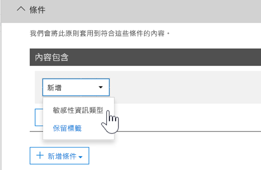

# <a name="create-custom-sensitive-information-types-with-exact-data-match-based-classification"></a><span data-ttu-id="0c07c-103">使用以精確資料比對為基礎的分類建立自訂敏感性資訊類型</span><span class="sxs-lookup"><span data-stu-id="0c07c-103">Create custom sensitive information types with Exact Data Match based classification</span></span>

<span data-ttu-id="0c07c-104">[的自訂機密資訊類型](custom-sensitive-info-types.md) 用於協助識別機密項目，這樣您可以防止它們不小心或不適當地被共用。</span><span class="sxs-lookup"><span data-stu-id="0c07c-104">[Custom sensitive information types](custom-sensitive-info-types.md) are used to help identify sensitive items so that you can prevent them from being inadvertently or inappropriately shared.</span></span> <span data-ttu-id="0c07c-105">您可以根據下列項目來定義自訂機密資訊類型：</span><span class="sxs-lookup"><span data-stu-id="0c07c-105">You define a custom sensitive information type based on:</span></span>

- <span data-ttu-id="0c07c-106">模式</span><span class="sxs-lookup"><span data-stu-id="0c07c-106">patterns</span></span>
- <span data-ttu-id="0c07c-107">關鍵字證據，例如 *employee*、 *識別證*，或 *識別碼*</span><span class="sxs-lookup"><span data-stu-id="0c07c-107">keyword evidence such as *employee*, *badge*, or *ID*</span></span>
- <span data-ttu-id="0c07c-108">字元以特定模式接近證據</span><span class="sxs-lookup"><span data-stu-id="0c07c-108">character proximity to evidence in a particular pattern</span></span>
- <span data-ttu-id="0c07c-109">信賴等級</span><span class="sxs-lookup"><span data-stu-id="0c07c-109">confidence levels</span></span>

 <span data-ttu-id="0c07c-110">這類自訂敏感性資訊類型符合許多組織的業務需求。</span><span class="sxs-lookup"><span data-stu-id="0c07c-110">Such custom sensitive information types meet business needs for many organizations.</span></span>

<span data-ttu-id="0c07c-111">但是，如果您想要一種使用精確數據值的自定義敏感信息類型，而非根據通用模式找到的匹配，該怎麼辦？</span><span class="sxs-lookup"><span data-stu-id="0c07c-111">But what if you wanted a custom sensitive information type that uses exact data values, instead of one that found matches based on generic patterns?</span></span> <span data-ttu-id="0c07c-112">使用以精確資料比對 (EDM) 為基礎的分類，您可以建立其設計目的為以下的自訂敏感性資訊類型：</span><span class="sxs-lookup"><span data-stu-id="0c07c-112">With Exact Data Match (EDM)-based classification, you can create a custom sensitive information type that is designed to:</span></span>

- <span data-ttu-id="0c07c-113">動態且可更新；</span><span class="sxs-lookup"><span data-stu-id="0c07c-113">be dynamic and refreshable</span></span>
- <span data-ttu-id="0c07c-114">更可以調整的；</span><span class="sxs-lookup"><span data-stu-id="0c07c-114">be more scalable</span></span>
- <span data-ttu-id="0c07c-115">造成較少的誤判；</span><span class="sxs-lookup"><span data-stu-id="0c07c-115">result in fewer false-positives</span></span>
- <span data-ttu-id="0c07c-116">使用結構化的敏感性資料；</span><span class="sxs-lookup"><span data-stu-id="0c07c-116">work with structured sensitive data</span></span>
- <span data-ttu-id="0c07c-117">更安全地處理敏感性資訊；以及</span><span class="sxs-lookup"><span data-stu-id="0c07c-117">handle sensitive information more securely</span></span>
- <span data-ttu-id="0c07c-118">能與數個 Microsoft 雲端服務搭配使用。</span><span class="sxs-lookup"><span data-stu-id="0c07c-118">be used with several Microsoft cloud services</span></span>


<span data-ttu-id="0c07c-120">以 EDM 為基礎的分類可讓您建立自訂敏感性資訊類型，其參考敏感性資訊資料庫中的確切值。</span><span class="sxs-lookup"><span data-stu-id="0c07c-120">EDM-based classification enables you to create custom sensitive information types that refer to exact values in a database of sensitive information.</span></span> <span data-ttu-id="0c07c-121">資料庫可以每日重新整理，而且可以包含最多 1 億資料列。</span><span class="sxs-lookup"><span data-stu-id="0c07c-121">The database can be refreshed daily, and contain up to 100 million rows of data.</span></span> <span data-ttu-id="0c07c-122">因此，隨著員工、病患或客戶來來去去，以及記錄變更，您的自訂敏感性資訊類型會維持最新且適用。</span><span class="sxs-lookup"><span data-stu-id="0c07c-122">So as employees, patients, or clients come and go, and records change, your custom sensitive information types remain current and applicable.</span></span> <span data-ttu-id="0c07c-123">同時，您可以對原則使用以 EDM 為基礎的分類，例如 [資料外洩防護原則](data-loss-prevention-policies.md) (DLP) 或  [Microsoft Cloud App Security 檔案原則](https://docs.microsoft.com/cloud-app-security/data-protection-policies)。</span><span class="sxs-lookup"><span data-stu-id="0c07c-123">And, you can use EDM-based classification with policies, such as [data loss prevention policies](data-loss-prevention-policies.md) (DLP) or [Microsoft Cloud App Security file policies](https://docs.microsoft.com/cloud-app-security/data-protection-policies).</span></span>

> [!NOTE]
> <span data-ttu-id="0c07c-124">Microsoft 365 資訊保護目前在預覽版中支援下列雙位元組字元集語言：</span><span class="sxs-lookup"><span data-stu-id="0c07c-124">Microsoft 365 Information Protection now  supports in preview double byte character set languages for:</span></span>
> - <span data-ttu-id="0c07c-125">中文 (簡體)</span><span class="sxs-lookup"><span data-stu-id="0c07c-125">Chinese (simplified)</span></span>
> - <span data-ttu-id="0c07c-126">中文 (繁體)</span><span class="sxs-lookup"><span data-stu-id="0c07c-126">Chinese (traditional)</span></span>
> - <span data-ttu-id="0c07c-127">韓文</span><span class="sxs-lookup"><span data-stu-id="0c07c-127">Korean</span></span>
> - <span data-ttu-id="0c07c-128">日文</span><span class="sxs-lookup"><span data-stu-id="0c07c-128">Japanese</span></span>
> 
><span data-ttu-id="0c07c-129">此預覽僅限用於商業雲端中，且僅在下列國家/地區推出：</span><span class="sxs-lookup"><span data-stu-id="0c07c-129">This preview is only in the commercial cloud and the rollout is limited to:</span></span>
> - <span data-ttu-id="0c07c-130">日本</span><span class="sxs-lookup"><span data-stu-id="0c07c-130">Japan</span></span>
> - <span data-ttu-id="0c07c-131">韓國</span><span class="sxs-lookup"><span data-stu-id="0c07c-131">Korea</span></span>
> - <span data-ttu-id="0c07c-132">中國</span><span class="sxs-lookup"><span data-stu-id="0c07c-132">China</span></span>
> - <span data-ttu-id="0c07c-133">香港特別行政區</span><span class="sxs-lookup"><span data-stu-id="0c07c-133">Hong Kong</span></span>
> - <span data-ttu-id="0c07c-134">澳門特別行政區</span><span class="sxs-lookup"><span data-stu-id="0c07c-134">Macau</span></span>
> - <span data-ttu-id="0c07c-135">台灣</span><span class="sxs-lookup"><span data-stu-id="0c07c-135">Taiwan</span></span>
>
><span data-ttu-id="0c07c-136">這項支援適用於敏感性資訊類型。</span><span class="sxs-lookup"><span data-stu-id="0c07c-136">This support is available for sensitive information types.</span></span> <span data-ttu-id="0c07c-137">如需詳細資訊，請參閱[資訊保護支援雙位元組字元集的版本資訊 (預覽版)](mip-dbcs-relnotes.md)。</span><span class="sxs-lookup"><span data-stu-id="0c07c-137">See, [Information protection support for double byte character sets release notes (preview)](mip-dbcs-relnotes.md) for more information.</span></span>

## <a name="required-licenses-and-permissions"></a><span data-ttu-id="0c07c-138">必要的授權和權限</span><span class="sxs-lookup"><span data-stu-id="0c07c-138">Required licenses and permissions</span></span>

<span data-ttu-id="0c07c-139">您必須是全域系統管理員、合規性系統管理員或 Exchange Online 系統管理員，才能執行本文所述的工作。</span><span class="sxs-lookup"><span data-stu-id="0c07c-139">You must be a global admin, compliance administrator, or Exchange Online administrator to perform the tasks described in this article.</span></span> <span data-ttu-id="0c07c-140">若要深入了解 DLP 權限，請參閱 [權限](data-loss-prevention-policies.md#permissions)。</span><span class="sxs-lookup"><span data-stu-id="0c07c-140">To learn more about DLP permissions, see [Permissions](data-loss-prevention-policies.md#permissions).</span></span>

<span data-ttu-id="0c07c-141">這些訂閱中包含 EDM 型分類</span><span class="sxs-lookup"><span data-stu-id="0c07c-141">EDM-based classification is included in these subscriptions</span></span>

- <span data-ttu-id="0c07c-142">Office 365 E5</span><span class="sxs-lookup"><span data-stu-id="0c07c-142">Office 365 E5</span></span>
- <span data-ttu-id="0c07c-143">Microsoft 365 E5</span><span class="sxs-lookup"><span data-stu-id="0c07c-143">Microsoft 365 E5</span></span>
- <span data-ttu-id="0c07c-144">Microsoft 365 E5 合規性</span><span class="sxs-lookup"><span data-stu-id="0c07c-144">Microsoft 365 E5 Compliance</span></span>
- <span data-ttu-id="0c07c-145">Microsoft E5/A5 資訊保護和控管</span><span class="sxs-lookup"><span data-stu-id="0c07c-145">Microsoft E5/A5 Information Protection and Governance</span></span>

## <a name="portal-links-for-your-subscription"></a><span data-ttu-id="0c07c-146">訂閱的入口網站連結</span><span class="sxs-lookup"><span data-stu-id="0c07c-146">Portal links for your subscription</span></span>


|<span data-ttu-id="0c07c-147">入口網站</span><span class="sxs-lookup"><span data-stu-id="0c07c-147">Portal</span></span>  |<span data-ttu-id="0c07c-148">全球/GCC</span><span class="sxs-lookup"><span data-stu-id="0c07c-148">World Wide/GCC</span></span>  |<span data-ttu-id="0c07c-149">GCC-High</span><span class="sxs-lookup"><span data-stu-id="0c07c-149">GCC-High</span></span>  |<span data-ttu-id="0c07c-150">DOD</span><span class="sxs-lookup"><span data-stu-id="0c07c-150">DOD</span></span>  |
|---------|---------|---------|---------|
|<span data-ttu-id="0c07c-151">Office SCC</span><span class="sxs-lookup"><span data-stu-id="0c07c-151">Office SCC</span></span>     |  <span data-ttu-id="0c07c-152">protection.office.com</span><span class="sxs-lookup"><span data-stu-id="0c07c-152">protection.office.com</span></span>       |<span data-ttu-id="0c07c-153">scc.office365.us</span><span class="sxs-lookup"><span data-stu-id="0c07c-153">scc.office365.us</span></span>         |<span data-ttu-id="0c07c-154">scc.protection.apps.mil</span><span class="sxs-lookup"><span data-stu-id="0c07c-154">scc.protection.apps.mil</span></span> |
|<span data-ttu-id="0c07c-155">Microsoft 365 安全性中心</span><span class="sxs-lookup"><span data-stu-id="0c07c-155">Microsoft 365 Security center</span></span>     |<span data-ttu-id="0c07c-156">security.microsoft.com</span><span class="sxs-lookup"><span data-stu-id="0c07c-156">security.microsoft.com</span></span>         |<span data-ttu-id="0c07c-157">security.microsoft.us</span><span class="sxs-lookup"><span data-stu-id="0c07c-157">security.microsoft.us</span></span>         |<span data-ttu-id="0c07c-158">security.apps.mil</span><span class="sxs-lookup"><span data-stu-id="0c07c-158">security.apps.mil</span></span>|
|<span data-ttu-id="0c07c-159">Microsoft 365 合規性中心</span><span class="sxs-lookup"><span data-stu-id="0c07c-159">Microsoft 365 Compliance center</span></span>     |<span data-ttu-id="0c07c-160">compliance.microsoft.com</span><span class="sxs-lookup"><span data-stu-id="0c07c-160">compliance.microsoft.com</span></span>         |<span data-ttu-id="0c07c-161">compliance.microsoft.us</span><span class="sxs-lookup"><span data-stu-id="0c07c-161">compliance.microsoft.us</span></span>         |<span data-ttu-id="0c07c-162">compliance.apps.mil</span><span class="sxs-lookup"><span data-stu-id="0c07c-162">compliance.apps.mil</span></span>|


## <a name="the-work-flow-at-a-glance"></a><span data-ttu-id="0c07c-163">工作流程概覽</span><span class="sxs-lookup"><span data-stu-id="0c07c-163">The work flow at a glance</span></span>

|<span data-ttu-id="0c07c-164">階段</span><span class="sxs-lookup"><span data-stu-id="0c07c-164">Phase</span></span>  |<span data-ttu-id="0c07c-165">需要的項目</span><span class="sxs-lookup"><span data-stu-id="0c07c-165">What's needed</span></span>  |
|---------|---------|
|[<span data-ttu-id="0c07c-166">第 1 部分：設定以 EDM 為基礎的分類</span><span class="sxs-lookup"><span data-stu-id="0c07c-166">Part 1: Set up EDM-based classification</span></span>](#part-1-set-up-edm-based-classification)<br/><br/><span data-ttu-id="0c07c-167">(視需要)</span><span class="sxs-lookup"><span data-stu-id="0c07c-167">(As needed)</span></span><br/><span data-ttu-id="0c07c-168">- [編輯資料庫結構描述](#editing-the-schema-for-edm-based-classification)</span><span class="sxs-lookup"><span data-stu-id="0c07c-168">- [Edit the database schema](#editing-the-schema-for-edm-based-classification)</span></span> <br/><span data-ttu-id="0c07c-169">- [移除結構描述](#removing-the-schema-for-edm-based-classification)</span><span class="sxs-lookup"><span data-stu-id="0c07c-169">- [Remove the schema](#removing-the-schema-for-edm-based-classification)</span></span> |<span data-ttu-id="0c07c-170">- 敏感性資料的讀取存取權</span><span class="sxs-lookup"><span data-stu-id="0c07c-170">- Read access to the sensitive data</span></span><br/><span data-ttu-id="0c07c-171">- XML 格式的資料庫結構描述 (提供範例)</span><span class="sxs-lookup"><span data-stu-id="0c07c-171">- Database schema in XML format (example provided)</span></span><br/><span data-ttu-id="0c07c-172">- XML 格式的規則套件 (提供範例)</span><span class="sxs-lookup"><span data-stu-id="0c07c-172">- Rule package in XML format (example provided)</span></span><br/><span data-ttu-id="0c07c-173">- 安全性與合規性中心的系統管理員權限 (使用 PowerShell)</span><span class="sxs-lookup"><span data-stu-id="0c07c-173">- Admin permissions to the Security & Compliance Center (using PowerShell)</span></span> |
|[<span data-ttu-id="0c07c-174">第 2 部分：雜湊和上傳敏感性資料</span><span class="sxs-lookup"><span data-stu-id="0c07c-174">Part 2: Hash and upload the sensitive data</span></span>](#part-2-hash-and-upload-the-sensitive-data)<br/><br/><span data-ttu-id="0c07c-175">(視需要)</span><span class="sxs-lookup"><span data-stu-id="0c07c-175">(As needed)</span></span><br/>[<span data-ttu-id="0c07c-176">重新整理資料</span><span class="sxs-lookup"><span data-stu-id="0c07c-176">Refresh the data</span></span>](#refreshing-your-sensitive-information-database) |<span data-ttu-id="0c07c-177">- 自訂安全性群組和使用者帳戶</span><span class="sxs-lookup"><span data-stu-id="0c07c-177">- Custom security group and user account</span></span><br/><span data-ttu-id="0c07c-178">- 具有 EDM 上傳代理程式電腦的本機系統管理員存取權</span><span class="sxs-lookup"><span data-stu-id="0c07c-178">- Local admin access to machine with EDM Upload Agent</span></span><br/><span data-ttu-id="0c07c-179">- 敏感性資料的讀取存取權</span><span class="sxs-lookup"><span data-stu-id="0c07c-179">- Read access to the sensitive data</span></span><br/><span data-ttu-id="0c07c-180">- 重新整理資料的程序和排程</span><span class="sxs-lookup"><span data-stu-id="0c07c-180">- Process and schedule for refreshing the data</span></span>|
|[<span data-ttu-id="0c07c-181">第 3 部分：使用以 EDM 為基礎的分類搭配 Microsoft 雲端服務</span><span class="sxs-lookup"><span data-stu-id="0c07c-181">Part 3: Use EDM-based classification with your Microsoft cloud services</span></span>](#part-3-use-edm-based-classification-with-your-microsoft-cloud-services) |<span data-ttu-id="0c07c-182">- Microsoft 365 訂閱與 DLP</span><span class="sxs-lookup"><span data-stu-id="0c07c-182">- Microsoft 365 subscription with DLP</span></span><br/><span data-ttu-id="0c07c-183">- 已啟用以 EDM 為基礎的分類功能</span><span class="sxs-lookup"><span data-stu-id="0c07c-183">- EDM-based classification feature enabled</span></span> |

### <a name="part-1-set-up-edm-based-classification"></a><span data-ttu-id="0c07c-184">第 1 部分：設定以 EDM 為基礎的分類</span><span class="sxs-lookup"><span data-stu-id="0c07c-184">Part 1: Set up EDM-based classification</span></span>

<span data-ttu-id="0c07c-185">設定及安裝以 EDM 為基礎的分類會涉及：</span><span class="sxs-lookup"><span data-stu-id="0c07c-185">Setting up and configuring EDM-based classification involves:</span></span>

1. [<span data-ttu-id="0c07c-186">以 .csv 格式儲存機密資料</span><span class="sxs-lookup"><span data-stu-id="0c07c-186">Saving sensitive data in .csv format</span></span>](#save-sensitive-data-in-csv-format)
2. [<span data-ttu-id="0c07c-187">定義您的機密資訊資料庫架構</span><span class="sxs-lookup"><span data-stu-id="0c07c-187">Define your sensitive information database schema</span></span>](#define-the-schema-for-your-database-of-sensitive-information)
3. [<span data-ttu-id="0c07c-188">建立規則套件</span><span class="sxs-lookup"><span data-stu-id="0c07c-188">Create a rule package</span></span>](#set-up-a-rule-package)


#### <a name="save-sensitive-data-in-csv-format"></a><span data-ttu-id="0c07c-189">以 .csv 格式儲存機密資料</span><span class="sxs-lookup"><span data-stu-id="0c07c-189">Save sensitive data in .csv format</span></span>

1. <span data-ttu-id="0c07c-190">找出您要使用的敏感性資訊。</span><span class="sxs-lookup"><span data-stu-id="0c07c-190">Identify the sensitive information you want to use.</span></span> <span data-ttu-id="0c07c-191">將資料匯出至應用程式，例如 Microsoft Excel，並將檔案以 .csv 格式儲存。</span><span class="sxs-lookup"><span data-stu-id="0c07c-191">Export the data to an app, such as Microsoft Excel, and save the file in .csv format.</span></span> <span data-ttu-id="0c07c-192">資料檔案可能包含：</span><span class="sxs-lookup"><span data-stu-id="0c07c-192">The data file can include a maximum of:</span></span>
      - <span data-ttu-id="0c07c-193">最多 1 億列敏感性資料</span><span class="sxs-lookup"><span data-stu-id="0c07c-193">Up to 100 million rows of sensitive data</span></span>
      - <span data-ttu-id="0c07c-194">每個資料來源最多 32 個資料行 (欄位)</span><span class="sxs-lookup"><span data-stu-id="0c07c-194">Up to 32 columns (fields) per data source</span></span>
      - <span data-ttu-id="0c07c-195">最多 5 個資料行 (欄位) 標示為可搜尋</span><span class="sxs-lookup"><span data-stu-id="0c07c-195">Up to 5 columns (fields) marked as searchable</span></span>

2. <span data-ttu-id="0c07c-196">以 .csv 檔案格式將敏感性資料結構化，使得第一列包含用於以 EDM 為基礎的分類的欄位名稱。</span><span class="sxs-lookup"><span data-stu-id="0c07c-196">Structure the sensitive data in the .csv file such that the first row includes the names of the fields used for EDM-based classification.</span></span> <span data-ttu-id="0c07c-197">在您的 .csv 檔案中，您可能會有欄位名稱，例如 "ssn"、"生日"、"名字"、"姓氏" 等等。</span><span class="sxs-lookup"><span data-stu-id="0c07c-197">In your .csv file, you might have field names, such as "ssn", "birthdate", "firstname", "lastname".</span></span> <span data-ttu-id="0c07c-198">欄標題名稱不能包含空格或底線。</span><span class="sxs-lookup"><span data-stu-id="0c07c-198">The column header names can't include spaces or underscores.</span></span> <span data-ttu-id="0c07c-199">例如，在本文我們所使用的 .csv 檔案範例稱為「PatientRecords *.csv*，而其欄包含 *PatientID*、 *MRN*、 *LastName*、 *FirstName*、 *的 SSN*等等。</span><span class="sxs-lookup"><span data-stu-id="0c07c-199">For example, the sample .csv file that we use in this article is named *PatientRecords.csv*, and its columns include *PatientID*, *MRN*, *LastName*, *FirstName*, *SSN*, and more.</span></span>

#### <a name="define-the-schema-for-your-database-of-sensitive-information"></a><span data-ttu-id="0c07c-200">定義用於敏感性資訊的資料庫結構描述</span><span class="sxs-lookup"><span data-stu-id="0c07c-200">Define the schema for your database of sensitive information</span></span>

3. <span data-ttu-id="0c07c-201">以 XML 格式定義用於敏感性資訊資料庫的結構描述 (類似以下的範例)。</span><span class="sxs-lookup"><span data-stu-id="0c07c-201">Define the schema for the database of sensitive information in XML format (similar to our example below).</span></span> <span data-ttu-id="0c07c-202">將此結構描述檔案命名為  **edm.xml**，然後進行設定，讓資料庫中的每一個資料行都會有使用下列語法的行：</span><span class="sxs-lookup"><span data-stu-id="0c07c-202">Name this schema file **edm.xml**, and configure it such that for each column in the database, there is a line that uses the syntax:</span></span> 

      <span data-ttu-id="0c07c-203">`\<Field name="" searchable=""/\>`。</span><span class="sxs-lookup"><span data-stu-id="0c07c-203">`\<Field name="" searchable=""/\>`.</span></span>

      - <span data-ttu-id="0c07c-204">使用資料行名稱作為 *欄位名稱* 值。</span><span class="sxs-lookup"><span data-stu-id="0c07c-204">Use column names for *Field name* values.</span></span>
      - <span data-ttu-id="0c07c-205">對您想讓它可供搜尋最多 5 個欄位的欄位，使用 *searchable="true"* 。</span><span class="sxs-lookup"><span data-stu-id="0c07c-205">Use *searchable="true"* for the fields that you want to be searchable up to a maximum of 5 fields.</span></span> <span data-ttu-id="0c07c-206">至少必須有一個欄位可供搜尋。</span><span class="sxs-lookup"><span data-stu-id="0c07c-206">At least one field must be searchable.</span></span>

      <span data-ttu-id="0c07c-207">例如，下列 XML 檔會為病患記錄資料庫定義結構描述，並將五個欄位指定為可搜尋： *PatientID*、 *MRN*、 *SSN*、 *Phone* 以及  *DOB*。</span><span class="sxs-lookup"><span data-stu-id="0c07c-207">As an example, the following XML file defines the schema for a patient records database, with five fields specified as searchable: *PatientID*, *MRN*, *SSN*, *Phone*, and *DOB*.</span></span>

      <span data-ttu-id="0c07c-208">(您可以複製、修改及使用我們的範例)。</span><span class="sxs-lookup"><span data-stu-id="0c07c-208">(You can copy, modify, and use our example.)</span></span>

      ```xml
      <EdmSchema xmlns="http://schemas.microsoft.com/office/2018/edm">
            <DataStore name="PatientRecords" description="Schema for patient records" version="1">
                  <Field name="PatientID" searchable="true" />
                  <Field name="MRN" searchable="true" />
                  <Field name="FirstName" />
                  <Field name="LastName" />
                  <Field name="SSN" searchable="true" />
                  <Field name="Phone" searchable="true" />
                  <Field name="DOB" searchable="true" />
                  <Field name="Gender" />
                  <Field name="Address" />
            </DataStore>
      </EdmSchema>
      ```

4. <span data-ttu-id="0c07c-209">使用[連線到安全性與合規性中心 PowerShell](https://docs.microsoft.com/powershell/exchange/connect-to-scc-powershell) 中的程序，連線到安全性與合規性中心。</span><span class="sxs-lookup"><span data-stu-id="0c07c-209">Connect to the Security & Compliance center using the procedures in [Connect to Security & Compliance Center PowerShell](https://docs.microsoft.com/powershell/exchange/connect-to-scc-powershell).</span></span>

5. <span data-ttu-id="0c07c-210">若要上傳資料庫結構描述，請執行下列 Cmdlet，一次一個：</span><span class="sxs-lookup"><span data-stu-id="0c07c-210">To upload the database schema, run the following cmdlets, one at a time:</span></span>

      ```powershell
      $edmSchemaXml=Get-Content .\\edm.xml -Encoding Byte -ReadCount 0
      New-DlpEdmSchema -FileData $edmSchemaXml -Confirm:$true
      ```

      <span data-ttu-id="0c07c-211">系統會提示您確認，如下所示：</span><span class="sxs-lookup"><span data-stu-id="0c07c-211">You will be prompted to confirm, as follows:</span></span>

      > <span data-ttu-id="0c07c-212">確認</span><span class="sxs-lookup"><span data-stu-id="0c07c-212">Confirm</span></span>
      >
      > <span data-ttu-id="0c07c-213">是否確定要執行此動作？</span><span class="sxs-lookup"><span data-stu-id="0c07c-213">Are you sure you want to perform this action?</span></span>
      >
      > <span data-ttu-id="0c07c-214">將匯入資料存放區 'patientrecords' 的新 EDM 結構描述。</span><span class="sxs-lookup"><span data-stu-id="0c07c-214">New EDM Schema for the data store 'patientrecords' will be imported.</span></span>
      >
      > <span data-ttu-id="0c07c-215">\[Y\] 是 \[A\] 全部皆是 \[N\] 否 \[L\] 全部皆否 \[?\] 說明 (預設值為 "Y")：</span><span class="sxs-lookup"><span data-stu-id="0c07c-215">\[Y\] Yes \[A\] Yes to All \[N\] No \[L\] No to All \[?\] Help (default is "Y"):</span></span>

> [!TIP]
> <span data-ttu-id="0c07c-216">若要不確認即變更，請在步驟 5 中改用此 Cmdlet：New-DlpEdmSchema -FileData $edmSchemaXml</span><span class="sxs-lookup"><span data-stu-id="0c07c-216">If you want your changes to occur without confirmation, in Step 5, use this cmdlet instead: New-DlpEdmSchema -FileData $edmSchemaXml</span></span>

> [!NOTE]
> <span data-ttu-id="0c07c-217">這可能要花 10 到 60 分鐘的時間，才能將 EDMSchema 更新為新增項目。</span><span class="sxs-lookup"><span data-stu-id="0c07c-217">It can take between 10-60 minutes to update the EDMSchema with additions.</span></span> <span data-ttu-id="0c07c-218">在您執行使用新增項目的步驟之前，必須先完成更新。</span><span class="sxs-lookup"><span data-stu-id="0c07c-218">The update must complete before you execute steps that use the additions.</span></span>

#### <a name="set-up-a-rule-package"></a><span data-ttu-id="0c07c-219">設定規則套件</span><span class="sxs-lookup"><span data-stu-id="0c07c-219">Set up a rule package</span></span>

1. <span data-ttu-id="0c07c-220">以 XML 格式建立規則套件 (使用 Unicode 編碼方式)，類似下列範例。</span><span class="sxs-lookup"><span data-stu-id="0c07c-220">Create a rule package in XML format (with Unicode encoding), similar to the following example.</span></span> <span data-ttu-id="0c07c-221">(您可以複製、修改及使用我們的範例)。</span><span class="sxs-lookup"><span data-stu-id="0c07c-221">(You can copy, modify, and use our example.)</span></span>

      <span data-ttu-id="0c07c-222">當您設定規則套件時，請務必正確參照您的 .csv 檔案和 **edm.xml** 檔案。</span><span class="sxs-lookup"><span data-stu-id="0c07c-222">When you set up your rule package, make sure to correctly reference your .csv file and **edm.xml** file.</span></span> <span data-ttu-id="0c07c-223">您可以複製、修改及使用我們的範例。</span><span class="sxs-lookup"><span data-stu-id="0c07c-223">You can copy, modify, and use our example.</span></span> <span data-ttu-id="0c07c-224">在此範例 xml 中，必須自訂下列欄位，才能建立您的 EDM 敏感性類型：</span><span class="sxs-lookup"><span data-stu-id="0c07c-224">In this sample xml the following fields needs to be customized to create your EDM sensitive type:</span></span>

      - <span data-ttu-id="0c07c-225">**RulePack id 與 ExactMatch id**：使用 [New-GUID](https://docs.microsoft.com/powershell/module/microsoft.powershell.utility/new-guid?view=powershell-6) 產生 GUID。</span><span class="sxs-lookup"><span data-stu-id="0c07c-225">**RulePack id & ExactMatch id**: Use [New-GUID](https://docs.microsoft.com/powershell/module/microsoft.powershell.utility/new-guid?view=powershell-6) to generate a GUID.</span></span>

      - <span data-ttu-id="0c07c-226">**資料存放區**：此欄位會指定要使用的 EDM 查閱資料存放區。</span><span class="sxs-lookup"><span data-stu-id="0c07c-226">**Datastore**: This field specifies EDM lookup data store to be used.</span></span> <span data-ttu-id="0c07c-227">您要提供已設定之 EDM 結構描述的資料來源名稱。</span><span class="sxs-lookup"><span data-stu-id="0c07c-227">You provide a data source name of a configured EDM Schema.</span></span>

      - <span data-ttu-id="0c07c-228">**idMatch**：此欄位會指向 EDM 的主要元素。</span><span class="sxs-lookup"><span data-stu-id="0c07c-228">**idMatch**: This field points to the primary element for EDM.</span></span>
        - <span data-ttu-id="0c07c-229">相符項目：指定要在完全查閱中使用的欄位。</span><span class="sxs-lookup"><span data-stu-id="0c07c-229">Matches: Specifies the field to be used in exact lookup.</span></span> <span data-ttu-id="0c07c-230">您要在資料存放區的 EDM 結構描述中，提供可搜尋的欄位名稱。</span><span class="sxs-lookup"><span data-stu-id="0c07c-230">You provide a searchable field name in EDM Schema for the DataStore.</span></span>
        - <span data-ttu-id="0c07c-231">分類：此欄位會指定可觸發 EDM 查閱的敏感性類型符合項目。</span><span class="sxs-lookup"><span data-stu-id="0c07c-231">Classification: This field specifies the sensitive type match that triggers EDM lookup.</span></span> <span data-ttu-id="0c07c-232">您可以提供現有內建或自訂分類的名稱或 GUID。</span><span class="sxs-lookup"><span data-stu-id="0c07c-232">You can provide Name or GUID of an existing built-in or custom classification.</span></span>

      - <span data-ttu-id="0c07c-233">**相符項目：** 此欄位會指向 idMatch 鄰近位置的其他辨識項。</span><span class="sxs-lookup"><span data-stu-id="0c07c-233">**Match:** This field points to additional evidence found in proximity of idMatch.</span></span>
        - <span data-ttu-id="0c07c-234">相符項目：您要在資料存放區的 EDM 結構描述中，提供任何欄位名稱。</span><span class="sxs-lookup"><span data-stu-id="0c07c-234">Matches: You provide any field name in EDM Schema for DataStore.</span></span>
      - <span data-ttu-id="0c07c-235">**資源：** 此區段會在多個地區設定中，指定敏感性類型的名稱和描述。</span><span class="sxs-lookup"><span data-stu-id="0c07c-235">**Resource:** This section specifies the name and description for sensitive type in multiple locales.</span></span>
        - <span data-ttu-id="0c07c-236">idRef：您要提供 ExactMatch ID 的 GUID。</span><span class="sxs-lookup"><span data-stu-id="0c07c-236">idRef: You provide GUID for ExactMatch ID.</span></span>
        - <span data-ttu-id="0c07c-237">名稱與描述：視需要自訂。</span><span class="sxs-lookup"><span data-stu-id="0c07c-237">Name & descriptions: customize as required.</span></span>

      ```xml
      <RulePackage xmlns="http://schemas.microsoft.com/office/2018/edm">
        <RulePack id="fd098e03-1796-41a5-8ab6-198c93c62b11">
          <Version build="0" major="2" minor="0" revision="0" />
          <Publisher id="eb553734-8306-44b4-9ad5-c388ad970528" />
          <Details defaultLangCode="en-us">
            <LocalizedDetails langcode="en-us">
              <PublisherName>IP DLP</PublisherName>
              <Name>Health Care EDM Rulepack</Name>
              <Description>This rule package contains the EDM sensitive type for health care sensitive types.</Description>
            </LocalizedDetails>
          </Details>
        </RulePack>
        <Rules>
          <ExactMatch id = "E1CC861E-3FE9-4A58-82DF-4BD259EAB371" patternsProximity = "300" dataStore ="PatientRecords" recommendedConfidence = "65" >
            <Pattern confidenceLevel="65">
              <idMatch matches = "SSN" classification = "U.S. Social Security Number (SSN)" />
            </Pattern>
            <Pattern confidenceLevel="75">
              <idMatch matches = "SSN" classification = "U.S. Social Security Number (SSN)" />
              <Any minMatches ="3" maxMatches ="6">
                <match matches="PatientID" />
                <match matches="MRN"/>
                <match matches="FirstName"/>
                <match matches="LastName"/>
                <match matches="Phone"/>
                <match matches="DOB"/>
              </Any>
            </Pattern>
          </ExactMatch>
          <LocalizedStrings>
            <Resource idRef="E1CC861E-3FE9-4A58-82DF-4BD259EAB371">
              <Name default="true" langcode="en-us">Patient SSN Exact Match.</Name>
              <Description default="true" langcode="en-us">EDM Sensitive type for detecting Patient SSN.</Description>
            </Resource>
          </LocalizedStrings>
        </Rules>
      </RulePackage>
      ```

1. <span data-ttu-id="0c07c-238">執行下列 PowerShell Cmdlet 以上傳規則套件，一次一個：</span><span class="sxs-lookup"><span data-stu-id="0c07c-238">Upload the rule package by running the following PowerShell cmdlets, one at a time:</span></span>

      ```powershell
      $rulepack=Get-Content .\\rulepack.xml -Encoding Byte -ReadCount 0
      New-DlpSensitiveInformationTypeRulePackage -FileData $rulepack
      ```

<span data-ttu-id="0c07c-239">此時，您已設定以 EDM 為基礎的分類。</span><span class="sxs-lookup"><span data-stu-id="0c07c-239">At this point, you have set up EDM-based classification.</span></span> <span data-ttu-id="0c07c-240">下一個步驟是要對敏感性資料雜湊，然後上傳用於編製索引的雜湊。</span><span class="sxs-lookup"><span data-stu-id="0c07c-240">The next step is to hash the sensitive data, and then upload the hashes for indexing.</span></span>

<span data-ttu-id="0c07c-241">回想一下前面的程序，我們的 PatientRecords 結構描述將五個欄位定義為可搜尋： *PatientID*、 *MRN*、 *SSN*、 *Phone* 和  *DOB*。</span><span class="sxs-lookup"><span data-stu-id="0c07c-241">Recall from the previous procedure that our PatientRecords schema defines five fields as searchable: *PatientID*, *MRN*, *SSN*, *Phone*, and *DOB*.</span></span> <span data-ttu-id="0c07c-242">我們的範例規則套件包含這些欄位，並參照資料庫架構檔（**edm .xml**），其中一個 *ExactMatch* 每個可搜尋欄位的專案。</span><span class="sxs-lookup"><span data-stu-id="0c07c-242">Our example rule package includes those fields and references the database schema file (**edm.xml**), with one *ExactMatch* item per searchable field.</span></span> <span data-ttu-id="0c07c-243">請考慮下列 ExactMatch 項目：</span><span class="sxs-lookup"><span data-stu-id="0c07c-243">Consider the following ExactMatch item:</span></span>

```xml
<ExactMatch id = "E1CC861E-3FE9-4A58-82DF-4BD259EAB371" patternsProximity = "300" dataStore ="PatientRecords" recommendedConfidence = "65" >
      <Pattern confidenceLevel="65">
        <idMatch matches = "SSN" classification = "U.S. Social Security Number (SSN)" />
      </Pattern>
      <Pattern confidenceLevel="75">
        <idMatch matches = "SSN" classification = "U.S. Social Security Number (SSN)" />
        <Any minMatches ="3" maxMatches ="100">
          <match matches="PatientID" />
          <match matches="MRN"/>
          <match matches="FirstName"/>
          <match matches="LastName"/>
          <match matches="Phone"/>
          <match matches="DOB"/>
        </Any>
      </Pattern>
    </ExactMatch>
```

<span data-ttu-id="0c07c-244">請注意本範例中的下列重點：</span><span class="sxs-lookup"><span data-stu-id="0c07c-244">In this example, note that:</span></span>

- <span data-ttu-id="0c07c-245">資料存放區名稱會參照稍早建立的 .csv 檔案： **dataStore = "PatientRecords"**。</span><span class="sxs-lookup"><span data-stu-id="0c07c-245">The dataStore name references the .csv file we created earlier: **dataStore = "PatientRecords"**.</span></span>

- <span data-ttu-id="0c07c-246">idMatch 值會參照可搜尋的欄位，其列於資料庫結構描述檔案： **idMatch matches = "SSN"**。</span><span class="sxs-lookup"><span data-stu-id="0c07c-246">The idMatch value references a searchable field that is listed in the database schema file: **idMatch matches = "SSN"**.</span></span>

- <span data-ttu-id="0c07c-247">分類值會參照現有或自訂敏感性資訊類型： **classification = "U.S. Social Security Number (SSN)"** </span><span class="sxs-lookup"><span data-stu-id="0c07c-247">The classification value references an existing or custom sensitive information type: **classification = "U.S. Social Security Number (SSN)"**.</span></span> <span data-ttu-id="0c07c-248">(在此案例中，我們使用美國社會安全號碼作為現有的敏感性資訊類型)。</span><span class="sxs-lookup"><span data-stu-id="0c07c-248">(In this case, we use the existing sensitive information type of U.S. Social Security Number.)</span></span>

> [!NOTE]
> <span data-ttu-id="0c07c-249">這可能要花 10 到 60 分鐘的時間，才能將 EDMSchema 更新為新增項目。</span><span class="sxs-lookup"><span data-stu-id="0c07c-249">It can take between 10-60 minutes to update the EDMSchema with additions.</span></span> <span data-ttu-id="0c07c-250">在您執行使用新增項目的步驟之前，必須先完成更新。</span><span class="sxs-lookup"><span data-stu-id="0c07c-250">The update must complete before you execute steps that use the additions.</span></span>

#### <a name="editing-the-schema-for-edm-based-classification"></a><span data-ttu-id="0c07c-251">編輯以 EDM 為基礎的分類的結構描述</span><span class="sxs-lookup"><span data-stu-id="0c07c-251">Editing the schema for EDM-based classification</span></span>

<span data-ttu-id="0c07c-252">如果您想要變更 **edm.xml** 檔案，例如變更哪些欄位用於以 EDM 為基礎的分類，請遵循下列步驟進行：</span><span class="sxs-lookup"><span data-stu-id="0c07c-252">If you want to make changes to your **edm.xml** file, such as changing which fields are used for EDM-based classification, follow these steps:</span></span>

1. <span data-ttu-id="0c07c-253">編輯您的 **edm.xml** 檔案 (這是本文 [定義結構描述](#define-the-schema-for-your-database-of-sensitive-information) 一節所討論的檔案)。</span><span class="sxs-lookup"><span data-stu-id="0c07c-253">Edit your **edm.xml** file (this is the file discussed in the [Define the schema](#define-the-schema-for-your-database-of-sensitive-information) section of this article).</span></span>

2. <span data-ttu-id="0c07c-254">使用[連線到安全性與合規性中心 PowerShell](https://docs.microsoft.com/powershell/exchange/connect-to-scc-powershell) 中的程序，連線到安全性與合規性中心。</span><span class="sxs-lookup"><span data-stu-id="0c07c-254">Connect to the Security & Compliance center using the procedures in [Connect to Security & Compliance Center PowerShell](https://docs.microsoft.com/powershell/exchange/connect-to-scc-powershell).</span></span>

3. <span data-ttu-id="0c07c-255">若要更新資料庫結構描述，請執行下列 Cmdlet，一次一個：</span><span class="sxs-lookup"><span data-stu-id="0c07c-255">To update your database schema, run the following cmdlets, one at a time:</span></span>

      ```powershell
      $edmSchemaXml=Get-Content .\\edm.xml -Encoding Byte -ReadCount 0
      Set-DlpEdmSchema -FileData $edmSchemaXml -Confirm:$true
      ```

      <span data-ttu-id="0c07c-256">系統會提示您確認，如下所示：</span><span class="sxs-lookup"><span data-stu-id="0c07c-256">You will be prompted to confirm, as follows:</span></span>

      > <span data-ttu-id="0c07c-257">確認</span><span class="sxs-lookup"><span data-stu-id="0c07c-257">Confirm</span></span>
      >
      > <span data-ttu-id="0c07c-258">是否確定要執行此動作？</span><span class="sxs-lookup"><span data-stu-id="0c07c-258">Are you sure you want to perform this action?</span></span>
      >
      > <span data-ttu-id="0c07c-259">將更新資料存放區 'patientrecords' 的 EDM 結構描述。</span><span class="sxs-lookup"><span data-stu-id="0c07c-259">EDM Schema for the data store 'patientrecords' will be updated.</span></span>
      >
      > <span data-ttu-id="0c07c-260">\[Y\] 是 \[A\] 全部皆是 \[N\] 否 \[L\] 全部皆否 \[?\] 說明 (預設值為 "Y")：</span><span class="sxs-lookup"><span data-stu-id="0c07c-260">\[Y\] Yes \[A\] Yes to All \[N\] No \[L\] No to All \[?\] Help (default is "Y"):</span></span>

      > [!TIP]
      > <span data-ttu-id="0c07c-261">若要不確認即變更，請在步驟 3 中改用此 Cmdlet：Set-DlpEdmSchema -FileData $edmSchemaXml</span><span class="sxs-lookup"><span data-stu-id="0c07c-261">If you want your changes to occur without confirmation, in Step 3, use this cmdlet instead: Set-DlpEdmSchema -FileData $edmSchemaXml</span></span>

      > [!NOTE]
      > <span data-ttu-id="0c07c-262">這可能要花 10 到 60 分鐘的時間，才能將 EDMSchema 更新為新增項目。</span><span class="sxs-lookup"><span data-stu-id="0c07c-262">It can take between 10-60 minutes to update the EDMSchema with additions.</span></span> <span data-ttu-id="0c07c-263">在您執行使用新增項目的步驟之前，必須先完成更新。</span><span class="sxs-lookup"><span data-stu-id="0c07c-263">The update must complete before you execute steps that use the additions.</span></span>

#### <a name="removing-the-schema-for-edm-based-classification"></a><span data-ttu-id="0c07c-264">移除以 EDM 為基礎的分類的結構描述</span><span class="sxs-lookup"><span data-stu-id="0c07c-264">Removing the schema for EDM-based classification</span></span>

<span data-ttu-id="0c07c-265">(如有需要) 如果您想要移除 EDM 型分類使用的結構描述，請遵循下列步驟：</span><span class="sxs-lookup"><span data-stu-id="0c07c-265">(As needed) If you want to remove the schema you're using for EDM-based classification, follow these steps:</span></span>

1. <span data-ttu-id="0c07c-266">使用[連線到安全性與合規性中心 PowerShell](https://docs.microsoft.com/powershell/exchange/connect-to-scc-powershell) 中的程序，連線到安全性與合規性中心。</span><span class="sxs-lookup"><span data-stu-id="0c07c-266">Connect to the Security & Compliance center using the procedures in [Connect to Security & Compliance Center PowerShell](https://docs.microsoft.com/powershell/exchange/connect-to-scc-powershell).</span></span>

2. <span data-ttu-id="0c07c-267">執行下列 PowerShell Cmdlet，將 "patientrecords" 的資料存放區名稱取代為您要移除的資料存放區名稱：</span><span class="sxs-lookup"><span data-stu-id="0c07c-267">Run the following PowerShell cmdlets, substituting the data store name of "patient records" with the one you want to remove:</span></span>

      ```powershell
      Remove-DlpEdmSchema -Identity patientrecords
      ```

      <span data-ttu-id="0c07c-268">系統會提示您確認：</span><span class="sxs-lookup"><span data-stu-id="0c07c-268">You will be prompted to confirm:</span></span>

      > <span data-ttu-id="0c07c-269">確認</span><span class="sxs-lookup"><span data-stu-id="0c07c-269">Confirm</span></span>
      >
      > <span data-ttu-id="0c07c-270">是否確定要執行此動作？</span><span class="sxs-lookup"><span data-stu-id="0c07c-270">Are you sure you want to perform this action?</span></span>
      >
      > <span data-ttu-id="0c07c-271">將移除資料存放區 'patientrecords' 的 EDM 結構描述。</span><span class="sxs-lookup"><span data-stu-id="0c07c-271">EDM Schema for the data store 'patientrecords' will be removed.</span></span>
      >
      > <span data-ttu-id="0c07c-272">\[Y\] 是 \[A\] 全部皆是 \[N\] 否 \[L\] 全部皆否 \[?\] 說明 (預設值為 "Y")：</span><span class="sxs-lookup"><span data-stu-id="0c07c-272">\[Y\] Yes \[A\] Yes to All \[N\] No \[L\] No to All \[?\] Help (default is "Y"):</span></span>

      > [!TIP]
      >  <span data-ttu-id="0c07c-273">若要不確認即變更，請在步驟 2 中改用此 Cmdlet：Remove-DlpEdmSchema -Identity patientrecords -Confirm:$false</span><span class="sxs-lookup"><span data-stu-id="0c07c-273">If you want your changes to occur without confirmation, in Step 2, use this cmdlet instead: Remove-DlpEdmSchema -Identity patientrecords -Confirm:$false</span></span>


<!-- salt notes
need two salting procedures, one for onestep from the externally facing and another for two step, on an internal machine then the upload from the external machine

- create A  folder put the edmupload agent and, csv and salt file there, run all processes there
- 
- stuff you need to have first: DataStoreName, /DataFile name (csv file)  /Hashlocation

- salt can be randomly generated by Microsoft or can be provided by the customer. If provided by the customer it must follow  format of 64 character, and can contain only letters or 0-9 characters.  Use a website to generate a valid salt value.
 
- can run EDMuploadagent.exe from PS or Windows cmd window . tested on Windows Server 2016 or Windows 10 and dot net version 4.6.2

when defiuning the schema file the searchable fields must be either an out of box SIT or custom SIT, only 5 fields )column headings) can be searchable

1. From outbound access device from the cmd prompt run EdmUploadAgent.exe /Authorize -  
2. data store schema must have already been uploaded
3.  create hash first then do upload
4. EdmUploadAgent.exe /CreateHash /DataFile (where the data file is ) E:\emd\test\data\schema32_1000000,csv /HashLocation  (where to store it) E:\edm\tat\hash this makes the salt file and the hash file as output
5. next is upload EdmUploadAgent.exe /UploadHash /DataStoreName (found in the Schema file DataSore name="FOO" /HashFile (path to hash file locaztion and file name /HashLocation path to hash)  for example
1.EdmUploadAgent/exe /UploadHash /DataStoreName schema321 /HashFile E:\edm\test\hash\schema32_10000000.EdmHash /HashLocation E:\edm\test\hash  -this one  uses MSFT generated salt, so no need to provide

Salt is an optional parameter so if yo uwant to use a custom salt add /salt and the salt value if salt file not copied to the outbound machine 

OR copy both files hash and salt to the same directory and the commmand will get both


OR do it in single step hash, salt ulopad

!! once they download the updated upload agent they will always have SALT, there is no going back.


all in one step: EdmUploadAgent.exe /UploadData /DataStoreName schema321 /DataFile E:\edm\test\data\schema32_10000.csv /HashLocation E:\edm\test\hash

tshooting/check status cmd


Once it gets to completed the admin can start using it in the custom SIT

they have to get their own custom SALT

just copy SALT over in a secure fashion


1.
6.
7.
1.  


 -->

### <a name="part-2-hash-and-upload-the-sensitive-data"></a><span data-ttu-id="0c07c-274">第 2 部分：雜湊及上傳敏感性資料</span><span class="sxs-lookup"><span data-stu-id="0c07c-274">Part 2: Hash and upload the sensitive data</span></span>

<span data-ttu-id="0c07c-275">在此階段中，您要設定自訂安全性群組和使用者帳戶，並設定 EDM Upload Agent tool 上傳代理工具。</span><span class="sxs-lookup"><span data-stu-id="0c07c-275">In this phase, you set up a custom security group and user account, and set up the EDM Upload Agent tool.</span></span> <span data-ttu-id="0c07c-276">然後，您可以對敏感數據使用該工具在雜湊中加入字串，然後將其上傳。</span><span class="sxs-lookup"><span data-stu-id="0c07c-276">Then, you use the tool to hash with salt value the sensitive data, and upload it.</span></span>

<span data-ttu-id="0c07c-277">雜湊和上傳可以使用一部電腦來完成，或者您也可以將雜湊步驟與上傳步驟分開，以提高安全性。</span><span class="sxs-lookup"><span data-stu-id="0c07c-277">The hashing and uploading can be done using one computer or you can separate the hashing step from the upload step for greater security.</span></span>

<span data-ttu-id="0c07c-278">如果您想要從一部電腦進行雜湊和上傳，您必須從一部可直接連線至 Microsoft 365 租用者的電腦執行。</span><span class="sxs-lookup"><span data-stu-id="0c07c-278">If you want to hash and upload from one computer, you need to do it from a computer that can directly connect to your Microsoft 365 tenant.</span></span> <span data-ttu-id="0c07c-279">這要求您明文的敏感性資料在該電腦上進行雜湊。</span><span class="sxs-lookup"><span data-stu-id="0c07c-279">This requires that your clear text sensitive data files are on that computer for hashing.</span></span>

<span data-ttu-id="0c07c-280">如果您不想公開明文機密的資料檔，可以在安全位置的電腦上雜湊，然後將雜湊檔和鹽檔複製到可直接連線到 Microsoft 365 租用者的電腦。</span><span class="sxs-lookup"><span data-stu-id="0c07c-280">If you do not want to expose your clear text sensitive data file, you can hash it on a computer in a secure location and then copy the hash file and the salt file to a computer that can directly connect to your Microsoft 365 tenant for upload.</span></span> <span data-ttu-id="0c07c-281">在這個案例中，您將需要在兩部電腦上都有 EDMUploadAgent。</span><span class="sxs-lookup"><span data-stu-id="0c07c-281">In this scenario, you will need the EDMUploadAgent on both computers.</span></span> 

#### <a name="prerequisites"></a><span data-ttu-id="0c07c-282">必要條件</span><span class="sxs-lookup"><span data-stu-id="0c07c-282">Prerequisites</span></span>

- <span data-ttu-id="0c07c-283">Microsoft 365的工作或學校帳戶, 該帳戶將新增至 **EDM\_DataUploaders** 的安全性群組</span><span class="sxs-lookup"><span data-stu-id="0c07c-283">a work or school account for Microsoft 365  that will be added to the **EDM\_DataUploaders** security group</span></span>
- <span data-ttu-id="0c07c-284">Windows 10 或 Windows Server 2016 電腦，其中包含執行 EDMUploadAgent 的 .NET 版本4.6.2</span><span class="sxs-lookup"><span data-stu-id="0c07c-284">a Windows 10 or Windows Server 2016 machine with .NET version 4.6.2 for running the EDMUploadAgent</span></span>
- <span data-ttu-id="0c07c-285">在你所上傳電腦上的目錄有：</span><span class="sxs-lookup"><span data-stu-id="0c07c-285">a directory on your upload machine for the:</span></span>
    -  <span data-ttu-id="0c07c-286">EDMUploadAgent</span><span class="sxs-lookup"><span data-stu-id="0c07c-286">EDMUploadAgent</span></span>
    - <span data-ttu-id="0c07c-287">在我們的範例中，您在 csv 格式 **PatientRecords** 的機密項目檔案</span><span class="sxs-lookup"><span data-stu-id="0c07c-287">your sensitive item file in csv format **PatientRecords.csv** in our examples</span></span>
    -  <span data-ttu-id="0c07c-288">以及輸出雜湊和鹽數值檔案</span><span class="sxs-lookup"><span data-stu-id="0c07c-288">and the output hash and salt files</span></span>
    - <span data-ttu-id="0c07c-289">從 **edm.xml** 檔案的資料存儲名稱，在這個範例中的如其 `PatientRecords`</span><span class="sxs-lookup"><span data-stu-id="0c07c-289">the datastore name from the **edm.xml** file, for this example its `PatientRecords`</span></span>

#### <a name="set-up-the-security-group-and-user-account"></a><span data-ttu-id="0c07c-290">設定安全性群組和使用者帳戶</span><span class="sxs-lookup"><span data-stu-id="0c07c-290">Set up the security group and user account</span></span>

1. <span data-ttu-id="0c07c-291">以全域系統管理員身分，使用[適用於您訂閱的連結](#portal-links-for-your-subscription)前往系統管理中心，並 [建立名為  **EDM\_DataUploaders** 的安全性群組](https://docs.microsoft.com/office365/admin/email/create-edit-or-delete-a-security-group?view=o365-worldwide) 。</span><span class="sxs-lookup"><span data-stu-id="0c07c-291">As a global administrator, go to the admin center using the appropriate [link for your subscription](#portal-links-for-your-subscription) and [create a security group](https://docs.microsoft.com/office365/admin/email/create-edit-or-delete-a-security-group?view=o365-worldwide) called **EDM\_DataUploaders**.</span></span>

2. <span data-ttu-id="0c07c-292">將一或多個使用者新增至 **EDM\_DataUploaders** 安全性群組 </span><span class="sxs-lookup"><span data-stu-id="0c07c-292">Add one or more users to the **EDM\_DataUploaders** security group.</span></span> <span data-ttu-id="0c07c-293">(這些使用者將管理敏感性資訊的資料庫)。</span><span class="sxs-lookup"><span data-stu-id="0c07c-293">(These users will manage the database of sensitive information.)</span></span>

#### <a name="hash-and-upload-from-one-computer"></a><span data-ttu-id="0c07c-294">雜湊並從一部電腦上傳</span><span class="sxs-lookup"><span data-stu-id="0c07c-294">Hash and upload from one computer</span></span>

<span data-ttu-id="0c07c-295">此電腦必須能夠直接存取您的 Microsoft 365 租用者。</span><span class="sxs-lookup"><span data-stu-id="0c07c-295">This computer must have direct access to your Microsoft 365 tenant.</span></span>

>[!NOTE]
> <span data-ttu-id="0c07c-296">開始此程式之前，請確認您是 **EDM 的成員\_DataUploaders** 安全性群組。</span><span class="sxs-lookup"><span data-stu-id="0c07c-296">Before you begin this procedure, make sure that you are a member of the **EDM\_DataUploaders** security group.</span></span>

#### <a name="links-to-edm-upload-agent-by-subscription-type"></a><span data-ttu-id="0c07c-297">依訂閱類型的 EDM 上傳代理程式連結</span><span class="sxs-lookup"><span data-stu-id="0c07c-297">Links to EDM upload agent by subscription type</span></span>

- [<span data-ttu-id="0c07c-298">商業 + GCC</span><span class="sxs-lookup"><span data-stu-id="0c07c-298">Commercial + GCC</span></span>](https://go.microsoft.com/fwlink/?linkid=2088639)
- [<span data-ttu-id="0c07c-299">GCC-High</span><span class="sxs-lookup"><span data-stu-id="0c07c-299">GCC-High</span></span>](https://go.microsoft.com/fwlink/?linkid=2137521)
- [<span data-ttu-id="0c07c-300">DoD</span><span class="sxs-lookup"><span data-stu-id="0c07c-300">DoD</span></span>](https://go.microsoft.com/fwlink/?linkid=2137807)

1. <span data-ttu-id="0c07c-301">為 EDMUploadAgent 建立工作目錄。</span><span class="sxs-lookup"><span data-stu-id="0c07c-301">Create a working directory for the EDMUploadAgent.</span></span> <span data-ttu-id="0c07c-302">例如， **C:\EDM\Data**。</span><span class="sxs-lookup"><span data-stu-id="0c07c-302">For example, **C:\EDM\Data**.</span></span> <span data-ttu-id="0c07c-303">將 **PatientRecords** 檔案放在這裡。</span><span class="sxs-lookup"><span data-stu-id="0c07c-303">Place the **PatientRecords.csv** file there.</span></span>

2. <span data-ttu-id="0c07c-304">把適合您的訂閱, 下載並安裝到[EDM 上傳代理](#links-to-edm-upload-agent-by-subscription-type), 步驟1您所建立目錄中 。</span><span class="sxs-lookup"><span data-stu-id="0c07c-304">Download and install the appropriate [EDM Upload Agent](#links-to-edm-upload-agent-by-subscription-type) for your subscription into the directory you created in step 1.</span></span>

> [!NOTE]
> <span data-ttu-id="0c07c-305">上方連結的 EDMUploadAgent 已更新，可自動為雜湊資料新增鹽值。</span><span class="sxs-lookup"><span data-stu-id="0c07c-305">The EDMUploadAgent at the above links has been updated to automatically add a salt value to the hashed data.</span></span> <span data-ttu-id="0c07c-306">或者，您也可以提供自己的鹽值。</span><span class="sxs-lookup"><span data-stu-id="0c07c-306">Alternately, you can provide your own salt value.</span></span> <span data-ttu-id="0c07c-307">使用此版本後，您將無法使用舊版的 EDMUploadAgent。</span><span class="sxs-lookup"><span data-stu-id="0c07c-307">Once you have used this version, you will not be able to use the previous version of the EDMUploadAgent.</span></span>
>
> <span data-ttu-id="0c07c-308">您每天最多可以使用 EDMUploadAgent 將資料上傳到任何指定的資料儲存區兩次。</span><span class="sxs-lookup"><span data-stu-id="0c07c-308">You can upload data with the EDMUploadAgent to any given data store only twice per day.</span></span>

> [!TIP]
> <span data-ttu-id="0c07c-309">若要取得所支援命令參數的清單，請執行 agent no 無引數。</span><span class="sxs-lookup"><span data-stu-id="0c07c-309">To a get a list out of the supported command parameters, run the agent no arguments.</span></span> <span data-ttu-id="0c07c-310">例如 'EdmUploadAgent.exe'。</span><span class="sxs-lookup"><span data-stu-id="0c07c-310">For example 'EdmUploadAgent.exe'.</span></span>

2. <span data-ttu-id="0c07c-311">授權 EDM 上傳代理、開啟命令提示字元視窗（以系統管理員身分），切換至 **C:\EDM\Data** 目錄，然後執行下列命令：</span><span class="sxs-lookup"><span data-stu-id="0c07c-311">Authorize the EDM Upload Agent, open  Command Prompt window (as an administrator), switch to the **C:\EDM\Data** directory and then run the following command:</span></span>

   `EdmUploadAgent.exe /Authorize`

3. <span data-ttu-id="0c07c-312">用您已加入EDM_DataUploaders 安全性群組的Microsoft 365的工作或學校帳戶來登入.</span><span class="sxs-lookup"><span data-stu-id="0c07c-312">Sign in with your work or school account for Microsoft 365 that was added to the EDM_DataUploaders security group.</span></span> <span data-ttu-id="0c07c-313">您的租戶信息將從用戶帳戶中提取出來以建立連接。</span><span class="sxs-lookup"><span data-stu-id="0c07c-313">Your tenant information is extracted from the user account to make the connection.</span></span>

4. <span data-ttu-id="0c07c-314">若要為敏感性資料雜湊並上傳，請在Command Prompt 命令提示字元視窗中執行下列命令：</span><span class="sxs-lookup"><span data-stu-id="0c07c-314">To hash and upload the sensitive data, run the following command in Command Prompt window:</span></span>

`EdmUploadAgent.exe /UploadData /DataStoreName \<DataStoreName\> /DataFile \<DataFilePath\> /HashLocation \<HashedFileLocation\>`

<span data-ttu-id="0c07c-315">範例： **EdmUploadAgent/UploadData/DataStoreName PatientRecords/DataFile C:\Edm\Hash\PatientRecords.csv/HashLocation C:\Edm\Hash**</span><span class="sxs-lookup"><span data-stu-id="0c07c-315">Example: **EdmUploadAgent.exe /UploadData /DataStoreName PatientRecords /DataFile C:\Edm\Hash\PatientRecords.csv /HashLocation C:\Edm\Hash**</span></span>

<span data-ttu-id="0c07c-316">這會自動在雜湊中添加隨機生成的鹽值，以提高安全性。</span><span class="sxs-lookup"><span data-stu-id="0c07c-316">This will automatically add a randomly generated salt value to the hash for greater security.</span></span> <span data-ttu-id="0c07c-317">或者，如果您想要使用自己的加密鹽值，請在命令列中新增 **/Salt <saltvalue>**。</span><span class="sxs-lookup"><span data-stu-id="0c07c-317">Optionally, if you want to use your own salt value, add the **/Salt <saltvalue>** to the command.</span></span> <span data-ttu-id="0c07c-318">此值必須是64個字元，且只能包含 a-z 和0-9 個字元。</span><span class="sxs-lookup"><span data-stu-id="0c07c-318">This value must be 64 characters in length and can only contain the a-z characters and 0-9 characters.</span></span>

5. <span data-ttu-id="0c07c-319">執行此命令以查看上傳狀態：</span><span class="sxs-lookup"><span data-stu-id="0c07c-319">Check the upload status by running this command:</span></span>

`EdmUploadAgent.exe /GetSession /DataStoreName \<DataStoreName\>`

<span data-ttu-id="0c07c-320">範例： **EdmUploadAgent/GetSession/DataStoreName PatientRecords**</span><span class="sxs-lookup"><span data-stu-id="0c07c-320">Example: **EdmUploadAgent.exe /GetSession /DataStoreName PatientRecords**</span></span>

<span data-ttu-id="0c07c-321">尋找 **ProcessingInProgress**的狀態。</span><span class="sxs-lookup"><span data-stu-id="0c07c-321">Look for the status to be in **ProcessingInProgress**.</span></span> <span data-ttu-id="0c07c-322">每隔幾分鐘再次檢查，直到狀態變更為 **完成**。</span><span class="sxs-lookup"><span data-stu-id="0c07c-322">Check again every few minutes until the status changes to **Completed**.</span></span> <span data-ttu-id="0c07c-323">狀態完成後，您的 EDM 資料就可以使用了。</span><span class="sxs-lookup"><span data-stu-id="0c07c-323">Once the status is completed, your EDM data is ready for use.</span></span>

#### <a name="separate-hash-and-upload"></a><span data-ttu-id="0c07c-324">雜湊和上傳分開</span><span class="sxs-lookup"><span data-stu-id="0c07c-324">Separate Hash and upload</span></span>

<span data-ttu-id="0c07c-325">在安全的環境中，在電腦上執行雜湊。</span><span class="sxs-lookup"><span data-stu-id="0c07c-325">Perform the hash on a computer in a secure environment.</span></span>

1. <span data-ttu-id="0c07c-326">在Command Prompt 命令提示視窗中，執行下列命令：</span><span class="sxs-lookup"><span data-stu-id="0c07c-326">Run the following command in Command Prompt windows:</span></span>

`EdmUploadAgent.exe /CreateHash /DataFile \<DataFilePath\> /HashLocation \<HashedFileLocation\>`

<span data-ttu-id="0c07c-327">例如：</span><span class="sxs-lookup"><span data-stu-id="0c07c-327">For example:</span></span>

> <span data-ttu-id="0c07c-328">**EdmUploadAgent/CreateHash/DataFile C:\Edm\Data\PatientRecords.csv/HashLocation C:\Edm\Hash**</span><span class="sxs-lookup"><span data-stu-id="0c07c-328">**EdmUploadAgent.exe /CreateHash /DataFile C:\Edm\Data\PatientRecords.csv /HashLocation C:\Edm\Hash**</span></span>

<span data-ttu-id="0c07c-329">如果您沒有指定 [**/Salt <saltvalue>**] 選項，則會輸出雜湊檔和含這些副檔名的鹽值檔案：</span><span class="sxs-lookup"><span data-stu-id="0c07c-329">This will output a hashed file and a salt file with these extensions if you didn't specify the **/Salt <saltvalue>** option:</span></span>
- <span data-ttu-id="0c07c-330">.EdmHash</span><span class="sxs-lookup"><span data-stu-id="0c07c-330">.EdmHash</span></span>
- <span data-ttu-id="0c07c-331">.EdmSalt</span><span class="sxs-lookup"><span data-stu-id="0c07c-331">.EdmSalt</span></span>

2. <span data-ttu-id="0c07c-332">請以安全的方式, 將這些檔案複製到您用來上傳機密專案 csv 檔案（PatientRecords）的電腦。</span><span class="sxs-lookup"><span data-stu-id="0c07c-332">Copy these files in a secure fashion to the computer you will use to upload your sensitive items csv file (PatientRecords) to your tenant.</span></span>

<span data-ttu-id="0c07c-333">若要上傳已雜湊的資料，請在 Windows 命令提示字元中執行下列命令：</span><span class="sxs-lookup"><span data-stu-id="0c07c-333">To upload the hashed data, run the following command in Windows Command Prompt:</span></span>

`EdmUploadAgent.exe /UploadHash /DataStoreName \<DataStoreName\> /HashFile \<HashedSourceFilePath\>`

<span data-ttu-id="0c07c-334">例如：</span><span class="sxs-lookup"><span data-stu-id="0c07c-334">For example:</span></span>

> <span data-ttu-id="0c07c-335">**EdmUploadAgent.exe /UploadHash /DataStoreName PatientRecords /HashFile C:\\Edm\\Hash\\PatientRecords.EdmHash**</span><span class="sxs-lookup"><span data-stu-id="0c07c-335">**EdmUploadAgent.exe /UploadHash /DataStoreName PatientRecords /HashFile C:\\Edm\\Hash\\PatientRecords.EdmHash**</span></span>


<span data-ttu-id="0c07c-336">若要確認您的敏感性資料已上傳，請在命令提示字元中執行下列命令：</span><span class="sxs-lookup"><span data-stu-id="0c07c-336">To verify that your sensitive data has been uploaded, run the following command in Command Prompt window:</span></span>


`EdmUploadAgent.exe /GetDataStore`

<span data-ttu-id="0c07c-337">您會看到資料存放區的清單，以及其上次更新時間。</span><span class="sxs-lookup"><span data-stu-id="0c07c-337">You'll see a list of data stores and when they were last updated.</span></span>

<span data-ttu-id="0c07c-338">如果您想要查看上傳到特定儲存區的所有資料，請在 Windows 命令提示字元中執行下列命令：</span><span class="sxs-lookup"><span data-stu-id="0c07c-338">If you want to see all the data uploads to a particular store, run the following command in a Windows command prompt:</span></span>

`EdmUploadAgent.exe /GetSession /DataStoreName <DataStoreName>`

<span data-ttu-id="0c07c-339">針對 [重新整理您的敏感性資訊資料庫](#refreshing-your-sensitive-information-database)，繼續設定程序和排程。</span><span class="sxs-lookup"><span data-stu-id="0c07c-339">Proceed to set up your process and schedule for [Refreshing your sensitive information database](#refreshing-your-sensitive-information-database).</span></span>

<span data-ttu-id="0c07c-340">此時，您已準備好使用以 EDM 為基礎的分類搭配 Microsoft 雲端服務。</span><span class="sxs-lookup"><span data-stu-id="0c07c-340">At this point, you are ready to use EDM-based classification with your Microsoft cloud services.</span></span> <span data-ttu-id="0c07c-341">例如，您可以 [使用以 EDM 為基礎的分類來設定 DLP 原則](#to-create-a-dlp-policy-with-edm)。</span><span class="sxs-lookup"><span data-stu-id="0c07c-341">For example, you can [set up a DLP policy using EDM-based classification](#to-create-a-dlp-policy-with-edm).</span></span>

#### <a name="refreshing-your-sensitive-information-database"></a><span data-ttu-id="0c07c-342">重新整理您的敏感性資訊資料庫</span><span class="sxs-lookup"><span data-stu-id="0c07c-342">Refreshing your sensitive information database</span></span>

<span data-ttu-id="0c07c-343">您可以每天重新整理您的機密資訊資料庫，而 EDM 上傳工具可以將機密資料重新編制索引，然後重新上傳 已編制索引的資料。</span><span class="sxs-lookup"><span data-stu-id="0c07c-343">You can refresh your sensitive information database daily, and the EDM Upload Tool can reindex the sensitive data and then reupload the indexed data.</span></span>

1. <span data-ttu-id="0c07c-344">決定您重新整理敏感性資訊資料庫的程序和頻率 (每日或每週)。</span><span class="sxs-lookup"><span data-stu-id="0c07c-344">Determine your process and frequency (daily or weekly) for refreshing the database of sensitive information.</span></span>

2. <span data-ttu-id="0c07c-345">將敏感性資料重新匯出至應用程式，例如 Microsoft Excel，並將檔案儲存為 .csv 格式。</span><span class="sxs-lookup"><span data-stu-id="0c07c-345">Re-export the sensitive data to an app, such as Microsoft Excel, and save the file in .csv format.</span></span> <span data-ttu-id="0c07c-346">當您遵循 [雜湊及上傳敏感性資料](#part-2-hash-and-upload-the-sensitive-data)中所述的步驟時，請保留所使用的相同檔案名稱和位置。</span><span class="sxs-lookup"><span data-stu-id="0c07c-346">Keep the same file name and location you used when you followed the steps described in [Hash and upload the sensitive data](#part-2-hash-and-upload-the-sensitive-data).</span></span>

      > [!NOTE]
      > <span data-ttu-id="0c07c-347">如果 .csv 檔案的結構 (欄位名稱) 沒有任何變更，重新整理資料時，您不需要對資料庫結構描述檔案進行任何變更。</span><span class="sxs-lookup"><span data-stu-id="0c07c-347">If there are no changes to the structure (field names) of the .csv file, you won't need to make any changes to your database schema file when you refresh the data.</span></span> <span data-ttu-id="0c07c-348">但如果您必須進行變更，請務必相應地編輯資料庫結構描述和規則套件。</span><span class="sxs-lookup"><span data-stu-id="0c07c-348">But if you must make changes, make sure to edit the database schema and your rule package accordingly.</span></span>

3. <span data-ttu-id="0c07c-349">使用 [工作排程器](https://docs.microsoft.com/windows/desktop/TaskSchd/task-scheduler-start-page) 將 [雜湊及上傳敏感性資料](#part-2-hash-and-upload-the-sensitive-data) 程序中的步驟 2 和 3 自動化。</span><span class="sxs-lookup"><span data-stu-id="0c07c-349">Use [Task Scheduler](https://docs.microsoft.com/windows/desktop/TaskSchd/task-scheduler-start-page) to automate steps 2 and 3 in the [Hash and upload the sensitive data](#part-2-hash-and-upload-the-sensitive-data) procedure.</span></span> <span data-ttu-id="0c07c-350">您可以使用數個方法來排程工作：</span><span class="sxs-lookup"><span data-stu-id="0c07c-350">You can schedule tasks using several methods:</span></span>

      | <span data-ttu-id="0c07c-351">方法</span><span class="sxs-lookup"><span data-stu-id="0c07c-351">Method</span></span>             | <span data-ttu-id="0c07c-352">處理方式</span><span class="sxs-lookup"><span data-stu-id="0c07c-352">What to do</span></span> |
      | ---------------------- | ---------------- |
      | <span data-ttu-id="0c07c-353">Windows PowerShell</span><span class="sxs-lookup"><span data-stu-id="0c07c-353">Windows PowerShell</span></span>     | <span data-ttu-id="0c07c-354">請參閱 [ScheduledTasks](https://docs.microsoft.com/powershell/module/scheduledtasks/?view=win10-ps) 文件，以及本文中的 [範例 PowerShell 指令碼](#example-powershell-script-for-task-scheduler) </span><span class="sxs-lookup"><span data-stu-id="0c07c-354">See the [ScheduledTasks](https://docs.microsoft.com/powershell/module/scheduledtasks/?view=win10-ps) documentation and the [example PowerShell script](#example-powershell-script-for-task-scheduler) in this article</span></span> |
      | <span data-ttu-id="0c07c-355">工作排程器 API</span><span class="sxs-lookup"><span data-stu-id="0c07c-355">Task Scheduler API</span></span>     | <span data-ttu-id="0c07c-356">請參閱 [工作排程器](https://docs.microsoft.com/windows/desktop/TaskSchd/using-the-task-scheduler) 文件</span><span class="sxs-lookup"><span data-stu-id="0c07c-356">See the [Task Scheduler](https://docs.microsoft.com/windows/desktop/TaskSchd/using-the-task-scheduler) documentation</span></span>                                                                                                                                                                                                                                                                                |
      | <span data-ttu-id="0c07c-357">Windows 使用者介面</span><span class="sxs-lookup"><span data-stu-id="0c07c-357">Windows user interface</span></span> | <span data-ttu-id="0c07c-358">在 Windows 中，按一下 [開始] \*\*\*\*，然後輸入工作排程器。</span><span class="sxs-lookup"><span data-stu-id="0c07c-358">In Windows, click **Start**, and type Task Scheduler.</span></span> <span data-ttu-id="0c07c-359">接著，在結果清單中，以滑鼠右鍵按一下 [工作排程器] \*\*\*\*，然後選擇 [以系統管理員身分執行] \*\*\*\*。</span><span class="sxs-lookup"><span data-stu-id="0c07c-359">Then, in the list of results, right-click **Task Scheduler**, and choose **Run as administrator**.</span></span>                                                                                                                                                                                                                                                                           |

#### <a name="example-powershell-script-for-task-scheduler"></a><span data-ttu-id="0c07c-360">工作排程器的範例 PowerShell 指令碼</span><span class="sxs-lookup"><span data-stu-id="0c07c-360">Example PowerShell script for Task Scheduler</span></span>

<span data-ttu-id="0c07c-361">本節包含的範例 PowerShell 指令碼，可供您用來對雜湊資料及上傳已雜湊的資料工作進行排程：</span><span class="sxs-lookup"><span data-stu-id="0c07c-361">This section includes an example PowerShell script you can use to schedule your tasks for hashing data and uploading the hashed data:</span></span>

##### <a name="to-schedule-hashing-and-upload-in-a-combined-step"></a><span data-ttu-id="0c07c-362">在相同的步驟中排程雜湊並上傳</span><span class="sxs-lookup"><span data-stu-id="0c07c-362">To schedule hashing and upload in a combined step</span></span>

```powershell
param(\[string\]$dataStoreName,\[string\]$fileLocation)
\# Assuming current user is also the user context to run the task
$user = "$env:USERDOMAIN\\$env:USERNAME"
$edminstallpath = 'C:\\Program Files\\Microsoft\\EdmUploadAgent\\'
$edmuploader = $edminstallpath + 'EdmUploadAgent.exe'
$csvext = '.csv'
\# Assuming CSV file name is same as data store name
$dataFile = "$fileLocation\\$dataStoreName$csvext"
\# Assuming location to store hash file is same as the location of csv file
$hashLocation = $fileLocation
$uploadDataArgs = '/UploadData /DataStoreName ' + $dataStoreName + ' /DataFile ' + $dataFile + ' /HashLocation' + $hashLocation
\# Set up actions associated with the task
$actions = @()
$actions += New-ScheduledTaskAction -Execute $edmuploader -Argument $uploadDataArgs -WorkingDirectory $edminstallpath
\# Set up trigger for the task
$trigger = New-ScheduledTaskTrigger -Weekly -DaysOfWeek Sunday -At 2am
\# Set up task settings
$principal = New-ScheduledTaskPrincipal -UserId $user -LogonType S4U -RunLevel Highest
$settings = New-ScheduledTaskSettingsSet -RunOnlyIfNetworkAvailable -StartWhenAvailable -WakeToRun
\# Create the scheduled task
$scheduledTask = New-ScheduledTask -Action $actions -Principal $principal -Trigger $trigger -Settings $settings
\# Get credentials to run the task
$creds = Get-Credential -UserName $user -Message "Enter credentials to run the task"
$password=\[Runtime.InteropServices.Marshal\]::PtrToStringAuto(\[Runtime.InteropServices.Marshal\]::SecureStringToBSTR($creds.Password))
\# Register the scheduled task
$taskName = 'EDMUpload\_' + $dataStoreName
Register-ScheduledTask -TaskName $taskName -InputObject $scheduledTask -User $user -Password $password
```

#### <a name="to-schedule-hashing-and-upload-as-separate-steps"></a><span data-ttu-id="0c07c-363">在個別的步驟中排程雜湊和上傳</span><span class="sxs-lookup"><span data-stu-id="0c07c-363">To schedule hashing and upload as separate steps</span></span>

```powershell
param(\[string\]$dataStoreName,\[string\]$fileLocation)
\# Assuming current user is also the user context to run the task
$user = "$env:USERDOMAIN\\$env:USERNAME"
$edminstallpath = 'C:\\Program Files\\Microsoft\\EdmUploadAgent\\'
$edmuploader = $edminstallpath + 'EdmUploadAgent.exe'
$csvext = '.csv'
$edmext = '.EdmHash'
\# Assuming CSV file name is same as data store name
$dataFile = "$fileLocation\\$dataStoreName$csvext"
$hashFile = "$fileLocation\\$dataStoreName$edmext"
\# Assuming location to store hash file is same as the location of csv file
$hashLocation = $fileLocation
$createHashArgs = '/CreateHash' + ' /DataFile ' + $dataFile + ' /HashLocation ' + $hashLocation
$uploadHashArgs = '/UploadHash /DataStoreName ' + $dataStoreName + ' /HashFile ' + $hashFile
\# Set up actions associated with the task
$actions = @()
$actions += New-ScheduledTaskAction -Execute $edmuploader -Argument $createHashArgs -WorkingDirectory $edminstallpath
$actions += New-ScheduledTaskAction -Execute $edmuploader -Argument $uploadHashArgs -WorkingDirectory $edminstallpath
\# Set up trigger for the task
$trigger = New-ScheduledTaskTrigger -Weekly -DaysOfWeek Sunday -At 2am
\# Set up task settings
$principal = New-ScheduledTaskPrincipal -UserId $user -LogonType S4U -RunLevel Highest
$settings = New-ScheduledTaskSettingsSet -RunOnlyIfNetworkAvailable -StartWhenAvailable -WakeToRun
\# Create the scheduled task
$scheduledTask = New-ScheduledTask -Action $actions -Principal $principal -Trigger $trigger -Settings $settings
\# Get credentials to run the task
$creds = Get-Credential -UserName $user -Message "Enter credentials to run the task"
$password=\[Runtime.InteropServices.Marshal\]::PtrToStringAuto(\[Runtime.InteropServices.Marshal\]::SecureStringToBSTR($creds.Password))
\# Register the scheduled task
$taskName = 'EDMUpload\_' + $dataStoreName
Register-ScheduledTask -TaskName $taskName -InputObject $scheduledTask -User $user -Password $password
```

### <a name="part-3-use-edm-based-classification-with-your-microsoft-cloud-services"></a><span data-ttu-id="0c07c-364">第 3 部分：使用以 EDM 為基礎的分類搭配 Microsoft 雲端服務</span><span class="sxs-lookup"><span data-stu-id="0c07c-364">Part 3: Use EDM-based classification with your Microsoft cloud services</span></span>

<span data-ttu-id="0c07c-365">這些位置支援 EDM 敏感性資訊類型：</span><span class="sxs-lookup"><span data-stu-id="0c07c-365">These locations are support EDM sensitive information types:</span></span>

- <span data-ttu-id="0c07c-366">適用於 Exchange Online 的 DLP (電子郵件)</span><span class="sxs-lookup"><span data-stu-id="0c07c-366">DLP for Exchange Online (email)</span></span>
- <span data-ttu-id="0c07c-367">商務用 OneDrive (檔案)</span><span class="sxs-lookup"><span data-stu-id="0c07c-367">OneDrive for Business (files)</span></span>
- <span data-ttu-id="0c07c-368">Microsoft Teams (交談)</span><span class="sxs-lookup"><span data-stu-id="0c07c-368">Microsoft Teams (conversations)</span></span>
- <span data-ttu-id="0c07c-369">適用於 SharePoint 的 DLP (檔案)</span><span class="sxs-lookup"><span data-stu-id="0c07c-369">DLP for SharePoint (files)</span></span>
- <span data-ttu-id="0c07c-370">Microsoft Cloud App Security DLP 原則</span><span class="sxs-lookup"><span data-stu-id="0c07c-370">Microsoft Cloud App Security DLP policies</span></span>

<span data-ttu-id="0c07c-371">下列案例的 EDM 敏感性資訊類型目前正在開發中，尚未提供使用：</span><span class="sxs-lookup"><span data-stu-id="0c07c-371">EDM sensitive information types for following scenarios are currently in development, but not yet available:</span></span>

- <span data-ttu-id="0c07c-372">自動分類敏感度標籤和保留標籤</span><span class="sxs-lookup"><span data-stu-id="0c07c-372">Auto-classification of sensitivity labels and retention labels</span></span>

#### <a name="to-create-a-dlp-policy-with-edm"></a><span data-ttu-id="0c07c-373">使用 EDM 建立 DLP 原則</span><span class="sxs-lookup"><span data-stu-id="0c07c-373">To create a DLP policy with EDM</span></span>

1. <span data-ttu-id="0c07c-374">使用[適用於您的訂閱的連結](#portal-links-for-your-subscription)，移至安全性與合規性中心。</span><span class="sxs-lookup"><span data-stu-id="0c07c-374">Go to the Security & Compliance Center using the appropriate [link for your subscription](#portal-links-for-your-subscription).</span></span>

2. <span data-ttu-id="0c07c-375">按一下 [資料外洩防護] \*\*\*\* \>[原則] \*\*\*\*。</span><span class="sxs-lookup"><span data-stu-id="0c07c-375">Choose **Data loss prevention** \> **Policy**.</span></span>

3. <span data-ttu-id="0c07c-376">選擇 [建立原則] \*\*\*\* \>[自訂] \*\*\*\* \>[下一步] \*\*\*\*。</span><span class="sxs-lookup"><span data-stu-id="0c07c-376">Choose **Create a policy** \> **Custom** \> **Next**.</span></span>

4. <span data-ttu-id="0c07c-377">在 [為您的原則命名] \*\*\*\* 索引標籤上，指定名稱和描述，然後選擇 [下一步] \*\*\*\*。</span><span class="sxs-lookup"><span data-stu-id="0c07c-377">On the **Name your policy** tab, specify a name and description, and then choose **Next**.</span></span>

5. <span data-ttu-id="0c07c-378">在 [選擇位置] \*\*\*\* 索引標籤上，選取 [讓我選擇特定位置] \*\*\*\*，然後選擇 [下一步] \*\*\*\*。</span><span class="sxs-lookup"><span data-stu-id="0c07c-378">On the **Choose locations** tab, select **Let me choose specific locations**, and then choose **Next**.</span></span>

6. <span data-ttu-id="0c07c-379">在 [狀態] \*\*\*\* 資料行中，選取 [Exchange 電子郵件、OneDrive 帳戶、Teams 交談和頻道訊息] \*\*\*\* ，然後選擇 [下一步] \*\*\*\* </span><span class="sxs-lookup"><span data-stu-id="0c07c-379">In the **Status** column, select **Exchange email, OneDrive accounts, Teams chat and channel message** , and then choose **Next**.</span></span>

7. <span data-ttu-id="0c07c-380">在 [原則設定] \*\*\*\* 索引標籤上，選擇 [使用進階設定] \*\*\*\*，然後選擇 [下一步] \*\*\*\*。</span><span class="sxs-lookup"><span data-stu-id="0c07c-380">On the **Policy settings** tab, choose **Use advanced settings**, and then choose **Next**.</span></span>

8. <span data-ttu-id="0c07c-381">選擇 [+ 新增規則] \*\*\*\*。</span><span class="sxs-lookup"><span data-stu-id="0c07c-381">Choose **+ New rule**.</span></span>

9. <span data-ttu-id="0c07c-382">在 [名稱] \*\*\*\* 區段中，指定規則的名稱和描述。</span><span class="sxs-lookup"><span data-stu-id="0c07c-382">In the **Name** section, specify a name and description for the rule.</span></span>

10. <span data-ttu-id="0c07c-383">在 [條件] \*\*\*\* 區段的 [+ 新增條件] \*\*\*\* 清單中，選擇 [內容包含敏感性類型] \*\*\*\*。</span><span class="sxs-lookup"><span data-stu-id="0c07c-383">In the **Conditions** section, in the **+ Add a condition** list, choose **Content contains sensitive type**.</span></span>

      

11. <span data-ttu-id="0c07c-385">搜尋您設定規則套件時建立的敏感性資訊類型，然後選擇 [+ 新增] \*\*\*\*。</span><span class="sxs-lookup"><span data-stu-id="0c07c-385">Search for the sensitive information type you created when you set up your rule package, and then choose **+ Add**.</span></span>  
    <span data-ttu-id="0c07c-386">接著，選擇 [完成] \*\*\*\*。</span><span class="sxs-lookup"><span data-stu-id="0c07c-386">Then choose **Done**.</span></span>

12. <span data-ttu-id="0c07c-387">完成選取規則的選項，例如 **使用者通知**、 **使用者覆寫**、 **事件報告**等等，然後選擇 [儲存] \*\*\*\*。</span><span class="sxs-lookup"><span data-stu-id="0c07c-387">Finish selecting options for your rule, such as **User notifications**, **User overrides**, **Incident reports**, and so on, and then choose **Save**.</span></span>

13. <span data-ttu-id="0c07c-388">在 [原則設定] \*\*\*\* 索引標籤上，檢閱您的規則，然後選擇 [下一步] \*\*\*\*。</span><span class="sxs-lookup"><span data-stu-id="0c07c-388">On the **Policy settings** tab, review your rules, and then choose **Next**.</span></span>

14. <span data-ttu-id="0c07c-389">指定是否立即開啟原則、測試它，或是保持關閉。</span><span class="sxs-lookup"><span data-stu-id="0c07c-389">Specify whether to turn on the policy right away, test it out, or keep it turned off.</span></span> <span data-ttu-id="0c07c-390">接著，選擇 [下一步] \*\*\*\*。</span><span class="sxs-lookup"><span data-stu-id="0c07c-390">Then choose **Next**.</span></span>

15. <span data-ttu-id="0c07c-391">在 [檢閱您的設定] \*\*\*\* 索引標籤上，檢閱您的原則。</span><span class="sxs-lookup"><span data-stu-id="0c07c-391">On the **Review your settings** tab, review your policy.</span></span> <span data-ttu-id="0c07c-392">視需要進行變更。</span><span class="sxs-lookup"><span data-stu-id="0c07c-392">Make any needed changes.</span></span> <span data-ttu-id="0c07c-393">準備就緒時，選擇 [建立] \*\*\*\*。</span><span class="sxs-lookup"><span data-stu-id="0c07c-393">When you're ready, choose **Create**.</span></span>

> [!NOTE]
> <span data-ttu-id="0c07c-394">允許大約一小時的時間，讓您的新 DLP 原則在您的整個資料中心生效。</span><span class="sxs-lookup"><span data-stu-id="0c07c-394">Allow approximately one hour for your new DLP policy to work its way through your data center.</span></span>

## <a name="related-articles"></a><span data-ttu-id="0c07c-395">相關文章</span><span class="sxs-lookup"><span data-stu-id="0c07c-395">Related articles</span></span>

- [<span data-ttu-id="0c07c-396">敏感性資訊類型實體定義</span><span class="sxs-lookup"><span data-stu-id="0c07c-396">Sensitive information type-entity definitions</span></span>](sensitive-information-type-entity-definitions.md)
- [<span data-ttu-id="0c07c-397">自訂敏感性資訊類型</span><span class="sxs-lookup"><span data-stu-id="0c07c-397">Custom sensitive information types</span></span>](custom-sensitive-info-types.md)
- [<span data-ttu-id="0c07c-398">DLP 原則的概觀</span><span class="sxs-lookup"><span data-stu-id="0c07c-398">Overview of DLP policies</span></span>](data-loss-prevention-policies.md)
- [<span data-ttu-id="0c07c-399">Microsoft Cloud App Security</span><span class="sxs-lookup"><span data-stu-id="0c07c-399">Microsoft Cloud App Security</span></span>](https://docs.microsoft.com/cloud-app-security)
- [<span data-ttu-id="0c07c-400">New-DlpEdmSchema</span><span class="sxs-lookup"><span data-stu-id="0c07c-400">New-DlpEdmSchema</span></span>](https://docs.microsoft.com/powershell/module/exchange/new-dlpedmschema)

