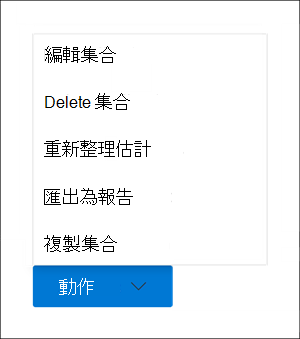

# 在 Advanced eDiscovery 中建立草稿集合Create a draft collection in Advanced eDiscovery

在您為此案例識別保管人和任何非保管人資料來源之後，您就可以識別並找到一組相關的檔。After you've identified custodians and any non-custodian data sources for the case, you're ready to identify and locate a set of documents that are relevant. 您可以使用 [集合] 工具來搜尋相關內容的資料來源來執行此動作。You do this by using the Collections tool to search data sources for relevant content. 若要執行此動作，您可以建立搜尋符合搜尋準則之內容的指定資料來源的集合。You do this by creating a collection that searches specified data sources for content that matches your search criteria. 您可以選擇建立 *草稿收藏*，它會找到專案的預估，也可以建立可自動將專案新增至審閱集合的集合。You have the option to create a *draft collection*, which is an estimate of the items are found or you can create a collection that automatically adds the items to a review set. 當您建立草稿集合時，您可以查看符合搜尋查詢之估計結果的相關資訊，例如找到的專案總數和大小、找到的不同資料來源，以及搜尋查詢的統計資料。When you create a draft collection, you can views information about the estimated results that matched the search query, such as the total number and size of items found, the different data sources where they were found, and statistics about the search query. 您也可以預覽集合所傳回的專案範例。You can also preview a sample of items that were returned by the collection. 您可以使用這些統計資料變更搜尋查詢，並重新執行草稿集合以縮小您的結果。Using these statistics, you can change the search query and rerun the draft collection to narrow your results. 當您對集合結果滿意後，您就可以將集合認可為審閱集。Once you're satisfied with the collection results, you can commit the collection to a review set. 當您認可草稿集合時，會將集合傳回的專案新增至審閱集，以供審閱、分析和匯出。When you commit a draft collection, the items returned by the collection are added to a review set for review, analysis, and export.

## 建立草稿集合之前Before you create a draft collection

- 在您建立草稿集合之前，將保管人和非 custodial 資料來源新增至案例。Add custodians and non-custodial data sources to the case before you create a draft collection. 這是必要的動作，以便您可以在建立草稿集合時選取資料來源。This is required so that you can select the data sources when you create a draft collection. 如需詳細資訊，請參閱：For more information, see:

  - [將監管人新增至案例Add custodians to a case](add-custodians-to-case.md)

  - [將非監管資料來源新增至案例Add non-custodial data sources to a case](non-custodial-data-sources.md)

- 您可以在可能與案例相關之內容的草稿集合中，搜尋 custodial 或非 custodial 位置以外的其他資料 (源，而不是在此案例中) 。You can search additional data sources (ones that haven't been added to the case as custodial or non-custodial locations) in a draft collection for content that may be relevant to the case. 這些資料來源可能包含信箱、SharePoint 網站和 Teams。These data sources might include mailboxes, SharePoint sites, and Teams. 如果這種情況適用于您的案例，請編譯這些資料來源的清單，以將其新增至集合。If this situation is applicable to your case, compile a list of these data sources so you can add them to the collection.

## 建立草稿集合Create a draft collection

1. 在 Microsoft 365 規範中心] 中，開啟 Advanced eDiscovery 案例，然後選取 [**集合**] 索引標籤。In the Microsoft 365 compliance center, open the Advanced eDiscovery case, and then select the **Collections** tab.

2. 在 [**集合**] 頁面上，選取 [**新增集合**  >  **標準集合**]。On the **Collections** page, select **New collection** > **Standard collection**.

3. 輸入集合 (必要) 和描述 (選擇性) 的名稱。Type a name (required) and description (optional) for the collection. 建立集合之後，就無法變更名稱，但可以修改描述。After the collection is created, you can't change the name, but you can modify the description.

4. 在 [ **Custodial 資料來源** ] 頁面上，執行下列其中一項操作，識別要從中收集內容的 Custodial 資料來源：On the **Custodial data sources** page, do one of the following things to identify the custodial data sources to collect content from:

   - 按一下 [ **選取保管人** ] 搜尋新增至案例的特定保管人。Click **Select custodians** to search specific custodians that were added to the case. 如果您使用此選項，則會顯示案例保管人清單。If you use this option, a list of the case custodians is displayed. 選取一個或多個保管人。Select one or more custodians. 選取並新增保管人後，您也可以選取特定的資料來源，以搜尋每個保管人。After you select and add the custodians, you can also select the specific data sources to search for each custodian. 在將保管人新增至案例時，會指定所顯示的這些資料來源。These data sources that are displayed were specified when the custodian was added to the case.

   - 按一下 [ **全選** ] [切換]，以搜尋新增至案例的所有保管人。Click the **Select all** toggle to search all custodians that were added to the case. 當您選取此選項時，會搜尋所有保管人的所有資料來源。When you select this option, all data sources for all custodians are searched.

5. 在 [ **非 custodial 資料來源** ] 頁面上，執行下列其中一項操作，以找出收集內容的非 custodial 資料來源：On the **Non-custodial data sources** page, do one of the following things to identify the non-custodial data sources to collect content from:

   - 按一下 [ **選取非 custodial 資料來源** ]，以選取新增至案例的特定非 custodial 資料來源。Click **Select non-custodial data sources** to select specific non-custodial data sources that were added to the case. 如果您使用此選項，則會顯示資料來源的清單。If you use this option, a list of data sources displayed. 選取一或多個資料來源。Select one or more of these data sources.

   - 按一下 [ **選取所有** 切換]，選取所有已新增至案例的非 custodial 資料來源。Click the **Select all** toggle to select all non-custodial data sources that were added to the case.

6. 在 [ **其他資料來源** ] 頁面上，您可以選取要在集合中搜尋的其他信箱和網站。On the **Additional data sources** page, you can select other mailboxes and sites to search as part of the collection. 在此情況下，不會將這些類型的資料來源新增為 custodial 或非 custodial 資料位置。These types of data sources weren't added as custodial or non-custodial data locations in the case. 在搜尋其他資料來源時，您也有兩個選項：You also have two options when searching additional data sources:

   - 若要搜尋特定服務的所有內容位置 (Exchange 信箱、SharePoint 和 OneDrive 網站，或 Exchange 公用資料夾) ，請按一下 [**狀態**] 欄中對應的 [**選取所有**] 切換。To search all content locations for a specific service (Exchange mailboxes, SharePoint and OneDrive sites, or Exchange public folders), click the corresponding **Select all** toggle in the **Status** column. 此選項會搜尋選取服務中的所有內容位置。This option will search all content locations in the selected service.

   - 若要搜尋服務的特定內容位置，請在 [**狀態**] 欄中按一下對應的 [**選取所有**] 切換，然後按一下 [**使用者]、[群組或小組**] 中 (Exchange 信箱) 或選擇 (SharePoint 的 **網站**，然後 OneDrive 網站) 搜尋特定的內容位置。To search specific content location for a service, click the corresponding **Select all** toggle in the **Status** column, and then click **Users, groups or teams** (for Exchange mailboxes) or **Choose sites** for (SharePoint and OneDrive sites) to search specific content locations.

7. 在 [ **條件** ] 頁面上，您可以建立搜尋查詢，用來收集先前的嚮導頁面中所識別的資料來源中的專案。On the **Conditions** page, you can create the search query that is used to collect items from the data sources that you've identified in the previous wizard pages. 您可以搜尋關鍵字、屬性：值配對或使用關鍵字清單。You can search for keywords, property:value pairs, or use a keyword list. 您也可以新增各種搜尋條件，以縮小集合的範圍。You can also add various search conditions to narrow the scope of the collection. 如需詳細資訊，請參閱 [建立集合的搜尋查詢](building-search-queries.md)。For more information, see [Build search queries for collections](building-search-queries.md).

8. 在 [ **另存新檔] 或 [新增至審閱集** ] 頁面上，選取 [ **儲存集合為草稿**]。On the **Save as draft or add to review set** page, select **Save collection as draft**.

   > [!NOTE]
   > 此頁面上的其他選項可讓您收集項目，並將專案直接新增至審閱集。The other option on this page lets you collect items and add them direct to a review set. 這個選項會跳過該程式，並自動將集合新增至審閱集，而不是建立可以查看統計資料，並預覽集合結果範例的草稿收集。Instead of creating a draft collection that you can review statistics for and preview a sample of the collection results, this option skips that process and automatically adds the collection to a review set. 如果您選取第二個選項來將集合新增至審閱集，您可以設定其他設定，例如收集 Microsoft Teams 中的整個聊天討論執行緒，Yammer 並收集雲端附件 (也稱為 *新式附件*) 。If you select the second option to add the collection to a review set, you have additional settings to configure, such as collecting entire chat conversation threads in Microsoft Teams and Yammer and collecting cloud attachments (also called *modern attachments*). 如需這些設定的詳細資訊，請參閱將 [草稿集合認可至審閱集](commit-draft-collection.md)。For more information about these settings, see [Commit a draft collection to a review set](commit-draft-collection.md).

9. 在 [ **檢查您的集合** ] 頁面上，您可以複查和更新您在先前頁面上設定的集合設定。On the **Review your collection** page, you can review and update the collection settings that you configured on the previous pages.

   - **摘要** 索引標籤：檢查及修改集合的名稱和描述、集合搜尋準則、其他資料位置及集合類型。**Summary** tab:  Review and modify the name and description of the collection, the collection search criteria, additional data locations, and the collection type.

   - [**來源**] 索引標籤：複查及修改集合的 custodial 和非 custodial 資料來源。**Sources** tab: Review and modify the custodial and non-custodial data sources for the collection.

10. 按一下 [ **提交** ] 以建立草稿收集。Click **Submit** to create the draft collection. 隨即會顯示一個頁面，確認已建立集合。A page is displayed confirming that the collection was created.

## 建立草稿集合後會發生什麼情況What happens after you create a draft collection

在您建立草稿集合之後，它會列在案例中的 [ **集合** ] 頁面上，而且狀態會顯示正在進行中。After you create a draft collection, it listed on the **Collections** page in the case and the status shows that it's in progress. 在案例中，也會建立名為「 **準備搜尋預覽」和「估計** 」的工作，並顯示在 **工作** 頁面上。A job named **Preparing search preview and estimates** is also created and displayed on the **Jobs** page in the case.

在草稿收集過程中，Advanced eDiscovery 會使用您在集合中指定的搜尋準則及資料來源來執行搜尋評估。During the draft collection process, Advanced eDiscovery performs a search estimate using the search criteria and data sources that you specified in the collection. Advanced eDiscovery 也會準備您可以預覽之專案的樣例。Advanced eDiscovery also prepares a sampling of items that you can preview. 當集合完成時，會更新 **集合** 頁面上的下列欄和對應值：When the collection is complete, the following columns and corresponding values on the **Collection** page are updated:

- **狀態**：指出集合的狀態和類型。**Status**: Indicates the status and type of collection. **預估** 的值表示草稿收集已完成。A value of **Estimated** indicates that a draft collection is complete. 這個相同的值也表示集合是草稿集合，而且尚未新增至審閱集。This same value also indicates that the collection is a draft collection, and that it hasn't been added to a review set. [**狀態**] 欄中的 [**認可** 值] 表示集合已新增至審閱集。A value of **Committed** in the **Status** column indicates that the collection has been added to a review set.

- **評估狀態**：指出預估搜尋結果的狀態，以及搜尋預估和統計資料是否可供審閱。**Estimate status**: Indicates the status of the estimated search results and whether or not the search estimates and statistics are ready for review. 值為 [ **成功** ] 表示草稿收集的結果可供審閱。A value of **Successful** indicates the results of the draft collection are ready for review. 在您第一次提交草稿收集後，會顯示一個 **進行中** 的值，表示該集合仍在執行中After you first submit a draft collection, a value of **In progress** is displayed to indicate the collection is still running

- **預覽狀態**：指出您可以預覽之範例專案的狀態。**Preview status**: Indicates the status of the sample items that you can preview. [ **成功** ] 值表示專案已準備好供預覽。A value of **Successful** indicates the items are ready for preview. 在您第一次提交草稿集合之後，會顯示 [ **進行中** 的值]，以指出集合仍在執行中。After you first submit a draft collection, a value of **In progress** is displayed to indicate that the collection is still running.

## 完成草擬收集之後的後續步驟Next steps after a draft collection is complete

順利完成草稿收集後，您可以執行各種工作。After the draft collection is successfully completed, you can perform various tasks. 若要執行大部分的工作，請移至 [ **集合** ] 索引標籤，然後按一下草稿集合的名稱，以顯示飛出的頁面。To perform most of these tasks, just go the **Collections** tab and click the name of the draft collection to display the flyout page.

以下是您可以從 [集合飛出] 頁面進行的動作清單：Here's a list of things you can do from the collection flyout page:

- 選取 [ **摘要** ] 索引標籤，以查看集合所傳回的集合摘要資訊及估計的搜尋結果。Select the **Summary** tab to view summary information about the collection and the estimated search results returned by the collection. 這包括專案總數和預計搜尋結果的大小、包含搜尋結果的信箱和網站的數目，以及在) 用來限定集合範圍時所 (的搜尋條件。This includes that total number of items and size of the estimated search results, the number of mailboxes and sites contained search results, and the search conditions (if used) used to scope the collection.

- 選取 [ **資料來源** ] 索引標籤，以查看集合中所搜尋的保管人和非 custodial 資料) 源清單。Select the **Data sources** tab to view a list of custodians and non-custodial data sources) that were searched in the collection. 在 [**摘要**] 索引標籤的 [**位置**] 底下會列出搜尋的任何其他內容位置。Any additional content locations that were search are listed under **Locations** on the **Summary** tab.

- 選取 [ **搜尋統計資料] 索引** 標籤，以查看有關集合的統計資料。Select the **Search statistics** tab to view statistics about the collection. 這包括在每個服務 (中的專案總數和大小，例如 Exchange 信箱或 SharePoint 網站) 及一個條件報告，顯示集合所使用之搜尋查詢的不同元件所傳回之專案的統計資料。This includes the total number and size of items found in each service (for example, Exchange mailboxes or SharePoint sites) and a condition report that displays statistics about the number of items returned by different components of the search query used by the collection. 如需詳細資訊，請參閱 [集合統計資料與報告](collection-statistics-reports.md)。For more information, see [Collection statistics and reports](collection-statistics-reports.md).

- 按一下位於彈出頁面底部的 [ **回顧範例** (]) 以預覽集合傳回之專案的範例。Click **Review sample** (located at the bottom of the flyout page) to preview a sample of the items returned by the collection.

- 透過按一下 [**動作**] [  >  **編輯集合**) ]，將草稿集合認可為 (的審閱集。Commit the draft collection to a review set (by clicking **Actions** > **Edit collection**). 這表示您使用目前的設定) 重新執行集合 (，並將集合所傳回的專案新增至審閱集。This means that you rerun the collection (using the current settings) and add the items returned by the collection to a review set. 如先前所述，您也可以設定其他設定 (例如，當您將集合新增至審閱集時) 交談執行緒及雲端型附件。As previously explained, you can also configure additional settings (such as conversation threading and cloud-based attachments) when you add the collection to a review set. 如需詳細資訊與逐步指示，請參閱 [認可 a 草稿集合至審閱集](commit-draft-collection.md)。For more information and step-by-step instructions, see [Commit a draft collection to a review set](commit-draft-collection.md).

## 管理草稿集合Manage a draft collection

您可以使用草擬集合之飛入頁面上的 [ **動作** ] 功能表中的選項來執行各種管理工作。You can use the options in the **Actions** menu on the flyout page of a draft collection to perform various management tasks.

以下是管理選項的說明。Here's are descriptions of the management options.

- **編輯集合**：變更草稿集合的設定。**Edit collection**: Change the settings of the draft collection. 變更之後，您可以重新執行集合，並更新搜尋預估和統計資料。After you make changes, you can rerun the collection and update the search estimates and statistics. 如先前所述，您可以使用此選項，將草稿集合認可為審閱集。As previously explained, you use this option to commit a draft collection to a review set.  

- **刪除集合**：刪除草稿集合。**Delete collection**: Delete a draft collection. 請注意，在將草稿收集提交至審閱集後，便無法將其刪除。Note that after a draft collection is committed to a review set, it can't be deleted.

- 重新整理 **估計**：針對) 草稿集合中指定的資料來源，重新執行查詢 (，以更新搜尋預估和統計資料。**Refresh estimates**: Rerun the query (against the data sources) specified in the draft collection to update the search estimates and statistics.

- **匯出為報告**：將有關草稿集合的資訊匯出至 CSV 檔案，您可以將該檔案下載到您的本機電腦。**Export as report**: Exports information about the draft collection to a CSV file that you can download to your local computer. [匯出報告] 包含下列資訊：The export report contains the following information:

  - 每個內容位置的身分識別，包含符合草稿集合中搜尋查詢的專案。The identity of each content location that contains items that match the search query in the draft collection. 這些位置通常是信箱或網站。These locations are typically mailboxes or sites.
  
  - 每個內容位置中的專案總數。The total number of items in each content location.
  
  - 每個內容位置之專案的總大小 (（以位元組為單位）) 。The total size (in bytes) of the items in each content location.

  - 服務 (例如內容位置所在 Exchange 或 SharePoint) 。The service (such as Exchange or SharePoint) in which the content location is located.

- **複製集合**：從現有集合中複製設定，以建立新的草稿收集。**Copy collection**: Create a new draft collection by copying the settings from an existing collection. 您必須對新的集合使用不同的名稱。You have to use a different name for the new collection. 您也可以選擇在提交新的集合之前修改設定。You also have the option to modify the settings before you submit the new collection. 提交後，會執行搜尋查詢，並產生新的預估和統計資料。After you submit it, the search query is run and new estimates and statistics are generated. 您可以快速建立其他草稿集合，然後視需要修改選取的設定，同時仍保留原創組合中的資訊。The is a good way to quickly create additional draft collection and then modify selected settings as necessary while still preserving information in the original collection. 這也可讓您輕鬆比較兩個類似集合的結果。This also lets you easily compare the results of two similar collections.

> [!NOTE]
> 將草稿收集提交至審閱集合之後，您只能複製該集合並匯出報表。After a draft collection is committed to a review set, you can only copy the collection and export a report.
