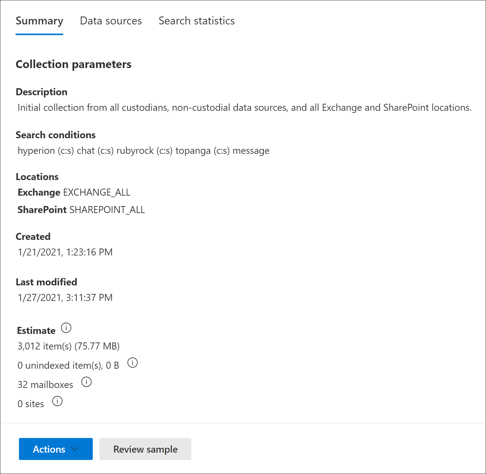

# 在高級電子檔探索中建立草稿收集

在您為此案例識別保管人和任何非保管人資料來源之後，您就可以識別並找到一組相關的檔。 您可以使用 [集合] 工具來搜尋相關內容的資料來源來執行此動作。 若要執行此動作，您可以建立搜尋符合搜尋準則之內容的指定資料來源的集合。 您可以選擇建立 *草稿收藏*，它會找到專案的預估，也可以建立可自動將專案新增至審閱集合的集合。 當您建立草稿集合時，您可以查看符合搜尋查詢之估計結果的相關資訊，例如找到的專案總數和大小、找到的不同資料來源，以及搜尋查詢的統計資料。 您也可以預覽集合所傳回的專案範例。 您可以使用這些統計資料變更搜尋查詢，並重新執行草稿集合以縮小您的結果。 當您對集合結果滿意後，您就可以將集合認可為審閱集。 當您認可草稿集合時，會將集合傳回的專案新增至審閱集，以供審閱、分析和匯出。

## 建立草稿集合之前

- 在您建立草稿集合之前，將保管人和非 custodial 資料來源新增至案例。 這是必要的動作，以便您可以在建立草稿集合時選取資料來源。 如需詳細資訊，請參閱：

  - [將監管人新增至案例](add-custodians-to-case.md)

  - [將非監管資料來源新增至案例](non-custodial-data-sources.md)

- 您可以在可能與案例相關之內容的草稿集合中，搜尋 custodial 或非 custodial 位置以外的其他資料 (源，而不是在此案例中) 。 這些資料來源可能包含信箱、SharePoint 網站和團隊。 如果這種情況適用于您的案例，請編譯這些資料來源的清單，以將其新增至集合。

## 建立草稿集合

1. 在 Microsoft 365 規範中心，開啟 [高級 eDiscovery] 案例，然後選取 [ **集合** ] 索引標籤。

2. 在 [**集合**] 頁面上，選取 [**新增集合**  >  **標準集合**]。

3. 輸入集合 (必要) 和描述 (選擇性) 的名稱。 建立集合之後，就無法變更名稱，但可以修改描述。

4. 在 [ **Custodial 資料來源** ] 頁面上，執行下列其中一項操作，識別要從中收集內容的 Custodial 資料來源：

   - 按一下 [ **選取保管人** ] 搜尋新增至案例的特定保管人。 如果您使用此選項，則會顯示案例保管人清單。 選取一個或多個保管人。 選取並新增保管人後，您也可以選取特定的資料來源，以搜尋每個保管人。 在將保管人新增至案例時，會指定所顯示的這些資料來源。

   - 按一下 [ **全選** ] [切換]，以搜尋新增至案例的所有保管人。 當您選取此選項時，會搜尋所有保管人的所有資料來源。

5. 在 [ **非 custodial 資料來源** ] 頁面上，執行下列其中一項操作，以找出收集內容的非 custodial 資料來源：

   - 按一下 [ **選取非 custodial 資料來源** ]，以選取新增至案例的特定非 custodial 資料來源。 如果您使用此選項，則會顯示資料來源的清單。 選取一或多個資料來源。

   - 按一下 [ **選取所有** 切換]，選取所有已新增至案例的非 custodial 資料來源。

6. 在 [ **其他資料來源** ] 頁面上，您可以選取要在集合中搜尋的其他信箱和網站。 在此情況下，不會將這些類型的資料來源新增為 custodial 或非 custodial 資料位置。 在搜尋其他資料來源時，您也有兩個選項：

   - 若要搜尋特定服務的所有內容位置 (Exchange 信箱、SharePoint 和 OneDrive 網站或 Exchange 公用資料夾) ，請按一下 [**狀態**] 欄中對應的 [**選取所有**] 切換。 此選項會搜尋選取服務中的所有內容位置。

   - 若要搜尋服務的特定內容位置，請在 [**狀態**] 欄中按一下對應的 [**選取所有**] 切換，然後按一下 [**使用者]、[群組或小組**] 中的 [Exchange 信箱 (]) 或 **選擇 [** (SharePoint 的網站]，然後 OneDrive 網站) 搜尋特定的內容位置。

7. 在 [ **條件** ] 頁面上，您可以建立搜尋查詢，用來收集先前的嚮導頁面中所識別的資料來源中的專案。 您可以搜尋關鍵字、屬性：值配對或使用關鍵字清單。 您也可以新增各種搜尋條件，以縮小集合的範圍。 如需詳細資訊，請參閱 [建立集合的搜尋查詢](building-search-queries.md)。

8. 在 [ **另存新檔] 或 [新增至審閱集** ] 頁面上，選取 [ **儲存集合為草稿**]。

   > [!NOTE]
   > 此頁面上的其他選項可讓您收集項目，並將專案直接新增至審閱集。 這個選項會跳過該程式，並自動將集合新增至審閱集，而不是建立可以查看統計資料，並預覽集合結果範例的草稿收集。 如果您選取第二個選項來將集合新增至審閱集，您可以設定其他設定，例如收集 Microsoft 小組和 Yammer 中的整個聊天討論執行緒，以及收集雲端附件 (也稱為 *新式附件*) 。 如需這些設定的詳細資訊，請參閱將 [草稿集合認可至審閱集](commit-draft-collection.md)。

9. 在 [ **檢查您的集合** ] 頁面上，您可以複查和更新您在先前頁面上設定的集合設定。

   - **摘要** 索引標籤：檢查及修改集合的名稱和描述、集合搜尋準則、其他資料位置及集合類型。

   - [**來源**] 索引標籤：複查及修改集合的 custodial 和非 custodial 資料來源。

10. 按一下 [ **提交** ] 以建立草稿收集。 隨即會顯示一個頁面，確認已建立集合。

## 建立草稿集合後會發生什麼情況

在您建立草稿集合之後，它會列在案例中的 [ **集合** ] 頁面上，而且狀態會顯示正在進行中。 在案例中，也會建立名為「 **準備搜尋預覽」和「估計** 」的工作，並顯示在 **工作** 頁面上。

在草稿收集過程中，高級 eDiscovery 會使用您在集合中指定的搜尋準則和資料來源來執行搜尋預估。 Advanced eDiscovery 也會準備您可以預覽的專案的樣例。 當集合完成時，會更新 **集合** 頁面上的下列欄和對應值：

- **狀態**：指出集合的狀態和類型。 **預估** 的值表示草稿收集已完成。 這個相同的值也表示集合是草稿集合，而且尚未新增至審閱集。 [**狀態**] 欄中的 [**認可** 值] 表示集合已新增至審閱集。

- **評估狀態**：指出預估搜尋結果的狀態，以及搜尋預估和統計資料是否可供審閱。 值為 [ **成功** ] 表示草稿收集的結果可供審閱。 在您第一次提交草稿收集後，會顯示一個 **進行中** 的值，表示該集合仍在執行中

- **預覽狀態**：指出您可以預覽之範例專案的狀態。 [ **成功** ] 值表示專案已準備好供預覽。 在您第一次提交草稿集合之後，會顯示 [ **進行中** 的值]，以指出集合仍在執行中。

## 完成草擬收集之後的後續步驟

順利完成草稿收集後，您可以執行各種工作。 若要執行大部分的工作，請移至 [ **集合** ] 索引標籤，然後按一下草稿集合的名稱，以顯示飛出的頁面。

以下是您可以從 [集合飛出] 頁面進行的動作清單：

- 選取 [ **摘要** ] 索引標籤，以查看集合所傳回的集合摘要資訊及估計的搜尋結果。 這包括專案總數和預計搜尋結果的大小、包含搜尋結果的信箱和網站的數目，以及在) 用來限定集合範圍時所 (的搜尋條件。

- 選取 [ **資料來源** ] 索引標籤，以查看集合中所搜尋的保管人和非 custodial 資料) 源清單。 在 [**摘要**] 索引標籤的 [**位置**] 底下會列出搜尋的任何其他內容位置。

- 選取 [ **搜尋統計資料] 索引** 標籤，以查看有關集合的統計資料。 這包括每個服務 (中的專案總數和大小，例如，Exchange 信箱或 SharePoint 網站) 和條件報告，顯示集合使用之搜尋查詢的不同元件所傳回之專案的統計資料。 如需詳細資訊，請參閱 [集合統計資料與報告](collection-statistics-reports.md)。

- 按一下位於彈出頁面底部的 [ **回顧範例** (]) 以預覽集合傳回之專案的範例。

- 透過按一下 [**動作**] [  >  **編輯集合**) ]，將草稿集合認可為 (的審閱集。 這表示您使用目前的設定) 重新執行集合 (，並將集合所傳回的專案新增至審閱集。 如先前所述，您也可以設定其他設定 (例如，當您將集合新增至審閱集時) 交談執行緒及雲端型附件。 如需詳細資訊與逐步指示，請參閱 [認可 a 草稿集合至審閱集](commit-draft-collection.md)。

## 管理草稿集合

您可以使用草擬集合之飛入頁面上的 [ **動作** ] 功能表中的選項來執行各種管理工作。

以下是管理選項的說明。

- **編輯集合**：變更草稿集合的設定。 變更之後，您可以重新執行集合，並更新搜尋預估和統計資料。 如先前所述，您可以使用此選項，將草稿集合認可為審閱集。  

- **刪除集合**：刪除草稿集合。 請注意，在將草稿收集提交至審閱集後，便無法將其刪除。

- 重新整理 **估計**：針對) 草稿集合中指定的資料來源，重新執行查詢 (，以更新搜尋預估和統計資料。

- **匯出為報告**：將有關草稿集合的資訊匯出至 CSV 檔案，您可以將該檔案下載到您的本機電腦。 [匯出報告] 包含下列資訊：

  - 每個內容位置的身分識別，包含符合草稿集合中搜尋查詢的專案。 這些位置通常是信箱或網站。
  
  - 每個內容位置中的專案總數。
  
  - 每個內容位置之專案的總大小 (（以位元組為單位）) 。

  - 服務 (，例如內容位置所在的 Exchange 或 SharePoint) 。

- **複製集合**：從現有集合中複製設定，以建立新的草稿收集。 您必須對新的集合使用不同的名稱。 您也可以選擇在提交新的集合之前修改設定。 提交後，會執行搜尋查詢，並產生新的預估和統計資料。 您可以快速建立其他草稿集合，然後視需要修改選取的設定，同時仍保留原創組合中的資訊。 這也可讓您輕鬆比較兩個類似集合的結果。

> [!NOTE]
> 將草稿收集提交至審閱集合之後，您只能複製該集合並匯出報表。
