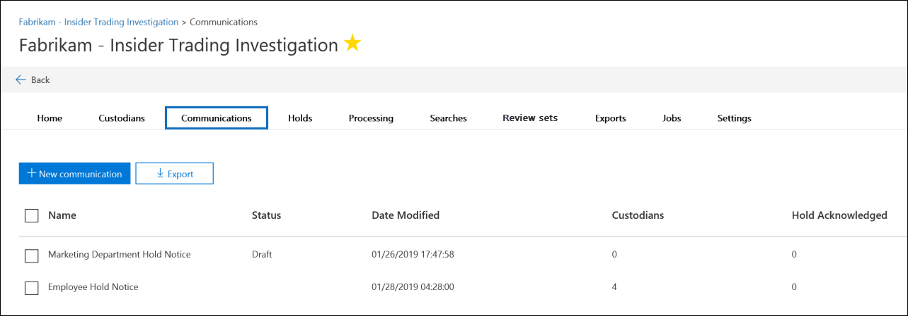
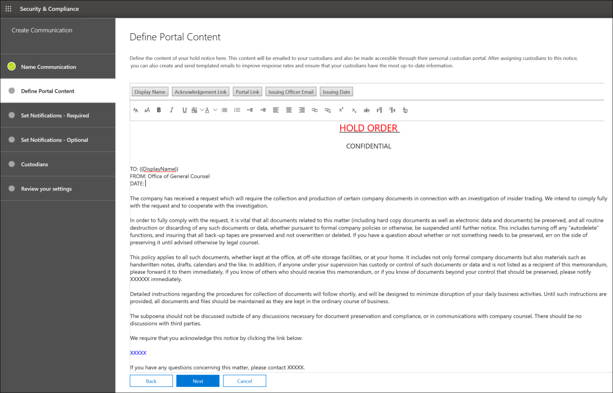
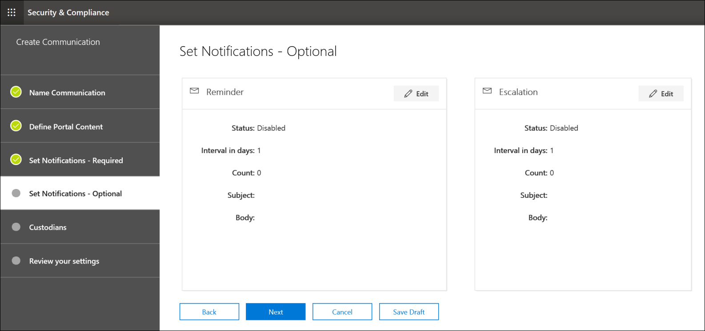

# 建立法律封存通知

組織使用 Advanced eDiscovery 管理員通訊，可管理與保管人進行通訊的工作流程。 透過通訊工具，法律小組可以系統地傳送、收集和追蹤法律封存通知。 靈活的建立程式也可讓小組自訂保留通知工作流程，以及傳送給保管人之通知中的內容。

本文概述保留通知工作流程中的步驟。

## 步驟1：指定通訊詳細資料

第一步是指定適當的法律保留通知或其他保管人通訊的詳細資料。

1. 在 [安全性 & 規範中心] 中，移至 [ **eDiscovery > Advanced eDiscovery** ] 以顯示您組織中的案例清單。

2. 選取案例，按一下 [ **通訊** ] 索引標籤，然後按一下 [ **新增通訊**]。

3. 在 [ **名稱通訊** ] 頁面上，指定下列 () 通訊詳細資料所需的。

    - **名稱**：這是通訊的名稱。

    - **簽發官**：下拉式清單會顯示案例成員清單清單。 如需如何新增成員至案例的詳細資訊，請參閱[建立 Advanced eDiscovery 案例](create-and-manage-advanced-ediscoveryv2-case.md#create-a-case)。 傳送給保管人的每個通知都會代表指定的發行專員傳送。

> [!NOTE]
> 簽發專員必須在寄件者員的下拉式清單中顯示 **主動信箱**

4. 按 [下一步 **]**。

## 步驟2：定義入口網站內容

接下來，您可以建立及新增保留通知的內容。 在 [**建立通訊** 嚮導] 中的 [**定義入口網站內容**] 頁面上，指定保留通知的內容。 此內容將會自動附加至發佈、重新發佈、提醒及上報通知。 此外，此內容也會出現在保管人的規範入口網站中。 

若要建立入口網站內容：

1. 在入口網站內容的 textbox 中，輸入另一個檔) 您的保留通知 (或剪切和貼上。 

2. 將合併變數插入您的通知，以自訂通知及共用保管人規範入口網站。

3. 按 [下一步 **]**。

  >[!Tip]
  >若要深入瞭解如何自訂入口網站內容和格式，請參閱 [使用通訊編輯器](using-communications-editor.md)。

## 步驟3：設定必要的通知

在您定義保留通知的內容之後，您可以設定工作流程以傳送和管理通知程式。 通知是傳送給通知和追蹤保管人的電子郵件訊息。 每個加入通訊的保管人都會收到相同的通知。 

若要設定及傳送保留通知，您必須包含發佈、重新發放和發行通知。

### 發行通知 

在建立通訊之後，會由指定的發行人員發起 **發佈通知** 。 發行通知是指傳送給管理員的第一筆通訊，告知他們有關其保留義務。 

若要建立發佈通知：

1. 在 [ **發行** ] 磚中，按一下 [ **編輯**]。

2. 如有需要，將其他案例成員或人員新增 **至 [副本** ] 和 [ **密件副本** ] 欄位。 若要將多個使用者新增至這些欄位，請使用分號分隔電子郵件地址。

3. 指定 (必要) 的「主旨」 **主題** 。

4. 指定您想要提供給保管人 (必要) 的內容或其他指示。 您在步驟2中定義的入口網站內容會新增至發佈通知的結尾。 

5. 按一下 **[儲存]**。

### Re-Issuance 通知

隨著案例的進展，您可能需要保管人保留其他或較少的資料，而不是先前所指示的資料。 在您更新入口網站內容之後，會傳送重新發佈通知，並提醒保管人有關其保留義務所做的任何變更。

若要建立重新發佈通知：

1. 在 [重新 **發起** ] 方塊中，按一下 [ **編輯**]。

2. 如有需要，將其他案例成員或人員新增 **至 [副本** ] 和 [ **密件副本** ] 欄位。 若要將多個使用者新增至這些欄位，請使用分號分隔電子郵件地址。

3. 指定 (必要) 的「主旨」 **主題** 。

4. 指定您想要提供給保管人 (必要) 的內容或其他指示。 您在步驟2中定義的入口網站內容會新增至重新發佈通知的結尾。

5. 按一下 **[儲存]**。

> [!NOTE]
> 如果已修改入口網站內容 (在 [**編輯通訊** 嚮導] 中的 [**定義入口網站內容**] 頁面上) ，重新發佈通知將會自動傳送給所有指派給通知的保管人。 通知傳送後，系統會要求保管人重新確認其保留通知。 如果您已設定任何提醒或上報工作流程，也會重新開機這些工作流程。 如需其他案例管理事件觸發通訊的詳細資訊，請參閱 [觸發通知的事件](#events-that-trigger-notifications)。

### 發行通知

解決問題之後，或是管理員不再受制于保留內容時，您可以從案例中釋放保管人。 如果系統管理員先前曾發出保留通知，可使用發行通知，警示保管人已從其義務中發行。

若要建立發行通知： 

1. 在 [ **發行** 磚] 中，按一下 [ **編輯**]。

2. 如有需要，將其他案例成員或人員新增 **至 [副本** ] 和 [ **密件副本** ] 欄位。 若要將多個使用者新增至這些欄位，請使用分號分隔電子郵件地址。

3. 指定 (必要) 的「主旨」 **主題** 。

4. 指定您想要提供給保管人 (必要) 的內容或其他指示。

5. 按一下 [ **儲存** ]，然後移至下一個步驟。

##  (選用) 步驟4：設定選用的通知

或者，您可以建立及排程自動提醒和上報通知，以簡化追蹤未回應的保管人的工作流程。

### 提醒

在您傳送保留通知之後，您可以透過定義提醒工作流程，追蹤未回應的保管人。

若要排程提醒：

1. 在 [ **提醒** ] 磚中，按一下 [ **編輯**]。

2. 開啟必要的 **狀態** 切換 () ，啟用 **提醒** 工作流程。

3. 指定 **提醒間隔 (天數)** (所需) 。 這是傳送第一個和追蹤提醒通知前所要等待的天數。 例如，如果您將提醒間隔設定為7天，則第一個提醒會在初次發出保留通知之後7天內傳送。 所有後續的提醒也會每7天傳送一次。

4. 指定 (必要) 的 **提醒數目** 。 此欄位會指定要傳送給無回應保管人的提醒數目。 例如，如果您將提醒數目設定為3，則系統管理員最多可接收三個提醒。 在保管人承認保留通知之後，就不會再將提醒傳送給該使用者。

5. 指定 (必要) 的「主旨」 **主題** 。 

6. 指定您想要提供給保管人 (必要) 的內容或其他指示。 您在步驟2中定義的入口網站內容會新增至提醒通知的結尾。

7. 按一下 [ **儲存** ]，然後繼續進行下一個步驟。

### 升級

在某些情況下，您可能需要更多的方式來追蹤不回應的保管人。 如果管理員在接收到指定的提醒數目後，未認可保留通知，則法律小組可以指定工作流程，以自動將呈報通知傳送給保管人及其主管。

若要排程上報：

1. 在 [ **呈報** 圖塊] 中，按一下 [ **編輯**]。

2. 開啟 **狀態** 切換以啟用 **呈報** 工作流程。

3. 指定 **(天數)** (所需) 的呈報間隔。

4. 指定) 所需 (**升級的數目** 。 此欄位會指定要傳送給無回應的保管人的升級數目。 例如，如果您將呈報數量設定為3，則呈報通知會傳送給保管人和其主管，最多可傳送三次。 在保管人承認保留通知之後，就不會再傳送上報。

5. 指定 (必要) 的「主旨」 **主題** 。 

6. 指定您想要提供給保管人 (必要) 的內容或其他指示。 您在步驟2中定義的入口網站內容會新增至呈報通知的結尾。

7. 按一下 [ **儲存** ]，然後繼續進行下一個步驟。

## 步驟5：指派保管人以接收通知

完成通知的內容之後，請選取您要傳送通知的保管人。 

若要新增保管人：

1. 按一下其名稱旁邊的核取方塊，將保管人指派給該通訊。

    在建立通訊之後，通知工作流程會自動套用至選取的保管人。

2. 按 **[下一步]** 以查看通訊設定及詳細資料。

>[!NOTE]
>您只能新增已新增至案例的保管人，但在案例中也沒有傳送其他通知。

## 步驟6：複查設定

在您複查設定並按一下 [ **傳送** ] 以完成通訊時，系統會傳送發佈通知，以自動啟動通訊工作流程。

## 觸發通知的事件

下表說明案例管理程式中的事件，此程式會在將不同類型的通知傳送給保管人時觸發。

|通訊類型|觸發程序 |
|:---------|:---------|
|發行通知|最初建立通知。 您也可以手動重新傳送保留通知。 |
|重新發佈通知|在 [**編輯通訊** 嚮導] 中的 [**定義入口網站內容**] 頁面上更新入口網站內容。|
|發行通知|管理員會從案例發行。|
|提醒|為提醒所設定的時間間隔和提醒數目。|
|升級|針對呈報所設定之提醒的間隔和數目。|
|||
