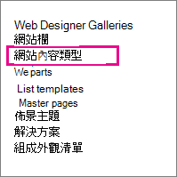

# 建立及套用資訊管理原則

資訊管理原則可讓您的組織控制保留內容的時間長短、審核人員對內容所做的動作，以及將條碼或標籤新增至檔。 原則可協助強制遵從法律和政府法規或內部的商務程式。 您可以以系統管理員的身分設定原則，以控制追蹤檔的方式，以及保留檔的時間長度。

您可以建立資訊管理原則，可在網站階層中的三個不同位置，從最廣泛到最窄的位置：

- 建立原則，以用於網站集合中的多個內容類型。
- 建立網站內容類型的原則。
- 建立清單或文件庫的原則。

如需詳細資訊，請參閱 [資訊管理原則簡介](intro-to-info-mgmt-policies.md)。

## 在網站集合內為多個內容類型建立原則

為了確保將資訊原則套用至網站集合中的特定類型的所有檔，請考慮在網站集合層級建立原則，然後再將原則套用至內容類型。 這些稱為網站集合原則。

1. 在 [網站集合] 首頁上 \> **設定** ![ 標題列上 SharePoint 2016 設定] 按鈕。](../media/1c22d2d8-39e0-4930-82c6-c3eee44211d3.png) \> [網站設定]。

    在 SharePoint 群組連線的網站中，按一下 [**設定**]，按一下 [**網站內容**]，然後按一下 [**網站設定**]。

2. 在 [網站設定] 頁面的 [**網站集合管理** \> **內容類型原則範本**] 底下。

   

3. 在 [原則] 頁面上 \> **建立**。

4. 輸入原則的名稱和描述，然後撰寫簡短的原則聲明，以向使用者說明原則的用途。

5. 若要瞭解如何設定要與原則建立關聯的功能，請參閱下一節建立網站內容類型的原則。

6. 選擇 [確定]。

## 建立網站內容類型的原則

新增資訊管理原則至內容類型，可讓原則功能與多個清單或文件庫輕鬆建立關聯。 您可以選擇新增現有的資訊管理原則至內容類型，或建立個別內容類型特有的唯一原則。

 您也可以新增資訊管理原則至清單特有的內容類型。 這只會對使用內容類型的清單中的專案套用原則。

1. 在 [網站集合] 首頁上 \> **設定** ![ 標題列上 SharePoint 2016 設定] 按鈕。](../media/1c22d2d8-39e0-4930-82c6-c3eee44211d3.png) \> [網站設定]。

    在 SharePoint 群組連線的網站中，按一下 [**設定**]，按一下 [**網站內容**]，然後按一下 [**網站設定**]。

2. 在 [網站設定] 頁面的 [ **Web 設計工具庫** \> **網站內容類型**] 底下。

   

3. 在 [網站內容類型] 設定] 頁面上，選取您要新增原則的內容類型。

4. 在 [網站內容類型] 頁面的 [**設定** \> **資訊管理原則設定**] 底下。

5. 在 [編輯原則] 頁面上，輸入原則的名稱和描述，然後撰寫簡短描述，以向使用者說明原則的用途。

6. 在下一節中，選取您要新增至資訊管理原則的個別原則功能。

   

7. 若要指定受此原則制約之檔及專案的保留期間，請選擇 [ **啟用保留**]，然後指定要在專案到期時執行的保留期間和動作。

   若要指定保留期間：

   1. 選擇 [ **新增記錄的保留階段**]。

   2. 選取 [保留期間] 選項，以指定檔或專案設為 [到期] 的時間。 執行下列其中一個步驟：
      - 若要設定以日期屬性為基礎的到期日，在 [ **事件** \> **此階段是以專案的日期] 屬性為基礎**，然後選取 [檔或專案] 動作 (例如，建立或修改) 以及此動作之後的時間增量 (例如，當您想要專案到期時，) 的天數、月數或年數。
      - 若要使用自訂保留公式來判斷到期，請選擇 [ **由此伺服器上安裝的自訂保留公式來設定**]。

        > [!NOTE]
        > 只有當您的系統管理員已設定自訂公式時，才可使用此選項。

   3. 只有在您為已有工作流程相關聯的清單、文件庫或內容類型定義原則時，才可以使用 [ **開始工作流程** ] 選項。 然後，您就可以選擇要選擇的工作流程。

   4. 在 [ **迴圈** ] 區段中，選取 [ **重複此階段的動作 ...** ]。，然後輸入您想要動作執行的頻率。

      > [!NOTE]
      >  只有當您選取的動作可重複時，才可使用此選項。 例如，您無法為 **永久刪除** 動作設定迴圈。

   5. 選擇 **[確定]**。

8. 若要對受此原則制約的檔和專案啟用審核，請選擇 [ **啟用審核**]，然後指定您要審核的事件。

   啟用審核：

   1. 在 [ **審核** ] 下的 [編輯原則] 頁面上，選取 [ **啟用審核**]，然後選取您要保留審計追蹤之事件旁的核取方塊。

   2. 若要提示使用者在檔中插入這些條碼，請選擇 [ **在儲存或列印前插入條碼**]。

   3. 選擇 **[確定]** ，將審核功能套用至原則。

   「審核原則」功能可讓組織建立及分析檔的審計追蹤，以及列出專案（例如工作清單、問題清單、討論群組和行事曆）。 這個原則功能提供一個審核記錄檔，可記錄事件，例如，查看、編輯或刪除內容。

   在資訊管理原則中啟用審核時，系統管理員可以在 Microsoft Excel 的原則使用報告中查看審核資料，並匯總目前的使用量。 系統管理員可以使用這些報告來決定組織中資訊的使用方式。 這些報告也可協助組織驗證及記錄其法規遵從性，或調查可能的關注事項。

   審核記錄會記錄下列資訊：事件名稱、事件的日期和時間，以及執行動作之使用者的系統名稱。

9. 在原則中啟用條碼時，會將其新增至檔案屬性，並顯示在套用條碼的檔標頭區域中。 如同標籤，也可以手動移除檔中的條碼。 您可以指定在列印或儲存專案時，是否應提示使用者加入條碼，或者是否應使用 2010 Office 版本程式中的 [**插入**] 索引標籤手動插入條碼。

   啟用條碼：

   1. 在 [ **編輯原則** ] 頁面的 [ **條碼**] 下，選取 [ **啟用條碼**]。

   2. 若要提示使用者在檔中插入這些條碼，請選擇 [ **在儲存或列印前插入條碼**]。

   3. 選擇 **[確定]** ，將條碼功能套用至原則。

   條碼原則會產生程式碼39標準條碼。 每個條碼影像都會在條碼符號的下方包含文字，表示條碼值。 這可讓您即使在無法使用掃描硬體時，也會使用條碼資料。 使用者可以在搜尋方塊中手動輸入條碼號碼，以在網站上尋找專案。    |

10. 若要要求受此原則制約的檔具有標籤，請選擇 [ **啟用標籤**]，然後指定您要用於標籤的設定。

    啟用標籤：

    1. 若要要求使用者在檔中新增標籤，請選擇 [ **在儲存或列印前先插入標籤**]。

       > [!NOTE]
       > 如果您想要標籤是選用的，請勿選取此核取方塊。

    2. 若要鎖定標籤，使其在插入之後無法變更，請選擇 [在新增標籤 **後禁止變更**]。

       當標籤插入至用戶端應用程式（如 Word、Excel 或 PowerPoint）內的專案時，此設定會防止標籤文字更新。 如果您想要在更新此檔或專案的屬性時更新標籤，請勿選取此核取方塊。

    3. 在 [標籤格式] 方塊中，輸入您想要顯示標籤的文字。 標籤最多可以包含10欄參照，每個都最多可包含255個字元。 若要建立標籤的格式，請執行下列步驟：
       - 以您想要顯示的順序，輸入要包含在標籤中的欄名稱。 以大括弧括住欄名稱 ({}) ，如 [編輯原則] 頁面上範例中所示。
       - 輸入文字來識別方括弧外的欄，如 [編輯原則] 頁面上範例中所示。

    4. 若要新增分行符號，請輸入您要顯示分行符號的 **\n** 。

    5. 選取您想要的字型大小和樣式，並指定是否要在檔中左對齊、居中或靠右放置標籤。

       選取使用者電腦上可用的字型和樣式。 字型的大小會影響可以在標籤上顯示多少文字。

    6. 輸入標籤的高度和寬度。 標籤高度介於 .25 英寸到20英寸之間，標籤寬度可以介於 .25 英寸到20英寸之間。 標籤文字在標籤影像內一定會垂直置中對齊。

    7. 選擇 **[** 重新整理] 以預覽標籤內容。

11. 選擇 [確定]。

## 建立清單、文件庫或資料夾的原則 (位置保留原則)

您可以定義僅套用至特定清單、文件庫或資料夾的保留原則。 不過，如果您以這種方式建立保留原則，便無法在其他清單、文件庫、資料夾或網站上重複使用此原則，您也無法將網站集合原則套用至根據位置原則。

如果您想要將單一保留原則套用至單一位置的所有類型的內容，您很可能會想要使用以位置為基礎的保留。 在大多數其他情況下，您會想要驗證是否已指定所有內容類型的保留原則。

每個子資料夾都會繼承其父系的保留原則，除非您選擇中斷繼承，並在子層級定義新的保留原則。

如果您想要定義「保留至清單或文件庫」以外的資訊管理原則，您必須為與該清單或文件庫相關聯的每個個別清單內容類型定義資訊管理原則。

如果您決定從內容類型切換至清單或文件庫的位置型原則，則只會使用保留原則做為以位置為基礎的原則。 所有其他管理原則 (的審計、條碼和條碼) 會從相關聯的內容類型繼承。

您可以透過停用文件庫和資料夾型保留功能，停用網站集合的位置原則。 這可讓網站集合管理員確保其內容類型原則不會被清單管理員的位置原則所取代。

您至少需要「管理清單」許可權，才可變更清單或文件庫的資訊管理原則設定。

1. 流覽至您要為其指定資訊管理原則的清單或文件庫。

2. 在功能區上，選擇 [連結 **庫**] 或 [**清單**] 索引標籤 \> **庫設定** 或 **清單設定**。

   在 [SharePoint 線上] 中，按一下 **設定**，然後按一下 [**清單設定**] 或 [文檔 **庫設定**]。

3. 在 [**許可權與管理** \> **資訊管理原則設定**] 底下。

   

4. 在 [資訊管理原則設定] 頁面上，確定清單或文件庫的保留來源已設定為 [文件庫和資料夾]。

   如果 **內容類型** 顯示為來源，請按一下 [ **變更來源**]，然後按一下 [文檔 **庫和資料夾**]。 系統會提醒您會忽略內容類型保留原則。 選擇 [確定]。

5. 在 [編輯原則] 頁面的 [以文檔 **庫為基礎的保留排程**] 下，輸入您建立之原則的簡短描述。

6. 選擇 [**新增保留階段 ...** ]

   請注意，在 [記錄] 底下，您可以選取 [定義記錄的不同保留階段] 選項，以定義記錄的不同保留原則。

7. 在 [階段內容] 對話方塊中，選取 [保留期間] 選項，以指定檔或專案設為 [到期] 的時間。 執行下列其中一項：

   - 若要設定以日期屬性為基礎的到期日，在 [ **事件** \> **此階段是以專案的日期] 屬性為基礎**，然後選取 [檔或專案] 動作 (例如，建立或修改) 以及此動作之後的時間增量 (例如，當您想要專案到期時，) 的天數、月數或年數。

   - 若要使用自訂保留公式來判斷到期，請選擇 [ **由此伺服器上安裝的自訂保留公式來設定**]。

     > [!NOTE]
     >  只有當您的系統管理員已設定自訂公式時，才可使用此選項。

   - 在 [動作] 下，指定您要在檔或專案到期時執行的 **動作**。 若要針對檔或專案 (執行特定動作，例如刪除) ，請從清單中選取動作。

8. 只有在您為已有工作流程相關聯的清單、文件庫或內容類型定義原則時，才可以使用 [ **開始工作流程** ] 選項。 然後，您就可以選擇要選擇的工作流程。

9. 在 **[週期**] 下，選擇 [ **重複此階段的動作 ...** ]。，然後輸入您想要動作執行的頻率。

   > [!NOTE]
   >  只有當您選取的動作可重複時，才可使用此選項。 例如，您無法為 **永久刪除** 動作設定迴圈。

10. 選擇 [確定]。

## 將網站集合原則套用至內容類型

如果已為網站集合原則的網站建立資訊管理原則，您可以將其中一個原則套用至內容類型。 這樣一來，您就可以將相同原則套用至網站集合中不共用相同父內容類型的多個內容類型。

 如果您想要將原則套用至網站集合中的多個內容類型，且已設定 Managed Metadata Service，您可以使用內容類型發佈功能，將資訊管理原則發佈至多個網站集合。 如需詳細資訊，請參閱 [將原則套用到網站集合](#apply-a-policy-across-site-collections) 中的一節。

1. 流覽至包含您要套用原則之內容類型的清單或文件庫。

2. 在功能區上，選擇 [連結 **庫**] 或 [**清單**] 索引標籤 \> **庫設定** 或 **清單設定**。

   在 [SharePoint 線上] 中，按一下 **設定**，然後按一下 [**清單設定**] 或 [文檔 **庫設定**]。

3. 在 [ **許可權與管理** \> **資訊管理原則設定**] 底下。

   

4. 確認 [原則來源] 設定為 [ **內容類型**]，然後在 [ **內容類型原則** ] 底下，選取您要套用原則的內容類型。

5. 在 [ **指定原則** \> **使用網站集合原則**] 底下，從清單中選取您要套用的原則。

   > [!NOTE]
   >  如果無法 **使用 [使用網站集合原則** ] 選項，則表示沒有為網站集合定義網站集合原則。

6. 選擇 [確定]。

   如果您使用的清單或文件庫支援多個內容類型的管理，您可以在 [ **內容類型** ] 底下，選擇您要指定資訊管理原則的內容類型。 這會將您直接帶到上述步驟5。

## 在網站集合中套用原則

使用 Managed Metadata service 應用程式來設定內容類型發佈，以跨網站集合共用內容類型。 內容類型發佈可協助您在整個網站中統一管理內容和中繼資料，因為內容類型可以集中建立及更新，而且可以將更新發佈至多個訂閱網站集合或 Web 應用程式。

## 從現有的原則建立範本以用於跨網站集合

您可以定義資訊管理原則，然後建立範本，以根據需要跨多個網站集合使用。 如果您想要備份資訊原則，也可以使用此方法，也可以做為另一個使用內容類型發佈，以在網站集合中套用一個原則的方法。 您可以從一個網站集合匯出原則，然後將它匯入至另一個網站集合，以建立原則的範本或備份。

> [!IMPORTANT]
> 如果您使用 [匯出/匯入] 功能做為一組原則範本的方式，請記住原則 .xml 檔案中存在唯一識別碼。 因此，您無法將該原則匯入網站一次，而不會變更此唯一識別碼。

### 匯出原則

1. 在 [網站集合] 首頁上， 選擇採用  \> ****。

   在 SharePoint 群組連線的網站中，按一下 [**設定**]，按一下 [**網站內容**]，然後按一下 [**網站設定**]。

2. 在 [網站設定] 頁面的 [**網站集合管理** \> **內容類型原則範本**] 底下。

   

3. 選擇您想要匯出的原則 \> 滾動至底部 \> **匯出**。

4. 當提示您儲存或開啟檔案時，請選擇 [ **儲存**]，然後選取要儲存檔案的位置。 請務必選取可供匯入原則之網站集合使用的位置。

5. 當 [下載完成] 對話方塊顯示時，選擇 [ **關閉**]。

### 將原則匯入至不同的網站集合

匯入資訊管理原則可讓您在任何指定網站集合內的網站或清單層級，將其套用至多種內容類型。 執行這項作業的好處有兩個：您不需要在每個內容類型上重新定義及套用原則，也可以只對原則進行變更，只需在一個位置進行變更，就能更輕鬆地管理原則修正。

1. 在您想要套用原則的網站集合首頁上，選擇 [**設定**  \> **設定**。

   在 SharePoint 群組連線的網站中，按一下 [**設定**]，按一下 [**網站內容**]，然後按一下 [**網站設定**]。

2. 在 [網站設定] 頁面的 [**網站集合管理** \> **內容類型原則範本**] 底下。

3. 在 [原則] 頁面匯 \> **入** \> **流覽** 以尋找原則的 XML 檔案。

4. 選取已在其中儲存原則的 XML 檔 \> ****。

5. 在 [匯入網站集合原則] 頁面匯 \> **入** ，將原則新增至網站集合。

您的匯入原則現在可以套用到網站或清單層級的一或多個內容類型。

資訊管理原則可讓您的組織控制保留內容的時間長短、審核人員對內容所做的動作，以及將條碼或標籤新增至檔。 原則可協助強制遵從法律和政府法規或內部的商務程式。 您可以以系統管理員的身分設定原則，以控制追蹤檔的方式，以及保留檔的時間長度。

您可以建立資訊管理原則，可在網站階層中的三個不同位置，從最廣泛到最窄的位置：

- 建立原則，以用於網站集合中的多個內容類型。
- 建立網站內容類型的原則。
- 建立清單或文件庫的原則。

如需詳細資訊，請參閱 [資訊管理原則簡介](intro-to-info-mgmt-policies.md)。
