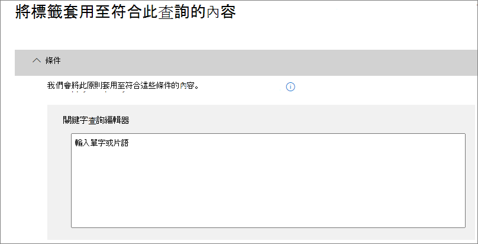

# <a name="create-publish-and-auto-apply-retention-labels"></a>建立、發佈和自動套用保留標籤

>*[Microsoft 365 安全性與合規性的授權指引](https://aka.ms/ComplianceSD)。*

使用下列資訊來協助您建立[保留標籤](labels.md)，然後將標籤自動套用至文件和電子郵件，或發佈標籤，使得使用者可以手動套用標籤。

保留標籤可協助您保留所需的內容，並刪除您不需要的內容。 它們也可以用來將項目宣告為記錄，做為 Microsoft 365 資料的[記錄管理](records-management.md)解決方案的一部分。

您建立及設定保留標籤的位置，取決於您是否使用記錄管理。 以下提供這兩個案例的指示。

## <a name="before-you-begin"></a>開始之前

您的合規性小組中負責建立保留標籤的成員必須具備安全性 &amp; 合規性中心的權限。 根據預設，租用戶系統管理員將可存取此位置，並且可直接讓法務人員與其他人存取安全性 &amp; 合規性中心，而不需要為其提供租用戶系統管理員的所有權限。若要這麼做，我們建議您：移至安全性 &amp; 合規性中心的 [權限]**** 頁面，編輯 [合規性系統管理員]**** 角色群組，將該成員新增到此角色群組。 
  
如需詳細資訊，請參閱[授與使用者存取 Office 365 安全性與合規性中心的權限](../security/office-365-security/grant-access-to-the-security-and-compliance-center.md)。
  
These permissions are required only to create and apply retention labels and a label policy. Policy enforcement does not require access to the content.

## <a name="create-and-configure-retention-labels"></a>建立及設定保留標籤

1. 在 [Microsoft 365 合規性中心](https://compliance.microsoft.com/)，瀏覽至下列其中一個位置：
    
    - 如果您使用記錄管理：
        - [解決方案]****  >  [記錄管理]****  >  [檔案計劃]**** 索引標籤 > [+ 建立標籤]****  >  [保留標籤]****
        
    - 如果您未使用記錄管理：
       - [解決方案]****  >  [資訊控管]****  >  [標籤]**** 索引標籤 > [+ 建立標籤]****
    
    沒有立即看到您的選項？ 先選取 [顯示全部]****。 

2. 遵循精靈中的提示進行。 如果您使用記錄管理：
    
    - 如需檔案計劃描述元的詳細資訊，請參閱[使用檔案計劃管理保留標籤](file-plan-manager.md)
    
    - 若要使用保留標籤將內容宣告為記錄，請啟用 [使用標籤以將內容分類為「記錄」]**** 核取方塊。

3. 重複這些步驟以建立更多標籤。

若要編輯現有的標籤，請選取它，然後選取 [編輯標籤]**** 以啟動相同的精靈讓您變更標籤描述和步驟 2 的任何[合格設定](#updating-retention-labels-and-their-policies)。 或者，選取任何一個可用的 [編輯]**** 選項，直接移至相關頁面以進行更新。

## <a name="publish-retention-labels-by-creating-a-retention-label-policy"></a>建立保留標籤原則來發佈保留標籤

發佈保留標籤，讓使用者可以手動套用這些標籤。

1. 在 [Microsoft 365 合規性中心](https://compliance.microsoft.com/)，瀏覽至下列其中一個位置：
    
    - 如果您使用記錄管理：
        - [解決方案]****  >  [記錄管理]**** > [標籤原則]**** 索引標籤 > [發佈標籤]****
    
    - 如果您未使用記錄管理：
        - [解決方案]****  >  [資訊控管]****  >  [標籤原則]**** 索引標籤 > [發佈標籤]****
    
    沒有立即看到您的選項？ 先選取 [顯示全部]****。 

2. 遵循精靈中的提示進行。
    
    如需保留標籤支援的位置詳細資訊，請參閱[保留標籤和位置](labels.md#retention-label-policies-and-locations)一節。 

若要編輯現有的保留標籤原則，請選取它，然後選取 [編輯原則]****，即可啟動相同的精靈讓您變更原則描述和步驟 2 的任何[合格設定](#updating-retention-labels-and-their-policies)。 或者，選取任何一個可用的 [編輯]**** 選項，直接移至相關頁面以進行更新。

## <a name="auto-apply-a-retention-label"></a>自動套用保留標籤

根據您指定的條件自動套用保留標籤。

1. 在 [Microsoft 365 合規性中心](https://compliance.microsoft.com/)，瀏覽至下列其中一個位置：
    
    - 如果您使用記錄管理：**資訊控管**：
        - [解決方案]****  >  [記錄管理]****  >  [標籤原則]**** 索引標籤 > [自動套用標籤]****
    
    - 如果您未使用記錄管理：
        - [解決方案]****  >  [資訊控管]****  >  [標籤原則]**** 索引標籤 > [自動套用標籤]****
    
    沒有立即看到您的選項？ 先選取 [顯示全部]****。 

2. 遵循精靈中的提示進行。
    
    如需有關設定會自動套用保留標籤之條件的詳細資訊，請參閱此頁面上的[設定自動套用保留標籤的條件](#configuring-conditions-for-auto-apply-retention-labels)一節。
    
    如需保留標籤支援的位置詳細資訊，請參閱[保留標籤和位置](labels.md#retention-label-policies-and-locations)一節。

若要編輯現有的自動套用標籤原則，請選取它，然後選取 [編輯原則]**** 以啟動相同的精靈讓您變更標籤描述和步驟 2 的任何[合格設定](#updating-retention-labels-and-their-policies)。 或者，選取任何一個可用的 [編輯]**** 選項，直接移至相關頁面以進行更新。


## <a name="configuring-conditions-for-auto-apply-retention-labels"></a>設定自動套用保留標籤的條件

您可以在內容包含以下資訊時，自動將保留標籤套用到內容：
  
- [特定敏感資訊類型](#auto-apply-labels-to-content-with-specific-types-of-sensitive-information)
    
- [符合您所建立查詢的特定關鍵字](#auto-apply-labels-to-content-with-keywords-or-searchable-properties)

- [可訓練分類器的符合項目](#auto-apply-labels-to-content-by-using-trainable-classifiers)
    


將自動套用保留標籤套用到符合您設定之條件的所有內容，最多可能需要 7 天的時間。

### <a name="auto-apply-labels-to-content-with-specific-types-of-sensitive-information"></a>自動將標籤套用至包含特定類型敏感資訊的內容

當您為敏感性資訊建立自動套用保留標籤時，系統會顯示與建立資料外洩防護 (DLP) 原則時相同的原則範本清單。 每個原則範本預設會尋找特定類型的敏感性資訊。 例如本文顯示的範本會尋找美國 ITIN、SSN 和護照號碼。 若要深入了解 DLP，請參閱[資料外洩防護原則概觀](data-loss-prevention-policies.md)。
  

  
After you select a policy template, you can add or remove any types of sensitive information, and you can change the instance count and match accuracy. In the example shown here, a retention label will be auto-applied only when:
  
- The content contains between 1 and 9 instances of any of these three sensitive information types. You can delete the **max** value so that it changes to **any**.
    
- The type of sensitive information that's detected has a match accuracy (or confidence level) of at least 75. Many sensitive information types are defined with multiple patterns, where a pattern with a higher match accuracy requires more evidence to be found (such as keywords, dates, or addresses), while a pattern with a lower match accuracy requires less evidence. Simply put, the lower the **min** match accuracy, the easier it is for content to match the condition. 
    
如需這些選項的詳細資訊，請參閱[調整規則，讓規則更容易或更難相符](data-loss-prevention-policies.md#tuning-rules-to-make-them-easier-or-harder-to-match)。
    

  
### <a name="auto-apply-labels-to-content-with-keywords-or-searchable-properties"></a>自動將標籤套用至包含關鍵字或可搜尋屬性的內容

You can auto-apply labels to content that satisfies certain conditions. The conditions now available support applying a label to content that contains specific words, phrases, or values of searchable properties. You can refine your query by using search operators like AND, OR, and NOT.

如需查詢語法的詳細資訊，請參閱：

- [關鍵字查詢語言 (KQL) 語法參考](https://docs.microsoft.com/sharepoint/dev/general-development/keyword-query-language-kql-syntax-reference)

Query-based labels use the search index to identify content. For more information on valid searchable properties, see:

- [內容搜尋的關鍵字查詢與搜尋條件](keyword-queries-and-search-conditions.md)
- [SharePoint 伺服器中的編目及受控屬性概觀](https://docs.microsoft.com/SharePoint/technical-reference/crawled-and-managed-properties-overview)

範例查詢：

- Exchange
    - subject:"Quarterly Financials"
    - recipients:garthf<!--nolink-->@contoso.com
- SharePoint 和 OneDrive
    - contenttype:contract
    - site:https<!--nolink-->://contoso.sharepoint.com/sites/teams/procurement AND contenttype:contract




### <a name="auto-apply-labels-to-content-by-using-trainable-classifiers"></a>使用可訓練分類器自動將標籤套用至內容

選擇用於可訓練分類器的選項時，可以選取其中一個內建分類器或自訂分類器。 內建分類器包括 [履歷]****、[原始程式碼]****、[針對性騷擾]****、[粗話]**** 和 [威脅]****：


若要使用此選項自動套用標籤，SharePoint Online 網站和信箱必須有至少 10 MB 的資料。

如需有關可訓練分類器的詳細資訊，請參閱[開始使用可訓練分類器 (預覽)](classifier-getting-started-with.md)。

如需組態範例，請參閱[如何準備及使用內建分類器](classifier-using-a-ready-to-use-classifier.md#how-to-verify-that-a-built-in-classifier-will-meet-your-needs)。

## <a name="how-long-it-takes-for-retention-labels-to-take-effect"></a>保留標籤要多久才會生效

當您發佈或自動套用保留標籤時，標籤不會立即生效：
  
1. 首先，標籤原則必須先將系統管理中心與原則中的位置同步。
    
2. 接著，位置可能會需要一些時間，將已發佈的保留標籤提供給使用者，或是將標籤自動套用到內容。 實際所需的時間取決於保留標籤的位置和類型。
    
### <a name="published-retention-labels"></a>已發佈的保留標籤

If you publish retention labels to SharePoint or OneDrive, those labels  typically appear for end users to select within one day. However, allow up to seven days. If you publish retention labels to Exchange, it can take up to seven days for those retention labels to appear for end users, and the mailbox must contain at least 10 MB of data.

例如：
  

  
### <a name="auto-apply-retention-labels"></a>自動套用保留標籤

如果您將保留標籤自動套用至符合特定條件的內容，可能需要最多 7 天，保留標籤才會套用至符合條件的所有現有內容。
  

  
### <a name="how-to-check-on-the-status-of-retention-labels-published-to-exchange"></a>如何檢查發佈至 Exchange 之保留標籤的狀態

在 Exchange Online 中，使用者可透過每 7 天執行一次的程序取得保留標籤。 您可以使用 PowerShell 查看這項程序上次執行的時間，藉此判斷下次的執行時間。
  
1. [連線至 Exchange Online PowerShell](https://go.microsoft.com/fwlink/?linkid=799773)。
    
2. 執行下列命令。
    
   ```powershell
   $logProps = Export-MailboxDiagnosticLogs <user> -ExtendedProperties
   ```

   ```powershell
   $xmlprops = [xml]($logProps.MailboxLog)
   ```

   ```powershell
   $xmlprops.Properties.MailboxTable.Property | ? {$_.Name -like "ELC*"}   ```

In the results, the `ELCLastSuccessTimeStamp` (UTC) property shows when the system last processed your mailbox. If it has not happened since the time you created the policy, the labels are not going to appear. To force processing, run  `Start-ManagedFolderAssistant -Identity <user>`.
    
If labels aren't appearing in Outlook on the web and you think they should be, make sure to clear the cache in your browser (CTRL+F5).
    

## Updating retention labels and their policies

When you edit a retention label, retention label policy, or auto-apply policy, and the retention label or policy is already applied to content, your updated settings will automatically be applied to this content in addition to content that's newly identified.

Some settings can't be changed after the label or policy is created and saved, which include:
- The retention settings except the retention period, unless you've configured the label to retain or delete the content based on when it was created.
- The option to classify as a record.

## Find the PowerShell cmdlets for retention labels

To use the retention label cmdlets:
  
1. [Connect to the Office 365 Security & Compliance Center Powershell](https://docs.microsoft.com/powershell/exchange/office-365-scc/connect-to-scc-powershell/connect-to-scc-powershell)
    
2. Use these Office 365 Security & Compliance Center cmdlets:
    
    - [Get-ComplianceTag](https://docs.microsoft.com/powershell/module/exchange/get-compliancetag)
    
    - [New-ComplianceTag](https://docs.microsoft.com/powershell/module/exchange/new-compliancetag)
    
    - [Remove-ComplianceTag](https://docs.microsoft.com/powershell/module/exchange/remove-compliancetag)
    
    - [Set-ComplianceTag](https://docs.microsoft.com/powershell/module/exchange/set-compliancetag)
    
    - [Enable-ComplianceTagStorage](https://docs.microsoft.com/powershell/module/exchange/enable-compliancetagstorage)
    
    - [Get-ComplianceTagStorage](https://docs.microsoft.com/powershell/module/exchange/get-compliancetagstorage)
    
    - [Get-RetentionCompliancePolicy](https://docs.microsoft.com/powershell/module/exchange/get-retentioncompliancepolicy)
    
    - [New-RetentionCompliancePolicy](https://docs.microsoft.com/powershell/module/exchange/new-retentioncompliancepolicy)
    
    - [Remove-RetentionCompliancePolicy](https://docs.microsoft.com/powershell/module/exchange/remove-retentioncompliancepolicy)
    
    - [Set-RetentionCompliancePolicy](https://docs.microsoft.com/powershell/module/exchange/set-retentioncompliancepolicy)
    
    - [Get-RetentionComplianceRule](https://docs.microsoft.com/powershell/module/exchange/get-retentioncompliancerule)
    
    - [New-RetentionComplianceRule](https://docs.microsoft.com/powershell/module/exchange/new-retentioncompliancerule)
    
    - [Remove-RetentionComplianceRule](https://docs.microsoft.com/powershell/module/exchange/remove-retentioncompliancerule)
    
    - [Set-RetentionComplianceRule](https://docs.microsoft.com/powershell/module/exchange/set-retentioncompliancerule)
