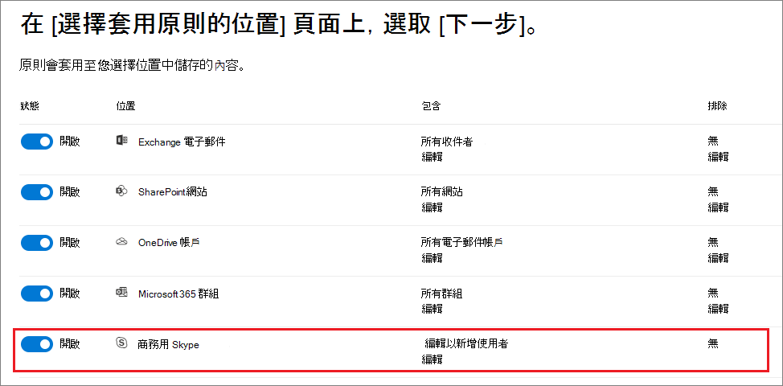
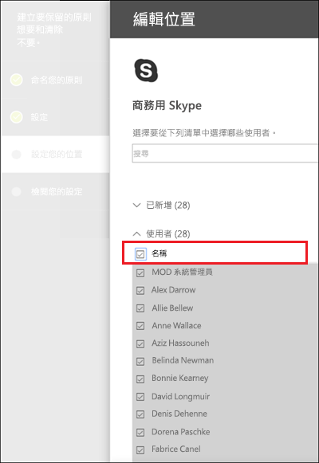
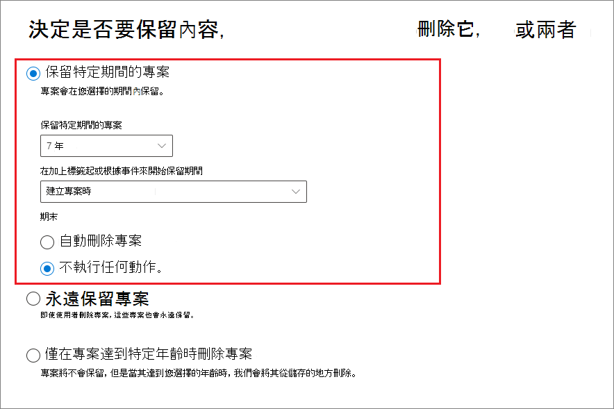
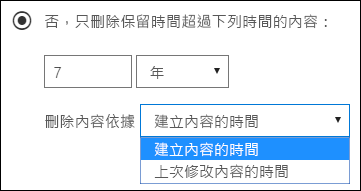
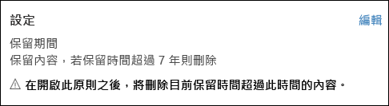
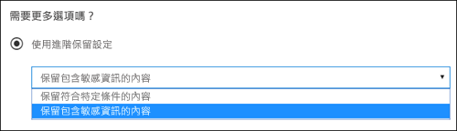
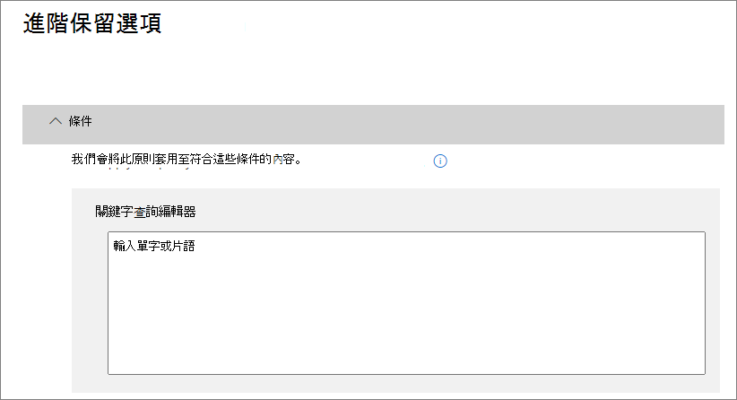

# <a name="create-and-configure-retention-policies"></a><span data-ttu-id="92ab3-103">建立及設定保留原則</span><span class="sxs-lookup"><span data-stu-id="92ab3-103">Create and configure retention policies</span></span>

><span data-ttu-id="92ab3-104">*[Microsoft 365 安全性與合規性的授權指引](https://aka.ms/ComplianceSD)。*</span><span class="sxs-lookup"><span data-stu-id="92ab3-104">*[Microsoft 365 licensing guidance for security & compliance](https://aka.ms/ComplianceSD).*</span></span>

<span data-ttu-id="92ab3-105">使用保留原則主動決定是否要保留內容、刪除內容，還是兩者，即保留然後刪除內容。</span><span class="sxs-lookup"><span data-stu-id="92ab3-105">Use a retention policy to decide proactively whether to retain content, delete content, or both - retain and then delete the content.</span></span> 

<span data-ttu-id="92ab3-106">透過將相同的保留設定依照位置如網站或信箱層級的內容進行指派，保留原則可讓您工作的更有效率，。</span><span class="sxs-lookup"><span data-stu-id="92ab3-106">A retention policy lets you do this very efficiently by assigning the same retention settings for content by location, at a site or mailbox level.</span></span> <span data-ttu-id="92ab3-107">如果您不確定是否要使用保留原則或保留標籤，可參閱[保留原則及保留標籤](retention.md#retention-policies-and-retention-labels)。</span><span class="sxs-lookup"><span data-stu-id="92ab3-107">If you're not sure whether to use a retention policy or a retention label, see [Retention policies and retention labels](retention.md#retention-policies-and-retention-labels).</span></span>

<span data-ttu-id="92ab3-108">如需有關保留原則及其運作方式的詳細資訊，可參閱 [瞭解保留原則](retention.md)。</span><span class="sxs-lookup"><span data-stu-id="92ab3-108">For more information about retention policies and how retention works, see [Learn about retention](retention.md).</span></span>

## <a name="before-you-begin"></a><span data-ttu-id="92ab3-109">在您開始之前</span><span class="sxs-lookup"><span data-stu-id="92ab3-109">Before you begin</span></span>

<span data-ttu-id="92ab3-110">您組織中的全域系統管理員擁有建立及管理保留標籤及其原則的完整權限。</span><span class="sxs-lookup"><span data-stu-id="92ab3-110">The global admin for your organization has full permissions to create and edit retention policies.</span></span> <span data-ttu-id="92ab3-111">若您未以全域系統管理員的身分登入，請參閱 [建立和管理保留標籤所需權限](get-started-with-retention.md#permissions-required-to-create-and-manage-retention-policies-and-retention-labels)。</span><span class="sxs-lookup"><span data-stu-id="92ab3-111">If you aren't signing in as a global admin, see [Permissions required to create and manage retention policies and retention labels](get-started-with-retention.md#permissions-required-to-create-and-manage-retention-policies-and-retention-labels).</span></span>

## <a name="create-and-configure-a-retention-policy"></a><span data-ttu-id="92ab3-112">建立及設定保留原則</span><span class="sxs-lookup"><span data-stu-id="92ab3-112">Create and configure a retention policy</span></span>

<span data-ttu-id="92ab3-113">雖然保留原則可以支援多個位置，但您無法建立含括所有支援位置的單一個保留原則：</span><span class="sxs-lookup"><span data-stu-id="92ab3-113">Although a retention policy can support multiple locations, you can't create a single retention policy that includes all the supported locations:</span></span>
- <span data-ttu-id="92ab3-114">Exchange 電子郵件</span><span class="sxs-lookup"><span data-stu-id="92ab3-114">Exchange email</span></span>
- <span data-ttu-id="92ab3-115">SharePoint 網站</span><span class="sxs-lookup"><span data-stu-id="92ab3-115">SharePoint site</span></span>
- <span data-ttu-id="92ab3-116">OneDrive 帳戶</span><span class="sxs-lookup"><span data-stu-id="92ab3-116">OneDrive accounts</span></span>
- <span data-ttu-id="92ab3-117">Microsoft 365 群組</span><span class="sxs-lookup"><span data-stu-id="92ab3-117">Microsoft 365 groups</span></span>
- <span data-ttu-id="92ab3-118">商務用 Skype</span><span class="sxs-lookup"><span data-stu-id="92ab3-118">Skype for Business</span></span>
- <span data-ttu-id="92ab3-119">Exchange 公用資料夾</span><span class="sxs-lookup"><span data-stu-id="92ab3-119">Exchange public folders</span></span>
- <span data-ttu-id="92ab3-120">Teams 通道訊息</span><span class="sxs-lookup"><span data-stu-id="92ab3-120">Teams channel messages</span></span>
- <span data-ttu-id="92ab3-121">Teams 聊天</span><span class="sxs-lookup"><span data-stu-id="92ab3-121">Teams chats</span></span>

<span data-ttu-id="92ab3-122">當您在建立保留原則時選取任一個 Teams 位置時，系統會自動排除其他的位置。</span><span class="sxs-lookup"><span data-stu-id="92ab3-122">When you select either of the Teams locations when you create a retention policy, the other locations are automatically excluded.</span></span> <span data-ttu-id="92ab3-123">因此，請依照您是否要涵蓋 Teams 位置來決定要遵循的指示：</span><span class="sxs-lookup"><span data-stu-id="92ab3-123">Therefore, the instructions to follow depend on whether you need to include the Teams locations:</span></span>

- [<span data-ttu-id="92ab3-124">Teams 位置的保留原則相關指示</span><span class="sxs-lookup"><span data-stu-id="92ab3-124">Instructions for a retention policy for Teams locations</span></span>](#retention-policy-for-teams-locations)
- [<span data-ttu-id="92ab3-125">除了 Teams 以外的位置保留原則相關指示</span><span class="sxs-lookup"><span data-stu-id="92ab3-125">Instructions for a retention policy for locations other than Teams</span></span>](#retention-policy-for-locations-other-than-teams)

<span data-ttu-id="92ab3-126">當您有多個保留原則，以及當您同時使用保留標籤時，請參閱 [保留原則優先或以什麼為優先？](retention.md#the-principles-of-retention-or-what-takes-precedence) 以瞭解在相同的內容上同時有多個保留設定套用時，會有什麼樣的結果。</span><span class="sxs-lookup"><span data-stu-id="92ab3-126">When you have more than one retention policy, and when you also use retention labels, see [The principles of retention, or what takes precedence?](retention.md#the-principles-of-retention-or-what-takes-precedence) to understand the outcome when multiple retention settings apply to the same content.</span></span>

### <a name="retention-policy-for-teams-locations"></a><span data-ttu-id="92ab3-127">Teams 位置的保留原則</span><span class="sxs-lookup"><span data-stu-id="92ab3-127">Retention policy for Teams locations</span></span>

1. <span data-ttu-id="92ab3-128">在 [Microsoft 365 合規性中心](https://compliance.microsoft.com/)，選取 **[原則]** >  **[保留]**。</span><span class="sxs-lookup"><span data-stu-id="92ab3-128">From the [Microsoft 365 compliance center](https://compliance.microsoft.com/), select **Policies** > **Retention**.</span></span>

2. <span data-ttu-id="92ab3-129">選取 **[新增保留原則]** 以建立新的保留原則。</span><span class="sxs-lookup"><span data-stu-id="92ab3-129">Select **New retention policy** to create a new retention policy.</span></span>

3. <span data-ttu-id="92ab3-130">在精靈的頁面上，如需 **決定是否要保留內容、刪除內容，或兩者皆可**，請指定保留及刪除內容的設定選項。</span><span class="sxs-lookup"><span data-stu-id="92ab3-130">For **Decide if you want to retain content, delete it, or both** page of the wizard, specify the configuration options for retaining and deleting content.</span></span> 
    
    <span data-ttu-id="92ab3-131">您可以建立只會保留內容但不刪除內容的保留原則，建立會保留並於一段指定的時間後刪除內容的原則，或直接在一段時間後刪除指定內容的原則。</span><span class="sxs-lookup"><span data-stu-id="92ab3-131">You can create a retention policy that just retains content without deleting, retains and then deletes after a specified period of time, or just deletes content after a specified period of time.</span></span> <span data-ttu-id="92ab3-132">如需詳細資訊，請參閱此頁面上的[保留和刪除內容的設定 ](#settings-for-retaining-and-deleting-content)。</span><span class="sxs-lookup"><span data-stu-id="92ab3-132">For more information, see [Settings for retaining and deleting content](#settings-for-retaining-and-deleting-content) on this page.</span></span>
    
    <span data-ttu-id="92ab3-133">請勿選取 **[使用進階保留設定]**，因為 Teams 位置不支援此選項。</span><span class="sxs-lookup"><span data-stu-id="92ab3-133">Do not select **Use advanced retention settings** because this option isn't supported for Teams locations.</span></span> 

4. <span data-ttu-id="92ab3-134">在 **[選擇位置]** 頁面上，選取 **[讓我選擇特定位置]**。</span><span class="sxs-lookup"><span data-stu-id="92ab3-134">For the **Choose locations** page, select **Let me choose specific locations**.</span></span> <span data-ttu-id="92ab3-135">然後切換 Teams 的其中一個或兩個位置：**Teams 頻道訊息** 和 **[Teams 聊天]**。</span><span class="sxs-lookup"><span data-stu-id="92ab3-135">Then toggle on one or both of the locations for Teams: **Teams channel message** and **Teams chats**.</span></span>
     
    <span data-ttu-id="92ab3-136">針對 **Teams 頻道訊息**，會包含來自標準頻道的訊息，但不會包含 [私人頻道](https://docs.microsoft.com/microsoftteams/private-channels)。</span><span class="sxs-lookup"><span data-stu-id="92ab3-136">For **Teams channel messages**, message from standard channels but not [private channels](https://docs.microsoft.com/microsoftteams/private-channels) are included.</span></span> <span data-ttu-id="92ab3-137">目前，保留原則尚未支援 [私人頻道]。</span><span class="sxs-lookup"><span data-stu-id="92ab3-137">Currently, private channels aren't supported by retention policies.</span></span>
    
    <span data-ttu-id="92ab3-138">根據預設，系統會選取所有的小組，但是您可以調整要納入的小組，或要排除的小組。</span><span class="sxs-lookup"><span data-stu-id="92ab3-138">By default, all teams are selected, but you can refine this by specifying teams to be included, or teams to be excluded.</span></span>

5. <span data-ttu-id="92ab3-139">完成精靈以儲存您的設定。</span><span class="sxs-lookup"><span data-stu-id="92ab3-139">Complete the wizard to save your settings.</span></span>

<span data-ttu-id="92ab3-140">如需 Teams 保留原則的詳細資訊，請參閱在 Teams 文件中的 [Microsoft Teams 的保留原則](https://docs.microsoft.com/microsoftteams/retention-policies)。</span><span class="sxs-lookup"><span data-stu-id="92ab3-140">For more information about retention policies for Teams, see [Retention policies in Microsoft Teams](https://docs.microsoft.com/microsoftteams/retention-policies) from the Teams documentation.</span></span>

#### <a name="additional-retention-policy-needed-to-support-teams"></a><span data-ttu-id="92ab3-141">支援 Teams 所需的其他保留原則</span><span class="sxs-lookup"><span data-stu-id="92ab3-141">Additional retention policy needed to support Teams</span></span>

<span data-ttu-id="92ab3-142">Teams 不僅是提供聊天和頻道訊息功能，還有更多功能。</span><span class="sxs-lookup"><span data-stu-id="92ab3-142">Teams is more than just chats and channel messages.</span></span> <span data-ttu-id="92ab3-143">如果您有透過 Microsoft 365 群組 (之前稱為 Office 365 群組) 建立的團隊，您應該額外使用 **Office 365 群組**位置來設定包含該 Microsoft 365 群組的保留原則。</span><span class="sxs-lookup"><span data-stu-id="92ab3-143">If you have teams that were created from a Microsoft 365 group (formerly Office 365 group), you should additionally configure a retention policy that includes that Microsoft 365 group by using the **Office 365 groups** location.</span></span> <span data-ttu-id="92ab3-144">此保留原則適用於群組的信箱、網站和檔案中的內容。</span><span class="sxs-lookup"><span data-stu-id="92ab3-144">This retention policy applies to content in the group's mailbox, site, and files.</span></span>

<span data-ttu-id="92ab3-145">如果您有未與 Microsoft 365 群組連線的 Teams 位置，您需要有可以包含 **SharePoint 網站**或 **OneDrive 帳戶**位置的保留原則，用以保留及刪除 Teams 中的檔案：</span><span class="sxs-lookup"><span data-stu-id="92ab3-145">If you have team sites that aren't connected to a Microsoft 365 group, you need a retention policy that includes the **SharePoint sites** or **OneDrive accounts** locations to retain and delete files in Teams:</span></span>

- <span data-ttu-id="92ab3-146">在聊天中共用的檔案會儲存在共用檔案之使用者的 OneDrive 帳戶中。</span><span class="sxs-lookup"><span data-stu-id="92ab3-146">Files that are shared in chat are stored in the OneDrive account of the user who shared the file.</span></span> 

- <span data-ttu-id="92ab3-147">上傳至頻道的檔案則會儲存在團隊的 SharePoint 網站中。</span><span class="sxs-lookup"><span data-stu-id="92ab3-147">Files that are uploaded to channels are stored in the SharePoint site for the team.</span></span>

> [!TIP]
> <span data-ttu-id="92ab3-148">當團隊未連線至 Microsoft 365 時，您可以將保留原則套用到僅特定團隊的檔案，方法是選取團隊的 SharePoint 網站，以及團隊中使用者的 OneDrive 使用者帳戶。</span><span class="sxs-lookup"><span data-stu-id="92ab3-148">You can apply a retention policy to the files of just a specific team when it's not connected to a Microsoft 365 group by selecting the SharePoint site for the team, and the OneDrive accounts of users in the Team.</span></span>

<span data-ttu-id="92ab3-149">套用至 Microsoft 365、SharePoint 網站或 OneDrive 帳戶的保留原則有可能會刪除 Teams 聊天中參考的檔案，或在頻道訊息刪除前就將其刪除。</span><span class="sxs-lookup"><span data-stu-id="92ab3-149">It's possible that a retention policy that's applied to Microsoft 365 groups, SharePoint sites, or OneDrive accounts could delete a file that's referenced in a Teams chat or channel message before those messages get deleted.</span></span> <span data-ttu-id="92ab3-150">在這種情況下，檔案仍會顯示在 Teams 訊息中，但是當使用者選取檔案時，會收到「找不到檔案」錯誤。</span><span class="sxs-lookup"><span data-stu-id="92ab3-150">In this scenario, the file still displays in the Teams message, but when users select the file, they get a "File not found" error.</span></span> <span data-ttu-id="92ab3-151">此行為並非保留原則特定，因此也可能在使用者從 SharePoint 或 OneDrive 中手動刪除檔案時發生。</span><span class="sxs-lookup"><span data-stu-id="92ab3-151">This behavior isn't specific to retention policies and could also happen if a user manually deletes a file from SharePoint or OneDrive.</span></span>


### <a name="retention-policy-for-locations-other-than-teams"></a><span data-ttu-id="92ab3-152">除了 Teams 以外的位置保留原則</span><span class="sxs-lookup"><span data-stu-id="92ab3-152">Retention policy for locations other than Teams</span></span>

1. <span data-ttu-id="92ab3-153">在 [Microsoft 365 合規性中心](https://compliance.microsoft.com/)，選取 **[原則]** >  **[保留]**。</span><span class="sxs-lookup"><span data-stu-id="92ab3-153">From the [Microsoft 365 compliance center](https://compliance.microsoft.com/), select **Policies** > **Retention**.</span></span>

2. <span data-ttu-id="92ab3-154">選取 **[新增保留原則]** 以建立新的保留原則。</span><span class="sxs-lookup"><span data-stu-id="92ab3-154">Select **New retention policy** to create a new retention policy.</span></span>

3. <span data-ttu-id="92ab3-155">在精靈的頁面上，如需 **決定是否要保留內容、刪除內容，或兩者皆可**，請指定保留及刪除內容的設定選項。</span><span class="sxs-lookup"><span data-stu-id="92ab3-155">For **Decide if you want to retain content, delete it, or both** page of the wizard, specify the configuration options for retaining and deleting content.</span></span> 
    
    <span data-ttu-id="92ab3-156">您可以建立只會保留內容但不刪除內容的保留原則，建立會保留並於一段指定的時間後刪除內容的原則，或直接在一段時間後刪除指定內容的原則。</span><span class="sxs-lookup"><span data-stu-id="92ab3-156">You can create a retention policy that just retains content without deleting, retains and then deletes after a specified period of time, or just deletes content after a specified period of time.</span></span> <span data-ttu-id="92ab3-157">如需詳細資訊，請參閱此頁面上的[保留和刪除內容的設定 ](#settings-for-retaining-and-deleting-content)。</span><span class="sxs-lookup"><span data-stu-id="92ab3-157">For more information, see [Settings for retaining and deleting content](#settings-for-retaining-and-deleting-content) on this page.</span></span>
    
    <span data-ttu-id="92ab3-158">然後決定應該將保留原則套用至所有內容，或套用至符合特定條件的內容。</span><span class="sxs-lookup"><span data-stu-id="92ab3-158">Then, decide whether the retention policy should apply to all content, or content that meets specific conditions.</span></span> <span data-ttu-id="92ab3-159">如需有關這些進階保留設定的詳細資訊，請參閱此頁面上的[用來識別符合特定條件內容的進階設定](#advanced-settings-to-identify-content-that-meets-specific-conditions)。</span><span class="sxs-lookup"><span data-stu-id="92ab3-159">For more information about these advanced retention settings, see [Advanced settings to identify content that meets specific conditions](#advanced-settings-to-identify-content-that-meets-specific-conditions) on this page.</span></span> 

4. <span data-ttu-id="92ab3-160">針對 [選擇位置]\*\*\*\* 頁面，選取保留原則是否應套用至組織中所有支援的位置，或您想要指定位置。</span><span class="sxs-lookup"><span data-stu-id="92ab3-160">For the **Choose locations** page, select whether the retention policy should apply to all supported locations across your organization, or you want to specify the locations.</span></span> <span data-ttu-id="92ab3-161">如果您選擇特定位置，則也可以指定包含和排除。</span><span class="sxs-lookup"><span data-stu-id="92ab3-161">If you choose specific locations, you can also specify includes and excludes.</span></span> 
    
    <span data-ttu-id="92ab3-162">如需在組織的保留原則或特定位置之間選擇的詳細資訊，請參閱此頁面上的[將保留原則套用到整個組織或特定位置](#applying-a-retention-policy-to-an-entire-organization-or-specific-locations)。</span><span class="sxs-lookup"><span data-stu-id="92ab3-162">For more information about choosing between a retention policy for the organization or for specific locations, see [Applying a retention policy to an entire organization or specific locations](#applying-a-retention-policy-to-an-entire-organization-or-specific-locations) on this page.</span></span>
    
    <span data-ttu-id="92ab3-163">位置專用資訊：</span><span class="sxs-lookup"><span data-stu-id="92ab3-163">Information specific to locations:</span></span>
    - [<span data-ttu-id="92ab3-164">Exchange 電子郵件和 Exchange 公用資料夾</span><span class="sxs-lookup"><span data-stu-id="92ab3-164">Exchange email and Exchange public folders</span></span>](#configuration-information-for-exchange-email-and-exchange-public-folders)
    - [<span data-ttu-id="92ab3-165">SharePoint 網站和 OneDrive 帳戶</span><span class="sxs-lookup"><span data-stu-id="92ab3-165">SharePoint sites and OneDrive accounts</span></span>](#configuration-information-for-sharepoint-sites-and-onedrive-accounts)
    - [<span data-ttu-id="92ab3-166">Office 365 群組</span><span class="sxs-lookup"><span data-stu-id="92ab3-166">Office 365 groups</span></span>](#configuration-information-for-microsoft-365-groups)
    - [<span data-ttu-id="92ab3-167">商務用 Skype </span><span class="sxs-lookup"><span data-stu-id="92ab3-167">Skype for Business</span></span>](#configuration-information-for-skype-for-business)

5. <span data-ttu-id="92ab3-168">完成精靈以儲存您的設定。</span><span class="sxs-lookup"><span data-stu-id="92ab3-168">Complete the wizard to save your settings.</span></span>


#### <a name="configuration-information-for-exchange-email-and-exchange-public-folders"></a><span data-ttu-id="92ab3-169">Exchange 電子郵件和 Exchange 公用資料夾的設定資訊</span><span class="sxs-lookup"><span data-stu-id="92ab3-169">Configuration information for Exchange email and Exchange public folders</span></span>

<span data-ttu-id="92ab3-170">**Exchange 電子郵件** 位置支援使用者的電子郵件、行事曆和其他信箱專案的保留，方法是套用信箱層級的保留設定。</span><span class="sxs-lookup"><span data-stu-id="92ab3-170">The **Exchange email** location supports retention for users' email, calendar, and other mailbox items, by applying retention settings at the level of a mailbox.</span></span>

<span data-ttu-id="92ab3-171">包含了以下的電子郵件項目：郵件訊息（包括草稿）具有任何的附件檔案、工作和行事曆項目（具有結束日期），以及備註。</span><span class="sxs-lookup"><span data-stu-id="92ab3-171">The following mail items are included: Mail messages (includes drafts) with any attachments, tasks and calendar items when they have an end date, and notes.</span></span> <span data-ttu-id="92ab3-172">不包含沒有結束日期標示的連絡人、任何工作和行事曆項目。</span><span class="sxs-lookup"><span data-stu-id="92ab3-172">Contacts, and any tasks and calendar items that don't have an end date are not included.</span></span> <span data-ttu-id="92ab3-173">儲存在信箱中（例如 Skype 和 Teams 儲存的訊息）的其他項目不會包含在此位置。</span><span class="sxs-lookup"><span data-stu-id="92ab3-173">Other items stored in a mailbox, such as Skype and Teams saved messages, aren't included with this location.</span></span> <span data-ttu-id="92ab3-174">這些項目有各自具備的保留原則。</span><span class="sxs-lookup"><span data-stu-id="92ab3-174">These items have their own retention locations.</span></span>

<span data-ttu-id="92ab3-175">即使 Microsoft 365 群組有 Exchange 信箱，包含整個 **Exchange 電子郵件**位置的保留原則並不會包含 Microsoft 365 群組信箱中的內容。</span><span class="sxs-lookup"><span data-stu-id="92ab3-175">Even though a Microsoft 365 group has an Exchange mailbox, a retention policy that includes the entire **Exchange email** location won't include content in Microsoft 365 group mailboxes.</span></span> <span data-ttu-id="92ab3-176">若要保留這些信箱中的內容，請選取 **[Office 365 群組]** 位置。</span><span class="sxs-lookup"><span data-stu-id="92ab3-176">To retain content in these mailboxes, select the **Office 365 groups** location.</span></span>

<span data-ttu-id="92ab3-177">**Exchange 公用資料夾** 位置會將保留設定套用至所有的公用資料夾，且無法在資料夾或信箱層級套用。</span><span class="sxs-lookup"><span data-stu-id="92ab3-177">The **Exchange public folders** location applies retention settings to all public folders and can't be applied at the folder or mailbox level.</span></span>

#### <a name="configuration-information-for-sharepoint-sites-and-onedrive-accounts"></a><span data-ttu-id="92ab3-178">SharePoint 網站和 OneDrive 帳戶的配置資訊</span><span class="sxs-lookup"><span data-stu-id="92ab3-178">Configuration information for SharePoint sites and OneDrive accounts</span></span>

<span data-ttu-id="92ab3-179">當您選擇 **SharePoint 網站** 位置時，保留原則即可保留和刪除在 SharePoint 通訊網站中的文件、未與 Office 365 群組連結的小組網站，以及傳統網站。</span><span class="sxs-lookup"><span data-stu-id="92ab3-179">When you choose the **SharePoint sites** location, the retention policy can retain and delete documents in SharePoint communication sites, team sites that aren't connected by Office 365 groups, and classic sites.</span></span> <span data-ttu-id="92ab3-180">此選項不支援由 Office 365 群組所連結的小組網站，而是使用套用倒群組信箱、網站和檔案中的內容的 **Office 365 群組**位置。</span><span class="sxs-lookup"><span data-stu-id="92ab3-180">Team sites connected by Office 365 groups aren't supported with this option and instead, use the **Office 365 groups** location that applies to content in the group's mailbox, site, and files.</span></span>

<span data-ttu-id="92ab3-181">雖然保留原則可套用到網站層級，但只有文件會套用保留設定。</span><span class="sxs-lookup"><span data-stu-id="92ab3-181">Although the retention policy is applied at the site level, only documents have retention settings applied to them.</span></span> <span data-ttu-id="92ab3-182">保留設定不適用於組織結構，包含像是文件庫、清單及網站內的資料夾。</span><span class="sxs-lookup"><span data-stu-id="92ab3-182">Retention settings do not apply to the organizing structures that include libraries, lists, and folders within the site.</span></span> 

<span data-ttu-id="92ab3-183">當您為 SharePoint 網站或 OneDrive 帳戶指定您的位置時，您不需要存取網站的權限，而當你在 **[編輯位置]** 頁面上指定 URL 時也不會需要進行任何的驗證。</span><span class="sxs-lookup"><span data-stu-id="92ab3-183">When you specify your locations for SharePoint sites or OneDrive accounts, you don't need permissions to access the sites and no validation is done at the time you specify the URL on the **Edit locations** page.</span></span> <span data-ttu-id="92ab3-184">不過，SharePoint 網站必須編制索引，而您指定的網站會在精靈結束時進行檢查，以確認這些網站是否存在。</span><span class="sxs-lookup"><span data-stu-id="92ab3-184">However, the SharePoint sites must be indexed and the sites that you specify are checked that they exist at the end of the wizard.</span></span>

<span data-ttu-id="92ab3-185">如果此檢查失敗，您會看到一則訊息，指出您輸入的 URL 驗證失敗，且精靈不會建立保留原則，直到驗證檢查通過為止。</span><span class="sxs-lookup"><span data-stu-id="92ab3-185">If this check fails, you see a message that validation failed for the URL you entered, and the wizard won't create the retention policy until the validation check passes.</span></span> <span data-ttu-id="92ab3-186">如果您看到這則訊息，請返回精靈並變更 URL 或從保留原則將網站移除。</span><span class="sxs-lookup"><span data-stu-id="92ab3-186">If you see this message, go back in the wizard to change the URL or remove the site from the retention policy.</span></span>

<span data-ttu-id="92ab3-187">若要特別指定包含或排除某個 OneDrive 帳戶，URL 的格式要求如下：`https://<tenant name>-my.sharepoint.com/personal/<user_name>_<tenant name>_com`</span><span class="sxs-lookup"><span data-stu-id="92ab3-187">To specify individual OneDrive accounts to include or exclude, the URL has the following format: `https://<tenant name>-my.sharepoint.com/personal/<user_name>_<tenant name>_com`</span></span>

<span data-ttu-id="92ab3-188">例如，針對 contoso 租用戶中使用者名稱為 "rsimone" 的使用者：`https://contoso-my.sharepoint.com/personal/rsimone_contoso_onmicrosoft_com`</span><span class="sxs-lookup"><span data-stu-id="92ab3-188">For example, for a user in the contoso tenant that has a user name of "rsimone": `https://contoso-my.sharepoint.com/personal/rsimone_contoso_onmicrosoft_com`</span></span>

<span data-ttu-id="92ab3-189">若要驗證租用戶的語法並識別使用者的 URL，請參閱[取得組織中所有使用者的 OneDrive URL 清單](https://docs.microsoft.com/onedrive/list-onedrive-urls) (部分機器翻譯)。</span><span class="sxs-lookup"><span data-stu-id="92ab3-189">To verify the syntax for your tenant and identify URLs for users, see [Get a list of all user OneDrive URLs in your organization](https://docs.microsoft.com/onedrive/list-onedrive-urls).</span></span>

### <a name="configuration-information-for-microsoft-365-groups"></a><span data-ttu-id="92ab3-190">Microsoft 365 群組的設定資訊</span><span class="sxs-lookup"><span data-stu-id="92ab3-190">Configuration information for Microsoft 365 groups</span></span>

<span data-ttu-id="92ab3-191">若要保留或刪除一個 Microsoft 365 群組（之前稱為 Office 365 群組）的內容，請使用 **Office 365 群組** 的位置。</span><span class="sxs-lookup"><span data-stu-id="92ab3-191">To retain or delete content for a Microsoft 365 group (formerly Office 365 group), use the **Office 365 groups** location.</span></span> <span data-ttu-id="92ab3-192">即使 Microsoft 365 群組有 Exchange 信箱，包含整個 **Exchange 電子郵件**位置的保留原則並不會包含 Microsoft 365 群組信箱中的內容。</span><span class="sxs-lookup"><span data-stu-id="92ab3-192">Even though a Microsoft 365 group has an Exchange mailbox, a retention policy that includes the entire **Exchange email** location won't include content in Microsoft 365 group mailboxes.</span></span> <span data-ttu-id="92ab3-193">此外，雖然 **Exchange 電子郵件**位置一開始會允許您指定要包含或排除的群組信箱，但是當您嘗試儲存保留原則時，您會收到 "RemoteGroupMailbox" 不是Exchange 位置的有效選項錯誤訊息。</span><span class="sxs-lookup"><span data-stu-id="92ab3-193">In addition, although the **Exchange email** location initially allows you to specify a group mailbox to be included or excluded, when you try to save the retention policy, you receive an error that "RemoteGroupMailbox" is not a valid selection for the Exchange location.</span></span>

<span data-ttu-id="92ab3-194">套用到 Microsoft 365 群組的保留原則同時包含群組信箱和網站。</span><span class="sxs-lookup"><span data-stu-id="92ab3-194">A retention policy applied to a Microsoft 365 group includes both the group mailbox and site.</span></span> <span data-ttu-id="92ab3-195">套用至 Microsoft 365 群組的保留原則可保護由 Microsoft 365 群組所建立的資源，其中包括 Microsoft Teams。</span><span class="sxs-lookup"><span data-stu-id="92ab3-195">A retention policy applied to a Microsoft 365 group protects the resources created by a Microsoft 365 group, which includes Microsoft Teams.</span></span>

### <a name="configuration-information-for-skype-for-business"></a><span data-ttu-id="92ab3-196">商務用 Skype 的設定資訊</span><span class="sxs-lookup"><span data-stu-id="92ab3-196">Configuration information for Skype for Business</span></span>

<span data-ttu-id="92ab3-197">不同於 Exchange 電子郵件，您無法將 Skype 位置的狀態切換為開啟以包含所有使用者，但當您開啟該位置時，可以手動選擇您想要保留其交談的使用者：</span><span class="sxs-lookup"><span data-stu-id="92ab3-197">Unlike Exchange email, you can't toggle the status of the Skype location on to include all users, but when you turn on that location, you then manually choose the users whose conversations you want to retain:</span></span>


  
<span data-ttu-id="92ab3-199">當您選取 [選擇使用者]\*\*\*\* 時，您可以選取欄標題中的 [名稱]\*\*\*\* 方塊，快速包含所有使用者。</span><span class="sxs-lookup"><span data-stu-id="92ab3-199">When you select **Choose users**, you can quickly include all users by selecting the **Name** box in the column header.</span></span> <span data-ttu-id="92ab3-200">不過，請務必了解，會將每個使用者算成原則中的一個特定包含。</span><span class="sxs-lookup"><span data-stu-id="92ab3-200">However, it's important to understand that each user counts as a specific inclusion in the policy.</span></span> <span data-ttu-id="92ab3-201">因此，如果您包含超過 1,000 個使用者，則會套用上一節提及的限制。</span><span class="sxs-lookup"><span data-stu-id="92ab3-201">Therefore, if you include over 1,000 users, the limits noted in the previous section apply.</span></span> <span data-ttu-id="92ab3-202">在這裡選取所有 Skype 使用者，和整個組織的原則能夠根據預設包含所有 Skype 使用者並不一樣。</span><span class="sxs-lookup"><span data-stu-id="92ab3-202">Selecting all Skype users here is not the same as if an org-wide policy were able to include all Skype users by default.</span></span> 
  

  
<span data-ttu-id="92ab3-p121">請注意，**交談歷程記錄** (Outlook 中的資料夾) 是與 Skype 封存無關的功能。使用者可以關閉**交談歷程記錄**，但會執行 Skype 的封存，方法為將 Skype 交談的複本儲存在使用者無法存取但電子文件探索可以使用的隱藏資料夾中。</span><span class="sxs-lookup"><span data-stu-id="92ab3-p121">Note that **Conversation History**, a folder in Outlook, is a feature that has nothing to do with Skype archiving. **Conversation History** can be turned off by the end user, but archiving for Skype is done by storing a copy of Skype conversations in a hidden folder that is inaccessible to the user but available to eDiscovery.</span></span>


## <a name="settings-for-retaining-and-deleting-content"></a><span data-ttu-id="92ab3-206">保留和刪除內容的設定</span><span class="sxs-lookup"><span data-stu-id="92ab3-206">Settings for retaining and deleting content</span></span>

<span data-ttu-id="92ab3-207">透過在保留原則中選擇用於保留和刪除內容的設定，您的保留原則會具有下列其中一個設定達一段指定的期間：</span><span class="sxs-lookup"><span data-stu-id="92ab3-207">By choosing the settings for retaining and deleting content in your retention policy, your retention policy will have one of the following configurations for a specified period of time:</span></span>

- <span data-ttu-id="92ab3-208">僅保留</span><span class="sxs-lookup"><span data-stu-id="92ab3-208">Retain-only</span></span>
- <span data-ttu-id="92ab3-209">保留然後刪除</span><span class="sxs-lookup"><span data-stu-id="92ab3-209">Retain and then delete</span></span>
- <span data-ttu-id="92ab3-210">僅刪除</span><span class="sxs-lookup"><span data-stu-id="92ab3-210">Delete-only</span></span>

### <a name="retaining-content-for-a-specific-period-of-time"></a><span data-ttu-id="92ab3-211">將內容保留特定的一段時間</span><span class="sxs-lookup"><span data-stu-id="92ab3-211">Retaining content for a specific period of time</span></span>

<span data-ttu-id="92ab3-212">設定保留原則時，您會選擇無限期保留內容，或將內容保留特定數天、數月或數年。</span><span class="sxs-lookup"><span data-stu-id="92ab3-212">When you configure a retention policy, you choose to retain content indefinitely or for a specific number of days, months, or years.</span></span> <span data-ttu-id="92ab3-213">保留內容的持續時間是從內容的存留期起算，而不是從套用保留原則的時間起算。</span><span class="sxs-lookup"><span data-stu-id="92ab3-213">The duration for how long content is retained is calculated from the age of the content, not from when the retention policy is applied.</span></span> <span data-ttu-id="92ab3-214">您可以選擇存留期是否要根據內容建立的時間，或前次修改的時間 (針對 OneDrive 和 SharePoint)。</span><span class="sxs-lookup"><span data-stu-id="92ab3-214">You can choose whether the age is based on when the content was created or (for OneDrive and SharePoint) when it was last modified.</span></span>

<span data-ttu-id="92ab3-215">範例：</span><span class="sxs-lookup"><span data-stu-id="92ab3-215">Examples:</span></span>
  
- <span data-ttu-id="92ab3-216">SharePoint：如果您在將網站集合中的內容自上次修改起保留七年，而該網站集合中的某文件已有六年未曾修改，如果後續仍未修改該文件，則只會再保留該文件一年。</span><span class="sxs-lookup"><span data-stu-id="92ab3-216">SharePoint: If you want to retain content in a site collection for seven years since it was last modified, and a document in that site collection hasn't been modified in six years, the document will be retained for only another year if it's not modified.</span></span> <span data-ttu-id="92ab3-217">如果該文件重新編輯，則其存留期將會從新的前次修改日期起算，因而會再保留七年。</span><span class="sxs-lookup"><span data-stu-id="92ab3-217">If the document is edited again, the age of the document is calculated from the new last modified date, and it will be retained for another seven years.</span></span>
  
- <span data-ttu-id="92ab3-218">Exchange：同樣地，如果您要讓信箱中的內容保留七年，而六年前已傳送過某封郵件，該郵件則只會再保留一年。</span><span class="sxs-lookup"><span data-stu-id="92ab3-218">Exchange: If you want to retain content in a mailbox for seven years, and a message was sent six years ago, the message will be retained for only one year.</span></span> <span data-ttu-id="92ab3-219">若為 Exchange 內容，時限是以收到內送電子郵件的日期，或傳送外寄電子郵件的日期為基礎。</span><span class="sxs-lookup"><span data-stu-id="92ab3-219">For Exchange content, the age is based on the date received for incoming email, or the date sent for outgoing email.</span></span> <span data-ttu-id="92ab3-220">根據前次修改時間保留內容只會套用到 OneDrive 和 SharePoint 中的網站內容。</span><span class="sxs-lookup"><span data-stu-id="92ab3-220">Retaining content based on when it was last modified applies only to site content in OneDrive and SharePoint.</span></span>
  
<span data-ttu-id="92ab3-221">在保留期間結束時，您會選擇是否要永久刪除內容：</span><span class="sxs-lookup"><span data-stu-id="92ab3-221">At the end of the retention period, you choose whether you want the content to be permanently deleted:</span></span>
  

  
### <a name="deleting-content-thats-older-than-a-specific-age"></a><span data-ttu-id="92ab3-223">刪除早於特定存留期的內容</span><span class="sxs-lookup"><span data-stu-id="92ab3-223">Deleting content that's older than a specific age</span></span>

<span data-ttu-id="92ab3-224">保留原則可以保留然後刪除內容，或刪除舊內容而不保留它。</span><span class="sxs-lookup"><span data-stu-id="92ab3-224">A retention policy can both retain and then delete content, or delete old content without retaining it.</span></span>
  
<span data-ttu-id="92ab3-225">如果您的保留原則刪 內容，請務必了解，文件刪除原則所指定的期限並不是從指派原則的時間算起，而是從建立或修改內容的時間算起。</span><span class="sxs-lookup"><span data-stu-id="92ab3-225">If your retention policy deletes content, it's important to understand that the time period specified for a retention policy is calculated from the time when the content was created or modified, not the time since the policy was assigned.</span></span>
  

  
<span data-ttu-id="92ab3-227">例如，假設您建立一個刪除超過三年時間之內容的保留原則，然後將該原則指派給所有 OneDrive 帳戶，而此帳戶包含許多四或五年前建立的內容。</span><span class="sxs-lookup"><span data-stu-id="92ab3-227">For example, suppose that you create a retention policy that deletes content after three years, and then assign that policy to all OneDrive accounts, which contain a lot of content that was created four or five years ago.</span></span> <span data-ttu-id="92ab3-228">在此情況下，第一次指派保留原則後，很快地許多內容將會遭到刪除。</span><span class="sxs-lookup"><span data-stu-id="92ab3-228">In this case, a lot of content will be deleted soon after assigning the retention policy for the first time.</span></span> <span data-ttu-id="92ab3-229">基於這個原因，請務必了解，會刪除內容的保留原則會對您的內容造成相當大的影響。</span><span class="sxs-lookup"><span data-stu-id="92ab3-229">For this reason, it's important to understand that a retention policy that deletes content can have a considerable impact on your content.</span></span> 
  
<span data-ttu-id="92ab3-p126">因此，在第一次將保留原則指派給網站集合之前，您應先考量現有內容的存留期，以及原則對該內容可能造成的影響。您也可以在指派新原則之前先與使用者溝通，讓他們有時間評估可能的影響。請注意，只在您建立保留原則之前，檢閱其設定時才會出現此警告。</span><span class="sxs-lookup"><span data-stu-id="92ab3-p126">Therefore, before you assign a retention policy to a site collection for the first time, you should first consider the age of the existing content and how the policy may impact that content. You may also want to communicate the new policy to your users before assigning it, to give them time to assess the possible impact. Note this warning that appears when you review the settings for your retention policy just before creating it.</span></span>
  

  
## <a name="advanced-settings-to-identify-content-that-meets-specific-conditions"></a><span data-ttu-id="92ab3-234">用來識別符合特定條件內容的進階設定</span><span class="sxs-lookup"><span data-stu-id="92ab3-234">Advanced settings to identify content that meets specific conditions</span></span>

<span data-ttu-id="92ab3-235">保留原則可以套用至其包含之位置中的所有內容，或您可以選擇只將保留原則套用到包含特定關鍵字或[特定類型的敏感資訊](what-the-sensitive-information-types-look-for.md)的內容。</span><span class="sxs-lookup"><span data-stu-id="92ab3-235">A retention policy can apply to all content in the locations that it includes, or you can choose to apply a retention policy only to content that contains specific keywords or [specific types of sensitive information](what-the-sensitive-information-types-look-for.md).</span></span>
  

  
### <a name="identify-content-that-contains-specific-keywords"></a><span data-ttu-id="92ab3-237">識別包含特定關鍵字的內容</span><span class="sxs-lookup"><span data-stu-id="92ab3-237">Identify content that contains specific keywords</span></span>

<span data-ttu-id="92ab3-238">您可以將保留原則套用到僅符合特定條件的內容，然後針對該內容執行保留動作。</span><span class="sxs-lookup"><span data-stu-id="92ab3-238">You can apply a retention policy only to content that meets specific conditions, and then take retention actions on just that content.</span></span> <span data-ttu-id="92ab3-239">可用的條件可支援將保留原則套用至包含特定字詞或詞組的內容。</span><span class="sxs-lookup"><span data-stu-id="92ab3-239">The conditions available support applying a retention policy to content that contains specific words or phrases.</span></span> <span data-ttu-id="92ab3-240">您可以使用 AND、OR 和 NOT 這類搜尋運算子來精簡您的查詢。</span><span class="sxs-lookup"><span data-stu-id="92ab3-240">You can refine your query by using search operators like AND, OR, and NOT.</span></span> <span data-ttu-id="92ab3-241">如需有關這些運算子的詳細資訊，請參閱[內容查詢的關鍵字查詢和搜尋條件](keyword-queries-and-search-conditions.md)。</span><span class="sxs-lookup"><span data-stu-id="92ab3-241">For more information on these operators, see [Keyword queries and search conditions for Content Search](keyword-queries-and-search-conditions.md).</span></span>
  
<span data-ttu-id="92ab3-242">即將推出對新增可搜尋屬性 (例如 **subject:**) 的支援。</span><span class="sxs-lookup"><span data-stu-id="92ab3-242">Support for adding searchable properties (for example, **subject:**) is coming soon.</span></span>
  
<span data-ttu-id="92ab3-243">查詢型保留會使用搜尋索引來識別內容。</span><span class="sxs-lookup"><span data-stu-id="92ab3-243">Query-based retention uses the search index to identify content.</span></span>
  

  
### <a name="identify-content-that-contains-sensitive-information"></a><span data-ttu-id="92ab3-245">識別包含敏感性資訊的內容</span><span class="sxs-lookup"><span data-stu-id="92ab3-245">Identify content that contains sensitive information</span></span>

<span data-ttu-id="92ab3-p128">您也可以只將保留原則套用至包含[特定類型的機密資訊](what-the-sensitive-information-types-look-for.md)之內容。例如，您可以選擇只將唯一的保留需求套用至包含個人識別資訊 (PII) 的內容，例如納稅人身分識別碼、社會安全編號或護照號碼。</span><span class="sxs-lookup"><span data-stu-id="92ab3-p128">You can also apply a retention policy only to content that contains [specific types of sensitive information](what-the-sensitive-information-types-look-for.md). For example, you can choose to apply unique retention requirements only to content that contains personal information, such as taxpayer identification numbers, social security numbers, or passport numbers.</span></span>
  

  
<span data-ttu-id="92ab3-249">附註：</span><span class="sxs-lookup"><span data-stu-id="92ab3-249">Notes:</span></span>
  
- <span data-ttu-id="92ab3-250">敏感資訊的進階保留不適用於 Exchange 公用資料夾或商務用 Skype，因為這些位置不支援敏感資訊類型。</span><span class="sxs-lookup"><span data-stu-id="92ab3-250">Advanced retention for sensitive information doesn't apply to Exchange public folders or Skype for Business because those locations don't support sensitive information types.</span></span>
    
- <span data-ttu-id="92ab3-251">Exchange Online 使用郵件流程規則來識別敏感性資訊 (也稱為傳輸規則)，因此這只適用於傳輸過程中的郵件，而不是所有已儲存在信箱中的項目。</span><span class="sxs-lookup"><span data-stu-id="92ab3-251">Exchange Online uses mail flow rules (also known as transport rules) to identify sensitive information, so this works only on messages in transit—not on all items already stored in a mailbox.</span></span> <span data-ttu-id="92ab3-252">對於 Exchange Online，這表示保留原則可識別機密資訊，並只對在原則套用到信箱「之後」\*\*\*\* 收到的郵件執行保留動作。</span><span class="sxs-lookup"><span data-stu-id="92ab3-252">For Exchange Online, this means that a retention policy can identify sensitive information and take retention actions only on messages that are received **after** the policy is applied to the mailbox.</span></span> <span data-ttu-id="92ab3-253">上一節所述之以查詢為基礎的保留沒有此限制，因為它使用搜尋索引來識別內容。</span><span class="sxs-lookup"><span data-stu-id="92ab3-253">Query-based retention described in the previous section doesn't have this limitation because it uses the search index to identify content.</span></span> 
    
## <a name="applying-a-retention-policy-to-an-entire-organization-or-specific-locations"></a><span data-ttu-id="92ab3-254">將保留原則套用到整個組織或特定位置</span><span class="sxs-lookup"><span data-stu-id="92ab3-254">Applying a retention policy to an entire organization or specific locations</span></span>

<span data-ttu-id="92ab3-255">您可以輕鬆地將保留原則套用到整個組織、整個位置，或只套用到特定位置或使用者。</span><span class="sxs-lookup"><span data-stu-id="92ab3-255">You can easily apply a retention policy to an entire organization, entire locations, or only to specific locations or users.</span></span>
  
### <a name="org-wide-policy"></a><span data-ttu-id="92ab3-256">全組織原則</span><span class="sxs-lookup"><span data-stu-id="92ab3-256">Org-wide policy</span></span>

<span data-ttu-id="92ab3-257">保留原則最強大的功能之一，就是它可套用至 Microsoft 365 中的各個位置，包括：</span><span class="sxs-lookup"><span data-stu-id="92ab3-257">One of the most powerful features of a retention policy is that it can apply to locations across Microsoft 365, including:</span></span>
  
- <span data-ttu-id="92ab3-258">Exchange 電子郵件</span><span class="sxs-lookup"><span data-stu-id="92ab3-258">Exchange email</span></span>
    
- <span data-ttu-id="92ab3-259">SharePoint 網站集合</span><span class="sxs-lookup"><span data-stu-id="92ab3-259">SharePoint site collections</span></span>
    
- <span data-ttu-id="92ab3-260">OneDrive 帳戶</span><span class="sxs-lookup"><span data-stu-id="92ab3-260">OneDrive accounts</span></span>
    
- <span data-ttu-id="92ab3-261">Microsoft 365 群組</span><span class="sxs-lookup"><span data-stu-id="92ab3-261">Microsoft 365 groups</span></span>
    
- <span data-ttu-id="92ab3-262">Exchange 公用資料夾</span><span class="sxs-lookup"><span data-stu-id="92ab3-262">Exchange public folders</span></span>
    


<span data-ttu-id="92ab3-264">全組織保留原則的其他重要功能包含：</span><span class="sxs-lookup"><span data-stu-id="92ab3-264">Other important features of an org-wide retention policy include:</span></span>
  
- <span data-ttu-id="92ab3-265">原則可以包含的信箱或網站數目沒有任何限制。</span><span class="sxs-lookup"><span data-stu-id="92ab3-265">There is no limit to the number of mailboxes or sites the policy can include.</span></span>
    
- <span data-ttu-id="92ab3-266">對於 Exchange，在套用原則後建立的任何新信箱都會自動繼承此原則。</span><span class="sxs-lookup"><span data-stu-id="92ab3-266">For Exchange, any new mailbox created after the policy is applied will automatically inherit the policy.</span></span>
  
### <a name="a-policy-that-applies-to-entire-locations"></a><span data-ttu-id="92ab3-267">套用到整個組織的原則</span><span class="sxs-lookup"><span data-stu-id="92ab3-267">A policy that applies to entire locations</span></span>

<span data-ttu-id="92ab3-268">當您選擇位置時，您可以輕鬆地包含或排除整個位置，例如 Exchange 電子郵件或 OneDrive 帳戶。</span><span class="sxs-lookup"><span data-stu-id="92ab3-268">When you choose locations, you can easily include or exclude an entire location, such as Exchange email or OneDrive accounts.</span></span> <span data-ttu-id="92ab3-269">若要這麼做，請將該位置的 [狀態]\*\*\*\* 切換到開啟或關閉。</span><span class="sxs-lookup"><span data-stu-id="92ab3-269">To do so, toggle the **Status** of that location on or off.</span></span> 
  
<span data-ttu-id="92ab3-270">就像整個組織的原則一樣，如果將原則套用到整個組織的任何組合，原則可包含的信箱或網站數量則沒有限制。</span><span class="sxs-lookup"><span data-stu-id="92ab3-270">Like an org-wide policy, if a policy applies to any combination of entire locations, there is no limit to the number of mailboxes or sites the policy can include.</span></span> 

<span data-ttu-id="92ab3-271">例如，如果原則包含所有 Exchange 電子郵件和所有 SharePoint 網站，無論有多少個網站和信箱都會全部包含。</span><span class="sxs-lookup"><span data-stu-id="92ab3-271">For example, if a policy includes all Exchange email and all SharePoint sites, all sites and mailboxes will be included, no matter how many.</span></span> <span data-ttu-id="92ab3-272">而對於 Exchange，在套用原則後建立的任何新信箱都會自動繼承原則。</span><span class="sxs-lookup"><span data-stu-id="92ab3-272">And for Exchange, any new mailbox created after the policy is applied will automatically inherit the policy.</span></span>

### <a name="a-policy-with-specific-inclusions-or-exclusions"></a><span data-ttu-id="92ab3-273">具有特定包含或排除的原則</span><span class="sxs-lookup"><span data-stu-id="92ab3-273">A policy with specific inclusions or exclusions</span></span>

<span data-ttu-id="92ab3-274">您也可以將保留原則套用至特定使用者、特定 Microsoft 365 群組或特定網站。</span><span class="sxs-lookup"><span data-stu-id="92ab3-274">You can also apply a retention policy to specific users, specific Microsoft 365 groups, or specific sites.</span></span> <span data-ttu-id="92ab3-275">若要這麼做，請將該位置的 [狀態]\*\*\*\* 切換到開啟，然後使用連結來包含或排除特定使用者、Microsoft 365 群組或網站。</span><span class="sxs-lookup"><span data-stu-id="92ab3-275">To do so, toggle the **Status** of that location on, and then use the links to include or exclude specific users, Microsoft 365 groups, or sites.</span></span> 
  
<span data-ttu-id="92ab3-276">不過，使用此設定時，如果您的保留原則包含或排除超過 1,000 個特定位置，則會有一些限制：</span><span class="sxs-lookup"><span data-stu-id="92ab3-276">However, using this configuration, there are some limits when your retention policy includes or excludes over 1,000 specific locations:</span></span>
  
- <span data-ttu-id="92ab3-277">保留原則的數目上限：</span><span class="sxs-lookup"><span data-stu-id="92ab3-277">Maximum numbers for the retention policy:</span></span>
    - <span data-ttu-id="92ab3-278">1000 個信箱</span><span class="sxs-lookup"><span data-stu-id="92ab3-278">1,000 mailboxes</span></span>
    - <span data-ttu-id="92ab3-279">1,000 個 Microsoft 365 群組</span><span class="sxs-lookup"><span data-stu-id="92ab3-279">1,000 Microsoft 365 groups</span></span>
    - <span data-ttu-id="92ab3-280">1000 個 Teams 私人聊天使用者</span><span class="sxs-lookup"><span data-stu-id="92ab3-280">1,000 users for Teams private chats</span></span>
    - <span data-ttu-id="92ab3-281">100 個網站 (OneDrive 或 SharePoint)</span><span class="sxs-lookup"><span data-stu-id="92ab3-281">100 sites (OneDrive or SharePoint)</span></span>

<span data-ttu-id="92ab3-282">針對一個租用戶支援的原則數目上限：10,000 個。</span><span class="sxs-lookup"><span data-stu-id="92ab3-282">There is a maximum number of policies that are supported for a tenant: 10,000.</span></span> <span data-ttu-id="92ab3-283">這些項目包括保留原則、保留標籤原則，以及自動套用保留原則。</span><span class="sxs-lookup"><span data-stu-id="92ab3-283">These items include retention policies, retention label policies, and auto-apply retention policies.</span></span>

<span data-ttu-id="92ab3-284">如果您的保留原則可能受限於這些限制，請選擇適用於整個位置的設定選項，或使用整個組織的原則。</span><span class="sxs-lookup"><span data-stu-id="92ab3-284">If your retention policies are likely to be subject to these limitations, choose the configuration options that apply to entire locations, or use an org-wide policy.</span></span>

## <a name="updating-retention-policies"></a><span data-ttu-id="92ab3-285">更新保留原則</span><span class="sxs-lookup"><span data-stu-id="92ab3-285">Updating retention policies</span></span>

<span data-ttu-id="92ab3-286">如果您編輯保留原則，且內容已受限於保留原則中的原始設定，則除了新識別的內容以外，還會將您的更新設定自動套用至此內容。</span><span class="sxs-lookup"><span data-stu-id="92ab3-286">If you edit a retention policy and content is already subject to the original settings in your retention policy, your updated settings will be automatically applied to this content in addition to content that's newly identified.</span></span>

<span data-ttu-id="92ab3-287">此更新通常相當快，但可能需要數天的時間。</span><span class="sxs-lookup"><span data-stu-id="92ab3-287">Usually this update is fairly quick but can take several days.</span></span> <span data-ttu-id="92ab3-288">當您的 Microsoft 365 位置間的原則複寫完成時，您會在 Microsoft 365 合規性中心看到保留原則的狀態從**開啟 (處理中)** 變成**開啟 (成功)**。</span><span class="sxs-lookup"><span data-stu-id="92ab3-288">When the policy replication across your Microsoft 365 locations is complete, you'll see the status of the retention policy in the Microsoft 365 compliance center change from **On (Pending)** to **On (Success)**.</span></span>

## <a name="lock-a-retention-policy-by-using-powershell"></a><span data-ttu-id="92ab3-289">使用 PowerShell 鎖定保留原則</span><span class="sxs-lookup"><span data-stu-id="92ab3-289">Lock a retention policy by using PowerShell</span></span>

<span data-ttu-id="92ab3-290">如果您需要使用[保留鎖定](retention.md#use-preservation-lock-to-comply-with-regulatory-requirements)才能符合法規要求，您必須使用 PowerShell。</span><span class="sxs-lookup"><span data-stu-id="92ab3-290">You must use PowerShell if you need to use [Preservation Lock](retention.md#use-preservation-lock-to-comply-with-regulatory-requirements) to comply with regulatory requirements.</span></span> <span data-ttu-id="92ab3-291">因為系統管理員無法在套用保留鎖定之後停用或刪除保留原則，因此在 UI 中無法使用此功能來防範意外的設定。</span><span class="sxs-lookup"><span data-stu-id="92ab3-291">Because administrators can't disable or delete a retention policy after a preservation lock is applied, enabling this feature is not available in the UI to safeguard against accidental configuration.</span></span>

<span data-ttu-id="92ab3-292">具有任何設定的所有保留原則都支持保留鎖定。</span><span class="sxs-lookup"><span data-stu-id="92ab3-292">All retention policies with any configuration support Preservation Lock.</span></span> <span data-ttu-id="92ab3-293">不過，當您使用下列的 PowerShell 命令時，您會發現 **工作量** 參數永遠顯示 **Exchange、SharePoint、OneDriveForBusines、Skype、ModernGroup**，而不是反映原則中設定的實際工作量。</span><span class="sxs-lookup"><span data-stu-id="92ab3-293">However, when you use the PowerShell commands that follow, you'll notice that the **Workload** parameter always displays **Exchange, SharePoint, OneDriveForBusines, Skype, ModernGroup** rather than reflect the actual workloads configured in the policy.</span></span> <span data-ttu-id="92ab3-294">這只是顯示問題。</span><span class="sxs-lookup"><span data-stu-id="92ab3-294">This is a display issue only.</span></span>

1. <span data-ttu-id="92ab3-295">[連線到安全性與合規性中心 PowerShell](https://docs.microsoft.com/powershell/exchange/office-365-scc/connect-to-scc-powershell/connect-to-scc-powershell?view=exchange-ps)。</span><span class="sxs-lookup"><span data-stu-id="92ab3-295">[Connect to Security & Compliance Center PowerShell](https://docs.microsoft.com/powershell/exchange/office-365-scc/connect-to-scc-powershell/connect-to-scc-powershell?view=exchange-ps).</span></span>

2. <span data-ttu-id="92ab3-296">執行 [Get-RetentionCompliancePolicy](https://powershell/module/exchange/get-retentioncompliancepolicy) 列出您的保留原則清單，並尋找您想要鎖定的原則名稱。</span><span class="sxs-lookup"><span data-stu-id="92ab3-296">List your retention policies and find the name of the policy that you want to lock by running [Get-RetentionCompliancePolicy](https://powershell/module/exchange/get-retentioncompliancepolicy).</span></span> <span data-ttu-id="92ab3-297">例如：</span><span class="sxs-lookup"><span data-stu-id="92ab3-297">For example:</span></span>
    
   
    
3. <span data-ttu-id="92ab3-299">若要將保留鎖定置於保留原則上，請以保留原則名稱執行 [Set-RetentionCompliancePolicy]( ) cmdlet，並將 *RestrictiveRetention* 參數設為 true：</span><span class="sxs-lookup"><span data-stu-id="92ab3-299">To place a Preservation Lock on a retention policy, run the [Set-RetentionCompliancePolicy]( ) cmdlet with the name of the retention policy, and the *RestrictiveRetention* parameter set to true:</span></span>
    
    ```powershell
    Set-RetentionCompliancePolicy -Identity "<Name of Policy>" –RestrictiveRetention $true
    ```
    
    <span data-ttu-id="92ab3-300">例如：</span><span class="sxs-lookup"><span data-stu-id="92ab3-300">For example:</span></span>
    
    
    
     <span data-ttu-id="92ab3-302">當系統提示時，請閱讀並確認此設定隨附的限制，然後選擇 **全部皆是**：</span><span class="sxs-lookup"><span data-stu-id="92ab3-302">When prompted, read and acknowledge the restrictions that come with this configuration, and choose **Yes to All**:</span></span>
    
   

<span data-ttu-id="92ab3-304">保留鎖定現在放置於保留原則上。</span><span class="sxs-lookup"><span data-stu-id="92ab3-304">A Preservation Lock is now placed on the retention policy.</span></span> <span data-ttu-id="92ab3-305">若要確認，請再次執行 `Get-RetentionCompliancePolicy`，但指定保留原則名稱並顯示原則參數：</span><span class="sxs-lookup"><span data-stu-id="92ab3-305">To confirm, run `Get-RetentionCompliancePolicy` again, but specify the retention policy name and display the policy parameters:</span></span>

```powershell
Get-RetentionCompliancePolicy -Identity "<Name of Policy>" |Fl
```

<span data-ttu-id="92ab3-306">您應該會看到 **RestrictiveRetention** 設定為 **True**。</span><span class="sxs-lookup"><span data-stu-id="92ab3-306">You should see **RestrictiveRetention** is set to **True**.</span></span> <span data-ttu-id="92ab3-307">例如：</span><span class="sxs-lookup"><span data-stu-id="92ab3-307">For example:</span></span>


  

