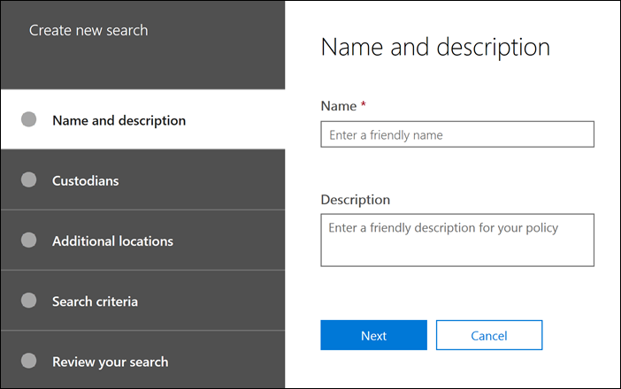

# 建立搜尋

在您案例中的 [**搜尋**] 索引標籤上，您可以按一下 [**新增搜尋**] 並遵循該嚮導來建立新的搜尋。

## 命名搜尋並為其提供描述

每個含案例的搜尋都應該有唯一的名稱。 您可以選擇提供搜尋的描述。 

## 選擇要搜尋的保管人和 custodial 位置

透過指定您已新增至案例的保管人，選擇 [保管人內容位置] 進行搜尋。 透過選取保管人，您將針對所有對應至保管人的資料來源執行搜尋。 您也可以選擇將搜尋縮小為每位管理員所選取的資料來源。 如需如何新增保管人和管理其資料來源的詳細資訊，請參閱[使用保管人](managing-custodians.md)。

## 選擇非 custodial 位置

在某些情況下，您可能會想要搜尋與保管人不相關聯的資料來源。 在此情況下，您可以指定您想要搜尋的位置，或選擇搜尋特定 Microsoft 服務的所有內容位置（例如搜尋所有 Exchange 信箱或所有 SharePoint 網站和 OneDrive 帳戶）。

## 定義搜尋查詢和條件

您可以使用預先建立的條件卡或使用關鍵字查詢語言（KQL）來定義關鍵字查詢和搜尋的任何條件。 如需詳細資訊，請參閱[建立搜尋查詢](building-search-queries.md)。
