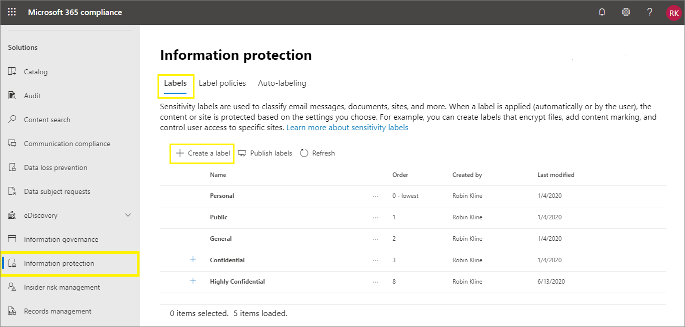

# <a name="create-and-configure-sensitivity-labels-and-their-policies"></a><span data-ttu-id="0537e-103">建立及設定敏感度標籤及其原則</span><span class="sxs-lookup"><span data-stu-id="0537e-103">Create and configure sensitivity labels and their policies</span></span>

><span data-ttu-id="0537e-104">*[Microsoft 365 安全性與合規性的授權指引](https://aka.ms/ComplianceSD)。*</span><span class="sxs-lookup"><span data-stu-id="0537e-104">*[Microsoft 365 licensing guidance for security & compliance](https://aka.ms/ComplianceSD).*</span></span>

<span data-ttu-id="0537e-105">所有 Microsoft 資訊保護解決方案 (有時候縮寫為 MIP) 是使用[敏感度標籤](sensitivity-labels.md)來實作。</span><span class="sxs-lookup"><span data-stu-id="0537e-105">All Microsoft Information Protection solutions (sometimes abbreviated to MIP) are implemented by using [sensitivity labels](sensitivity-labels.md).</span></span> <span data-ttu-id="0537e-106">若要建立及發佈這些標籤，請前往標籤系統管理中心，例如 [Microsoft 365 合規性中心](https://compliance.microsoft.com/)。</span><span class="sxs-lookup"><span data-stu-id="0537e-106">To create and publish these labels, go to your labeling admin center, such as the [Microsoft 365 compliance center](https://compliance.microsoft.com/).</span></span> <span data-ttu-id="0537e-107">您也可以使用 Microsoft 365 安全性中心，或安全性與合規性中心。</span><span class="sxs-lookup"><span data-stu-id="0537e-107">You can also use the Microsoft 365 security center, or the Security & Compliance Center.</span></span>

<span data-ttu-id="0537e-108">首先，建立並設定您要提供應用程式和其他服務使用的敏感度標籤。</span><span class="sxs-lookup"><span data-stu-id="0537e-108">First, create and configure the sensitivity labels that you want to make available for apps and other services.</span></span> <span data-ttu-id="0537e-109">例如，您希望使用者從 Office 應用程式看到和套用的標籤。</span><span class="sxs-lookup"><span data-stu-id="0537e-109">For example, the labels you want users to see and apply from Office apps.</span></span> 

<span data-ttu-id="0537e-110">然後，建立一或多個包含您所設定的標籤和原則設定的標籤原則。</span><span class="sxs-lookup"><span data-stu-id="0537e-110">Then, create one or more label policies that contain the labels and policy settings that you configure.</span></span> <span data-ttu-id="0537e-111">這是為您所選的使用者和位置發佈標籤和設定的標籤原則。</span><span class="sxs-lookup"><span data-stu-id="0537e-111">It's the label policy that publishes the labels and settings for your chosen users and locations.</span></span>

## <a name="before-you-begin"></a><span data-ttu-id="0537e-112">開始之前</span><span class="sxs-lookup"><span data-stu-id="0537e-112">Before you begin</span></span>

<span data-ttu-id="0537e-113">組織的全域系統管理員擁有建立及管理敏感度標籤所有層面的完整權限。</span><span class="sxs-lookup"><span data-stu-id="0537e-113">The global admin for your organization has full permissions to create and manage all aspects of sensitivity labels.</span></span> <span data-ttu-id="0537e-114">如果您未以全域系統管理員身分登入，請參閱[建立和管理敏感度標籤所需的權限](get-started-with-sensitivity-labels.md#permissions-required-to-create-and-manage-sensitivity-labels)。</span><span class="sxs-lookup"><span data-stu-id="0537e-114">If you aren't signing in as a global admin, see [Permissions required to create and manage sensitivity labels](get-started-with-sensitivity-labels.md#permissions-required-to-create-and-manage-sensitivity-labels).</span></span>

## <a name="create-and-configure-sensitivity-labels"></a><span data-ttu-id="0537e-115">建立及設定敏感度標籤</span><span class="sxs-lookup"><span data-stu-id="0537e-115">Create and configure sensitivity labels</span></span>

1. <span data-ttu-id="0537e-116">在標籤系統管理中心中，導覽至敏感度標籤：</span><span class="sxs-lookup"><span data-stu-id="0537e-116">In your labeling admin center, navigate to sensitivity labels:</span></span>
    
    - <span data-ttu-id="0537e-117">Microsoft 365 合規性中心：</span><span class="sxs-lookup"><span data-stu-id="0537e-117">Microsoft 365 compliance center:</span></span> 
        - <span data-ttu-id="0537e-118">**解決方案** > **資訊保護**</span><span class="sxs-lookup"><span data-stu-id="0537e-118">**Solutions** > **Information protection**</span></span>
        
        <span data-ttu-id="0537e-119">如果您沒有立即看到這個選項，請先選取 [全部顯示]\*\*\*\*。</span><span class="sxs-lookup"><span data-stu-id="0537e-119">If you don't immediately see this option, first select **Show all**.</span></span> 
    
    - <span data-ttu-id="0537e-120">Microsoft 365 安全性中心：</span><span class="sxs-lookup"><span data-stu-id="0537e-120">Microsoft 365 security center:</span></span> 
        - <span data-ttu-id="0537e-121">**分類** > **敏感度標籤**</span><span class="sxs-lookup"><span data-stu-id="0537e-121">**Classification** > **Sensitivity labels**</span></span>
    
    - <span data-ttu-id="0537e-122">安全性與合規性中心：</span><span class="sxs-lookup"><span data-stu-id="0537e-122">Security & Compliance Center:</span></span>
        - <span data-ttu-id="0537e-123">**分類** > **敏感度標籤**</span><span class="sxs-lookup"><span data-stu-id="0537e-123">**Classification** > **Sensitivity labels**</span></span>

2. <span data-ttu-id="0537e-124">在 **[標籤]** 頁面上，選取 **[+ 建立標籤]**，以啟動 [新增敏感度標籤] 精靈。</span><span class="sxs-lookup"><span data-stu-id="0537e-124">On the **Labels** page, select **+ Create a label** to start the New sensitivity label wizard.</span></span> 
    
    <span data-ttu-id="0537e-125">例如，從 Microsoft 365 合規性中心:</span><span class="sxs-lookup"><span data-stu-id="0537e-125">For example, from the Microsoft 365 compliance center:</span></span>
    
    
    
    <span data-ttu-id="0537e-127">注意：根據預設，租使用者沒有任何標籤，您必須建立它們。</span><span class="sxs-lookup"><span data-stu-id="0537e-127">Note: By default, tenants don't have any labels and you must create them.</span></span> <span data-ttu-id="0537e-128">範例圖片中的標籤會顯示 [從 Azure 資訊保護中遷移的](https://docs.microsoft.com/azure/information-protection/configure-policy-migrate-labels) 預設標籤。</span><span class="sxs-lookup"><span data-stu-id="0537e-128">The labels in the example picture show default labels that were [migrated from Azure Information Protection](https://docs.microsoft.com/azure/information-protection/configure-policy-migrate-labels).</span></span>

3. <span data-ttu-id="0537e-129">按照標籤設定精靈的提示進行。</span><span class="sxs-lookup"><span data-stu-id="0537e-129">Follow the prompts in the wizard for the label settings.</span></span>
    
    <span data-ttu-id="0537e-130">如需有關標籤設定的詳細資訊，請參閱概觀資訊中的[敏感度標籤功能](sensitivity-labels.md#what-sensitivity-labels-can-do) 並為個別設定套用精靈中的幫助。</span><span class="sxs-lookup"><span data-stu-id="0537e-130">For more information about the label settings, see [What sensitivity labels can do](sensitivity-labels.md#what-sensitivity-labels-can-do) from the overview information and use the help in the wizard for individual settings.</span></span>

4. <span data-ttu-id="0537e-131">重複這些步驟以建立更多標籤。</span><span class="sxs-lookup"><span data-stu-id="0537e-131">Repeat these steps to create more labels.</span></span> <span data-ttu-id="0537e-132">不過，如果您想要建立子標籤，請先選取父標籤，並選取 **[...]** 以取得 **[其他動作]**，然後選取 **[新增子標籤]**。</span><span class="sxs-lookup"><span data-stu-id="0537e-132">However, if you want to create a sublabel, first select the parent label and select **...** for **More actions**, and then select **Add sub label**.</span></span>

5. <span data-ttu-id="0537e-133">建立好所有需要的標籤後，請檢查其順序，並視需要將它們上下移動。</span><span class="sxs-lookup"><span data-stu-id="0537e-133">When you have created all the labels you need, review their order and if necessary, move them up or down.</span></span> <span data-ttu-id="0537e-134">若要變更標籤的順序，請選取 **...** 以取得 [其他動作]\*\*\*\*，然後選取 [上移]\*\*\*\* 或 [下移]\*\*\*\*。</span><span class="sxs-lookup"><span data-stu-id="0537e-134">To change the order of a label, select **...** for **More actions**, and then select **Move up** or **Move down**.</span></span> <span data-ttu-id="0537e-135">如需詳細資訊，請參閱概覽資訊中的[標籤優先順序 (順序很重要)](sensitivity-labels.md#label-priority-order-matters) (英文)。</span><span class="sxs-lookup"><span data-stu-id="0537e-135">For more information, see [Label priority (order matters)](sensitivity-labels.md#label-priority-order-matters) from the overview information.</span></span>

<span data-ttu-id="0537e-136">若要編輯現有的標籤，請將其選取，然後選取 **[編輯標籤]** 按鈕:</span><span class="sxs-lookup"><span data-stu-id="0537e-136">To edit an existing label, select it, and then select the **Edit label** button:</span></span>


<span data-ttu-id="0537e-138">該按鈕會啟動 **[編輯敏感度標籤]** 精靈，它可讓您變更步驟 3 中的所有標籤設定。</span><span class="sxs-lookup"><span data-stu-id="0537e-138">This button starts the **Edit sensitivity label** wizard, which lets you change all the label settings in step 3.</span></span>

<span data-ttu-id="0537e-139">除非您瞭解對使用者會造成的影響，否則不要刪除標籤。</span><span class="sxs-lookup"><span data-stu-id="0537e-139">Don't delete a label unless you understand the impact for users.</span></span> <span data-ttu-id="0537e-140">如需詳細資訊，請參閱 [移除及刪除標籤](#removing-and-deleting-labels) 一節。</span><span class="sxs-lookup"><span data-stu-id="0537e-140">For more information, see the [Removing and deleting labels](#removing-and-deleting-labels) section.</span></span> 

> [!NOTE]
> <span data-ttu-id="0537e-141">如果您編輯已使用標籤原則發佈的標籤，當完成精靈後便不需要額外的步驟。</span><span class="sxs-lookup"><span data-stu-id="0537e-141">If you edit a label that's already published by using a label policy, no extra steps are needed when you finish the wizard.</span></span> <span data-ttu-id="0537e-142">例如，您不需要將其新增到新的標籤原則中，就能讓變更供相同的使用者使用。</span><span class="sxs-lookup"><span data-stu-id="0537e-142">For example, you don't need to add it to a new label policy for the changes to become available to the same users.</span></span> <span data-ttu-id="0537e-143">不過，請允許最多 24 小時的時間讓變更複寫到使用者和服務。</span><span class="sxs-lookup"><span data-stu-id="0537e-143">However, allow up to 24 hours for the changes to replicate to users and services.</span></span>

<span data-ttu-id="0537e-144">在您發佈標籤之前，無法在應用程式中或為服務選取標籤。</span><span class="sxs-lookup"><span data-stu-id="0537e-144">Until you publish your labels, they won't be available to select in apps or for services.</span></span> <span data-ttu-id="0537e-145">若要發佈標籤，必須先[將標籤新增至標籤原則](#publish-sensitivity-labels-by-creating-a-label-policy)。</span><span class="sxs-lookup"><span data-stu-id="0537e-145">To publish the labels, they must be [added to a label policy](#publish-sensitivity-labels-by-creating-a-label-policy).</span></span>

> [!IMPORTANT]
> <span data-ttu-id="0537e-146">在此 [標籤]\*\*\*\* 索引標籤上，請勿選取 [發佈標籤]\*\*\*\* 索引標籤 (也不要在編輯標籤時選取 [發佈標籤]\*\*\*\* 按鈕)，除非您需要建立新的標籤原則。</span><span class="sxs-lookup"><span data-stu-id="0537e-146">On this **Labels** tab, do not select the **Publish labels** tab (or the **Publish label** button when you edit a label) unless you need to create a new label policy.</span></span> <span data-ttu-id="0537e-147">只有當使用者需要不同的標籤或不同的原則設定時，才需要多個標籤原則。</span><span class="sxs-lookup"><span data-stu-id="0537e-147">You need multiple label policies only if users need different labels or different policy settings.</span></span> <span data-ttu-id="0537e-148">盡可能建立較少的標籤原則，只建立一個標籤原則的組織也是很常見的。</span><span class="sxs-lookup"><span data-stu-id="0537e-148">Aim to have as few label policies as possible—it's not uncommon to have just one label policy for the organization.</span></span>

### <a name="additional-label-settings-with-security--compliance-center-powershell"></a><span data-ttu-id="0537e-149">安全性與合規性中心 PowerShell 的其他標籤設定</span><span class="sxs-lookup"><span data-stu-id="0537e-149">Additional label settings with Security & Compliance Center PowerShell</span></span>

<span data-ttu-id="0537e-150">您可以使用[安全性與合規性中心 PowerShell](https://docs.microsoft.com/powershell/exchange/office-365-scc/office-365-scc-powershell?view=exchange-ps) 中的 [Set-Label](https://docs.microsoft.com/powershell/module/exchange/set-label?view=exchange-ps) Cmdlet 取得其他標籤設定。</span><span class="sxs-lookup"><span data-stu-id="0537e-150">Additional label settings are available with the [Set-Label](https://docs.microsoft.com/powershell/module/exchange/set-label?view=exchange-ps) cmdlet from [Security & Compliance Center PowerShell](https://docs.microsoft.com/powershell/exchange/office-365-scc/office-365-scc-powershell?view=exchange-ps).</span></span>

<span data-ttu-id="0537e-151">例如：</span><span class="sxs-lookup"><span data-stu-id="0537e-151">For example:</span></span>

- <span data-ttu-id="0537e-152">對跨國部署使用 *LocaleSettings* 參數，以便使用者能夠利用本地語言查看標籤名稱和工具提示。</span><span class="sxs-lookup"><span data-stu-id="0537e-152">Use the *LocaleSettings* parameter for multinational deployments so that users see the label name and tooltip in their local language.</span></span> <span data-ttu-id="0537e-153">[下列章節](#example-configuration-to-configure-a-sensitivity-label-for-different-languages) 含有指定標籤名稱和法文、義大利文與德文工具提示文本設定範例。</span><span class="sxs-lookup"><span data-stu-id="0537e-153">The [following section](#example-configuration-to-configure-a-sensitivity-label-for-different-languages) has an example configuration that specifies the label name and tooltip text for French, Italian, and German.</span></span>

- <span data-ttu-id="0537e-154">使用 *ApplyContentMarkingFooterFontName* 參數為指定的頁尾指定您選擇的字型。</span><span class="sxs-lookup"><span data-stu-id="0537e-154">Use the *ApplyContentMarkingFooterFontName* parameter to specify your choice of font for your specified footer.</span></span> <span data-ttu-id="0537e-155">Calibri 是頁首、頁尾和浮水印文字的預設字型。</span><span class="sxs-lookup"><span data-stu-id="0537e-155">Calibri is the default font for headers, footers, and watermark text.</span></span> <span data-ttu-id="0537e-156">如果您的替代字型名稱無法用於顯示標籤的服務或裝置，則該字型會回到 Calibri。</span><span class="sxs-lookup"><span data-stu-id="0537e-156">If your alternative font name is not available to the service or device that displays the labels, the font falls back to Calibri.</span></span>

- <span data-ttu-id="0537e-157">使用 *ApplyContentMarkingHeaderFontColor* 參數，為您的指定標題指定您的自訂色彩選擇，使用紅、綠、藍（RGB）元件的十六進位三元代碼。</span><span class="sxs-lookup"><span data-stu-id="0537e-157">Use the *ApplyContentMarkingHeaderFontColor* parameter to specify your custom color choice for your specified header, using a hex triplet code for the red, green, and blue (RGB) components.</span></span> <span data-ttu-id="0537e-158">例如，#40e0d0 是青綠色的 RGB 十六進位值。</span><span class="sxs-lookup"><span data-stu-id="0537e-158">For example, #40e0d0 is the RGB hex value for turquoise.</span></span> <span data-ttu-id="0537e-159">您可以在許多應用程式中找到這些代碼，讓您編輯圖片。</span><span class="sxs-lookup"><span data-stu-id="0537e-159">You'll find these codes in many applications that let you edit pictures.</span></span> <span data-ttu-id="0537e-160">例如，Microsoft 小畫家可讓您從調色板選擇自訂色彩，並自動顯示 RGB 值，然後您可以複製該色彩。</span><span class="sxs-lookup"><span data-stu-id="0537e-160">For example, Microsoft Paint lets you choose a custom color from a palette and the RGB values are automatically displayed, which you can then copy.</span></span>

<span data-ttu-id="0537e-161">針對 Azure 資訊保護的整合式標籤用戶端，您也可以指定 [[進階設定]](https://docs.microsoft.com/azure/information-protection/rms-client/clientv2-admin-guide-customizations)，其中包括設定標籤色彩，以及在套用標籤時套用自訂屬性。</span><span class="sxs-lookup"><span data-stu-id="0537e-161">For the Azure Information Protection unified labeling client only, you can also specify [advanced settings](https://docs.microsoft.com/azure/information-protection/rms-client/clientv2-admin-guide-customizations) that include setting a label color, and applying a custom property when a label is applied.</span></span> <span data-ttu-id="0537e-162">如需完整清單，請參閱本用戶端的系統管理指南中的[標籤可用的進階設定](https://docs.microsoft.com/azure/information-protection/rms-client/clientv2-admin-guide-customizations#available-advanced-settings-for-labels)。</span><span class="sxs-lookup"><span data-stu-id="0537e-162">For the full list, see [Available advanced settings for labels](https://docs.microsoft.com/azure/information-protection/rms-client/clientv2-admin-guide-customizations#available-advanced-settings-for-labels) from this client's admin guide.</span></span>

#### <a name="example-configuration-to-configure-a-sensitivity-label-for-different-languages"></a><span data-ttu-id="0537e-163">設定不同語言敏感度標籤的設定範例</span><span class="sxs-lookup"><span data-stu-id="0537e-163">Example configuration to configure a sensitivity label for different languages</span></span>

<span data-ttu-id="0537e-164">下列範例顯示名為「公開」標籤的 PowerShell 設定，其中包含工具提示的預留位置文字。</span><span class="sxs-lookup"><span data-stu-id="0537e-164">The following example shows the PowerShell configuration for a label named "Public" with placeholder text for the tooltip.</span></span> <span data-ttu-id="0537e-165">在此範例中，標籤名稱和工具提示文字設定為法文、義大利文和德文。</span><span class="sxs-lookup"><span data-stu-id="0537e-165">In this example, the label name and tooltip text are configured for French, Italian, and German.</span></span>

<span data-ttu-id="0537e-166">由於這項設定，若使用者具有使用這些顯示語言的 Office 應用程式，則會以相同的語言查看其標籤名稱和工具提示。</span><span class="sxs-lookup"><span data-stu-id="0537e-166">As a result of this configuration, users who have Office apps that use those display languages see their label names and tooltips in the same language.</span></span> <span data-ttu-id="0537e-167">同樣地，如果您已安裝 Azure 資訊保護的整合標籤用戶端，以在檔案瀏覽器中為檔案加上標籤，則擁有這些語言版本 Windows 的使用者就能在使用滑鼠右鍵進行標記時，以本地語言查看其標籤名稱和工具提示。</span><span class="sxs-lookup"><span data-stu-id="0537e-167">Similarly, if you have the Azure Information Protection unified labeling client installed to label files from File Explorer, users who have those language versions of Windows see their label names and tooltips in their local language when they use the right-click actions for labeling.</span></span>

<span data-ttu-id="0537e-168">針對需要支援的語言，請使用 Office [語言識別項](https://docs.microsoft.com/deployoffice/office2016/language-identifiers-and-optionstate-id-values-in-office-2016#language-identifiers) (又稱為語言標籤)，然後為標籤名稱和工具提示指定自己的翻譯。</span><span class="sxs-lookup"><span data-stu-id="0537e-168">For the languages that you need to support, use the Office [language identifiers](https://docs.microsoft.com/deployoffice/office2016/language-identifiers-and-optionstate-id-values-in-office-2016#language-identifiers) (also known as language tags), and specify your own translation for the label name and tooltip.</span></span>

<span data-ttu-id="0537e-169">在 PowerShell 中執行命令之前，您必須先[連線至安全性與合規性中心 PowerShell](https://docs.microsoft.com/powershell/exchange/office-365-scc/connect-to-scc-powershell/connect-to-scc-powershell?view=exchange-ps)。</span><span class="sxs-lookup"><span data-stu-id="0537e-169">Before you run the commands in PowerShell, you must first [connect to Security & Compliance Center PowerShell](https://docs.microsoft.com/powershell/exchange/office-365-scc/connect-to-scc-powershell/connect-to-scc-powershell?view=exchange-ps).</span></span>


```powershell
$Languages = @("fr-fr","it-it","de-de")
$DisplayNames=@("Publique","Publico","Oeffentlich")
$Tooltips = @("Texte Français","Testo italiano","Deutscher text")
$label = "Public"
$DisplayNameLocaleSettings = [PSCustomObject]@{LocaleKey='DisplayName';
Settings=@(
@{key=$Languages[0];Value=$DisplayNames[0];}
@{key=$Languages[1];Value=$DisplayNames[1];}
@{key=$Languages[2];Value=$DisplayNames[2];})}
$TooltipLocaleSettings = [PSCustomObject]@{LocaleKey='Tooltip';
Settings=@(
@{key=$Languages[0];Value=$Tooltips[0];}
@{key=$Languages[1];Value=$Tooltips[1];}
@{key=$Languages[2];Value=$Tooltips[2];})}
Set-Label -Identity $Label -LocaleSettings (ConvertTo-Json $DisplayNameLocaleSettings -Depth 3 -Compress),(ConvertTo-Json $TooltipLocaleSettings -Depth 3 -Compress)
```

## <a name="publish-sensitivity-labels-by-creating-a-label-policy"></a><span data-ttu-id="0537e-170">建立標籤原則來發佈敏感度標籤</span><span class="sxs-lookup"><span data-stu-id="0537e-170">Publish sensitivity labels by creating a label policy</span></span>

1. <span data-ttu-id="0537e-171">在標籤系統管理中心中，導覽至敏感度標籤：</span><span class="sxs-lookup"><span data-stu-id="0537e-171">In your labeling admin center, navigate to sensitivity labels:</span></span>
    
    - <span data-ttu-id="0537e-172">Microsoft 365 合規性中心：</span><span class="sxs-lookup"><span data-stu-id="0537e-172">Microsoft 365 compliance center:</span></span> 
        - <span data-ttu-id="0537e-173">**解決方案** > **資訊保護**</span><span class="sxs-lookup"><span data-stu-id="0537e-173">**Solutions** > **Information protection**</span></span>
        
        <span data-ttu-id="0537e-174">如果您沒有立即看到這個選項，請先選取 [全部顯示]\*\*\*\*。</span><span class="sxs-lookup"><span data-stu-id="0537e-174">If you don't immediately see this option, first select **Show all**.</span></span> 
    
    - <span data-ttu-id="0537e-175">Microsoft 365 安全性中心：</span><span class="sxs-lookup"><span data-stu-id="0537e-175">Microsoft 365 security center:</span></span> 
        - <span data-ttu-id="0537e-176">**分類** > **敏感度標籤**</span><span class="sxs-lookup"><span data-stu-id="0537e-176">**Classification** > **Sensitivity labels**</span></span>
    
    - <span data-ttu-id="0537e-177">安全性與合規性中心：</span><span class="sxs-lookup"><span data-stu-id="0537e-177">Security & Compliance Center:</span></span>
        - <span data-ttu-id="0537e-178">**分類** > **敏感度標籤**</span><span class="sxs-lookup"><span data-stu-id="0537e-178">**Classification** > **Sensitivity labels**</span></span>

2. <span data-ttu-id="0537e-179">選取 **[標籤原則]** 索引標籤，然後 **[發佈標籤]** 以開始 [建立原則] 精靈：</span><span class="sxs-lookup"><span data-stu-id="0537e-179">Select the **Label policies** tab, and then **Publish labels** to start the Create policy wizard:</span></span>
    
    <span data-ttu-id="0537e-180">例如，從 Microsoft 365 合規性中心:</span><span class="sxs-lookup"><span data-stu-id="0537e-180">For example, from the Microsoft 365 compliance center:</span></span>
        
    
    
    <span data-ttu-id="0537e-182">注意：根據預設，租使用者沒有任何標籤原則，您必須建立它們。</span><span class="sxs-lookup"><span data-stu-id="0537e-182">Note: By default, tenants don't have any label policies and you must create them.</span></span> 

3. <span data-ttu-id="0537e-183">在精靈中，請選取 **[選擇要發佈的敏感度標籤]**。</span><span class="sxs-lookup"><span data-stu-id="0537e-183">In the wizard, select **Choose sensitivity labels to publish**.</span></span> <span data-ttu-id="0537e-184">選取您要在應用程式和服務中提供使用的標籤，然後選取 **[新增]**。</span><span class="sxs-lookup"><span data-stu-id="0537e-184">Select the labels that you want to make available in apps and to services, and then select **Add**.</span></span>
    
    > [!IMPORTANT]
    > <span data-ttu-id="0537e-185">如果您選取子標籤，請確定您也選取其上層標籤。</span><span class="sxs-lookup"><span data-stu-id="0537e-185">If you select a sublabel, make sure you also select its parent label.</span></span>
    
4. <span data-ttu-id="0537e-186">檢閱選取的標籤，若要進行任何變更，請選取 **[編輯]**。</span><span class="sxs-lookup"><span data-stu-id="0537e-186">Review the selected labels and to make any changes, select **Edit**.</span></span> <span data-ttu-id="0537e-187">否則請選取 **[下一步]**。</span><span class="sxs-lookup"><span data-stu-id="0537e-187">Otherwise, select **Next**.</span></span>

5. <span data-ttu-id="0537e-188">遵循提示來設定原則設定。</span><span class="sxs-lookup"><span data-stu-id="0537e-188">Follow the prompts to configure the policy settings.</span></span>
    
    <span data-ttu-id="0537e-189">如需有關標籤設定的詳細資訊，請參閱概觀資訊中的[標籤原則的功能](sensitivity-labels.md#what-label-policies-can-do) 並為個別設定套用精靈中的幫助。</span><span class="sxs-lookup"><span data-stu-id="0537e-189">For more information about these settings, see [What label policies can do](sensitivity-labels.md#what-label-policies-can-do) from the overview information and use the help in the wizard for individual settings.</span></span>

7. <span data-ttu-id="0537e-190">如果不同的使用者或位置需要不同的原則設定，請重複這些步驟。</span><span class="sxs-lookup"><span data-stu-id="0537e-190">Repeat these steps if you need different policy settings for different users or locations.</span></span> <span data-ttu-id="0537e-191">例如，您需要一組使用者有其他標籤，或使用者的子集有不同的預設標籤。</span><span class="sxs-lookup"><span data-stu-id="0537e-191">For example, you want additional labels for a group of users, or a different default label for a subset of users.</span></span>

8. <span data-ttu-id="0537e-192">如果您建立可能會導致使用者或位置發生衝突的多個標籤原則，請檢閱原則順序，並視需要將它們上下移動。</span><span class="sxs-lookup"><span data-stu-id="0537e-192">If you create more than one label policy that might result in a conflict for a user or location, review the policy order and if necessary, move them up or down.</span></span> <span data-ttu-id="0537e-193">若要變更標籤原則的順序，請選取 **...** 以取得 **[其他動作]**，然後選取 **[上移]** 或 **[下移]**。</span><span class="sxs-lookup"><span data-stu-id="0537e-193">To change the order of a label policy, select **...** for **More actions**, and then select **Move up** or **Move down**.</span></span> <span data-ttu-id="0537e-194">如需詳細資訊，請參閱概觀資訊中的 [標籤原則優先順序 (順序很重要)](sensitivity-labels.md#label-policy-priority-order-matters) (英文)。</span><span class="sxs-lookup"><span data-stu-id="0537e-194">For more information, see [Label policy priority (order matters)](sensitivity-labels.md#label-policy-priority-order-matters) from the overview information.</span></span>

<span data-ttu-id="0537e-195">完成精靈即會自動發佈標籤原則。</span><span class="sxs-lookup"><span data-stu-id="0537e-195">Completing the wizard automatically publishes the label policy.</span></span> <span data-ttu-id="0537e-196">若要對已發佈的原則進行變更，只要編輯即可。</span><span class="sxs-lookup"><span data-stu-id="0537e-196">To make changes to a published policy, simply edit it.</span></span> <span data-ttu-id="0537e-197">沒有特定的發佈或重新發佈動作可供您選取。</span><span class="sxs-lookup"><span data-stu-id="0537e-197">There is no specific publish or republish action for you to select.</span></span>

<span data-ttu-id="0537e-198">若要編輯現有的標籤原則，請將其選取，然後選取 **[編輯原則]** 按鈕:</span><span class="sxs-lookup"><span data-stu-id="0537e-198">To edit an existing label policy, select it, and then select the **Edit Policy** button:</span></span> 


<span data-ttu-id="0537e-200">這個按鈕會啟動 **[建立原則]** 精靈，這會讓您可以編輯要包含的標籤和標籤設定。</span><span class="sxs-lookup"><span data-stu-id="0537e-200">This button starts the **Create policy** wizard, which lets you edit which labels are included and the label settings.</span></span> <span data-ttu-id="0537e-201">完成精靈時，任何變更都會自動複寫到選取的使用者和服務。</span><span class="sxs-lookup"><span data-stu-id="0537e-201">When you complete the wizard, any changes are automatically replicated to the selected users and services.</span></span>

<span data-ttu-id="0537e-202">1 小時內，使用者便能在其 Office 應用程式中看到新的標籤。</span><span class="sxs-lookup"><span data-stu-id="0537e-202">Users see new labels in their Office apps within one hour.</span></span> <span data-ttu-id="0537e-203">不過，對現有標籤所做的變更最多需 24 小時的時間，才能複製到所有使用者和服務。</span><span class="sxs-lookup"><span data-stu-id="0537e-203">However, allow up to 24 hours for changes to existing labels to replicate to all users and services.</span></span>

### <a name="additional-label-policy-settings-with-security--compliance-center-powershell"></a><span data-ttu-id="0537e-204">安全性與合規性中心 PowerShell 的其他標籤原則設定</span><span class="sxs-lookup"><span data-stu-id="0537e-204">Additional label policy settings with Security & Compliance Center PowerShell</span></span>

<span data-ttu-id="0537e-205">您可以使用[安全規範中心 PowerShell](https://docs.microsoft.com/powershell/exchange/office-365-scc/office-365-scc-powershell?view=exchange-ps) 中的 [Set-LabelPolicy](https://docs.microsoft.com/powershell/module/exchange/set-labelpolicy?view=exchange-ps) 指令取得其他標籤原則設定。</span><span class="sxs-lookup"><span data-stu-id="0537e-205">Additional label policy settings are available with the [Set-LabelPolicy](https://docs.microsoft.com/powershell/module/exchange/set-labelpolicy?view=exchange-ps) cmdlet from [Security & Compliance Center PowerShell](https://docs.microsoft.com/powershell/exchange/office-365-scc/office-365-scc-powershell?view=exchange-ps).</span></span>

<span data-ttu-id="0537e-206">針對 Azure 資訊保護的 [整合式標籤] 用戶端，您可以指定[[進階設定]](https://docs.microsoft.com/azure/information-protection/rms-client/clientv2-admin-guide-customizations)，其中包括為 Outlook 設定不同的預設標籤，以及在 Outlook 中實作可警告、證明或封鎖要傳送的電子郵件的快顯訊息。</span><span class="sxs-lookup"><span data-stu-id="0537e-206">For the Azure Information Protection unified labeling client only, you can specify [advanced settings](https://docs.microsoft.com/azure/information-protection/rms-client/clientv2-admin-guide-customizations) that include setting a different default label for Outlook, and implement pop-up messages in Outlook that warn, justify, or block emails being sent.</span></span> <span data-ttu-id="0537e-207">如需完整清單，請參閱本用戶端的系統管理指南中的[標籤原則可用的進階設定](https://docs.microsoft.com/azure/information-protection/rms-client/clientv2-admin-guide-customizations#available-advanced-settings-for-label-policies)。</span><span class="sxs-lookup"><span data-stu-id="0537e-207">For the full list, see [Available advanced settings for label policies](https://docs.microsoft.com/azure/information-protection/rms-client/clientv2-admin-guide-customizations#available-advanced-settings-for-label-policies) from this client's admin guide.</span></span>

## <a name="use-powershell-for-sensitivity-labels-and-their-policies"></a><span data-ttu-id="0537e-208">將 PowerShell 用於敏感度標籤及其原則</span><span class="sxs-lookup"><span data-stu-id="0537e-208">Use PowerShell for sensitivity labels and their policies</span></span>

<span data-ttu-id="0537e-209">您現在可以使用 [安全規範中心 PowerShell](https://docs.microsoft.com/powershell/exchange/office-365-scc/office-365-scc-powershell?view=exchange-ps)，建立並設定您在標記系統管理中心看到的所有設定。</span><span class="sxs-lookup"><span data-stu-id="0537e-209">You can now use [Security & Compliance Center PowerShell](https://docs.microsoft.com/powershell/exchange/office-365-scc/office-365-scc-powershell?view=exchange-ps) to create and configure all the settings you see in your labeling admin center.</span></span> <span data-ttu-id="0537e-210">這表示除了將 PowerShell 用於標籤系統管理中心的設定以外，您現在可以全面編寫敏感度標籤和敏感度標籤原則的建立與維護腳本。</span><span class="sxs-lookup"><span data-stu-id="0537e-210">This means that in addition to using PowerShell for settings that aren't available in the labeling admin centers, you can now fully script the creation and maintenance of sensitivity labels and sensitivity label policies.</span></span> 

<span data-ttu-id="0537e-211">如需支援的參數和值，請參閱下列文件：</span><span class="sxs-lookup"><span data-stu-id="0537e-211">See the following documentation for supported parameters and values:</span></span>

- [<span data-ttu-id="0537e-212">新標籤</span><span class="sxs-lookup"><span data-stu-id="0537e-212">New-Label</span></span>](https://docs.microsoft.com/powershell/module/exchange/new-label?view=exchange-ps)
- [<span data-ttu-id="0537e-213">新標籤原則</span><span class="sxs-lookup"><span data-stu-id="0537e-213">New-LabelPolicy</span></span>](https://docs.microsoft.com/powershell/module/exchange/new-labelpolicy?view=exchange-ps)
- [<span data-ttu-id="0537e-214">設定標籤</span><span class="sxs-lookup"><span data-stu-id="0537e-214">Set-Label</span></span>](https://docs.microsoft.com/powershell/module/exchange/set-label?view=exchange-ps)
- [<span data-ttu-id="0537e-215">設定標籤原則</span><span class="sxs-lookup"><span data-stu-id="0537e-215">Set-LabelPolicy</span></span>](https://docs.microsoft.com/powershell/module/exchange/set-labelpolicy?view=exchange-ps)

<span data-ttu-id="0537e-216">如果您需要為刪除敏感度標籤或敏感度標籤原則編寫腳本，您也可以使用 [移除標籤](https://docs.microsoft.com/powershell/module/exchange/remove-label?view=exchange-ps) 和 [移除標籤原則](https://docs.microsoft.com/powershell/module/exchange/remove-labelpolicy?view=exchange-ps)。</span><span class="sxs-lookup"><span data-stu-id="0537e-216">You can also use [Remove-Label](https://docs.microsoft.com/powershell/module/exchange/remove-label?view=exchange-ps) and [Remove-LabelPolicy](https://docs.microsoft.com/powershell/module/exchange/remove-labelpolicy?view=exchange-ps) if you need to script the deletion of sensitivity labels or sensitivity label policies.</span></span> <span data-ttu-id="0537e-217">不過，在您刪除敏感度標籤前，請務必先閱讀下列章節。</span><span class="sxs-lookup"><span data-stu-id="0537e-217">However, before you delete sensitivity labels, make sure you read the following section.</span></span>

## <a name="removing-and-deleting-labels"></a><span data-ttu-id="0537e-218">移除並刪除標籤</span><span class="sxs-lookup"><span data-stu-id="0537e-218">Removing and deleting labels</span></span>

<span data-ttu-id="0537e-219">在生產環境中，您不太可能需要從標籤原則移除敏感度標籤，或刪除敏感度標籤。</span><span class="sxs-lookup"><span data-stu-id="0537e-219">In a production environment, it's unlikely that you will need to remove sensitivity labels from a label policy, or delete sensitivity labels.</span></span> <span data-ttu-id="0537e-220">在初始測試階段，您可能需要執行下列其中一項動作。</span><span class="sxs-lookup"><span data-stu-id="0537e-220">It's more likely that you might need to do one or either of these actions during an initial testing phase.</span></span> <span data-ttu-id="0537e-221">請務必了解當您執行這些動作時，會發生什麼情況。</span><span class="sxs-lookup"><span data-stu-id="0537e-221">Make sure you understand what happens when you do either of these actions.</span></span>

<span data-ttu-id="0537e-222">從標籤原則移除標籤比刪除標籤的風險小，您可以在日後需要時，隨時將它新增回標籤原則：</span><span class="sxs-lookup"><span data-stu-id="0537e-222">Removing a label from a label policy is less risky than deleting it, and you can always add it back to a label policy later if needed:</span></span>

- <span data-ttu-id="0537e-223">當您從標籤原則中移除標籤以使該標籤不再發佈給最初指定的使用者時，下次重新整理標籤原則時，使用者將不會在 Office 應用程序中看到要選取的標籤。</span><span class="sxs-lookup"><span data-stu-id="0537e-223">When you remove a label from a label policy so that the label is no longer published to the originally specified users, the next time the label policy is refreshed, users no longer see that label to select in their Office app.</span></span> <span data-ttu-id="0537e-224">不過，如果您已將標籤套用至文件或電子郵件，則不會從該內容移除標籤。</span><span class="sxs-lookup"><span data-stu-id="0537e-224">However, if the label has been applied to documents or emails, the label isn't removed from that content.</span></span> <span data-ttu-id="0537e-225">標籤所套用的任何加密都會保留，而基礎保護範本仍然會發佈。</span><span class="sxs-lookup"><span data-stu-id="0537e-225">Any encryption that was applied by the label remains and the underlying protection template remains published.</span></span> 

- <span data-ttu-id="0537e-226">針對已移除但之前已套用至內容的標籤，使用 Word、Excel 和 PowerPoint 的內建標籤的使用者仍會在狀態列上看到已套用的標籤名稱。</span><span class="sxs-lookup"><span data-stu-id="0537e-226">For labels that are removed but have previously been applied to content, users who are using built-in labeling for Word, Excel, and PowerPoint, still see the applied label name on the status bar.</span></span> <span data-ttu-id="0537e-227">同樣，已刪除且已套用至 SharePoint 網站的標籤仍會在 [敏感度]\*\*\*\* 欄中顯示標籤名稱。</span><span class="sxs-lookup"><span data-stu-id="0537e-227">Similarly, labels that are removed that were applied to SharePoint sites still display the label name in the **Sensitivity** column.</span></span>

<span data-ttu-id="0537e-228">相比之下，當您刪除標籤時：</span><span class="sxs-lookup"><span data-stu-id="0537e-228">In comparison, when you delete a label:</span></span>

- <span data-ttu-id="0537e-229">如果標籤已套用加密，則會封存基礎保護範本，以便仍可開啟先前受保護的內容。</span><span class="sxs-lookup"><span data-stu-id="0537e-229">If the label applied encryption, the underlying protection template is archived so that previously protected content can still be opened.</span></span> <span data-ttu-id="0537e-230">由於此已封存保護範本，您將無法使用相同名稱建立新標籤。</span><span class="sxs-lookup"><span data-stu-id="0537e-230">Because of this archived protection template, you won't be able to create a new label with the same name.</span></span> <span data-ttu-id="0537e-231">雖然您可以使用 [PowerShell](https://docs.microsoft.com/powershell/module/aipservice/remove-aipservicetemplate) 來刪除保護範本，但請不要這麼做，除非您確定不需要開啟使用封存範本加密的內容。</span><span class="sxs-lookup"><span data-stu-id="0537e-231">Although it's possible to delete a protection template by using [PowerShell](https://docs.microsoft.com/powershell/module/aipservice/remove-aipservicetemplate), don't do this unless you're sure you don't need to open content that was encrypted with the archived template.</span></span>

- <span data-ttu-id="0537e-232">針對桌面應用程式：中繼資料中的標籤資訊會保留，但由於無法再將標籤識別碼標示為名稱，使用者就不會看到已套用的標籤名稱 (例如，在狀態列上)，因此使用者會假設內容未加上標籤。</span><span class="sxs-lookup"><span data-stu-id="0537e-232">For desktop apps: The label information in the metadata remains, but because a label ID to name mapping is no longer possible, users don't see the applied label name displayed (for example, on the status bar) so users will assume the content isn't labeled.</span></span> <span data-ttu-id="0537e-233">如果標籤已套用加密，則會保留加密，而在內容開啟時使用者仍可看到目前封存保護範本的名稱與描述。</span><span class="sxs-lookup"><span data-stu-id="0537e-233">If the label applied encryption, the encryption remains and when the content is opened, uses still see the name and description of the now archived protection template.</span></span>

- <span data-ttu-id="0537e-234">針對 Office 網頁版：使用者在狀態列或 [敏感度]\*\*\*\* 欄中不會看到標籤名稱。</span><span class="sxs-lookup"><span data-stu-id="0537e-234">For Office on the web: Users don't see the label name on status bar or in the **Sensitivity** column.</span></span> <span data-ttu-id="0537e-235">只有當標籤未套用加密時，中繼資料中的標籤資訊才會保留。</span><span class="sxs-lookup"><span data-stu-id="0537e-235">The label information in the metadata remains only if the label didn't apply encryption.</span></span> <span data-ttu-id="0537e-236">如果標籤已套用加密，而且您已啟用[ SharePoint 和 Onedrive 的[敏感度標籤]](sensitivity-labels-sharepoint-onedrive-files.md)，則會移除中繼資料中的標籤資訊，並將加密移除。</span><span class="sxs-lookup"><span data-stu-id="0537e-236">If the label applied encryption, and you've enabled [sensitivity labels for SharePoint and OneDrive](sensitivity-labels-sharepoint-onedrive-files.md), the label information in the metadata is removed and the encryption is removed.</span></span> 

<span data-ttu-id="0537e-237">當您從標籤原則移除敏感度標籤或刪除敏感度標籤時，這些變更最多可能需要一個小時的時間，才能複製到所有使用者和服務。</span><span class="sxs-lookup"><span data-stu-id="0537e-237">When you remove a sensitivity label from a label policy, or delete a sensitivity label, these changes can take up to one hour to replicate to all users and services.</span></span>

## <a name="next-steps"></a><span data-ttu-id="0537e-238">後續步驟</span><span class="sxs-lookup"><span data-stu-id="0537e-238">Next steps</span></span>

<span data-ttu-id="0537e-239">若要針對特定案例設定和使用敏感度標籤，請使用下列文章：</span><span class="sxs-lookup"><span data-stu-id="0537e-239">To configure and use your sensitivity labels for specific scenarios, use the following articles:</span></span>

- [<span data-ttu-id="0537e-240">使用敏感度標籤中的加密來限制內容的存取</span><span class="sxs-lookup"><span data-stu-id="0537e-240">Restrict access to content by using encryption in sensitivity labels</span></span>](encryption-sensitivity-labels.md)

- [<span data-ttu-id="0537e-241">自動將敏感度標籤套用到內容</span><span class="sxs-lookup"><span data-stu-id="0537e-241">Apply a sensitivity label to content automatically</span></span>](apply-sensitivity-label-automatically.md)

- [<span data-ttu-id="0537e-242">對團隊、群組和網站使用敏感度標籤</span><span class="sxs-lookup"><span data-stu-id="0537e-242">Use sensitivity labels with teams, groups, and sites</span></span>](sensitivity-labels-teams-groups-sites.md)

- [<span data-ttu-id="0537e-243">對 SharePoint 和 OneDrive 中的 Office 檔案啟用敏感度標籤</span><span class="sxs-lookup"><span data-stu-id="0537e-243">Enable sensitivity labels for Office files in SharePoint and OneDrive</span></span>](sensitivity-labels-sharepoint-onedrive-files.md)

<span data-ttu-id="0537e-244">若要監視標籤的使用方式，請參閱[利用標籤分析檢視標籤使用量](label-analytics.md) (英文)。</span><span class="sxs-lookup"><span data-stu-id="0537e-244">To monitor how your labels are being used, see [View label usage with label analytics](label-analytics.md).</span></span>
