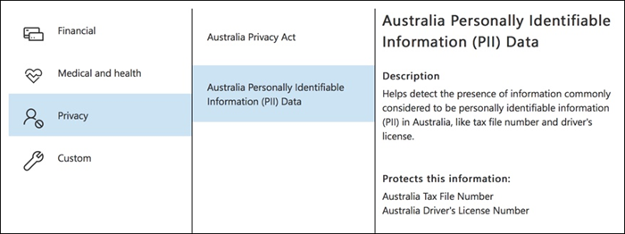
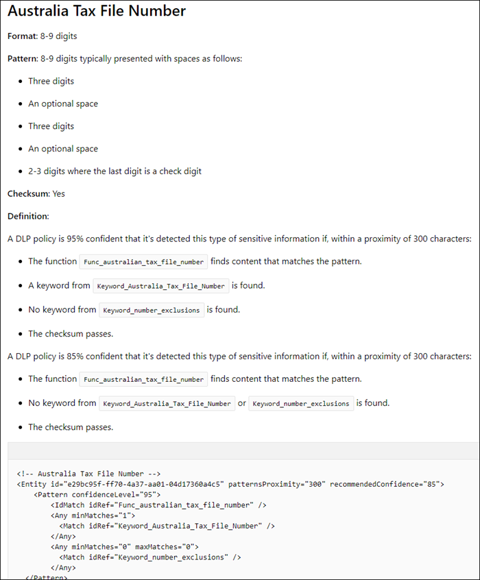
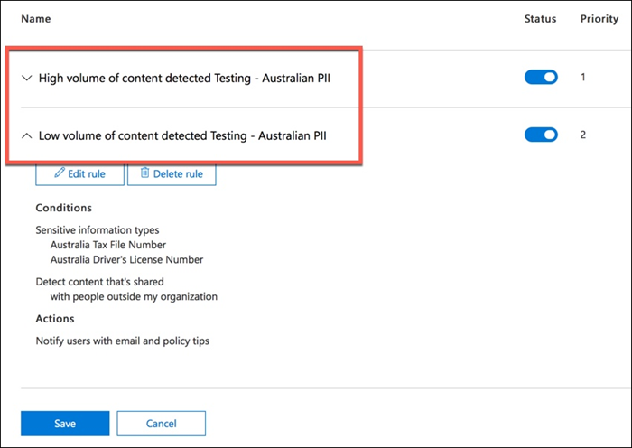

# 建立、測試及調整 DLP 原則Create, test, and tune a DLP policy

資料遺失防護 (DLP) 可協助您防止意外或意外的敏感資訊共用。Data loss prevention (DLP) helps you prevent the unintentional or accidental sharing of sensitive information.

DLP 會檢查電子郵件和檔案的敏感資訊，例如信用卡號碼。DLP examines email messages and files for sensitive information, like a credit card number. 使用 DLP，您可以偵測敏感資訊，並採取下列動作：Using DLP you can detect sensitive information, and take action such as:

- 記錄事件的審計目的Log the event for auditing purposes
- 向傳送電子郵件或共用檔的使用者顯示警告Display a warning to the end user who is sending the email or sharing the file
- 主動封鎖電子郵件或檔案共用發生Actively block the email or file sharing from taking place

## 權限Permissions

您的規範小組中將建立 DLP 原則的成員必須具備規範中心的權限。Members of your compliance team who will create DLP policies need permissions to the Compliance Center. 根據預設，您的租使用者系統管理員可以存取合規性監察官員和其他人員。By default, your tenant admin will have access can give compliance officers and other people access. 請遵循下列步驟：Follow these steps:
  
1. 在 Microsoft 365 中建立一個群組，並將法務人員新增至此群組。Create a group in Microsoft 365 and add compliance officers to it.
    
2. 在安全性與合規性中心的 **[權限]** 頁面上建立角色群組。Create a role group on the **Permissions** page of the Security &amp; Compliance Center. 

3. 建立角色群組時，請使用 [ **選擇角色** ] 區段，將下列角色新增至角色群組： [ **DLP 規範管理**]。While creating the role group, use the **Choose Roles** section to add the following role to the role group: **DLP Compliance Management**.
    
4. 使用 [選擇成員] 區段，將您建立的 Microsoft 365 群組新增至角色群組。Use the **Choose Members** section to add the Microsoft 365 group you created before to the role group.

使用 **VIEW-ONLY Dlp 相容性管理** 角色來建立具有 DLP 原則和 dlp 報告之只供查看許可權的角色群組。Use the **View-Only DLP Compliance Management** role to create role group with view-only privileges to the DLP policies and DLP reports.

如需詳細資訊，請參閱[授與使用者存取 Office 365 合規性中心的權限](../security/office-365-security/grant-access-to-the-security-and-compliance-center.md)。For more information, see [Give users access to the Office 365 Compliance Center](../security/office-365-security/grant-access-to-the-security-and-compliance-center.md).
  
若要建立及套用 DLP 原則，不會強制執行原則，這些許可權是必要的。These permissions are required to create and apply a DLP policy not to enforce policies.

## DLP 偵測到敏感資訊的方式How sensitive information is detected by DLP

DLP 會依正則運算式尋找敏感資訊 (RegEx) 模式比對，以與其他指標（如某些關鍵字接近于相符的模式）搭配。DLP finds sensitive information by regular expression (RegEx) pattern matching, in combination with other indicators such as the proximity of certain keywords to the matching patterns. 例如，簽證的信用卡號碼具有16位數。For example, a VISA credit card number has 16 digits. 不過，這些數位可以以不同的方式寫入，例如1111-1111-1111-1111、1111 1111 1111 1111 或1111111111111111。But, those digits can be written in different ways, such as 1111-1111-1111-1111, 1111 1111 1111 1111, or 1111111111111111.

任何16位數的字串不一定是信用卡號碼，其可能是技術支援人員系統中的票證號碼，或是某一塊硬體的系列號碼。Any 16-digit string is not necessarily a credit card number, it could be a ticket number from a help desk system, or a serial number of a piece of hardware. 為了說明信用卡號碼和無害的16位數位符串之間的差異，會執行 (檢查) 中的計算，以確認號碼符合各種信用卡品牌的已知模式。To tell the difference between a credit card number and a harmless 16-digit string, a calculation is performed (checksum) to confirm that the numbers match a known pattern from the various credit card brands.

如果 DLP 發現關鍵字（如 "簽證" 或 "AMEX"）、可能是信用卡到期日的接近日期值，DLP 也會使用該資料來協助其判斷字串是否為信用卡號碼。If DLP finds keywords such as "VISA" or "AMEX", near date values that might be the credit card expiry date, DLP also uses that data to help it decide whether the string is a credit card number or not.

換句話說，DLP 非常聰明，可辨識電子郵件中這兩個文字字串之間的差異：In other words, DLP is smart enough to recognize the difference between these two strings of text in an email:

- 「您可以定購新的可擕式電腦。"Can you order me a new laptop. 使用我的簽證號碼1111-1111-1111-1111，到期11/22，當您有時，將預估的傳遞日期傳送給我。Use my VISA number 1111-1111-1111-1111, expiry 11/22, and send me the estimated delivery date when you have it."
- 「我的膝上型電腦序號是2222-2222-2222-2222，其購買于11/2010。"My laptop serial number is 2222-2222-2222-2222 and it was purchased on 11/2010. 順便說一來，我的旅行簽證是否已獲批准？By the way, is my travel visa approved yet?"

請參閱 [敏感資訊類型實體定義](sensitive-information-type-entity-definitions.md) ，說明偵測每種資訊類型的方式。See [Sensitive information type entity definitions](sensitive-information-type-entity-definitions.md) that explains how each information type is detected.

## 從資料遺失防護開始的位置Where to start with data loss prevention

當資料洩漏風險不完全顯而易見時，就很難實際開始執行 DLP。When the risks of data leakage aren't entirely obvious, it's difficult to work out where exactly you should start with implementing DLP. 幸運的是，DLP 原則可以在「測試模式」中執行，這樣您就能在開啟之前估量效能和精確度。Fortunately, DLP policies can be run in "test mode", allowing you to gauge their effectiveness and accuracy before you turn them on.

可透過 Exchange 系統管理中心來管理 Exchange Online 的 DLP 原則。DLP policies for Exchange Online can be managed through the Exchange admin center. 不過，您可以透過安全性 & 規範中心設定所有工作負載的 DLP 原則，如此一來，我們將在本文中示範。But you can configure DLP policies for all workloads through the Security & Compliance Center, so that's what I'll use for demonstrations in this article. 在安全性 & 規範中心，您會在 **資料遺失防護** 原則下找到 DLP 原則  >  \*\*\*\*。In the Security & Compliance Center, you'll find the DLP policies under **Data loss prevention** > **Policy**. 選擇 [建立要啟動 **的原則** ]。Choose **Create a policy** to start.

Microsoft 365 提供一系列 [DLP 原則範本](what-the-dlp-policy-templates-include.md) ，您可以用來建立原則。Microsoft 365 provides a range of [DLP policy templates](what-the-dlp-policy-templates-include.md) you can use to create policies. 假設您是澳大利亞公司。Let's say that you're an Australian business. 您可以篩選澳大利亞的範本，並選擇 [金融]、「醫療」和「健康情況」和「隱私權」。You can filter the templates on Australia, and choose Financial, Medical and Health, and Privacy.

在本次示範中，我會選擇澳大利亞個人身分識別資訊 (PII) 資料，其中包含 (TFN) 和駕駛執照號碼的澳大利亞稅收檔編號資訊類型。For this demonstration I'll choose Australian Personally Identifiable Information (PII) Data, which includes the information types of Australian Tax File Number (TFN) and Driver's License Number.

請將新的 DLP 原則命名為 [名稱]。Give your new DLP policy a name. 預設名稱會符合 DLP 原則範本，但您應選擇更具描述性的名稱，因為您可以從同一個範本建立多個原則。The default name will match the DLP policy template, but you should choose a more descriptive name of your own, because multiple policies can be created from the same template.

選擇原則將套用的位置。Choose the locations that the policy will apply to. DLP 原則可以套用到 Exchange Online、SharePoint Online 和商務 OneDrive。DLP policies can apply to Exchange Online, SharePoint Online, and OneDrive for Business. 我要將此原則設定為套用至所有位置。I am going to leave this policy configured to apply to all locations.

在第一個 **原則設定** 步驟中，只要接受預設值即可。At the first **Policy Settings** step, just accept the defaults for now. 您可以自訂 DLP 原則，但預設值是一個不錯的開始位置。You can customize DLP policies, but the defaults are a fine place to start.

按 [下一步] 後，您將會看到其他具有更多自訂選項的 [ **原則設定** ] 頁面。After clicking Next,\*\* you'll be presented with an additional **Policy Settings** page with more customization options. 針對您剛測試的原則，您可以在這裡開始進行一些調整。For a policy that you are just testing, here's where you can start to make some adjustments.

- 現在已經關閉原則提示，這是在您只測試專案，而不想要向使用者顯示任何專案時採取的合理步驟。I've turned off policy tips for now, which is a reasonable step to take if you're just testing things out and don't want to display anything to users yet. 原則提示會向使用者顯示警告，告知您其即將違反 DLP 原則。Policy tips display warnings to users that they're about to violate a DLP policy. 例如，Outlook 使用者將會看到一則警告，指出其附加的檔案包含信用卡號碼，並將拒絕其電子郵件。For example, an Outlook user will see a warning that the file they've attached contains credit card numbers and will cause their email to be rejected. 原則秘訣的目標是先停止不相容的行為，再進行此動作。The goal of policy tips is to stop the non-compliant behaviour before it happens.
- 我也減少了從10到1的實例數目，所以這個原則會偵測所有的澳大利亞 PII 資料共用，而不只是大量的資料共用。I've also decreased the number of instances from 10 to 1, so that this policy will detect any sharing of Australian PII data, not just bulk sharing of the data.
- 我也將另一位收件者新增至附隨報告電子郵件。I've also added another recipient to the incident report email.

最後，我已設定此原則最初在測試模式中執行。Finally, I've configured this policy to run in test mode initially. 請注意，在 [測試模式] 中也有一個用於停用原則提示的選項。Notice there's also an option here to disable policy tips while in test mode. 這可讓您彈性啟用原則中的原則提示，但接著決定是否要在測試期間顯示或隱藏它們。This gives you the flexibility to have policy tips enabled in the policy, but then decide whether to show or suppress them during your testing.

在最後的審閱畫面上，按一下 [ **建立** ] 以完成建立原則。On the final review screen click **Create** to finish creating the policy.

## 測試 DLP 原則Test a DLP policy

新的 DLP 原則會在大約1小時內開始生效。Your new DLP policy will begin to take effect within about 1 hour. 您可以坐下來，等待一般的使用者活動觸發，否則您也可以嘗試自行觸發。You can sit and wait for it to be triggered by normal user activity, or you can try to trigger it yourself. 舊版 I 連結至 [敏感資訊類型實體定義](sensitive-information-type-entity-definitions.md)，可提供有關如何觸發 DLP 相符的資訊。Earlier I linked to [Sensitive information type entity definitions](sensitive-information-type-entity-definitions.md), which provides you with information about how to trigger DLP matches.

舉例來說，我為本文建立的 DLP 原則會偵測到 (TFN) 的澳大利亞稅收檔案編號。As an example, the DLP policy I created for this article will detect Australian tax file numbers (TFN). 根據檔，符合下列準則為基礎。According to the documentation, the match is based on the following criteria.

 
為了以緊密的方式示範 TFN 偵測，具有 "稅收 file number" 字樣的電子郵件，以及接近接近的九位數位符串都是 sail，不會有任何問題。To demonstrate TFN detection in a rather blunt manner, an email with the words "Tax file number" and a 9 digit string in close proximity will sail through without any issues. 不會觸發 DLP 原則的原因是，9位數位符串必須傳遞校驗和，表示它是有效的 TFN，而不只是無害的數位字串。The reason it does not trigger the DLP policy is that the 9-digit string must pass the checksum that indicates it is a valid TFN and not just a harmless string of numbers.

相比之下，具有 "稅收檔號碼" 字樣的電子郵件和傳遞校驗和的有效 TFN 會觸發原則。In comparison, an email with the words "Tax file number" and a valid TFN that passes the checksum will trigger the policy. 在這裡的記錄中，所使用的 TFN 是從網站產生，但不是正版，TFNs。For the record here, the TFN I'm using was taken from a website that generates valid, but not genuine, TFNs. 這類網站非常有用，因為測試 DLP 原則時最常見的錯誤之一是使用不正確虛假號碼，而且不會傳遞校驗和 (，因此不會觸發原則) 。Such sites are very useful because one of the most common mistakes when testing a DLP policy is using a fake number that's not valid and won't pass the checksum (and therefore won't trigger the policy).

附隨報告電子郵件包括所偵測到的敏感資訊類型、偵測到多少個實例，以及偵測的信賴等級。The incident report email includes the type of sensitive information that was detected, how many instances were detected, and the confidence level of the detection.

如果您在測試模式中保留 DLP 原則，並分析附隨報告電子郵件，您可以開始進行 DLP 原則的準確性，以及強制執行它的有效性。If you leave your DLP policy in test mode and analyze the incident report emails, you can start to get a feel for the accuracy of the DLP policy and how effective it will be when it is enforced. 除了附隨報告之外，您還可以 [使用 DLP 報告](view-the-dlp-reports.md) 來查看整個租使用者中原則相符專案的匯總視圖。In addition to the incident reports, you can [use the DLP reports](view-the-dlp-reports.md) to see an aggregated view of policy matches across your tenant.

## 調整 DLP 原則Tune a DLP policy

當您分析原則擊中時，您可能會想要對原則行為的方式進行一些調整。As you analyze your policy hits you might want to make some adjustments to how the policies behave. 簡單的範例是，您可能會判斷電子郵件中的某個 TFN 不是問題 (我認為它仍是，但為了示範) ，我們會告訴它，但有兩個以上的實例是問題。As a simple example, you might determine that one TFN in email is not a problem (I think it still is, but let's go with it for the sake of demonstration), but two or more instances is a problem. 多個實例可能是一種危險案例，例如員工使用從人力資源資料庫到外部方的 CSV 匯出電子郵件，例如外部會計服務。Multiple instances could be a risky scenario such as an employee emailing a CSV export from the HR database to an external party, for example an external accounting service. 絕對您想要偵測和封鎖的內容。Definitely something you would prefer to detect and block.

在 [安全性 & 規範中心] 中，您可以編輯現有的原則來調整行為。In the Security & Compliance Center you can edit an existing policy to adjust the behaviour.

 
您可以調整位置設定，讓原則僅套用至特定工作負載，或套用至特定的網站和帳戶。You can adjust the location settings so that the policy is applied only to specific workloads, or to specific sites and accounts.

您也可以調整原則設定，並編輯規則，以更符合您的需求。You can also adjust the policy settings and edit the rules to better suit your needs.

當您在 DLP 原則中編輯規則時，您可以變更：When editing a rule within a DLP policy you can change:

- 條件，包含會觸發規則的敏感性資料實例類型和數目。The conditions, including the type and number of instances of sensitive data that will trigger the rule.
- 採取的動作，例如限制存取內容。The actions that are taken, such as restricting access to the content.
- 使用者通知：這是在電子郵件客戶程式或網頁瀏覽器中向使用者顯示的原則提示。User notifications, which are policy tips that are displayed to the user in their email client or web browser.
- 使用者覆寫，它會決定使用者是否可以選擇繼續進行電子郵件或檔案共用。User overrides, which determines whether users can choose to proceed with their email or file sharing anyway.
- 附隨報告，以通知系統管理員。Incident reports, to notify administrators.

在本次示範中，我已將使用者通知新增至原則 (請小心執行這項操作，而不需要有足夠的使用者認知訓練) ，而且允許使用者以業務理由覆蓋原則，或將其標記為誤報。For this demonstration I've added user notifications to the policy (be careful of doing this without adequate user awareness training), and allowed users to override the policy with a business justification or by flagging it as a false positive. 請注意，如果您想要包含組織原則的任何其他資訊，請自訂電子郵件和原則提示文字，如果有任何問題，也可以提示使用者與支援人員聯繫。Note that you can also customize the email and policy tip text if you want to include any additional information about your organization's policies, or prompt users to contact support if they have questions.

原則包含兩個處理大量磁片或低容量的規則，因此請務必使用您想要的動作進行編輯。The policy contains two rules for handling of high volume and low volume, so be sure to edit both with the actions that you want. 這是視案例的特性而異的機會。This is an opportunity to treat cases differently depending on their characteristics. 例如，您可以允許覆寫磁片容量低的情況，但不允許對高磁片區違規的覆寫。For example, you might allow overrides for low volume violations, but not allow overrides for high volume violations.

此外，如果您想要實際封鎖或限制存取違反原則的內容，您必須設定規則上的動作來執行此動作。Also, if you want to actually block or restrict access to content that is in violation of policy, you need to configure an action on the rule to do so.

將變更儲存至原則設定後，我也需要回到原則的 [主要設定] 頁面，並啟用此選項，以在原則處於測試模式時，向使用者顯示原則提示。After saving those changes to the policy settings, I also need to return to the main settings page for the policy and enable the option to show policy tips to users while the policy is in test mode. 這是將 DLP 原則引入使用者的有效方式，並進行使用者知曉訓練，但不會冒出影響其生產力的誤報數。This is an effective way to introduce DLP policies to your end users, and do user awareness training, without risking too many false positives that impact their productivity.

在 [伺服器端 (] 或 [雲端端] 如果您想要) ，變更可能不會立即生效，因為不同的處理間隔。On the server side (or cloud side if you prefer), the change may not take effect immediately, due to various processing intervals. 如果您要進行 DLP 原則變更，以向使用者顯示新的原則提示，使用者可能看不到其 Outlook 用戶端中所做的變更會立即生效，這會檢查每24小時執行的原則變更。If you're making a DLP policy change that will display new policy tips to a user, the user may not see the changes take effect immediately in their Outlook client, which checks for policy changes every 24 hours. 如果您想要加快測試速度，您可以使用此註冊表修正程式， [從 PolicyNudges 機碼清除上次下載時間戳記](https://support.microsoft.com/en-au/help/2823261/changes-to-a-data-loss-prevention-policy-don-t-take-effect-in-outlook?__hstc=18650278.46377037dc0a82baa8a30f0ef07a7b2f.1538687978676.1538693509953.1540315763430.3&__hssc=18650278.1.1540315763430&__hsfp=3446956451)。If you want to speed things up for testing, you can use this registry fix to [clear the last download time stamp from the PolicyNudges key](https://support.microsoft.com/en-au/help/2823261/changes-to-a-data-loss-prevention-policy-don-t-take-effect-in-outlook?__hstc=18650278.46377037dc0a82baa8a30f0ef07a7b2f.1538687978676.1538693509953.1540315763430.3&__hssc=18650278.1.1540315763430&__hsfp=3446956451). Outlook 會在您下一次重新開機時下載最新的原則資訊，然後開始撰寫電子郵件訊息。Outlook will download the latest policy information the next time you restart it and begin composing an email message.

如果您已啟用原則提示，使用者就會開始查看 Outlook 中的秘訣，並在發生時向您報告誤報。If you have policy tips enabled, the user will begin to see the tips in Outlook, and can report false positives to you when they occur.

## 調查誤報Investigate false positives

DLP 原則範本並不完全直接離開盒。DLP policy templates are not perfect straight out of the box. 您很可能會發現環境中有一些誤報的情況，這就是為什麼讓您輕鬆地進行 DLP 部署變得如此重要的原因，請花些時間來充分測試及調整原則。It's likely that you'll find some false positives occurring in your environment, which is why it's so important to ease your way into a DLP deployment, taking the time to adequately test and tune your policies.

以下是誤報的範例。Here's an example of a false positive. 這封電子郵件相當無害。This email is quite harmless. 使用者向某人提供其行動電話號碼，並包含他們的電子郵件簽名。The user is providing their mobile phone number to someone, and including their email signature.

 
不過，使用者會看到一個原則提示，告知他們電子郵件包含機密資訊（特別是澳大利亞駕駛執照號碼）。But the user sees a policy tip warning them that the email contains sensitive information, specifically, an Australian driver's license number.

使用者可以報告誤報，而且系統管理員可以深入瞭解發生的原因。The user can report the false positive, and the administrator can look into why it has occurred. 在 [附隨報告] 電子郵件中，會將電子郵件標記為誤報。In the incident report email, the email is flagged as a false positive.

此駕駛執照案例是深入瞭解的一個很好的範例。This driver's license case is a good example to dig into. 這種誤報的原因是，「澳大利亞駕駛執照」類型會由任何9位數位符串 (所觸發，甚至是10位數位符串) 的一部分，在300個字元接近關鍵字 "悉尼 nsw" (不區分大小寫的) 。The reason this false positive has occurred is that the "Australian Driver's License" type will be triggered by any 9-digit string (even one that is part of a 10-digit string), within 300 characters proximity to the keywords "sydney nsw" (not case sensitive). 因此，它會因電話號碼和電子郵件簽章而觸發，只是因為使用者碰巧在悉尼。So it's triggered by the phone number and email signature, only because the user happens to be in Sydney.

其中一個選項是移除來自原則的澳大利亞駕駛執照資訊類型。One option is to remove the Australian driver's license information type from the policy. 因為它是 DLP 原則範本的一部分，但不會強制您使用它。It's in there because it's part of the DLP policy template, but we're not forced to use it. 如果您只對稅收檔編號（而不是驅動程式的授權）感興趣，您可以將它移除。If you're only interested in Tax File Numbers and not driver's licenses, you can just remove it. 例如，您可以從原則中的低容量規則中移除它，但將它保留在高容量規則中，以便仍偵測到多個驅動程式授權清單。For example, you can remove it from the low volume rule in the policy, but leave it in the high volume rule so that lists of multiple drivers licenses are still detected.

 
另一種方法是增加實例計數，這樣只有在有多個實例時，才會偵測到低數量的驅動程式授權。Another option is to simply increase the instance count, so that a low volume of driver's licenses is only detected when there are multiple instances.

除了變更實例計數之外，您也可以調整 (或信賴等級) 的相符精確性。In addition to changing the instance count, you can also adjust the match accuracy (or confidence level). 如果您的敏感資訊類型有多種模式，您可以調整規則中的相符準確度，使規則只符合特定模式。If your sensitive information type has multiple patterns, you can adjust the match accuracy in your rule, so that your rule matches only specific patterns. 例如，若要協助減少誤報，您可以設定規則的符合準確度，使其只符合具有最高信賴度的模式。For example, to help reduce false positives, you can set the match accuracy of your rule so that it matches only the pattern with the highest confidence level. 瞭解信賴等級的計算方式是有點棘手 (而且超出此文章) 的範圍，但是這裡是 [如何使用信賴層級調整規則](data-loss-prevention-policies.md#match-accuracy)的好說明。Understanding how confidence level is calculated is a bit tricky (and beyond the scope of this post), but here's a good explanation of [how to use confidence level to tune your rules](data-loss-prevention-policies.md#match-accuracy).

最後，如果您想要更進一步的掌握，您可以自訂任何敏感資訊類型，例如，您可以從 [澳大利亞駕駛執照號碼](sensitive-information-type-entity-definitions.md#australia-drivers-license-number)的關鍵字清單中移除「悉尼 NSW」，以消除上述假的誤報。Finally, if you want to get even a bit more advanced, you can customize any sensitive information type -- for example, you can remove "Sydney NSW" from the list of keywords for [Australia driver's license number](sensitive-information-type-entity-definitions.md#australia-drivers-license-number), to eliminate the false positive triggered above. 若要瞭解如何使用 XML 和 PowerShell 執行這項操作，請參閱 [自訂內建的敏感資訊類型](customize-a-built-in-sensitive-information-type.md)。To learn how to do this by using XML and PowerShell, see [customizing a built-in sensitive information type](customize-a-built-in-sensitive-information-type.md).

## 開啟 DLP 原則Turn on a DLP policy

當您很樂意您的 DLP 原則正確且有效地偵測敏感資訊類型，而且使用者準備好處理已就地原則的原則之後，即可啟用該原則。When you're happy that your DLP policy is accurately and effectively detecting sensitive information types, and that your end users are ready to deal with the policies being in place, then you can enable the policy.

 
如果您想要查看原則何時生效，請連線 [至安全性 & 合規性中心 PowerShell](/powershell/exchange/connect-to-scc-powershell) ，並執行 [Get-DlpCompliancePolicy Cmdlet](/powershell/module/exchange/get-dlpcompliancepolicy) ，以查看 DistributionStatus。If you're waiting to see when the policy will take effect, [Connect to Security & Compliance Center PowerShell](/powershell/exchange/connect-to-scc-powershell) and run the [Get-DlpCompliancePolicy cmdlet](/powershell/module/exchange/get-dlpcompliancepolicy) to see the DistributionStatus.

開啟 DLP 原則之後，您應該先執行您自己的一些最終測試，以確保發生預期的原則動作。After turning on the DLP policy, you should run some final tests of your own to make sure that the expected policy actions are occurring. 如果您嘗試測試像是信用卡資料之類的內容，則會有網站線上，提供如何產生範例信用卡或其他個人資訊的資訊，這些資訊會透過校驗和觸發您的原則。If you're trying to test things like credit card data, there are websites online with information on how to generate sample credit card or other personal information that will pass checksums and trigger your policies.

允許使用者覆寫的原則會將該選項呈現給使用者，成為原則提示的一部分。Policies that allow user overrides will present that option to the user as part of the policy tip.

限制內容的原則會在原則提示的一部分向使用者呈現警告，並防止他們傳送電子郵件。Policies that restrict content will present the warning to the user as part of the policy tip, and prevent them from sending the email.

## 摘要Summary

資料遺失防護原則對於所有類型的組織都很有用。Data loss prevention policies are useful for organizations of all types. 測試某些 DLP 原則是低風險的執行動作，因為您的控制原則提示、使用者覆寫和附隨報告等專案。Testing some DLP policies is a low risk exercise due to the control you have over things like policy tips, end user overrides, and incident reports. 您可以不知不覺地測試部分 DLP 原則，以查看組織中已發生的違規類型，然後使用低的誤報速率來製作原則，並對使用者提供允許和不允許的專案，然後將 DLP 原則推廣至組織。You can quietly test some DLP policies to see what type of violations are already occurring in your organization, and then craft policies with low false positive rates, educate your users on what is allowed and not allowed, and then roll out your DLP policies to the organization.