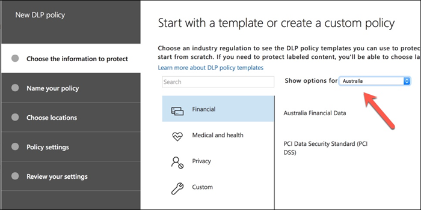

# 建立、測試及調整 DLP 原則

資料遺失防護（DLP）是一項合規性功能，可協助您的組織避免對不想要的敏感資訊的故意或意外洩密。 DLP 在 Exchange Server 和 Exchange Online 中有其根，也適用于 SharePoint 線上和商務 OneDrive。

DLP 使用內容分析引擎檢查電子郵件訊息和檔案的內容，尋找機密資訊（例如信用卡號碼和個人身分識別資訊（PII））。 敏感資訊一般不會以電子郵件傳送，或包含在檔中，而不需要採取其他步驟，例如加密電子郵件訊息或檔案。 使用 DLP，您可以偵測敏感資訊，並採取下列動作：

- 記錄事件的審計目的
- 向傳送電子郵件或共用檔的使用者顯示警告
- 主動封鎖電子郵件或檔案共用發生

有時客戶會解除 DLP，因為他們不會考慮他們需要保護的資料類型。 假設敏感性資料（例如醫療記錄或財務資訊）只會存在於衛生保健或執行線上商店之公司的行業。 不過，任何業務都可以定期處理機密資訊，即使未加以實現也是一樣。 員工姓名和出生日期的試算表，都如同客戶名稱和信用卡詳細資料的試算表一樣機密。 而且這種資訊類型的來源可能會比您預期的更多，因為員工不知不覺地前往日常工作中，請考慮從系統中匯出 CSV 檔案，並將郵件傳送給某人。 您也可能會驚訝的是，員工傳送包含信用卡或銀行詳細資料的電子郵件時，不會考慮結果。

## DLP 偵測到敏感資訊的方式

機密資訊會透過正則運算式（RegEx）模式比對來識別，並與其他指標（如某些關鍵字接近于相符的模式）搭配使用。 這是信用卡號碼的範例。 簽證信用卡號碼具有16位數。 不過，這些數位可以以不同的方式寫入，例如1111-1111-1111-1111、1111 1111 1111 1111 或1111111111111111。

任何16位數的字串不一定是信用卡號碼，它可能是技術支援人員系統中的票證號碼，或是某一塊硬體的系列號碼。 為了說明信用卡號碼和無害的16位數位符串之間的差異，會執行計算（checksum）以確認號碼符合各種信用卡品牌的已知模式。

此外，像是 "簽證" 或 "AMEX" 等關鍵字的接近性，以及可能是信用卡到期日的最接近日期值，也會被視為決定是否要將資料設為信用卡號碼。

換句話說，DLP 通常是智慧化，足以辨識電子郵件中這兩種文字之間的差異：

- 「您可以定購新的可擕式電腦。 使用我的簽證號碼1111-1111-1111-1111，到期11/22，當您有時，將預估的傳遞日期傳送給我。
- 「我的膝上型電腦序號是2222-2222-2222-2222，其購買于11/2010。 順便說一來，我的旅行簽證是否已獲批准？

[保留書簽] 的良好參考是「[機密資訊類型 ' 實體定義](sensitive-information-type-entity-definitions.md)，說明每種資訊類型的偵測方式。

## 從資料遺失防護開始的位置

當資料洩漏風險不完全顯而易見時，就很難實際開始執行 DLP。 幸運的是，DLP 原則可以在「測試模式」中執行，這樣您就能在開啟之前估量效能和精確度。

可透過 Exchange 系統管理中心來管理 Exchange Online 的 DLP 原則。 不過，您可以透過安全性 & 規範中心設定所有工作負載的 DLP 原則，如此一來，我們將在本文中示範。 在 [安全性 & 規範中心] 中，您會在 [**資料遺失防護**] 原則下找到 DLP 原則  >  ** **。 按一下 [**建立要啟動的原則**]。

Microsoft 365 提供一系列[dlp 原則範本](what-the-dlp-policy-templates-include.md)，您可以用來建立 dlp 原則。 假設您是澳大利亞公司。 您可以篩選原則範本，只顯示與澳大利亞相關的使用者，這些範本屬於財務、醫療和健康情況和隱私權等一般類別。

在本次示範中，我將選擇澳大利亞個人身分識別資訊（PII）資料，其中包括澳大利亞稅收檔案編號（TFN）和駕駛執照號碼的資訊類型。

請將新的 DLP 原則命名為 [名稱]。 預設名稱會符合 DLP 原則範本，但您應選擇更具描述性的名稱，因為您可以從同一個範本建立多個原則。

選擇原則將套用的位置。 DLP 原則可以套用到 Exchange Online、SharePoint Online 和商務 OneDrive。 我要將此原則設定為套用至所有位置。

在第一個**原則設定**步驟中，只要接受預設值即可。 您可以在 DLP 原則中執行許多自訂作業，但是預設值是一個不錯的開始位置。

按 **[下一步]** 之後，您將會看到其他具有更多自訂選項的 [**原則設定**] 頁面。 針對您剛測試的原則，您可以在這裡開始進行一些調整。

- 現在已經關閉原則提示，這是在您只測試專案，而不想要向使用者顯示任何專案時採取的合理步驟。 原則提示會向使用者顯示警告，告知您其即將違反 DLP 原則。 例如，Outlook 使用者將會看到一則警告，指出其附加的檔案包含信用卡號碼，並將拒絕其電子郵件。 原則秘訣的目標是先停止不相容的行為，再進行此動作。
- 我也減少了從10到1的實例數目，所以這個原則會偵測所有的澳大利亞 PII 資料共用，而不只是大量的資料共用。
- 我也將另一位收件者新增至附隨報告電子郵件。

最後，我已設定此原則最初在測試模式中執行。 請注意，在 [測試模式] 中也有一個用於停用原則提示的選項。 這可讓您彈性啟用原則中的原則提示，但接著決定是否要在測試期間顯示或隱藏它們。

在最後的審閱畫面上，按一下 [**建立**] 以完成建立原則。

## 測試 DLP 原則

新的 DLP 原則會在大約1小時內開始生效。 您可以坐下來，等待一般的使用者活動觸發，否則您也可以嘗試自行觸發。 舊版 I 連結至[敏感資訊類型實體定義](sensitive-information-type-entity-definitions.md)，可提供有關如何觸發 DLP 相符的資訊。

舉例來說，我為本文建立的 DLP 原則會偵測到澳大利亞稅收檔編號（TFN）。 根據檔，符合下列準則為基礎。

 
為了以緊密的方式示範 TFN 偵測，具有 "稅收 file number" 字樣的電子郵件，以及接近接近的九位數位符串都是 sail，不會有任何問題。 不會觸發 DLP 原則的原因是，9位數位符串必須傳遞校驗和，表示它是有效的 TFN，而不只是無害的數位字串。

相比之下，具有 "稅收檔號碼" 字樣的電子郵件和傳遞校驗和的有效 TFN 會觸發原則。 在這裡的記錄中，所使用的 TFN 是從網站產生，但不是正版，TFNs。 這類網站非常有用，因為測試 DLP 原則時最常見的錯誤之一是使用不正確虛假號碼，而且不會傳遞校驗和（因此不會觸發原則）。

附隨報告電子郵件包括所偵測到的敏感資訊類型、偵測到多少個實例，以及偵測的信賴等級。

如果您在測試模式中保留 DLP 原則，並分析附隨報告電子郵件，您可以開始進行 DLP 原則的準確性，以及強制執行它的有效性。 除了附隨報告之外，您還可以[使用 DLP 報告](view-the-dlp-reports.md)來查看整個租使用者中原則相符專案的匯總視圖。

## 調整 DLP 原則

當您分析原則擊中時，您可能會想要對原則行為的方式進行一些調整。 簡單的範例是，您可能會判斷電子郵件中的某個 TFN 不是問題（我認為它仍然是，但為了示範，我們會告訴它），但有兩個以上的實例是問題。 多個實例可能是一種危險案例，例如員工使用從人力資源資料庫到外部方的 CSV 匯出電子郵件，例如外部會計服務。 絕對您想要偵測和封鎖的內容。

在 [安全性 & 規範中心] 中，您可以編輯現有的原則來調整行為。

 
您可以調整位置設定，讓原則僅套用至特定工作負載，或套用至特定的網站和帳戶。

您也可以調整原則設定，並編輯規則，以更符合您的需求。

當您在 DLP 原則中編輯規則時，您可以變更：

- 條件，包含會觸發規則的敏感性資料實例類型和數目。
- 採取的動作，例如限制存取內容。
- 使用者通知：這是在電子郵件客戶程式或網頁瀏覽器中向使用者顯示的原則提示。
- 使用者覆寫，它會決定使用者是否可以選擇繼續進行電子郵件或檔案共用。
- 附隨報告，以通知系統管理員。

在本次示範中，我已將使用者通知新增至原則（在沒有適當的使用者知曉訓練的情況下，請注意這樣做），並且允許使用者以業務理由覆蓋原則，或將其標記為誤報。 請注意，如果您想要包含組織原則的任何其他資訊，請自訂電子郵件和原則提示文字，如果有任何問題，也可以提示使用者與支援人員聯繫。

原則包含兩個處理大量磁片或低容量的規則，因此請務必使用您想要的動作進行編輯。 這是視案例的特性而異的機會。 例如，您可以允許覆寫磁片容量低的情況，但不允許對高磁片區違規的覆寫。

此外，如果您想要實際封鎖或限制存取違反原則的內容，您必須設定規則上的動作來執行此動作。

將變更儲存至原則設定後，我也需要回到原則的 [主要設定] 頁面，並啟用此選項，以在原則處於測試模式時，向使用者顯示原則提示。 這是將 DLP 原則引入使用者的有效方式，並進行使用者知曉訓練，但不會冒出影響其生產力的誤報數。

在伺服器端（或您想要的雲端端）上，由於各種處理間隔，因此變更可能不會立即生效。 如果您要進行 DLP 原則變更，以向使用者顯示新的原則提示，使用者可能看不到其 Outlook 用戶端中所做的變更會立即生效，這會檢查每24小時執行的原則變更。 如果您想要加快測試速度，您可以使用此註冊表修正程式，[從 PolicyNudges 機碼清除上次下載時間戳記](https://support.microsoft.com/en-au/help/2823261/changes-to-a-data-loss-prevention-policy-don-t-take-effect-in-outlook?__hstc=18650278.46377037dc0a82baa8a30f0ef07a7b2f.1538687978676.1538693509953.1540315763430.3&__hssc=18650278.1.1540315763430&__hsfp=3446956451)。 Outlook 會在您下一次重新開機時下載最新的原則資訊，然後開始撰寫電子郵件訊息。

如果您已啟用原則提示，使用者就會開始查看 Outlook 中的秘訣，並在發生時向您報告誤報。

## 調查誤報

DLP 原則範本並不完全直接離開盒。 您很可能會發現環境中有一些誤報的情況，這就是為什麼讓您輕鬆地進行 DLP 部署變得如此重要的原因，請花些時間來充分測試及調整原則。

以下是誤報的範例。 這封電子郵件相當無害。 使用者向某人提供其行動電話號碼，並包含他們的電子郵件簽名。

 
不過，使用者會看到一個原則提示，告知他們電子郵件包含機密資訊（特別是澳大利亞駕駛執照號碼）。

使用者可以報告誤報，而且系統管理員可以深入瞭解發生的原因。 在 [附隨報告] 電子郵件中，會將電子郵件標記為誤報。

此駕駛執照案例是深入瞭解的一個很好的範例。 這種誤報的原因是，「澳大利亞駕駛執照」類型將會由任何9位數位符串（甚至是10位數位符串的一部分）所觸發，且在300個字元接近于關鍵字 "悉尼 nsw" （不區分大小寫）內。 因此，它會因電話號碼和電子郵件簽章而觸發，只是因為使用者碰巧在悉尼。

其中一個選項是移除來自原則的澳大利亞駕駛執照資訊類型。 因為它是 DLP 原則範本的一部分，但不會強制您使用它。 如果您只對稅收檔編號（而不是驅動程式的授權）感興趣，您可以將它移除。 例如，您可以從原則中的低容量規則中移除它，但將它保留在高容量規則中，以便仍偵測到多個驅動程式授權清單。

 
另一種方法是增加實例計數，這樣只有在有多個實例時，才會偵測到低數量的驅動程式授權。

除了變更實例計數之外，您也可以調整符合精確度（或信賴程度）。 如果您的敏感資訊類型有多種模式，您可以調整規則中的相符準確度，使規則只符合特定模式。 例如，若要協助減少誤報，您可以設定規則的符合準確度，使其只符合具有最高信賴度的模式。 瞭解信賴等級的計算方式有點棘手（但超出此文章的範圍），但是這裡是[如何使用信賴層級調整規則](data-loss-prevention-policies.md#match-accuracy)的好說明。

最後，如果您想要更進一步的掌握，您可以自訂任何敏感資訊類型，例如，您可以從[澳大利亞駕駛執照號碼](sensitive-information-type-entity-definitions.md#australia-drivers-license-number)的關鍵字清單中移除「悉尼 NSW」，以消除上述假的誤報。 若要瞭解如何使用 XML 和 PowerShell 執行這項作業，請參閱本主題：[自訂內建的敏感資訊類型](customize-a-built-in-sensitive-information-type.md)。

## 開啟 DLP 原則

當您很樂意您的 DLP 原則正確且有效地偵測敏感資訊類型，而且使用者準備好處理已就地原則的原則之後，即可啟用該原則。

 
如果您想要查看原則何時生效，請連線[至安全性 & 合規性中心 PowerShell](https://docs.microsoft.com/powershell/exchange/office-365-scc/connect-to-scc-powershell/connect-to-scc-powershell?view=exchange-ps) ，並執行[Get-DlpCompliancePolicy Cmdlet](https://docs.microsoft.com/powershell/module/exchange/get-dlpcompliancepolicy?view=exchange-ps) ，以查看 DistributionStatus。

開啟 DLP 原則之後，您應該先執行您自己的一些最終測試，以確保發生預期的原則動作。 如果您嘗試測試像是信用卡資料之類的內容，則會有網站線上，提供如何產生範例信用卡或其他個人資訊的資訊，這些資訊會透過校驗和觸發您的原則。

允許使用者覆寫的原則會將該選項呈現給使用者，成為原則提示的一部分。

限制內容的原則會在原則提示的一部分向使用者呈現警告，並防止他們傳送電子郵件。

## 摘要

資料遺失防護原則對於所有類型的組織都很有用。 測試某些 DLP 原則是低風險的執行動作，因為您的控制原則提示、使用者覆寫和附隨報告等專案。 您可以不知不覺地測試部分 DLP 原則，以查看組織中已發生的違規類型，然後使用低的誤報速率來製作原則，並對使用者提供允許和不允許的專案，然後將 DLP 原則推廣至組織。
