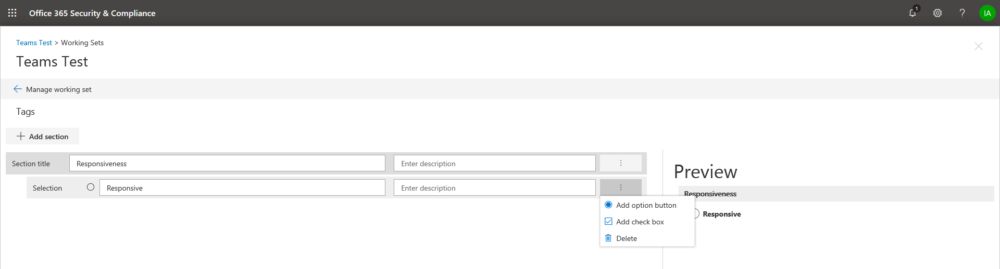

## 建立標籤群組Create tag groups

您或其他人可以檢閱集內標記的文件之前，必須先建立標記。Before you or other people can tag documents in a review set, the tags must be created. 您可以建立包含子系標記的標記群組。You can do this by creating tag groups that contain child tags. 標記會顯示在 [標記] 面板中，當檢閱文件中的檢閱設定。Tags are displayed in the tagging panel when reviewing documents in a review set.

若要建立的標記群組：To create a tag group:

1.  工作集 （，） 中選取 [管理工作設定]。Within the working set, select Manage Working Set.

> 

2.  然後選取 [管理] 標記連結。Then select the Manage tags link.

> 

一次內標記管理] 中，您可建立標記以符合您案例的需求。Once inside the tag management, tags can be created to meet the requirements of your case.

> 首先，建立標籤] 區段中。Start by creating a tag section

1.  按一下 「 新增區段 」 按鈕Click the “Add section” button

> 

|                                                                                                                             |                                                                                                                                                                 |
| --------------------------------------------------------------------------------------------------------------------------- | --------------------------------------------------------------------------------------------------------------------------------------------------------------- |
| 提示Tip | 當您儲存，以便您可以預覽標籤面板，而不需關閉標記的管理] 畫面中，然後回到工作集時，將會更新 [預覽] 畫面。The preview screen will update when you save so you can preview the tag panel without having to close the tag management screen and go back to the working set. |

2.  輸入的標題及選擇性描述。Enter a title and optional description. 若要建立的標記，該區段中，按一下 [在新的標籤] 區段中，若要建立標記該新的區段中的省略符號。To create a tag within that section, click the ellipses on the new tag section to create tags in that new section.
    
    

|                                                                                                                             |                                                                                                                                         |
| --------------------------------------------------------------------------------------------------------------------------- | --------------------------------------------------------------------------------------------------------------------------------------- |
| 提示Tip | 選項標記會強制使用者可以從一群標記選取一個標記。Option tags will force users to select one tag from a group of tags. 核取方塊標記可讓使用者選取標記的任何組合。Check box tags will allow users to select any combination of tags. |

## 巢狀的標記Nested tags

1.  若要內嵌標記，按一下省略符號的**標籤**，然後選取要新增的新標籤。To nest tags, click the ellipses of a **tag** and select a new tag to add.
    
    

