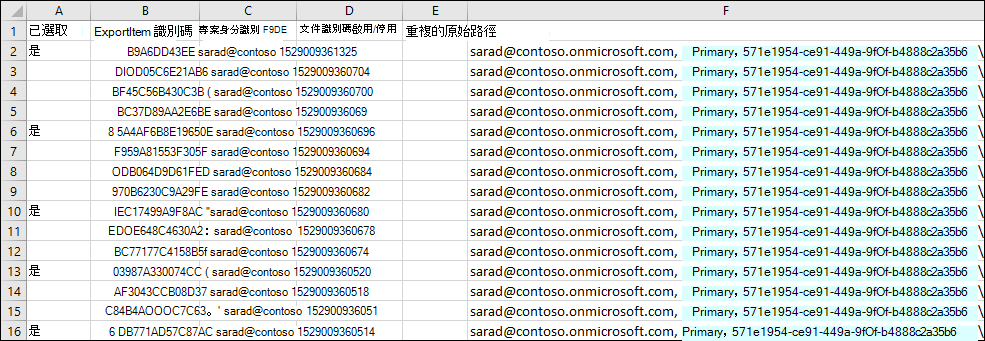

# 準備識別碼清單內容搜尋的 CSV 檔案Prepare a CSV file for an ID list Content Search

您可以使用 Exchange IDs 的清單來搜尋特定的信箱電子郵件訊息和其他信箱專案。You can search for specific mailbox email messages and other mailbox items using a list of Exchange IDs. 若要建立識別碼清單搜尋（正式稱為目標搜尋），請提交逗號分隔值（CSV）檔案，以識別要搜尋的特定信箱專案。To create an ID list search (formally called a targeted search), you submit a comma separated value (CSV) file that identifies the specific mailbox items to search for. 針對此 CSV 檔案，您可以使用匯出內容搜尋結果時所包含的**Results.csv**檔或未**編制索引的 Items.csv**檔案，也可以從現有的內容搜尋中匯出內容搜尋報告。For this CSV file you use the **Results.csv** file or the **Unindexed Items.csv** file that are included when you export the Content Search results or export a Content Search report from and existing Content Search. 然後，編輯這些檔案中的其中一個以指出要搜尋的特定專案，然後建立新的 ID 清單搜尋並提交 CSV 檔案。Then you edit one of these files to indicate the specific items to search for, and then create a new ID list search and submit the CSV file.

以下是建立識別碼清單搜尋之程式的快速概覽。Here's a quick overview of the process for creating an ID list search.

1. 在安全性 & 合規性中心建立並執行新的或導向的內容搜尋。Create and run a new or guided Content Search in the Security & Compliance Center.

2. 匯出內容搜尋結果或匯出內容搜尋報告。Export the content search results or export the content search report. 如需詳細資訊，請參閱：For more information, see:

    - [匯出內容搜尋結果Export Content Search results](export-search-results.md)

    - [匯出內容搜尋報告Export a Content Search report](export-a-content-search-report.md)

3. 編輯**Results.csv**檔或未**編制索引的 Items.csv** ，並識別您想要包含在識別碼清單搜尋中的特定信箱專案。Edit the **Results.csv** file or the **Unindexed Items.csv** and identify the specific mailbox items that you want to include in the ID list search. 請參閱針對識別碼清單搜尋準備 CSV 檔案的[指示](#prepare-the-csv-file-for-an-id-list-search)。See the [instructions](#prepare-the-csv-file-for-an-id-list-search) for preparing a CSV file for an ID list search.

4. 建立新的識別碼清單搜尋（請參閱[指示](#create-an-id-list-search)），並提交您準備的 CSV 檔案。Create a new ID list search (see the [instructions](#create-an-id-list-search)) and submit the CSV file that you prepared. 所建立的搜尋查詢只會搜尋 CSV 檔案中選取的專案。The search query that's created will only search for the items selected in the CSV file.

> [!NOTE]
> 僅支援信箱專案的 ID 清單搜尋。ID list searches are only supported for mailbox items. 您無法在識別碼清單搜尋中搜尋 SharePoint 和 OneDrive 檔。You can't search for SharePoint and OneDrive documents in an ID list search.

 **為何要建立識別碼清單搜尋？****Why create an ID list search?** 如果您無法根據**Results.csv**或非**索引的 Items.csv**檔案中的中繼資料來判斷某個專案是否回應 eDiscovery 要求，您可以使用識別碼清單搜尋來尋找、預覽及匯出該專案，以判斷其是否回應您正在調查的案例。If you're unable to determine if an item is responsive to an eDiscovery request based on the metadata in the **Results.csv** or **Unindexed Items.csv** files, you can use an ID list search to find, preview, and then export that item to determine if it's responsive to the case you're investigating. 識別碼清單搜尋通常是用來搜尋並傳回一組特定的未編制索引的專案。ID list searches are typically used to search for and return a specific set of unindexed items.

## 準備用於識別碼清單搜尋的 CSV 檔案Prepare the CSV file for an ID list search

匯出內容搜尋的搜尋結果或報告之後，您可以執行下列步驟，準備用於識別碼清單搜尋的 CSV 檔案。After you export the search results or report for a content search, you can perform the following steps to prepare the CSV file for an ID list search. 此 CSV 檔案會識別識別碼清單搜尋中的每個專案。This CSV file will identify every item in the ID list search.

請注意，您可以從包含 SharePoint 網站和 OneDrive 帳戶的搜尋中使用 CSV 檔案，但*只能選取識別碼*清單搜尋的信箱專案。Note that you can use a CSV file from a search that included SharePoint sites and OneDrive accounts, but you can select  *only*  mailbox items for an ID list search. 如果您選取 SharePoint 或 OneDrive 中的檔，當您建立識別碼清單搜尋時，CSV 檔案會失敗驗證。If you select a document in SharePoint or OneDrive, the CSV file will fail validation when you create an ID list search.

1. 在 Excel 中開啟**Results.csv**或未**編制索引的 Items.csv**檔案。Open the **Results.csv** or **Unindexed Items.csv** file in Excel.

2. 在 [**選取**] 欄的儲存格中輸入 **[是]** ，對應至您要搜尋的專案。In the **Selected** column, type **Yes** in the cell that corresponds to the item that you want to search for. 針對您要搜尋的每個專案重複此步驟。Repeat this step for every item that you want to search for.

    > [!IMPORTANT]
    > 當您在 Excel 中開啟 CSV 檔案時，檔**識別碼**欄的資料格式會變更為 **[一般**]。When you open the CSV file in Excel, the data format for the **Document ID** column is changed to **General**. 這會導致顯示以科學記數法表示的專案檔案識別碼。This results in displaying the document ID for an item in scientific notation. 例如，檔識別碼 "481037338205" 會顯示為 "4.81037 E + 11"，您必須執行後續步驟，將 [**檔識別碼**] 欄的資料格式變更為 [**數位**]，以還原檔識別碼的正確格式。For example, the document ID of "481037338205" is displayed as "4.81037E+11" You have to perform the next steps to change the data format of the **Document ID** column to **Number** to restore the correct format for the document ID. 否則，使用 CSV 檔案的 ID 清單搜尋會失敗。If you don't do this, the ID list search that uses the CSV file will fail.

3. 以滑鼠右鍵按一下 [整個**檔識別碼**] 欄，然後選取 [**設定儲存格格式**]。Right-click the entire **Document ID** column and select **Format Cells**.

4. 在 [**類別**] 方塊中，按一下 [**數位**]。In the **Category** box, click **Number**.

5. 將小數位位數變更為**0**，然後按一下 **[確定]** 以儲存變更。Change the number of decimal places to **0**, and then click **OK** to save your changes. 請注意，[檔識別碼] 欄中的值會變更為 [數位]。Notice that the values in the Document ID column are changed to numbers.

    以下是可提交識別碼清單內容搜尋之 CSV 檔案的範例。Here's an example of the a CSV file that's ready to be submitted for a ID list content search.

    

6. 儲存 CSV 檔案，或使用另**存**新檔案名儲存檔案。Save the CSV file or use **Save As** to the save the file with different file name. 在這兩種情況下，請務必以 CSV 格式儲存檔案。In both cases, be sure to save the file with the CSV format.

## 建立識別碼清單搜尋Create an ID list search

下一步是建立新的 ID 清單內容搜尋，並提交您在上一個步驟中準備的 CSV 檔案。The next step is to create a new ID list Content Search and submit the CSV file that you prepared in the previous step.

> [!IMPORTANT]
> 從內容搜尋匯出結果或報告之後，您應建立至少2天的 ID 清單搜尋。You should create an ID list search no more than 2 days after exporting the results or report from a Content Search. 如果搜尋結果或報告的輸出超過2天，您應該重新匯出搜尋結果或報表，以產生更新的 CSV 檔案。If the search results or report where exported more than 2 days ago, you should re-export the search results or report to generate updated CSV files. 然後您可以準備其中一個更新的 CSV 檔案，並使用它來建立識別碼清單搜尋。Then you can prepare one of the updated CSV files and use it to create an ID list search.

1. 在安全性 & 規範中心內，移至 [**搜尋** \> **內容搜尋**]。In the Security & Compliance Center, go to **Search** \> **Content search**.

2. 在 [**搜尋**] 頁面上，按一下 [新增圖示] [新增搜尋] 旁的箭  **New search**號，然後按一下 [**依識別碼搜尋] 清單**。On the **Search** page, click the arrow next to  **New search**, and then click **Search by ID List**.

    ![從 [新增搜尋] 下拉式清單中，按一下 [依識別碼搜尋] 清單](../media/e65f9942-09b2-4127-865e-e64029a590df.png)

3. 在 [**依識別碼搜尋] 清單**快顯視窗中，命名搜尋（並選擇性地加以說明），然後按一下 **[流覽]** ，然後選取您在上一個步驟中準備好的 CSV 檔案。On the **Search by ID List** flyout, name the search (and optionally describe it) and then click **Browse** and select the CSV file that you prepared in the previous step.

    Microsoft 365 會嘗試驗證 CSV 檔案。Microsoft 365 attempts to validate the CSV file. 如果驗證失敗，則會顯示錯誤訊息，以協助您疑難排解驗證錯誤。If the validation is unsuccessful, an error message is displayed that might help you troubleshoot the validation errors. CSV 檔案必須成功驗證，才能建立識別碼清單搜尋。The CSV file has to be successfully validated to create an ID list search.

4. 在成功驗證 CSV 檔案之後，按一下 [**搜尋**] 以建立識別碼清單搜尋。After the CSV file is successfully validated, click **Search** to create the ID list search.

    以下是評估搜尋結果的範例，以及針對識別碼清單搜尋產生的查詢。Here's an example of the estimated search results and the query that's generated for an ID list search.

    

    請注意，ID 搜尋的統計資料中所顯示的預估專案數目，應符合您在 CSV 檔案中選取的專案數。Note that the number of estimated items displayed in statistics for the ID search should match the number of items that you selected in the CSV file.

5. 預覽或匯出識別碼清單搜尋傳回的專案。Preview or export the items returned by the ID list search.

> [!NOTE]
> 如果您在建立 ID 清單搜尋之後移動信箱，則搜尋查詢不會傳回指定的專案。If you move a mailbox after creating an ID list search, the query for the search won't return the specified items. 這是因為在移動信箱時，信箱專案的**DocumentId**屬性會變更。That's because the **DocumentId** property for mailbox items are changed when a mailbox is moved. 在您建立 ID 清單搜尋之後移動信箱時，在此情況下，您應該建立新的內容搜尋（或更新現有內容搜尋的搜尋結果），然後匯出搜尋結果或報告，以產生可用來建立新識別碼清單搜尋的更新 CSV 檔案。In the rare instance when a mailbox is moved after you create an ID list search, you should create a new content search (or update the search results for the existing content search) and then export the search results or report to generate updated CSV files that can be used to create a new ID list search.
