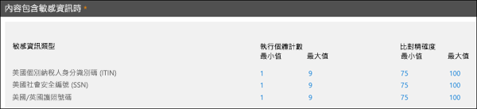

# 自訂敏感性資訊類型

Microsoft 365 包含可供您在組織中使用的許多內建的敏感性資訊類型，例如[資料外洩防護](data-loss-prevention-policies.md) (DLP)，或是 [Microsoft Cloud App Security](https://docs.microsoft.com/cloud-app-security)。 內建的敏感性資訊類型會根據規則運算式 (regex) 或函數所定義的模式，協助識別及保護信用卡卡號、銀行帳戶號碼、護照號碼等。 若要深入了解，請參閱[機密資訊類型尋找的目標為何](what-the-sensitive-information-types-look-for.md)。

不過，如果您需要識別及保護不同類型的敏感性資訊，例如使用您組織特定格式的員工識別碼或專案編號，該怎麼辦？ 若要這麼做，您可以建立自訂敏感性資訊類型。

自訂機密資訊類型的基礎部分如下：

- **主要模式**：員工識別碼、專案編號等等。這通常由規則運算式 (RegEx) 識別，但它也可以是關鍵字清單。

- **其他辨識項**：假設您正在尋找九位數的員工識別碼。並非所有的九位數都是員工識別碼，因此您可以搜尋其他文字：像是 "employee"、"badge"、"ID" 這類的關鍵字，或其他以規則運算式為基礎的文字模式。此支援辨識項 (也稱為_支援_或_確切_辨識項)，可增加在內容中找到的九位數確實為員工識別碼的可能性。

- **字元近似值**：主要模式與支援辨識項彼此越接近，偵測到的內容越可能是您要尋找的內容，這是合理的。您可以指定主要模式與支援辨識項之間的字元距離 (也稱為_近似值視窗_)，如下圖所示：

    

- **信賴等級**：您具有的支援辨識項越多，相符項目包含您要尋找的機密資訊的可能性就越高。您可以針對使用更多辨識項偵測到的相符項目指派更高等級的信賴。

  滿足條件時，模式會傳回計數和信賴等級，您可以在 DLP 原則的條件中使用。當您將會偵測機密資訊類型的條件新增至 DLP 原則時，可以編輯計數和信賴等級，如下圖所示：

    

## 建立自訂敏感性資訊類型

若要在安全性與合規性中心建立自訂敏感性資訊類型，您可以從數個選項中選擇：

- **使用 EDM** 您可以使用以精確資料比對 (EDM) 為基礎的分類來設定自訂敏感性資訊類型。 此方法可讓您使用您可以定期更新的安全資料庫來建立動態敏感性資訊類型。 請參閱[使用以精確資料比對為基礎的分類建立自訂敏感性資訊類型](create-custom-sensitive-information-types-with-exact-data-match-based-classification.md)。

- **使用 PowerShell** 您可以使用 PowerShell 來設定自訂敏感性資訊類型。 雖然此方法比使用 UI 更複雜，但是您有多個組態選項。 請參閱[在安全性與合規性中心 PowerShell 中建立自訂敏感性資訊類型](create-a-custom-sensitive-information-type-in-scc-powershell.md)。

- **使用 UI** 您可以使用安全性與合規性中心 UI 來設定自訂敏感性資訊類型。 使用此方法，您可以使用規則運算式、關鍵字和關鍵字字典。 若要進一步了解，請參閱[建立自訂敏感性資訊類型](create-a-custom-sensitive-information-type.md)。

> [!NOTE]
> Microsoft 365 資訊保護目前在預覽版中支援下列雙位元組字元集語言：
> - 中文 (簡體)
> - 中文 (繁體)
> - 韓文
> - 日文
> 
>此預覽僅限用於商業雲端中，且僅在下列國家/地區推出：
> - 日本
> - 韓國
> - 中國
> - 香港特別行政區
> - 澳門特別行政區
> - 台灣
>
>這項支援適用於敏感性資訊類型。 如需詳細資訊，請參閱[資訊保護支援雙位元組字元集的版本資訊 (預覽版)](mip-dbcs-relnotes.md)。

